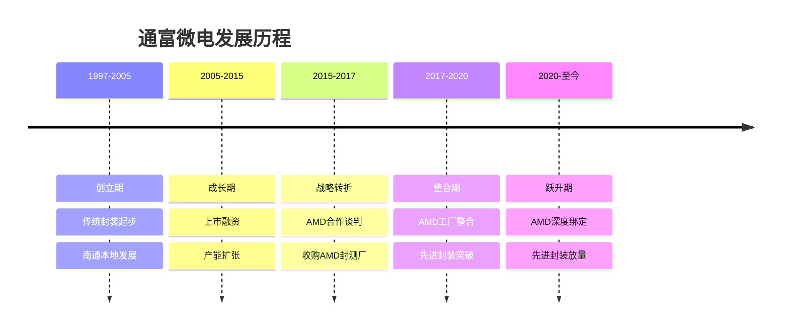
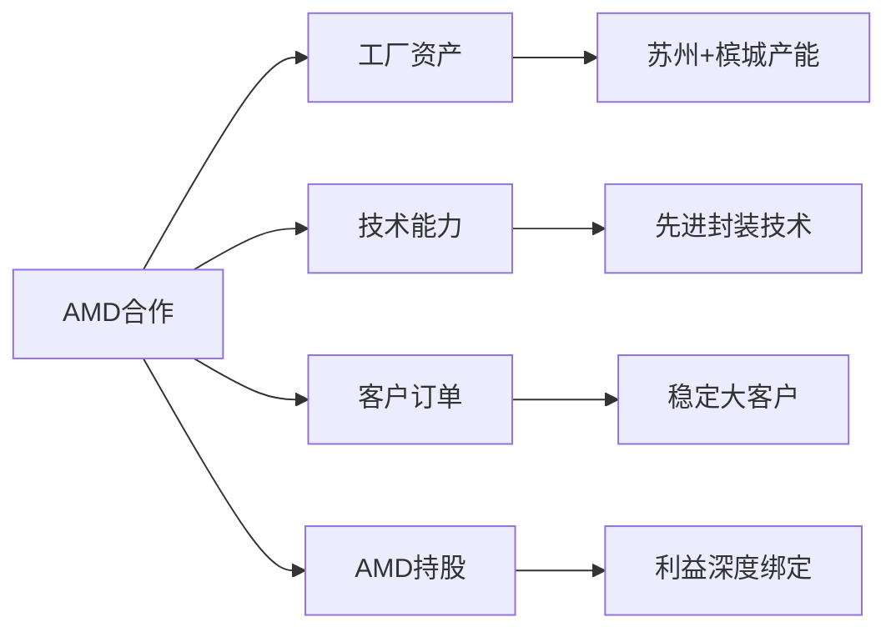
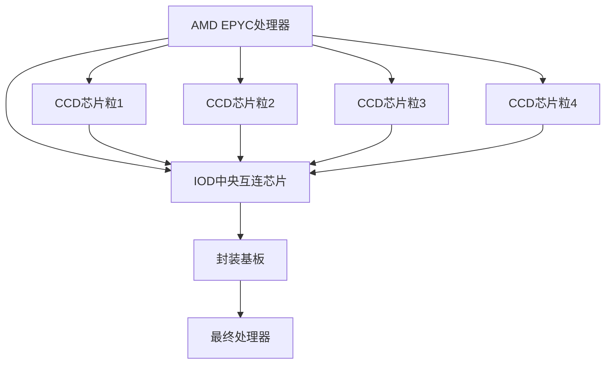
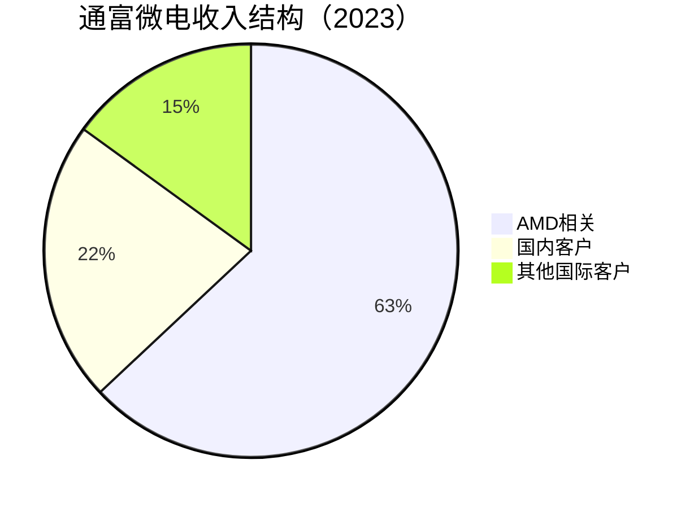

# 通富微电：AMD战略合作伙伴的封测突围

## 公司概况

### 基本信息

**公司名称**：通富微电子股份有限公司（TFME）
**股票代码**：002156.SZ（深交所）
**成立时间**：1997年
**总部位置**：中国江苏南通
**实际控制人**：南通市国资委 + AMD战略持股

**业务范围**：
- 传统封装：引线键合、倒装芯片
- 先进封装：Flip Chip BGA、SiP、2.5D封装
- 测试服务：晶圆测试、成品测试
- 战略合作：AMD全球封测合作伙伴

**市值规模**（2023）：
- 市值：约300亿人民币
- 全球封测市场份额：约5%
- 全球封测排名：第四（中国第二）

### 发展历程

**关键里程碑**：
- 1997年：南通富士通微电子成立（富士通合资）
- 2007年：深交所上市
- 2016年：与AMD签署战略合作协议
- 2017年：收购AMD在苏州、槟城的封测工厂（约3.71亿美元）
- 2018年：AMD封测工厂整合完成，先进封装能力大幅提升
- 2020年：AMD Zen3处理器封测量产
- 2021年：AMD EPYC服务器芯片封测放量，收入突破200亿
- 2022年：AMD RX 7000系列GPU封测
- 2023年：AMD AI芯片（MI系列）封测布局

### 股权结构

**主要股东**：
- 南通市国资委（通过富通集团）：约30%
- AMD：约25%（战略持股，收购对价之一）
- 机构投资者：约30%
- 公众股东：约15%

**AMD持股的战略意义**：
- 利益绑定：AMD持股确保长期合作关系
- 技术转让：AMD封测技术随工厂一并转入
- 订单保障：AMD全球封测需求优先给通富
- 信用背书：国际顶级芯片公司的认可

## 核心竞争力：AMD战略合作

### 合作背景

2016年，AMD面临财务压力，决定将封测业务外包以降低资本支出。通富微电抓住这一战略机遇，以约3.71亿美元收购AMD在苏州（中国）和槟城（马来西亚）的封测工厂，同时AMD以持股25%作为对价的一部分。

**这次合作的战略价值**：

### AMD产品封测范围

**CPU处理器**：
- Ryzen桌面处理器：Zen2/Zen3/Zen4系列
- EPYC服务器处理器：高价值产品
- Threadripper工作站处理器

**GPU显卡**：
- Radeon RX系列：消费级显卡
- Radeon Pro：专业显卡
- Instinct MI系列：AI/HPC加速卡

**半定制芯片**：
- 微软Xbox系列SoC
- 索尼PlayStation系列SoC

**AMD产品特点**：
- 高价值：EPYC、Ryzen均为高端产品
- 先进制程：7nm、5nm、4nm
- 先进封装：Chiplet架构需要先进封装
- 持续增长：AMD市场份额持续提升

### Chiplet封装技术

AMD是Chiplet（小芯片）架构的先驱，通过将CPU分成多个小芯片（CCD、IOD）再封装在一起，实现了性能与成本的最优平衡。这对封测厂的技术要求极高。

**AMD Chiplet架构**：

**封装技术要求**：
- 多芯片集成：4-8个CCD + 1个IOD
- 高精度对准：微米级精度
- 高密度互连：芯片间高速信号
- 散热管理：多芯片热密度高

**通富的技术能力**：
通富微电通过收购AMD工厂，获得了Flip Chip BGA、多芯片封装等先进技术，能够满足AMD Chiplet架构的封装需求，这是通富最核心的技术壁垒。

## 封装技术体系

### 传统封装

**引线键合（Wire Bond）**：
- 应用：中低端芯片、MCU、模拟芯片
- 特点：成本低，工艺成熟
- 占比：约30%收入

**倒装芯片（Flip Chip）**：
- 应用：高性能处理器、GPU
- 特点：性能好，I/O密度高
- 占比：约40%收入

### 先进封装

**Flip Chip BGA（倒装芯片球栅阵列）**：

这是通富最核心的先进封装技术，也是AMD处理器的主要封装形式。

**技术特点**：
- 高I/O密度：数千个焊球
- 高性能：短互连，低损耗
- 大尺寸：支持大芯片封装
- 多芯片：支持Chiplet集成

**技术难点**：
- 基板精度：高密度基板制造
- 焊球均匀性：数千焊球一致性
- 翘曲控制：大尺寸封装翘曲
- 热管理：高功耗芯片散热

**2.5D封装布局**：

随着AI芯片需求爆发，通富正在积极布局2.5D封装（类CoWoS技术），将GPU与HBM内存集成。

**技术路径**：
- 硅中介层：高密度互连
- TSV技术：垂直互连
- HBM集成：高带宽存储
- 目标客户：AMD MI系列AI芯片

**SiP封装**：
- 应用：物联网、可穿戴设备
- 特点：多芯片集成，体积小
- 发展阶段：快速成长期

### 测试能力

**晶圆测试（CP）**：
- 测试机台：数百台
- 覆盖类型：数字、模拟、混合信号
- 与AMD协同：AMD晶圆测试需求

**成品测试（FT）**：
- 测试机台：数千台
- 高端测试：CPU、GPU全功能测试
- 自动化程度：高

## 产能布局

### 生产基地

**南通总部（中国）**：
- 主要产品：传统封装、部分先进封装
- 产能：约占总产能35%
- 特点：本土研发中心，成本优势

**苏州基地（中国）**：
- 来源：2017年收购AMD苏州工厂
- 主要产品：Flip Chip BGA、AMD处理器封装
- 产能：约占总产能35%
- 特点：先进封装核心基地

**槟城基地（马来西亚）**：
- 来源：2017年收购AMD槟城工厂
- 主要产品：AMD处理器封装、测试
- 产能：约占总产能30%
- 特点：服务欧美客户，地缘分散

**产能规模**：
- 引线键合：约100亿颗/年
- 倒装芯片：约30亿颗/年
- 先进封装：约5亿颗/年（快速增长）
- 测试：约200亿颗/年

### 产能扩张计划

**2023-2025年资本支出**：
- 年均资本支出：约30-40亿元
- 重点方向：先进封装产线
- 2.5D封装：新建产线，对应AI芯片需求
- 苏州扩产：AMD订单增长

## 客户结构

### AMD（核心客户）

**AMD占比**：约60-65%收入
**产品覆盖**：CPU、GPU、半定制芯片
**合作深度**：战略合作，AMD持股25%
**增长驱动**：
- AMD市场份额持续提升（vs Intel）
- AI芯片（MI系列）需求爆发
- 服务器EPYC渗透率提升
- 半定制芯片（Xbox、PS）稳定

**AMD市场份额趋势**：

| 年份 | AMD CPU市占率 | AMD GPU市占率 |
|------|-------------|-------------|
| 2019 | 20% | 20% |
| 2021 | 30% | 25% |
| 2023 | 35% | 28% |
| 2025E | 40% | 30% |

AMD市场份额持续提升，直接带动通富封测订单增长。

### 其他客户

**国内芯片设计公司**：
- 华为/海思：部分封测需求
- 紫光展锐：手机芯片
- 兆易创新：存储芯片
- 占比：约20%收入

**国际其他客户**：
- 富士通：历史合作关系
- 其他欧美客户：约15%收入

**客户多元化策略**：
通富正在积极拓展AMD以外的客户，降低单一客户依赖。目标是将AMD占比从65%降至50%，其他客户占比提升至50%。

## 财务分析

### 收入分析

**收入历史**：

| 年份 | 收入（亿元） | 增长率 | 净利润（亿元） | 净利率 |
|------|------------|--------|--------------|--------|
| 2019 | 120 | 8% | 3 | 2.5% |
| 2020 | 140 | 17% | 5 | 3.6% |
| 2021 | 210 | 50% | 12 | 5.7% |
| 2022 | 230 | 10% | 13 | 5.7% |
| 2023E | 200 | -13% | 8 | 4% |

**收入结构**：

### 盈利能力

**毛利率分析**：
- 传统封装毛利率：约15%
- 先进封装毛利率：约22-25%
- 整体毛利率：约18-20%
- 趋势：随先进封装占比提升而改善

**净利率偏低的原因**：
- 重资产：设备折旧大
- 收购债务：AMD工厂收购遗留
- AMD议价：大客户议价能力强
- 汇率影响：槟城基地美元结算

**盈利改善路径**：
- 先进封装占比提升：毛利率更高
- AMD高端产品（EPYC、MI）占比提升：单价更高
- 债务偿还：利息支出减少
- 规模效应：产能利用率提升

### 资本结构

**资产负债率**：约55%（收购带来较高负债）
**年资本支出**：约30-40亿元
**折旧**：约20-25亿元/年
**自由现金流**：约10-15亿元/年

## 竞争优势分析

### 1. AMD战略绑定

通富与AMD的关系是中国封测行业最独特的竞争优势。AMD持股25%，双方利益深度绑定，AMD不可能轻易将订单转移给竞争对手。这种关系提供了：
- 稳定的大客户：60%+收入有保障
- 先进技术：AMD最新封装技术优先导入
- 成长性：AMD市场份额持续提升

### 2. 先进封装技术

通过收购AMD工厂，通富获得了Flip Chip BGA等先进封装技术，能够服务AMD Chiplet架构处理器。这一技术能力是通富区别于华天科技等传统封测厂的核心差异。

### 3. 全球化布局

南通（中国）+ 苏州（中国）+ 槟城（马来西亚）三地布局，既有中国本土成本优势，又有马来西亚基地服务欧美客户，分散地缘风险。

### 4. 国产替代受益

随着国内芯片设计公司（华为、紫光展锐等）快速发展，通富作为国内第二大封测厂，是国产替代的重要受益者。

## 行业趋势与机会

### 1. AMD AI芯片封测机会

**背景**：
AMD MI系列AI加速卡（MI300X等）是英伟达H100的主要竞争对手，需要将GPU与HBM内存通过先进封装集成。

**市场规模**：
- AMD AI芯片收入：2023年约4亿美元，2024E约35亿美元
- 封测价值：约占芯片成本15-20%
- 通富潜在受益：数亿美元增量

**技术要求**：
- 2.5D封装：GPU + HBM集成
- 高精度：微米级对准
- 大尺寸：大芯片封装

**通富布局**：
通富正在积极建设2.5D封装产线，目标是承接AMD MI系列AI芯片封测订单，这是2024-2025年最重要的增长催化剂。

### 2. AMD EPYC服务器芯片增长

**市场背景**：
AMD EPYC服务器处理器市场份额从2019年的5%提升至2023年的25%+，仍在持续增长。

**对通富影响**：
- EPYC是高价值产品，封测单价高
- 市场份额提升直接带动通富订单
- 数据中心投资持续增长

### 3. 半定制芯片稳定增长

**Xbox/PlayStation**：
微软Xbox Series X/S和索尼PS5均使用AMD半定制SoC，通富是主要封测厂。游戏主机换代周期（5-7年）提供稳定订单。

### 4. 国内客户拓展

**目标**：
将国内客户占比从20%提升至30%，降低AMD单一客户依赖。

**重点客户**：
- 华为/海思：AI芯片、手机芯片
- 寒武纪：AI芯片
- 壁仞科技：GPU
- 摩尔线程：GPU

## 投资价值评估

### 估值分析

**当前估值（2023）**：
- PE：约25倍（盈利下滑中）
- PS：约1.2倍
- PB：约2倍
- EV/EBITDA：约7倍

**估值对比**：

| 公司 | PE | PS | 毛利率 | AMD依赖度 | 成长性 |
|------|----|----|--------|---------|--------|
| 通富微电 | 25 | 1.2 | 19% | 60%+ | 高 |
| 长电科技 | 35 | 1.5 | 20% | 无 | 中高 |
| 华天科技 | 20 | 1.0 | 17% | 无 | 中 |
| 日月光 | 15 | 1.2 | 22% | 无 | 中 |

### 投资论点

**看多理由**：
1. AMD深度绑定：60%+收入有保障，AMD持股25%
2. AMD市场份额提升：直接带动订单增长
3. AI芯片机会：AMD MI系列封测，2024-2025年爆发
4. EPYC增长：服务器市场份额持续提升
5. 先进封装技术：Chiplet封装能力稀缺
6. 全球化布局：中国+马来西亚，分散风险
7. 国产替代：国内客户拓展空间大

**看空理由**：
1. 客户集中：AMD占60%+，单一客户风险
2. AMD议价：大客户议价能力强，毛利率受压
3. 净利率低：4-6%，盈利能力弱
4. 重资产：折旧压力大
5. 周期下行：2023年收入下滑13%
6. 2.5D封装：技术追赶，能否获得AMD AI订单存在不确定性

### 投资建议

**适合投资者**：
- 看好AMD成长逻辑的投资者
- 看好AI芯片产业链的投资者
- 中长期价值投资者

**投资策略**：
- 建仓区间：15-18元（当前约20元）
- 持有周期：2-4年
- 目标价：30元+（2025年）
- 止损位：12元

**关键催化剂**：
- AMD AI芯片（MI300X）封测订单确认
- 2.5D封装产线投产
- AMD EPYC市场份额突破30%
- 国内客户占比提升至30%

## 常见问题

### Q1：通富微电与AMD的关系有多稳固？

非常稳固。AMD持股通富25%，双方利益深度绑定。AMD将封测外包给通富是其轻资产战略的核心，短期内不可能改变。即使AMD未来想转移订单，也需要找到具备同等Chiplet封装能力的替代厂商，而这样的厂商极少。唯一风险是AMD自身经营出现重大问题，但这概率极低。

### Q2：AMD AI芯片对通富的影响有多大？

AMD MI300X等AI芯片是2024-2025年最重要的增长催化剂。AMD AI芯片收入预计从2023年的4亿美元增长至2024年的35亿美元，增长近10倍。封测价值约占15-20%，即5-7亿美元。通富作为AMD主要封测合作伙伴，有望获得其中大部分订单，对应收入增量约30-50亿元人民币。

### Q3：通富的2.5D封装能力如何？

通富目前已掌握Flip Chip BGA等先进封装技术，正在积极建设2.5D封装（类CoWoS）产线。相比台积电CoWoS，通富的2.5D封装技术仍有差距，但AMD可能选择通富作为CoWoS的补充产能，或者采用通富的替代技术方案。2024年是关键验证年。

### Q4：客户集中在AMD是否是重大风险？

是的，这是通富最主要的风险。AMD占收入60%+，一旦AMD订单减少（如AMD市场份额下滑、AMD自建封测），通富将受到重大冲击。但考虑到AMD持股25%的利益绑定，以及AMD轻资产战略的坚定性，这一风险在中期内可控。通富也在积极拓展国内客户，降低依赖。

### Q5：通富与长电科技如何比较？

两者各有优势：长电全球化程度更高（中国+新加坡+韩国），客户更多元，先进封装技术更全面；通富则有AMD深度绑定的独特优势，AI芯片机会更直接。从估值看，通富PE（25倍）低于长电（35倍），但长电规模更大、盈利能力更稳定。如果看好AMD成长，通富是更纯粹的标的。

### Q6：马来西亚槟城基地的战略价值是什么？

槟城基地（原AMD工厂）的战略价值在于：第一，服务欧美客户，规避中美贸易摩擦风险；第二，马来西亚是半导体封测重镇，产业配套完善；第三，美元结算，受益于人民币贬值；第四，AMD欧美客户订单可在槟城就近服务。随着地缘政治风险上升，槟城基地的战略价值日益凸显。

## 参考文献

1. 通富微电. 《年度报告》. 2019-2023
2. 中金公司. 《通富微电深度报告：AMD合作伙伴，先进封装新机遇》. 2023
3. 招商证券. 《通富微电：AMD绑定，AI芯片封测受益》. 2023
4. 天风证券. 《封装测试行业研究：先进封装驱动增长》. 2023
5. AMD. 《年度报告》. 2019-2023
6. AMD. 《Chiplet架构技术白皮书》. 2023
7. Yole Development. 《先进封装市场报告》. 2023
8. IDC. 《全球服务器市场预测》. 2023
9. IC Insights. 《封测行业研究》. 2023
10. 中国半导体行业协会. 《中国集成电路产业发展报告》. 2023
11. 麦肯锡. 《半导体封装行业研究》. 2023
12. Gartner. 《半导体市场预测》. 2023
13. 摩根士丹利. 《AMD深度研究报告》. 2023
14. 高盛. 《AI芯片产业链研究》. 2023

---

**投资建议**：
通富微电是AMD全球封测战略合作伙伴，AMD持股25%深度绑定，AMD市场份额持续提升直接带动订单增长。AI芯片（AMD MI系列）封测是2024-2025年最重要的增长催化剂，2.5D封装产线建设是关键看点。当前估值（PE 25倍）相对合理，建议在15-18元区间分批建仓，持有2-4年，目标价30元+。

**风险提示**：
主要风险包括：AMD单一客户集中（60%+）、AMD议价能力强导致毛利率受压、2.5D封装技术追赶不确定性、半导体周期下行、净利率偏低（4-6%）、重资产折旧压力、汇率波动（槟城基地美元结算）等。建议仓位控制在3-5%，密切跟踪AMD AI芯片出货量和通富2.5D封装产线进展。

---

[← 返回半导体行业](index.html)
