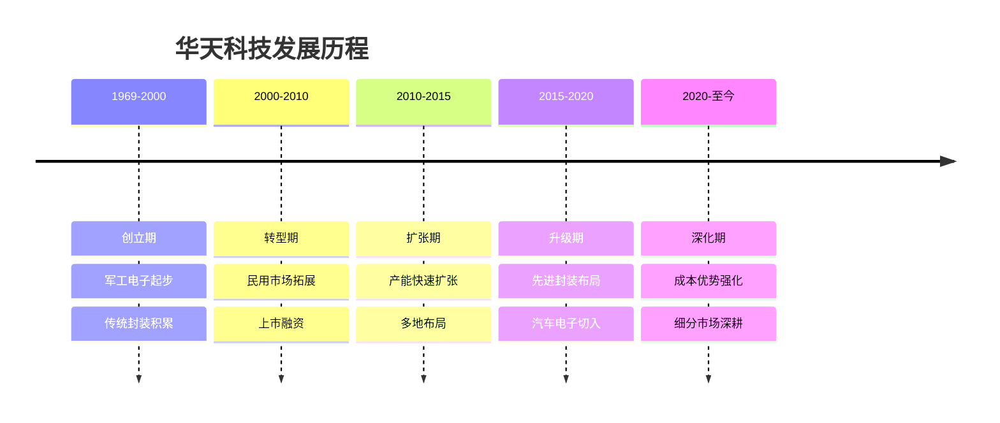
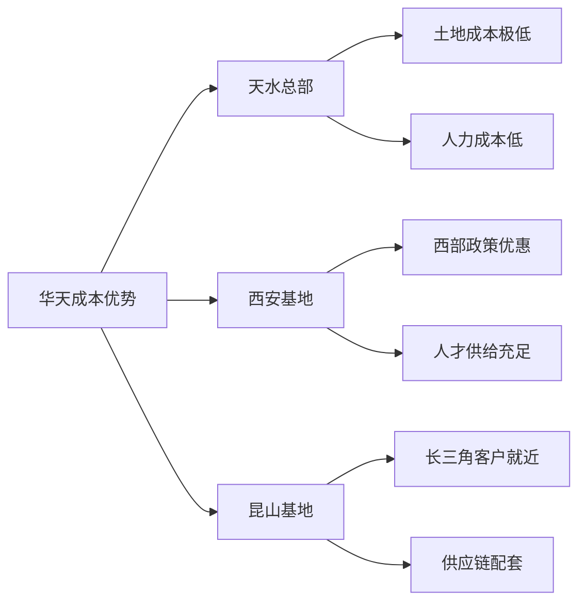
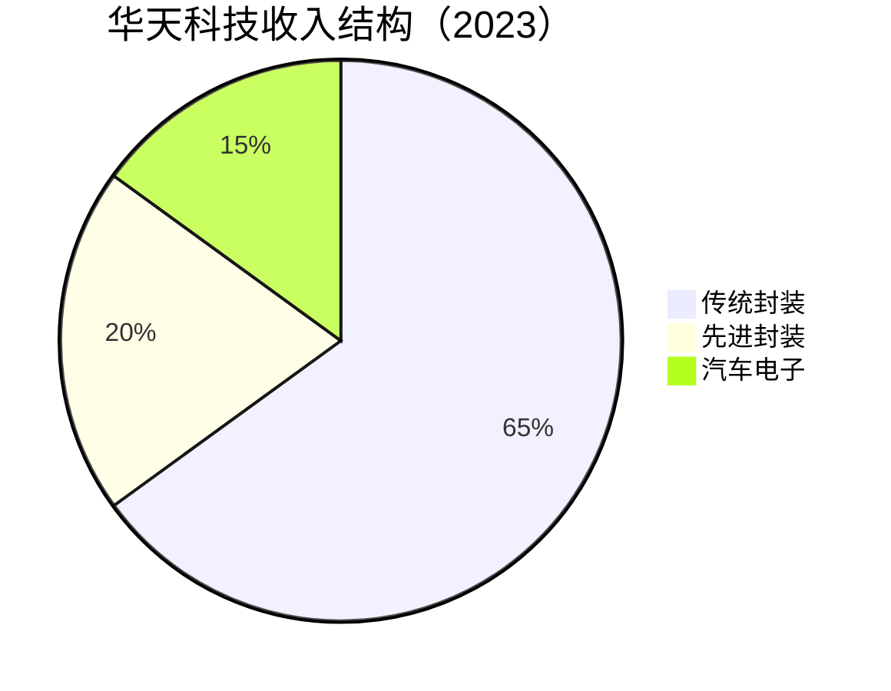

# 华天科技：成本优势封测厂的差异化突围

## 公司概况

### 基本信息

**公司名称**：天水华天科技股份有限公司（Huatian Technology）
**股票代码**：002185.SZ（深交所）
**成立时间**：1969年（前身为天水永红器材厂）
**总部位置**：中国甘肃天水
**实际控制人**：天水市国资委

**业务范围**：
- 传统封装：引线键合、倒装芯片、QFN/DFN
- 先进封装：SiP、Fan-Out、Flip Chip
- 测试服务：晶圆测试、成品测试
- 特色封装：汽车级封装、工业级封装

**市值规模**（2023）：
- 市值：约200亿人民币
- 全球封测市场份额：约4%
- 全球封测排名：第五（中国第三）

### 发展历程

**关键里程碑**：
- 1969年：天水永红器材厂成立（军工背景）
- 2007年：深交所上市
- 2010年：收购昆山华天，布局长三角
- 2014年：西安华天成立，布局关中
- 2016年：先进封装研发中心建立
- 2018年：汽车级封装通过AEC-Q100认证
- 2020年：SiP封装量产
- 2022年：先进封装收入占比超20%
- 2023年：汽车电子封装收入占比超15%

### 股权结构

**主要股东**：
- 天水市国资委（通过华天电子集团）：约35%
- 机构投资者：约35%
- 公众股东：约30%

**国资背景的意义**：
- 政策支持：地方政府全力支持
- 土地成本：天水、西安土地成本低
- 人力成本：西部地区人力成本优势
- 稳定经营：国资背景，经营稳健

## 核心竞争力：成本优势

### 成本优势的来源

华天科技的核心竞争力是成本优势，这来自于其独特的地理布局和运营模式。

**地理成本优势**：

**各基地成本对比**：

| 基地 | 土地成本 | 人力成本 | 政策优惠 | 客户距离 |
|------|---------|---------|---------|---------|
| 天水（甘肃） | 极低 | 极低 | 高 | 远 |
| 西安（陕西） | 低 | 低 | 高 | 中 |
| 昆山（江苏） | 中 | 中 | 中 | 近 |
| 行业平均 | 高 | 高 | 低 | 近 |

**成本优势量化**：
- 综合成本比长三角同类厂商低约15-20%
- 人力成本：比上海、深圳低约30-40%
- 土地成本：天水土地成本约为上海的1/10
- 电力成本：西部电价低，约为东部的70%

### 成本优势的战略价值

在封测行业，成本是重要的竞争维度，尤其对于传统封装产品：
- 传统封装：技术差异小，成本是核心竞争力
- 中低端客户：价格敏感，优先选择低成本供应商
- 国内客户：本土供应商+成本优势，双重吸引力

**成本优势的局限性**：
- 先进封装：技术比成本更重要
- 高端客户：质量和技术优先于成本
- 地理劣势：天水距主要客户较远，物流成本高

## 封装技术体系

### 传统封装（主体业务）

**引线键合（Wire Bond）**：
- 占比：约50%收入
- 特点：成本最低，工艺最成熟
- 应用：MCU、模拟芯片、消费电子
- 优势：华天在此领域成本最低

**QFN/DFN封装**：
- 占比：约20%收入
- 特点：无引脚，体积小，散热好
- 应用：电源管理、射频、传感器
- 优势：汽车电子常用封装形式

**SOP/DIP封装**：
- 占比：约10%收入
- 特点：传统插件/贴片封装
- 应用：工业控制、消费电子
- 特点：成熟市场，稳定需求

### 先进封装（成长业务）

**Flip Chip（倒装芯片）**：
- 占比：约10%收入
- 应用：高性能处理器、网络芯片
- 发展阶段：快速成长
- 目标：提升至20%占比

**SiP（系统级封装）**：
- 应用：物联网、可穿戴、智能家居
- 特点：多芯片集成，体积小
- 客户：国内IoT芯片公司
- 发展阶段：量产阶段

**Fan-Out封装**：
- 应用：手机芯片、电源管理
- 特点：无基板，薄型化
- 发展阶段：小批量量产

### 汽车级封装（特色业务）

汽车电子是华天科技重点布局的差异化方向，也是毛利率最高的业务。

**汽车封装特点**：
- 高可靠性：AEC-Q100认证
- 宽温度范围：-40°C至+150°C
- 长寿命：15年以上
- 严格认证：IATF 16949质量体系

**主要产品**：
- 车规级QFN：ADAS传感器、MCU
- 车规级SOP：电源管理、驱动芯片
- 车规级Flip Chip：车载处理器

**汽车客户**：
- 恩智浦（NXP）：车规MCU
- 英飞凌（Infineon）：功率器件
- 意法半导体（ST）：车规芯片
- 国内车规芯片公司：芯驰科技、地平线等

**汽车业务增长**：
- 2020年：汽车业务占比8%
- 2022年：汽车业务占比12%
- 2023年：汽车业务占比15%
- 2025E：汽车业务占比20%+

## 产能布局

### 生产基地

**天水总部（甘肃）**：
- 成立时间：1969年
- 主要产品：传统封装（Wire Bond、QFN）
- 产能：约占总产能40%
- 特点：成本最低，历史最久

**西安基地（陕西）**：
- 成立时间：2014年
- 主要产品：先进封装、汽车级封装
- 产能：约占总产能35%
- 特点：先进封装研发中心，人才优势

**昆山基地（江苏）**：
- 成立时间：2010年（收购）
- 主要产品：消费电子封装、测试
- 产能：约占总产能25%
- 特点：靠近长三角客户，快速响应

**产能规模**：
- 引线键合：约150亿颗/年
- QFN/DFN：约50亿颗/年
- 先进封装：约3亿颗/年（快速增长）
- 测试：约150亿颗/年

### 产能扩张计划

**2023-2025年资本支出**：
- 年均资本支出：约20-25亿元
- 重点方向：汽车级封装、先进封装
- 西安扩产：先进封装产线
- 天水升级：传统封装自动化改造

## 客户结构

### 国内客户（主体）

**国内客户占比**：约65%收入
**主要客户类型**：
- 国内MCU公司：兆易创新、中颖电子、华大半导体
- 国内模拟芯片：圣邦股份、思瑞浦
- 国内电源管理：芯朋微、南芯半导体
- 国内IoT芯片：乐鑫科技、博通集成

**国内客户特点**：
- 价格敏感：优先选择低成本供应商
- 本土优先：国产替代背景下优先国内封测厂
- 快速增长：国内芯片设计公司快速发展
- 粘性强：工艺定制化，切换成本高

### 国际客户

**国际客户占比**：约35%收入
**主要客户**：
- 恩智浦（NXP）：车规芯片
- 英飞凌（Infineon）：功率器件
- 意法半导体（ST）：MCU、传感器
- 德州仪器（TI）：模拟芯片

**国际客户特点**：
- 汽车/工业为主：高可靠性需求
- 认证门槛高：AEC-Q100、IATF 16949
- 毛利率高：汽车级封装溢价明显
- 稳定性强：汽车供应链切换成本极高

### 客户结构优化方向

**目标**：
- 汽车客户占比：从15%提升至25%
- 先进封装客户：从10%提升至20%
- 国内高端客户：从20%提升至30%

## 财务分析

### 收入分析

**收入历史**：

| 年份 | 收入（亿元） | 增长率 | 净利润（亿元） | 净利率 |
|------|------------|--------|--------------|--------|
| 2019 | 80 | 5% | 4 | 5% |
| 2020 | 90 | 13% | 5 | 5.6% |
| 2021 | 130 | 44% | 10 | 7.7% |
| 2022 | 145 | 12% | 11 | 7.6% |
| 2023E | 130 | -10% | 8 | 6.2% |

**收入结构**：

**收入特点**：
- 规模小于长电、通富：约130亿元
- 净利率相对较高：6-8%（成本优势体现）
- 周期波动较小：传统封装需求稳定
- 汽车业务增长快：15%+年增长

### 盈利能力

**毛利率分析**：
- 传统封装毛利率：约15-17%
- 先进封装毛利率：约20-23%
- 汽车级封装毛利率：约25-28%
- 整体毛利率：约17-19%

**净利率相对较高的原因**：
- 成本优势：西部地区低成本
- 传统封装为主：折旧相对低
- 负债率低：无大型收购债务
- 运营效率：精细化管理

**盈利改善路径**：
- 汽车业务占比提升：毛利率最高
- 先进封装占比提升：毛利率改善
- 成本持续优化：自动化改造
- 规模效应：产能利用率提升

### 资本结构

**资产负债率**：约40%（行业最低之一）
**年资本支出**：约20-25亿元
**折旧**：约12-15亿元/年
**自由现金流**：约8-12亿元/年

**财务健康度**：
华天科技是三大封测厂中财务最健康的，无大型收购债务，资产负债率最低，自由现金流稳定。这为未来扩张提供了充足的财务空间。

## 竞争优势分析

### 1. 成本优势

华天科技最核心的竞争优势是成本，这来自于天水、西安的地理位置。综合成本比长三角同类厂商低15-20%，在传统封装领域具有显著竞争力。

**成本优势的可持续性**：
- 地理位置固定：天水、西安的低成本是长期优势
- 政策持续支持：西部大开发政策长期有效
- 自动化提升：进一步降低人力成本依赖
- 规模效应：产能扩大后成本进一步摊薄

### 2. 汽车电子差异化

华天科技在汽车级封装领域的布局是其差异化战略的核心。汽车封装毛利率（25-28%）显著高于传统封装（15-17%），且汽车供应链切换成本极高，客户粘性强。

**汽车封装壁垒**：
- 认证门槛：AEC-Q100认证需要1-2年
- 质量体系：IATF 16949认证
- 可靠性验证：长期可靠性测试
- 客户审厂：汽车客户严格供应商审核

### 3. 国产替代受益

华天科技是国内中小芯片设计公司的首选封测合作伙伴，原因在于：
- 成本低：价格敏感的中小客户首选
- 服务好：本土厂商沟通便利
- 快速响应：昆山基地靠近长三角客户
- 国产优先：国产替代背景下优先国内封测厂

### 4. 财务稳健

相比长电（收购债务）和通富（AMD工厂收购债务），华天科技资产负债率最低（约40%），财务最健康，为未来扩张提供了充足空间。

## 行业趋势与机会

### 1. 汽车电子爆发

**市场背景**：
智能汽车对芯片需求爆发，单车芯片价值量从传统燃油车的约500美元提升至智能电动车的约1500-2000美元。

**市场规模**：
- 全球汽车封测市场：2023年约80亿美元
- 年增长率：12%+
- 2025E：100亿美元
- 中国汽车封测：约20亿美元，增速更快

**华天机会**：
- 已有AEC-Q100认证，具备车规封装能力
- 国内车规芯片公司（芯驰、地平线）快速增长
- 国际汽车芯片公司（NXP、Infineon）在华扩产
- 目标：汽车业务占比从15%提升至25%

### 2. 国内MCU/模拟芯片国产替代

**市场背景**：
MCU（微控制器）和模拟芯片是国产替代最活跃的领域，国内公司（兆易创新、中颖电子、圣邦股份等）快速成长。

**对华天影响**：
- 国内MCU/模拟芯片公司优先选择国内封测厂
- 华天成本优势+本土服务，是首选合作伙伴
- 国内MCU市场年增长15%+，直接带动华天订单

### 3. IoT/智能家居封装需求

**市场背景**：
物联网设备对SiP封装需求快速增长，要求体积小、功耗低、集成度高。

**华天布局**：
- SiP封装已量产
- 客户：乐鑫科技、博通集成等IoT芯片公司
- 目标：IoT封装收入占比从5%提升至10%

### 4. 工业芯片封装

**市场背景**：
工业自动化、工业互联网推动工业芯片需求增长，工业级封装（-40°C至+85°C）需求稳定。

**华天优势**：
- 历史军工背景：高可靠性封装经验丰富
- 工业级认证：完善的质量体系
- 稳定客户：工业客户切换成本高

## 发展战略

### 战略定位

华天科技的战略定位是"成本领先+细分市场差异化"：
- 传统封装：成本领先，服务价格敏感客户
- 汽车电子：差异化，高毛利细分市场
- 先进封装：追赶，逐步提升技术能力
- 国内客户：深耕，国产替代最大受益者

### 三大战略方向

**1. 汽车电子深化**：
- 扩大车规级封装产能
- 拓展国内车规芯片客户
- 提升汽车业务占比至25%
- 目标：成为国内车规封装领先厂商

**2. 先进封装追赶**：
- 西安基地先进封装产线扩建
- SiP、Fan-Out技术持续投入
- 先进封装占比从20%提升至30%
- 目标：缩小与长电、通富的技术差距

**3. 成本优势强化**：
- 天水、西安基地自动化改造
- 降低人力成本依赖
- 提升产能利用率
- 目标：综合成本比竞争对手低20%+

## 投资价值评估

### 估值分析

**当前估值（2023）**：
- PE：约20倍（盈利相对稳定）
- PS：约1.0倍
- PB：约1.8倍
- EV/EBITDA：约6倍

**估值对比**：

| 公司 | PE | PS | 净利率 | 负债率 | 成长性 |
|------|----|----|--------|--------|--------|
| 华天科技 | 20 | 1.0 | 6% | 40% | 中 |
| 长电科技 | 35 | 1.5 | 4% | 55% | 中高 |
| 通富微电 | 25 | 1.2 | 4% | 55% | 高 |
| 日月光 | 15 | 1.2 | 8% | 50% | 中 |

**估值逻辑**：
- 成本优势：支撑相对稳定的盈利
- 汽车电子：估值溢价来源
- 规模较小：估值折价因素
- 财务健康：低负债率支撑估值

### 投资论点

**看多理由**：
1. 成本优势：西部地区低成本，长期可持续
2. 汽车电子：高毛利细分市场，快速增长
3. 国产替代：国内MCU/模拟芯片公司首选封测厂
4. 财务健康：负债率最低，扩张空间大
5. 净利率较高：6-8%，优于长电、通富
6. 估值合理：PE 20倍，相对低估
7. 稳健经营：国资背景，经营稳健

**看空理由**：
1. 规模较小：收入约130亿，规模效应弱于长电
2. 先进封装落后：技术能力弱于长电、通富
3. 成长性有限：缺乏AMD这样的大客户绑定
4. 地理劣势：天水距主要客户远，物流成本高
5. 周期下行：2023年收入下滑10%
6. 客户分散：无单一大客户，议价能力弱

### 投资建议

**适合投资者**：
- 偏好稳健、低风险的投资者
- 看好汽车电子长期趋势的投资者
- 看好国产替代（MCU/模拟）的投资者

**投资策略**：
- 建仓区间：10-12元（当前约13元）
- 持有周期：2-3年
- 目标价：18元+（2025年）
- 止损位：8元

**关键催化剂**：
- 汽车业务占比突破20%
- 先进封装收入占比突破25%
- 国内MCU/模拟芯片客户订单增长
- 净利率回升至8%+

## 常见问题

### Q1：华天科技的成本优势能持续多久？

成本优势来自天水、西安的地理位置，这是长期结构性优势，不会轻易消失。西部大开发政策持续，土地和人力成本优势长期存在。随着自动化程度提升，人力成本依赖降低，成本优势的可持续性进一步增强。预计未来5-10年，华天的成本优势仍将维持。

### Q2：华天科技与长电、通富的差距在哪里？

主要差距在于：规模（华天收入约130亿，长电约290亿，通富约200亿）、先进封装技术（华天先进封装占比20%，长电40%，通富35%）、全球化程度（华天主要在国内，长电有新加坡/韩国，通富有马来西亚）、大客户绑定（华天无类似AMD的战略大客户）。但华天净利率（6%）高于长电（4%）和通富（4%），财务更健康。

### Q3：汽车电子对华天的战略意义是什么？

汽车电子是华天最重要的差异化战略。汽车级封装毛利率（25-28%）显著高于传统封装（15-17%），且汽车供应链切换成本极高，一旦进入客户供应链，关系极为稳定。华天已获得AEC-Q100认证，服务NXP、Infineon等国际汽车芯片公司，随着国内车规芯片公司（芯驰、地平线）快速成长，华天汽车业务有望持续高增长。

### Q4：华天科技的先进封装能力如何追赶？

华天在西安建立了先进封装研发中心，重点发展SiP、Fan-Out、Flip Chip技术。相比长电、通富，华天先进封装技术仍有差距，但在IoT、可穿戴等细分市场已有量产能力。华天的策略是"差异化追赶"：不与长电、通富在高端先进封装（2.5D/3D）正面竞争，而是聚焦IoT、汽车等细分市场的先进封装需求。

### Q5：天水总部的地理劣势如何克服？

天水距主要客户（长三角、珠三角）较远，物流成本是劣势。华天的解决方案是：第一，昆山基地靠近长三角客户，提供快速响应；第二，天水基地主要生产标准化产品，对交货周期要求相对低；第三，随着西部客户（西安、成都电子产业）增长，天水基地的地理劣势逐步减弱。

### Q6：国产替代对华天的影响有多大？

国产替代是华天最重要的增长驱动之一。国内MCU、模拟芯片、IoT芯片公司快速成长，这些公司优先选择国内封测厂，而华天的成本优势+本土服务使其成为首选。预计国产替代每年为华天带来10-15亿元的增量收入，是未来3-5年的核心增长驱动之一。

## 参考文献

1. 华天科技. 《年度报告》. 2019-2023
2. 中金公司. 《华天科技深度报告：成本优势+汽车电子，差异化突围》. 2023
3. 招商证券. 《华天科技：成本领先，汽车电子高增长》. 2023
4. 天风证券. 《封装测试行业研究：先进封装驱动增长》. 2023
5. 华泰证券. 《华天科技竞争力分析》. 2023
6. Yole Development. 《汽车半导体封装市场报告》. 2023
7. IDC. 《全球汽车芯片市场预测》. 2023
8. IC Insights. 《封测行业研究》. 2023
9. 中国半导体行业协会. 《中国集成电路产业发展报告》. 2023
10. 麦肯锡. 《半导体封装行业研究》. 2023
11. Gartner. 《半导体市场预测》. 2023
12. 恩智浦. 《年度报告》. 2023
13. 英飞凌. 《年度报告》. 2023
14. 意法半导体. 《年度报告》. 2023
15. 中国汽车工业协会. 《中国汽车芯片产业发展报告》. 2023

---

**投资建议**：
华天科技是中国第三大封测厂，成本优势显著（西部地区低成本），汽车电子差异化布局（毛利率25-28%），国产替代受益（MCU/模拟芯片首选封测厂），财务最健康（负债率40%，净利率6%）。当前估值（PE 20倍）相对合理偏低，建议在10-12元区间分批建仓，持有2-3年，目标价18元+。

**风险提示**：
主要风险包括：规模较小（收入约130亿）、先进封装技术落后于长电/通富、缺乏大客户战略绑定、天水总部地理劣势（物流成本高）、半导体周期下行、汽车电子认证周期长（1-2年）等。建议仓位控制在3-5%，密切跟踪汽车业务占比和先进封装收入增长。

---

[← 返回半导体行业](index.html)
