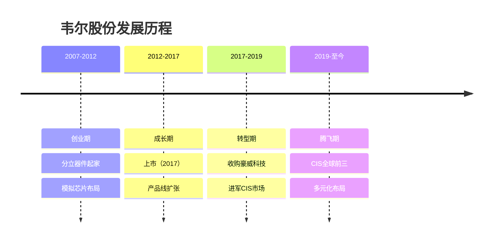
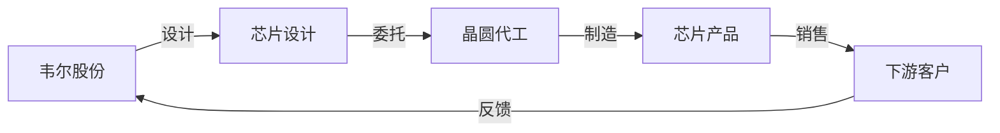
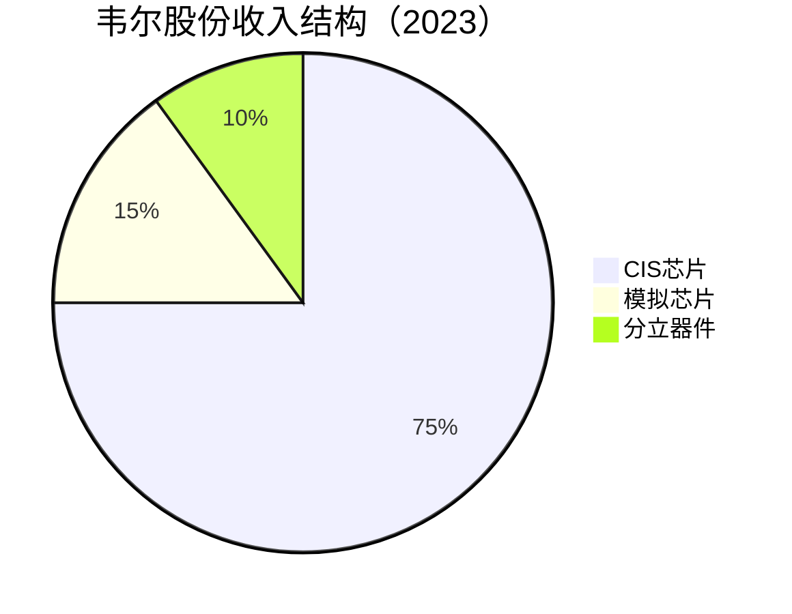
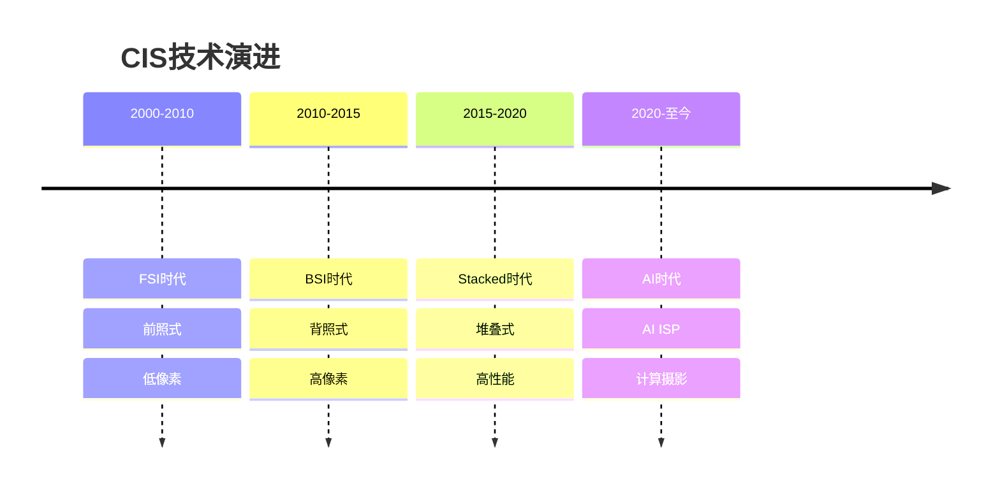
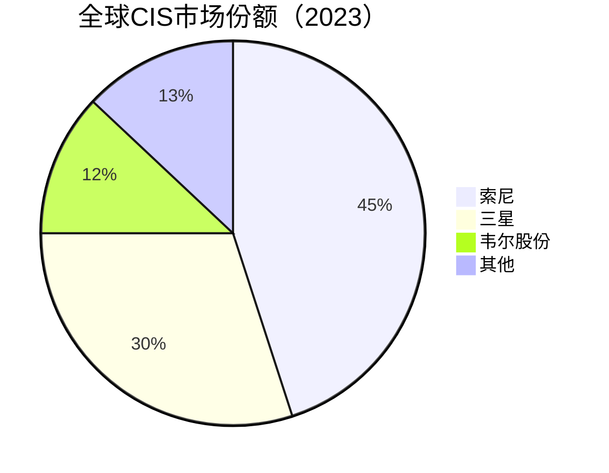

# 韦尔股份：中国CIS芯片龙头

## 公司概况

### 基本信息

**公司名称**：上海韦尔半导体股份有限公司（Will Semiconductor）
**股票代码**：603501.SH（上海主板）
**成立时间**：2007年5月
**总部位置**：中国上海
**创始人**：虞仁荣

**业务范围**：
- CIS（图像传感器）芯片：核心业务
- 模拟芯片：电源管理、信号链
- 分立器件：TVS、MOSFET
- 应用领域：手机、汽车、安防、医疗

**市值规模**（2023）：
- 市值：约1500亿人民币
- 中国最大CIS芯片设计公司
- 全球CIS市场份额第三

### 发展历程

**关键里程碑**：
- 2007年：公司成立，从事分立器件
- 2012年：进入模拟芯片领域
- 2017年：上海主板上市
- 2019年：完成收购豪威科技（OmniVision）
- 2020年：CIS市场份额全球第三
- 2021年：收入突破200亿
- 2023年：汽车CIS快速增长

### 收购豪威科技

**交易详情**：
- 交易时间：2019年
- 交易金额：约120亿人民币
- 交易方式：发行股份+现金
- 标的资产：豪威科技100%股权

**豪威科技背景**：
- 成立时间：1995年
- 创始人：洪筱英、邓中翰
- 历史地位：曾是全球CIS龙头
- 技术积累：20+年CIS研发经验
- 专利储备：3000+项专利

**收购意义**：
- 技术获取：获得全球领先CIS技术
- 市场地位：跻身全球前三
- 客户资源：继承豪威客户群
- 产品线：完善产品矩阵
- 战略转型：从分立器件到CIS龙头

## 商业模式分析

### Fabless模式

**无晶圆厂模式**：
- 专注芯片设计
- 委托代工制造
- 轻资产运营
- 高毛利率

**产业链位置**：

**代工合作伙伴**：
- 台积电：先进制程
- 中芯国际：成熟制程
- 华虹半导体：特色工艺
- 其他：多元化供应链

### 业务结构

**按产品分类**：

**按应用分类**：
- 手机：50%
- 汽车：20%
- 安防：15%
- 医疗/工业：10%
- 其他：5%

**按客户分类**：
- 中国客户：60%
- 海外客户：40%
- 前五大客户：50%+

## CIS芯片技术分析

### CIS技术原理

**图像传感器作用**：
- 光电转换：将光信号转换为电信号
- 图像采集：捕捉场景信息
- 数字输出：输出数字图像数据

**CIS vs CCD**：

| 特性 | CIS（CMOS） | CCD |
|------|------------|-----|
| 功耗 | 低 | 高 |
| 成本 | 低 | 高 |
| 集成度 | 高 | 低 |
| 速度 | 快 | 慢 |
| 市场份额 | 95%+ | <5% |

**CIS技术演进**：

### 韦尔CIS技术能力

**技术平台**：
- FSI（前照式）：成熟产品
- BSI（背照式）：主流产品
- Stacked（堆叠式）：高端产品
- AI ISP：智能图像处理

**像素技术**：
- 0.7μm：业界最小
- 0.8μm：主流产品
- 0.9μm：高端产品
- 1.0μm+：专业应用

**产品矩阵**：
- 手机：8MP-200MP
- 汽车：1MP-8MP
- 安防：2MP-12MP
- 医疗：高分辨率、高帧率

**技术优势**：
- 像素技术：0.7μm全球领先
- 堆叠技术：Stacked BSI
- HDR技术：高动态范围
- 低光性能：夜景拍摄
- AI算法：计算摄影

## 市场地位分析

### 全球CIS市场

**市场规模**：
- 2023年：约200亿美元
- 年增长率：8-10%
- 2025E：250亿美元

**市场格局**：

**竞争格局**：
- 第一梯队：索尼（45%）
- 第二梯队：三星（30%）
- 第三梯队：韦尔（12%）、SK海力士、安森美

### 韦尔市场地位

**全球排名**：
- 整体市场：第三
- 手机市场：第三
- 汽车市场：前五
- 安防市场：第一

**市场份额变化**：
- 2019年：8%
- 2020年：10%
- 2021年：11%
- 2022年：12%
- 2023年：12%+

**增长驱动**：
- 手机多摄：单机CIS数量增加
- 像素升级：高像素渗透
- 汽车智能化：车载摄像头增加
- 安防升级：高清化、智能化

## 竞争优势分析

### 1. 技术优势

**像素技术领先**：
- 0.7μm：全球最小
- 良率高：量产能力强
- 性能优：低光、HDR

**产品线完整**：
- 低端到高端：全覆盖
- 手机到汽车：多应用
- 标准到定制：灵活性强

**研发能力强**：
- 研发人员：2000+
- 研发费用率：10%+
- 专利数量：5000+

### 2. 客户优势

**手机客户**：
- 小米：核心供应商
- OPPO/vivo：重要供应商
- 华为：合作伙伴
- 三星：部分机型

**汽车客户**：
- 特斯拉：供应商
- 比亚迪：核心供应商
- 蔚来/理想：合作伙伴
- Tier 1：博世、大陆

**安防客户**：
- 海康威视：核心供应商
- 大华股份：核心供应商
- 宇视科技：合作伙伴

### 3. 成本优势

**规模效应**：
- 出货量大：成本摊薄
- 采购议价：原材料成本低
- 制造效率：良率高

**供应链优势**：
- 多家代工厂：分散风险
- 本地化：响应快
- 定制化：满足特殊需求

### 4. 国产替代优势

**政策支持**：
- 国产芯片优先
- 供应链安全
- 本地化服务

**客户粘性**：
- 技术支持：本地团队
- 响应速度：快速迭代
- 定制化：满足特殊需求

## 财务分析

### 收入分析

**收入增长**：
- 2018年：30亿人民币
- 2019年：120亿（收购豪威）
- 2020年：200亿
- 2021年：240亿
- 2022年：260亿
- 2023E：280亿
- CAGR（2019-2023）：25%+

**收入驱动**：
- 手机多摄：单机价值量提升
- 汽车智能化：车载CIS增长
- 安防升级：高清化、智能化
- 市场份额：持续提升

**收入结构变化**：
- CIS占比：从60%提升至75%
- 汽车占比：从5%提升至20%
- 高端产品：占比持续提升

### 盈利能力

**毛利率**：
- 2019年：25%
- 2020年：30%
- 2021年：35%
- 2022年：32%
- 2023E：33%

**毛利率驱动**：
- 产品结构：高端产品占比提升
- 规模效应：成本摊薄
- 技术领先：溢价能力
- 竞争加剧：价格压力

**净利率**：
- 2020年：10%
- 2021年：15%
- 2022年：12%
- 2023E：13%

**ROE**：
- 2021年：25%
- 2022年：18%
- 2023E：20%

### 现金流

**经营现金流**：
- 2021年：40亿+
- 2022年：35亿+
- 2023E：40亿+
- 现金流稳定

**资本支出**：
- 年资本支出：5-10亿
- 主要用于：研发设备、测试设备
- 轻资产模式

**现金储备**：
- 现金及等价物：50亿+
- 资产负债率：40%
- 财务健康

### 财务健康度

**资产负债表**：
- 资产负债率：40%
- 流动比率：2.0
- 速动比率：1.5

**偿债能力**：
- 利息覆盖倍数：10+倍
- 债务/EBITDA：1-2倍
- 财务风险：低

## 投资价值评估

### 估值分析

**历史估值区间**：
- PE：30-80倍
- PS：5-12倍
- PB：4-10倍

**当前估值（2023）**：
- PE：约40倍
- PS：约5倍
- PB：约6倍

**估值对比**：

| 公司 | PE | PS | PB | 市值（亿美元） | 业务 |
|------|----|----|----|--------------|----|
| 韦尔股份 | 40 | 5 | 6 | 200 | CIS+模拟 |
| 索尼半导体 | 25 | 4 | 3 | 1000+ | CIS龙头 |
| 卓胜微 | 50 | 10 | 8 | 100 | 射频芯片 |
| 兆易创新 | 35 | 6 | 5 | 80 | 存储+MCU |

### 投资论点

**看多理由**：
1. **CIS龙头**：全球第三，中国第一
2. **技术领先**：0.7μm像素，堆叠技术
3. **客户优质**：小米、特斯拉、海康
4. **成长空间**：手机多摄、汽车智能化
5. **国产替代**：受益于供应链安全
6. **盈利改善**：规模效应，毛利率提升
7. **估值合理**：PE 40倍，相对合理

**看空理由**：
1. **竞争激烈**：索尼、三星强势
2. **客户集中**：前五大客户占比高
3. **周期性强**：手机市场波动
4. **技术差距**：与索尼仍有差距
5. **估值偏高**：PE 40倍，不便宜

### 投资建议

**适合投资者**：
- 看好CIS行业的投资者
- 看好国产替代的投资者
- 能承受波动的成长投资者
- 关注半导体行业的投资者

**投资策略**：
- 建仓区间：150-180元
- 持有周期：2-3年
- 目标价：250元+
- 止损位：120元

**风险控制**：
- 仓位：不超过10%
- 关注：手机出货量、汽车CIS进展
- 调整：根据业绩动态调整

## 行业趋势与机会

### 1. 手机多摄趋势

**多摄渗透**：
- 2018年：双摄为主
- 2020年：三摄普及
- 2022年：四摄/五摄
- 2025E：六摄+

**单机价值量**：
- 2018年：10美元
- 2020年：15美元
- 2022年：20美元
- 2025E：25美元+

**高像素趋势**：
- 主摄：50MP→108MP→200MP
- 超广角：12MP→48MP
- 长焦：8MP→48MP

### 2. 汽车智能化

**车载摄像头增长**：
- L2级：5-8个摄像头
- L3级：8-12个摄像头
- L4级：12-20个摄像头

**市场规模**：
- 2023年：30亿美元
- 2025E：50亿美元
- 2030E：100亿美元
- CAGR：15%+

**技术要求**：
- 高可靠性：车规级
- 宽温度范围：-40°C至125°C
- 高动态范围：HDR
- 低光性能：夜视

**韦尔布局**：
- 产品线：1MP-8MP
- 客户：特斯拉、比亚迪
- 市场份额：快速提升
- 增长潜力：巨大

### 3. 安防升级

**高清化趋势**：
- 2MP→4MP→8MP→12MP
- 4K普及，8K布局

**智能化趋势**：
- AI ISP：智能分析
- 边缘计算：本地处理
- 低光性能：星光级

**市场规模**：
- 2023年：20亿美元
- 2025E：25亿美元
- CAGR：5-8%

### 4. 新兴应用

**医疗影像**：
- 内窥镜：高分辨率
- 手术机器人：3D视觉
- 远程医疗：高清传输

**工业视觉**：
- 机器视觉：质量检测
- 机器人：视觉导航
- 无人机：航拍、巡检

**AR/VR**：
- 眼球追踪：高帧率
- 手势识别：3D感知
- 空间定位：SLAM

## 竞争对手分析

### 索尼（Sony）

**市场地位**：
- 全球第一：45%市场份额
- 技术领先：堆叠技术、AI ISP
- 客户优质：苹果、华为、小米

**竞争优势**：
- 技术积累：30+年
- 垂直整合：自有晶圆厂
- 品牌溢价：高端市场

**韦尔对比**：
- 技术差距：1-2代
- 市场份额：索尼4倍
- 成本优势：韦尔更低

### 三星（Samsung）

**市场地位**：
- 全球第二：30%市场份额
- 技术领先：ISOCELL技术
- 客户：三星手机为主

**竞争优势**：
- 垂直整合：自有晶圆厂
- 技术研发：大规模投入
- 生态协同：三星手机

**韦尔对比**：
- 技术差距：1-2代
- 市场份额：三星2.5倍
- 客户多元：韦尔更广

### SK海力士

**市场地位**：
- 全球第四：5%市场份额
- 技术：中高端产品
- 客户：韩国、中国

**韦尔对比**：
- 市场份额：韦尔领先
- 技术水平：相当
- 成长性：韦尔更强

## 投资启示

### 1. 技术领先的重要性

**持续研发**：
- 研发费用率：10%+
- 研发人员：2000+
- 技术迭代：快速

**技术突破**：
- 0.7μm像素：全球领先
- 堆叠技术：追赶索尼
- AI ISP：智能化

### 2. 客户资源的价值

**优质客户**：
- 小米：核心供应商
- 特斯拉：汽车CIS
- 海康：安防龙头

**客户粘性**：
- 技术支持：深度合作
- 定制化：满足需求
- 长期合作：稳定关系

### 3. 多元化布局

**应用多元化**：
- 手机：核心业务
- 汽车：高成长
- 安防：稳定增长
- 新兴：未来布局

**风险分散**：
- 降低单一市场依赖
- 平滑周期波动
- 提升估值

### 4. 国产替代机遇

**供应链安全**：
- 客户主动转单
- 本地化服务
- 定制化能力

**政策支持**：
- 国产芯片优先
- 税收优惠
- 产业基金

## 常见问题

### Q1：韦尔能追上索尼吗？

**回答**：
- 短期：不可能
- 中期：缩小差距
- 长期：有机会
- 关键：持续研发、客户认证

**差距分析**：
- 技术：1-2代
- 市场份额：4倍
- 品牌：索尼更强
- 成本：韦尔更低

### Q2：手机市场饱和怎么办？

**回答**：
- 多摄趋势：单机价值量提升
- 高像素：产品升级
- 汽车市场：新增长点
- 新兴应用：AR/VR、医疗

### Q3：什么时候买入韦尔股份？

**回答**：
- 估值：PE < 35倍
- 股价：150-180元
- 时机：手机出货量回升、汽车CIS突破
- 策略：分批建仓

### Q4：韦尔vs卓胜微，选哪个？

**回答**：
- 韦尔：CIS龙头，规模大，估值低
- 卓胜微：射频芯片，成长快，估值高
- 建议：根据风险偏好选择，或两者都配置

## 延伸阅读

### 推荐书籍

1. **《图像传感器技术》** - 中村修二
2. **《CMOS图像传感器设计》** - 王国裕
3. **《芯片战争》** - 克里斯·米勒
4. **《半导体制造技术》** - 迈克尔·夸克

### 研究报告

- 韦尔股份年报和季报
- 各大券商韦尔股份深度报告
- CIS行业研究报告
- 手机产业链研究报告

### 行业资讯

- IC Insights：全球半导体市场报告
- Yole：CIS市场研究报告
- Counterpoint：手机市场研究
- Strategy Analytics：汽车电子研究

## 参考文献

1. 韦尔股份. 《年度报告》. 2018-2023
2. IC Insights. 《全球CIS市场报告》. 2023
3. Yole. 《图像传感器市场研究》. 2023
4. 中金公司. 《韦尔股份深度报告》. 2023
5. 招商证券. 《韦尔股份投资价值分析》. 2023
6. 天风证券. 《CIS行业研究》. 2023
7. 华泰证券. 《韦尔股份产品分析》. 2023
8. Counterpoint. 《全球手机市场报告》. 2023
9. Strategy Analytics. 《汽车CIS市场预测》. 2023
10. 克里斯·米勒. 《芯片战争》. 2022

---

**投资建议**：
韦尔股份是中国CIS芯片龙头，全球市场份额第三，受益于手机多摄、汽车智能化、国产替代等多重驱动。技术领先（0.7μm像素）、客户优质（小米、特斯拉、海康）、成长空间大。当前估值PE 40倍，处于合理区间。建议看好CIS行业和国产替代的投资者在150-180元区间分批建仓，持有2-3年，目标价250元+。

**风险提示**：
需要关注手机市场波动、竞争加剧（索尼、三星）、客户集中度高、技术突破不确定性等风险。建议仓位控制在10%以内，设置止损位120元，密切跟踪手机出货量、汽车CIS进展和竞争格局变化。

---

[← 返回半导体行业](index.html)
