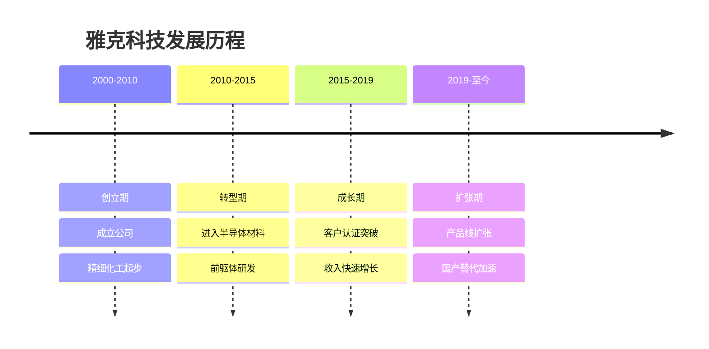
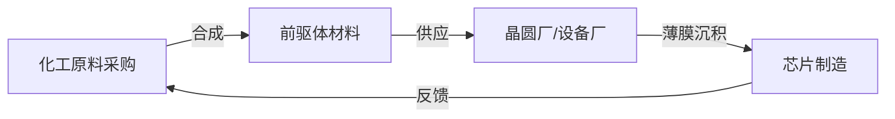
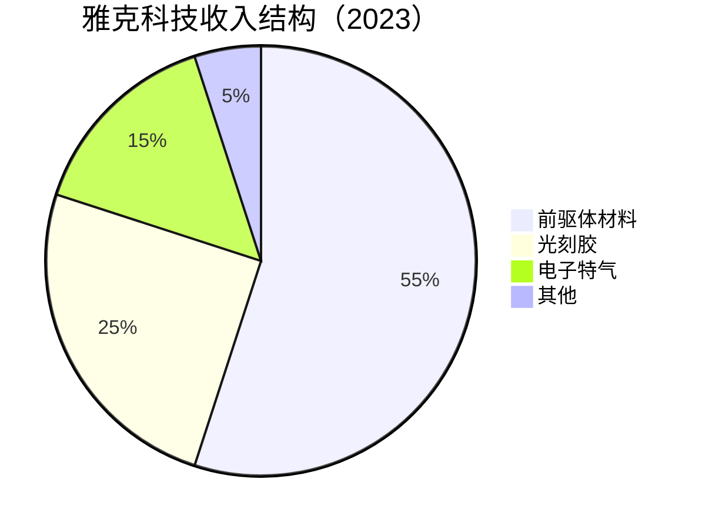
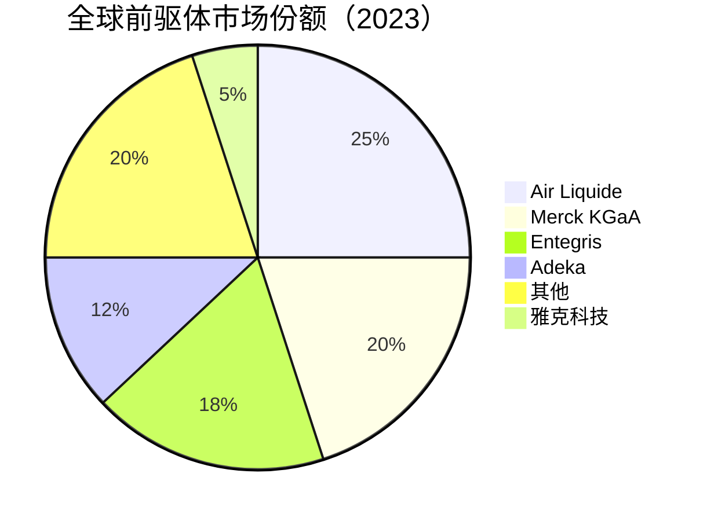

# 雅克科技：半导体前驱体材料龙头

## 公司概况

### 基本信息

**公司名称**：雅克科技股份有限公司（Yake Technology Co., Ltd.）
**股票代码**：002409.SZ（深交所）
**成立时间**：2000年
**总部位置**：中国深圳
**实际控制人**：张勇（创始人）

**业务范围**：
- 前驱体材料：ALD/CVD前驱体，核心业务
- 光刻胶：KrF、ArF光刻胶
- 电子特气：高纯特种气体
- 功能性材料：其他半导体材料

**市值规模**（2023）：
- 市值：约200亿人民币
- 中国前驱体材料龙头
- 全球前驱体市场份额约5%

### 发展历程



**关键里程碑**：
- 2000年：公司成立，从事精细化工
- 2012年：开始研发半导体前驱体材料
- 2015年：首批前驱体产品通过客户认证
- 2017年：进入中芯国际供应链
- 2019年：收购科美特，扩展光刻胶业务
- 2021年：前驱体收入突破5亿元
- 2023年：产品覆盖前驱体、光刻胶、电子特气

### 股权结构

**主要股东**：
- 张勇（创始人）：约35%
- 机构投资者：约40%
- 公众股东：约25%

**战略意义**：
- 民营企业：市场化运营
- 创始人控制：战略稳定
- 机构认可：专业投资者持股

## 商业模式分析

### 半导体材料供应商模式

**业务模式**：


**产业链位置**：
- 上游：化工原料（金属有机化合物、特种气体）
- 中游：半导体材料（雅克科技）
- 下游：晶圆代工厂（中芯国际、台积电）

**商业模式特点**：
- 技术密集：合成工艺复杂，纯度要求极高
- 认证周期长：客户认证1-2年
- 客户粘性强：一旦认证，不易更换
- 定制化：根据客户工艺定制
- 小批量高价值：单价高，毛利率高

### 业务结构

**按产品分类**：


**按客户分类**：
- 中芯国际：30%
- 华虹半导体：20%
- 长江存储：15%
- 其他国内客户：25%
- 海外客户：10%

## 前驱体材料技术分析

### 前驱体材料原理

**什么是前驱体**：
前驱体（Precursor）是ALD（原子层沉积）和CVD（化学气相沉积）工艺中使用的化学原料，用于在硅片表面沉积各种薄膜材料。

**核心作用**：
- 薄膜沉积：在芯片表面形成功能薄膜
- 栅极介质：High-K介质层（HfO₂等）
- 阻挡层：金属阻挡层（TiN、TaN等）
- 种子层：铜互连种子层

**ALD工艺原理**：
```mermaid
graph TD
    A[前驱体A脉冲] -->|吸附| B[表面饱和吸附]
    B -->|吹扫| C[去除多余前驱体]
    C -->|前驱体B脉冲] D[表面反应]
    D -->|吹扫| E[去除副产物]
    E -->|循环| A
    E -->|完成| F[单原子层薄膜]
```

**技术要求**：
- 纯度：99.9999%（6N）以上
- 挥发性：适当的蒸气压
- 热稳定性：在工艺温度下稳定
- 反应活性：与表面充分反应
- 副产物：无害、易去除

### 主要前驱体产品

**1. High-K介质前驱体**

**产品类型**：
- TDMAH（四二甲氨基铪）：HfO₂介质
- TDMAT（四二甲氨基钛）：TiO₂介质
- TEOS（正硅酸乙酯）：SiO₂介质
- TMA（三甲基铝）：Al₂O₃介质

**应用场景**：
- 栅极介质：28nm以下先进制程
- 电容介质：DRAM存储器
- 隔离层：器件隔离

**技术难点**：
- 纯度控制：金属杂质<1ppb
- 水分控制：<10ppm
- 颗粒控制：<10个/mL
- 稳定性：长期储存稳定

**雅克能力**：
- TDMAH：已量产，供应中芯国际
- TDMAT：已量产，供应多家客户
- 纯度：达到6N标准
- 认证：通过28nm制程认证

**2. 金属有机前驱体**

**产品类型**：
- TiCl₄（四氯化钛）：TiN阻挡层
- TaCl₅（五氯化钽）：TaN阻挡层
- WF₆（六氟化钨）：钨填充
- Cu(hfac)₂：铜种子层

**应用场景**：
- 金属阻挡层：防止铜扩散
- 金属填充：接触孔、通孔填充
- 铜互连：先进制程互连

**技术难点**：
- 腐蚀性：强腐蚀性，储存困难
- 纯度：金属杂质极低
- 安全性：有毒，需特殊处理

**雅克能力**：
- TiCl₄：已量产
- TaCl₅：已量产
- 安全处理：完善的安全体系

**3. 硅基前驱体**

**产品类型**：
- TEOS（正硅酸乙酯）：SiO₂沉积
- DCS（二氯硅烷）：Si₃N₄沉积
- HCDS（六氯乙硅烷）：SiN沉积
- 3DMAS（三二甲氨基硅烷）：SiO₂ ALD

**应用场景**：
- 氧化层：器件隔离、栅极氧化
- 氮化层：刻蚀阻挡层、应力层
- 低介电常数材料：互连层间介质

**雅克能力**：
- TEOS：成熟产品，大批量供应
- DCS：已量产
- 3DMAS：研发中

### 光刻胶产品

**产品线**：
- KrF光刻胶：248nm波长，28nm-90nm制程
- ArF光刻胶：193nm波长，28nm-7nm制程
- i线光刻胶：365nm波长，成熟制程

**技术难点**：
- 分辨率：线宽控制
- 灵敏度：曝光能量
- 对比度：图形清晰度
- 附着力：与基底的结合

**市场地位**：
- KrF光刻胶：国内领先
- ArF光刻胶：研发中，认证阶段
- 市场份额：国内约5%

**竞争格局**：
- 日本JSR：全球第一（30%）
- 日本信越化学：全球第二（20%）
- 日本东京应化：全球第三（15%）
- 雅克科技：国内领先，全球5%

### 电子特气产品

**产品类型**：
- 高纯氨气（NH₃）：氮化硅沉积
- 高纯氧化亚氮（N₂O）：氧化层沉积
- 高纯氯化氢（HCl）：刻蚀工艺
- 混合气体：定制化混合

**纯度要求**：
- 标准：99.9999%（6N）
- 杂质：<1ppm
- 水分：<1ppm
- 颗粒：<10个/L

**市场地位**：
- 国内市场份额：约8%
- 主要客户：中芯国际、华虹半导体
- 竞争对手：华特气体、南大光电

## 市场地位分析

### 全球前驱体市场

**市场规模**：
- 2023年：约30亿美元
- 年增长率：10-15%
- 2025E：38亿美元
- 驱动因素：先进制程扩产、ALD工艺普及

**市场格局**：


**竞争特点**：
- 高度集中：欧美日企业主导
- 技术壁垒：合成工艺复杂
- 认证壁垒：客户认证周期长
- 定制化：根据客户工艺定制

### 中国前驱体市场

**市场规模**：
- 2023年：约8亿美元
- 全球占比：27%
- 年增长率：20%+
- 2025E：12亿美元

**自给率**：
- 整体自给率：约15%
- 高端前驱体：<5%
- 成熟制程前驱体：约30%
- 目标：2025年达到25%

**国产替代空间**：
- 中国需求：8亿美元
- 国产供应：1.2亿美元
- 进口依赖：6.8亿美元
- 替代空间：巨大

### 雅克科技市场地位

**全球排名**：
- 前驱体：全球前十
- 中国市场：第一

**市场份额**：
- 全球市场：约5%
- 中国市场：约15%
- 增长趋势：快速提升

**客户结构**：
- 中芯国际：最大客户（30%）
- 华虹半导体：重要客户（20%）
- 长江存储：核心客户（15%）
- 其他：35%

## 竞争优势分析

### 1. 技术优势

**合成技术**：
- 自主研发：核心合成工艺
- 专利保护：100+专利
- 纯化技术：6N纯度
- 分析技术：痕量分析

**产品覆盖**：
- 前驱体：20+品种
- 光刻胶：KrF、ArF
- 电子特气：10+品种
- 产品线：持续扩展

**技术突破**：
- TDMAH：国内首家量产
- ArF光刻胶：研发突破
- 高纯特气：6N纯度

### 2. 客户优势

**战略客户**：
- 中芯国际：长期合作伙伴
- 华虹半导体：稳定供应
- 长江存储：新兴客户
- 台积电：认证中

**客户粘性**：
- 认证周期：1-2年
- 工艺绑定：深度嵌入客户工艺
- 定制化：满足特殊需求
- 本地化：快速响应

### 3. 国产替代优势

**政策支持**：
- 大基金：间接支持
- 税收优惠：高新技术企业
- 地方政府：产业支持
- 客户意愿：主动国产化

**本地化优势**：
- 快速响应：本地团队
- 技术支持：深度服务
- 成本优势：人力成本低
- 定制化：满足特殊需求

### 4. 规模优势

**产能规模**：
- 前驱体：年产100吨+
- 光刻胶：年产500吨+
- 电子特气：年产1000吨+
- 持续扩产

**规模效应**：
- 原材料采购：批量优惠
- 生产效率：规模摊薄
- 研发投入：规模支撑
- 客户服务：规模保障

## 财务分析

### 收入分析

**收入增长**：
- 2019年：8亿人民币
- 2020年：10亿
- 2021年：14亿
- 2022年：18亿
- 2023E：23亿
- CAGR（2019-2023）：30%

**收入驱动**：
- 产品线扩张：前驱体、光刻胶、特气
- 客户拓展：新客户导入
- 国产替代：市场份额提升
- 价格稳定：长期合约锁定

### 盈利能力

**毛利率**：
- 2019年：35%
- 2020年：38%
- 2021年：40%
- 2022年：42%
- 2023E：43%

**净利率**：
- 2019年：12%
- 2020年：14%
- 2021年：16%
- 2022年：18%
- 2023E：20%

**ROE**：
- 2022年：18%
- 2023E：22%
- 2025E：28%+

### 财务数据表（2019-2023）

| 指标 | 2019 | 2020 | 2021 | 2022 | 2023E |
|------|------|------|------|------|-------|
| 收入（亿） | 8 | 10 | 14 | 18 | 23 |
| 增长率 | 25% | 25% | 40% | 29% | 28% |
| 毛利率 | 35% | 38% | 40% | 42% | 43% |
| 净利率 | 12% | 14% | 16% | 18% | 20% |
| 净利润（亿） | 1.0 | 1.4 | 2.2 | 3.2 | 4.6 |
| ROE | 14% | 16% | 18% | 20% | 22% |
| 经营现金流（亿） | 1.5 | 2.0 | 3.0 | 4.0 | 5.5 |
| 资本支出（亿） | 2 | 3 | 4 | 5 | 6 |
| 资产负债率 | 35% | 33% | 32% | 30% | 28% |

**财务特点**：
- 轻资产：相对硅片厂，资本支出小
- 高毛利：技术壁垒带来高毛利
- 盈利稳定：持续盈利，ROE提升
- 现金流好：经营现金流充裕

## 投资价值评估

### 估值分析

**当前估值（2023）**：
- PE：约45倍
- PS：约9倍
- PB：约8倍
- EV/EBITDA：约30倍

**估值对比**：

| 公司 | PE | PS | PB | 市值（亿美元） | 业务 | 毛利率 | 净利率 |
|------|----|----|----|--------------|----|--------|--------|
| 雅克科技 | 45 | 9 | 8 | 28 | 前驱体+光刻胶 | 43% | 20% |
| Air Liquide | 30 | 3 | 4 | 800 | 工业气体+前驱体 | 35% | 12% |
| Merck KGaA | 25 | 4 | 3 | 600 | 半导体材料 | 40% | 15% |
| Entegris | 35 | 5 | 4 | 150 | 半导体材料 | 45% | 18% |
| 南大光电 | 80 | 15 | 10 | 20 | 光刻胶+MO源 | 40% | 15% |

### 投资论点

**看多理由**：
1. 前驱体国产替代：自给率<15%，空间巨大
2. 技术壁垒高：合成工艺复杂，竞争者少
3. 产品线扩张：前驱体+光刻胶+特气
4. 盈利能力强：毛利率43%，净利率20%
5. 成长性好：收入增长30%+
6. 客户优质：中芯国际、长江存储
7. 政策支持：国产替代优先
8. 轻资产：资本支出小，现金流好
9. 先进制程：28nm-7nm前驱体需求增长
10. 管理层：创始人持股，利益一致

**看空理由**：
1. 估值偏高：PE 45倍，PS 9倍
2. 规模较小：市值28亿美元
3. 技术差距：与国际巨头仍有差距
4. 客户集中：前三大客户65%
5. ArF光刻胶：认证进展不确定
6. 竞争加剧：国内外竞争者增多
7. 原材料依赖：部分原材料进口
8. 地缘政治：技术封锁风险

### 投资建议

**适合投资者**：
- 看好国产替代的投资者
- 看好半导体材料的投资者
- 成长型投资者
- 中长期投资者（3-5年）

**投资策略**：
- 建仓区间：PE 35-40倍
- 持有周期：3-5年
- 目标价：基于PE 50倍，2025年净利润8亿，目标市值400亿
- 止损位：PE < 25倍

**当前建议**：
- 合理配置：估值合理，可以建仓
- 分批建仓：3-6个月
- 长期持有：3-5年战略投资

## 行业趋势与机会

### 1. ALD工艺普及

**趋势背景**：
随着制程节点缩小，ALD工艺在先进制程中的应用越来越广泛。28nm以下制程几乎每个关键步骤都需要ALD工艺，前驱体需求快速增长。

**需求增长**：
- 28nm：每片硅片消耗前驱体约50克
- 14nm：每片硅片消耗前驱体约100克
- 7nm：每片硅片消耗前驱体约200克
- 趋势：制程越先进，前驱体消耗越多

**市场机会**：
- 中芯国际28nm扩产：月产能从10万片到30万片
- 华虹半导体28nm扩产：月产能从5万片到15万片
- 长江存储NAND扩产：前驱体需求大幅增长
- 合计：前驱体需求增长3-5倍

### 2. 光刻胶国产化

**市场现状**：
- 全球光刻胶市场：约20亿美元
- 中国市场：约5亿美元
- 国产化率：<5%
- 主要依赖：日本JSR、信越化学、东京应化

**国产化路径**：
- i线光刻胶：已实现国产化（50%+）
- KrF光刻胶：国产化率约10%
- ArF光刻胶：国产化率<1%
- EUV光刻胶：几乎为零

**雅克机会**：
- KrF光刻胶：已量产，市场份额提升
- ArF光刻胶：研发突破，认证中
- 市场空间：5亿美元，国产化率提升空间大

### 3. 存储芯片扩产

**长江存储**：
- NAND Flash：全球第六大厂商
- 产能扩张：月产能从10万片到30万片
- 前驱体需求：大幅增长
- 雅克机会：核心供应商

**合肥长鑫**：
- DRAM：国内唯一量产厂商
- 产能扩张：持续扩产
- 前驱体需求：增长
- 雅克机会：供应商认证中

**市场影响**：
- 存储芯片扩产：前驱体需求增长50%+
- 雅克受益：核心供应商地位
- 收入增长：2024-2025年加速

## 竞争对手分析

### Air Liquide（法国液化空气）

**市场地位**：
- 全球第一：前驱体市场25%份额
- 技术领先：全球最强
- 客户：全球主要晶圆厂

**竞争优势**：
- 技术积累：50年+
- 产品线：最全面
- 全球布局：各大晶圆厂附近建厂
- 品牌溢价：高端市场

**雅克对比**：
- 技术差距：1-2代
- 规模差距：Air Liquide 30倍
- 本地化：雅克更有优势
- 成本：雅克更低

### Merck KGaA（德国默克）

**市场地位**：
- 全球第二：前驱体市场20%份额
- 技术领先：半导体材料全面布局
- 客户：全球主要晶圆厂

**竞争优势**：
- 产品线：前驱体+光刻胶+特气全覆盖
- 技术积累：40年+
- 研发投入：年研发费用10亿欧元+
- 全球布局：各大市场

**雅克对比**：
- 技术差距：1-2代
- 规模差距：Merck 20倍
- 产品线：Merck更全面
- 本地化：雅克更有优势

### 南大光电（国内竞争对手）

**市场地位**：
- 国内光刻胶龙头
- ArF光刻胶：国内领先
- MO源：全球前三

**竞争关系**：
- 光刻胶：直接竞争
- 前驱体：不重叠
- 电子特气：部分重叠
- 整体：互补为主

**对比分析**：
- 雅克：前驱体+光刻胶+特气，更全面
- 南大光电：光刻胶+MO源，更专注
- 估值：南大光电更高（PE 80倍）
- 盈利：雅克更强（净利率20% vs 15%）

## 投资启示

### 1. 半导体材料的高壁垒特性

**技术壁垒**：
前驱体材料看似是化工产品，实际上技术壁垒极高。合成工艺复杂，纯化难度大，分析检测要求高。国际巨头积累了几十年的技术，中国企业需要长期投入才能追赶。

**认证壁垒**：
客户认证周期1-2年，认证通过后客户不会轻易更换。这形成了强大的客户粘性，也是高毛利率的来源。

**投资逻辑**：
高壁垒带来高毛利率（43%），高毛利率支撑高估值（PE 45倍）。这是典型的"护城河"投资逻辑。

### 2. 产品线扩张的价值

**从单一到多元**：
雅克科技从单一前驱体材料，扩展到光刻胶、电子特气，形成半导体材料平台。这种扩张有几个好处：
- 客户粘性：一站式服务，客户更难更换
- 收入增长：多产品线驱动增长
- 风险分散：不依赖单一产品
- 估值提升：平台型公司估值更高

**扩张路径**：
- 前驱体→光刻胶：技术相关，协同效应强
- 前驱体→电子特气：客户相同，销售协同
- 未来：CMP材料、抛光液等

### 3. 先进制程的材料机会

**制程越先进，材料价值越高**：
- 28nm：前驱体成本占芯片成本约2%
- 14nm：前驱体成本占芯片成本约4%
- 7nm：前驱体成本占芯片成本约6%

**中国先进制程扩产**：
中芯国际、华虹半导体持续扩产28nm产能，长江存储扩产NAND，这些都是前驱体的重要需求来源。

## 常见问题

### Q1：雅克科技的前驱体技术水平如何？

**回答**：
雅克科技的前驱体技术达到国内领先水平，部分产品达到国际主流水平。TDMAH、TDMAT等核心产品已通过中芯国际28nm制程认证，纯度达到6N标准。与国际巨头（Air Liquide、Merck）相比，仍有1-2代差距，主要体现在高端前驱体（7nm以下）和产品线完整性上。

### Q2：ArF光刻胶进展如何？

**回答**：
ArF光刻胶是雅克科技的重要战略产品，目前处于研发突破和客户认证阶段。ArF光刻胶技术难度极高，全球主要供应商为日本JSR、信越化学、东京应化。雅克科技预计2024-2025年完成客户认证，进入量产阶段。这将是重大催化剂，有望大幅提升市场份额和估值。

### Q3：雅克科技的估值是否合理？

**回答**：
当前PE 45倍，PS 9倍，相对于国际同行（PE 25-35倍）有一定溢价。溢价原因：国产替代预期、高成长性（30%+）、中国市场稀缺性。如果2025年净利润达到8亿，按PE 40倍，目标市值320亿，相对当前200亿有60%上涨空间。估值基本合理，适合中长期持有。

### Q4：主要风险是什么？

**回答**：
主要风险包括：ArF光刻胶认证进展不及预期、客户集中度高（前三大65%）、国际巨头降价竞争、原材料进口依赖、地缘政治风险（技术封锁）。建议关注ArF光刻胶认证进展、客户结构变化、毛利率趋势。

### Q5：与南大光电如何选择？

**回答**：
两者各有侧重：雅克科技更全面（前驱体+光刻胶+特气），盈利能力更强（净利率20% vs 15%），估值更低（PE 45倍 vs 80倍）；南大光电在ArF光刻胶和MO源上更专注，技术更领先。如果看好光刻胶国产化，南大光电更纯粹；如果看好半导体材料平台，雅克科技更合适。

### Q6：长江存储扩产对雅克有多大影响？

**回答**：
长江存储是雅克科技的重要客户（约15%收入）。长江存储计划将月产能从10万片扩张到30万片，前驱体需求将增长3倍。预计2024-2025年，长江存储贡献的收入将从3亿增长到9亿，对雅克科技收入增长贡献显著。

## 延伸阅读

### 推荐书籍

1. **《半导体材料》** - 蒋民华
2. **《化学气相沉积技术》** - 李言荣
3. **《原子层沉积技术》** - 张广宇
4. **《芯片战争》** - 克里斯·米勒
5. **《半导体制造技术》** - 迈克尔·夸克

### 研究报告

- 中金公司：《雅克科技深度报告》（2023）
- 招商证券：《半导体材料国产替代》（2023）
- 天风证券：《前驱体材料行业研究》（2023）
- 华泰证券：《雅克科技竞争力分析》（2023）

### 行业资讯

- 集微网：半导体材料新闻
- 芯思想：半导体行业分析
- 半导体行业观察：深度报道

## 参考文献

1. 雅克科技. 《年度报告》. 2019-2023
2. 雅克科技. 《投资者关系资料》. 2023
3. SEMI. 《全球半导体材料市场报告》. 2023
4. IC Insights. 《半导体材料市场预测》. 2023
5. 中金公司. 《雅克科技深度报告》. 2023
6. 招商证券. 《半导体材料国产替代路径》. 2023
7. 天风证券. 《前驱体材料行业研究》. 2023
8. 华泰证券. 《雅克科技竞争力分析》. 2023
9. Air Liquide. 《年度报告》. 2023
10. Merck KGaA. 《年度报告》. 2023
11. Entegris. 《年度报告》. 2023
12. 中芯国际. 《年度报告》. 2023
13. 长江存储. 《公司公告》. 2023
14. 中国半导体行业协会. 《中国集成电路产业发展报告》. 2023
15. Gartner. 《半导体材料市场分析》. 2023

---

**投资建议**：
雅克科技是中国半导体前驱体材料龙头，受益于国产替代、先进制程扩产、产品线扩张三重驱动。公司技术水平达到国内领先，28nm前驱体已量产，ArF光刻胶认证中，盈利能力强（毛利率43%，净利率20%），成长性好（收入增长30%+）。当前估值PE 45倍，相对合理，适合中长期投资。

建议在PE 35-40倍区间分批建仓，持有3-5年，目标市值400亿（基于2025年净利润8亿，PE 50倍）。重点关注ArF光刻胶认证进展、长江存储扩产进度、客户结构变化。

**风险提示**：
需关注ArF光刻胶认证进展不及预期、客户集中度高（前三大65%）、国际巨头降价竞争、原材料进口依赖、地缘政治风险。建议仓位控制在5-8%，设置止损位（PE < 25倍）。

---

[← 返回半导体行业](index.html)
