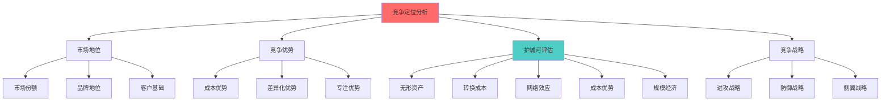
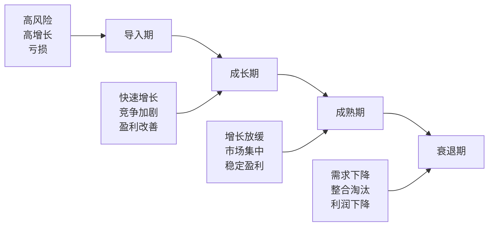

# 竞争定位分析

## 概述

企业的竞争定位决定了其长期盈利能力和投资价值。准确评估竞争定位能够帮助投资者：

- 识别具有持续竞争优势的企业
- 评估企业的长期盈利能力
- 判断企业的护城河宽度和深度
- 预测竞争格局的演变
- 做出更明智的投资决策

本文提供系统化的竞争定位分析框架，涵盖市场地位、竞争优势、护城河评估和竞争战略分析。

**学习目标**：
1. 掌握竞争定位的分析框架
2. 学会评估企业的市场地位
3. 识别和评估竞争优势来源
4. 理解护城河的类型和持久性
5. 预测竞争格局的演变趋势

## 竞争定位分析框架

### 分析维度




## 市场份额分析

### 市场份额计算

**绝对市场份额**:
```
市场份额 = 公司销售额 / 行业总销售额 × 100%
```

**相对市场份额**:
```
相对市场份额 = 公司市场份额 / 最大竞争对手市场份额
```

**市场份额意义**:
- > 40%: 主导地位
- 20-40%: 领先地位
- 10-20%: 重要参与者
- < 10%: 小参与者

### 市场份额趋势

**增长型**:
- 市场份额持续增长
- 增速快于行业
- 竞争力提升
- 投资价值高

**稳定型**:
- 市场份额稳定
- 与行业同步增长
- 地位巩固
- 防御性强

**下降型**:
- 市场份额下降
- 增速慢于行业
- 竞争力减弱
- 投资风险高

**市场份额分析矩阵**:

| 市场份额 | 增长率 | 定位 | 策略 |
|----------|--------|------|------|
| 高 | 高 | 明星 | 投资增长 |
| 高 | 低 | 现金牛 | 收获现金 |
| 低 | 高 | 问题 | 选择性投资 |
| 低 | 低 | 瘦狗 | 退出或收缩 |

### 竞争格局分析

**行业集中度**:

**CR4 (前四名集中度)**:
```
CR4 = 前四大公司市场份额之和
```

**HHI (赫芬达尔指数)**:
```
HHI = Σ(各公司市场份额)²
```

**集中度类型**:
- 高度集中 (HHI > 2500): 寡头垄断
- 中度集中 (1500-2500): 寡头竞争
- 低度集中 (< 1500): 充分竞争

**竞争格局类型**:

1. **垄断** (Monopoly)
   - 一家公司主导
   - 定价权强
   - 进入壁垒极高
   - 监管风险

**案例**: 公用事业、部分平台公司

2. **寡头垄断** (Oligopoly)
   - 少数几家主导
   - 理性竞争
   - 价格相对稳定
   - 盈利能力强

**案例**: 航空、电信、芯片制造

3. **垄断竞争** (Monopolistic Competition)
   - 多家公司竞争
   - 产品差异化
   - 一定定价权
   - 盈利能力中等

**案例**: 餐饮、服装、消费品

4. **完全竞争** (Perfect Competition)
   - 众多公司
   - 产品同质化
   - 无定价权
   - 盈利能力低

**案例**: 农产品、大宗商品

**投资偏好**:
- 最佳: 寡头垄断
- 次佳: 垄断竞争 (有差异化)
- 避免: 完全竞争

## 竞争对手分析

### 竞争对手识别

**竞争对手类型**:

1. **直接竞争对手**
   - 相同产品/服务
   - 相同目标客户
   - 相同地理市场
   - 正面竞争

2. **间接竞争对手**
   - 替代产品/服务
   - 满足相同需求
   - 不同解决方案

3. **潜在竞争对手**
   - 可能进入者
   - 相邻市场玩家
   - 新兴创业公司
   - 跨界竞争者

**识别方法**:
- 客户调研
- 市场报告
- 行业会议
- 专家访谈
- 社交媒体

### 竞争对手对比分析

**对比维度**:

| 维度 | 本公司 | 竞争对手A | 竞争对手B |
|------|--------|-----------|-----------|
| 市场份额 | 30% | 25% | 20% |
| 营收增长 | 15% | 12% | 18% |
| 毛利率 | 45% | 40% | 42% |
| 净利率 | 20% | 15% | 18% |
| ROE | 25% | 20% | 22% |
| 研发占比 | 15% | 12% | 10% |
| 品牌价值 | $50B | $40B | $30B |

**对比分析**:
- 优势领域
- 劣势领域
- 差距大小
- 趋势变化
- 追赶可能性

### 竞争策略分析

**进攻策略**:
- 正面进攻: 直接挑战领导者
- 侧翼进攻: 攻击弱点
- 包围进攻: 多产品线
- 游击战: 小规模快速行动

**防御策略**:
- 阵地防御: 巩固现有地位
- 侧翼防御: 保护弱点
- 先发防御: 提前布局
- 反击防御: 快速反击
- 运动防御: 市场扩张
- 收缩防御: 战略撤退

**案例分析**:

**进攻成功 - AMD vs Intel**:
- 侧翼进攻: 高性能服务器芯片
- 技术创新: 7nm 工艺领先
- 性价比优势
- 市场份额快速提升

**防御成功 - Coca-Cola vs Pepsi**:
- 品牌护城河
- 渠道优势
- 规模优势
- 保持领先地位


## 竞争动态分析

### 竞争强度评估

**波特五力模型应用**:

1. **行业内竞争**
   - 竞争者数量
   - 市场增长率
   - 产品差异化
   - 退出壁垒
   - 竞争手段

**竞争强度**:
- 低: 寡头垄断，理性竞争
- 中: 差异化竞争
- 高: 价格战，同质化

2. **新进入者威胁**
   - 进入壁垒高度
   - 资本需求
   - 规模要求
   - 品牌壁垒
   - 监管限制

3. **替代品威胁**
   - 替代品可用性
   - 性价比
   - 转换成本
   - 技术变革

4. **供应商议价能力**
   - 供应商集中度
   - 转换成本
   - 差异化程度
   - 前向整合威胁

5. **买方议价能力**
   - 客户集中度
   - 转换成本
   - 价格敏感度
   - 后向整合威胁

**综合评估**:
- 五力都弱: 优秀行业
- 部分力量强: 一般行业
- 多数力量强: 差行业

### 竞争演变趋势

**行业生命周期**:



**不同阶段的竞争特点**:

**导入期**:
- 竞争者少
- 技术不确定
- 市场教育
- 高投入

**成长期**:
- 竞争者增多
- 市场快速扩大
- 份额争夺
- 差异化竞争

**成熟期**:
- 市场集中
- 理性竞争
- 成本控制
- 效率提升

**衰退期**:
- 需求下降
- 价格战
- 整合并购
- 退出

**投资策略**:
- 导入期: 高风险高回报，小仓位
- 成长期: 选择领先者，中等仓位
- 成熟期: 选择龙头，稳定回报
- 衰退期: 避免投资

### 技术变革影响

**破坏性创新**:

**克里斯坦森理论**:
- 持续性创新: 改进现有产品
- 破坏性创新: 颠覆现有市场

**破坏性创新特征**:
- 初期性能较差
- 价格更低
- 更简单易用
- 新客户群体
- 逐步改进

**应对策略**:
- 领先者: 警惕破坏性创新
- 挑战者: 利用破坏性创新
- 投资者: 识别颠覆机会

**案例**:
- Netflix vs Blockbuster
- Tesla vs 传统车企
- Airbnb vs 酒店业
- Uber vs 出租车

## 竞争定位评估

### 定位地图

**战略定位图**:

```
价格
高 |  奢侈品牌  |  高端差异化  |
   |  (Hermès)  |   (Apple)    |
   |------------|--------------|
中 |  大众品牌  |  性价比      |
   | (Uniqlo)   |  (小米)      |
   |------------|--------------|
低 |  低价品牌  |  成本领先    |
   | (拼多多)   |  (Walmart)   |
   |___________________________|
      低          中          高
              差异化程度
```

**定位选择**:
- 高价高差异化: 奢侈品、高端品牌
- 中价中差异化: 大众品牌
- 低价低差异化: 成本领先
- 高价低差异化: 不可持续
- 低价高差异化: 性价比 (困难但有价值)

### 竞争定位评分

**评分维度**:

1. **市场地位** (30分)
   - 市场份额 (10分)
   - 市场份额趋势 (10分)
   - 品牌认知度 (10分)

2. **竞争优势** (40分)
   - 成本优势 (10分)
   - 差异化优势 (10分)
   - 护城河宽度 (20分)

3. **竞争动态** (30分)
   - 竞争强度 (10分)
   - 新进入者威胁 (10分)
   - 替代品威胁 (10分)

**总分解读**:
- 90-100分: 极强竞争地位
- 80-89分: 强竞争地位
- 70-79分: 中等竞争地位
- 60-69分: 弱竞争地位
- <60分: 极弱竞争地位

## 实战案例

### 案例1: 智能手机行业竞争分析

**市场格局** (2024):
- Apple: 18% 市场份额，60% 利润份额
- Samsung: 20% 市场份额，20% 利润份额
- 小米: 12% 市场份额，5% 利润份额
- OPPO/Vivo: 各 8%
- 其他: 34%

**竞争定位**:

**Apple**:
- 战略: 高端差异化
- 优势: 品牌、生态系统、利润率
- 定位: 高价高差异化
- 护城河: 超宽

**Samsung**:
- 战略: 全产品线覆盖
- 优势: 垂直整合、技术、规模
- 定位: 中高端差异化
- 护城河: 宽

**小米**:
- 战略: 性价比
- 优势: 成本控制、互联网营销
- 定位: 中低价中差异化
- 护城河: 窄

**投资结论**:
- Apple: 最佳投资标的 (高利润率、强护城河)
- Samsung: 次佳 (垂直整合优势)
- 小米: 高风险 (竞争激烈、利润率低)

### 案例2: 电商平台竞争分析

**中国电商格局**:
- 阿里巴巴: 45% GMV 份额
- 京东: 25% GMV 份额
- 拼多多: 20% GMV 份额
- 其他: 10%

**竞争定位对比**:

**阿里巴巴**:
- 定位: 综合平台，品类最全
- 优势: 规模、生态、品牌
- 客户: 全客户群
- 护城河: 网络效应、规模

**京东**:
- 定位: 自营为主，品质保证
- 优势: 物流、正品、服务
- 客户: 中高端
- 护城河: 物流网络、供应链

**拼多多**:
- 定位: 低价拼团，下沉市场
- 优势: 社交电商、低价
- 客户: 价格敏感型
- 护城河: 社交网络、规模

**竞争演变**:
- 阿里: 防御为主，保持领先
- 京东: 差异化竞争，品质路线
- 拼多多: 进攻型，快速增长

**投资角度**:
- 阿里: 稳定，但增长放缓
- 京东: 差异化价值
- 拼多多: 高增长，高风险

### 分析流程

#### 第一步：行业结构分析
- 应用波特五力模型
- 评估行业吸引力
- 识别关键成功因素
- 分析竞争强度

#### 第二步：市场地位评估
- 计算市场份额
- 评估品牌地位
- 分析客户基础
- 确定竞争位置

#### 第三步：竞争优势识别
- 识别优势来源
- 评估优势强度
- 分析优势持久性
- 对比竞争对手

#### 第四步：护城河评估
- 识别护城河类型
- 评估护城河宽度
- 分析护城河趋势
- 量化护城河价值

#### 第五步：战略定位分析
- 确定竞争战略
- 评估战略有效性
- 分析战略风险
- 预测战略演进

## 第一步：市场地位评估

### 市场份额分析

#### 市场份额计算

**绝对市场份额**：
```
市场份额 = 公司销售额 / 行业总销售额 × 100%
```

**相对市场份额**：
```
相对市场份额 = 公司市场份额 / 最大竞争对手市场份额
```

**市场地位分类**：
- 领导者：市场份额 > 40%
- 挑战者：市场份额 20-40%
- 跟随者：市场份额 10-20%
- 补缺者：市场份额 < 10%

#### 市场份额趋势

**增长型**：
- 市场份额持续增长
- 增速超过行业平均
- 竞争地位提升

**稳定型**：
- 市场份额基本稳定
- 与行业同步增长
- 竞争地位维持

**下降型**：
- 市场份额持续下降
- 增速低于行业平均
- 竞争地位削弱

**评估要点**：
- 3-5年市场份额变化
- 与主要竞争对手对比
- 细分市场份额分布
- 区域市场份额差异

### 品牌地位评估

#### 品牌价值评估

**品牌认知度**：
- 消费者认知率
- 品牌回忆率
- 品牌联想
- 媒体曝光度

**品牌美誉度**：
- 客户满意度
- 净推荐值（NPS）
- 品牌忠诚度
- 口碑评价

**品牌溢价能力**：
```
品牌溢价率 = (品牌产品价格 - 无品牌产品价格) / 无品牌产品价格 × 100%
```

**品牌价值量化**：
- Interbrand品牌价值榜
- BrandZ品牌价值榜
- 品牌资产评估
- 市场调研数据

#### 品牌定位

**定位维度**：
1. **价格定位**
   - 高端/奢侈品
   - 中高端
   - 大众市场
   - 低端/性价比

2. **质量定位**
   - 顶级质量
   - 优质
   - 标准质量
   - 基础质量

3. **目标客户**
   - 高端客户
   - 中产阶级
   - 大众消费者
   - 价格敏感型

**定位一致性**：
- 品牌承诺与实际表现
- 营销传播一致性
- 产品质量一致性
- 客户体验一致性

### 客户基础分析

#### 客户结构

**客户集中度**：
```
客户集中度 = 前N大客户收入 / 总收入 × 100%

低集中度：< 30%
中集中度：30-50%
高集中度：> 50%
```

**客户分布**：
- 行业分布
- 地域分布
- 规模分布
- 类型分布

**客户质量**：
- 大客户占比
- 长期客户占比
- 盈利客户占比
- 战略客户占比

#### 客户关系

**客户粘性指标**：
1. **客户留存率**
   ```
   留存率 = 期末保留客户数 / 期初客户数 × 100%
   ```

2. **客户流失率**
   ```
   流失率 = 流失客户数 / 期初客户数 × 100%
   ```

3. **客户生命周期价值（CLV）**
   ```
   CLV = 年均客户价值 × 客户关系年限 - 客户获取成本
   ```

4. **净推荐值（NPS）**
   ```
   NPS = 推荐者比例 - 贬损者比例
   ```

**客户满意度**：
- 产品满意度
- 服务满意度
- 价格满意度
- 整体满意度

## 第二步：竞争优势识别

### 波特三大基本战略

#### 成本领先战略

**成本优势来源**：
1. **规模经济**
   - 生产规模优势
   - 采购规模优势
   - 分销规模优势
   - 研发分摊优势

2. **经验曲线**
   - 学习效应
   - 流程优化
   - 技术改进
   - 效率提升

3. **运营效率**
   - 精益生产
   - 供应链优化
   - 自动化程度
   - 管理效率

4. **要素成本**
   - 原材料成本
   - 劳动力成本
   - 能源成本
   - 物流成本

**成本优势评估**：
```
成本优势指数 = 竞争对手平均成本 / 公司成本

> 1.2：显著成本优势
1.1-1.2：一定成本优势
0.9-1.1：成本相当
< 0.9：成本劣势
```

**成本领先案例**：
- 沃尔玛：供应链效率
- 西南航空：运营效率
- 小米：性价比策略
- Costco：规模采购

#### 差异化战略

**差异化来源**：
1. **产品差异化**
   - 功能特性
   - 质量水平
   - 设计美学
   - 技术创新

2. **服务差异化**
   - 售前咨询
   - 售后服务
   - 客户体验
   - 定制化服务

3. **品牌差异化**
   - 品牌形象
   - 品牌故事
   - 情感连接
   - 社会责任

4. **渠道差异化**
   - 渠道覆盖
   - 渠道质量
   - 渠道创新
   - 全渠道整合

**差异化评估**：
- 差异化是否被客户认可
- 差异化是否创造价值
- 差异化是否可持续
- 差异化是否难以模仿

**差异化案例**：
- 苹果：产品设计和生态系统
- 星巴克：第三空间体验
- 特斯拉：技术创新
- 海底捞：服务体验

#### 专注战略

**专注维度**：
1. **细分市场专注**
   - 特定客户群
   - 特定需求
   - 特定场景
   - 特定地域

2. **产品线专注**
   - 单一产品
   - 窄产品线
   - 专业化
   - 深度而非广度

3. **价值链专注**
   - 专注某个环节
   - 外包其他环节
   - 轻资产模式
   - 平台化

**专注战略优势**：
- 深入理解客户需求
- 建立专业形象
- 资源集中
- 快速响应

**专注战略案例**：
- 爱马仕：奢侈品专注
- 茅台：高端白酒专注
- Lululemon：瑜伽服饰专注
- 片仔癀：中药专注

### 竞争优势评估矩阵

#### VRIO框架

**价值（Value）**：
- 是否创造客户价值？
- 是否降低成本或提高收入？
- 是否应对威胁或抓住机会？

**稀缺性（Rarity）**：
- 是否只有少数企业拥有？
- 是否难以获得？
- 是否独特？

**难以模仿（Inimitability）**：
- 是否有历史依赖？
- 是否因果模糊？
- 是否社会复杂性？
- 是否有专利保护？

**组织（Organization）**：
- 是否有组织能力利用？
- 是否有配套资源？
- 是否有管理系统？

**VRIO评估结果**：
| V | R | I | O | 竞争优势 | 经济表现 |
|---|---|---|---|---------|---------|
| 否 | - | - | - | 竞争劣势 | 低于平均 |
| 是 | 否 | - | - | 竞争均势 | 平均水平 |
| 是 | 是 | 否 | - | 暂时优势 | 高于平均 |
| 是 | 是 | 是 | 否 | 未利用优势 | 高于平均 |
| 是 | 是 | 是 | 是 | 持续优势 | 远高于平均 |

## 第三步：护城河评估

### 五大护城河类型

#### 1. 无形资产护城河

**品牌护城河**：
- 品牌认知度高
- 品牌忠诚度强
- 品牌溢价能力
- 品牌延伸能力

**评估指标**：
- 品牌价值排名
- 品牌溢价率
- 客户忠诚度
- 重复购买率

**典型案例**：
- 可口可乐：百年品牌
- 茅台：文化品牌
- 苹果：科技品牌
- 耐克：运动品牌

**专利技术护城河**：
- 核心技术专利
- 专利组合
- 专利有效期
- 技术领先性

**评估指标**：
- 专利数量和质量
- 研发投入强度
- 技术壁垒高度
- 替代技术威胁

**典型案例**：
- 高通：通信专利
- 辉瑞：药品专利
- ARM：芯片架构
- 特斯拉：电池技术

**监管许可护城河**：
- 牌照稀缺性
- 准入门槛
- 监管保护
- 政策支持

**典型案例**：
- 银行：金融牌照
- 电信：运营牌照
- 医药：药品批文
- 媒体：广播许可

#### 2. 转换成本护城河

**转换成本类型**：
1. **学习成本**
   - 软件学习曲线
   - 操作习惯培养
   - 专业技能要求

2. **迁移成本**
   - 数据迁移
   - 系统对接
   - 流程重建

3. **关系成本**
   - 客户关系
   - 供应商关系
   - 合作伙伴关系

4. **财务成本**
   - 设备投资
   - 合同违约金
   - 沉没成本

**评估指标**：
- 客户留存率 > 90%
- 客户流失率 < 10%
- 平均客户关系年限 > 5年
- 转换成本 / 年度采购额 > 20%

**典型案例**：
- Oracle：企业软件
- SAP：ERP系统
- Adobe：设计软件
- 微信：社交网络

#### 3. 网络效应护城河

**网络效应类型**：
1. **直接网络效应**
   - 用户越多，价值越大
   - 社交网络
   - 通信工具
   - 支付平台

2. **间接网络效应**
   - 双边市场
   - 平台效应
   - 生态系统
   - 互补产品

3. **数据网络效应**
   - 数据越多，服务越好
   - 推荐算法
   - 搜索引擎
   - AI应用

**评估指标**：
- 用户增长曲线（S型）
- 网络密度
- 活跃度指标
- 多边参与度

**典型案例**：
- 微信：社交网络
- 淘宝：电商平台
- Visa：支付网络
- 谷歌：搜索引擎

#### 4. 成本优势护城河

**成本优势来源**：
1. **规模经济**
   - 固定成本分摊
   - 采购议价能力
   - 品牌营销效率

2. **专有技术**
   - 生产工艺
   - 配方秘密
   - 流程优化

3. **地理位置**
   - 资源优势
   - 物流优势
   - 市场接近

4. **独特资源**
   - 矿产资源
   - 土地资源
   - 人才资源

**评估指标**：
- 毛利率 > 行业平均20%
- 单位成本 < 竞争对手20%
- 规模优势明显
- 成本持续下降

**典型案例**：
- 沃尔玛：规模采购
- 茅台：地理标志
- 中石油：资源优势
- 台积电：规模和技术

#### 5. 规模经济护城河

**规模经济表现**：
1. **生产规模**
   - 产能利用率
   - 单位固定成本
   - 学习曲线效应

2. **市场规模**
   - 市场份额
   - 品牌影响力
   - 渠道覆盖

3. **研发规模**
   - 研发投入
   - 研发效率
   - 创新产出

**评估指标**：
- 市场份额 > 30%
- 规模是第二名的2倍以上
- 单位成本随规模下降
- 进入壁垒高

**典型案例**：
- 亚马逊：物流网络
- 英特尔：芯片制造
- 波音：飞机制造
- 宁德时代：电池产能

### 护城河评分体系

#### 评分维度

**宽度评分**（优势大小）：
- 5分：极宽护城河（垄断地位）
- 4分：宽护城河（显著优势）
- 3分：中等护城河（一定优势）
- 2分：窄护城河（微弱优势）
- 1分：无护城河（无优势）

**深度评分**（优势强度）：
- 5分：极深（几乎不可逾越）
- 4分：深（很难逾越）
- 3分：中等（可能逾越）
- 2分：浅（容易逾越）
- 1分：无（无障碍）

**趋势评分**（优势变化）：
- +2：快速加宽
- +1：缓慢加宽
- 0：保持稳定
- -1：缓慢收窄
- -2：快速收窄

**综合评分**：
```
护城河总分 = (宽度 × 0.4) + (深度 × 0.4) + (趋势 × 0.2)

优秀：> 4.0
良好：3.0-4.0
一般：2.0-3.0
较差：< 2.0
```

### 护城河持久性分析

#### 威胁因素

**技术颠覆**：
- 新技术出现
- 商业模式创新
- 用户习惯改变
- 替代品威胁

**竞争加剧**：
- 新进入者
- 价格战
- 产品同质化
- 护城河被复制

**监管变化**：
- 反垄断
- 行业监管
- 政策调整
- 合规成本

**内部问题**：
- 管理失误
- 创新不足
- 组织僵化
- 文化问题

#### 防御能力

**持续创新**：
- 研发投入
- 产品迭代
- 技术升级
- 商业模式创新

**生态建设**：
- 平台化
- 生态系统
- 合作伙伴
- 互补产品

**品牌维护**：
- 品牌投入
- 客户体验
- 口碑管理
- 危机应对

**组织能力**：
- 学习能力
- 执行能力
- 变革能力
- 文化建设

## 第四步：竞争战略分析

### 竞争战略类型

#### 进攻战略

**正面进攻**：
- 直接挑战领导者
- 全面竞争
- 资源消耗大
- 风险高

**侧翼进攻**：
- 攻击薄弱环节
- 细分市场切入
- 差异化定位
- 风险较低

**包围进攻**：
- 多产品线
- 全方位竞争
- 资源要求高
- 适合大企业

**游击战**：
- 小规模行动
- 灵活机动
- 快速响应
- 适合小企业

#### 防御战略

**阵地防御**：
- 巩固现有市场
- 提高进入壁垒
- 加强客户关系
- 持续创新

**侧翼防御**：
- 保护薄弱环节
- 预防侧翼进攻
- 多元化布局
- 风险分散

**先发制人**：
- 主动出击
- 抢占先机
- 技术领先
- 市场教育

**反击防御**：
- 快速反应
- 针锋相对
- 价格战
- 促销战

**运动防御**：
- 市场扩张
- 产品创新
- 多元化
- 国际化

**收缩防御**：
- 战略撤退
- 聚焦核心
- 资源集中
- 提高效率

### 竞争战略评估

#### 战略有效性

**市场表现**：
- 市场份额变化
- 收入增长率
- 利润率变化
- 客户满意度

**财务表现**：
- ROE变化
- ROIC变化
- 现金流改善
- 估值提升

**竞争地位**：
- 相对市场份额
- 品牌地位
- 技术领先性
- 护城河加宽

#### 战略风险

**执行风险**：
- 资源不足
- 能力不够
- 组织阻力
- 时机不对

**竞争风险**：
- 竞争对手反击
- 价格战
- 市场份额流失
- 利润率下降

**市场风险**：
- 市场变化
- 客户需求变化
- 技术颠覆
- 监管变化

## 竞争格局演变预测

### 格局演变趋势

#### 集中化趋势

**驱动因素**：
- 规模经济显著
- 网络效应强
- 并购整合
- 监管放松

**表现**：
- 市场集中度上升
- 寡头竞争
- 中小企业退出
- 进入壁垒提高

**案例**：
- 互联网行业
- 电商平台
- 社交网络
- 芯片制造

#### 分散化趋势

**驱动因素**：
- 个性化需求
- 技术降低门槛
- 长尾市场
- 监管限制

**表现**：
- 市场集中度下降
- 新进入者增多
- 细分市场繁荣
- 竞争激烈

**案例**：
- 餐饮行业
- 服装行业
- 内容创作
- 本地服务

### 颠覆性变化

#### 技术颠覆

**识别信号**：
- 新技术出现
- 性能快速提升
- 成本快速下降
- 用户接受度提高

**应对策略**：
- 持续关注新技术
- 投资研发
- 战略合作
- 业务转型

**历史案例**：
- 数码相机颠覆胶卷
- 智能手机颠覆功能机
- 电商颠覆实体零售
- 新能源颠覆燃油车

#### 商业模式创新

**创新类型**：
- 免费模式
- 订阅模式
- 平台模式
- 共享经济

**影响**：
- 改变价值创造方式
- 重构产业链
- 降低进入壁垒
- 挑战现有企业

## 实战案例

### 案例1：茅台的护城河

**品牌护城河**：
- 国酒地位
- 文化价值
- 稀缺性
- 社交货币

**地理护城河**：
- 地理标志保护
- 独特气候
- 微生物环境
- 不可复制

**规模护城河**：
- 产能限制
- 供不应求
- 定价权
- 渠道控制

**综合评分**：4.8分（优秀）

### 案例2：特斯拉的竞争定位

**技术优势**：
- 电池技术
- 自动驾驶
- 软件能力
- 垂直整合

**品牌优势**：
- 创新形象
- 马斯克效应
- 环保理念
- 科技感

**规模优势**：
- 产能扩张
- 成本下降
- 充电网络
- 数据积累

**战略定位**：
- 高端市场切入
- 向大众市场扩展
- 能源生态布局
- 全球化扩张

## 延伸阅读

### 必读书籍

1. **《竞争战略》** - 迈克尔·波特
   - 五力模型
   - 三大基本战略

2. **《竞争优势》** - 迈克尔·波特
   - 价值链分析
   - 竞争优势来源

3. **《护城河》** - 帕特·多尔西
   - 护城河类型
   - 护城河评估

4. **《蓝海战略》** - W·钱·金
   - 价值创新
   - 战略布局

5. **《定位》** - 艾·里斯
   - 定位理论
   - 品牌战略

### 推荐资源

**研究工具**：
- 波特五力分析模板
- VRIO分析框架
- 竞争地位矩阵
- 护城河评分表

**数据来源**：
- 行业研究报告
- 公司年报
- 市场调研数据
- 竞争对手分析

## 参考文献

1. Porter, M. E. (1980). *Competitive Strategy*. Free Press.
2. Porter, M. E. (1985). *Competitive Advantage*. Free Press.
3. Dorsey, P. (2008). *The Little Book That Builds Wealth*. Wiley.
4. Kim, W. C., & Mauborgne, R. (2005). *Blue Ocean Strategy*. Harvard Business School Press.
5. Ries, A., & Trout, J. (1981). *Positioning*. McGraw-Hill.
6. Barney, J. B. (1991). "Firm Resources and Sustained Competitive Advantage". *Journal of Management*.
7. Teece, D. J. (2007). "Explicating Dynamic Capabilities". *Strategic Management Journal*.
8. Christensen, C. M. (1997). *The Innovator's Dilemma*. Harvard Business School Press.

---

**下一步行动**：
1. 选择3-5家公司进行竞争定位分析
2. 应用护城河评估框架
3. 绘制竞争地位图
4. 预测竞争格局演变
5. 构建投资论点

**相关主题**：
- [公司研究框架](research-framework.html)
- [行业分析](../industry-analysis/overview.html)
- [竞争分析框架](../../03-company-analysis/competitive-analysis/index.html)
- [经济护城河](../../03-company-analysis/competitive-analysis/economic-moats.html)
- [投资论点构建](investment-thesis.html)


## 竞争优势持久性

### 护城河持久性评估

**评估维度**:

1. **护城河宽度**
   - 超宽: 10年+ 难以攻破
   - 宽: 5-10年 保护
   - 窄: 2-5年 保护
   - 无: 随时可能被超越

2. **护城河趋势**
   - 加宽: 竞争优势增强
   - 稳定: 竞争优势保持
   - 收窄: 竞争优势减弱
   - 消失: 竞争优势丧失

3. **护城河来源**
   - 单一来源: 风险高
   - 多重来源: 更稳固
   - 相互强化: 最佳

**护城河评估清单**:
- [ ] 护城河是什么？
- [ ] 护城河有多宽？
- [ ] 护城河在加宽还是收窄？
- [ ] 护城河能持续多久？
- [ ] 有什么威胁护城河？
- [ ] 如何保护和加宽护城河？

### 竞争优势侵蚀

**侵蚀因素**:

1. **技术变革**
   - 新技术出现
   - 商业模式创新
   - 破坏性创新
   - 技术民主化

**案例**:
- 柯达: 数码相机颠覆胶卷
- 诺基亚: 智能手机颠覆功能机
- 出租车: 网约车颠覆

2. **竞争加剧**
   - 新进入者
   - 价格战
   - 产品同质化
   - 利润率下降

3. **客户偏好变化**
   - 消费升级/降级
   - 渠道变化
   - 品牌老化
   - 需求转移

4. **监管变化**
   - 反垄断
   - 行业监管
   - 政策调整
   - 合规成本

**应对策略**:
- 持续创新
- 加宽护城河
- 多元化
- 战略调整

### 可持续竞争优势

**特征**:
- 难以模仿
- 难以替代
- 持续时间长
- 价值创造能力强

**最持久的护城河**:
1. 品牌 (可口可乐 100+ 年)
2. 网络效应 (Visa/Mastercard)
3. 监管牌照 (银行、保险)
4. 规模经济 (Walmart, Costco)

**投资价值**:
- 可持续竞争优势 = 长期投资价值
- 护城河越宽，投资越安全
- 护城河加宽，投资回报越高

## 竞争定位与估值

### 定位与估值的关系

**市场地位溢价**:

| 市场地位 | 估值溢价 | P/E 范围 |
|----------|----------|----------|
| 绝对领导者 | 30-50% | 25-35x |
| 领先者 | 10-30% | 18-25x |
| 跟随者 | 0-10% | 12-18x |
| 落后者 | -20-0% | 8-12x |

**护城河与估值**:
- 超宽护城河: 可以给予更高估值
- 宽护城河: 合理溢价
- 窄护城河: 折价
- 无护城河: 大幅折价

**竞争优势与增长**:
- 强竞争优势 + 高增长 = 高估值
- 强竞争优势 + 低增长 = 中等估值
- 弱竞争优势 + 高增长 = 风险高
- 弱竞争优势 + 低增长 = 低估值

### 估值调整

**竞争地位调整因子**:

```
调整后估值 = 基础估值 × (1 + 竞争地位调整)

竞争地位调整:
- 市场领导者: +20% to +50%
- 强竞争优势: +10% to +30%
- 中等竞争优势: 0% to +10%
- 弱竞争优势: -10% to -30%
- 竞争劣势: -30% to -50%
```

**案例**:
- Apple: 强竞争地位，估值溢价 30-40%
- 普通消费品公司: 中等地位，无溢价
- 衰退行业公司: 弱地位，估值折价 30%+

## 实战工具

### 竞争分析模板

**竞争对手对比表**:

```markdown
# 竞争对手对比分析

## 基本信息
| 公司 | 市值 | 营收 | 市场份额 | 成立时间 |
|------|------|------|----------|----------|
| 本公司 | | | | |
| 竞争对手A | | | | |
| 竞争对手B | | | | |

## 财务对比
| 公司 | 毛利率 | 净利率 | ROE | 增长率 |
|------|--------|--------|-----|--------|
| 本公司 | | | | |
| 竞争对手A | | | | |
| 竞争对手B | | | | |

## 竞争优势对比
| 维度 | 本公司 | 竞争对手A | 竞争对手B |
|------|--------|-----------|-----------|
| 品牌 | ★★★★★ | ★★★★ | ★★★ |
| 技术 | ★★★★ | ★★★★★ | ★★★ |
| 成本 | ★★★ | ★★★★ | ★★★★★ |
| 渠道 | ★★★★★ | ★★★ | ★★★★ |
| 服务 | ★★★★ | ★★★★ | ★★★ |

## 综合评估
- 本公司定位:
- 核心优势:
- 主要劣势:
- 竞争策略:
- 投资结论:
```

### 竞争定位清单

**分析清单**:
- [ ] 确定行业边界
- [ ] 识别所有竞争对手
- [ ] 计算市场份额
- [ ] 分析竞争格局
- [ ] 评估竞争强度
- [ ] 识别竞争优势
- [ ] 评估护城河
- [ ] 分析竞争趋势
- [ ] 预测竞争演变
- [ ] 确定投资价值

**决策清单**:
- [ ] 公司是否有清晰的竞争定位？
- [ ] 竞争优势是否可持续？
- [ ] 市场地位是否稳固？
- [ ] 竞争格局是否有利？
- [ ] 是否面临重大竞争威胁？
- [ ] 估值是否反映竞争地位？

## 总结

### 核心要点

1. **竞争定位决定投资价值**
   - 市场领导者价值最高
   - 强竞争优势支撑高估值
   - 弱竞争地位风险高

2. **多维度分析**
   - 市场份额
   - 竞争优势
   - 竞争动态
   - 行业格局

3. **动态评估**
   - 竞争地位会变化
   - 护城河会侵蚀
   - 需要持续跟踪

4. **结合估值**
   - 竞争地位影响估值
   - 强地位可给溢价
   - 弱地位需折价

### 投资启示

**寻找**:
- 市场领导者
- 强竞争优势
- 护城河加宽
- 被低估的优质公司

**避免**:
- 竞争激烈行业
- 无差异化公司
- 护城河收窄
- 市场份额下降

### 下一步行动

1. **建立分析框架**
   - 创建对比模板
   - 设计评分系统
   - 准备分析工具

2. **实践分析**
   - 选择一个行业
   - 分析3-5家公司
   - 对比竞争定位
   - 得出投资结论

3. **持续跟踪**
   - 监控市场份额
   - 跟踪竞争动态
   - 评估护城河变化
   - 调整投资决策

## 延伸阅读

### 相关主题

- [[research-framework|公司研究框架]]
- [[due-diligence|尽职调查方法]]
- [[management-analysis|管理层分析]]
- [[investment-thesis|投资论点构建]]
- [[competitive-analysis/porters-five-forces|波特五力模型]]
- [[competitive-analysis/economic-moats|经济护城河]]

### 行业分析

- [[industry-analysis/overview|行业分析框架]]
- [[industry-analysis/technology/ai-industry|AI 行业分析]]
- [[industry-analysis/consumer/e-commerce|电商行业分析]]

### 案例研究

- [[case-studies/tech-giants/apple|Apple 竞争优势]]
- [[case-studies/consumer-brands/coca-cola|Coca-Cola 品牌护城河]]
- [[case-studies/tech-giants/amazon|Amazon 平台优势]]

## 参考文献

1. Porter, M. E. (1980). *Competitive Strategy*. Free Press.
2. Porter, M. E. (1985). *Competitive Advantage*. Free Press.
3. Christensen, C. M. (1997). *The Innovator's Dilemma*. Harvard Business School Press.
4. Dorsey, P., & Engelhart, J. (2008). *The Little Book That Builds Wealth*. Wiley.
5. Buffett, W. (1977-2023). *Berkshire Hathaway Annual Letters*.
6. Munger, C. (2005). *Poor Charlie's Almanack*. Walsworth Publishing.
7. Greenblatt, J. (2006). *The Little Book That Beats the Market*. Wiley.
8. Mauboussin, M. J. (2012). *The Success Equation*. Harvard Business Review Press.
9. Rumelt, R. (2011). *Good Strategy Bad Strategy*. Crown Business.
10. Kim, W. C., & Mauborgne, R. (2005). *Blue Ocean Strategy*. Harvard Business School Press.
11. Ries, A., & Trout, J. (1981). *Positioning: The Battle for Your Mind*. McGraw-Hill.
12. Moore, G. A. (1991). *Crossing the Chasm*. HarperBusiness.
13. Thiel, P. (2014). *Zero to One*. Crown Business.
14. Grove, A. S. (1996). *Only the Paranoid Survive*. Currency Doubleday.
15. Barney, J. B. (1991). "Firm Resources and Sustained Competitive Advantage". *Journal of Management*.

---

*最后更新: 2024-01-20*
*版本: 1.0*
*作者: 金融知识库*


## 竞争战略实施

### 战略选择与执行

**战略选择因素**:

1. **公司资源**
   - 资金实力
   - 技术能力
   - 品牌资产
   - 人才储备
   - 渠道网络

2. **市场环境**
   - 行业生命周期
   - 竞争强度
   - 客户需求
   - 技术趋势
   - 监管环境

3. **竞争对手**
   - 对手战略
   - 对手实力
   - 对手弱点
   - 竞争空白

**战略执行评估**:
- 战略清晰度
- 资源配置
- 组织支持
- 执行纪律
- 调整灵活性

### 战略转型分析

**转型类型**:

1. **产品转型**
   - 新产品开发
   - 产品线扩展
   - 产品升级
   - 案例: Apple (iPod → iPhone)

2. **市场转型**
   - 新市场进入
   - 地域扩张
   - 客户群扩展
   - 案例: Starbucks (美国 → 全球)

3. **商业模式转型**
   - 收入模式变化
   - 价值链重构
   - 平台化转型
   - 案例: Microsoft (许可 → 订阅)

4. **数字化转型**
   - 技术升级
   - 流程数字化
   - 数据驱动
   - 案例: 传统零售 → 新零售

**转型风险评估**:
- 转型必要性
- 转型可行性
- 执行能力
- 资源充足性
- 时间窗口

**投资策略**:
- 转型初期: 观察
- 转型进展顺利: 买入
- 转型成功: 重仓
- 转型失败: 避免

## 竞争情报收集

### 情报来源

**公开来源**:
1. 公司公告和财报
2. 行业报告
3. 新闻媒体
4. 社交媒体
5. 专利数据库
6. 招聘信息
7. 供应链信息

**半公开来源**:
1. 行业会议
2. 投资者日
3. 经销商会议
4. 供应商沟通
5. 客户反馈

**私有来源**:
1. 实地调研
2. 专家访谈
3. 前员工访谈
4. 客户访谈
5. 竞争对手访谈

### 情报分析方法

**SWOT 分析**:

| 维度 | 本公司 | 竞争对手 |
|------|--------|----------|
| 优势 (S) | 品牌、技术 | 规模、渠道 |
| 劣势 (W) | 成本高 | 创新慢 |
| 机会 (O) | 新市场、新产品 | 并购整合 |
| 威胁 (T) | 新进入者 | 技术变革 |

**竞争矩阵**:

```
         竞争优势
强 |  明星业务  |  现金牛  |
   |  (投资)    |  (收获)  |
   |------------|----------|
弱 |  问题业务  |  瘦狗    |
   |  (选择)    |  (退出)  |
   |_______________________|
      高          低
         市场吸引力
```

**价值链分析**:
- 识别价值创造环节
- 分析利润分布
- 评估议价能力
- 寻找价值转移

## 竞争定位与投资时机

### 买入时机

**最佳买入时机**:

1. **竞争地位改善**
   - 市场份额提升
   - 护城河加宽
   - 竞争对手退出
   - 行业整合

2. **暂时困难**
   - 短期问题
   - 市场过度反应
   - 竞争地位未变
   - 估值吸引

3. **拐点时刻**
   - 行业拐点
   - 公司拐点
   - 政策拐点
   - 技术拐点

**案例**:
- 2020年疫情: 优质公司被错杀
- 2018年贸易战: 科技股调整
- 2015年: 微软云转型初期

### 卖出时机

**应该卖出的情况**:

1. **竞争地位恶化**
   - 市场份额持续下降
   - 护城河收窄
   - 竞争优势丧失
   - 被竞争对手超越

2. **估值过高**
   - 估值远超合理水平
   - 市场过度乐观
   - 风险收益比不利

3. **更好机会**
   - 发现更好标的
   - 风险收益比更优
   - 确信度更高

4. **论点失效**
   - 核心假设不成立
   - 预期未实现
   - 环境变化

**案例**:
- 科技股泡沫 (2000): 估值过高
- 诺基亚: 竞争地位丧失
- 柯达: 技术替代

## 总结

### 核心要点

1. **竞争定位决定投资价值**
   - 市场领导者最有价值
   - 强竞争优势支撑高估值
   - 弱竞争地位风险高

2. **多维度分析**
   - 市场份额和趋势
   - 竞争优势和护城河
   - 竞争格局和动态
   - 战略定位和执行

3. **动态评估**
   - 竞争地位会变化
   - 护城河会侵蚀
   - 需要持续跟踪
   - 及时调整策略

4. **结合估值**
   - 竞争地位影响估值
   - 强地位可给溢价
   - 弱地位需折价
   - 风险收益平衡

5. **把握时机**
   - 竞争地位改善时买入
   - 竞争地位恶化时卖出
   - 暂时困难是机会
   - 长期趋势是关键

### 投资启示

**寻找**:
- 行业领导者
- 强竞争优势
- 护城河加宽
- 被低估的优质公司
- 竞争格局改善

**避免**:
- 竞争激烈行业
- 无差异化公司
- 护城河收窄
- 市场份额下降
- 竞争地位恶化

### 下一步行动

1. **建立分析框架**
   - 创建对比模板
   - 设计评分系统
   - 准备分析工具
   - 建立数据库

2. **实践分析**
   - 选择一个行业
   - 分析3-5家公司
   - 对比竞争定位
   - 得出投资结论

3. **持续跟踪**
   - 监控市场份额
   - 跟踪竞争动态
   - 评估护城河变化
   - 调整投资决策

4. **积累经验**
   - 研究成功案例
   - 学习失败教训
   - 提炼分析模式
   - 形成投资框架

---

*最后更新: 2024-01-20*
*版本: 1.0*
*作者: 金融知识库*


## 竞争定位分析工具箱

### 分析模板和清单

**竞争定位快速评估表**:

```markdown
# [公司名称] 竞争定位快速评估

## 市场地位 (30分)
- 市场份额: __% (行业第__ 名) [__/10分]
- 份额趋势: 上升/稳定/下降 [__/10分]
- 品牌认知: 高/中/低 [__/10分]

## 竞争优势 (40分)
- 成本优势: 强/中/弱 [__/10分]
- 差异化: 强/中/弱 [__/10分]
- 护城河类型: ________ [__/10分]
- 护城河宽度: 宽/中/窄 [__/10分]

## 竞争动态 (30分)
- 竞争强度: 低/中/高 [__/10分]
- 新进入威胁: 低/中/高 [__/10分]
- 替代品威胁: 低/中/高 [__/10分]

## 总分: __/100分

## 投资结论:
- 90-100分: 极强竞争地位，重点投资
- 80-89分: 强竞争地位，可以投资
- 70-79分: 中等地位，谨慎投资
- 60-69分: 弱地位，避免投资
- <60分: 极弱地位，坚决不投
```

### 行业竞争地图

**绘制竞争地图**:

1. **识别所有参与者**
2. **确定竞争维度** (价格、质量、服务等)
3. **标注各公司位置**
4. **分析竞争空白**
5. **预测竞争演变**

**竞争地图示例 - 智能手机**:

```
性能
高 |    Apple    |  Samsung  |
   |   (高端)    |  (旗舰)   |
   |-------------|-----------|
中 |   一加      |  小米     |
   |  (性价比)   | (中端)    |
   |-------------|-----------|
低 |   realme    |  传音     |
   |  (入门)     | (非洲)    |
   |_________________________|
      高          中         低
              价格
```

**地图分析**:
- 识别拥挤区域
- 发现空白市场
- 评估移动方向
- 预测竞争演变

### 竞争情报系统

**建立情报系统**:

1. **信息收集**
   - 新闻监控
   - 社交媒体
   - 行业报告
   - 专利申请
   - 招聘信息

2. **信息分析**
   - 趋势识别
   - 模式发现
   - 风险预警
   - 机会识别

3. **信息分发**
   - 定期报告
   - 预警通知
   - 深度分析
   - 决策支持

**工具推荐**:
- Google Alerts (新闻监控)
- Feedly (RSS 聚合)
- Twitter Lists (社交媒体)
- CB Insights (创业公司)
- Crunchbase (融资信息)

## 竞争定位的投资应用

### 基于定位的选股

**选股标准**:

1. **市场领导者**
   - 市场份额 > 30%
   - 份额稳定或增长
   - 品牌认知度高
   - 定价权强

2. **强竞争优势**
   - 护城河宽
   - 多重护城河
   - 护城河加宽
   - 难以复制

3. **有利竞争格局**
   - 寡头垄断
   - 理性竞争
   - 高进入壁垒
   - 低替代威胁

4. **合理估值**
   - 估值反映竞争地位
   - 有安全边际
   - 风险收益比好

**筛选流程**:
1. 筛选行业 (有利竞争格局)
2. 筛选公司 (市场领导者)
3. 评估优势 (强护城河)
4. 分析估值 (合理价格)
5. 投资决策

### 基于定位的估值

**估值调整框架**:

```
内在价值 = 基础价值 × 竞争地位系数

竞争地位系数:
- 绝对领导者 (份额 > 40%, 超宽护城河): 1.4-1.5x
- 强领导者 (份额 30-40%, 宽护城河): 1.2-1.3x
- 领先者 (份额 20-30%, 中等护城河): 1.0-1.1x
- 跟随者 (份额 10-20%, 窄护城河): 0.8-0.9x
- 落后者 (份额 < 10%, 无护城河): 0.6-0.7x
```

**案例应用**:

**Apple**:
- 基础 DCF 估值: $150
- 竞争地位: 绝对领导者
- 调整系数: 1.4x
- 调整后估值: $210

**某跟随者公司**:
- 基础 DCF 估值: $50
- 竞争地位: 跟随者
- 调整系数: 0.8x
- 调整后估值: $40

### 基于定位的组合构建

**组合配置原则**:

1. **核心持仓** (50-60%)
   - 市场领导者
   - 强竞争优势
   - 稳定增长
   - 低风险

2. **成长持仓** (20-30%)
   - 挑战者
   - 快速增长
   - 份额提升
   - 中等风险

3. **特殊机会** (10-20%)
   - 转型公司
   - 被低估的优质公司
   - 特殊情况
   - 高风险高回报

**组合示例**:

| 公司 | 定位 | 份额 | 趋势 | 仓位 |
|------|------|------|------|------|
| Apple | 领导者 | 18% | 稳定 | 15% |
| Coca-Cola | 领导者 | 45% | 稳定 | 12% |
| Visa | 领导者 | 60% | 增长 | 13% |
| AMD | 挑战者 | 25% | 上升 | 8% |
| 某转型公司 | 跟随者 | 15% | 改善 | 5% |

**组合特征**:
- 核心: 领导者，稳定
- 卫星: 挑战者，成长
- 机会: 特殊情况

## 持续学习和改进

### 学习资源

**必读书籍**:
1. *Competitive Strategy* - Michael Porter
2. *Competitive Advantage* - Michael Porter
3. *The Innovator's Dilemma* - Clayton Christensen
4. *Blue Ocean Strategy* - W. Chan Kim
5. *Good Strategy Bad Strategy* - Richard Rumelt
6. *Only the Paranoid Survive* - Andy Grove
7. *Zero to One* - Peter Thiel
8. *The Little Book That Builds Wealth* - Pat Dorsey

**在线课程**:
- Coursera: Competitive Strategy (Ludwig-Maximilians)
- edX: Business Strategy (Wharton)
- Harvard Business School Online: Strategy

**行业报告**:
- Gartner Magic Quadrant
- IDC MarketScape
- Forrester Wave
- 券商行业研究

### 能力提升路径

**初级** (0-1年):
- 学习基础框架
- 分析 10-20 个行业
- 对比 50+ 家公司
- 建立分析流程

**中级** (1-3年):
- 深入行业研究
- 建立行业专长
- 分析 100+ 家公司
- 形成分析模式

**高级** (3-5年):
- 独特分析视角
- 多行业洞察
- 预测竞争演变
- 指导投资决策

**专家** (5年+):
- 行业专家
- 竞争战略顾问
- 投资决策核心
- 培养他人

### 持续改进

**定期复盘**:
- 分析准确性
- 预测有效性
- 遗漏的信息
- 改进方向

**学习他人**:
- 研究分析师报告
- 学习投资大师
- 参加行业会议
- 交流讨论

**建立优势**:
- 专注特定行业
- 建立信息优势
- 形成独特视角
- 持续积累

---

*最后更新: 2024-01-20*
*版本: 1.0*
*作者: 金融知识库*
