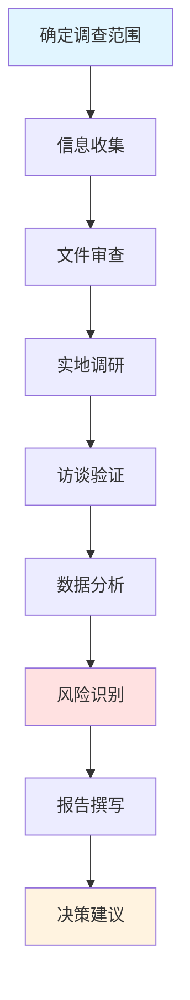
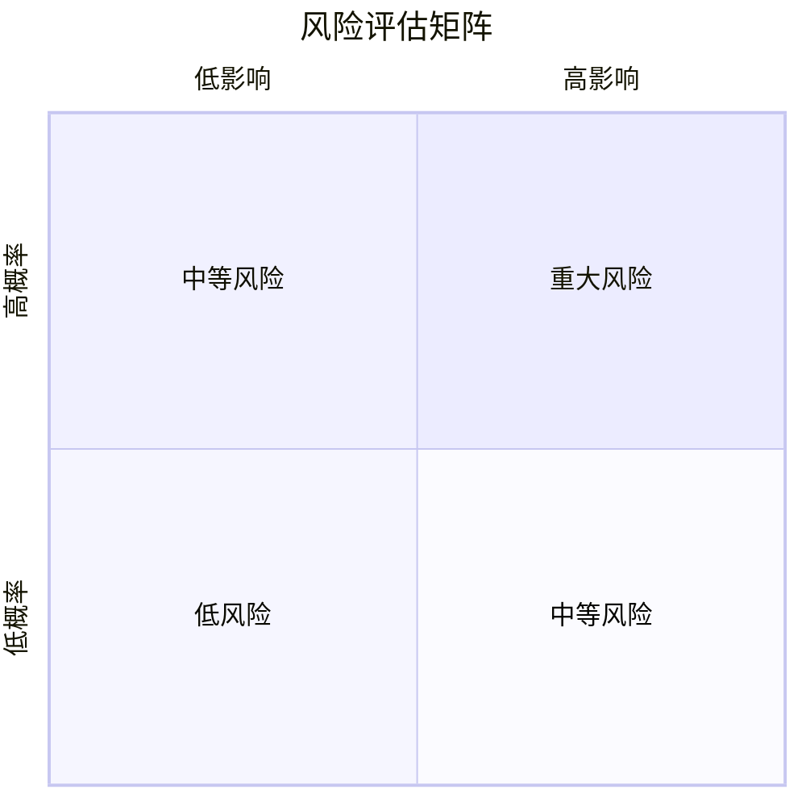

# 尽职调查方法

## 概述

尽职调查（Due Diligence）是投资决策前的关键环节，通过系统性的信息收集、验证和分析，全面评估投资标的的真实状况。深入的尽职调查能够：

- 验证公司披露信息的真实性
- 发现潜在的风险和问题
- 评估管理层的诚信度
- 识别隐藏的价值或陷阱
- 降低投资决策的不确定性

本文提供专业的尽职调查方法论，涵盖调查流程、信息来源、验证技巧和风险识别。

**学习目标**：
1. 掌握系统化的尽职调查流程
2. 学会多渠道信息收集和验证
3. 识别财务造假和管理层欺诈的信号
4. 建立风险预警机制
5. 培养批判性思维能力

## 尽职调查框架

### 调查流程图



### 调查深度层级

#### 桌面调查（Desk Research）
**时间**：1-3天
**方法**：公开信息研究
**输出**：初步调查报告

#### 标准调查（Standard DD）
**时间**：1-2周
**方法**：文件审查 + 管理层访谈
**输出**：标准尽调报告

#### 深度调查（Deep DD）
**时间**：2-4周
**方法**：全面调查 + 实地调研 + 第三方验证
**输出**：完整尽调报告


## 尽职调查流程

### 完整尽职调查框架


### 第一步：桌面调查 (Desk Research)

**目标**: 收集和分析所有公开信息

**信息收集清单**:

1. **公司文件**
   - 招股说明书 (IPO Prospectus)
   - 年度报告 (10-K / 年报)
   - 季度报告 (10-Q / 季报)
   - 代理声明 (Proxy Statement)
   - 8-K 重大事件报告
   - 投资者演示文稿

2. **监管文件**
   - SEC 备案文件
   - 诉讼记录
   - 监管处罚
   - 专利申请
   - 商标注册

3. **新闻和媒体**
   - 公司新闻稿
   - 媒体报道
   - 行业新闻
   - 社交媒体
   - 分析师报告

4. **第三方数据**
   - 行业报告
   - 市场研究
   - 客户评价
   - 员工评价 (Glassdoor)
   - 供应商信息

**桌面调查时间**: 2-3天

### 第二步：财务验证 (Financial Verification)

**目标**: 验证财务数据的真实性和质量

**验证维度**:

1. **收入质量验证**
   - 收入确认政策是否保守？
   - 应收账款增长是否合理？
   - 递延收入变化趋势
   - 客户集中度风险
   - 收入可持续性

**收入质量红旗**:
- 应收账款增长 > 收入增长
- 应收账款周转天数持续增加
- 频繁变更收入确认政策
- 大量关联交易收入
- 季末突击确认收入

2. **利润质量验证**
   - 毛利率是否合理？
   - 费用率是否正常？
   - 非经常性损益占比
   - 会计估计变更
   - 利润来源分析

**利润质量红旗**:
- 毛利率异常高于同行
- 费用资本化比例过高
- 频繁的非经常性收益
- 折旧摊销政策激进
- 利润与现金流背离

3. **现金流验证**
   - 经营现金流 vs 净利润
   - 资本支出合理性
   - 营运资本变化
   - 现金流持续性
   - 自由现金流质量

**现金流红旗**:
- 经营现金流 < 净利润 (持续)
- 应收账款和存货快速增长
- 资本支出异常低
- 频繁融资补充现金
- 现金流波动剧烈

4. **资产负债表验证**
   - 资产真实性
   - 商誉和无形资产
   - 表外负债
   - 或有负债
   - 资产减值风险

**资产负债表红旗**:
- 商誉占比 > 30%
- 大量长期应收款
- 频繁的资产减值
- 大量关联方往来
- 表外融资安排

5. **会计政策检查**
   - 收入确认政策
   - 折旧摊销方法
   - 存货计价方法
   - 坏账准备政策
   - 会计估计变更

**会计政策红旗**:
- 频繁变更会计政策
- 会计政策激进
- 与同行不一致
- 审计意见非标准
- 频繁更换审计师

**财务验证工具**:
- Beneish M-Score (财务造假检测)
- Altman Z-Score (破产风险)
- Piotroski F-Score (财务健康)
- 现金流质量分析
- 应计项目分析

**输出**: 财务验证报告 (15-20页)


### 第三步：业务验证 (Business Verification)

**目标**: 验证商业模式和竞争优势的真实性

**验证方法**:

1. **产品/服务验证**
   - 亲自使用产品
   - 客户访谈
   - 产品评价分析
   - 竞品对比测试
   - 技术评估

**验证问题**:
- 产品真的好用吗？
- 客户真的满意吗？
- 与竞品相比如何？
- 技术是否领先？
- 是否有护城河？

2. **市场验证**
   - 市场规模验证
   - 市场份额验证
   - 增长率验证
   - 竞争格局验证
   - 行业趋势验证

**验证来源**:
- 第三方市场研究 (Gartner, IDC)
- 行业协会数据
- 政府统计数据
- 竞争对手披露
- 专家访谈

3. **客户验证**
   - 客户满意度
   - 客户留存率
   - 客户推荐意愿 (NPS)
   - 客户集中度
   - 客户粘性

**验证方法**:
- 客户访谈
- 在线评价分析
- 客户流失数据
- 续约率数据
- 客户案例研究

4. **供应链验证**
   - 供应商关系
   - 供应链稳定性
   - 采购成本
   - 库存管理
   - 物流效率

**验证方法**:
- 供应商访谈
- 工厂参观
- 库存周转分析
- 采购价格趋势
- 供应链风险评估

**输出**: 业务验证报告 (10-15页)

### 第四步：法律合规调查 (Legal & Compliance)

**目标**: 识别法律风险和合规问题

**调查内容**:

1. **公司结构**
   - 股权结构
   - 关联方关系
   - VIE 结构 (中国公司)
   - 子公司和合资企业
   - 股权激励计划

2. **诉讼和纠纷**
   - 未决诉讼
   - 历史诉讼
   - 仲裁案件
   - 监管调查
   - 潜在法律风险

3. **知识产权**
   - 专利组合
   - 商标权
   - 版权
   - 技术许可
   - 知识产权纠纷

4. **合规状况**
   - 监管合规
   - 环保合规
   - 劳动法合规
   - 税务合规
   - 反腐败合规

5. **重大合同**
   - 客户合同
   - 供应商合同
   - 融资协议
   - 担保承诺
   - 限制性条款

**法律尽调清单**:
- [ ] 公司章程和股东协议
- [ ] 重大合同清单
- [ ] 诉讼和仲裁清单
- [ ] 知识产权清单
- [ ] 监管批文和许可
- [ ] 环保和安全记录
- [ ] 劳动合同和纠纷
- [ ] 税务合规记录
- [ ] 关联交易清单
- [ ] 对外担保清单

**输出**: 法律合规报告 (8-10页)

### 第五步：实地调研 (Field Research)

**目标**: 通过实地考察获取第一手信息

**调研类型**:

1. **公司拜访**
   - 总部参观
   - 工厂参观
   - 研发中心参观
   - 管理层会面
   - 员工访谈

**拜访准备**:
- 提前预约
- 准备问题清单
- 研究背景资料
- 明确调研目标
- 安排记录方式

**观察要点**:
- 办公环境和氛围
- 员工精神状态
- 生产流程和效率
- 技术和设备水平
- 管理规范程度

2. **渠道调研**
   - 零售店访问
   - 经销商访谈
   - 销售人员访谈
   - 库存水平观察
   - 促销活动了解

**调研问题**:
- 产品销售情况如何？
- 库存水平是否正常？
- 与竞品相比如何？
- 客户反馈如何？
- 价格策略如何？

3. **客户调研**
   - 终端客户访谈
   - 企业客户访谈
   - 使用体验了解
   - 满意度调查
- 转换意愿评估

**调研方法**:
- 深度访谈
- 问卷调查
- 焦点小组
- 神秘顾客
- 在线评价分析

4. **竞争对手调研**
   - 竞品体验
   - 竞争对手拜访
   - 市场份额验证
   - 竞争策略了解
   - 差异化分析

5. **行业专家访谈**
   - 行业协会
   - 技术专家
   - 前员工
   - 咨询顾问
   - 学术研究者

**专家访谈问题**:
- 行业发展趋势？
- 技术变革方向？
- 竞争格局演变？
- 公司行业地位？
- 主要风险因素？

**输出**: 实地调研报告 (15-20页)


### 第六步：第三方验证 (Third-Party Verification)

**目标**: 通过独立第三方验证关键信息

**验证来源**:

1. **行业数据验证**
   - Gartner, IDC (科技行业)
   - Nielsen (消费品)
   - IMS Health (医药)
   - 政府统计局
   - 行业协会

2. **财务数据验证**
   - 审计报告
   - 信用评级报告
   - 银行授信情况
   - 供应商信用查询
   - 税务记录

3. **背景调查**
   - 管理层背景核实
   - 教育经历验证
   - 职业履历验证
   - 诉讼记录查询
   - 信用记录查询

4. **技术验证**
   - 专利有效性
   - 技术先进性
   - 研发能力
   - 技术壁垒
   - 技术路线

**验证工具**:
- 企业信用查询系统
- 专利数据库
- 诉讼数据库
- 新闻数据库
- 社交媒体监控

**输出**: 第三方验证报告 (8-10页)

## 重点领域深度调查

### 财务造假识别

**常见造假手段**:

1. **收入造假**
   - 虚构交易
   - 提前确认收入
   - 关联方交易
   - 循环交易
   - 渠道填塞

**识别方法**:
- 应收账款异常增长
- 收入与现金流背离
- 客户真实性验证
- 关联交易分析
- 行业对比异常

2. **成本费用造假**
   - 费用资本化
   - 推迟确认费用
   - 低估折旧摊销
   - 隐藏负债
   - 虚增资产

**识别方法**:
- 资本化比例异常
- 折旧政策激进
- 资产周转率下降
- 或有负债分析
- 现金流质量分析

3. **资产造假**
   - 虚增存货
   - 虚增应收账款
   - 虚增固定资产
   - 高估无形资产
   - 隐瞒减值

**识别方法**:
- 存货周转率异常
- 实地盘点
- 资产减值测试
- 商誉减值风险
- 资产真实性核查

**财务造假检测模型**:

**Beneish M-Score**:
- M-Score > -1.78: 可能造假
- 8 个财务指标组合
- 识别盈余操纵

**Altman Z-Score**:
- Z < 1.81: 破产风险高
- 5 个财务比率组合
- 预测财务困境

**Piotroski F-Score**:
- F-Score 0-9 分
- 9 个财务健康指标
- 识别优质价值股


### 管理层诚信调查

**调查维度**:

1. **历史记录**
   - 过往公司业绩
   - 承诺兑现情况
   - 资本配置记录
   - 危机应对能力
   - 股东回报记录

2. **利益冲突**
   - 关联交易
   - 自我交易
   - 竞业行为
   - 利益输送
   - 内幕交易

3. **信息披露**
   - 披露及时性
   - 披露完整性
   - 披露透明度
   - 沟通诚实度
   - 坏消息处理

4. **公司治理**
   - 董事会独立性
   - 审计委员会
   - 内部控制
   - 举报机制
   - 合规文化

**管理层诚信红旗**:
- 频繁的关联交易
- 不合理的高薪酬
- 大量股票抛售
- 财务重述
- 审计师意见保留
- 监管处罚记录
- 诉讼缠身
- 信息披露不及时

**调查工具**:
- 背景调查服务
- 诉讼记录查询
- 媒体报道搜索
- 社交媒体监控
- 前员工访谈

### 竞争优势验证

**验证方法**:

1. **品牌优势验证**
   - 品牌认知度调查
   - 品牌溢价测试
   - 客户忠诚度
   - 品牌价值评估
   - 品牌危机应对

**验证工具**:
- 品牌价值排行榜
- 消费者调查
- 社交媒体分析
- 品牌提及率
- 客户留存数据

2. **规模优势验证**
   - 成本结构分析
   - 规模经济效应
   - 采购议价能力
   - 固定成本摊销
   - 市场份额趋势

**验证方法**:
- 单位成本对比
- 毛利率对比
- 规模与成本关系
- 历史数据分析

3. **技术优势验证**
   - 专利数量和质量
   - 研发投入
   - 技术团队
   - 产品性能
   - 技术路线

**验证方法**:
- 专利分析
- 技术专家评估
- 产品测试
- 研发效率分析
- 技术对比

4. **网络效应验证**
   - 用户规模
   - 用户增长
   - 用户活跃度
   - 网络密度
   - 多边市场平衡

**验证指标**:
- 用户数增长
- 网络价值 (Metcalfe's Law)
- 用户留存率
- 平台交易量
- 生态系统规模

## 尽职调查实战

### 案例1: 瑞幸咖啡财务造假

**背景**:
- 2020年4月，瑞幸咖啡承认财务造假
- 虚增2019年销售额约22亿元
- 股价暴跌，退市

**造假手段**:
- 虚构交易
- 虚增收入
- 虚增成本（掩盖利润率异常）
- 伪造银行流水

**本应发现的红旗**:
1. 门店数量与收入不匹配
2. 单店收入异常高
3. 现金流与利润背离
4. 快速扩张但持续亏损
5. 关联方交易复杂

**尽调教训**:
- 实地验证门店流量
- 交叉验证第三方数据
- 分析单位经济模型
- 关注现金流质量
- 警惕过快增长

### 案例2: Theranos 科技骗局

**背景**:
- 声称革命性血液检测技术
- 估值最高达90亿美元
- 2018年公司解散，创始人被起诉

**骗局特征**:
- 技术不透明
- 缺乏同行评审
- 过度保密
- 明星董事会
- 媒体炒作

**本应发现的红旗**:
1. 技术未经独立验证
2. 缺乏科学论文发表
3. 员工流失率高
4. 合作伙伴终止合作
5. 监管机构质疑

**尽调教训**:
- 技术必须独立验证
- 警惕过度保密
- 关注员工评价
- 寻求专家意见
- 不被故事迷惑


### 案例3: 成功的尽职调查 - 发现投资机会

**案例: 发现被低估的优质公司**

**背景**:
- 某消费品公司股价下跌50%
- 市场担忧行业竞争加剧
- P/E 降至历史低位

**尽调过程**:

1. **财务验证**
   - 收入增长放缓但仍为正
   - 利润率保持稳定
   - 现金流强劲
   - 资产负债表健康

2. **业务验证**
   - 实地走访门店，客流正常
   - 客户访谈，满意度高
   - 产品质量未下降
   - 品牌认知度稳定

3. **竞争分析**
   - 竞争加剧但公司份额稳定
   - 品牌护城河依然存在
   - 成本控制能力强
   - 渠道优势明显

4. **管理层评估**
   - 管理层持股增加
   - 回购股票
   - 战略清晰
   - 执行有力

**结论**:
- 市场过度悲观
- 基本面依然稳健
- 估值具有吸引力
- 安全边际充足

**投资结果**:
- 买入后2年股价翻倍
- 验证了尽调的价值

## 尽职调查工具和技巧

### 调研访谈技巧

**访谈准备**:
1. 研究背景资料
2. 准备问题清单
3. 设计访谈流程
4. 准备记录工具
5. 明确访谈目标

**访谈技巧**:
- 开放式问题为主
- 倾听多于说话
- 追问细节
- 观察非语言信息
- 交叉验证信息

**有效问题示例**:
- "能否详细描述一下...？"
- "为什么会这样？"
- "与去年相比有什么变化？"
- "您认为最大的挑战是什么？"
- "如果您是投资者，您会关注什么？"

**避免的问题**:
- 封闭式问题 (是/否)
- 引导性问题
- 过于宽泛的问题
- 敏感的直接问题

### 信息验证技巧

**交叉验证方法**:

1. **三角验证**
   - 至少三个独立来源
   - 不同类型的来源
   - 不同立场的来源

2. **逻辑验证**
   - 数据是否合理？
   - 趋势是否一致？
   - 因果关系是否成立？
   - 是否符合常识？

3. **数据验证**
   - 计算验证
   - 历史对比
   - 同行对比
   - 行业数据对比

**验证清单**:
- [ ] 信息来源可靠吗？
- [ ] 有多个来源确认吗？
- [ ] 数据逻辑合理吗？
- [ ] 与其他信息一致吗？
- [ ] 有反面证据吗？

### 风险信号识别

**高风险信号**:

1. **财务红旗**
   - 收入与现金流长期背离
   - 应收账款异常增长
   - 频繁的会计调整
   - 审计意见非标准
   - 频繁更换审计师

2. **业务红旗**
   - 客户集中度过高 (>50%)
   - 供应商集中度过高
   - 关键人员依赖
   - 产品单一
   - 技术落后

3. **管理层红旗**
   - 频繁变更高管
   - 大量股票抛售
   - 过度承诺
   - 信息披露不透明
   - 关联交易频繁

4. **市场红旗**
   - 市场份额持续下降
   - 客户流失加速
   - 竞争对手崛起
   - 行业衰退
   - 监管收紧

**风险等级评估**:
- 低风险: 0-2 个红旗
- 中风险: 3-5 个红旗
- 高风险: 6+ 个红旗

**应对策略**:
- 低风险: 正常投资
- 中风险: 降低仓位，加强跟踪
- 高风险: 避免投资或快速退出

## 尽职调查报告

### 报告结构

**标准尽调报告模板**:

```markdown
# [公司名称] 尽职调查报告

## 执行摘要
- 调查结论: 通过/有条件通过/不通过
- 主要发现
- 关键风险
- 投资建议

## 1. 调查范围和方法
- 调查时间
- 调查团队
- 调查方法
- 信息来源

## 2. 公司背景
- 基本信息
- 发展历程
- 股权结构
- 管理团队

## 3. 财务验证
- 收入质量
- 利润质量
- 现金流质量
- 资产负债表
- 会计政策
- 财务红旗

## 4. 业务验证
- 商业模式
- 产品/服务
- 市场地位
- 客户验证
- 供应链
- 竞争优势

## 5. 法律合规
- 公司结构
- 诉讼情况
- 知识产权
- 合规状况
- 重大合同

## 6. 实地调研
- 公司拜访
- 渠道调研
- 客户访谈
- 专家访谈
- 调研发现

## 7. 风险评估
- 主要风险
- 风险量化
- 风险等级
- 应对措施

## 8. 结论和建议
- 综合评估
- 投资建议
- 关注要点
- 后续跟踪
```

### 报告撰写要点

**清晰性**:
- 结构清晰
- 逻辑严密
- 语言简洁
- 重点突出

**客观性**:
- 基于事实
- 数据支撑
- 正反两面
- 承认局限

**可操作性**:
- 明确结论
- 具体建议
- 风险提示
- 跟踪计划

**完整性**:
- 覆盖所有关键领域
- 引用信息来源
- 附录支持材料
- 更新记录


## 不同投资规模的尽调深度

### 小额投资 (<$10,000)

**尽调范围**:
- 桌面调查
- 基础财务验证
- 公开信息分析
- 时间投入: 5-10小时

**可接受风险**:
- 信息不完全
- 验证不充分
- 依赖公开信息

### 中等投资 ($10,000-$100,000)

**尽调范围**:
- 完整桌面调查
- 深度财务验证
- 业务验证
- 部分实地调研
- 时间投入: 20-40小时

**风险控制**:
- 财务造假检测
- 管理层背景调查
- 竞争优势验证
- 风险充分识别

### 大额投资 (>$100,000)

**尽调范围**:
- 全面尽职调查
- 深度财务审计
- 广泛实地调研
- 第三方专业验证
- 法律合规审查
- 时间投入: 60-100小时

**风险控制**:
- 专业团队参与
- 独立审计
- 法律顾问
- 行业专家
- 持续跟踪

### 机构投资

**尽调范围**:
- 完整尽职调查
- 专业团队
- 外部顾问
- 持续监控
- 时间投入: 数月

**标准流程**:
- 投资委员会审批
- 多轮尽调
- 独立验证
- 风险评级
- 合规审查

## 尽调成本效益分析

### 成本构成

**直接成本**:
- 数据订阅费用
- 差旅费用
- 专业服务费用 (律师、审计)
- 背景调查费用
- 时间成本

**间接成本**:
- 机会成本
- 学习成本
- 错误成本

### 效益评估

**尽调的价值**:
1. **避免重大损失**
   - 识别财务造假
   - 发现隐藏风险
   - 避免价值陷阱
   - 预防欺诈

2. **提高投资成功率**
   - 深入理解公司
   - 建立投资信心
   - 把握投资时机
   - 优化投资决策

3. **长期复利效应**
   - 积累研究能力
   - 建立行业知识
   - 形成投资框架
   - 提升投资回报

**成本效益比**:
- 避免一次重大损失就能收回多年尽调成本
- 提高投资成功率带来的长期回报远超尽调成本
- 建立的研究能力是长期资产

## 常见问题

### Q1: 个人投资者需要做尽职调查吗？

**A**: 绝对需要，但深度可以根据投资规模调整。

- 小额投资: 基础桌面调查
- 中等投资: 标准尽职调查
- 大额投资: 深度尽职调查

关键是建立系统化的研究流程，即使是简化版的尽调也能显著降低风险。

### Q2: 尽职调查需要多长时间？

**A**: 取决于投资规模和公司复杂度。

- 快速尽调: 1-2天
- 标准尽调: 1-2周
- 深度尽调: 1-2个月
- 持续尽调: 长期跟踪

建议: 重仓股值得投入更多时间深度研究。

### Q3: 如何平衡尽调深度和效率？

**A**: 使用分层方法。

1. 初步筛选 (1-2小时): 快速排除明显不合适的
2. 标准研究 (1-2天): 大多数投资决策
3. 深度尽调 (1-2周): 重仓股和复杂情况
4. 持续跟踪: 已投资公司

关键是建立标准流程和使用模板，提高效率。

### Q4: 个人投资者如何做实地调研？

**A**: 从简单的开始。

- 访问零售店
- 使用产品/服务
- 参加股东大会
- 参加投资者日
- 在线客户访谈
- 社交媒体调研

不需要像机构那样正式，但要保持好奇心和批判性思维。

### Q5: 如何识别财务造假？

**A**: 关注红旗信号。

**关键指标**:
- 现金流 vs 利润
- 应收账款增长
- 存货周转率
- 关联交易
- 会计政策变更

**使用工具**:
- Beneish M-Score
- 财务比率分析
- 同行对比
- 历史趋势

**最重要**: 如果感觉不对，宁可错过也不要冒险。

### Q6: 尽调发现问题怎么办？

**A**: 根据问题严重程度决策。

**轻微问题**:
- 继续投资但降低仓位
- 加强跟踪
- 设置更严格的止损

**严重问题**:
- 放弃投资
- 如已投资则退出
- 记录教训

**原则**: 宁可错过，不可做错。

## 总结

### 核心要点

1. **尽调是投资的必要步骤**
   - 不是可选项
   - 根据规模调整深度
   - 建立标准流程

2. **全面验证**
   - 财务验证
   - 业务验证
   - 法律合规
   - 实地调研
   - 第三方验证

3. **识别风险信号**
   - 财务红旗
   - 业务红旗
   - 管理层红旗
   - 及时止损

4. **持续改进**
   - 总结经验教训
   - 优化调查流程
   - 提升调查能力
   - 建立调查数据库

### 尽调的价值

尽职调查的价值不仅在于避免损失，更在于:
- 深入理解公司
- 建立投资信心
- 发现投资机会
- 提升投资能力

**投资大师的建议**:

> "风险来自于你不知道自己在做什么。" —— 沃伦·巴菲特

> "在投资中，你不需要做对很多事，你只需要避免犯大错。" —— 查理·芒格

### 下一步行动

1. **建立尽调清单**
   - 根据本文创建自己的清单
   - 定制化调整
   - 持续优化

2. **实践尽调**
   - 选择1-2家公司
   - 完整走一遍流程
   - 记录过程和发现

3. **建立尽调数据库**
   - 组织调查资料
   - 记录调查发现
   - 积累调查经验

4. **持续学习**
   - 学习他人案例
   - 总结自己经验
   - 提升调查能力

## 延伸阅读

### 相关主题

- [[research-framework|公司研究框架]]
- [[management-analysis|管理层分析]]
- [[competitive-positioning|竞争定位分析]]
- [[investment-thesis|投资论点构建]]
- [[financial-statements/ratio-analysis|财务比率分析]]
- [[risk-management/risk-types|风险类型]]

### 案例研究

- [[case-studies/failed-companies/enron|Enron 财务造假案例]]
- [[case-studies/failed-companies/theranos|Theranos 科技骗局]]
- [[case-studies/failed-companies/luckin|瑞幸咖啡造假案例]]

### 工具和方法

- [[valuation-methods/dcf-valuation|DCF 估值方法]]
- [[competitive-analysis/economic-moats|经济护城河分析]]
- [[risk-management/behavioral-finance|行为金融学]]

## 参考文献

1. Graham, B., & Dodd, D. (1934). *Security Analysis*. McGraw-Hill.
2. Buffett, W. (1977-2023). *Berkshire Hathaway Annual Letters*.
3. Marks, H. (2011). *The Most Important Thing*. Columbia Business School Publishing.
4. Klarman, S. A. (1991). *Margin of Safety*. HarperCollins.
5. Greenblatt, J. (2010). *You Can Be a Stock Market Genius*. Touchstone.
6. Beneish, M. D. (1999). "The Detection of Earnings Manipulation". *Financial Analysts Journal*.
7. Altman, E. I. (1968). "Financial Ratios, Discriminant Analysis and the Prediction of Corporate Bankruptcy". *Journal of Finance*.
8. Piotroski, J. D. (2000). "Value Investing: The Use of Historical Financial Statement Information". *Journal of Accounting Research*.
9. Sloan, R. G. (1996). "Do Stock Prices Fully Reflect Information in Accruals and Cash Flows about Future Earnings?". *The Accounting Review*.
10. Penman, S. H. (2013). *Financial Statement Analysis and Security Valuation*. McGraw-Hill.
11. Palepu, K. G., & Healy, P. M. (2012). *Business Analysis and Valuation*. Cengage Learning.
12. Damodaran, A. (2012). *Investment Valuation*. Wiley.
13. Fisher, P. A. (1958). *Common Stocks and Uncommon Profits*. Harper & Brothers.
14. Lynch, P. (1989). *One Up On Wall Street*. Simon & Schuster.
15. Greenwald, B., et al. (2001). *Value Investing: From Graham to Buffett and Beyond*. Wiley.

---

*最后更新: 2024-01-20*
*版本: 1.0*
*作者: 金融知识库*

## 第一步：确定调查范围

### 调查目标设定

#### 投资类型决定调查深度

**二级市场投资**：
- 重点：财务真实性、竞争地位、估值合理性
- 深度：标准调查
- 时间：1-2周

**一级市场投资**：
- 重点：商业模式、团队能力、成长潜力
- 深度：深度调查
- 时间：2-4周

**并购交易**：
- 重点：资产质量、法律合规、整合风险
- 深度：全面调查
- 时间：4-8周

### 调查清单制定

#### 财务尽调清单
- [ ] 审计报告（3-5年）
- [ ] 财务报表及附注
- [ ] 税务申报文件
- [ ] 银行对账单
- [ ] 应收应付明细
- [ ] 存货盘点记录
- [ ] 固定资产清单
- [ ] 债务合同
- [ ] 担保抵押情况

#### 业务尽调清单
- [ ] 商业计划书
- [ ] 产品/服务介绍
- [ ] 客户合同样本
- [ ] 供应商协议
- [ ] 销售数据
- [ ] 生产数据
- [ ] 研发项目
- [ ] 知识产权清单
- [ ] 市场调研报告

#### 法律尽调清单
- [ ] 公司章程
- [ ] 股东协议
- [ ] 重大合同
- [ ] 诉讼仲裁记录
- [ ] 行政处罚记录
- [ ] 合规证明
- [ ] 劳动合同
- [ ] 社保缴纳记录
- [ ] 环保许可

#### 管理层尽调清单
- [ ] 管理层简历
- [ ] 股权结构
- [ ] 薪酬体系
- [ ] 激励计划
- [ ] 关联交易
- [ ] 背景调查
- [ ] 信用记录
- [ ] 媒体报道

## 第二步：信息收集

### 公开信息来源

#### 监管披露文件
**上市公司**：
- 年报、半年报、季报
- 招股说明书
- 重大事项公告
- 股东大会资料
- 独立董事意见

**获取渠道**：
- 交易所网站
- 巨潮资讯网
- SEC EDGAR（美股）
- 公司官网

#### 行业研究报告
**来源**：
- 券商研究报告
- 咨询公司报告
- 行业协会报告
- 政府统计数据
- 学术研究论文

**重点关注**：
- 行业趋势判断
- 竞争格局分析
- 公司排名和评价
- 专家观点

#### 新闻媒体报道
**主流媒体**：
- 财经媒体（财新、21世纪经济报道）
- 行业媒体
- 地方媒体
- 社交媒体

**关注重点**：
- 负面新闻
- 管理层动态
- 重大事件
- 行业变化

#### 第三方数据库
**商业数据库**：
- 企查查、天眼查
- 启信宝
- 国家企业信用信息公示系统
- 裁判文书网

**信息类型**：
- 工商登记信息
- 股权结构变更
- 诉讼仲裁记录
- 行政处罚
- 经营异常

### 非公开信息获取

#### 管理层访谈
**访谈对象**：
- CEO/总经理
- CFO/财务总监
- 业务负责人
- 技术负责人

**访谈内容**：
- 战略规划
- 业务模式
- 财务状况
- 竞争优势
- 风险挑战

**访谈技巧**：
- 开放式提问
- 交叉验证
- 观察非语言信号
- 记录矛盾之处

#### 客户调研
**调研方式**：
- 电话访谈
- 实地拜访
- 问卷调查
- 神秘顾客

**调研内容**：
- 产品/服务评价
- 价格竞争力
- 服务质量
- 合作稳定性
- 市场口碑

#### 供应商调研
**调研重点**：
- 合作历史
- 付款情况
- 采购规模
- 议价能力
- 关系稳定性

#### 竞争对手调研
**信息来源**：
- 竞品分析
- 行业会议
- 招聘信息
- 专利申请
- 客户反馈

#### 员工访谈
**访谈对象**：
- 在职员工
- 离职员工
- 中层管理
- 一线员工

**访谈内容**：
- 公司文化
- 管理风格
- 薪酬福利
- 发展前景
- 内部问题

**注意事项**：
- 保护信息来源
- 多方验证
- 识别偏见
- 合法合规

## 第三步：文件审查

### 财务文件审查

#### 审计报告分析

**关注要点**：
1. **审计意见类型**
   - 无保留意见（标准）
   - 保留意见（警惕）
   - 否定意见（危险）
   - 无法表示意见（危险）

2. **审计师变更**
   - 变更原因
   - 变更频率
   - 新审计师资质

3. **强调事项段**
   - 持续经营能力
   - 重大不确定性
   - 会计政策变更

4. **审计调整**
   - 调整金额
   - 调整原因
   - 调整频率

#### 财务报表深度分析

**资产负债表审查**：

**应收账款**：
- 账龄分析
- 坏账准备充足性
- 前五大客户集中度
- 关联方应收
- 周转率变化

**存货**：
- 存货构成
- 跌价准备
- 周转率
- 库龄分析
- 盘点记录

**固定资产**：
- 折旧政策
- 资产状况
- 产能利用率
- 在建工程
- 减值测试

**无形资产**：
- 商誉来源
- 摊销政策
- 减值测试
- 研发资本化

**负债**：
- 债务结构
- 到期分布
- 利率水平
- 担保抵押
- 或有负债

**利润表审查**：

**收入**：
- 收入确认政策
- 收入增长合理性
- 季节性波动
- 关联交易收入
- 收入与现金流匹配

**成本费用**：
- 成本结构
- 毛利率变化
- 期间费用率
- 非经常性损益
- 费用资本化

**利润**：
- 利润构成
- 利润质量
- 税率变化
- 少数股东损益

**现金流量表审查**：

**经营现金流**：
- 与净利润匹配度
- 营运资本变化
- 现金收入比
- 现金流稳定性

**投资现金流**：
- 资本支出合理性
- 并购活动
- 投资收益
- 资产处置

**融资现金流**：
- 融资需求
- 融资成本
- 分红政策
- 股权变动

### 业务文件审查

#### 合同审查

**销售合同**：
- 主要客户合同
- 定价机制
- 付款条件
- 违约条款
- 续约情况

**采购合同**：
- 主要供应商合同
- 采购价格
- 供货稳定性
- 质量保证
- 独家协议

**重大合同**：
- 合同金额
- 执行进度
- 风险条款
- 争议解决

#### 知识产权审查

**专利**：
- 专利数量和质量
- 专利有效期
- 专利诉讼
- 核心技术保护

**商标**：
- 商标注册情况
- 商标价值
- 侵权风险

**著作权**：
- 软件著作权
- 作品著作权
- 授权使用

### 法律文件审查

#### 合规性审查

**资质许可**：
- 经营许可证
- 行业资质
- 环保许可
- 安全生产许可

**诉讼仲裁**：
- 未决诉讼
- 历史诉讼
- 仲裁案件
- 潜在法律风险

**行政处罚**：
- 处罚记录
- 处罚原因
- 整改情况
- 合规风险

## 第四步：实地调研

### 调研准备

#### 调研计划制定

**调研目标**：
- 验证信息真实性
- 评估运营状况
- 了解企业文化
- 发现潜在问题

**调研安排**：
- 参观生产线
- 查看仓库
- 访谈员工
- 观察管理
- 检查设备

#### 调研清单

**生产环节**：
- [ ] 生产设备状况
- [ ] 产能利用率
- [ ] 生产流程
- [ ] 质量控制
- [ ] 安全管理
- [ ] 环保措施

**仓储物流**：
- [ ] 仓库管理
- [ ] 存货状况
- [ ] 物流效率
- [ ] 信息系统

**办公环境**：
- [ ] 办公条件
- [ ] 员工状态
- [ ] 管理氛围
- [ ] 企业文化

### 调研技巧

#### 观察要点

**硬件观察**：
- 设备新旧程度
- 维护保养状况
- 产能匹配度
- 技术先进性
- 安全环保设施

**软件观察**：
- 员工精神面貌
- 工作积极性
- 管理规范性
- 流程效率
- 企业文化氛围

#### 提问技巧

**开放式问题**：
- "能否介绍一下生产流程？"
- "公司面临的主要挑战是什么？"
- "如何看待行业竞争？"

**封闭式问题**：
- "产能利用率是多少？"
- "主要客户有哪些？"
- "研发投入占比多少？"

**追问技巧**：
- "为什么会这样？"
- "能否举个例子？"
- "还有其他原因吗？"

### 调研记录

#### 记录方法

**文字记录**：
- 详细记录关键信息
- 标注时间地点
- 记录信息来源
- 注明待验证事项

**照片记录**：
- 生产现场
- 产品样品
- 设备设施
- 证书资质

**录音录像**：
- 征得同意
- 关键访谈
- 重要说明
- 合法合规

## 第五步：信息验证

### 交叉验证方法

#### 内部一致性验证

**财务数据验证**：
```
验证1：收入 vs 应收账款
- 应收账款增长 ≈ 收入增长
- 应收账款周转率稳定

验证2：收入 vs 现金流
- 销售商品收到的现金 ≈ 收入 + 应收增加

验证3：利润 vs 税金
- 所得税费用 ≈ 利润总额 × 税率

验证4：资产 vs 折旧
- 累计折旧 / 固定资产原值 = 使用年限

验证5：存货 vs 成本
- 存货周转率 = 营业成本 / 平均存货
```

#### 外部一致性验证

**行业对比**：
- 财务指标对比
- 增长率对比
- 估值水平对比
- 市场份额验证

**上下游验证**：
- 客户确认收入
- 供应商确认采购
- 物流数据验证
- 海关数据验证

**第三方数据**：
- 行业协会数据
- 政府统计数据
- 市场调研数据
- 卫星图像数据

### 造假识别

#### 财务造假信号

**收入造假**：
- 收入增长远超行业
- 应收账款异常增长
- 现金流与利润背离
- 关联交易收入占比高
- 收入确认政策激进

**利润造假**：
- 毛利率异常高
- 非经常性损益占比高
- 费用资本化
- 减值准备不足
- 会计政策频繁变更

**资产造假**：
- 存货异常增长
- 固定资产折旧率低
- 商誉占比过高
- 在建工程长期挂账
- 预付款项异常

**现金流造假**：
- 经营现金流持续为负
- 现金流与利润长期背离
- 银行存款与利息收入不匹配
- 受限资金占比高

#### 管理层欺诈信号

**行为信号**：
- 频繁变更审计师
- 信息披露不透明
- 回避关键问题
- 过度承诺
- 生活方式奢华

**治理信号**：
- 内部控制薄弱
- 关联交易频繁
- 独立董事形同虚设
- 信息披露违规
- 监管处罚记录

**业务信号**：
- 商业模式不清晰
- 业绩波动剧烈
- 频繁并购重组
- 主营业务频繁变更
- 行业地位与财务表现不符

### 风险预警指标

#### 财务风险指标

**流动性风险**：
- 流动比率 < 1
- 速动比率 < 0.8
- 现金比率 < 0.2
- 经营现金流持续为负

**偿债风险**：
- 资产负债率 > 70%
- 利息覆盖倍数 < 2
- 短期债务占比 > 50%
- 债务/EBITDA > 4

**盈利风险**：
- ROE < 10%
- 净利率 < 5%
- 毛利率持续下降
- 扣非净利润为负

**成长风险**：
- 收入增长率 < 5%
- 市场份额下降
- 客户流失率上升
- 产品迭代缓慢

#### 业务风险指标

**客户风险**：
- 前五大客户占比 > 50%
- 单一客户占比 > 30%
- 客户集中度上升
- 应收账款账龄延长

**供应商风险**：
- 供应商集中度高
- 原材料价格波动大
- 供应链不稳定
- 依赖单一供应商

**竞争风险**：
- 市场份额下降
- 价格战加剧
- 新进入者增多
- 替代品威胁

**技术风险**：
- 研发投入不足
- 技术落后
- 专利到期
- 颠覆性技术出现

## 第六步：风险评估

### 风险分类与评级

#### 风险矩阵



#### 风险评分

**评分标准**：
- 5分：极高风险（致命）
- 4分：高风险（严重）
- 3分：中等风险（重要）
- 2分：低风险（一般）
- 1分：极低风险（轻微）

**综合评分**：
风险等级 = 发生概率 × 影响程度

### 风险应对策略

#### 风险规避
- 不投资高风险标的
- 退出风险过高的投资
- 避免特定行业/地区

#### 风险降低
- 分散投资
- 降低仓位
- 设置止损
- 对冲策略

#### 风险转移
- 购买保险
- 使用衍生品
- 合作投资
- 结构化安排

#### 风险接受
- 风险可控
- 收益补偿充分
- 持续监控
- 应急预案

## 尽职调查报告

### 报告结构

#### 执行摘要
- 调查结论
- 主要发现
- 风险提示
- 投资建议

#### 调查过程
- 调查范围
- 调查方法
- 信息来源
- 调查限制

#### 详细发现
- 财务尽调结果
- 业务尽调结果
- 法律尽调结果
- 管理层评估

#### 风险分析
- 风险识别
- 风险评级
- 风险量化
- 应对建议

#### 估值调整
- 调整事项
- 调整金额
- 估值区间
- 价格建议

### 报告撰写要点

**客观性**：
- 基于事实
- 避免主观臆断
- 平衡正负面信息
- 明确信息来源

**完整性**：
- 覆盖所有重要方面
- 不遗漏关键信息
- 说明调查限制
- 列出待确认事项

**清晰性**：
- 结构清晰
- 逻辑严密
- 语言简洁
- 重点突出

**可操作性**：
- 明确结论
- 具体建议
- 量化分析
- 行动方案

## 常见陷阱与应对

### 信息陷阱

**陷阱1：信息过载**
- 问题：被大量信息淹没
- 应对：聚焦关键问题，建立信息筛选机制

**陷阱2：信息不对称**
- 问题：管理层选择性披露
- 应对：多渠道验证，寻找独立信息源

**陷阱3：虚假信息**
- 问题：故意误导
- 应对：交叉验证，保持怀疑态度

### 认知陷阱

**陷阱4：确认偏误**
- 问题：只看支持观点的证据
- 应对：主动寻找反面证据

**陷阱5：锚定效应**
- 问题：过度依赖初始信息
- 应对：独立判断，多角度分析

**陷阱6：过度自信**
- 问题：高估自己的判断能力
- 应对：保持谦逊，承认局限性

## 实战案例

### 案例1：瑞幸咖啡财务造假

**造假手法**：
- 虚增收入
- 虚构交易
- 伪造银行流水

**识别信号**：
- 收入增长异常快
- 现金流与利润背离
- 关联交易复杂
- 审计师辞职

**教训**：
- 重视现金流分析
- 关注审计师变更
- 警惕过快增长
- 实地调研验证

### 案例2：康美药业财务造假

**造假手法**：
- 虚增货币资金
- 虚增存货
- 虚增收入

**识别信号**：
- 巨额存款无利息收入
- 存货周转率异常低
- 现金流与利润长期背离
- 关联交易频繁

**教训**：
- 验证银行存款真实性
- 关注存货合理性
- 分析现金流质量
- 警惕关联交易

## 工具与资源

### 尽调工具箱

**文档管理**：
- 虚拟数据室（VDR）
- 文档管理系统
- 云存储服务

**数据分析**：
- Excel财务模型
- Python数据分析
- Tableau可视化

**信息验证**：
- 企查查、天眼查
- 裁判文书网
- 国家企业信用信息公示系统

### 尽调清单模板

**财务尽调清单**：
- 审计报告清单
- 财务报表清单
- 税务文件清单
- 银行文件清单

**业务尽调清单**：
- 合同清单
- 客户清单
- 供应商清单
- 知识产权清单

**法律尽调清单**：
- 公司文件清单
- 诉讼清单
- 合规清单
- 劳动清单

## 延伸阅读

### 必读书籍

1. **《尽职调查指南》** - 彼得·豪森
   - 尽调方法论
   - 实战案例

2. **《财务诡计》** - 霍华德·施利特
   - 识别财务造假
   - 会计陷阱

3. **《审计学》** - 阿伦斯
   - 审计方法
   - 风险评估

4. **《公司调查》** - 约翰·麦克米伦
   - 调查技巧
   - 信息验证

5. **《投资银行：估值、杠杆收购、兼并与收购》** - 罗森鲍姆
   - 并购尽调
   - 估值调整

### 推荐资源

**专业机构**：
- 四大会计师事务所
- 专业尽调公司
- 法律事务所

**在线工具**：
- 企查查
- 天眼查
- 启信宝
- 裁判文书网

## 参考文献

1. Howson, P. (2017). *Due Diligence: The Critical Stage in Mergers and Acquisitions*. Routledge.
2. Schilit, H., & Perler, J. (2010). *Financial Shenanigans*. McGraw-Hill.
3. Arens, A., et al. (2016). *Auditing and Assurance Services*. Pearson.
4. McMullan, J. (2013). *Corporate Investigation*. Wiley.
5. Rosenbaum, J., & Pearl, J. (2013). *Investment Banking*. Wiley.
6. Lajoux, A. R. (2019). *The Art of M&A Due Diligence*. McGraw-Hill.
7. Bragg, S. M. (2011). *Due Diligence: A Guide to Risk Mitigation*. Wiley.
8. Bing, G. (1996). *Due Diligence Techniques and Analysis*. Quorum Books.

---

**下一步行动**：
1. 制定详细的尽调清单
2. 选择一家公司进行模拟尽调
3. 练习信息收集和验证技巧
4. 撰写完整的尽调报告
5. 总结经验教训

**相关主题**：
- [公司研究框架](research-framework.html)
- [管理层分析](management-analysis.html)
- [财务报表分析](../../03-company-analysis/financial-statements/index.html)
- [风险管理](../../04-investment-system/risk-management/index.html)


## 行业特定尽调要点

### 科技公司尽调

**技术验证**:
- 技术真实性
- 技术先进性
- 技术壁垒
- 技术路线
- 专利组合

**产品验证**:
- 产品功能
- 用户体验
- 市场接受度
- 竞品对比
- 迭代速度

**团队验证**:
- 技术团队实力
- 研发效率
- 人才吸引力
- 团队稳定性
- 工程师文化

**特殊关注**:
- 技术泡沫风险
- 烧钱速度
- 商业化能力
- 竞争壁垒

**案例**: Theranos (技术造假), WeWork (商业模式问题)

### 消费品公司尽调

**品牌验证**:
- 品牌认知度
- 品牌美誉度
- 品牌忠诚度
- 品牌价值
- 品牌危机

**渠道验证**:
- 渠道覆盖
- 渠道效率
- 渠道关系
- 库存水平
- 终端表现

**产品验证**:
- 产品质量
- 产品创新
- 消费者反馈
- 复购率
- 市场份额

**供应链验证**:
- 供应商关系
- 质量控制
- 成本控制
- 库存管理
- 物流效率

**特殊关注**:
- 食品安全
- 质量问题
- 渠道冲突
- 库存积压

### 金融公司尽调

**资产质量验证**:
- 贷款组合
- 不良贷款率
- 拨备覆盖率
- 集中度风险
- 行业分布

**风险管理验证**:
- 风险管理体系
- 风险限额
- 压力测试
- 风险文化
- 历史风险事件

**资本充足性**:
- 资本充足率
- 核心一级资本
- 杠杆率
- 资本规划
- 监管要求

**盈利能力**:
- 净息差
- 中间业务收入
- 成本收入比
- ROE/ROA
- 盈利稳定性

**特殊关注**:
- 表外风险
- 关联方贷款
- 监管合规
- 系统性风险

**案例**: 2008金融危机 (资产质量问题), 包商银行 (关联方风险)

### 制造业公司尽调

**生产验证**:
- 工厂参观
- 生产流程
- 设备水平
- 产能利用率
- 质量控制

**成本验证**:
- 成本结构
- 单位成本
- 成本趋势
- 成本控制
- 规模经济

**供应链验证**:
- 供应商关系
- 采购成本
- 库存管理
- 物流效率
- 供应链风险

**环保合规**:
- 环保设施
- 排放标准
- 环保投入
- 环保处罚
- 环保风险

**特殊关注**:
- 产能过剩
- 环保压力
- 原材料价格
- 劳动力成本

## 尽调中的行为陷阱

### 认知偏误

**确认偏误**:
- 只看支持观点的信息
- 忽视反面证据
- **应对**: 主动寻找反面证据

**锚定效应**:
- 过度依赖初始信息
- 难以调整判断
- **应对**: 多角度分析

**可得性偏误**:
- 过度关注容易获得的信息
- 忽视难以获得但重要的信息
- **应对**: 系统化信息收集

**过度自信**:
- 高估自己的判断能力
- 低估风险
- **应对**: 保持谦逊，寻求反馈

### 情绪陷阱

**贪婪**:
- 忽视风险信号
- 降低尽调标准
- 急于投资
- **应对**: 坚持标准，保持纪律

**恐惧**:
- 过度谨慎
- 错过机会
- 过度尽调
- **应对**: 平衡风险收益

**从众**:
- 跟随市场热点
- 忽视独立判断
- 降低尽调深度
- **应对**: 独立思考

**固执**:
- 不承认错误
- 忽视新信息
- 坚持错误判断
- **应对**: 保持开放，及时调整

## 尽调效率优化

### 提高尽调效率

**标准化流程**:
1. 建立标准清单
2. 使用模板
3. 自动化数据收集
4. 重用研究成果
5. 建立知识库

**工具自动化**:
- 财务数据自动抓取
- 新闻自动监控
- 报表自动分析
- 预警自动触发

**团队协作**:
- 分工合作
- 专业分工
- 知识共享
- 交叉验证

**经验积累**:
- 建立尽调数据库
- 总结尽调模式
- 提炼关键问题
- 形成直觉判断

### 尽调时间管理

**时间分配优化**:

| 阶段 | 标准时间 | 优化后 | 优化方法 |
|------|----------|--------|----------|
| 桌面调查 | 8小时 | 4小时 | 模板化、自动化 |
| 财务验证 | 10小时 | 6小时 | 工具辅助 |
| 业务验证 | 8小时 | 6小时 | 重点突出 |
| 实地调研 | 16小时 | 12小时 | 提前准备 |
| 报告撰写 | 8小时 | 4小时 | 模板化 |
| 总计 | 50小时 | 32小时 | 36% 提升 |

**效率提升技巧**:
1. 使用清单避免遗漏
2. 模板化标准流程
3. 工具自动化
4. 重点突出
5. 经验复用

## 尽调质量控制

### 质量标准

**完整性**:
- [ ] 覆盖所有关键领域
- [ ] 信息来源充分
- [ ] 分析深度足够
- [ ] 结论有依据

**准确性**:
- [ ] 数据准确
- [ ] 分析客观
- [ ] 逻辑严密
- [ ] 可验证

**及时性**:
- [ ] 信息最新
- [ ] 及时更新
- [ ] 反映最新情况

**可操作性**:
- [ ] 结论明确
- [ ] 建议具体
- [ ] 风险清晰
- [ ] 可执行

### 质量检查清单

**自我检查**:
- [ ] 我收集了所有关键信息吗？
- [ ] 我验证了关键数据吗？
- [ ] 我分析了所有主要风险吗？
- [ ] 我考虑了反面证据吗？
- [ ] 我的结论有充分依据吗？
- [ ] 我能向别人清晰解释吗？
- [ ] 我愿意基于这个尽调投资吗？

**同行评审**:
- 寻求他人反馈
- 接受质疑
- 完善分析
- 提高质量

## 尽调与投资决策

### 尽调结论的应用

**投资决策矩阵**:

| 尽调结论 | 估值 | 决策 | 仓位 |
|----------|------|------|------|
| 优秀 | 合理 | 买入 | 10-15% |
| 优秀 | 便宜 | 重仓买入 | 15-20% |
| 优秀 | 贵 | 观察等待 | 0% |
| 良好 | 合理 | 买入 | 5-10% |
| 良好 | 便宜 | 买入 | 10-15% |
| 一般 | 便宜 | 小仓位 | 3-5% |
| 差 | 任何 | 不投资 | 0% |

**决策原则**:
- 质量第一
- 价格第二
- 质量差不投
- 质量好等价格

### 尽调与风险管理

**风险分级**:

**低风险** (尽调通过，无重大问题):
- 正常仓位
- 标准止损
- 定期跟踪

**中风险** (尽调发现一些问题):
- 降低仓位 (50%)
- 更严格止损
- 加强监控

**高风险** (尽调发现重大问题):
- 避免投资
- 或极小仓位 (< 3%)
- 非常严格止损
- 密切监控

**风险应对**:
- 分散投资
- 仓位控制
- 止损纪律
- 持续监控

## 最终建议

### 尽调的价值

**短期价值**:
- 避免重大损失
- 识别投资风险
- 提高投资成功率

**长期价值**:
- 积累研究能力
- 建立行业知识
- 形成投资框架
- 提升投资回报

**复利效应**:
- 能力积累
- 知识复利
- 网络效应
- 声誉建立

### 实践建议

1. **从小做起**
   - 小额投资简化尽调
   - 逐步提高标准
   - 积累经验
   - 持续改进

2. **建立系统**
   - 标准化流程
   - 模板化工具
   - 数据库管理
   - 知识积累

3. **保持纪律**
   - 坚持尽调标准
   - 不因贪婪降低标准
   - 发现问题及时止损
   - 持续学习改进

4. **长期坚持**
   - 尽调是长期工作
   - 能力需要积累
   - 经验需要总结
   - 价值需要时间

**最后的话**:

尽职调查是投资的基本功，虽然耗时耗力，但绝对值得。一次深入的尽调可能避免一次重大损失，而长期坚持尽调能够显著提升投资回报。

> "在投资中，你付出的是价格，得到的是价值。尽职调查就是确保你真正理解你得到的是什么。" —— 沃伦·巴菲特

> "风险来自于你不知道自己在做什么。尽职调查就是让你知道你在做什么。" —— 沃伦·巴菲特

---

*最后更新: 2024-01-20*
*版本: 1.0*
*作者: 金融知识库*
