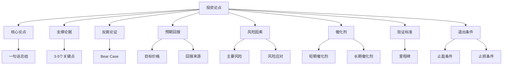

# 投资论点构建

## 概述

投资论点 (Investment Thesis) 是对投资机会的系统化阐述，清晰说明为什么这是一个好投资、预期回报是多少、主要风险是什么、以及如何验证论点的有效性。

**投资论点的重要性**:

> "如果你不能用一句话说清楚为什么要买一只股票，那你就不应该买它。" —— 彼得·林奇

> "投资论点必须简单、清晰、可验证。复杂的论点往往意味着你还没有真正理解。" —— 霍华德·马克斯

**投资论点的作用**:
1. 明确投资逻辑
2. 指导投资决策
3. 设定验证标准
4. 控制投资风险
5. 便于复盘总结


## 投资论点结构

### 标准论点框架



### 核心论点 (Core Thesis)

**要求**:
- 一句话说清楚
- 简单明了
- 可验证
- 有说服力

**优秀论点示例**:

1. **Apple (2010)**
   - "iPhone 将成为主流智能手机，推动服务业务增长，创造长期价值"
   - 简单、清晰、可验证
   - 结果: 10年涨10倍+

2. **Amazon (2005)**
   - "电商将取代传统零售，Amazon 将成为最大受益者"
   - 抓住核心趋势
   - 结果: 15年涨50倍+

3. **茅台 (2010)**
   - "高端白酒需求持续增长，茅台品牌护城河无法复制"
   - 聚焦核心优势
   - 结果: 10年涨15倍+

**差的论点示例**:
- "这家公司很便宜" (缺乏深度)
- "行业前景很好" (没有公司特定优势)
- "管理层很优秀" (过于主观)
- "技术很先进" (没有商业化路径)

### 支撑论据 (Supporting Arguments)

**论据类型**:

1. **行业论据**
   - 行业增长前景
   - 行业结构改善
   - 政策支持
   - 技术进步

2. **公司论据**
   - 竞争优势
   - 市场份额提升
   - 盈利能力改善
   - 管理层优秀
   - 商业模式优越

3. **财务论据**
   - 财务表现优异
   - 现金流强劲
   - 资产负债表健康
   - 资本回报率高

4. **估值论据**
   - 估值低于内在价值
   - 估值低于历史水平
   - 估值低于同行
   - 安全边际充足

**论据要求**:
- 基于事实
- 数据支撑
- 逻辑严密
- 可验证

**论据数量**:
- 3-5个关键论据
- 每个论据独立成立
- 相互支撑加强

### 反面论证 (Bear Case)

**为什么需要 Bear Case？**

1. 避免确认偏误
2. 识别主要风险
3. 评估下行空间
4. 设定止损条件
5. 保持客观理性

**Bear Case 构建**:

**问题清单**:
- 什么情况下投资论点会失效？
- 最大的风险是什么？
- 竞争对手如何反击？
- 行业可能如何变化？
- 最坏情况是什么？

**Bear Case 示例**:

**Apple Bear Case**:
- iPhone 销量见顶
- 中国市场份额下降
- 创新能力减弱
- 监管压力增加
- 估值过高

**应对分析**:
- 服务业务增长对冲
- 产品线多元化
- 生态系统护城河
- 财务实力强
- 估值溢价合理

**结论**: Bear Case 风险可控，投资论点依然成立

### 预期回报 (Expected Returns)

**回报来源分解**:

```
总回报 = 盈利增长 + 估值扩张 + 股息收益

示例:
- 盈利增长: 15% (年化)
- 估值扩张: 5% (P/E 从 20x 到 25x)
- 股息收益: 2%
- 总回报: 22% (年化)
```

**回报预测**:

**保守情景** (30% 概率):
- 盈利增长: 5%
- 估值不变: 0%
- 股息: 2%
- 总回报: 7%

**基准情景** (50% 概率):
- 盈利增长: 15%
- 估值扩张: 5%
- 股息: 2%
- 总回报: 22%

**乐观情景** (20% 概率):
- 盈利增长: 25%
- 估值扩张: 10%
- 股息: 2%
- 总回报: 37%

**期望回报**:
```
期望回报 = 7% × 30% + 22% × 50% + 37% × 20%
         = 2.1% + 11% + 7.4%
         = 20.5%
```

**回报要求**:
- 绝对回报: > 15% 年化
- 相对回报: 超越指数 5%+
- 风险调整回报: 夏普比率 > 1.0


### 风险因素 (Risk Factors)

**风险分类**:

1. **公司特定风险**
   - 执行风险
   - 管理层风险
   - 财务风险
   - 运营风险

2. **行业风险**
   - 竞争加剧
   - 技术变革
   - 监管变化
   - 需求下降

3. **市场风险**
   - 估值过高
   - 流动性风险
   - 市场情绪
   - 系统性风险

**风险量化**:

| 风险 | 概率 | 影响 | 风险值 | 应对 |
|------|------|------|--------|------|
| 竞争加剧 | 40% | -20% | -8% | 监控市场份额 |
| 监管收紧 | 30% | -30% | -9% | 多元化布局 |
| 技术落后 | 20% | -40% | -8% | 跟踪研发投入 |
| 经济衰退 | 10% | -50% | -5% | 保持安全边际 |

**总风险值**: -30% (最大下行空间)

**风险应对**:
- 分散投资
- 仓位控制
- 止损设置
- 对冲策略
- 持续监控

### 催化剂 (Catalysts)

**催化剂的作用**:
- 触发估值重估
- 加速论点实现
- 提供买卖时机
- 缩短投资周期

**催化剂类型**:

**短期催化剂** (3-6个月):
- 季度财报超预期
- 新产品发布
- 重大合同签订
- 分析师上调评级
- 纳入指数
- 股票回购

**中期催化剂** (6-12个月):
- 年度业绩兑现
- 市场份额提升
- 新业务贡献
- 并购整合完成
- 行业拐点
- 政策利好

**长期催化剂** (1-3年):
- 行业格局改善
- 技术突破
- 全球扩张
- 商业模式成熟
- 护城河加宽
- 估值修复

**催化剂评估**:
- 可能性: 高/中/低
- 时间: 具体时间点
- 影响: 对股价的影响
- 可控性: 是否可控

### 验证标准 (Validation Criteria)

**里程碑设定**:

**6个月检查点**:
- 季度业绩是否符合预期？
- 关键指标是否改善？
- 竞争地位是否稳固？
- 是否出现新风险？

**12个月检查点**:
- 年度目标是否实现？
- 投资论点是否得到验证？
- 估值是否合理？
- 是否需要调整论点？

**长期检查点** (2-3年):
- 长期价值是否实现？
- 竞争优势是否保持？
- 是否达到目标价格？
- 是否继续持有？

**验证指标**:
- 财务指标: 营收、利润、现金流
- 运营指标: 市场份额、用户增长
- 估值指标: P/E, P/B, EV/EBITDA
- 竞争指标: 护城河、市场地位

### 退出条件 (Exit Criteria)

**止盈条件**:
- 达到目标价格
- 估值过高 (P/E > 40x)
- 论点完全实现
- 出现更好机会

**止损条件**:
- 跌破买入价 20%
- 论点被证伪
- 基本面恶化
- 出现重大风险

**论点失效条件**:
- 核心假设不成立
- 竞争优势丧失
- 管理层变质
- 行业环境恶化
- 财务造假

**退出决策**:
- 理性决策
- 不受情绪影响
- 遵守纪律
- 及时执行

## 投资论点类型

### 价值型论点

**核心逻辑**: 市场低估了公司的内在价值

**论点要素**:
1. 内在价值明确
2. 市场价格低于内在价值
3. 安全边际充足
4. 价值实现路径清晰

**典型论点**:

**案例: 银行股 (2020)**
- **核心论点**: "疫情导致银行股被过度抛售，估值跌至历史低位，但基本面稳健，提供良好的风险收益比"
- **支撑论据**:
  - P/B 0.6x，历史最低
  - 资产质量良好，不良率 < 2%
  - 股息率 5%+
  - 经济复苏将受益
- **预期回报**: 50-100% (2-3年)
- **风险**: 资产质量恶化、经济衰退

### 成长型论点

**核心逻辑**: 公司将实现快速增长，增长价值未被充分认识

**论点要素**:
1. 巨大的市场空间
2. 强大的竞争优势
3. 可持续的高增长
4. 合理的估值水平

**典型论点**:

**案例: Tesla (2015)**
- **核心论点**: "电动车将成为主流，Tesla 技术领先，将主导高端市场"
- **支撑论据**:
  - 电动车渗透率将从 1% 增长到 20%+
  - Tesla 技术领先 5-10年
  - 品牌和充电网络护城河
  - 自动驾驶潜力
- **预期回报**: 500%+ (5年)
- **风险**: 执行风险、竞争加剧、估值高

### 转型型论点

**核心逻辑**: 公司正在成功转型，市场尚未充分认识

**论点要素**:
1. 转型方向正确
2. 执行能力强
3. 新业务潜力大
4. 估值未反映转型价值

**典型论点**:

**案例: Microsoft (2015)**
- **核心论点**: "Nadella 领导下的云转型将重塑 Microsoft，Azure 将成为主要增长引擎"
- **支撑论据**:
  - 云计算市场快速增长
  - Azure 技术竞争力强
  - 企业客户基础雄厚
  - 管理层执行力强
- **预期回报**: 300%+ (5年)
- **风险**: 转型失败、竞争激烈

### 周期型论点

**核心逻辑**: 行业周期底部，即将反转

**论点要素**:
1. 周期位置判断准确
2. 公司是行业龙头
3. 成本曲线有利
4. 估值极低

**典型论点**:

**案例: 半导体股 (2019)**
- **核心论点**: "半导体周期触底，5G 和 AI 将推动新一轮上行周期"
- **支撑论据**:
  - 库存去化完成
  - 5G 手机换机潮
  - AI 芯片需求爆发
  - 估值处于周期底部
- **预期回报**: 100-200% (2年)
- **风险**: 周期判断错误、需求不及预期

### 特殊情况论点

**核心逻辑**: 特殊事件创造投资机会

**特殊情况类型**:
1. 分拆重组
2. 并购套利
3. 破产重组
4. 激进投资者介入
5. 管理层变更

**典型论点**:

**案例: 分拆投资**
- **核心论点**: "母公司分拆优质资产，分拆后公司被低估"
- **支撑论据**:
  - 分拆资产质量高
  - 独立运营价值更高
  - 市场关注度低
  - 估值折价明显
- **预期回报**: 30-50% (1年)
- **风险**: 分拆执行、市场接受度


## 投资论点模板

### 标准模板

```markdown
# [公司名称] 投资论点

## 基本信息
- 公司: [名称]
- 代码: [股票代码]
- 行业: [行业]
- 当前价格: $XX
- 目标价格: $XX (XX% 上涨空间)
- 投资期限: X年
- 建议仓位: X%

## 核心论点
[一句话总结投资逻辑]

## 支撑论据

### 1. [论据标题]
[详细说明]
- 数据支撑
- 逻辑推理

### 2. [论据标题]
[详细说明]

### 3. [论据标题]
[详细说明]

## 反面论证 (Bear Case)

### 主要风险
1. [风险1]: 概率 XX%, 影响 -XX%
2. [风险2]: 概率 XX%, 影响 -XX%
3. [风险3]: 概率 XX%, 影响 -XX%

### 最坏情况
- 情景描述:
- 下行空间: -XX%
- 应对措施:

## 预期回报

### 回报来源
- 盈利增长: XX%
- 估值扩张: XX%
- 股息收益: XX%
- 总回报: XX%

### 情景分析
| 情景 | 概率 | 回报 | 期望回报 |
|------|------|------|----------|
| 保守 | 30% | 10% | 3% |
| 基准 | 50% | 25% | 12.5% |
| 乐观 | 20% | 50% | 10% |
| 合计 | 100% | - | 25.5% |

## 催化剂

### 短期 (3-6个月)
- [催化剂1]
- [催化剂2]

### 中期 (6-12个月)
- [催化剂1]
- [催化剂2]

### 长期 (1-3年)
- [催化剂1]
- [催化剂2]

## 验证标准

### 6个月检查点
- [ ] [指标1] 达到 XX
- [ ] [指标2] 达到 XX
- [ ] [事件1] 发生

### 12个月检查点
- [ ] [指标1] 达到 XX
- [ ] [指标2] 达到 XX
- [ ] [事件1] 发生

### 长期目标 (2-3年)
- [ ] [目标1]
- [ ] [目标2]

## 退出条件

### 止盈
- 达到目标价格 $XX
- 估值过高 (P/E > XXx)
- 论点完全实现
- 出现更好机会

### 止损
- 跌破 $XX (-20%)
- 论点被证伪
- 基本面恶化
- 出现重大风险

### 论点失效
- [条件1]
- [条件2]
- [条件3]

## 投资决策
- 评级: 买入/持有/卖出
- 仓位: X%
- 买入价格: $XX-$XX
- 目标价格: $XX
- 止损价格: $XX
- 预期持有期: X年

## 跟踪计划
- 日常: 股价、新闻
- 周度: 行业动态
- 月度: 运营数据
- 季度: 财报分析
- 年度: 全面复盘

---
创建日期: [日期]
最后更新: [日期]
```

## 投资论点实战

### 案例1: 价值投资论点 - 银行股

**背景** (2020年3月):
- COVID-19 疫情爆发
- 银行股暴跌 40-50%
- 市场恐慌情绪

**投资论点**:

**核心论点**:
"疫情导致银行股被过度抛售，优质银行估值跌至历史极低水平，提供罕见的投资机会"

**支撑论据**:
1. **估值极低**
   - P/B 0.5-0.7x (历史最低)
   - P/E 5-7x
   - 股息率 6-8%

2. **基本面稳健**
   - 资本充足率 > 12%
   - 不良贷款率 < 2%
   - 拨备覆盖率 > 150%
   - 流动性充足

3. **政策支持**
   - 央行降息降准
   - 财政刺激
   - 监管支持
   - 经济将复苏

4. **安全边际**
   - 下行空间有限 (已跌 40-50%)
   - 上行空间大 (估值修复 50-100%)
   - 股息提供保护

**Bear Case**:
- 资产质量恶化
- 不良贷款大幅上升
- 经济长期衰退
- 监管收紧

**预期回报**:
- 保守: 30% (估值修复到 P/B 0.8x)
- 基准: 60% (估值修复到 P/B 1.0x)
- 乐观: 100% (估值修复到 P/B 1.2x)
- 期望回报: 60%

**催化剂**:
- 短期: 疫情控制，市场情绪改善
- 中期: 经济数据改善，资产质量稳定
- 长期: 经济复苏，盈利增长

**验证标准**:
- 6个月: 不良率 < 2.5%，股价反弹 20%+
- 12个月: 业绩恢复增长，估值修复到 P/B 0.8x+
- 2年: 估值修复到 P/B 1.0x+

**退出条件**:
- 止盈: P/B 1.2x 或涨幅 100%
- 止损: 不良率 > 3% 或跌破买入价 20%
- 论点失效: 资产质量大幅恶化

**实际结果** (2020-2021):
- 优质银行股反弹 60-100%
- 论点得到验证
- 成功投资案例


### 案例2: 成长投资论点 - SaaS 公司

**背景** (2018):
- 云计算快速发展
- SaaS 模式成熟
- 优质 SaaS 公司估值合理

**投资论点**:

**核心论点**:
"企业数字化转型推动 SaaS 需求爆发，优质 SaaS 公司将实现持续高增长"

**支撑论据**:
1. **市场空间巨大**
   - 全球 SaaS 市场 $100B+
   - 年增长率 20%+
   - 渗透率仍低 (< 20%)
   - 长期增长空间

2. **商业模式优越**
   - 订阅收入，可预测
   - 高毛利率 (70-80%)
   - 负流失率 (扩展收入)
   - 规模经济明显

3. **竞争优势**
   - 转换成本高
   - 网络效应
   - 产品领先
   - 客户粘性强

4. **财务表现**
   - 营收增长 30-50%
   - 毛利率 75%+
   - LTV/CAC > 3
   - 规模化后高盈利

**Bear Case**:
- 竞争加剧
- 增长放缓
- 客户流失
- 估值过高

**预期回报**:
- 年化回报: 25-30%
- 3年回报: 100-150%

**催化剂**:
- 季度业绩超预期
- 大客户签约
- 产品创新
- 市场份额提升

**验证标准**:
- 营收增长 > 30%
- 净留存率 > 120%
- 毛利率 > 75%
- 规模化路径清晰

**实际结果**:
- 优质 SaaS 公司 2018-2021 涨幅 200-500%
- 论点得到验证

### 案例3: 特殊情况论点 - 分拆投资

**背景** (2019):
- 某集团分拆电商业务
- 分拆后独立上市
- 市场关注度低

**投资论点**:

**核心论点**:
"分拆后的电商公司被市场忽视，估值明显低于可比公司，提供短期套利机会"

**支撑论据**:
1. **估值折价**
   - P/S 1.5x vs 可比公司 3.0x
   - 折价 50%
   - 无合理理由

2. **业务质量**
   - 营收增长 30%+
   - 盈利能力改善
   - 市场地位稳固
   - 管理层优秀

3. **催化剂明确**
   - 纳入指数 (3个月内)
   - 分析师覆盖增加
   - 机构投资者关注
   - 估值修复

4. **风险可控**
   - 业务独立运营
   - 财务健康
   - 下行空间有限

**Bear Case**:
- 独立运营困难
- 业绩不及预期
- 市场持续忽视

**预期回报**:
- 6个月: 30-50%
- 1年: 50-80%

**催化剂**:
- 3个月: 纳入指数
- 6个月: 首份独立财报
- 12个月: 估值修复完成

**验证标准**:
- 业绩符合预期
- 估值逐步修复
- 机构持仓增加

**退出条件**:
- 估值修复到可比水平
- 涨幅达到 50%+
- 或 12个月后

**实际结果**:
- 6个月涨幅 45%
- 12个月涨幅 70%
- 成功套利

## 论点质量评估

### 优秀论点的特征

1. **简单清晰**
   - 一句话说清楚
   - 逻辑简单
   - 易于理解
   - 易于传达

2. **基于事实**
   - 数据支撑
   - 可验证
   - 客观分析
   - 非主观臆断

3. **风险可控**
   - 识别主要风险
   - 量化风险
   - 应对措施
   - 安全边际

4. **可验证**
   - 明确的里程碑
   - 可观察的指标
   - 清晰的时间表
   - 退出条件明确

5. **回报吸引**
   - 预期回报 > 15%
   - 风险收益比 > 2:1
   - 回报来源清晰
   - 实现路径明确

### 论点质量清单

**自我检查**:
- [ ] 我能用一句话说清楚论点吗？
- [ ] 论点基于事实还是希望？
- [ ] 我分析了反面论证吗？
- [ ] 我量化了风险和回报吗？
- [ ] 我设定了验证标准吗？
- [ ] 我知道什么时候退出吗？
- [ ] 我能向别人清晰解释吗？
- [ ] 我愿意投入真金白银吗？
- [ ] 论点经得起质疑吗？
- [ ] 我有足够的信心吗？

**如果有任何一项回答"否"，重新审视论点！**

## 论点管理

### 论点追踪

**建立论点数据库**:

```
investment-thesis/
├── active/
│   ├── company-a-thesis.md
│   ├── company-b-thesis.md
│   └── company-c-thesis.md
├── archived/
│   ├── successful/
│   └── failed/
└── templates/
    └── thesis-template.md
```

**追踪内容**:
- 论点创建日期
- 核心假设
- 验证进度
- 修改记录
- 最终结果

### 论点更新

**更新触发条件**:
- 季度财报发布
- 重大事件发生
- 行业环境变化
- 竞争格局变化
- 估值大幅变化

**更新内容**:
- 验证论点有效性
- 更新关键假设
- 调整预期回报
- 重新评估风险
- 修改退出条件

**更新频率**:
- 重仓股: 季度更新
- 中等仓位: 半年更新
- 小仓位: 年度更新
- 重大事件: 及时更新

### 论点复盘

**成功案例复盘**:
- 论点为什么正确？
- 哪些判断准确？
- 哪些超出预期？
- 可复制的经验？
- 如何提高成功率？

**失败案例复盘**:
- 论点哪里错了？
- 为什么判断失误？
- 忽略了什么风险？
- 如何避免重复？
- 学到了什么？

**复盘模板**:

```markdown
# 投资复盘: [公司名称]

## 基本信息
- 买入日期:
- 买入价格:
- 卖出日期:
- 卖出价格:
- 回报率:
- 持有期:

## 原始论点
[当时的投资论点]

## 论点验证
- 哪些假设正确？
- 哪些假设错误？
- 意外因素？

## 决策分析
- 买入决策: 正确/错误
- 持有决策: 正确/错误
- 卖出决策: 正确/错误

## 经验教训
- 成功经验:
- 失败教训:
- 改进方向:

## 可复制模式
- 可复制的成功因素
- 需要避免的错误
```

**复盘频率**:
- 每笔交易结束后
- 季度组合复盘
- 年度全面复盘


## 常见问题

### Q1: 投资论点需要多详细？

**A**: 取决于投资规模和复杂度。

**简化版** (小额投资):
- 核心论点 (1段)
- 3个支撑论据
- 主要风险
- 目标价和止损价

**标准版** (中等投资):
- 完整论点结构
- 详细论据和数据
- Bear Case 分析
- 催化剂和验证标准

**完整版** (大额投资):
- 深度研究报告
- 详细财务模型
- 情景分析
- 持续跟踪计划

**原则**: 仓位越大，论点越详细

### Q2: 论点多久需要更新？

**A**: 定期更新 + 事件驱动更新。

**定期更新**:
- 重仓股: 每季度
- 中等仓位: 每半年
- 小仓位: 每年

**事件驱动**:
- 财报发布
- 重大事件
- 行业变化
- 论点验证/失效

### Q3: 论点失效怎么办？

**A**: 及时止损，不要固执。

**论点失效信号**:
- 核心假设被证伪
- 竞争优势丧失
- 财务恶化
- 管理层变质
- 行业环境恶化

**应对措施**:
1. 重新评估
2. 如果确认失效，立即止损
3. 不要因为亏损而坚持
4. 总结教训
5. 寻找新机会

**原则**: 承认错误，及时纠正

### Q4: 如何平衡论点的简单性和完整性？

**A**: 分层表达。

**电梯演讲版** (30秒):
- 一句话核心论点
- 用于快速沟通

**摘要版** (5分钟):
- 核心论点
- 3个关键论据
- 主要风险
- 预期回报

**完整版** (30分钟):
- 详细研究报告
- 所有分析和数据
- 用于深度讨论

**原则**: 能简单说清楚，但有详细支撑

### Q5: 如何处理论点的不确定性？

**A**: 承认不确定性，用概率思维。

**方法**:
1. 情景分析 (保守/基准/乐观)
2. 概率加权
3. 期望回报计算
4. 安全边际
5. 仓位控制

**示例**:
- 保守情景 (30%): 回报 10%
- 基准情景 (50%): 回报 25%
- 乐观情景 (20%): 回报 50%
- 期望回报: 24%

**原则**: 不确定性越高，仓位越小

## 投资论点与投资风格

### 价值投资论点

**特点**:
- 强调安全边际
- 关注内在价值
- 重视资产质量
- 耐心等待

**论点重点**:
- 估值低于内在价值
- 资产质量优良
- 下行风险有限
- 价值实现路径

**案例**: 巴菲特的投资论点

### 成长投资论点

**特点**:
- 强调增长潜力
- 关注市场空间
- 重视竞争优势
- 愿意支付溢价

**论点重点**:
- 巨大的市场空间
- 持续的高增长
- 强大的竞争优势
- 增长价值未被认识

**案例**: 费雪的投资论点

### 宏观投资论点

**特点**:
- 自上而下
- 关注宏观趋势
- 主题投资
- 时机把握

**论点重点**:
- 宏观趋势明确
- 行业受益明显
- 公司是最佳标的
- 时机合适

**案例**: 索罗斯的投资论点

### 量化投资论点

**特点**:
- 基于数据和模型
- 系统化方法
- 可回测
- 可复制

**论点重点**:
- 因子有效性
- 历史回测
- 统计显著性
- 风险调整回报

**案例**: 因子投资论点

## 总结

### 核心要点

1. **投资论点是投资的基础**
   - 明确投资逻辑
   - 指导决策
   - 控制风险
   - 便于复盘

2. **论点必须简单清晰**
   - 一句话核心论点
   - 3-5个关键论据
   - 可验证
   - 可传达

3. **正反两面分析**
   - Bull Case
   - Bear Case
   - 风险收益平衡
   - 概率思维

4. **设定验证标准**
   - 里程碑
   - 检查点
   - 退出条件
   - 持续跟踪

5. **持续更新和复盘**
   - 定期更新
   - 事件驱动
   - 及时调整
   - 总结经验

### 投资大师的建议

> "投资的秘诀不在于评估一个行业对社会的影响有多大，或者它将增长多少，而是确定任何给定公司的竞争优势，最重要的是，这种优势的持久性。" —— 沃伦·巴菲特

> "你必须有一个投资哲学。你不能只是说'我要买这个，因为它在涨'。" —— 查理·芒格

> "最好的投资论点是那些简单到你可以用蜡笔画出来的。" —— 彼得·林奇

### 下一步行动

1. **学习论点构建**
   - 研究优秀论点案例
   - 学习论点结构
   - 掌握分析方法

2. **实践论点写作**
   - 选择3-5只股票
   - 为每只写投资论点
   - 使用标准模板
   - 寻求反馈

3. **建立论点库**
   - 记录所有论点
   - 追踪验证进度
   - 定期更新
   - 复盘总结

4. **持续改进**
   - 分析成功案例
   - 总结失败教训
   - 优化论点框架
   - 提升投资能力

## 延伸阅读

### 相关主题

- [[research-framework|公司研究框架]]
- [[due-diligence|尽职调查方法]]
- [[management-analysis|管理层分析]]
- [[competitive-positioning|竞争定位分析]]
- [[valuation-methods/dcf-valuation|DCF 估值]]
- [[risk-management/risk-types|风险类型]]

### 投资方法论

- [[value-investing/intrinsic-value|内在价值]]
- [[growth-investing/growth-metrics|成长指标]]
- [[macro-investing/top-down-approach|自上而下方法]]
- [[asset-allocation/portfolio-construction|组合构建]]

### 投资大师

- [[investor-profiles/warren-buffett|沃伦·巴菲特]]
- [[investor-profiles/charlie-munger|查理·芒格]]
- [[investor-profiles/peter-lynch|彼得·林奇]]
- [[investor-profiles/howard-marks|霍华德·马克斯]]

## 参考文献

1. Buffett, W. (1977-2023). *Berkshire Hathaway Annual Letters*.
2. Lynch, P. (1989). *One Up On Wall Street*. Simon & Schuster.
3. Marks, H. (2011). *The Most Important Thing*. Columbia Business School Publishing.
4. Klarman, S. A. (1991). *Margin of Safety*. HarperCollins.
5. Greenblatt, J. (2006). *The Little Book That Beats the Market*. Wiley.
6. Graham, B., & Dodd, D. (1934). *Security Analysis*. McGraw-Hill.
7. Fisher, P. A. (1958). *Common Stocks and Uncommon Profits*. Harper & Brothers.
8. Damodaran, A. (2012). *Investment Valuation*. Wiley.
9. Mauboussin, M. J. (2012). *The Success Equation*. Harvard Business Review Press.
10. Carlisle, T. (2014). *Deep Value*. Wiley.
11. Greenwald, B., et al. (2001). *Value Investing: From Graham to Buffett and Beyond*. Wiley.
12. Dorsey, P., & Engelhart, J. (2008). *The Little Book That Builds Wealth*. Wiley.
13. Montier, J. (2009). *Value Investing: Tools and Techniques for Intelligent Investment*. Wiley.
14. Pabrai, M. (2007). *The Dhandho Investor*. Wiley.
15. Spier, G. (2014). *The Education of a Value Investor*. Palgrave Macmillan.

---

*最后更新: 2024-01-20*
*版本: 1.0*
*作者: 金融知识库*


## 高级论点构建技巧

### 多层次论点结构

**第一层: 宏观论点**
- 宏观经济趋势
- 行业发展方向
- 政策环境
- 技术变革

**第二层: 行业论点**
- 行业增长驱动
- 竞争格局改善
- 盈利能力提升
- 行业整合机会

**第三层: 公司论点**
- 公司竞争优势
- 市场份额提升
- 盈利能力改善
- 管理层优秀

**第四层: 估值论点**
- 估值低于内在价值
- 估值修复空间
- 催化剂明确
- 安全边际充足

**论点层次关系**:
```
宏观趋势 → 行业机会 → 公司优势 → 估值吸引 → 投资决策
```

### 论点差异化

**寻找独特视角**:

1. **逆向思维**
   - 市场悲观时乐观
   - 市场乐观时谨慎
   - 寻找被忽视的机会
   - 避免拥挤交易

**案例**:
- 2008年金融危机买入优质银行股
- 2020年疫情买入被错杀的优质公司
- 2022年科技股暴跌买入龙头

2. **长期视角**
   - 关注3-5年价值
   - 忽略短期波动
   - 复利思维
   - 耐心持有

**案例**:
- Amazon 长期亏损但持续投资
- Costco 低毛利率但高客户价值
- Berkshire 长期持有不分红

3. **深度研究**
   - 发现市场未知信息
   - 深入理解商业模式
   - 独特的行业洞察
   - 专业领域优势

**案例**:
- 工程师投资半导体公司
- 医生投资医药公司
- 零售从业者投资消费公司

4. **系统思维**
   - 理解复杂系统
   - 识别反馈循环
   - 预测二阶效应
   - 把握关键变量

**案例**:
- 理解平台网络效应
- 预测技术变革影响
- 把握产业链价值转移

### 论点压力测试

**测试方法**:

1. **魔鬼代言人**
   - 找人挑战你的论点
   - 主动寻找反面证据
   - 测试论点脆弱性
   - 加强薄弱环节

2. **情景分析**
   - 最好情况
   - 最坏情况
   - 最可能情况
   - 黑天鹅事件

3. **敏感性分析**
   - 关键假设变化
   - 对回报的影响
   - 识别关键变量
   - 设定监控指标

4. **历史对比**
   - 类似案例
   - 历史规律
   - 成功率
   - 失败原因

**压力测试清单**:
- [ ] 如果增长率减半，论点还成立吗？
- [ ] 如果竞争加剧，公司能应对吗？
- [ ] 如果估值不扩张，回报还吸引吗？
- [ ] 如果管理层变更，影响多大？
- [ ] 如果行业衰退，公司能生存吗？
- [ ] 如果出现黑天鹅，最大损失多少？

## 论点沟通和说服

### 有效沟通

**沟通对象**:
- 自己 (投资日记)
- 合作伙伴
- 投资委员会
- 客户/LP
- 公众 (博客/社交媒体)

**沟通原则**:

1. **简单清晰**
   - 避免术语
   - 使用类比
   - 讲故事
   - 可视化

2. **逻辑严密**
   - 结构清晰
   - 论据充分
   - 推理合理
   - 结论明确

3. **诚实客观**
   - 承认不确定性
   - 披露风险
   - 不夸大
   - 不隐瞒

4. **可验证**
   - 具体数据
   - 明确标准
   - 可追踪
   - 可复盘

### 说服技巧

**结构化表达**:

1. **SCQA 结构**
   - Situation (情境): 当前状况
   - Complication (冲突): 问题或机会
   - Question (问题): 核心问题
   - Answer (答案): 投资论点

2. **金字塔原理**
   - 结论先行
   - 以上统下
   - 归类分组
   - 逻辑递进

3. **故事化表达**
   - 开头: 吸引注意
   - 发展: 建立论据
   - 高潮: 核心论点
   - 结尾: 行动号召

**视觉化工具**:
- 图表: 数据可视化
- 流程图: 逻辑关系
- 对比表: 竞争分析
- 时间线: 发展历程

### 应对质疑

**常见质疑**:

1. **"估值太高了"**
   - 回应: 分析增长价值
   - 对比历史估值
   - 同行估值对比
   - PEG 合理性

2. **"竞争太激烈"**
   - 回应: 分析竞争优势
   - 护城河评估
   - 市场份额趋势
   - 差异化策略

3. **"增长会放缓"**
   - 回应: 分析增长驱动
   - 市场空间评估
   - 新业务潜力
   - 历史增长持续性

4. **"风险太大"**
   - 回应: 量化风险
   - 风险应对措施
   - 安全边际
   - 风险收益比

**应对原则**:
- 认真对待质疑
- 基于事实回应
- 承认合理质疑
- 调整论点或放弃

## 论点演进和迭代

### 论点生命周期

**阶段1: 论点形成** (研究阶段)
- 初步想法
- 深度研究
- 论点构建
- 压力测试

**阶段2: 论点验证** (投资初期)
- 买入执行
- 初步验证
- 跟踪观察
- 调整优化

**阶段3: 论点实现** (持有期)
- 持续验证
- 论点强化
- 价值实现
- 回报兑现

**阶段4: 论点完成** (退出期)
- 目标达成
- 论点失效
- 退出执行
- 复盘总结

### 论点迭代

**迭代触发**:
- 新信息出现
- 假设被验证/证伪
- 环境变化
- 风险变化

**迭代方式**:

1. **强化论点**
   - 论点得到验证
   - 增加仓位
   - 提高目标价
   - 延长持有期

2. **调整论点**
   - 部分假设变化
   - 修改预期
   - 调整策略
   - 保持仓位

3. **弱化论点**
   - 论点部分失效
   - 降低仓位
   - 降低目标价
   - 准备退出

4. **放弃论点**
   - 论点完全失效
   - 立即止损
   - 退出投资
   - 总结教训

**迭代记录**:
- 记录每次迭代
- 说明原因
- 调整内容
- 结果验证

## 组合层面的论点管理

### 组合论点协调

**组合构建原则**:

1. **论点多元化**
   - 不同类型论点
   - 不同行业
   - 不同风格
   - 降低相关性

2. **论点互补**
   - 周期对冲
   - 风格平衡
   - 地域分散
   - 风险分散

3. **论点集中**
   - 高确信度论点
   - 重仓配置
   - 深度研究
   - 持续跟踪

**组合论点示例**:

| 公司 | 论点类型 | 仓位 | 预期回报 | 风险等级 |
|------|----------|------|----------|----------|
| Apple | 质量成长 | 20% | 15% | 低 |
| 茅台 | 品牌价值 | 15% | 20% | 低 |
| Nvidia | 高速成长 | 10% | 30% | 中 |
| 银行股 | 价值修复 | 15% | 25% | 中 |
| 新能源 | 主题投资 | 10% | 40% | 高 |
| 现金 | 防御 | 30% | 0% | 无 |

**组合特征**:
- 核心持仓: 50% (高确信度)
- 卫星持仓: 20% (高增长)
- 防御持仓: 30% (现金/债券)

### 论点相关性管理

**相关性类型**:

1. **正相关论点**
   - 同一行业
   - 同一主题
   - 同一风格
   - 风险集中

**管理**: 控制总仓位

2. **负相关论点**
   - 对冲关系
   - 周期相反
   - 风格相反
   - 风险分散

**管理**: 平衡配置

3. **低相关论点**
   - 不同行业
   - 不同地域
   - 不同驱动因素
   - 真正分散

**管理**: 优先选择

**相关性监控**:
- 计算组合相关性
- 识别集中风险
- 调整仓位配置
- 保持分散

## 论点与投资纪律

### 投资纪律的重要性

> "投资成功的关键不在于你知道什么，而在于你如何坚持你所知道的。" —— 霍华德·马克斯

**纪律要求**:

1. **买入纪律**
   - 只买符合论点的股票
   - 只在合理价格买入
   - 分批建仓
   - 不追高

2. **持有纪律**
   - 论点有效就持有
   - 不被短期波动影响
   - 定期验证论点
   - 耐心等待

3. **卖出纪律**
   - 达到目标价卖出
   - 论点失效卖出
   - 出现更好机会卖出
   - 不因亏损而坚持

4. **仓位纪律**
   - 根据确信度配置
   - 单只股票 < 20%
   - 行业集中度 < 40%
   - 保持分散

### 情绪管理

**常见情绪陷阱**:

1. **贪婪**
   - 追涨
   - 重仓单只
   - 忽视风险
   - 过度自信

**应对**: 坚持估值纪律，保持安全边际

2. **恐惧**
   - 恐慌抛售
   - 错过机会
   - 过度谨慎
   - 频繁交易

**应对**: 坚持投资论点，理性分析

3. **后悔**
   - 卖早了
   - 买贵了
   - 错过了
   - 亏损了

**应对**: 接受不完美，关注过程

4. **固执**
   - 不承认错误
   - 论点失效仍持有
   - 加仓摊平
   - 拒绝止损

**应对**: 及时认错，果断止损

**情绪管理工具**:
- 投资日记
- 决策清单
- 自动化规则
- 定期复盘
- 寻求反馈

## 论点文档化

### 为什么要文档化？

1. **明确思考**
   - 写作促进思考
   - 发现逻辑漏洞
   - 完善论点

2. **决策依据**
   - 记录决策过程
   - 提供复盘依据
   - 避免事后诸葛亮

3. **知识积累**
   - 建立研究库
   - 积累经验
   - 形成方法论

4. **沟通工具**
   - 与他人讨论
   - 寻求反馈
   - 团队协作

### 文档化工具

**推荐工具**:

1. **Notion**
   - 数据库功能
   - 模板系统
   - 协作功能
   - 多端同步

2. **Obsidian**
   - 双向链接
   - 知识图谱
   - 本地存储
   - Markdown 格式

3. **Roam Research**
   - 网状笔记
   - 每日笔记
   - 关联思考

4. **Excel/Google Sheets**
   - 财务模型
   - 数据分析
   - 情景分析
   - 跟踪表格

5. **Git/GitHub**
   - 版本控制
   - 变更追踪
   - 协作开发
   - 备份安全

### 文档组织

**目录结构**:

```
investment-thesis/
├── active/
│   ├── 2024-01-apple.md
│   ├── 2024-02-tesla.md
│   └── 2024-03-nvda.md
├── monitoring/
│   ├── quarterly-reviews/
│   └── annual-reviews/
├── archived/
│   ├── successful/
│   │   ├── 2020-01-bank-stock.md
│   │   └── 2021-03-saas-company.md
│   └── failed/
│       ├── 2019-05-retail-stock.md
│       └── 2022-08-crypto-stock.md
├── templates/
│   ├── value-thesis-template.md
│   ├── growth-thesis-template.md
│   └── special-situation-template.md
└── learnings/
    ├── success-patterns.md
    ├── failure-patterns.md
    └── lessons-learned.md
```

**命名规范**:
- 格式: YYYY-MM-公司名称.md
- 便于排序和查找
- 包含时间信息
- 清晰标识

**元数据标签**:
```yaml
---
company: Apple Inc.
ticker: AAPL
thesis_type: quality_growth
created_date: 2024-01-15
status: active
position_size: 15%
entry_price: $180
target_price: $250
stop_loss: $150
expected_return: 39%
risk_level: low
---
```

## 论点与投资哲学

### 不同投资哲学的论点特点

**价值投资哲学**:
- 论点核心: 安全边际
- 关注: 内在价值、估值折价
- 时间: 耐心等待价值实现
- 风险: 价值陷阱

**成长投资哲学**:
- 论点核心: 增长潜力
- 关注: 市场空间、竞争优势
- 时间: 长期持有
- 风险: 增长不及预期

**宏观投资哲学**:
- 论点核心: 宏观趋势
- 关注: 经济周期、政策变化
- 时间: 周期把握
- 风险: 时机判断

**量化投资哲学**:
- 论点核心: 统计规律
- 关注: 因子、模型
- 时间: 系统化执行
- 风险: 模型失效

### 形成个人投资哲学

**步骤**:

1. **学习各种方法**
   - 价值投资
   - 成长投资
   - 宏观投资
   - 量化投资

2. **实践和试错**
   - 尝试不同方法
   - 记录结果
   - 分析成败
   - 找到适合自己的

3. **形成框架**
   - 明确投资理念
   - 建立选股标准
   - 设定估值要求
   - 确定风险控制

4. **持续优化**
   - 定期复盘
   - 总结经验
   - 改进方法
   - 保持进化

**个人哲学要素**:
- 投资目标
- 风险承受能力
- 时间视角
- 能力圈
- 投资风格
- 决策流程

## 论点库建设

### 建立个人论点库

**论点库价值**:
1. 积累投资想法
2. 跟踪论点演进
3. 复盘投资决策
4. 提炼投资模式
5. 建立投资体系

**论点库内容**:

1. **活跃论点**
   - 当前持仓
   - 投资逻辑
   - 验证进度
   - 跟踪计划

2. **观察论点**
   - 潜在机会
   - 等待时机
   - 跟踪关注
   - 触发条件

3. **历史论点**
   - 已退出投资
   - 成功案例
   - 失败案例
   - 经验教训

4. **论点模板**
   - 不同类型模板
   - 标准分析框架
   - 清单和工具
   - 最佳实践

### 论点库管理

**定期维护**:
- 周度: 更新活跃论点
- 月度: 审查观察论点
- 季度: 复盘历史论点
- 年度: 全面总结

**质量控制**:
- 论点完整性
- 数据准确性
- 逻辑严密性
- 更新及时性

**知识提炼**:
- 成功模式总结
- 失败教训归纳
- 方法论优化
- 能力圈扩展

### 论点结构

#### 标准投资论点模板

**一句话总结**：
```
我们投资[公司名称]，因为[核心逻辑]，
预期[时间周期]内实现[回报目标]。
```

**完整结构**：
1. 投资主题（为什么现在？）
2. 核心逻辑（为什么这家公司？）
3. 关键假设（需要什么条件？）
4. 估值分析（价格合理吗？）
5. 风险因素（什么可能出错？）
6. 催化剂（什么会推动股价？）
7. 退出策略（什么时候卖出？）

## 第一步：确定投资主题

### 主题类型

#### 宏观主题

**经济周期主题**：
- 经济复苏
- 通胀/通缩
- 利率周期
- 货币政策

**结构性主题**：
- 人口老龄化
- 城镇化
- 消费升级
- 产业升级

**技术主题**：
- 人工智能
- 新能源
- 生物科技
- 数字化转型

**政策主题**：
- 政策支持
- 监管放松
- 改革红利
- 国产替代

#### 行业主题

**行业增长**：
- 行业快速增长
- 渗透率提升
- 需求爆发
- 供给改善

**行业整合**：
- 市场集中度提升
- 龙头份额扩大
- 并购整合
- 行业出清

**行业转型**：
- 商业模式创新
- 技术升级
- 产业链重构
- 国际化

#### 公司主题

**价值重估**：
- 被低估
- 资产注入
- 业务重组
- 管理层变更

**成长加速**：
- 新产品放量
- 市场扩张
- 并购整合
- 盈利拐点

**困境反转**：
- 行业底部
- 经营改善
- 债务重组
- 战略调整

### 主题验证

**验证维度**：
1. **趋势确定性**
   - 是否有数据支持？
   - 是否不可逆转？
   - 持续时间多长？

2. **影响程度**
   - 对行业影响多大？
   - 对公司影响多大？
   - 能否量化？

3. **市场认知**
   - 市场是否已充分认知？
   - 是否有预期差？
   - 估值是否反映？

4. **时机判断**
   - 是否已经开始？
   - 拐点在哪里？
   - 最佳介入时机？

## 第二步：构建核心逻辑

### 逻辑链条

#### 完整逻辑链

```
行业趋势 → 公司定位 → 竞争优势 → 增长驱动 → 盈利能力 → 估值提升 → 投资回报
```

**示例：新能源车投资逻辑**：
```
碳中和政策 → 新能源车渗透率提升 → 
电池龙头地位 → 技术领先+规模优势 → 
市场份额扩大 → 收入快速增长 → 
规模效应显现 → 利润率提升 → 
估值合理 → 投资机会
```

### 核心逻辑要素

#### 1. 竞争优势

**护城河识别**：
- 品牌优势
- 技术壁垒
- 规模经济
- 网络效应
- 转换成本

**优势持久性**：
- 护城河宽度
- 护城河深度
- 护城河趋势
- 防御能力

**量化评估**：
```
竞争优势评分 = (护城河宽度 × 0.4) + (护城河深度 × 0.4) + (持久性 × 0.2)
```

#### 2. 增长驱动

**增长来源**：
1. **市场增长**
   - 行业增速
   - 渗透率提升
   - 需求扩张

2. **份额提升**
   - 竞争力增强
   - 市场整合
   - 新市场进入

3. **价格提升**
   - 定价权增强
   - 产品升级
   - 品牌溢价

4. **效率提升**
   - 运营优化
   - 规模效应
   - 技术进步

**增长可持续性**：
- 增长驱动力强度
- 增长空间大小
- 增长持续时间
- 增长质量

#### 3. 盈利能力

**盈利驱动**：
1. **收入增长**
   - 量的增长
   - 价的提升
   - 结构优化

2. **利润率提升**
   - 毛利率改善
   - 费用率下降
   - 规模效应

3. **资本效率**
   - ROE提升
   - ROIC提升
   - 周转率提升

**盈利质量**：
- 现金流质量
- 利润可持续性
- 会计政策稳健性
- 非经常性损益占比

## 第三步：识别关键假设

### 假设分类

#### 市场假设

**需求假设**：
- 市场规模
- 增长率
- 渗透率
- 价格弹性

**供给假设**：
- 产能增长
- 竞争格局
- 进入壁垒
- 技术变化

**政策假设**：
- 监管环境
- 政策支持
- 贸易政策
- 税收政策

#### 运营假设

**收入假设**：
- 销量增长率
- 价格变化
- 市场份额
- 新产品贡献

**成本假设**：
- 原材料价格
- 人工成本
- 规模效应
- 效率提升

**费用假设**：
- 销售费用率
- 管理费用率
- 研发费用率
- 财务费用

#### 财务假设

**资本支出**：
- 扩产计划
- 维护性资本支出
- 并购投资
- 研发投入

**营运资本**：
- 应收账款周转
- 存货周转
- 应付账款周转
- 现金周期

**融资假设**：
- 债务水平
- 融资成本
- 资本结构
- 分红政策

### 假设验证

#### 敏感性分析

**关键变量识别**：
1. 对估值影响最大的变量
2. 不确定性最高的变量
3. 可控性最低的变量

**敏感性测试**：
```
基准情景：假设A
乐观情景：假设A + 20%
悲观情景：假设A - 20%

计算各情景下的估值和回报
```

**敏感性矩阵**：
| 变量 | 基准值 | 乐观值 | 悲观值 | 估值影响 |
|------|--------|--------|--------|----------|
| 收入增长率 | 15% | 20% | 10% | ±30% |
| 净利率 | 20% | 25% | 15% | ±25% |
| PE倍数 | 30x | 35x | 25x | ±17% |

#### 情景分析

**三种情景**：
1. **基准情景**（概率50%）
   - 合理假设
   - 最可能发生
   - 目标回报

2. **乐观情景**（概率25%）
   - 乐观假设
   - 超预期发展
   - 上行空间

3. **悲观情景**（概率25%）
   - 悲观假设
   - 不利发展
   - 下行风险

**期望回报**：
```
期望回报 = 基准回报 × 50% + 乐观回报 × 25% + 悲观回报 × 25%
```

## 第四步：估值分析

### 多维度估值

#### 绝对估值

**DCF模型**：
```
企业价值 = Σ(FCF_t / (1+WACC)^t) + 终值 / (1+WACC)^n

其中：
FCF = 自由现金流
WACC = 加权平均资本成本
终值 = FCF_n × (1+g) / (WACC - g)
```

**关键参数**：
- 预测期：5-10年
- 增长率：分阶段设定
- 折现率：WACC 8-12%
- 永续增长率：2-3%

#### 相对估值

**估值倍数**：
1. **P/E（市盈率）**
   - 当前P/E vs 历史P/E
   - 当前P/E vs 行业P/E
   - PEG比率

2. **P/B（市净率）**
   - 适用于资产驱动型
   - ROE调整
   - 账面价值质量

3. **EV/EBITDA**
   - 消除资本结构影响
   - 适用于并购估值
   - 跨国比较

**估值区间**：
```
保守估值：悲观假设 + 低估值倍数
合理估值：基准假设 + 合理估值倍数
乐观估值：乐观假设 + 高估值倍数
```

### 安全边际

**安全边际计算**：
```
安全边际 = (内在价值 - 当前价格) / 内在价值 × 100%

优秀：> 40%
良好：30-40%
一般：20-30%
不足：< 20%
```

**格雷厄姆原则**：
- 成长股：安全边际 > 30%
- 价值股：安全边际 > 40%
- 困境反转：安全边际 > 50%

## 第五步：风险评估

### 风险分类

#### 行业风险

**周期性风险**：
- 经济周期影响
- 行业周期波动
- 季节性因素
- 政策周期

**竞争风险**：
- 竞争加剧
- 价格战
- 新进入者
- 替代品威胁

**技术风险**：
- 技术颠覆
- 产品迭代
- 研发失败
- 专利到期

**监管风险**：
- 政策变化
- 监管趋严
- 合规成本
- 反垄断

#### 公司风险

**经营风险**：
- 战略失误
- 执行不力
- 产品失败
- 客户流失

**财务风险**：
- 债务风险
- 流动性风险
- 汇率风险
- 利率风险

**管理层风险**：
- 能力不足
- 诚信问题
- 利益冲突
- 团队不稳

**治理风险**：
- 内部控制薄弱
- 关联交易
- 信息披露
- 股东权益

#### 估值风险

**高估风险**：
- 估值过高
- 预期过于乐观
- 市场情绪过热
- 泡沫风险

**流动性风险**：
- 交易量小
- 买卖价差大
- 冲击成本高
- 难以退出

### 风险量化

#### 风险评分

**评分维度**：
1. **发生概率**
   - 极高：> 50%
   - 高：30-50%
   - 中：10-30%
   - 低：< 10%

2. **影响程度**
   - 极大：> 50%损失
   - 大：30-50%损失
   - 中：10-30%损失
   - 小：< 10%损失

**风险等级**：
```
风险等级 = 发生概率 × 影响程度

高风险：> 15%
中风险：5-15%
低风险：< 5%
```

#### 风险应对

**风险规避**：
- 不投资高风险标的
- 退出风险过高的投资
- 避免特定行业/地区

**风险降低**：
- 分散投资
- 降低仓位
- 设置止损
- 对冲策略

**风险转移**：
- 购买保险
- 使用衍生品
- 合作投资
- 结构化安排

**风险接受**：
- 风险可控
- 收益补偿充分
- 持续监控
- 应急预案

## 第六步：识别催化剂

### 催化剂类型

#### 业绩催化剂

**业绩超预期**：
- 收入超预期
- 利润超预期
- 订单超预期
- 指引上调

**业绩拐点**：
- 扭亏为盈
- 增速拐点
- 利润率拐点
- 现金流改善

**业绩确定性**：
- 在手订单
- 合同签订
- 产能释放
- 新产品放量

#### 事件催化剂

**公司事件**：
- 资产注入
- 并购重组
- 股权激励
- 分拆上市

**行业事件**：
- 政策出台
- 行业整合
- 技术突破
- 需求爆发

**市场事件**：
- 指数纳入
- 板块轮动
- 资金流入
- 估值修复

#### 时间催化剂

**财报季**：
- 年报
- 季报
- 业绩预告
- 业绩说明会

**重要会议**：
- 股东大会
- 董事会
- 行业会议
- 政策会议

**关键时点**：
- 产品发布
- 项目投产
- 合同到期
- 政策生效

### 催化剂时间表

**催化剂日历**：
| 时间 | 催化剂 | 预期影响 | 概率 |
|------|--------|----------|------|
| Q1 | 年报发布 | 业绩超预期 | 70% |
| Q2 | 新产品发布 | 订单增长 | 60% |
| Q3 | 政策出台 | 估值提升 | 50% |
| Q4 | 并购完成 | 协同效应 | 80% |

## 第七步：制定退出策略

### 退出条件

#### 目标达成

**价格目标**：
- 达到目标价
- 实现预期回报
- 估值合理
- 安全边际消失

**时间目标**：
- 持有期满
- 投资周期结束
- 重新配置需要

#### 论点失效

**假设不成立**：
- 关键假设被证伪
- 预期差消失
- 催化剂未兑现
- 增长不及预期

**基本面恶化**：
- 竞争优势削弱
- 市场份额下降
- 盈利能力下降
- 财务状况恶化

**更好机会**：
- 发现更好标的
- 风险收益比更优
- 机会成本考虑

#### 风险触发

**止损条件**：
- 跌破止损位
- 风险超出承受
- 黑天鹅事件
- 系统性风险

**风险信号**：
- 管理层变更
- 审计师辞职
- 重大诉讼
- 监管处罚

### 退出策略

#### 分批退出

**退出计划**：
```
第一批：达到目标价的80%，卖出30%
第二批：达到目标价，卖出40%
第三批：超过目标价20%，卖出剩余30%
```

**动态调整**：
- 根据基本面变化
- 根据估值变化
- 根据市场环境
- 根据组合需要

#### 止盈止损

**止盈策略**：
- 移动止盈
- 分批止盈
- 估值止盈
- 时间止盈

**止损策略**：
- 固定止损（-20%）
- 移动止损
- 时间止损
- 基本面止损

## 投资备忘录模板

### 标准格式

#### 执行摘要（1页）

**投资建议**：
- 买入/持有/卖出
- 目标价
- 预期回报
- 投资期限

**一句话论点**：
```
我们建议买入[公司]，因为[核心逻辑]，
预期[时间]内实现[回报]。
```

**关键要点**：
- 3-5个核心逻辑
- 主要风险
- 关键催化剂

#### 投资主题（1-2页）

**宏观背景**：
- 经济环境
- 行业趋势
- 政策环境

**投资机会**：
- 为什么现在？
- 市场预期差
- 时机判断

#### 核心逻辑（3-5页）

**竞争优势**：
- 护城河类型
- 优势强度
- 持久性分析

**增长驱动**：
- 增长来源
- 增长空间
- 增长持续性

**盈利能力**：
- 盈利驱动
- 利润率趋势
- 资本效率

#### 关键假设（2-3页）

**市场假设**：
- 市场规模
- 增长率
- 渗透率

**运营假设**：
- 收入增长
- 利润率
- 市场份额

**财务假设**：
- 资本支出
- 营运资本
- 融资计划

**敏感性分析**：
- 关键变量
- 情景分析
- 影响评估

#### 估值分析（2-3页）

**估值方法**：
- DCF估值
- 相对估值
- 估值区间

**安全边际**：
- 内在价值
- 当前价格
- 安全边际

**目标价**：
- 基准目标价
- 乐观目标价
- 悲观目标价

#### 风险分析（2-3页）

**主要风险**：
- 行业风险
- 公司风险
- 估值风险

**风险量化**：
- 发生概率
- 影响程度
- 风险等级

**应对措施**：
- 风险缓释
- 止损策略
- 持续监控

#### 催化剂（1页）

**近期催化剂**：
- 3-6个月
- 具体事件
- 预期影响

**中期催化剂**：
- 6-12个月
- 关键节点
- 影响评估

#### 退出策略（1页）

**退出条件**：
- 目标达成
- 论点失效
- 风险触发

**退出计划**：
- 分批退出
- 止盈止损
- 时间表

## 持续跟踪机制

### 跟踪指标

#### 财务指标

**增长指标**：
- 收入增长率
- 利润增长率
- 市场份额
- 客户增长

**盈利指标**：
- 毛利率
- 净利率
- ROE
- ROIC

**健康指标**：
- 资产负债率
- 流动比率
- 现金流
- 周转率

#### 运营指标

**业务指标**：
- 订单量
- 产能利用率
- 客户留存率
- 新产品占比

**效率指标**：
- 人均产出
- 坪效
- 库存周转
- 应收周转

**质量指标**：
- 客户满意度
- NPS
- 退货率
- 质量事故

#### 市场指标

**估值指标**：
- P/E
- P/B
- EV/EBITDA
- PEG

**情绪指标**：
- 分析师评级
- 机构持仓
- 融资余额
- 换手率

### 跟踪频率

**日常跟踪**：
- 股价变化
- 重大新闻
- 行业动态
- 竞争对手

**周度跟踪**：
- 周度数据
- 行业数据
- 研究报告
- 市场情绪

**月度跟踪**：
- 月度数据
- 运营指标
- 财务指标
- 组合调整

**季度跟踪**：
- 财报分析
- 业绩评估
- 假设验证
- 论点更新

### 论点更新

#### 更新触发

**定期更新**：
- 季报后
- 年报后
- 重大事件后
- 持有满一年

**触发更新**：
- 假设变化
- 风险触发
- 催化剂兑现
- 估值变化

#### 更新内容

**假设验证**：
- 哪些假设被验证？
- 哪些假设被证伪？
- 需要调整哪些假设？

**论点强化/削弱**：
- 论点是否更强？
- 论点是否削弱？
- 是否需要调整？

**行动建议**：
- 加仓/减仓/持有
- 调整目标价
- 调整止损位
- 退出时机

## 实战案例

### 案例1：茅台投资论点

**投资主题**：
消费升级 + 高端白酒稀缺性

**核心逻辑**：
1. 品牌护城河极宽
2. 供给受限，需求旺盛
3. 定价权强，提价空间大
4. 现金流优秀，分红稳定

**关键假设**：
- 高端白酒需求持续增长
- 茅台产能保持稳定
- 品牌地位不被挑战
- 政策环境稳定

**估值分析**：
- DCF估值：1800元
- PE估值：35-40倍
- 目标价：2000元
- 安全边际：30%

**主要风险**：
- 政策风险（限制三公消费）
- 品牌风险（负面事件）
- 竞争风险（其他高端品牌）

**催化剂**：
- 提价
- 产能释放
- 直销渠道扩大
- 系列酒增长

**退出策略**：
- 估值超过45倍PE
- 品牌力削弱
- 政策重大不利变化

### 案例2：特斯拉投资论点

**投资主题**：
电动车革命 + 能源转型

**核心逻辑**：
1. 技术领先（电池、自动驾驶）
2. 品牌优势（创新、环保）
3. 规模优势（产能、成本）
4. 生态布局（车、能源、软件）

**关键假设**：
- 电动车渗透率持续提升
- 自动驾驶技术突破
- 产能按计划释放
- 毛利率保持20%以上

**估值分析**：
- DCF估值：800美元
- PS估值：5-7倍
- 目标价：1000美元
- 安全边际：25%

**主要风险**：
- 竞争加剧
- 技术风险
- 产能爬坡
- 估值过高

**催化剂**：
- 交付量超预期
- FSD推出
- 新工厂投产
- 新车型发布

**退出策略**：
- 达到目标价
- 竞争优势削弱
- 估值泡沫化

## 延伸阅读

### 必读书籍

1. **《证券分析》** - 本杰明·格雷厄姆
   - 投资分析框架
   - 安全边际原则

2. **《巴菲特致股东的信》** - 沃伦·巴菲特
   - 投资思维
   - 案例分析

3. **《投资最重要的事》** - 霍华德·马克斯
   - 风险思维
   - 逆向思考

4. **《穷查理宝典》** - 查理·芒格
   - 多元思维模型
   - 投资智慧

5. **《聪明的投资者》** - 本杰明·格雷厄姆
   - 投资哲学
   - 市场先生

### 推荐资源

**投资备忘录模板**：
- 对冲基金投资备忘录
- PE投资备忘录
- 个人投资备忘录

**案例学习**：
- 巴菲特投资案例
- 索罗斯投资案例
- 达里奥投资案例

## 参考文献

1. Graham, B., & Dodd, D. (1934). *Security Analysis*. McGraw-Hill.
2. Buffett, W. (Annual). *Berkshire Hathaway Shareholder Letters*.
3. Marks, H. (2011). *The Most Important Thing*. Columbia Business School.
4. Munger, C. (2005). *Poor Charlie's Almanack*. Walsworth Publishing.
5. Graham, B. (1949). *The Intelligent Investor*. Harper & Brothers.
6. Greenblatt, J. (2010). *The Little Book That Beats the Market*. Wiley.
7. Klarman, S. (1991). *Margin of Safety*. HarperBusiness.
8. Lynch, P. (1989). *One Up On Wall Street*. Simon & Schuster.

---

**下一步行动**：
1. 选择一家公司构建完整投资论点
2. 使用标准模板撰写投资备忘录
3. 建立跟踪指标体系
4. 定期更新投资论点
5. 总结经验教训

**相关主题**：
- [公司研究框架](research-framework.html)
- [尽职调查方法](due-diligence.html)
- [管理层分析](management-analysis.html)
- [竞争定位分析](competitive-positioning.html)
- [估值方法](../../03-company-analysis/valuation-methods/index.html)
- [风险管


## 论点与风险管理

### 基于论点的风险控制

**仓位管理**:

```
仓位 = 基础仓位 × 确信度系数 × 风险调整系数

确信度系数:
- 高确信度 (A级论点): 1.5x
- 中确信度 (B级论点): 1.0x
- 低确信度 (C级论点): 0.5x

风险调整系数:
- 低风险: 1.2x
- 中风险: 1.0x
- 高风险: 0.7x
```

**示例**:
- 基础仓位: 10%
- Apple (A级论点, 低风险): 10% × 1.5 × 1.2 = 18%
- 新兴公司 (C级论点, 高风险): 10% × 0.5 × 0.7 = 3.5%

**止损设置**:
- 基于论点而非价格
- 论点失效立即止损
- 价格止损作为备份
- 不因亏损而坚持

**对冲策略**:
- 识别论点风险
- 寻找对冲工具
- 降低组合风险
- 保护下行

### 论点监控系统

**监控指标**:

1. **财务指标**
   - 营收增长率
   - 利润增长率
   - 现金流
   - ROE/ROIC
   - 毛利率

2. **运营指标**
   - 市场份额
   - 用户增长
   - 客户留存
   - 产品指标
   - 运营效率

3. **估值指标**
   - P/E, P/B, P/S
   - EV/EBITDA
   - 相对估值
   - 历史估值分位

4. **竞争指标**
   - 竞争格局
   - 护城河强度
   - 市场地位
   - 创新能力

**监控频率**:
- 实时: 股价、重大新闻
- 日度: 行业动态
- 周度: 运营数据
- 月度: 财务指标
- 季度: 全面复盘

**预警机制**:
- 黄色预警: 关注指标偏离
- 橙色预警: 重要指标恶化
- 红色预警: 论点可能失效

**预警应对**:
- 黄色: 加强监控
- 橙色: 降低仓位
- 红色: 考虑退出

## 总结

### 核心要点

1. **投资论点是投资的灵魂**
   - 明确投资逻辑
   - 指导所有决策
   - 控制投资风险
   - 实现投资目标

2. **论点必须简单清晰**
   - 一句话核心论点
   - 3-5个关键论据
   - 正反两面分析
   - 可验证可传达

3. **论点需要持续管理**
   - 定期验证
   - 及时更新
   - 动态调整
   - 纪律执行

4. **论点与风险管理结合**
   - 基于论点配置仓位
   - 基于论点设置止损
   - 基于论点管理风险
   - 基于论点退出

5. **建立论点库和体系**
   - 文档化所有论点
   - 积累投资经验
   - 提炼投资模式
   - 形成投资哲学

### 投资大师的智慧

> "投资的关键是确定一家公司的竞争优势，最重要的是，这种优势的持久性。" —— 沃伦·巴菲特

> "你必须有一个投资哲学，一个你可以坚持的框架。" —— 查理·芒格

> "最好的投资论点是那些简单到你可以向一个12岁的孩子解释清楚的。" —— 彼得·林奇

> "投资成功不在于你知道什么，而在于你如何应用你所知道的。" —— 霍华德·马克斯

### 下一步行动

1. **学习论点构建**
   - 研究本文框架
   - 学习案例
   - 理解原理
   - 掌握方法

2. **实践论点写作**
   - 选择3-5只股票
   - 为每只写完整论点
   - 使用标准模板
   - 压力测试论点

3. **建立论点管理系统**
   - 选择工具
   - 建立结构
   - 开始记录
   - 持续维护

4. **形成投资纪律**
   - 制定投资规则
   - 建立决策流程
   - 坚持执行
   - 定期复盘

5. **持续学习改进**
   - 学习他人经验
   - 总结自己教训
   - 优化论点框架
   - 提升投资能力

## 延伸阅读

### 相关主题

- [[research-framework|公司研究框架]]
- [[due-diligence|尽职调查方法]]
- [[management-analysis|管理层分析]]
- [[competitive-positioning|竞争定位分析]]
- [[valuation-methods/dcf-valuation|DCF 估值方法]]
- [[risk-management/risk-types|风险类型]]
- [[risk-management/position-sizing|仓位管理]]
- [[risk-management/behavioral-finance|行为金融学]]

### 投资方法论

- [[value-investing/intrinsic-value|内在价值计算]]
- [[value-investing/margin-of-safety|安全边际]]
- [[growth-investing/growth-metrics|成长指标]]
- [[macro-investing/top-down-approach|自上而下方法]]
- [[asset-allocation/portfolio-construction|组合构建]]

### 投资大师

- [[investor-profiles/warren-buffett|沃伦·巴菲特的投资论点]]
- [[investor-profiles/charlie-munger|查理·芒格的思维模型]]
- [[investor-profiles/peter-lynch|彼得·林奇的选股方法]]
- [[investor-profiles/howard-marks|霍华德·马克斯的投资备忘录]]
- [[investor-profiles/ray-dalio|瑞·达里奥的原则]]

### 案例研究

- [[case-studies/tech-giants/apple|Apple 投资论点演进]]
- [[case-studies/tech-giants/amazon|Amazon 长期投资论点]]
- [[case-studies/consumer-brands/coca-cola|Coca-Cola 经典价值论点]]
- [[case-studies/financial-institutions/berkshire-hathaway|Berkshire 投资组合论点]]

## 参考文献

1. Buffett, W. (1977-2023). *Berkshire Hathaway Annual Letters*.
2. Munger, C. (2005). *Poor Charlie's Almanack*. Walsworth Publishing.
3. Lynch, P. (1989). *One Up On Wall Street*. Simon & Schuster.
4. Lynch, P. (1993). *Beating the Street*. Simon & Schuster.
5. Marks, H. (2011). *The Most Important Thing*. Columbia Business School Publishing.
6. Marks, H. (2018). *Mastering the Market Cycle*. Houghton Mifflin Harcourt.
7. Klarman, S. A. (1991). *Margin of Safety*. HarperCollins.
8. Greenblatt, J. (2006). *The Little Book That Beats the Market*. Wiley.
9. Greenblatt, J. (2010). *You Can Be a Stock Market Genius*. Touchstone.
10. Graham, B. (1949). *The Intelligent Investor*. Harper & Brothers.
11. Fisher, P. A. (1958). *Common Stocks and Uncommon Profits*. Harper & Brothers.
12. Damodaran, A. (2012). *Investment Valuation*. Wiley.
13. Mauboussin, M. J. (2012). *The Success Equation*. Harvard Business Review Press.
14. Mauboussin, M. J. (2006). *More Than You Know*. Columbia University Press.
15. Carlisle, T. (2014). *Deep Value*. Wiley.
16. Greenwald, B., et al. (2001). *Value Investing: From Graham to Buffett and Beyond*. Wiley.
17. Montier, J. (2009). *Value Investing: Tools and Techniques for Intelligent Investment*. Wiley.
18. Pabrai, M. (2007). *The Dhandho Investor*. Wiley.
19. Spier, G. (2014). *The Education of a Value Investor*. Palgrave Macmillan.
20. Dorsey, P., & Engelhart, J. (2008). *The Little Book That Builds Wealth*. Wiley.

---

*最后更新: 2024-01-20*
*版本: 1.0*
*作者: 金融知识库*
