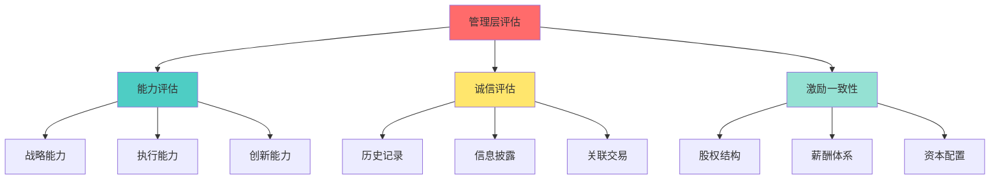

# 管理层分析

## 概述

"投资企业就是投资管理层"——这是价值投资的核心理念之一。优秀的管理层能够：

- 制定正确的战略方向
- 高效配置资源
- 建立持续竞争优势
- 创造长期股东价值
- 应对危机和挑战

本文提供系统化的管理层评估框架，帮助投资者全面评估管理层的能力、诚信和激励一致性。

**学习目标**：
1. 掌握管理层评估的三大维度
2. 学会识别优秀管理层的特征
3. 理解激励机制的设计和影响
4. 识别管理层的危险信号
5. 建立管理层评分体系

## 管理层评估框架

### 三大评估维度




## 管理层评估方法

### 定量评估

**财务业绩指标**:

| 指标 | 计算方法 | 优秀标准 |
|------|----------|----------|
| ROE | 净利润 / 股东权益 | > 15% |
| ROIC | NOPAT / 投入资本 | > 12% |
| 营收增长 | (本期-上期) / 上期 | > 10% |
| 利润增长 | (本期-上期) / 上期 | > 15% |
| 自由现金流 | 经营现金流 - 资本支出 | 持续为正 |
| 资产周转率 | 营收 / 总资产 | 行业领先 |

**相对业绩评估**:
- 与行业平均对比
- 与主要竞争对手对比
- 与历史业绩对比
- 与业绩指引对比

**长期业绩追踪**:
- 5年平均 ROE
- 10年营收 CAGR
- 10年利润 CAGR
- 10年股价表现
- 总股东回报 (TSR)

### 定性评估

**管理层访谈**:

**访谈准备**:
1. 研究公司背景
2. 准备核心问题
3. 了解管理层背景
4. 设定访谈目标
5. 准备记录方式

**核心问题清单**:

**战略问题**:
- "公司的长期愿景是什么？"
- "未来3-5年的战略重点是什么？"
- "如何应对行业变化和竞争？"
- "最大的增长机会在哪里？"
- "面临的最大挑战是什么？"

**运营问题**:
- "如何保持竞争优势？"
- "如何控制成本和提高效率？"
- "如何吸引和保留人才？"
- "如何管理供应链风险？"
- "如何确保产品质量？"

**财务问题**:
- "资本配置的优先级是什么？"
- "如何平衡增长和盈利？"
- "如何看待当前估值？"
- "分红和回购政策是什么？"
- "如何管理财务风险？"

**文化问题**:
- "公司文化的核心是什么？"
- "如何培养创新文化？"
- "如何处理失败？"
- "如何激励员工？"
- "如何保持创业精神？"

**观察要点**:
- 回答是否清晰直接
- 是否回避问题
- 是否过度乐观
- 是否承认问题
- 是否有长期视角

### 管理层背景调查

**调查内容**:

1. **教育背景**
   - 学历和专业
   - 毕业院校
   - 继续教育
   - 专业认证

2. **职业经历**
   - 工作履历
   - 职位晋升
   - 跨行业经验
   - 创业经历
   - 成功记录

3. **专业能力**
   - 行业经验年限
   - 专业技能
   - 管理经验
   - 国际经验
   - 技术背景

4. **个人品质**
   - 诚信记录
   - 诉讼记录
   - 媒体评价
   - 同行评价
   - 社会声誉

**信息来源**:
- LinkedIn 档案
- 公司公告
- 媒体报道
- 背景调查服务
- 行业人脉

**红旗信号**:
- 学历造假
- 履历夸大
- 频繁跳槽
- 失败记录
- 诚信问题
- 诉讼缠身

## 管理层评分系统

### 综合评分模型

**评分维度和权重**:

| 维度 | 权重 | 评分标准 |
|------|------|----------|
| 战略能力 | 25% | 战略清晰度、执行效果 |
| 运营能力 | 20% | 财务业绩、运营效率 |
| 资本配置 | 25% | ROIC、并购、股东回报 |
| 诚信度 | 20% | 透明度、承诺兑现 |
| 股东导向 | 10% | 利益一致、沟通质量 |

**评分等级**:
- A级 (90-100分): 卓越管理层
- B级 (80-89分): 优秀管理层
- C级 (70-79分): 合格管理层
- D级 (60-69分): 一般管理层
- F级 (<60分): 不合格管理层

**投资决策**:
- A级: 可以重仓
- B级: 正常配置
- C级: 谨慎投资
- D级: 避免投资
- F级: 坚决不投

### 管理层评估清单

**能力评估**:
- [ ] 战略清晰且可行
- [ ] 执行能力强
- [ ] 财务业绩优秀
- [ ] 资本配置理性
- [ ] 创新能力强
- [ ] 危机应对好

**诚信评估**:
- [ ] 财务透明
- [ ] 承诺兑现
- [ ] 会计政策保守
- [ ] 无重大诉讼
- [ ] 无监管处罚
- [ ] 审计意见标准

**股东导向**:
- [ ] 管理层持股合理
- [ ] 薪酬与业绩挂钩
- [ ] 股东回报良好
- [ ] 沟通透明及时
- [ ] 长期思维
- [ ] 无利益输送

**综合判断**:
- [ ] 我信任这个管理层吗？
- [ ] 我愿意把钱交给他们管理吗？
- [ ] 他们会为股东创造价值吗？
- [ ] 他们能应对未来挑战吗？


## 优秀管理层案例

### 案例1: 沃伦·巴菲特 - Berkshire Hathaway

**管理特点**:

**资本配置大师**:
- 50+ 年年化回报 20%
- 理性的投资决策
- 低价买入优质资产
- 长期持有
- 不分红 (再投资回报更高)

**诚信和透明**:
- 年度股东信坦诚透明
- 承认错误
- 解释决策逻辑
- 长期一致性

**股东导向**:
- 股东利益至上
- 合理薪酬 ($100,000 年薪)
- 大量个人持股
- 长期思维

**启示**:
- 资本配置是 CEO 最重要的工作
- 诚信和透明建立信任
- 长期思维创造价值
- 利益一致确保动力

### 案例2: 杰夫·贝索斯 - Amazon

**管理特点**:

**长期思维**:
- "Day 1" 文化
- 愿意长期亏损换增长
- 持续创新
- 客户至上

**执行能力**:
- 从在线书店到万货商店
- 从零售到云计算 (AWS)
- 从电商到物流
- 多元化成功

**创新能力**:
- 持续推出新业务
- 容忍失败
- 快速迭代
- 技术驱动

**资本配置**:
- 大量再投资
- 不分红
- 理性并购
- 长期价值创造

**启示**:
- 长期思维的力量
- 客户导向创造价值
- 持续创新保持领先
- 执行力决定成败

### 案例3: 蒂姆·库克 - Apple

**管理特点**:

**运营大师**:
- 供应链管理专家
- 成本控制能力强
- 运营效率高
- 现金流管理优秀

**资本配置**:
- 大规模股票回购
- 稳定分红
- 理性并购
- 高资本回报率

**稳健经营**:
- 延续乔布斯遗产
- 产品线扩展
- 服务业务增长
- 全球市场拓展

**股东回报**:
- 任期内股价上涨 10倍+
- 大量现金返还股东
- 持续创造价值

**启示**:
- 运营能力同样重要
- 不一定需要创始人
- 稳健经营创造价值
- 股东回报是检验标准

### 案例4: 马斯克 - Tesla

**管理特点**:

**愿景和执行**:
- 清晰的长期愿景
- 超强的执行能力
- 突破常规
- 快速迭代

**创新驱动**:
- 技术创新
- 商业模式创新
- 垂直整合
- 持续突破

**争议和风险**:
- 过度承诺
- 时间延迟
- 管理风格激进
- 个人风险高

**启示**:
- 愿景和执行力的重要性
- 创新者的溢价
- 也要关注风险
- 个人依赖度风险

## 管理层风险识别

### 高风险管理层特征

**能力风险**:
- 缺乏行业经验
- 战略频繁变化
- 执行不力
- 业绩持续低于预期
- 危机应对失败

**诚信风险**:
- 财务造假
- 信息披露不实
- 承诺不兑现
- 关联交易频繁
- 监管处罚

**治理风险**:
- 一言堂
- 董事会不独立
- 内部控制薄弱
- 家族控制
- 利益输送

**行为风险**:
- 过度自信
- 盲目扩张
- 激进并购
- 高杠杆
- 短期主义

### 管理层变更分析

**CEO 更换**:

**更换原因**:
- 业绩不佳
- 战略分歧
- 健康原因
- 退休
- 丑闻

**影响评估**:
- 继任者背景
- 战略连续性
- 团队稳定性
- 市场反应
- 过渡期风险

**投资策略**:
- 优秀 CEO 离职: 谨慎观察
- 差 CEO 离职: 可能机会
- 内部提拔: 连续性好
- 外部空降: 变革可能

**案例**:
- Apple: 乔布斯 → 库克 (成功过渡)
- Microsoft: 鲍尔默 → 纳德拉 (成功转型)
- GE: 韦尔奇 → 伊梅尔特 (业绩下滑)

## 管理层分析工具

### 分析工具清单

**信息收集工具**:
- LinkedIn (管理层背景)
- Glassdoor (员工评价)
- Indeed (招聘信息)
- Crunchbase (创业背景)
- Bloomberg (新闻和数据)

**分析工具**:
- Excel (业绩追踪)
- Notion (管理层档案)
- MindMap (关系图谱)

**验证工具**:
- 背景调查服务
- 诉讼记录查询
- 媒体监控
- 社交媒体分析

### 管理层档案模板

**标准档案结构**:

```markdown
# [管理层姓名] 档案

## 基本信息
- 姓名:
- 职位:
- 任职时间:
- 年龄:
- 国籍:

## 教育背景
- 学历:
- 毕业院校:
- 专业:

## 职业经历
- [时间] [公司] [职位]
- 主要成就:

## 管理风格
- 战略特点:
- 决策风格:
- 沟通风格:
- 领导风格:

## 业绩记录
- 财务业绩:
- 战略成就:
- 重大决策:

## 薪酬和持股
- 年度薪酬:
- 持股比例:
- 股权激励:

## 评估
- 能力评分:
- 诚信评分:
- 股东导向:
- 综合评分:

## 风险因素
- 主要风险:
- 关注要点:
```

## 实战建议

### 管理层分析的优先级

**必须深入分析的情况**:
1. 重仓投资 (>10% 仓位)
2. 长期持有 (>3年)
3. 管理层变更
4. 公司转型期
5. 发现诚信问题

**可以简化分析的情况**:
1. 小额投资 (<5% 仓位)
2. 短期交易
3. 指数投资
4. 管理层稳定且优秀
5. 被动投资策略

### 管理层分析的时间分配

**标准研究** (5-8小时):
- 阅读年报和股东信 (2小时)
- 听财报电话会议 (1小时)
- 背景调查 (2小时)
- 业绩分析 (2小时)
- 综合评估 (1小时)

**深度研究** (15-20小时):
- 标准研究内容
- 实地访谈 (4-6小时)
- 员工访谈 (2-3小时)
- 第三方验证 (3-4小时)
- 历史追踪 (3-4小时)
- 详细报告 (2-3小时)

### 持续跟踪

**跟踪内容**:
- 季度业绩和指引
- 战略调整
- 重大决策
- 管理层变动
- 薪酬变化
- 持股变化
- 媒体报道

**跟踪频率**:
- 季度: 财报和电话会议
- 月度: 新闻和公告
- 实时: 重大事件

**触发重新评估的事件**:
- CEO 更换
- 战略重大调整
- 重大并购
- 财务造假
- 监管处罚
- 业绩大幅低于预期


## 总结

### 核心要点

1. **管理层至关重要**
   - 决定公司长期成功
   - 影响投资回报
   - 需要深入评估

2. **三维评估模型**
   - 能力: 战略、执行、资本配置
   - 诚信: 透明、兑现、一致
   - 股东导向: 回报、沟通、长期

3. **定量与定性结合**
   - 财务业绩数据
   - 访谈和调研
   - 背景调查
   - 综合判断

4. **识别风险信号**
   - 财务红旗
   - 诚信问题
   - 治理缺陷
   - 及时止损

5. **持续跟踪**
   - 定期评估
   - 关注变化
   - 动态调整

### 投资大师的建议

> "投资时，我们把自己看作是企业分析师，而不是市场分析师，也不是宏观经济分析师，甚至不是证券分析师。我们的分析重点是管理层。" —— 沃伦·巴菲特

> "我们喜欢那些我们理解的、由我们喜欢和信任的人经营的企业。" —— 查理·芒格

> "在评估管理层时，问自己：如果我不能卖出这只股票10年，我还愿意投资吗？" —— 菲利普·费雪

### 下一步行动

1. **建立评估框架**
   - 创建评估清单
   - 设计评分系统
   - 准备访谈问题

2. **实践评估**
   - 选择3-5家公司
   - 完整评估管理层
   - 记录评估过程

3. **建立管理层数据库**
   - 记录管理层档案
   - 追踪业绩表现
   - 总结评估经验

4. **持续学习**
   - 研究优秀管理层
   - 学习失败案例
   - 提升评估能力

## 延伸阅读

### 相关主题

- [[research-framework|公司研究框架]]
- [[due-diligence|尽职调查方法]]
- [[competitive-positioning|竞争定位分析]]
- [[investment-thesis|投资论点构建]]
- [[risk-management/behavioral-finance|行为金融学]]

### 投资大师研究

- [[investor-profiles/warren-buffett|沃伦·巴菲特]]
- [[investor-profiles/charlie-munger|查理·芒格]]
- [[investor-profiles/philip-fisher|菲利普·费雪]]
- [[investor-profiles/peter-lynch|彼得·林奇]]

### 案例研究

- [[case-studies/tech-giants/apple|Apple - 库克的成功过渡]]
- [[case-studies/tech-giants/microsoft|Microsoft - 纳德拉的转型]]
- [[case-studies/financial-institutions/berkshire-hathaway|Berkshire - 巴菲特的资本配置]]
- [[case-studies/failed-companies/enron|Enron - 管理层欺诈]]

## 参考文献

1. Buffett, W. (1977-2023). *Berkshire Hathaway Annual Letters*.
2. Munger, C. (2005). *Poor Charlie's Almanack*. Walsworth Publishing.
3. Fisher, P. A. (1958). *Common Stocks and Uncommon Profits*. Harper & Brothers.
4. Collins, J. (2001). *Good to Great*. HarperBusiness.
5. Drucker, P. F. (1967). *The Effective Executive*. Harper & Row.
6. Welch, J., & Byrne, J. A. (2001). *Jack: Straight from the Gut*. Warner Books.
7. Grove, A. S. (1995). *High Output Management*. Vintage Books.
8. Dalio, R. (2017). *Principles*. Simon & Schuster.
9. Dorsey, P., & Engelhart, J. (2008). *The Little Book That Builds Wealth*. Wiley.
10. Mauboussin, M. J. (2012). *The Success Equation*. Harvard Business Review Press.
11. Kahneman, D. (2011). *Thinking, Fast and Slow*. Farrar, Straus and Giroux.
12. Thaler, R. H. (2015). *Misbehaving: The Making of Behavioral Economics*. W. W. Norton.
13. Cialdini, R. B. (2006). *Influence: The Psychology of Persuasion*. Harper Business.
14. Gladwell, M. (2008). *Outliers*. Little, Brown and Company.
15. Isaacson, W. (2011). *Steve Jobs*. Simon & Schuster.

---

*最后更新: 2024-01-20*
*版本: 1.0*
*作者: 金融知识库*

### 评估流程

#### 第一步：背景调查
- 教育背景
- 职业经历
- 行业经验
- 过往业绩
- 声誉评价

#### 第二步：能力评估
- 战略规划能力
- 运营管理能力
- 财务管理能力
- 创新能力
- 危机应对能力

#### 第三步：诚信评估
- 历史诚信记录
- 信息披露质量
- 关联交易公允性
- 承诺兑现情况
- 媒体评价

#### 第四步：激励分析
- 股权结构
- 薪酬设计
- 股权激励
- 资本配置
- 分红政策

#### 第五步：综合评分
- 各维度打分
- 权重分配
- 综合评级
- 风险提示

## 第一维度：能力评估

### 战略能力

#### 战略眼光

**评估要点**：
1. **行业趋势判断**
   - 是否准确预判行业变化
   - 是否提前布局新机会
   - 是否规避行业风险

2. **竞争策略选择**
   - 差异化 vs 成本领先
   - 专注 vs 多元化
   - 自主发展 vs 并购整合

3. **长期规划**
   - 战略目标清晰
   - 路径规划合理
   - 资源配置得当

**评估方法**：
- 阅读历年股东信
- 分析战略决策
- 对比行业发展
- 评估战略成果

**优秀案例**：
- 巴菲特：长期价值投资战略
- 贝索斯：客户至上、长期主义
- 马斯克：第一性原理思考

#### 战略执行

**评估要点**：
1. **目标达成率**
   - 历史承诺兑现情况
   - 业绩指标完成度
   - 战略里程碑达成

2. **执行效率**
   - 决策速度
   - 组织协同
   - 资源利用效率

3. **应变能力**
   - 面对变化的调整速度
   - 危机应对能力
   - 学习改进能力

**量化指标**：
```
战略执行评分 = (实际业绩 / 承诺业绩) × 100%

优秀：> 100%
良好：90-100%
一般：80-90%
较差：< 80%
```

### 运营能力

#### 运营效率

**关键指标**：
1. **资产周转率**
   - 总资产周转率
   - 固定资产周转率
   - 存货周转率
   - 应收账款周转率

2. **成本控制**
   - 毛利率趋势
   - 费用率控制
   - 单位成本变化
   - 规模效应体现

3. **质量管理**
   - 产品合格率
   - 客户满意度
   - 退货率
   - 质量事故

**对比分析**：
- 与历史对比
- 与同行对比
- 与行业最佳实践对比

#### 创新能力

**评估维度**：
1. **研发投入**
   - 研发费用率
   - 研发人员占比
   - 研发设施投入

2. **创新产出**
   - 新产品数量
   - 专利申请数
   - 技术突破
   - 市场反响

3. **创新文化**
   - 鼓励创新的机制
   - 容错文化
   - 学习型组织
   - 人才吸引力

**创新评分**：
```
创新指数 = (研发投入 × 0.3) + (创新产出 × 0.4) + (创新文化 × 0.3)
```

### 财务管理能力

#### 资本配置

**评估要点**：
1. **投资决策**
   - 资本支出合理性
   - 并购整合能力
   - 投资回报率
   - 资产处置决策

2. **融资决策**
   - 资本结构优化
   - 融资成本控制
   - 融资时机把握
   - 财务风险管理

3. **分红政策**
   - 分红稳定性
   - 分红率合理性
   - 股东回报
   - 再投资平衡

**巴菲特的资本配置原则**：
1. 优先投资主业
2. 回购低估的股票
3. 收购优质企业
4. 分红回报股东
5. 保持财务安全

#### 财务纪律

**评估要点**：
1. **财务透明度**
   - 信息披露质量
   - 会计政策稳健性
   - 财务报表可读性

2. **财务稳健性**
   - 负债率控制
   - 现金流管理
   - 流动性充足
   - 风险对冲

3. **财务诚信**
   - 无财务造假
   - 无重大会计差错
   - 审计意见清洁
   - 税务合规

### 人才管理能力

#### 团队建设

**评估要点**：
1. **核心团队稳定性**
   - 高管离职率
   - 核心人才流失
   - 继任计划
   - 团队凝聚力

2. **人才吸引力**
   - 行业地位
   - 薪酬竞争力
   - 发展机会
   - 企业文化

3. **组织能力**
   - 组织架构合理性
   - 决策效率
   - 执行力
   - 学习能力

**危险信号**：
- 核心高管频繁离职
- 创始团队分裂
- 人才大量流失
- 组织混乱

## 第二维度：诚信评估

### 历史诚信记录

#### 过往记录调查

**调查内容**：
1. **职业履历**
   - 工作经历真实性
   - 业绩描述准确性
   - 离职原因
   - 同事评价

2. **诚信事件**
   - 是否有欺诈记录
   - 是否有违规处罚
   - 是否有诉讼纠纷
   - 是否有失信记录

3. **商业声誉**
   - 行业口碑
   - 合作伙伴评价
   - 媒体报道
   - 社会评价

**信息来源**：
- 企查查、天眼查
- 裁判文书网
- 证监会处罚公告
- 媒体报道
- 行业访谈

#### 承诺兑现情况

**评估方法**：
1. **业绩承诺**
   - 对比历年业绩指引
   - 计算达成率
   - 分析未达成原因
   - 评估解释合理性

2. **战略承诺**
   - 战略目标实现情况
   - 重大项目进展
   - 转型升级成果

3. **股东承诺**
   - 分红承诺兑现
   - 股权激励兑现
   - 重组承诺兑现

**承诺兑现率**：
```
兑现率 = 实际兑现数 / 承诺总数 × 100%

优秀：> 90%
良好：80-90%
一般：70-80%
较差：< 70%
```

### 信息披露质量

#### 披露完整性

**评估要点**：
1. **定期报告**
   - 年报详细程度
   - 季报及时性
   - 附注完整性
   - 风险提示充分性

2. **临时公告**
   - 重大事项及时披露
   - 信息披露完整
   - 解释说明清晰

3. **投资者沟通**
   - 股东大会质量
   - 投资者交流活动
   - 问题回应及时性
   - 沟通透明度

#### 披露真实性

**危险信号**：
- 频繁更正公告
- 重要信息遗漏
- 前后矛盾
- 模糊表述
- 回避关键问题

**验证方法**：
- 交叉验证不同来源信息
- 对比历史披露
- 实地调研验证
- 第三方数据核实

### 关联交易分析

#### 关联交易评估

**评估维度**：
1. **必要性**
   - 是否有商业合理性
   - 是否有替代方案
   - 是否符合公司利益

2. **公允性**
   - 定价是否公允
   - 条件是否合理
   - 程序是否规范

3. **透明度**
   - 披露是否充分
   - 决策程序是否合规
   - 独立董事意见

**危险信号**：
- 关联交易占比过高
- 定价明显不公允
- 频繁的资金往来
- 复杂的关联关系
- 披露不透明

#### 利益输送识别

**常见手法**：
1. **高价采购**
   - 向关联方高价采购
   - 采购价格远高于市场价
   - 采购必要性存疑

2. **低价销售**
   - 向关联方低价销售
   - 销售价格远低于市场价
   - 放宽信用条件

3. **资金占用**
   - 无偿占用资金
   - 低息或无息借款
   - 长期挂账

4. **资产转移**
   - 低价转让优质资产
   - 高价收购劣质资产
   - 担保抵押

## 第三维度：激励一致性

### 股权结构分析

#### 股权集中度

**分类**：
1. **高度集中**（第一大股东 > 50%）
   - 优点：决策高效，战略稳定
   - 缺点：中小股东权益保护

2. **相对集中**（第一大股东 30-50%）
   - 优点：平衡控制权和制衡
   - 缺点：可能存在控制权争夺

3. **高度分散**（第一大股东 < 30%）
   - 优点：制衡充分
   - 缺点：决策效率低，代理成本高

#### 管理层持股

**评估要点**：
1. **持股比例**
   - 创始人持股
   - 管理层持股
   - 员工持股

2. **持股变化**
   - 增持 vs 减持
   - 增减持时机
   - 增减持原因

3. **锁定期**
   - 是否有锁定承诺
   - 锁定期长短
   - 解禁后行为

**理想状态**：
- 管理层持股 5-20%
- 长期持有，少减持
- 与公司共同成长

### 薪酬体系分析

#### 薪酬结构

**组成部分**：
1. **基本薪酬**
   - 固定工资
   - 津贴补贴
   - 福利待遇

2. **绩效薪酬**
   - 年度奖金
   - 绩效考核
   - 超额奖励

3. **长期激励**
   - 股权激励
   - 期权激励
   - 限制性股票

**合理比例**：
```
基本薪酬：30-40%
绩效薪酬：30-40%
长期激励：20-40%
```

#### 薪酬水平

**评估方法**：
1. **绝对水平**
   - 与公司规模匹配
   - 与盈利能力匹配
   - 与行业地位匹配

2. **相对水平**
   - 与同行业对比
   - 与员工平均薪酬对比
   - 与股东回报对比

3. **增长趋势**
   - 薪酬增长率
   - 与业绩增长匹配度
   - 与股价表现关联度

**危险信号**：
- 薪酬远超业绩
- 薪酬与业绩脱钩
- 高管薪酬过高
- 员工薪酬过低

### 股权激励分析

#### 激励方案设计

**评估要点**：
1. **激励对象**
   - 覆盖范围
   - 分配比例
   - 核心人才占比

2. **激励规模**
   - 股份数量
   - 占总股本比例
   - 稀释程度

3. **行权条件**
   - 业绩考核指标
   - 考核目标难度
   - 服务期限要求

4. **行权价格**
   - 定价方法
   - 折扣幅度
   - 价格合理性

**优秀方案特征**：
- 覆盖核心人才
- 业绩目标合理且有挑战性
- 长期锁定（3-5年）
- 与股东利益一致

#### 激励效果评估

**评估指标**：
1. **业绩改善**
   - 激励后业绩变化
   - 目标达成情况
   - 持续性

2. **人才稳定**
   - 核心人才留存率
   - 团队稳定性
   - 人才吸引力

3. **股东回报**
   - 股价表现
   - 分红增长
   - 总回报率

### 资本配置评估

#### 资本配置优先级

**巴菲特的资本配置框架**：
1. **第一优先：投资主业**
   - 高ROIC项目
   - 扩大竞争优势
   - 有机增长

2. **第二优先：回购股票**
   - 股价低于内在价值
   - 有充足现金
   - 不影响运营

3. **第三优先：并购整合**
   - 协同效应明显
   - 价格合理
   - 整合能力强

4. **第四优先：分红**
   - 无更好投资机会
   - 现金充裕
   - 回报股东

#### 资本配置评分

**评估维度**：
1. **投资回报率**
   - ROIC > WACC
   - 投资项目IRR
   - 并购整合效果

2. **资本效率**
   - 资产周转率
   - 资本支出合理性
   - 营运资本管理

3. **股东回报**
   - 分红率
   - 股息增长率
   - 总股东回报

## 管理层评分体系

### 评分框架

#### 能力评分（40分）

| 维度 | 权重 | 评分标准 |
|------|------|---------|
| 战略能力 | 15分 | 战略眼光、执行力 |
| 运营能力 | 10分 | 效率、创新 |
| 财务能力 | 10分 | 资本配置、财务纪律 |
| 人才管理 | 5分 | 团队建设、组织能力 |

#### 诚信评分（30分）

| 维度 | 权重 | 评分标准 |
|------|------|---------|
| 历史记录 | 10分 | 诚信事件、承诺兑现 |
| 信息披露 | 10分 | 完整性、真实性 |
| 关联交易 | 10分 | 公允性、透明度 |

#### 激励评分（30分）

| 维度 | 权重 | 评分标准 |
|------|------|---------|
| 股权结构 | 10分 | 持股比例、变化趋势 |
| 薪酬体系 | 10分 | 结构合理性、水平适当性 |
| 资本配置 | 10分 | 配置效率、股东回报 |

### 综合评级

**评分区间**：
- 90-100分：优秀（A级）
- 80-89分：良好（B级）
- 70-79分：一般（C级）
- 60-69分：较差（D级）
- < 60分：很差（E级）

**投资建议**：
- A级：重点关注，可重仓
- B级：值得投资，适度配置
- C级：谨慎投资，小仓位
- D级：不建议投资
- E级：坚决回避

## 识别危险信号

### 能力危险信号

**战略失误**：
- 频繁变更战略
- 盲目多元化
- 重大决策失误
- 错失行业机遇

**执行不力**：
- 业绩承诺频繁落空
- 项目延期严重
- 成本失控
- 质量问题频发

**创新不足**：
- 研发投入持续下降
- 产品老化
- 技术落后
- 人才流失

### 诚信危险信号

**财务造假迹象**：
- 收入与现金流长期背离
- 频繁变更审计师
- 会计政策频繁变更
- 关联交易异常

**管理层欺诈**：
- 过度承诺
- 信息披露违规
- 内幕交易
- 利益输送

**治理缺陷**：
- 内部控制薄弱
- 独立董事形同虚设
- 监事会不作为
- 信息披露不透明

### 激励危险信号

**利益不一致**：
- 管理层大量减持
- 高管薪酬过高
- 股权激励不合理
- 分红政策不稳定

**短期行为**：
- 过度关注短期业绩
- 牺牲长期利益
- 财务操纵
- 盲目扩张

## 实战案例

### 案例1：优秀管理层 - 贵州茅台

**能力评估**：
- 战略定力强，坚守主业
- 品牌建设卓越
- 渠道管理高效
- 产品质量稳定

**诚信评估**：
- 信息披露透明
- 承诺兑现良好
- 无重大违规
- 行业口碑好

**激励一致性**：
- 管理层持股稳定
- 薪酬与业绩匹配
- 分红稳定增长
- 股东回报优秀

**综合评分**：95分（A级）

### 案例2：问题管理层 - 乐视网

**能力问题**：
- 盲目多元化
- 资金链断裂
- 执行力差
- 战略失误

**诚信问题**：
- 财务造假
- 信息披露违规
- 承诺不兑现
- 关联交易输送利益

**激励问题**：
- 创始人大量质押减持
- 高管频繁离职
- 员工利益受损
- 股东损失惨重

**综合评分**：20分（E级）

## 管理层访谈技巧

### 访谈准备

**背景研究**：
- 阅读公司资料
- 了解行业情况
- 准备问题清单
- 设定访谈目标

**问题设计**：
- 开放式问题为主
- 关键问题多角度
- 预设追问
- 留意矛盾点

### 访谈技巧

**建立信任**：
- 专业态度
- 尊重对方
- 真诚沟通
- 保密承诺

**有效提问**：
- 从宏观到微观
- 从过去到未来
- 从成功到挑战
- 从战略到执行

**观察要点**：
- 回答是否坦诚
- 逻辑是否清晰
- 数据是否熟悉
- 态度是否积极

### 关键问题清单

**战略问题**：
1. 公司的长期愿景是什么？
2. 核心竞争优势是什么？
3. 面临的主要挑战是什么？
4. 如何应对行业变化？

**运营问题**：
1. 如何保持运营效率？
2. 如何控制成本？
3. 如何保证质量？
4. 如何激励员工？

**财务问题**：
1. 资本配置的优先级？
2. 如何平衡增长和分红？
3. 如何管理财务风险？
4. 对估值的看法？

**文化问题**：
1. 公司文化的核心是什么？
2. 如何吸引和留住人才？
3. 如何鼓励创新？
4. 如何应对失败？

## 延伸阅读

### 必读书籍

1. **《从优秀到卓越》** - 吉姆·柯林斯
   - 卓越领导者特征
   - 第五级领导力

2. **《基业长青》** - 吉姆·柯林斯
   - 伟大公司的共同特征
   - 领导力传承

3. **《原则》** - 瑞·达里奥
   - 管理原则
   - 决策框架

4. **《巴菲特致股东的信》** - 沃伦·巴菲特
   - 管理层评估标准
   - 资本配置智慧

5. **《公司治理》** - 罗伯特·蒙克斯
   - 治理结构
   - 激励机制

### 推荐资源

**研究报告**：
- 公司治理评级报告
- 管理层评估报告
- 薪酬调研报告

**数据平台**：
- 企查查（背景调查）
- 天眼查（诚信记录）
- 裁判文书网（诉讼记录）

## 参考文献

1. Collins, J. (2001). *Good to Great*. HarperBusiness.
2. Collins, J., & Porras, J. (1994). *Built to Last*. HarperBusiness.
3. Dalio, R. (2017). *Principles*. Simon & Schuster.
4. Buffett, W. (Annual). *Berkshire Hathaway Shareholder Letters*.
5. Monks, R., & Minow, N. (2011). *Corporate Governance*. Wiley.
6. Jensen, M. C., & Meckling, W. H. (1976). "Theory of the Firm". *Journal of Financial Economics*.
7. Fama, E. F., & Jensen, M. C. (1983). "Separation of Ownership and Control". *Journal of Law and Economics*.
8. Bebchuk, L., & Fried, J. (2004). *Pay without Performance*. Harvard University Press.

---

**下一步行动**：
1. 建立管理层评估清单
2. 选择3-5家公司进行管理层分析
3. 练习管理层访谈技巧
4. 建立管理层评分模型
5. 持续跟踪管理层变化

**相关主题**：
- [公司研究框架](research-framework.html)
- [尽职调查方法](due-diligence.html)
- [竞争定位分析](competitive-positioning.html)
- [投资论点构建](investment-thesis.html)
- [公司治理](../../03-company-analysis/index.html)


## 管理层变革管理

### CEO 继任规划

**继任规划的重要性**:
- 确保领导连续性
- 降低过渡风险
- 保持战略一致性
- 维护投资者信心

**继任类型**:

1. **内部提拔**
   - 优点: 熟悉业务、文化延续、过渡平稳
   - 缺点: 可能缺乏新思维
   - 案例: Apple (库克), Microsoft (纳德拉)

2. **外部招聘**
   - 优点: 新视角、变革能力
   - 缺点: 适应期长、风险高
   - 案例: IBM, HP

3. **创始人回归**
   - 优点: 愿景清晰、激励团队
   - 缺点: 可能过时
   - 案例: Apple (乔布斯回归), Starbucks (舒尔茨回归)

**评估继任计划**:
- [ ] 是否有明确的继任计划？
- [ ] 继任者是否已培养？
- [ ] 过渡期是否有安排？
- [ ] 关键团队是否稳定？

### 管理团队稳定性

**团队稳定性指标**:
- 高管平均任期
- 高管流失率
- 关键岗位空缺
- 团队协作
- 文化凝聚力

**稳定性评估**:
- 优秀: 高管任期 > 5年，流失率 < 10%
- 良好: 高管任期 3-5年，流失率 10-20%
- 一般: 高管任期 < 3年，流失率 > 20%

**不稳定的信号**:
- 频繁的高管变动
- CFO 频繁更换
- 核心团队离职
- 组织架构频繁调整

**投资影响**:
- 稳定团队: 执行力强，可预测性高
- 不稳定团队: 风险高，需要观察

## 不同行业的管理层评估

### 科技公司管理层

**评估重点**:
- 技术视野
- 产品能力
- 创新文化
- 工程师文化
- 快速迭代能力

**关键指标**:
- 研发投入占比
- 专利产出
- 产品发布频率
- 技术团队规模
- 工程师满意度

**优秀案例**:
- 乔布斯 (Apple): 产品天才
- 贝索斯 (Amazon): 长期思维
- 黄仁勋 (Nvidia): 技术远见
- 马斯克 (Tesla): 创新执行

### 消费品公司管理层

**评估重点**:
- 品牌建设能力
- 营销能力
- 渠道管理
- 供应链效率
- 消费者洞察

**关键指标**:
- 品牌价值增长
- 市场份额
- 营销 ROI
- 渠道覆盖
- 客户满意度

**优秀案例**:
- 舒尔茨 (Starbucks): 品牌建设
- 库克 (Apple): 供应链大师
- 茅台管理层: 品牌维护

### 金融公司管理层

**评估重点**:
- 风险管理能力
- 资本配置
- 合规文化
- 危机应对
- 长期稳健

**关键指标**:
- ROE
- 不良贷款率
- 资本充足率
- 风险加权资产
- 合规记录

**优秀案例**:
- Jamie Dimon (JPMorgan): 危机应对
- 招商银行管理层: 零售转型

### 制造业公司管理层

**评估重点**:
- 运营效率
- 成本控制
- 质量管理
- 供应链管理
- 持续改进

**关键指标**:
- 毛利率
- 资产周转率
- 库存周转率
- 产能利用率
- 质量指标

**优秀案例**:
- 丰田管理层: 精益生产
- 富士康管理层: 规模效率

## 管理层与企业文化

### 文化的重要性

> "文化能把战略当早餐吃掉。" —— 彼得·德鲁克

**文化评估**:

1. **价值观**
   - 客户导向
   - 创新精神
   - 诚信正直
   - 卓越追求
   - 长期主义

2. **行为规范**
   - 决策方式
   - 沟通风格
   - 激励机制
   - 容错态度
   - 学习文化

3. **文化强度**
   - 员工认同度
   - 文化一致性
   - 文化传承
   - 文化适应性

**文化评估来源**:
- 公司使命愿景
- 员工评价 (Glassdoor)
- 管理层言行
- 公司行为
- 危机应对

**优秀文化案例**:
- Amazon: Day 1, 客户至上
- Netflix: 自由与责任
- Google: 创新文化
- Costco: 员工第一

**文化与业绩**:
- 强文化 + 好战略 = 卓越业绩
- 强文化 + 差战略 = 执行有力但方向错
- 弱文化 + 好战略 = 执行不力
- 弱文化 + 差战略 = 失败

### 文化变革

**变革必要性**:
- 战略转型
- 行业变化
- 并购整合
- 危机应对
- 代际传承

**变革挑战**:
- 阻力大
- 时间长
- 风险高
- 需要强领导力

**成功变革案例**:
- Microsoft: 从封闭到开放 (Nadella)
- IBM: 从硬件到服务 (Gerstner)
- Apple: 从混乱到卓越 (乔布斯回归)

**失败变革案例**:
- Yahoo: 多次变革失败
- Sears: 转型失败
- GE: 文化变革不彻底

**投资策略**:
- 文化变革初期: 观察
- 变革见效: 买入
- 变革失败: 避免

## 管理层激励设计

### 有效激励的原则

**长期导向**:
- 长期激励 > 短期激励
- 股权激励为主
- 业绩条件严格
- 锁定期长

**业绩挂钩**:
- 与 ROE/ROIC 挂钩
- 与相对业绩挂钩
- 与战略目标挂钩
- 避免单一指标

**利益一致**:
- 管理层持股
- 限制性股票
- 股票期权
- 业绩股票

**合理水平**:
- 与同行可比
- 与业绩匹配
- 不过度激励
- 透明披露

### 激励设计案例

**优秀案例 - Berkshire Hathaway**:
- 巴菲特年薪 $100,000
- 大量个人持股 (30%+)
- 利益完全一致
- 长期价值导向

**优秀案例 - Amazon**:
- 贝索斯基本工资低
- 大量股权激励
- 长期持有
- 与股东利益一致

**差的案例 - 某些公司**:
- 高额固定薪酬
- 短期激励为主
- 业绩条件宽松
- 利益不一致

**评估清单**:
- [ ] 激励是否长期导向？
- [ ] 是否与业绩挂钩？
- [ ] 管理层持股是否合理？
- [ ] 薪酬水平是否合理？
- [ ] 激励设计是否透明？

## 管理层与投资回报

### 管理层质量与回报的关系

**研究发现**:
- 优秀管理层公司长期回报显著更高
- 管理层诚信度与回报正相关
- 资本配置能力是关键差异
- 股东导向影响长期价值

**数据支持**:
- A级管理层公司: 年化回报 15-20%
- B级管理层公司: 年化回报 10-15%
- C级管理层公司: 年化回报 5-10%
- D级管理层公司: 年化回报 < 5%

**长期影响**:
- 10年复合效应巨大
- A级 vs D级: 4倍+ 差异
- 管理层是长期投资的关键

### 管理层溢价

**愿意支付的溢价**:
- 卓越管理层: 20-30% 估值溢价
- 优秀管理层: 10-20% 估值溢价
- 一般管理层: 无溢价
- 差管理层: 20-30% 估值折价

**溢价合理性**:
- 优秀管理层创造更多价值
- 降低投资风险
- 提高成功概率
- 长期回报更高

**案例**:
- Berkshire: 巴菲特溢价
- Apple: 库克溢价
- Amazon: 贝索斯溢价 (在任时)

## 实战建议

### 管理层分析的实施

**时间分配**:
- 初步评估: 2-3小时
- 标准分析: 5-8小时
- 深度分析: 15-20小时
- 持续跟踪: 每季度 1-2小时

**分析优先级**:
1. 诚信度 (最重要)
2. 资本配置能力
3. 战略能力
4. 执行能力
5. 沟通质量

**决策规则**:
- 诚信有问题: 坚决不投
- 能力不足: 谨慎投资
- 优秀管理层: 可以重仓
- 卓越管理层: 长期持有

### 管理层分析的局限

**局限性**:
1. 信息不对称
2. 主观判断多
3. 难以量化
4. 可能误判

**应对方法**:
- 多维度验证
- 长期观察
- 交叉验证
- 保持谦逊

**原则**:
- 管理层分析是必要的
- 但不是充分的
- 需要结合其他分析
- 保持安全边际

### 最终建议

1. **重视管理层分析**
   - 是投资研究的重要部分
   - 影响长期回报
   - 值得投入时间

2. **建立评估体系**
   - 标准化流程
   - 评分系统
   - 持续跟踪

3. **积累评估经验**
   - 研究优秀管理层
   - 学习失败案例
   - 提升判断能力

4. **保持客观理性**
   - 基于事实
   - 避免偏见
   - 承认局限
   - 持续学习

---

*最后更新: 2024-01-20*
*版本: 1.0*
*作者: 金融知识库*


## 管理层评估工具箱

### 评估工具和资源

**信息收集工具**:

1. **LinkedIn**
   - 管理层职业背景
   - 教育经历
   - 职业网络
   - 推荐和背书
   - 活动和发言

2. **Glassdoor**
   - 员工评价
   - CEO 评分
   - 公司文化
   - 面试体验
   - 薪酬水平

3. **Indeed**
   - 招聘信息
   - 岗位需求
   - 公司发展
   - 团队扩张

4. **Bloomberg/Reuters**
   - 管理层新闻
   - 交易记录
   - 薪酬信息
   - 持股变化

5. **SEC EDGAR / 巨潮资讯**
   - 代理声明 (Proxy)
   - 内部交易
   - 薪酬披露
   - 股权激励

**分析工具**:

1. **Excel 评分表**
   - 标准化评分
   - 多维度评估
   - 历史对比
   - 同行对比

2. **管理层档案库**
   - Notion/Obsidian
   - 结构化记录
   - 关系图谱
   - 持续更新

3. **跟踪仪表板**
   - 关键指标
   - 业绩追踪
   - 承诺兑现
   - 预警信号

### 评估清单工具

**快速评估清单** (30分钟):
- [ ] CEO 背景和经验
- [ ] 管理层持股比例
- [ ] 近期业绩表现
- [ ] 重大决策记录
- [ ] 员工评价分数
- [ ] 是否有诚信问题
- [ ] 薪酬是否合理
- [ ] 沟通是否透明

**标准评估清单** (2-3小时):
- [ ] 完整背景调查
- [ ] 5年业绩分析
- [ ] 资本配置记录
- [ ] 战略执行评估
- [ ] 团队稳定性
- [ ] 公司治理结构
- [ ] 利益冲突检查
- [ ] 行业声誉调查

**深度评估清单** (1-2天):
- [ ] 管理层访谈
- [ ] 员工访谈
- [ ] 前员工访谈
- [ ] 行业专家评价
- [ ] 竞争对手看法
- [ ] 供应商/客户反馈
- [ ] 历史决策复盘
- [ ] 危机应对分析

## 管理层红旗信号

### 严重红旗 (立即避免)

1. **财务造假**
   - 虚增收入
   - 隐瞒负债
   - 操纵利润
   - 审计问题

2. **欺诈行为**
   - 挪用资金
   - 利益输送
   - 内幕交易
   - 市场操纵

3. **重大诉讼**
   - 刑事指控
   - 证券欺诈
   - 监管处罚
   - 集体诉讼

4. **道德问题**
   - 严重违规
   - 腐败行为
   - 不当关系
   - 声誉危机

**应对**: 坚决不投资，已投资立即退出

### 警示红旗 (谨慎评估)

1. **业绩问题**
   - 持续低于预期
   - 业绩指引频繁下调
   - 市场份额下降
   - 盈利能力恶化

2. **管理问题**
   - 高管频繁变动
   - 战略摇摆不定
   - 执行不力
   - 沟通混乱

3. **治理问题**
   - 关联交易频繁
   - 董事会不独立
   - 内部控制薄弱
   - 信息披露不透明

4. **文化问题**
   - 员工满意度低
   - 人才流失严重
   - 负面新闻多
   - 文化有毒

**应对**: 深入调查，谨慎投资，小仓位

### 黄色信号 (关注跟踪)

1. **变化信号**
   - 管理层变更
   - 战略调整
   - 组织重组
   - 业务转型

2. **压力信号**
   - 竞争加剧
   - 增长放缓
   - 利润率下降
   - 债务上升

3. **不确定信号**
   - 新业务探索
   - 新市场进入
   - 技术变革
   - 监管变化

**应对**: 加强监控，保持关注，准备调整

## 管理层分析的艺术

### 定量与定性平衡

**定量分析** (40%):
- 财务业绩
- 资本回报率
- 股东回报
- 薪酬数据
- 持股比例

**定性分析** (60%):
- 战略眼光
- 执行能力
- 诚信品质
- 沟通能力
- 文化建设

**平衡原则**:
- 数据是基础
- 判断是关键
- 两者结合
- 综合评估

### 直觉与理性

**培养直觉**:
- 大量案例研究
- 长期观察积累
- 模式识别
- 经验总结

**保持理性**:
- 基于事实
- 数据验证
- 逻辑推理
- 避免偏见

**结合使用**:
- 直觉发现问题
- 理性验证分析
- 直觉指引方向
- 理性做出决策

### 长期视角

**管理层评估需要时间**:
- 短期业绩可能误导
- 长期记录更可靠
- 危机见真章
- 时间是检验标准

**长期跟踪**:
- 建立管理层档案
- 追踪长期业绩
- 观察决策模式
- 评估持续性

**投资耐心**:
- 优秀管理层需要时间创造价值
- 不被短期波动影响
- 相信长期复利
- 耐心持有

## 实战案例深度分析

### 案例: 评估新 CEO

**背景**:
- 某科技公司 CEO 退休
- 新 CEO 从内部提拔
- 市场担忧领导力

**评估过程**:

1. **背景调查**
   - 在公司 15年
   - 历任多个重要职位
   - 成功领导多个项目
   - 深受员工爱戴

2. **能力评估**
   - 战略思维清晰
   - 执行能力强
   - 技术背景深厚
   - 运营经验丰富

3. **文化契合**
   - 深刻理解公司文化
   - 得到创始人认可
   - 团队支持
   - 平稳过渡

4. **初期表现**
   - 战略延续性
   - 团队稳定
   - 业绩符合预期
   - 沟通透明

**结论**:
- 继任成功概率高
- 市场担忧过度
- 提供投资机会

**投资决策**:
- 买入
- 理由: 优秀继任者被低估
- 预期: 6-12个月估值修复

**实际结果**:
- 新 CEO 表现优秀
- 股价 12个月涨 40%
- 投资论点验证

## 最终建议

### 管理层分析的价值

**长期价值**:
- 优秀管理层是稀缺资源
- 长期创造超额回报
- 值得支付合理溢价
- 是长期投资的关键

**风险控制**:
- 避免差管理层
- 识别诚信问题
- 降低投资风险
- 提高成功率

### 实践建议

1. **建立评估体系**
   - 标准化流程
   - 评分系统
   - 清单工具
   - 档案管理

2. **持续学习**
   - 研究优秀管理层
   - 学习失败案例
   - 提升判断能力
   - 形成直觉

3. **保持客观**
   - 基于事实
   - 数据验证
   - 避免偏见
   - 承认局限

4. **长期跟踪**
   - 建立档案
   - 追踪业绩
   - 观察模式
   - 积累经验

**最后的话**:

管理层分析是一门艺术，需要时间和经验的积累。但这是值得的投资，因为优秀的管理层能够创造长期价值，而差的管理层会毁掉一家好公司。

> "投资的本质是把钱交给值得信任的人管理。" —— 查理·芒格

---

*最后更新: 2024-01-20*
*版本: 1.0*
*作者: 金融知识库*
