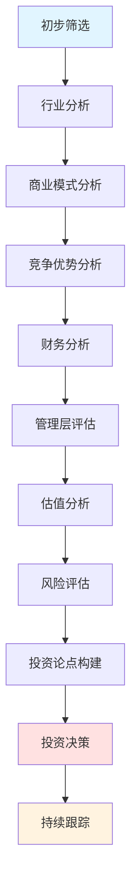
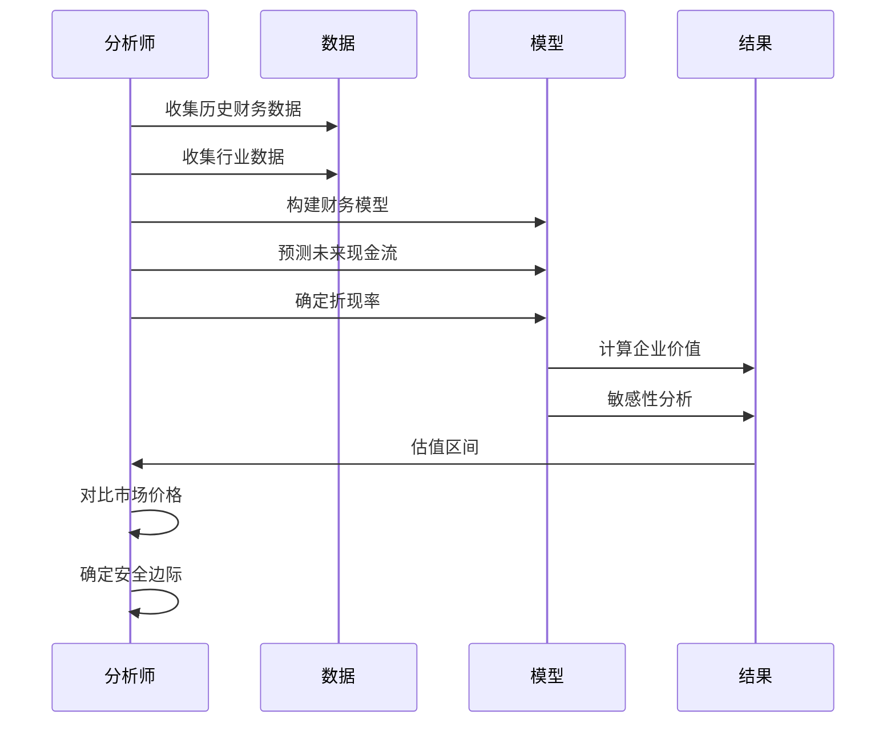
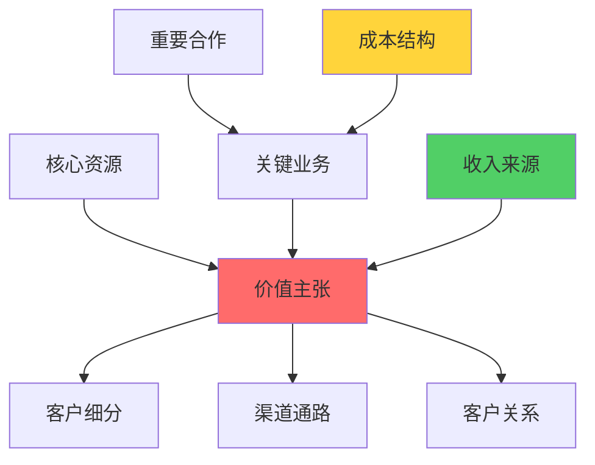
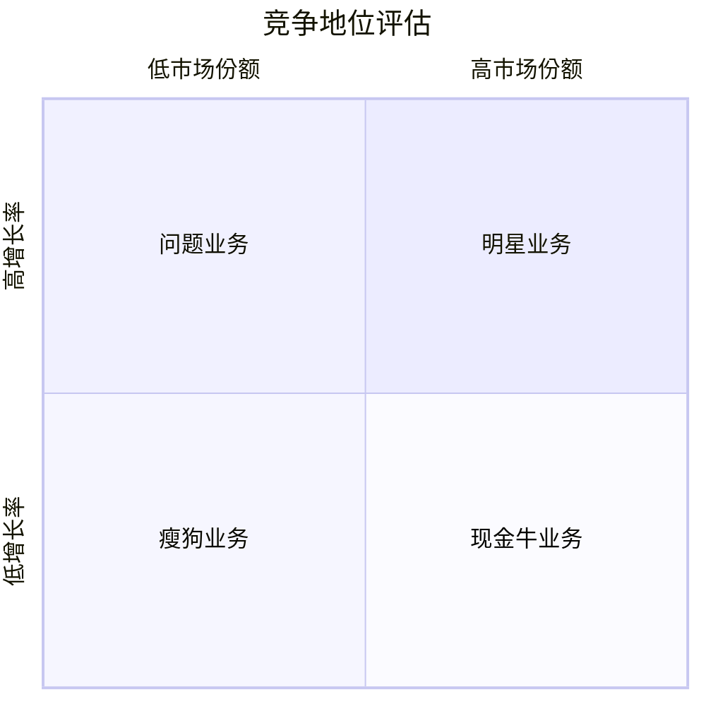

# 公司研究框架

## 概述

系统化的公司研究是成功投资的基础。一个完整的研究框架能够帮助投资者：

- 全面评估公司的投资价值
- 识别关键风险和机会
- 建立清晰的投资论点
- 做出理性的投资决策
- 持续跟踪投资标的

本文提供一套经过实践检验的公司研究框架，涵盖从初步筛选到深度分析的完整流程。

**学习目标**：
1. 掌握系统化的公司研究流程
2. 理解各研究环节的重点和方法
3. 学会构建公司研究模板
4. 建立高效的研究工作流
5. 培养独立研究能力

## 完整研究流程

### 研究流程图




**输出**: 10-20 家候选公司清单

#### 第二阶段：行业分析 (Industry Analysis)

**目标**: 理解公司所处行业的结构、动态和前景

**分析框架**:

1. **波特五力分析**
   - 供应商议价能力
   - 买方议价能力
   - 新进入者威胁
   - 替代品威胁
   - 行业内竞争强度

2. **行业生命周期**
   - 导入期: 高风险、高增长
   - 成长期: 快速扩张、竞争加剧
   - 成熟期: 稳定增长、市场集中
   - 衰退期: 需求下降、整合淘汰

3. **价值链分析**
   - 上游: 原材料、零部件供应
   - 中游: 生产制造、研发设计
   - 下游: 渠道分销、终端销售
   - 利润分布: 价值链各环节的利润率

4. **行业趋势**
   - 技术变革
   - 监管变化
   - 消费者偏好
   - 全球化趋势

**关键问题**:
- 这是一个好行业吗？
- 行业的长期增长驱动力是什么？
- 行业的盈利能力如何？
- 行业的竞争格局如何？
- 行业面临哪些风险和挑战？

**输出**: 行业分析报告 (10-15页)

#### 第三阶段：商业模式研究 (Business Model Analysis)

**目标**: 深入理解公司如何创造、传递和获取价值

**商业模式画布**:

1. **客户细分** (Customer Segments)
   - 目标客户群体
   - 客户需求和痛点
   - 客户获取成本 (CAC)
   - 客户生命周期价值 (LTV)

2. **价值主张** (Value Propositions)
   - 核心产品/服务
   - 差异化优势
   - 解决的问题
   - 创造的价值

3. **渠道通路** (Channels)
   - 销售渠道
   - 分销网络
   - 客户触达方式
   - 渠道效率

4. **客户关系** (Customer Relationships)
   - 获客策略
   - 留存机制
   - 增值服务
   - 社区建设

5. **收入来源** (Revenue Streams)
   - 收入模式: 一次性、订阅、广告、佣金
   - 定价策略
   - 收入多元化
   - 收入质量

6. **核心资源** (Key Resources)
   - 物理资源: 工厂、设备、网络
   - 知识资源: 专利、技术、品牌
   - 人力资源: 团队、文化
   - 财务资源: 现金、融资能力

7. **关键活动** (Key Activities)
   - 研发创新
   - 生产制造
   - 营销推广
   - 平台运营

8. **重要伙伴** (Key Partnerships)
   - 供应商关系
   - 战略联盟
   - 合资企业
   - 生态系统伙伴

9. **成本结构** (Cost Structure)
   - 固定成本 vs 可变成本
   - 规模经济
   - 成本优化
   - 运营杠杆


**商业模式评估标准**:
- **可扩展性**: 能否低成本快速扩张
- **可持续性**: 商业模式的长期生命力
- **盈利性**: 能否产生稳定的现金流
- **防御性**: 是否具备竞争壁垒

**输出**: 商业模式分析报告 (15-20页)

#### 第四阶段：竞争地位分析 (Competitive Position)

**目标**: 评估公司在行业中的竞争优势和市场地位

**分析维度**:

1. **市场份额**
   - 绝对市场份额
   - 相对市场份额 (vs 最大竞争对手)
   - 市场份额趋势
   - 细分市场地位

2. **经济护城河**
   - **品牌护城河**: 品牌认知度、品牌溢价、客户忠诚度
   - **规模护城河**: 规模经济、网络效应、平台效应
   - **成本护城河**: 独特资源、工艺优势、地理优势
   - **转换成本**: 客户迁移成本、生态系统锁定
   - **监管护城河**: 牌照、专利、政策保护

3. **竞争优势来源**
   - 技术领先
   - 品牌价值
   - 渠道优势
   - 成本优势
   - 服务质量

4. **竞争对手分析**
   - 主要竞争对手识别
   - 竞争对手优劣势
   - 市场竞争格局
   - 竞争策略对比

**护城河评分系统**:
- 无护城河: 0分
- 窄护城河: 1-2分
- 宽护城河: 3-4分
- 超宽护城河: 5分

**输出**: 竞争地位分析报告 (10-15页)

#### 第五阶段：管理层评估 (Management Analysis)

**目标**: 评估管理层的能力、诚信和股东导向

**评估维度**:

1. **管理能力**
   - 战略眼光
   - 执行能力
   - 资本配置能力
   - 危机应对能力
   - 创新能力

2. **诚信度**
   - 财务透明度
   - 承诺兑现
   - 历史记录
   - 关联交易
   - 会计政策

3. **股东导向**
   - 股权激励设计
   - 分红政策
   - 股票回购
   - 资本回报率
   - 沟通透明度

4. **公司治理**
   - 董事会独立性
   - 内部控制
   - 审计质量
   - 信息披露

**管理层评估清单**:
- [ ] CEO 持股比例是否合理？
- [ ] 管理层薪酬是否与业绩挂钩？
- [ ] 是否有关联交易或利益输送？
- [ ] 财务报表是否清晰透明？
- [ ] 是否频繁更换审计师？
- [ ] 是否有诉讼或监管处罚？
- [ ] 资本配置决策是否明智？
- [ ] 是否重视股东回报？

**输出**: 管理层评估报告 (8-10页)


#### 第六阶段：财务分析 (Financial Analysis)

**目标**: 全面分析公司的财务状况、盈利能力和现金流质量

**分析框架**:

1. **盈利能力分析**
   - 毛利率趋势
   - 营业利润率
   - 净利润率
   - ROE (净资产收益率)
   - ROA (总资产收益率)
   - ROIC (投入资本回报率)

2. **运营效率分析**
   - 资产周转率
   - 存货周转率
   - 应收账款周转率
   - 现金转换周期
   - 营运资本管理

3. **财务健康分析**
   - 资产负债率
   - 流动比率
   - 速动比率
   - 利息保障倍数
   - 债务结构

4. **现金流分析**
   - 经营现金流
   - 投资现金流
   - 融资现金流
   - 自由现金流
   - 现金流质量

5. **增长分析**
   - 营收增长率 (历史和预测)
   - 利润增长率
   - 增长驱动因素
   - 增长可持续性
   - 增长质量

**财务分析工具**:
- 杜邦分析 (DuPont Analysis)
- 共同比分析 (Common Size Analysis)
- 趋势分析 (Trend Analysis)
- 同业对比 (Peer Comparison)
- 历史对比 (Historical Comparison)

**关键财务指标清单**:

| 类别 | 指标 | 优秀标准 |
|------|------|----------|
| 盈利能力 | ROE | > 15% |
| 盈利能力 | 净利润率 | > 10% |
| 盈利能力 | 毛利率 | > 40% |
| 运营效率 | 资产周转率 | > 1.0 |
| 财务健康 | 资产负债率 | < 60% |
| 财务健康 | 流动比率 | > 1.5 |
| 现金流 | 经营现金流/净利润 | > 1.0 |
| 成长性 | 营收增长率 | > 10% |

**输出**: 财务分析报告 (20-25页)

#### 第七阶段：估值分析 (Valuation)

**目标**: 确定公司的内在价值和合理价格区间

**估值方法选择**:

1. **DCF 估值** (适用于现金流稳定的公司)
   - 预测未来自由现金流 (5-10年)
   - 计算加权平均资本成本 (WACC)
   - 计算终值 (Terminal Value)
   - 折现求和得到企业价值
   - 敏感性分析

2. **相对估值** (适用于有可比公司的情况)
   - P/E (市盈率)
   - P/B (市净率)
   - P/S (市销率)
   - EV/EBITDA
   - PEG (市盈率相对盈利增长比率)

3. **资产基础估值** (适用于资产密集型公司)
   - 账面价值
   - 清算价值
   - 重置成本

**估值步骤**:



**估值调整因素**:
- 控制权溢价/折价
- 流动性折价
- 国家风险溢价
- 小公司风险溢价
- 周期性调整

**输出**: 估值分析报告 (15-20页)，包含目标价格区间


#### 第八阶段：风险评估 (Risk Assessment)

**目标**: 识别和量化投资风险

**风险类型**:

1. **业务风险**
   - 行业周期性风险
   - 技术替代风险
   - 竞争加剧风险
   - 客户集中度风险
   - 供应链风险

2. **财务风险**
   - 债务风险
   - 流动性风险
   - 汇率风险
   - 利率风险
   - 信用风险

3. **运营风险**
   - 管理层变动
   - 关键人员依赖
   - 产品质量问题
   - 监管合规风险
   - 声誉风险

4. **市场风险**
   - 估值过高风险
   - 流动性风险
   - 市场情绪风险
   - 系统性风险

**风险评估矩阵**:

| 风险类型 | 发生概率 | 影响程度 | 风险等级 | 应对措施 |
|----------|----------|----------|----------|----------|
| 技术替代 | 中 | 高 | 高 | 密切跟踪技术趋势 |
| 竞争加剧 | 高 | 中 | 高 | 评估护城河强度 |
| 债务违约 | 低 | 高 | 中 | 监控财务指标 |
| 监管变化 | 中 | 中 | 中 | 关注政策动向 |

**风险量化**:
- 情景分析: 基准、乐观、悲观情景
- 敏感性分析: 关键假设变化的影响
- 蒙特卡洛模拟: 概率分布
- 压力测试: 极端情况下的表现

**输出**: 风险评估报告 (10-12页)

#### 第九阶段：投资论点构建 (Investment Thesis)

**目标**: 形成清晰、可验证的投资逻辑

**投资论点结构**:

1. **核心论点** (1-2句话)
   - 为什么这是一个好投资？
   - 核心价值驱动因素是什么？

2. **支撑论据** (3-5个关键点)
   - 行业前景
   - 竞争优势
   - 财务表现
   - 估值吸引力
   - 催化剂

3. **反面论证** (Bear Case)
   - 主要风险
   - 可能出错的地方
   - 最坏情况分析

4. **预期回报**
   - 目标价格
   - 预期回报率
   - 持有期限
   - 回报来源分解

5. **可验证的里程碑**
   - 6个月检查点
   - 12个月检查点
   - 退出条件

**投资论点模板**:

```
公司: [公司名称]
当前价格: $XX
目标价格: $XX (XX% 上涨空间)
投资期限: X年

核心论点:
[一句话总结投资逻辑]

关键支撑:
1. [论据1]
2. [论据2]
3. [论据3]

主要风险:
1. [风险1]
2. [风险2]

催化剂:
- 短期 (3-6个月): [催化剂]
- 中期 (6-12个月): [催化剂]
- 长期 (1-3年): [催化剂]

退出条件:
- 止盈: [条件]
- 止损: [条件]
- 论点失效: [条件]
```

**输出**: 投资论点文档 (5-8页)

#### 第十阶段：持续跟踪 (Ongoing Monitoring)

**目标**: 持续监控投资论点的有效性

**跟踪内容**:

1. **财务跟踪**
   - 季度财报分析
   - 关键指标变化
   - 业绩指引
   - 财务预测更新

2. **业务跟踪**
   - 产品发布
   - 市场份额变化
   - 竞争动态
   - 行业趋势

3. **估值跟踪**
   - 估值水平变化
   - 市场情绪
   - 相对估值
   - 安全边际

4. **风险跟踪**
   - 新风险出现
   - 风险等级变化
   - 风险事件
   - 应对措施

**跟踪频率**:
- 日常: 股价、新闻、公告
- 周度: 行业动态、竞争对手
- 月度: 经营数据、宏观环境
- 季度: 财报分析、论点复盘
- 年度: 全面重新评估

**输出**: 定期跟踪报告


## 研究方法论

### 自上而下 vs 自下而上

**自上而下 (Top-Down)**:
1. 宏观经济分析
2. 行业选择
3. 公司筛选
4. 个股研究

**优点**:
- 把握大趋势
- 行业配置合理
- 避免逆势而为

**缺点**:
- 可能错过优秀个股
- 宏观预测困难
- 时机把握难

**自下而上 (Bottom-Up)**:
1. 个股筛选
2. 公司深度研究
3. 行业理解
4. 宏观验证

**优点**:
- 聚焦公司质量
- 发现隐藏价值
- 不依赖宏观预测

**缺点**:
- 可能忽视行业风险
- 组合集中度高
- 需要大量研究

**最佳实践**: 结合两种方法
- 用自上而下确定行业方向
- 用自下而上选择优质个股
- 宏观和微观相互验证

### 信息来源层级

**一手信息** (最可靠):
- 公司财报和公告
- 管理层电话会议
- 投资者日活动
- 实地调研
- 客户访谈
- 供应商访谈

**二手信息** (需验证):
- 券商研报
- 行业报告
- 新闻报道
- 专家访谈
- 数据库统计

**三手信息** (参考):
- 社交媒体
- 论坛讨论
- 博客文章
- 市场传闻

**信息验证原则**:
- 多源验证
- 交叉核对
- 逻辑推理
- 数据支撑

### Scuttlebutt 调研法

**菲利普·费雪的"闲聊法"**:

**调研对象**:
1. 客户: 产品满意度、品牌认知
2. 供应商: 合作关系、付款信誉
3. 竞争对手: 市场地位、优劣势
4. 前员工: 公司文化、管理风格
5. 行业专家: 技术趋势、市场格局
6. 经销商: 销售情况、库存水平
7. 监管机构: 合规情况、行业政策

**调研问题示例**:
- "你们为什么选择/不选择这家公司的产品？"
- "与竞争对手相比，这家公司有什么不同？"
- "这家公司的管理层怎么样？"
- "行业未来3-5年会如何发展？"
- "这家公司面临的最大挑战是什么？"

**调研技巧**:
- 开放式问题
- 倾听多于说话
- 记录关键信息
- 寻找一致性
- 识别异常信号

### 研究深度分级

**Level 1: 快速扫描** (1-2小时)
- 阅读公司简介
- 查看关键财务指标
- 了解商业模式
- 判断是否值得深入

**Level 2: 标准研究** (1-2天)
- 完整财务分析
- 行业地位评估
- 基本估值
- 初步投资论点

**Level 3: 深度研究** (1-2周)
- 详细商业模式分析
- 竞争优势深度评估
- 管理层全面评估
- 多种估值方法
- 完整风险分析
- 实地调研

**Level 4: 专家级研究** (1个月+)
- 行业专家访谈
- 供应链调研
- 客户调研
- 竞争对手对比
- 历史复盘
- 情景分析
- 持续跟踪

**研究深度选择**:
- 仓位大小决定研究深度
- 重仓股需要 Level 3-4 研究
- 小仓位可以 Level 2 研究
- 观察股可以 Level 1 扫描

### 研究深度层级

#### 第一层：快速筛选（1-2小时）
**目标**：快速判断是否值得深入研究

**关键问题**：
- 公司做什么业务？
- 行业前景如何？
- 财务状况健康吗？
- 估值是否合理？
- 是否符合投资标准？

**输出**：通过/不通过初筛

#### 第二层：基础研究（1-2天）
**目标**：建立对公司的基本认知

**研究内容**：
- 行业地位和竞争格局
- 商业模式和盈利来源
- 核心财务指标分析
- 基本估值评估
- 主要风险识别

**输出**：公司概况报告

#### 第三层：深度研究（1-2周）
**目标**：全面评估投资价值

**研究内容**：
- 详细的行业和竞争分析
- 深入的商业模式研究
- 完整的财务建模
- 多维度估值分析
- 管理层深度评估
- 全面的风险分析

**输出**：完整投资研究报告

#### 第四层：持续跟踪（长期）
**目标**：监控投资论点变化

**跟踪内容**：
- 季度财报分析
- 行业动态跟踪
- 竞争格局变化
- 管理层动向
- 估值水平变化

**输出**：定期更新报告

## 第一步：初步筛选

### 筛选标准设定

#### 定量筛选指标

**盈利能力**：
- ROE > 15%（过去5年平均）
- 净利率 > 10%
- 毛利率 > 30%
- ROIC > 12%

**成长性**：
- 收入增长率 > 10%（过去3年）
- 净利润增长率 > 15%
- 自由现金流增长稳定

**财务健康**：
- 资产负债率 < 60%
- 流动比率 > 1.5
- 利息覆盖倍数 > 5
- 自由现金流为正

**估值合理性**：
- P/E < 行业平均或历史中位数
- P/B < 3（非金融股）
- PEG < 1.5
- EV/EBITDA合理

#### 定性筛选标准

**行业吸引力**：
- 行业长期增长前景
- 竞争格局稳定
- 进入壁垒高
- 监管环境友好

**商业模式**：
- 商业模式清晰
- 盈利模式可持续
- 现金流特征良好
- 轻资产运营

**竞争优势**：
- 明显的护城河
- 品牌或技术优势
- 规模经济
- 网络效应

**管理层**：
- 管理层诚信
- 股东利益一致
- 战略清晰
- 执行力强

### 快速筛选工具

#### 筛选器设计

```python
# 示例：Python筛选脚本框架
def quick_screen(company):
    """快速筛选函数"""
    
    # 财务指标检查
    if company.roe_5y_avg < 0.15:
        return False
    if company.debt_ratio > 0.60:
        return False
    if company.revenue_growth_3y < 0.10:
        return False
    
    # 估值检查
    if company.pe > company.industry_pe * 1.5:
        return False
    
    # 质量检查
    if company.fcf < 0:
        return False
    
    return True
```

#### 数据来源

**免费数据源**：
- 公司官网（年报、公告）
- 交易所网站
- 雪球、东方财富等财经网站
- Google Finance, Yahoo Finance

**付费数据源**：
- Wind资讯
- Bloomberg Terminal
- FactSet
- S&P Capital IQ

## 第二步：行业分析

### 行业研究框架

#### 行业定位
1. 行业定义和分类
2. 行业规模和增长率
3. 行业生命周期阶段
4. 行业在经济中的地位

#### 竞争格局
1. 市场集中度（CR4, HHI）
2. 主要竞争者识别
3. 竞争强度评估
4. 进入和退出壁垒

#### 价值链分析
1. 上游供应商分析
2. 中游生产环节
3. 下游渠道和客户
4. 价值分配机制

#### 驱动因素
1. 需求驱动因素
2. 供给侧变化
3. 技术创新影响
4. 政策监管环境

### 波特五力应用

**应用步骤**：
1. 评估现有竞争者强度
2. 分析供应商议价能力
3. 评估买方议价能力
4. 识别新进入者威胁
5. 评估替代品威胁
6. 综合判断行业吸引力

**输出**：行业吸引力评分（1-5分）

## 第三步：商业模式分析

### 商业模式画布



### 关键分析维度

#### 1. 价值主张
**核心问题**：
- 公司为客户创造什么价值？
- 解决什么痛点？
- 满足什么需求？
- 与竞争对手有何不同？

**分析要点**：
- 产品/服务独特性
- 客户价值量化
- 差异化优势
- 价值传递方式

#### 2. 客户细分
**核心问题**：
- 目标客户是谁？
- 客户特征如何？
- 市场规模多大？
- 客户获取成本？

**分析要点**：
- 客户画像
- 市场容量
- 客户集中度
- 客户粘性

#### 3. 收入模式
**核心问题**：
- 如何赚钱？
- 收入来源有哪些？
- 定价策略如何？
- 收入可持续性？

**分析要点**：
- 收入结构
- 定价权
- 收入增长驱动
- 收入质量

#### 4. 成本结构
**核心问题**：
- 主要成本是什么？
- 成本结构如何？
- 规模经济效应？
- 成本控制能力？

**分析要点**：
- 固定成本vs变动成本
- 成本优势来源
- 运营杠杆
- 成本趋势

### 商业模式评估

**优秀商业模式特征**：
1. 清晰的价值主张
2. 可扩展性强
3. 高毛利率
4. 轻资产运营
5. 强现金流
6. 网络效应或规模经济
7. 高转换成本
8. 多元化收入来源

**商业模式风险**：
1. 单一客户依赖
2. 低毛利率
3. 重资产模式
4. 现金流差
5. 易被颠覆
6. 监管风险高

## 第四步：竞争优势分析

### 护城河识别

#### 五大护城河类型

**1. 无形资产**
- 品牌价值
- 专利技术
- 监管许可
- 数据资产

**评估方法**：
- 品牌溢价能力
- 专利数量和质量
- 许可稀缺性
- 数据独特性

**2. 转换成本**
- 学习成本
- 迁移成本
- 关系成本
- 财务成本

**评估方法**：
- 客户留存率
- 转换难度
- 生态系统锁定
- 合同条款

**3. 网络效应**
- 直接网络效应
- 间接网络效应
- 双边市场效应
- 平台效应

**评估方法**：
- 用户增长曲线
- 活跃度指标
- 多边参与度
- 网络密度

**4. 成本优势**
- 规模经济
- 专有技术
- 地理位置
- 流程优化

**评估方法**：
- 单位成本对比
- 规模效应曲线
- 成本结构分析
- 效率指标

**5. 规模经济**
- 采购规模优势
- 生产规模效应
- 分销网络优势
- 研发分摊

**评估方法**：
- 市场份额
- 成本曲线
- 固定成本占比
- 规模门槛

### 竞争地位评估

#### 市场地位矩阵



#### 竞争优势持久性

**评估维度**：
1. 护城河宽度（优势大小）
2. 护城河深度（优势强度）
3. 护城河趋势（加宽/收窄）
4. 护城河可防御性

**持久性评分**：
- 5分：极强护城河（10年+）
- 4分：强护城河（5-10年）
- 3分：中等护城河（3-5年）
- 2分：弱护城河（1-3年）
- 1分：无护城河

## 第五步：财务分析

### 财务分析框架

#### 三表分析

**资产负债表分析**：
- 资产结构和质量
- 负债结构和风险
- 股东权益变化
- 营运资本管理

**利润表分析**：
- 收入增长质量
- 盈利能力趋势
- 成本费用控制
- 利润构成分析

**现金流量表分析**：
- 经营现金流质量
- 投资活动分析
- 融资活动分析
- 自由现金流计算

#### 关键财务比率

**盈利能力**：
- ROE（杜邦分析）
- ROA
- ROIC
- 毛利率、净利率
- EBITDA利润率

**运营效率**：
- 资产周转率
- 存货周转率
- 应收账款周转率
- 应付账款周转率
- 现金周期

**财务健康**：
- 资产负债率
- 流动比率
- 速动比率
- 利息覆盖倍数
- 债务/EBITDA

**成长性**：
- 收入增长率
- 利润增长率
- 自由现金流增长率
- 每股收益增长率

### 财务质量评估

#### 收入质量
- 收入确认政策
- 应收账款变化
- 递延收入情况
- 关联交易占比

#### 利润质量
- 非经常性损益
- 会计政策变更
- 利润与现金流匹配
- 税率变化影响

#### 现金流质量
- 经营现金流/净利润
- 资本支出合理性
- 营运资本变化
- 自由现金流稳定性

### 财务建模

#### 基础模型结构

**历史数据**（3-5年）：
- 完整三表数据
- 关键比率计算
- 趋势分析

**预测假设**：
- 收入增长率
- 利润率趋势
- 资本支出
- 营运资本需求
- 税率

**财务预测**（3-5年）：
- 预测利润表
- 预测资产负债表
- 预测现金流量表
- 敏感性分析

## 第六步：管理层评估

### 评估维度

#### 1. 能力评估
- 行业经验
- 战略眼光
- 执行能力
- 创新能力
- 危机应对

#### 2. 诚信评估
- 历史记录
- 信息披露质量
- 承诺兑现
- 关联交易
- 会计政策

#### 3. 激励一致性
- 股权结构
- 薪酬体系
- 股权激励
- 分红政策
- 资本配置

### 评估方法

**定量指标**：
- 管理层持股比例
- 股权激励行权价
- 薪酬与业绩关联度
- 历史业绩达成率

**定性评估**：
- 阅读股东信
- 分析战略决策
- 观察资本配置
- 研究公司文化
- 参加股东大会

## 第七步：估值分析

### 多维度估值

#### 绝对估值法

**DCF模型**：
- 自由现金流预测
- WACC计算
- 终值估算
- 敏感性分析

**DDM模型**：
- 股利增长率
- 要求回报率
- 适用于稳定分红公司

#### 相对估值法

**市盈率（P/E）**：
- 与历史对比
- 与同行对比
- PEG比率
- 适用场景

**市净率（P/B）**：
- 适用于资产驱动型
- ROE调整
- 账面价值质量

**EV/EBITDA**：
- 消除资本结构影响
- 适用于并购估值
- 跨国比较

#### 估值区间

**保守估值**：
- 悲观假设
- 高折现率
- 低增长率
- 安全边际

**中性估值**：
- 合理假设
- 市场折现率
- 稳定增长率
- 公允价值

**乐观估值**：
- 乐观假设
- 低折现率
- 高增长率
- 上行空间

## 第八步：风险评估

### 风险分类

#### 行业风险
- 周期性风险
- 技术颠覆风险
- 监管政策风险
- 竞争加剧风险

#### 公司风险
- 经营风险
- 财务风险
- 管理层风险
- 治理风险

#### 市场风险
- 估值风险
- 流动性风险
- 系统性风险
- 情绪风险

### 风险量化

**风险评分矩阵**：

| 风险类型 | 发生概率 | 影响程度 | 风险等级 |
|---------|---------|---------|---------|
| 行业周期 | 中 | 高 | 高 |
| 技术颠覆 | 低 | 极高 | 中 |
| 监管变化 | 中 | 中 | 中 |
| 竞争加剧 | 高 | 中 | 高 |
| 财务杠杆 | 低 | 高 | 中 |

**风险缓释措施**：
- 分散投资
- 仓位控制
- 止损设置
- 对冲策略
- 持续监控

## 研究报告模板

### 标准报告结构

#### 执行摘要（1页）
- 投资建议
- 目标价
- 核心逻辑
- 主要风险

#### 公司概况（2-3页）
- 基本信息
- 业务介绍
- 发展历程
- 股权结构

#### 行业分析（3-5页）
- 行业概况
- 竞争格局
- 发展趋势
- 投资逻辑

#### 商业模式（3-4页）
- 商业模式画布
- 盈利模式
- 竞争优势
- 护城河分析

#### 财务分析（5-8页）
- 历史财务回顾
- 财务比率分析
- 财务预测
- 敏感性分析

#### 估值分析（3-5页）
- 估值方法选择
- 详细估值计算
- 估值区间
- 目标价推导

#### 风险分析（2-3页）
- 主要风险识别
- 风险量化
- 缓释措施

#### 投资建议（1页）
- 明确建议
- 投资逻辑总结
- 催化剂
- 跟踪指标

## 研究工具箱

### Excel模板

**财务模型模板**：
- 三表模型
- 比率分析
- DCF估值
- 敏感性分析

**筛选器模板**：
- 多维度筛选
- 自动评分
- 排序功能

### Python工具

**数据获取**：
```python
import yfinance as yf
import pandas as pd

# 获取财务数据
ticker = yf.Ticker("AAPL")
financials = ticker.financials
balance_sheet = ticker.balance_sheet
cash_flow = ticker.cashflow
```

**财务分析**：
```python
def calculate_roe(net_income, equity):
    """计算ROE"""
    return net_income / equity

def calculate_roic(nopat, invested_capital):
    """计算ROIC"""
    return nopat / invested_capital
```

### 研究清单

**初步筛选清单**：
- [ ] 行业前景良好
- [ ] 商业模式清晰
- [ ] 财务指标健康
- [ ] 估值合理
- [ ] 管理层优秀

**深度研究清单**：
- [ ] 完成行业分析
- [ ] 完成商业模式分析
- [ ] 完成竞争优势分析
- [ ] 完成财务分析
- [ ] 完成管理层评估
- [ ] 完成估值分析
- [ ] 完成风险评估
- [ ] 构建投资论点

## 常见误区

### 误区1：过度依赖定量指标
**问题**：只看财务数据，忽视定性分析
**正确做法**：定量与定性结合，重视商业模式和竞争优势

### 误区2：线性外推历史
**问题**：假设过去的增长会持续
**正确做法**：考虑基数效应、竞争变化、市场饱和

### 误区3：忽视行业分析
**问题**：孤立分析公司，不考虑行业环境
**正确做法**：自上而下，先行业后公司

### 误区4：估值锚定
**问题**：过度关注当前股价
**正确做法**：基于内在价值，独立估值

### 误区5：确认偏误
**问题**：只寻找支持观点的证据
**正确做法**：主动寻找反面证据，保持客观

## 实战建议

### 建立研究流程

**每日工作**：
- 阅读财经新闻
- 跟踪持仓公司
- 更新研究笔记

**每周工作**：
- 深度研究1-2家公司
- 更新行业跟踪
- 复盘投资决策

**每月工作**：
- 完成2-3份研究报告
- 组合再平衡
- 总结经验教训

### 能力提升路径

**初级阶段**（0-1年）：
- 掌握基础分析方法
- 完成20+公司研究
- 建立研究模板

**中级阶段**（1-3年）：
- 深化行业理解
- 完成50+公司研究
- 形成投资风格

**高级阶段**（3-5年）：
- 建立独特洞察
- 完成100+公司研究
- 持续优化框架

## 延伸阅读

### 必读书籍

1. **《证券分析》** - 本杰明·格雷厄姆
   - 价值投资经典
   - 公司分析基础

2. **《巴菲特致股东的信》** - 沃伦·巴菲特
   - 实战研究案例
   - 投资思维方式

3. **《彼得·林奇的成功投资》** - 彼得·林奇
   - 公司研究方法
   - 选股策略

4. **《投资最重要的事》** - 霍华德·马克斯
   - 风险思维
   - 投资哲学

5. **《财务报表分析与证券定价》** - 斯蒂芬·佩因曼
   - 深度财务分析
   - 估值方法

### 推荐资源

**研究报告**：
- 高盛研究报告
- 摩根士丹利研究
- 国内券商深度报告

**数据平台**：
- Wind资讯
- Bloomberg
- FactSet
- Seeking Alpha

## 参考文献

1. Graham, B., & Dodd, D. (1934). *Security Analysis*. McGraw-Hill.
2. Buffett, W. (Annual). *Berkshire Hathaway Shareholder Letters*.
3. Lynch, P. (1989). *One Up On Wall Street*. Simon & Schuster.
4. Marks, H. (2011). *The Most Important Thing*. Columbia Business School.
5. Penman, S. H. (2012). *Financial Statement Analysis and Security Valuation*. McGraw-Hill.
6. Damodaran, A. (2012). *Investment Valuation*. Wiley Finance.
7. Greenblatt, J. (2010). *The Little Book That Beats the Market*. Wiley.
8. Klarman, S. (1991). *Margin of Safety*. HarperBusiness.
9. Fisher, P. A. (1958). *Common Stocks and Uncommon Profits*. Wiley.
10. Hagstrom, R. G. (2013). *The Warren Buffett Way*. Wiley.

---

**下一步行动**：
1. 选择一家公司开始完整研究
2. 使用本框架进行系统分析
3. 撰写完整研究报告
4. 与其他投资者交流讨论
5. 持续优化研究流程

**相关主题**：
- [尽职调查方法](due-diligence.html)
- [管理层分析](management-analysis.html)
- [竞争定位分析](competitive-positioning.html)
- [投资论点构建](investment-thesis.html)
- [财务报表分析](../../03-company-analysis/financial-statements/index.html)
- [估值方法](../../03-company-analysis/valuation-methods/index.html)


## 研究工具箱

### 必备工具清单

**财务数据工具**:
- Bloomberg Terminal (专业级)
- FactSet (专业级)
- Capital IQ (专业级)
- Wind (中国市场)
- Yahoo Finance (免费)
- Seeking Alpha (免费)
- GuruFocus (价值投资)

**分析工具**:
- Excel / Google Sheets (财务模型)
- Python (数据分析)
- Tableau / Power BI (可视化)
- Notion / Obsidian (研究笔记)

**信息源**:
- 公司官网 (IR 页面)
- SEC EDGAR (美国公司)
- 巨潮资讯网 (中国A股)
- 港交所披露易 (香港)
- 券商研报平台
- 行业协会网站

### 研究模板

**公司研究报告模板**:

```markdown
# [公司名称] 研究报告

## 执行摘要
- 投资评级: 买入/持有/卖出
- 目标价: $XX
- 核心论点: [一句话]

## 1. 公司概况
- 基本信息
- 业务结构
- 发展历程

## 2. 行业分析
- 行业概况
- 竞争格局
- 行业趋势

## 3. 商业模式
- 价值主张
- 收入模式
- 成本结构
- 护城河

## 4. 财务分析
- 盈利能力
- 运营效率
- 财务健康
- 现金流质量

## 5. 估值分析
- DCF 估值
- 相对估值
- 估值对比
- 目标价

## 6. 风险分析
- 主要风险
- 风险量化
- 应对措施

## 7. 投资建议
- 投资评级
- 目标价格
- 持有期限
- 仓位建议
```

### 研究清单 (Checklist)

**基础信息清单**:
- [ ] 公司名称、代码、上市地
- [ ] 主营业务和产品
- [ ] 收入和利润规模
- [ ] 市值和估值水平
- [ ] 股权结构和大股东
- [ ] 管理层背景

**行业分析清单**:
- [ ] 行业规模和增长率
- [ ] 行业生命周期阶段
- [ ] 竞争格局和集中度
- [ ] 进入壁垒高度
- [ ] 行业盈利能力
- [ ] 行业未来趋势

**商业模式清单**:
- [ ] 客户是谁？
- [ ] 解决什么问题？
- [ ] 如何赚钱？
- [ ] 收入模式是什么？
- [ ] 成本结构如何？
- [ ] 是否可扩展？
- [ ] 是否可持续？

**竞争优势清单**:
- [ ] 是否有品牌优势？
- [ ] 是否有规模优势？
- [ ] 是否有成本优势？
- [ ] 是否有技术优势？
- [ ] 是否有网络效应？
- [ ] 转换成本高吗？
- [ ] 护城河有多宽？

**财务分析清单**:
- [ ] 过去5-10年财务数据
- [ ] 盈利能力趋势
- [ ] 现金流质量
- [ ] 资产负债表健康度
- [ ] 与同行对比
- [ ] 会计政策是否保守？
- [ ] 是否有财务造假迹象？

**管理层清单**:
- [ ] CEO 背景和能力
- [ ] 管理层持股比例
- [ ] 薪酬结构合理性
- [ ] 资本配置记录
- [ ] 诚信度评估
- [ ] 股东沟通质量

**估值清单**:
- [ ] DCF 估值
- [ ] 相对估值 (P/E, P/B, EV/EBITDA)
- [ ] 历史估值区间
- [ ] 同行估值对比
- [ ] 安全边际
- [ ] 目标价格区间

**风险清单**:
- [ ] 主要业务风险
- [ ] 财务风险
- [ ] 运营风险
- [ ] 市场风险
- [ ] 风险量化
- [ ] 应对措施


## 不同类型公司的研究重点

### 成长型公司

**研究重点**:
- 市场空间 (TAM, SAM, SOM)
- 增长驱动因素
- 单位经济模型
- 客户获取和留存
- 产品创新能力
- 管理层执行力

**关键指标**:
- 营收增长率
- 用户增长率
- 客户留存率
- 毛利率趋势
- 研发投入占比
- 市场份额变化

**估值方法**:
- P/S (市销率)
- EV/Revenue
- PEG
- DCF (长期预测)

**案例**: Amazon, Tesla, Shopify

### 价值型公司

**研究重点**:
- 资产质量
- 盈利稳定性
- 现金流产生能力
- 股东回报政策
- 估值折价原因
- 价值实现路径

**关键指标**:
- P/E (市盈率)
- P/B (市净率)
- 股息率
- 自由现金流收益率
- ROE
- 债务水平

**估值方法**:
- P/E, P/B
- 股息折现模型
- 资产基础估值
- 清算价值

**案例**: Berkshire Hathaway, 银行股, 能源股

### 周期型公司

**研究重点**:
- 周期位置判断
- 供需平衡
- 产能周期
- 成本曲线位置
- 库存水平
- 资本支出周期

**关键指标**:
- 产能利用率
- 库存周转率
- 价格趋势
- 成本变化
- 资本支出
- 现金流波动

**估值方法**:
- 周期调整 P/E
- P/B
- EV/EBITDA
- 资产价值

**案例**: 钢铁、化工、航运、半导体

### 平台型公司

**研究重点**:
- 网络效应强度
- 双边市场动态
- 平台规模
- 生态系统健康度
- 货币化能力
- 监管风险

**关键指标**:
- 活跃用户数 (DAU, MAU)
- 交易量 (GMV)
- 变现率 (Take Rate)
- 用户留存率
- 平台粘性
- 生态系统规模

**估值方法**:
- P/S
- EV/GMV
- 用户价值
- DCF

**案例**: Facebook, Alibaba, Uber, Airbnb

### 金融公司

**研究重点**:
- 资产质量
- 风险管理
- 资本充足率
- 净息差
- 不良贷款率
- 监管合规

**关键指标**:
- ROE, ROA
- 净息差 (NIM)
- 不良贷款率 (NPL)
- 拨备覆盖率
- 资本充足率
- 成本收入比

**估值方法**:
- P/B
- P/E
- 股息折现模型
- 剩余收益模型

**案例**: JPMorgan, Bank of America, 招商银行

## 常见错误和陷阱

### 研究过程中的常见错误

1. **确认偏误** (Confirmation Bias)
   - 只寻找支持自己观点的信息
   - 忽视反面证据
   - **应对**: 主动寻找反面论据，建立 Bear Case

2. **锚定效应** (Anchoring)
   - 过度依赖初始信息
   - 难以调整观点
   - **应对**: 定期重新评估，保持开放心态

3. **过度自信** (Overconfidence)
   - 高估自己的分析能力
   - 低估风险
   - **应对**: 建立安全边际，分散投资

4. **从众心理** (Herding)
   - 跟随市场热点
   - 忽视独立思考
   - **应对**: 逆向思维，独立判断

5. **近因偏误** (Recency Bias)
   - 过度关注近期表现
   - 忽视长期趋势
   - **应对**: 分析长期历史数据

### 研究陷阱

1. **数据陷阱**
   - 会计调整和非经常性项目
   - 收入确认政策
   - 折旧摊销方法
   - 表外负债
   - **识别**: 仔细阅读财报附注

2. **叙事陷阱**
   - 动人的故事但缺乏数据支撑
   - 管理层过度承诺
   - 市场炒作
   - **识别**: 用数据验证故事

3. **估值陷阱**
   - 低 P/E 不等于便宜
   - 高增长不等于好投资
   - 忽视资本需求
   - **识别**: 多种估值方法交叉验证

4. **质量陷阱**
   - 表面光鲜的财务数据
   - 不可持续的高利润率
   - 依赖会计技巧的盈利
   - **识别**: 分析现金流质量

## 实战案例

### 案例1: 科技成长股研究 - Nvidia

**研究过程**:

1. **初步筛选**
   - 行业: 半导体 (AI 芯片)
   - 市值: $1T+
   - 增长: 营收增长 > 50%
   - 盈利: 毛利率 > 60%

2. **行业分析**
   - AI 芯片市场快速增长
   - Nvidia 占据 80%+ 市场份额
   - 高进入壁垒 (技术、生态)
   - 长期增长前景

3. **商业模式**
   - 产品: GPU 芯片 + CUDA 软件平台
   - 客户: 云服务商、企业、研究机构
   - 护城河: 技术领先 + 软件生态

4. **财务分析**
   - 毛利率: 70%+
   - 营业利润率: 50%+
   - ROE: 100%+
   - 现金流: 强劲

5. **估值**
   - P/E: 60-80x (高估值)
   - 增长率: 50%+ (支撑高估值)
   - PEG: 1.2-1.6 (合理)

6. **投资论点**
   - AI 革命的核心受益者
   - 技术和生态系统护城河
   - 财务表现优异
   - 风险: 估值高、竞争加剧

### 案例2: 价值股研究 - 银行股

**研究过程**:

1. **初步筛选**
   - 行业: 银行业
   - P/B: < 1.5x
   - ROE: > 12%
   - 股息率: > 3%

2. **行业分析**
   - 成熟行业，稳定增长
   - 监管严格
   - 利率环境影响大

3. **商业模式**
   - 存贷利差
   - 中间业务收入
   - 资产质量关键

4. **财务分析**
   - 净息差: 2-3%
   - 不良贷款率: < 2%
   - 资本充足率: > 12%
   - ROE: 12-15%

5. **估值**
   - P/B: 1.0-1.5x
   - P/E: 8-12x
   - 股息率: 3-5%

6. **投资论点**
   - 估值低，安全边际高
   - 稳定的股息收入
   - 经济复苏受益
   - 风险: 资产质量、监管变化

## 研究效率提升

### 建立研究数据库

**个人研究库结构**:
```
research-database/
├── companies/
│   ├── [公司名称]/
│   │   ├── overview.md
│   │   ├── financials.xlsx
│   │   ├── valuation.xlsx
│   │   ├── notes.md
│   │   └── documents/
├── industries/
│   ├── [行业名称]/
│   │   ├── overview.md
│   │   ├── companies.md
│   │   └── trends.md
├── templates/
│   ├── research-template.md
│   ├── valuation-template.xlsx
│   └── checklist.md
└── watchlist/
    ├── active-positions.md
    ├── watchlist.md
    └── ideas.md
```

### 研究笔记系统

**笔记组织方法**:

1. **按公司组织**
   - 每家公司一个文件夹
   - 包含所有研究材料
   - 定期更新

2. **按主题组织**
   - 行业研究
   - 投资主题
   - 宏观分析

3. **时间线组织**
   - 按研究时间排序
   - 记录思考演进
   - 复盘决策过程

**笔记内容**:
- 研究发现
- 关键数据
- 投资论点
- 风险因素
- 决策记录
- 复盘总结

### 研究时间管理

**时间分配建议**:

| 研究阶段 | 时间占比 | 时间投入 |
|----------|----------|----------|
| 初步筛选 | 5% | 1-2小时 |
| 行业分析 | 15% | 4-6小时 |
| 商业模式 | 20% | 6-8小时 |
| 财务分析 | 25% | 8-10小时 |
| 估值分析 | 15% | 4-6小时 |
| 风险评估 | 10% | 3-4小时 |
| 论点构建 | 10% | 3-4小时 |

**总计**: 标准研究 30-40小时，深度研究 60-80小时

**效率技巧**:
- 使用模板和清单
- 建立标准流程
- 积累行业知识
- 重用研究成果
- 专注核心问题


## 不同市场的研究差异

### 美国市场研究

**特点**:
- 信息披露充分
- 数据获取容易
- 分析师覆盖广
- 市场效率高

**研究重点**:
- 深度财务分析
- 竞争优势评估
- 估值合理性
- 寻找市场误判

**信息来源**:
- SEC 10-K, 10-Q 报告
- 电话会议记录
- 券商研报
- 行业报告

### 中国市场研究

**特点**:
- 信息披露参差不齐
- 需要实地调研
- 政策影响大
- 市场效率较低

**研究重点**:
- 商业模式真实性
- 财务数据可信度
- 政策风险评估
- 实地调研验证

**信息来源**:
- 公司公告
- 实地调研
- 产业链调研
- 第三方数据

**特殊考虑**:
- 会计准则差异
- VIE 结构风险
- 监管政策变化
- 地缘政治风险

### 新兴市场研究

**特点**:
- 信息不对称严重
- 治理风险高
- 汇率风险大
- 流动性风险

**研究重点**:
- 公司治理
- 会计质量
- 政治风险
- 汇率影响

**风险控制**:
- 更高的安全边际
- 更小的仓位
- 更频繁的跟踪
- 更快的止损

## 研究质量评估

### 研究报告质量标准

**优秀研究报告的特征**:

1. **逻辑清晰**
   - 论点明确
   - 论据充分
   - 推理严密
   - 结论合理

2. **数据支撑**
   - 数据来源可靠
   - 数据分析深入
   - 数据可验证
   - 数据更新及时

3. **全面客观**
   - 正反两面分析
   - 风险充分披露
   - 不回避问题
   - 承认不确定性

4. **可操作性**
   - 明确的投资建议
   - 清晰的目标价
   - 具体的买卖点
   - 可验证的里程碑

### 自我评估清单

**研究完成后问自己**:

- [ ] 我真的理解这家公司的商业模式吗？
- [ ] 我能用一句话说清楚投资论点吗？
- [ ] 我分析了所有主要竞争对手吗？
- [ ] 我理解公司的护城河来源吗？
- [ ] 我的财务分析足够深入吗？
- [ ] 我考虑了所有主要风险吗？
- [ ] 我的估值有足够的安全边际吗？
- [ ] 我知道什么情况下会卖出吗？
- [ ] 我能向别人清晰解释这个投资吗？
- [ ] 我愿意把自己的钱投进去吗？

**如果有任何一个问题回答"否"，继续研究！**

## 持续学习和改进

### 研究能力提升路径

**初级阶段** (0-1年):
- 学习财务报表分析
- 掌握基本估值方法
- 研究 20-30 家公司
- 建立研究流程

**中级阶段** (1-3年):
- 深入行业研究
- 掌握多种估值方法
- 研究 50-100 家公司
- 建立研究数据库

**高级阶段** (3-5年):
- 形成独特研究视角
- 建立行业专长
- 研究 100+ 家公司
- 形成投资框架

**专家阶段** (5年+):
- 深度行业洞察
- 独特投资方法论
- 持续跟踪组合
- 指导他人研究

### 研究复盘

**定期复盘内容**:

1. **投资决策复盘**
   - 买入决策是否正确？
   - 论点是否得到验证？
   - 哪些判断准确？
   - 哪些判断错误？

2. **研究质量复盘**
   - 研究是否充分？
   - 遗漏了什么信息？
   - 哪些分析有价值？
   - 如何改进研究流程？

3. **错误总结**
   - 犯了什么错误？
   - 为什么犯错？
   - 如何避免重复？
   - 学到了什么？

**复盘频率**:
- 季度复盘: 持仓公司
- 年度复盘: 所有投资决策
- 重大事件: 及时复盘

## 研究工具和资源

### 推荐工具

**数据和分析**:
- Bloomberg Terminal (专业)
- FactSet (专业)
- Capital IQ (专业)
- Koyfin (性价比高)
- TradingView (图表)
- Finbox (估值)

**研究管理**:
- Notion (笔记和数据库)
- Obsidian (知识图谱)
- Roam Research (双向链接)
- Excel (财务模型)
- Python (数据分析)

**信息获取**:
- Seeking Alpha (分析文章)
- Value Investors Club (投资论点)
- SumZero (专业研究)
- Twitter (实时信息)
- Reddit (社区讨论)


### 推荐书籍

**研究方法论**:
1. **《证券分析》** - 本杰明·格雷厄姆
   - 价值投资圣经
   - 财务分析基础
   - 安全边际概念

2. **《怎样选择成长股》** - 菲利普·费雪
   - Scuttlebutt 调研法
   - 15 个选股要点
   - 质性分析方法

3. **《巴菲特致股东的信》** - 沃伦·巴菲特
   - 投资智慧精华
   - 公司分析案例
   - 长期投资理念

4. **《投资最重要的事》** - 霍华德·马克斯
   - 第二层思维
   - 风险控制
   - 市场周期

5. **《竞争战略》** - 迈克尔·波特
   - 五力模型
   - 竞争优势
   - 行业分析

**财务分析**:
6. **《财务报表分析与证券定价》** - Stephen Penman
7. **《麦肯锡教我的思考武器》** - 安宅和人
8. **《估值》** - Aswath Damodaran

**行业研究**:
9. **《创新者的窘境》** - 克莱顿·克里斯坦森
10. **《平台革命》** - Geoffrey Parker

### 推荐课程

**在线课程**:
- Coursera: Financial Markets (Yale)
- Coursera: Investment Management (Geneva)
- edX: Corporate Finance (Columbia)
- Udemy: Financial Statement Analysis
- CFA Level I, II (专业认证)

**大学课程**:
- 会计学原理
- 公司金融
- 证券分析
- 投资学
- 行业分析

## 总结

### 核心要点

1. **系统化研究**
   - 建立标准流程
   - 使用清单和模板
   - 持续优化改进

2. **深度分析**
   - 理解商业模式
   - 评估竞争优势
   - 分析财务质量
   - 合理估值

3. **独立思考**
   - 不盲从市场
   - 建立独特视角
   - 敢于逆向投资

4. **风险控制**
   - 充分识别风险
   - 建立安全边际
   - 分散投资
   - 及时止损

5. **持续学习**
   - 不断积累经验
   - 定期复盘总结
   - 保持谦逊开放

### 研究框架的价值

> "投资成功的关键不在于你知道多少，而在于你如何系统地应用你所知道的。" —— 查理·芒格

一个好的研究框架能够:
- 提高研究效率
- 减少重大失误
- 建立投资信心
- 实现长期成功

### 下一步行动

1. **建立自己的研究流程**
   - 根据本框架定制
   - 创建模板和清单
   - 建立研究数据库

2. **开始实践**
   - 选择 3-5 家公司深度研究
   - 完整走一遍流程
   - 记录研究过程

3. **持续优化**
   - 定期复盘改进
   - 学习他人经验
   - 形成独特方法

4. **长期坚持**
   - 研究是长期工作
   - 积累复利效应
   - 建立竞争优势

## 延伸阅读

### 相关主题

- [[due-diligence|尽职调查方法]]
- [[management-analysis|管理层分析]]
- [[competitive-positioning|竞争定位分析]]
- [[investment-thesis|投资论点构建]]
- [[financial-statements|财务报表分析]]
- [[valuation-methods|估值方法]]
- [[economic-moats|经济护城河]]
- [[business-models|商业模式分析]]

### 行业研究

- [[industry-analysis/overview|行业分析框架]]
- [[us-market/technology/overview|美国科技行业]]
- [[china-market/consumer/overview|中国消费行业]]

### 案例研究

- [[case-studies/tech-giants/apple|Apple 案例研究]]
- [[case-studies/consumer-brands/coca-cola|Coca-Cola 案例研究]]
- [[case-studies/financial-institutions/berkshire-hathaway|Berkshire Hathaway 案例研究]]

## 参考文献

1. Graham, B., & Dodd, D. (1934). *Security Analysis*. McGraw-Hill.
2. Fisher, P. A. (1958). *Common Stocks and Uncommon Profits*. Harper & Brothers.
3. Buffett, W. (1977-2023). *Berkshire Hathaway Annual Letters*.
4. Porter, M. E. (1980). *Competitive Strategy*. Free Press.
5. Damodaran, A. (2012). *Investment Valuation*. Wiley.
6. Penman, S. H. (2013). *Financial Statement Analysis and Security Valuation*. McGraw-Hill.
7. Marks, H. (2011). *The Most Important Thing*. Columbia Business School Publishing.
8. Greenblatt, J. (2006). *The Little Book That Beats the Market*. Wiley.
9. Lynch, P. (1989). *One Up On Wall Street*. Simon & Schuster.
10. Klarman, S. A. (1991). *Margin of Safety*. HarperCollins.
11. Christensen, C. M. (1997). *The Innovator's Dilemma*. Harvard Business School Press.
12. Parker, G., Van Alstyne, M., & Choudary, S. P. (2016). *Platform Revolution*. W. W. Norton.
13. Mauboussin, M. J. (2012). *The Success Equation*. Harvard Business Review Press.
14. Carlisle, T. (2014). *Deep Value*. Wiley.
15. Greenwald, B., et al. (2001). *Value Investing: From Graham to Buffett and Beyond*. Wiley.

---

*最后更新: 2024-01-20*
*版本: 1.0*
*作者: 金融知识库*
