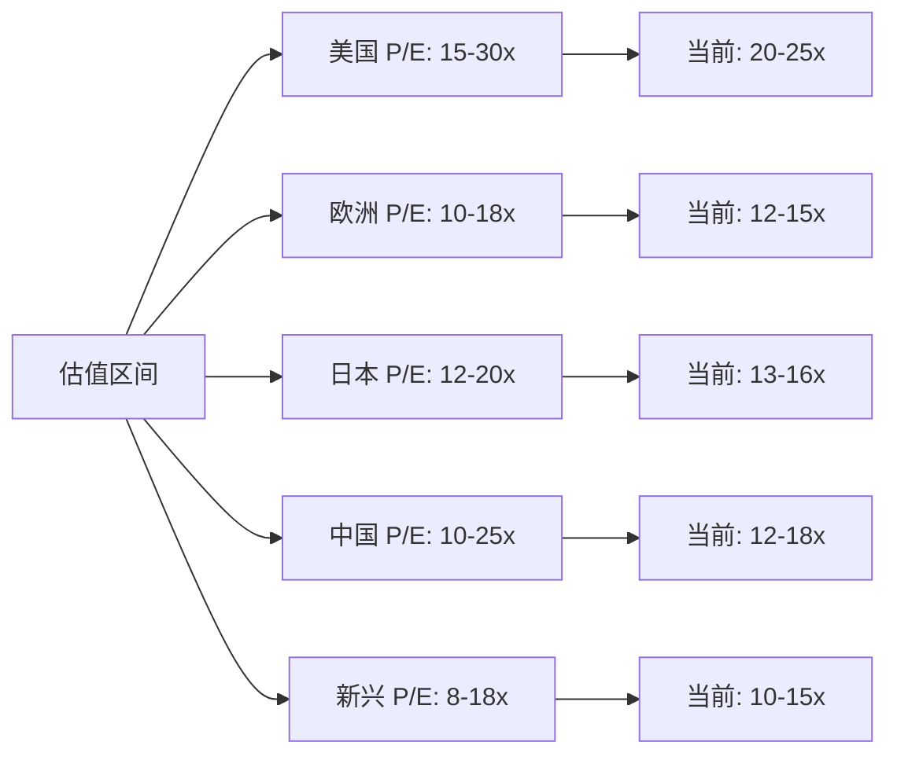

# 全球市场对比分析

## 概述

全球资本市场呈现出多样化的特征，不同市场在规模、结构、估值、监管和投资机会方面存在显著差异。理解这些差异对于构建全球投资组合、进行跨境投资和风险管理至关重要。本文将系统对比美国、欧洲、日本、中国和新兴市场的关键特征，为投资者提供全面的市场认知框架。

**学习目标**：
1. 掌握全球主要市场的规模和结构差异
2. 理解不同市场的估值水平和驱动因素
3. 认识各市场的监管环境和投资者保护
4. 学会进行跨市场比较和配置决策
5. 了解全球市场的相互关联和影响

## 市场规模与结构对比

### 市场规模对比矩阵

| 市场 | 股票市值（万亿美元） | 占全球比例 | 上市公司数量 | 主要指数 | 日均交易量（亿美元） |
|------|---------------------|-----------|-------------|---------|-------------------|
| **美国** | 50 | 42% | 5,000+ | S&P 500, Nasdaq | 5,000+ |
| **中国** | 15 | 12% | 5,000+ | 沪深300, 恒生 | 2,000+ |
| **日本** | 6 | 5% | 3,800+ | 日经225, TOPIX | 300+ |
| **欧洲** | 20 | 17% | 8,000+ | STOXX 600 | 1,000+ |
| **新兴市场** | 6 | 5% | 10,000+ | MSCI EM | 500+ |
| **其他发达** | 8 | 7% | 5,000+ | - | 400+ |
| **全球总计** | ~120 | 100% | 40,000+ | MSCI ACWI | 10,000+ |

### 市场结构特征

**美国市场**：
- 高度集中：前 10 大公司占市值 30%
- 科技主导：科技股占比 30%+
- 机构主导：机构持股 70%+
- 流动性最佳：全球最活跃
- 创新能力：IPO 和创新企业集中地

**欧洲市场**：
- 分散化：多个国家市场
- 行业均衡：无单一行业主导
- 价值导向：传统行业占比高
- 家族企业：德国、意大利常见
- 高股息：分红率普遍较高

**日本市场**：
- 制造业强：汽车、电子、机械
- 低估值：长期 P/B < 1
- 交叉持股：企业间相互持股
- 现金富余：企业现金储备高
- 改革中：公司治理改善

**中国市场**：
- 双市场：A股和港股
- 国企主导：国有企业占比高
- 散户为主：A股散户占比 80%+
- 政策敏感：政策影响大
- 快速增长：新经济企业崛起

**新兴市场**：
- 高度分散：24 个国家
- 资源导向：能源、材料占比高
- 波动性大：政治经济不确定性
- 外资主导：外资占比高
- 增长潜力：经济增速快

## 估值水平对比

### 估值指标对比矩阵

| 市场 | P/E 比率 | P/B 比率 | 股息率 | ROE | 市盈率增长比（PEG） |
|------|---------|---------|-------|-----|-------------------|
| **美国** | 20-25x | 4.0-4.5x | 1.5-2.0% | 15-18% | 1.5-2.0 |
| **欧洲** | 12-15x | 1.5-2.0x | 3.0-4.0% | 10-12% | 1.0-1.5 |
| **日本** | 13-16x | 1.0-1.2x | 2.0-2.5% | 8-10% | 1.5-2.0 |
| **中国** | 12-18x | 1.2-1.8x | 2.0-3.0% | 10-12% | 0.8-1.2 |
| **新兴市场** | 10-15x | 1.5-2.0x | 2.5-3.5% | 12-15% | 0.8-1.2 |

### 估值差异分析

**美国高估值原因**：
- 盈利能力：ROE 最高
- 增长质量：科技创新驱动
- 流动性溢价：全球资金流入
- 美元资产：避险属性
- 制度优势：法治、产权保护

**欧洲估值折价原因**：
- 增长缓慢：经济停滞
- 结构问题：老龄化、债务
- 政治风险：欧盟整合困难
- 监管严格：限制企业灵活性
- 但：高股息补偿

**日本估值折价原因**：
- 低增长：失去的三十年
- 低 ROE：资本效率低
- 公司治理：交叉持股、现金囤积
- 人口老龄化：长期悲观
- 改善中：治理改革推动估值修复

**中国估值特征**：
- 双重折价：A股溢价、港股折价
- 政策风险：监管不确定性
- 信息不对称：透明度问题
- 但：增长潜力大
- 结构分化：新经济 vs 传统经济

**新兴市场估值**：
- 风险溢价：政治经济不确定性
- 流动性折价：交易成本高
- 但：增长补偿
- 分化明显：国家和行业差异大

### 历史估值区间

## 行业结构对比

### 行业权重对比矩阵

| 行业 | 美国 | 欧洲 | 日本 | 中国 | 新兴市场 |
|------|------|------|------|------|---------|
| **科技** | 30% | 10% | 15% | 20% | 15% |
| **金融** | 12% | 18% | 15% | 25% | 25% |
| **医疗** | 13% | 12% | 8% | 5% | 3% |
| **消费** | 15% | 15% | 20% | 15% | 10% |
| **工业** | 8% | 15% | 20% | 10% | 8% |
| **能源** | 4% | 5% | 3% | 5% | 12% |
| **材料** | 3% | 8% | 8% | 8% | 10% |
| **公用事业** | 3% | 5% | 5% | 5% | 5% |
| **房地产** | 3% | 4% | 3% | 5% | 5% |
| **通信** | 9% | 8% | 3% | 2% | 7% |

### 行业优势对比

**美国优势行业**：
- 科技：FAANG、半导体、软件
- 医疗：创新药、生物技术
- 消费：品牌、零售、服务
- 金融：投资银行、资产管理

**欧洲优势行业**：
- 奢侈品：LVMH、Hermès、Richemont
- 制药：Roche、Novartis、Sanofi
- 工业：Siemens、ABB、Airbus
- 汽车：Volkswagen、BMW、Mercedes

**日本优势行业**：
- 汽车：丰田、本田、日产
- 电子：索尼、村田、京瓷
- 工业机器人：发那科、安川
- 精密仪器：Keyence、奥林巴斯

**中国优势行业**：
- 互联网：腾讯、阿里、美团
- 新能源：宁德时代、比亚迪
- 消费：茅台、伊利、美的
- 基础设施：建筑、工程

**新兴市场优势**：
- 资源：石油、矿产、农业
- 金融：银行业增长
- 消费：中产阶级扩大
- 制造：产业链转移

## 监管环境对比

### 监管框架对比矩阵

| 维度 | 美国 | 欧洲 | 日本 | 中国 | 新兴市场 |
|------|------|------|------|------|---------|
| **监管机构** | SEC | ESMA + 各国 | FSA | 证监会 | 各国不同 |
| **上市要求** | 严格 | 严格 | 严格 | 中等 | 宽松-中等 |
| **信息披露** | 非常严格 | 严格 | 严格 | 中等 | 宽松-中等 |
| **投资者保护** | 强 | 强 | 强 | 中等 | 弱-中等 |
| **执法力度** | 强 | 中-强 | 中-强 | 中等 | 弱-中等 |
| **外资准入** | 开放 | 开放 | 开放 | 限制放宽 | 部分限制 |
| **资本管制** | 无 | 无 | 无 | 有 | 部分有 |
| **税收** | 中等 | 较高 | 中等 | 中等 | 差异大 |

### 监管特点详解

**美国监管**：
- SEC：权力大、执法严
- 萨班斯法案：财务披露严格
- 集体诉讼：投资者保护强
- 内幕交易：严厉打击
- 但：诉讼成本高

**欧洲监管**：
- MiFID II：统一监管框架
- GDPR：数据保护严格
- 反垄断：对科技巨头严格
- ESG：可持续发展要求高
- 但：各国差异仍存在

**日本监管**：
- 金融厅：监管完善
- 公司治理：改革推进中
- 信息披露：逐步加强
- 投资者保护：不断完善
- 但：执法相对温和

**中国监管**：
- 证监会：集中监管
- 注册制：改革推进
- 退市制度：逐步完善
- 投资者保护：加强中
- 但：政策变化快、不确定性高

**新兴市场监管**：
- 差异大：各国水平不同
- 逐步完善：向国际标准靠拢
- 执法弱：腐败和效率问题
- 投资者保护：普遍不足
- 但：改革方向正确

## 投资者结构对比

### 投资者类型占比

| 投资者类型 | 美国 | 欧洲 | 日本 | 中国 | 新兴市场 |
|-----------|------|------|------|------|---------|
| **机构投资者** | 70% | 60% | 50% | 20% | 40% |
| **散户投资者** | 20% | 30% | 30% | 80% | 50% |
| **外资** | 15% | 30% | 30% | 5% | 30% |
| **政府/央行** | 5% | 5% | 20% | 10% | 10% |

### 投资者行为特征

**美国**：
- 机构主导：长期投资、价值发现
- 被动投资：指数基金占比高
- 401(k)：养老金入市
- 专业化：投资决策理性

**欧洲**：
- 机构为主：养老金、保险
- 家族办公室：财富传承
- 社会责任：ESG 重视
- 跨境投资：欧盟内部流动

**日本**：
- 央行持股：BOJ 购买 ETF
- 外资活跃：推动改革
- 散户减少：老龄化影响
- 长期持有：换手率低

**中国**：
- 散户主导：投机性强
- 换手率高：短期交易
- 政策敏感：追涨杀跌
- 逐步成熟：机构占比提升

**新兴市场**：
- 外资主导：国际资金
- 本地散户：投机性强
- 主权基金：部分国家
- 波动性大：情绪化交易

## 市场效率对比

### 效率指标对比

| 指标 | 美国 | 欧洲 | 日本 | 中国 | 新兴市场 |
|------|------|------|------|------|---------|
| **信息效率** | 高 | 高 | 高 | 中 | 低-中 |
| **定价效率** | 高 | 高 | 中-高 | 中 | 低-中 |
| **流动性** | 非常高 | 高 | 高 | 中-高 | 中 |
| **交易成本** | 低 | 低-中 | 低 | 中 | 中-高 |
| **市场深度** | 深 | 深 | 深 | 中 | 浅-中 |
| **波动性** | 中 | 中 | 中 | 高 | 高 |

### 市场异象

**美国市场**：
- 动量效应：趋势延续
- 规模效应：小盘股溢价
- 价值效应：价值股长期跑赢
- 但：效率最高，异象最弱

**欧洲市场**：
- 价值陷阱：低估值不一定好
- 国家效应：国别差异大
- 家族折价：家族控制折价
- 股息溢价：高股息受青睐

**日本市场**：
- P/B 效应：低 P/B 修复机会
- 现金折价：现金富余折价
- 治理溢价：改革受益
- 外资效应：外资推动上涨

**中国市场**：
- 政策效应：政策驱动明显
- 壳价值：借壳上市
- 题材炒作：概念股暴涨暴跌
- A-H 溢价：同股不同价

**新兴市场**：
- 国家风险溢价：政治经济风险
- 流动性溢价：小盘股折价
- 外资效应：外资流入推动
- 货币效应：汇率影响大

## 相关性与分散化

### 市场相关性矩阵

|  | 美国 | 欧洲 | 日本 | 中国 | 新兴市场 |
|---|------|------|------|------|---------|
| **美国** | 1.00 | 0.75 | 0.60 | 0.45 | 0.65 |
| **欧洲** | 0.75 | 1.00 | 0.65 | 0.40 | 0.70 |
| **日本** | 0.60 | 0.65 | 1.00 | 0.50 | 0.60 |
| **中国** | 0.45 | 0.40 | 0.50 | 1.00 | 0.55 |
| **新兴** | 0.65 | 0.70 | 0.60 | 0.55 | 1.00 |

### 分散化效益

**相关性分析**：
- 发达市场：相关性高（0.6-0.8）
- 中国独特：相关性相对较低
- 新兴市场：与发达市场中度相关
- 危机时：相关性上升（趋向 1）

**分散化策略**：
- 全球配置：降低组合波动
- 区域轮动：捕捉相对价值
- 低相关资产：中国、新兴市场
- 动态调整：根据相关性变化

**最优配置**：
- 美国：40-50%（核心）
- 欧洲：15-20%（价值、股息）
- 日本：5-10%（价值修复）
- 中国：10-15%（增长）
- 新兴市场：10-15%（分散、增长）

## 风险收益特征对比

### 历史表现对比（过去 20 年）

| 市场 | 年化回报 | 年化波动率 | 夏普比率 | 最大回撤 |
|------|---------|-----------|---------|---------|
| **美国** | 10% | 15% | 0.50 | -55% (2008) |
| **欧洲** | 6% | 18% | 0.22 | -60% (2008) |
| **日本** | 5% | 20% | 0.15 | -60% (2008) |
| **中国** | 8% | 30% | 0.20 | -70% (2008, 2015) |
| **新兴市场** | 7% | 25% | 0.20 | -65% (2008) |

### 风险特征

**美国市场**：
- 风险：估值高、政治极化
- 优势：流动性好、制度稳定
- 波动：中等
- 危机：系统性风险源头

**欧洲市场**：
- 风险：增长慢、债务高、政治风险
- 优势：估值低、股息高
- 波动：中-高
- 危机：主权债务、银行业

**日本市场**：
- 风险：老龄化、债务高、增长慢
- 优势：估值低、改革推进
- 波动：中-高
- 危机：自然灾害、核事故

**中国市场**：
- 风险：政策不确定、监管变化、地缘政治
- 优势：增长快、市场大
- 波动：高
- 危机：政策冲击、房地产

**新兴市场**：
- 风险：政治、货币、债务
- 优势：增长快、估值低
- 波动：高
- 危机：货币危机、政治动荡

## 投资策略建议

### 全球配置框架

**保守型组合**：
- 美国：50%（大盘价值）
- 欧洲：25%（高股息）
- 日本：15%（价值修复）
- 其他：10%（债券、黄金）
- 目标：稳定收益、低波动

**平衡型组合**：
- 美国：40%（大盘成长+价值）
- 欧洲：20%（价值+成长）
- 日本：10%（价值修复）
- 中国：15%（新经济）
- 新兴市场：15%（分散）
- 目标：平衡风险收益

**进取型组合**：
- 美国：30%（科技成长）
- 中国：25%（新经济）
- 新兴市场：20%（高增长）
- 欧洲：15%（价值）
- 日本：10%（小盘价值）
- 目标：高回报、承受高波动

### 战术配置策略

**周期轮动**：
- 复苏期：新兴市场、日本
- 繁荣期：美国科技、中国消费
- 衰退期：欧洲防御、美国大盘
- 萧条期：美国国债、黄金

**估值驱动**：
- 低估值：欧洲、日本
- 合理估值：中国
- 高估值：美国科技
- 策略：低估买入、高估减持

**主题投资**：
- 科技创新：美国、中国
- 老龄化：日本、欧洲（医疗）
- 消费升级：中国、新兴市场
- 能源转型：欧洲、中国

### 风险管理

**分散投资**：
- 地域分散：覆盖多个市场
- 行业分散：不同行业配置
- 风格分散：价值+成长
- 时间分散：定期投资

**对冲策略**：
- 货币对冲：外汇期货/期权
- 市场对冲：做空指数
- 波动率对冲：买入看跌期权
- 资产对冲：黄金、债券

**动态调整**：
- 再平衡：定期或阈值触发
- 估值纪律：高估减持、低估增持
- 风险监控：VaR、压力测试
- 灵活应对：根据市场变化

## 未来趋势展望

### 市场格局变化

**美国**：
- 科技主导：持续但面临监管
- 估值压力：利率上升影响
- 创新能力：仍是全球领先
- 地位：相对下降但仍主导

**欧洲**：
- 估值修复：治理改善、股东回报
- 绿色转型：可再生能源机会
- 整合挑战：财政联盟困难
- 地位：相对稳定

**日本**：
- 治理改革：估值修复空间
- 通胀回归：名义增长恢复
- 老龄化：长期挑战
- 地位：小幅提升

**中国**：
- 新经济：科技、消费崛起
- 监管常态化：不确定性降低
- 开放加速：资本市场改革
- 地位：占比提升

**新兴市场**：
- 分化加剧：赢家和输家
- 制造业：产业链转移受益
- 债务风险：部分国家
- 地位：整体提升

### 投资机会

**结构性机会**：
- 科技创新：AI、半导体、云计算
- 能源转型：可再生能源、电动车
- 人口老龄化：医疗、养老
- 消费升级：新兴市场中产阶级

**周期性机会**：
- 估值修复：欧洲、日本
- 政策刺激：中国、新兴市场
- 利率周期：金融股
- 大宗商品：超级周期

## 实战工具

### 数据来源

**市场数据**：
- Bloomberg、Reuters
- MSCI、FTSE、S&P
- 各交易所官网
- Wind、东方财富（中国）

**研究报告**：
- 投资银行：Goldman Sachs、Morgan Stanley、JPMorgan
- 资产管理：BlackRock、Vanguard、Fidelity
- 独立研究：Morningstar、FactSet

**宏观数据**：
- IMF、World Bank
- OECD、BIS
- 各国央行和统计局

### 投资工具

**全球配置 ETF**：
- Vanguard Total World Stock (VT)
- iShares MSCI ACWI (ACWI)
- SPDR Portfolio World (SPGM)

**区域 ETF**：
- 美国：SPY、QQQ、IWM
- 欧洲：VGK、EZU、FEZ
- 日本：EWJ、DXJ、DBJP
- 中国：MCHI、FXI、KWEB
- 新兴：EEM、VWO、IEMG

**行业 ETF**：
- 全球科技、医疗、金融等

## 延伸阅读

### 推荐书籍

1. **《全球投资》** - Roger Ibbotson
2. **《国际投资组合管理》** - Bruno Solnik
3. **《全球市场分析》** - Gary Brinson
4. **《跨境投资策略》** - Aswath Damodaran
5. **《全球资产配置》** - Meb Faber

### 研究资源

**学术研究**：
- Journal of International Money and Finance
- Journal of Portfolio Management
- Financial Analysts Journal

**行业报告**：
- MSCI Global Market Reports
- FTSE Russell Market Analysis
- S&P Global Market Intelligence

## 参考文献

1. MSCI. (2023). "Global Market Size Report"
2. World Federation of Exchanges. (2023). "Market Statistics"
3. IMF. (2023). "Global Financial Stability Report"
4. BIS. (2023). "International Banking and Financial Market Developments"
5. Goldman Sachs. (2023). "Global Investment Research"
6. Morgan Stanley. (2023). "Global Strategy"
7. JPMorgan. (2023). "Global Markets Outlook"
8. BlackRock. (2023). "Global Investment Outlook"
9. Vanguard. (2023). "Global Economic and Market Outlook"
10. Fidelity. (2023). "Global Market Analysis"
11. OECD. (2023). "Economic Outlook"
12. World Bank. (2023). "Global Economic Prospects"
13. McKinsey. (2023). "Global Capital Markets"
14. BCG. (2023). "Global Asset Management"
15. Deloitte. (2023). "Global Investment Management Outlook"

## 深度分析

### 核心机制解析

理解本主题需要从多个维度进行系统性分析。以下从理论基础、实践应用和历史验证三个层面展开深度探讨。

**理论基础层面**：本主题的核心逻辑建立在经济学和金融学的基本原理之上。通过对基础理论的深入理解，投资者能够建立起稳固的分析框架，避免被市场短期噪音所干扰。

**实践应用层面**：理论必须与实践相结合才能产生价值。在实际投资决策中，需要将抽象的概念转化为具体的分析工具和决策标准。

**历史验证层面**：金融市场有着丰富的历史记录，通过研究历史案例，我们可以验证理论的有效性，并从中提炼出具有普遍意义的规律。

### 关键影响因素

影响本主题的关键因素可以从以下几个维度进行分析：

1. **宏观经济环境**：利率水平、通货膨胀率、经济增长速度等宏观变量对本主题有着深远影响。在不同的宏观经济周期中，相关指标的表现会呈现出显著差异。

2. **市场结构因素**：市场参与者的构成、信息传播机制、流动性状况等市场结构因素决定了价格发现的效率和准确性。

3. **政策监管环境**：政府政策、监管框架的变化会直接影响相关市场的运作规则和参与者行为。

4. **技术创新驱动**：技术进步不断改变着金融市场的运作方式，从算法交易到区块链技术，每一次技术革新都带来新的机遇和挑战。

5. **全球化与地缘政治**：在全球化背景下，各国市场之间的联动性日益增强，地缘政治风险的影响也越来越不可忽视。

### 量化分析框架

为了更精确地分析和评估，可以采用以下量化框架：

| 分析维度 | 关键指标 | 参考基准 | 分析方法 |
|---------|---------|---------|---------|
| 规模评估 | 绝对值与相对值 | 历史均值 | 趋势分析 |
| 质量评估 | 稳定性指标 | 行业对标 | 横向比较 |
| 风险评估 | 波动率指标 | 风险阈值 | 情景分析 |
| 价值评估 | 估值倍数 | 历史区间 | 回归分析 |

通过系统性地应用上述框架，投资者可以对目标进行全面、客观的评估，从而做出更加理性的投资决策。

## 高级分析与前沿研究

### 学术研究进展

近年来，学术界对本领域的研究取得了重要进展。以下是几个值得关注的研究方向：

**行为金融学视角**：传统金融理论假设市场参与者是完全理性的，但行为金融学的研究表明，认知偏差和情绪因素在投资决策中扮演着重要角色。诺贝尔经济学奖得主丹尼尔·卡尼曼（Daniel Kahneman）和理查德·塞勒（Richard Thaler）的研究为我们理解市场非理性行为提供了重要框架。

**因子投资研究**：尤金·法玛（Eugene Fama）和肯尼斯·弗伦奇（Kenneth French）的三因子模型，以及后续发展的五因子模型，为系统性地解释股票收益差异提供了理论基础。这些研究表明，市值、账面市值比、盈利能力和投资模式等因子能够解释大部分股票收益的横截面差异。

**市场微观结构研究**：对市场流动性、价格发现机制和交易成本的深入研究，帮助我们更好地理解市场的运作机制，并为优化交易策略提供指导。

### 实战案例深度解析

**案例一：长期价值创造的典范**

以沃伦·巴菲特（Warren Buffett）的伯克希尔·哈撒韦（Berkshire Hathaway）为例，其长达数十年的卓越投资业绩证明了价值投资理念的有效性。从1965年至今，伯克希尔的账面价值年均增长率约为19.8%，远超同期标普500指数的约10.2%年均回报。

巴菲特的成功秘诀在于：
- 专注于具有持久竞争优势的优质企业
- 以合理价格买入，而非追求最低价格
- 长期持有，让复利效应充分发挥
- 保持充足的安全边际，控制下行风险

**案例二：危机中的机遇识别**

2008年金融危机期间，大多数投资者恐慌性抛售，但少数具有前瞻性的投资者却在危机中发现了历史性的投资机会。约翰·保尔森（John Paulson）通过做空次级抵押贷款相关证券，在危机中获得了约150亿美元的利润，成为金融史上最成功的单笔交易之一。

这个案例告诉我们：
- 深入的基本面研究能够发现市场定价错误
- 逆向思维往往能够发现被市场忽视的机会
- 风险管理和仓位控制是成功的关键

### 跨市场比较分析

不同市场在结构、监管、投资者构成等方面存在显著差异，这些差异对投资策略的选择有重要影响：

**美国市场特征**：
- 机构投资者主导，市场效率较高
- 信息披露制度完善，分析师覆盖广泛
- 衍生品市场发达，对冲工具丰富
- 长期牛市历史，但也经历过多次重大调整

**中国市场特征**：
- 散户投资者比例较高，市场波动性较大
- 政策因素影响显著，需要密切关注监管动向
- 新兴行业发展迅速，成长投资机会丰富
- A股、港股、美股中概股形成多层次市场体系

**欧洲市场特征**：
- 价值股比例较高，估值相对保守
- 受地缘政治和欧元区政策影响较大
- 部分行业（如奢侈品、工业）具有全球竞争优势
- ESG投资理念推广较为领先

