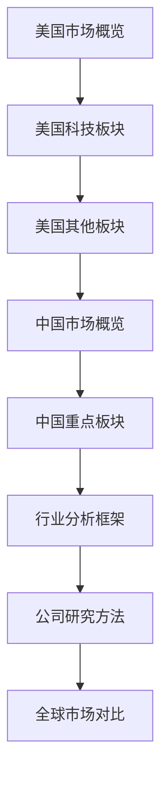

# 第五阶段：全球投资视角

## 阶段概述

本阶段将带你走向全球，深入研究美国和中国两大市场，了解全球其他重要市场，掌握行业分析方法，研究 100+ 家优秀公司。这是将理论转化为实践的关键阶段，你将建立起全球投资视野和具体的公司研究能力。

**学习时长**：3 个月（90 天）  
**每日投入**：2 小时  
**难度级别**：中级到高级

## 学习目标

完成本阶段学习后，你将能够：

1. 深入了解美国市场的主要板块和 50+ 家优秀公司
2. 理解中国市场的特点和 50+ 家领先企业
3. 掌握行业分析的框架和方法
4. 建立跨市场投资的能力
5. 形成公司研究的系统方法

## 核心子模块

### 1. [美国市场](us-market/index.html)
**学习时间**：5 周 | **文件数**：50+ 个

深度研究美国市场：
- 市场概览与结构
- 科技板块（FAANG+、半导体、软件、云计算）
- 消费板块（可选消费、必需消费、奢侈品）
- 医疗保健（制药、生物技术、医疗器械）
- 金融板块（银行、支付、保险）
- 工业与能源
- 通信与房地产

**重点公司**：Apple、Microsoft、Google、Amazon、Meta、NVIDIA、Tesla、Berkshire Hathaway 等

**为什么重要**：美国市场是全球最成熟的资本市场，拥有最多的优秀公司。

---

### 2. [中国市场](china-market/index.html)
**学习时间**：4 周 | **文件数**：40+ 个

深入了解中国市场：
- A 股市场指南
- 消费板块（白酒、食品饮料、零售、家电）
- 科技板块（互联网、半导体、AI）
- 新能源板块（动力电池、新能源车）
- 医疗保健
- 金融板块

**重点公司**：贵州茅台、腾讯、宁德时代、美的、阿里巴巴、比亚迪等

**为什么重要**：中国是全球第二大经济体，拥有独特的投资机会。

---

### 3. [全球其他市场](global-markets/index.html)
**学习时间**：1 周 | **文件数**：5 个

了解其他重要市场：
- 欧洲市场
- 日本市场
- 新兴市场
- 市场对比分析
- 跨境投资策略

---

### 4. [行业分析](industry-analysis/index.html)
**学习时间**：3 周 | **文件数**：30+ 个

掌握行业分析方法：
- 科技行业（AI、半导体、云计算、网络安全、金融科技、SaaS）
- 消费行业（电商、食品饮料、奢侈品、零售）
- 医疗保健（制药、生物技术、医疗器械）
- 金融行业（银行、保险、资管、支付）
- 能源与工业
- 新兴行业（电动车、自动驾驶、区块链、太空经济）

**为什么重要**：行业分析是自上而下投资的关键环节。

---

### 5. [公司研究方法论](company-research/index.html)
**学习时间**：1 周 | **文件数**：5 个

建立系统的公司研究方法：
- 研究框架
- 尽职调查
- 管理层分析
- 竞争定位
- 投资论点构建

## 推荐学习顺序

## 学习计划建议

### 第 1-5 周：美国市场深度研究
- 第 1 周：市场概览 + 科技板块总览
- 第 2 周：FAANG 深度研究
- 第 3 周：半导体、软件、云计算
- 第 4 周：消费、医疗板块
- 第 5 周：金融、工业、能源板块

### 第 6-9 周：中国市场深度研究
- 第 6 周：市场概览 + 消费板块
- 第 7 周：科技板块（互联网巨头）
- 第 8 周：新能源板块
- 第 9 周：医疗、金融板块

### 第 10-12 周：行业分析与综合
- 第 10 周：行业分析框架学习
- 第 11 周：重点行业深度研究
- 第 12 周：公司研究方法论 + 全球市场对比

## 关键资源

### 数据来源
- **美国**：SEC EDGAR、Yahoo Finance、Bloomberg
- **中国**：巨潮资讯网、东方财富、Wind
- **全球**：Financial Times、The Economist

### 研究报告
- 券商研究报告
- 投行分析报告
- 独立研究机构

## 学习检查点

- [ ] 深入研究了至少 20 家美国公司
- [ ] 深入研究了至少 20 家中国公司
- [ ] 完成了至少 10 个行业的分析
- [ ] 能够独立撰写公司研究报告
- [ ] 建立了自己的公司研究数据库

## 下一步行动

完成本阶段后，进入 [第六阶段：宏观框架](../06-macro-framework/index.html)，建立顶级的宏观分析能力。

---

[← 上一阶段：投资体系](../04-investment-system/index.html) | [返回总览](../index.html) | [下一阶段：宏观框架 →](../06-macro-framework/index.html)
