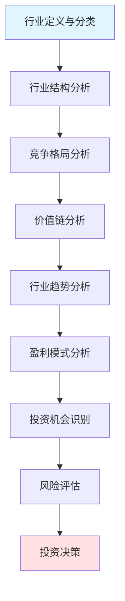
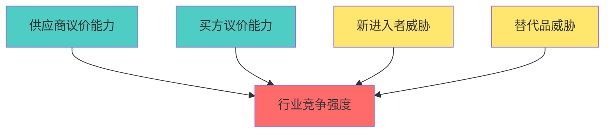
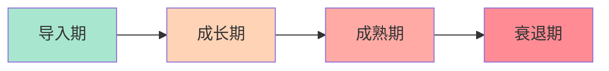
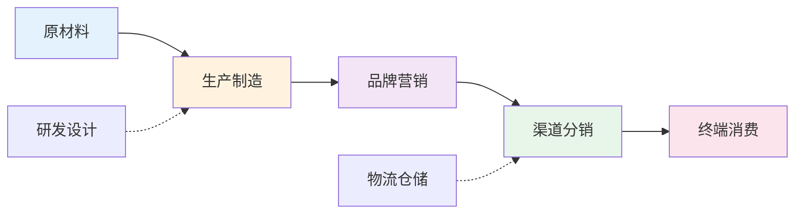

# 行业分析总览

## 概述

行业分析是投资决策的关键环节，介于宏观经济分析和公司分析之间。深入理解行业结构、竞争格局、发展趋势和盈利模式，能够帮助投资者：

- 识别具有长期增长潜力的行业
- 理解行业内公司的竞争地位
- 评估行业周期和投资时机
- 发现结构性投资机会
- 规避行业性风险

本文提供系统化的行业分析框架，涵盖分析维度、工具方法和实践应用。

**学习目标**：
1. 掌握完整的行业分析框架和方法论
2. 理解不同行业的特征和分析重点
3. 学会使用波特五力、价值链等分析工具
4. 识别行业投资机会和风险
5. 建立行业研究的系统方法

## 行业分析框架

### 完整分析流程

### 六大分析维度

#### 1. 行业结构维度

**关键要素**：
- 行业规模与增长率
- 市场集中度（CR4, HHI指数）
- 进入壁垒与退出壁垒
- 产品差异化程度
- 规模经济效应

**分析工具**：
- 波特五力模型
- 行业生命周期分析
- SCP范式（结构-行为-绩效）

#### 2. 竞争格局维度

**关键要素**：
- 主要竞争者识别
- 市场份额分布
- 竞争策略类型
- 竞争强度评估
- 潜在进入者威胁

**分析工具**：
- 竞争者矩阵
- 战略群组分析
- 市场地位图

#### 3. 价值链维度

**关键要素**：
- 上游供应商分析
- 中游生产环节
- 下游渠道与客户
- 价值分配机制
- 议价能力对比

**分析工具**：
- 价值链分析
- 产业链图谱
- 利润池分析

#### 4. 技术与创新维度

**关键要素**：
- 技术发展趋势
- 创新周期与速度
- 研发投入水平
- 技术壁垒高度
- 颠覆性技术威胁

**分析工具**：
- 技术成熟度曲线
- 创新扩散模型
- 技术路线图

#### 5. 监管与政策维度

**关键要素**：
- 监管框架与强度
- 政策支持力度
- 合规成本
- 政策变化风险
- 国际贸易政策

**分析工具**：
- PEST分析
- 政策影响矩阵
- 监管风险评估

#### 6. 财务与估值维度

**关键要素**：
- 行业平均盈利能力
- 资本密集度
- 现金流特征
- 估值水平与趋势
- 投资回报率

**分析工具**：
- 杜邦分析
- 行业财务比率对比
- 相对估值分析

## 波特五力模型详解

### 模型框架

### 五力详细分析

#### 力量1：现有竞争者的竞争强度

**高竞争强度的特征**：
- 竞争者数量众多且实力相当
- 行业增长缓慢
- 固定成本高，退出壁垒高
- 产品同质化严重
- 产能过剩

**低竞争强度的特征**：
- 市场集中度高，寡头垄断
- 行业快速增长
- 产品差异化明显
- 品牌忠诚度高
- 供需平衡

**投资启示**：
- 低竞争强度行业通常有更好的盈利能力
- 关注行业整合机会
- 警惕价格战风险

#### 力量2：供应商的议价能力

**高议价能力的特征**：
- 供应商集中度高
- 转换成本高
- 无替代品
- 前向整合威胁
- 产品差异化

**低议价能力的特征**：
- 供应商分散
- 标准化产品
- 多个替代来源
- 买方重要性高

**投资启示**：
- 评估公司对供应商的依赖度
- 关注原材料价格波动风险
- 寻找具有供应链控制力的公司

#### 力量3：买方的议价能力

**高议价能力的特征**：
- 买方集中度高
- 产品标准化
- 转换成本低
- 后向整合威胁
- 价格敏感度高

**低议价能力的特征**：
- 买方分散
- 产品差异化
- 品牌忠诚度高
- 转换成本高

**投资启示**：
- 评估公司的定价权
- 关注客户集中度风险
- 寻找具有品牌护城河的公司

#### 力量4：新进入者的威胁

**高进入壁垒的来源**：
- 规模经济要求
- 资本密集度高
- 技术专利保护
- 品牌忠诚度
- 渠道控制
- 政府监管
- 网络效应

**低进入壁垒的特征**：
- 资本要求低
- 技术门槛低
- 无品牌优势
- 渠道开放

**投资启示**：
- 高壁垒行业更具投资价值
- 关注新技术带来的颠覆风险
- 评估现有企业的护城河

#### 力量5：替代品的威胁

**高替代威胁的特征**：
- 替代品性价比高
- 转换成本低
- 技术进步快
- 消费习惯改变

**低替代威胁的特征**：
- 无直接替代品
- 转换成本高
- 产品独特性强
- 客户粘性高

**投资启示**：
- 评估技术变革风险
- 关注消费趋势变化
- 寻找难以替代的产品/服务

## 行业生命周期分析

### 四阶段模型

### 各阶段特征与投资策略

#### 导入期
**特征**：
- 市场规模小
- 增长不确定
- 技术不成熟
- 亏损普遍
- 竞争者少

**投资策略**：
- 高风险高回报
- 关注技术领先者
- 小仓位试探
- 长期视角

#### 成长期
**特征**：
- 快速增长
- 需求旺盛
- 新进入者增多
- 开始盈利
- 市场份额争夺

**投资策略**：
- 最佳投资时期
- 选择行业龙头
- 关注规模扩张
- 成长股投资

#### 成熟期
**特征**：
- 增长放缓
- 市场饱和
- 竞争稳定
- 盈利稳定
- 现金流充沛

**投资策略**：
- 价值投资机会
- 关注分红能力
- 评估护城河
- 防御性配置

#### 衰退期
**特征**：
- 需求下降
- 产能过剩
- 价格战
- 企业退出
- 行业整合

**投资策略**：
- 谨慎投资
- 关注转型机会
- 避免价值陷阱
- 及时止损

## 价值链分析方法

### 价值链结构

### 价值分配分析

**关键问题**：
1. 价值链各环节的利润率如何？
2. 哪个环节掌握定价权？
3. 利润向哪个环节集中？
4. 价值链是否在重构？

**分析步骤**：
1. 绘制完整价值链图谱
2. 计算各环节利润率
3. 识别价值创造环节
4. 评估议价能力分布
5. 预测价值链演变

**投资启示**：
- 投资价值链中利润率最高的环节
- 关注掌握核心技术/品牌的企业
- 警惕被上下游挤压的环节
- 寻找价值链重构的机会

## 行业分析工具箱

### 定量分析工具

#### 1. 市场集中度指标

**CR4（四企业集中度）**：
- CR4 < 30%：竞争型市场
- 30% ≤ CR4 < 50%：低寡占型
- 50% ≤ CR4 < 70%：高寡占型
- CR4 ≥ 70%：垄断型

**HHI（赫芬达尔指数）**：
- HHI < 1000：竞争充分
- 1000 ≤ HHI < 1800：适度集中
- HHI ≥ 1800：高度集中

#### 2. 行业财务指标

**盈利能力**：
- 行业平均ROE
- 行业平均净利率
- 行业平均毛利率

**资本效率**：
- 资产周转率
- 存货周转率
- 应收账款周转率

**财务健康**：
- 资产负债率
- 流动比率
- 利息覆盖倍数

#### 3. 估值指标

**相对估值**：
- 行业平均P/E
- 行业平均P/B
- 行业平均EV/EBITDA

**估值分位数**：
- 历史估值区间
- 当前估值位置
- 估值修复空间

### 定性分析工具

#### 1. SWOT分析
- Strengths（优势）
- Weaknesses（劣势）
- Opportunities（机会）
- Threats（威胁）

#### 2. PEST分析
- Political（政治）
- Economic（经济）
- Social（社会）
- Technological（技术）

#### 3. 战略群组分析
- 识别竞争群组
- 绘制战略地图
- 评估移动壁垒

## 不同行业的分析重点

### 科技行业

**关键分析点**：
- 技术创新能力
- 研发投入强度
- 产品迭代速度
- 平台生态系统
- 网络效应

**核心指标**：
- 研发费用率
- 用户增长率
- 活跃用户数
- 客户获取成本
- 客户生命周期价值

### 消费行业

**关键分析点**：
- 品牌力与定价权
- 渠道覆盖能力
- 消费者忠诚度
- 产品组合管理
- 供应链效率

**核心指标**：
- 品牌价值
- 市场份额
- 同店增长率
- 存货周转率
- 营销费用率

### 医疗保健行业

**关键分析点**：
- 研发管线质量
- 专利保护期
- 临床试验进展
- 监管审批风险
- 医保覆盖政策

**核心指标**：
- 研发成功率
- 新药上市数量
- 专利到期时间
- 毛利率水平
- 研发投入回报

### 金融行业

**关键分析点**：
- 资产质量
- 风险管理能力
- 资本充足率
- 盈利模式稳定性
- 监管合规

**核心指标**：
- 不良贷款率
- 拨备覆盖率
- 净息差
- 资本充足率
- ROE与ROA

### 能源与工业

**关键分析点**：
- 产能利用率
- 成本控制能力
- 大宗商品价格
- 周期性特征
- 环保合规

**核心指标**：
- 产能利用率
- 单位成本
- EBITDA利润率
- 资本支出
- 自由现金流

## 行业研究流程

### 标准研究步骤

#### 第一步：行业定义与范围
1. 明确行业边界
2. 识别子行业
3. 确定研究范围
4. 收集基础数据

#### 第二步：宏观环境分析
1. 经济周期位置
2. 政策环境评估
3. 技术趋势判断
4. 社会需求变化

#### 第三步：行业结构分析
1. 应用波特五力
2. 评估竞争强度
3. 识别关键成功因素
4. 分析进入壁垒

#### 第四步：竞争格局分析
1. 识别主要参与者
2. 计算市场集中度
3. 绘制竞争地图
4. 评估竞争优势

#### 第五步：价值链分析
1. 绘制价值链图谱
2. 分析利润分布
3. 识别关键环节
4. 评估议价能力

#### 第六步：财务与估值分析
1. 计算行业财务指标
2. 对比历史数据
3. 评估估值水平
4. 识别投资机会

#### 第七步：趋势与风险分析
1. 识别长期趋势
2. 评估颠覆风险
3. 分析政策风险
4. 预测行业前景

#### 第八步：投资建议
1. 总结投资逻辑
2. 推荐投资标的
3. 提出配置建议
4. 明确风险提示

## 行业分析常见误区

### 误区1：忽视行业生命周期
**问题**：用成长期的估值方法评估成熟期行业
**正确做法**：根据生命周期阶段选择合适的分析方法和估值模型

### 误区2：过度关注短期波动
**问题**：被季度数据波动影响判断
**正确做法**：关注长期结构性趋势，淡化短期噪音

### 误区3：线性外推历史趋势
**问题**：假设过去的增长率会持续
**正确做法**：考虑基数效应、竞争加剧、市场饱和等因素

### 误区4：忽视技术颠覆风险
**问题**：低估新技术对传统行业的冲击
**正确做法**：持续跟踪技术创新，评估颠覆可能性

### 误区5：孤立分析单一行业
**问题**：不考虑上下游和相关行业
**正确做法**：从产业链和生态系统角度综合分析

## 实战应用案例

### 案例1：智能手机行业分析（2010-2020）

**行业演变**：
- 2010-2015：高速成长期
- 2015-2018：成熟期
- 2018-2020：饱和期

**竞争格局变化**：
- 早期：百家争鸣
- 中期：寡头竞争（苹果、三星、华为）
- 后期：高度集中

**投资启示**：
- 成长期投资龙头企业获得最大回报
- 成熟期关注创新能力和生态系统
- 饱和期谨慎投资，关注5G等新周期

### 案例2：新能源汽车行业分析（2020-2024）

**行业特征**：
- 处于成长期早期
- 政策大力支持
- 技术快速进步
- 竞争格局未定

**关键成功因素**：
- 电池技术领先
- 智能化能力
- 品牌影响力
- 规模化生产

**投资机会**：
- 产业链上游（电池、材料）
- 技术领先的整车企业
- 充电基础设施

## 行业研究资源

### 数据来源

**官方统计**：
- 国家统计局
- 行业协会报告
- 上市公司年报
- 监管机构数据

**商业数据库**：
- Wind资讯
- Bloomberg
- FactSet
- S&P Capital IQ

**研究报告**：
- 券商研究报告
- 咨询公司报告
- 行业白皮书
- 学术研究

### 分析工具

**财务分析**：
- Excel财务模型
- Python数据分析
- Tableau可视化

**行业数据库**：
- 企查查
- 天眼查
- Crunchbase
- PitchBook

## 持续学习建议

### 建立行业知识库
1. 选择3-5个重点行业深入研究
2. 建立行业数据库和资料库
3. 定期更新行业动态
4. 撰写行业研究笔记

### 培养行业洞察力
1. 阅读行业经典书籍
2. 关注行业领军企业
3. 参加行业会议和论坛
4. 与行业专家交流

### 实践应用
1. 完成至少10个行业深度研究
2. 跟踪行业投资组合表现
3. 总结成功与失败经验
4. 不断优化分析框架

## 延伸阅读

### 必读书籍

1. **《竞争战略》** - 迈克尔·波特
   - 波特五力模型的经典著作
   - 行业分析的理论基础

2. **《竞争优势》** - 迈克尔·波特
   - 价值链分析方法
   - 竞争优势来源

3. **《创新者的窘境》** - 克莱顿·克里斯坦森
   - 颠覆性创新理论
   - 行业变革规律

4. **《蓝海战略》** - W·钱·金、勒妮·莫博涅
   - 价值创新方法
   - 行业重构思维

5. **《从优秀到卓越》** - 吉姆·柯林斯
   - 行业领导者特征
   - 长期成功因素

### 推荐报告

- 麦肯锡行业报告系列
- 波士顿咨询行业洞察
- 高盛行业研究报告
- 摩根士丹利行业分析

## 参考文献

1. Porter, M. E. (1980). *Competitive Strategy*. Free Press.
2. Porter, M. E. (1985). *Competitive Advantage*. Free Press.
3. Christensen, C. M. (1997). *The Innovator's Dilemma*. Harvard Business School Press.
4. Kim, W. C., & Mauborgne, R. (2005). *Blue Ocean Strategy*. Harvard Business School Press.
5. Collins, J. (2001). *Good to Great*. HarperBusiness.
6. Damodaran, A. (2012). *Investment Valuation*. Wiley Finance.
7. Grant, R. M. (2016). *Contemporary Strategy Analysis*. Wiley.
8. Besanko, D., et al. (2013). *Economics of Strategy*. Wiley.
9. Hill, C. W., & Jones, G. R. (2012). *Strategic Management Theory*. Cengage Learning.
10. Barney, J. B., & Hesterly, W. S. (2015). *Strategic Management and Competitive Advantage*. Pearson.

---

**下一步行动**：
1. 选择一个你感兴趣的行业开始深度研究
2. 应用本文的分析框架进行系统分析
3. 阅读该行业的3-5份研究报告
4. 撰写完整的行业分析报告
5. 识别该行业的投资机会

**相关主题**：
- [公司分析方法](../../03-company-analysis/index.html)
- [竞争分析框架](../../03-company-analysis/competitive-analysis/index.html)
- [估值方法](../../03-company-analysis/valuation-methods/index.html)
- [投资研究方法](../company-research/index.html)
