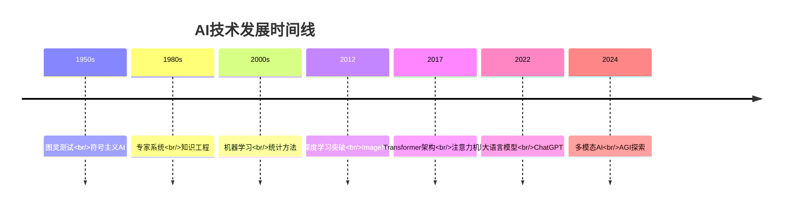
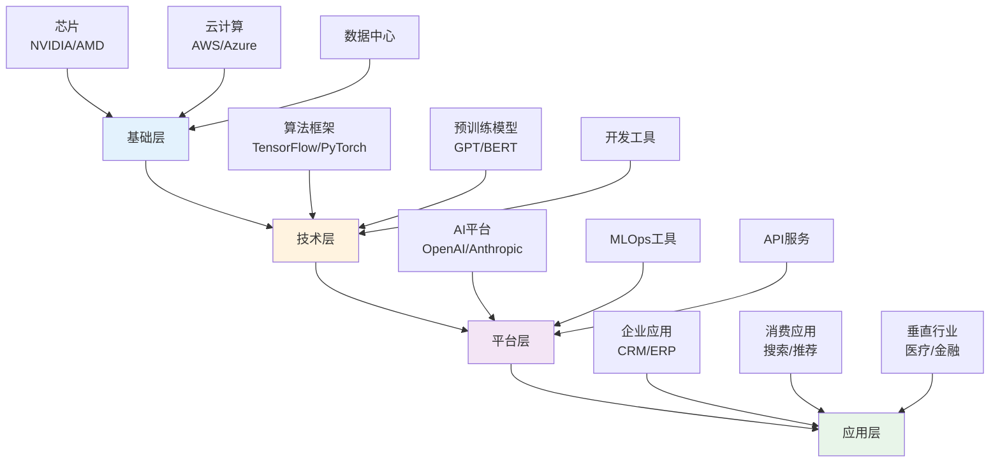

# AI 行业分析

## 概述

人工智能（AI）正在成为21世纪最具变革性的技术之一，从深度学习到大语言模型，从计算机视觉到自动驾驶，AI技术正在重塑几乎所有行业。对于投资者而言，理解AI行业的技术演进、商业模式和竞争格局，是把握这一历史性投资机会的关键。

**学习目标**：
1. 理解AI技术的发展历程和当前趋势
2. 掌握AI行业的价值链和商业模式
3. 分析主要AI公司的竞争优势
4. 识别AI行业的投资机会和风险
5. 评估AI技术对其他行业的影响

## AI技术演进

### 发展历程

### 三大技术浪潮

#### 第一波：符号AI（1950s-1980s）
- 基于规则和逻辑推理
- 专家系统的兴起
- 局限：知识获取瓶颈

#### 第二波：机器学习（1990s-2010s）
- 统计学习方法
- 支持向量机、随机森林
- 局限：特征工程依赖

#### 第三波：深度学习（2012-至今）
- 神经网络复兴
- 端到端学习
- 突破：计算力+数据+算法

#### 第四波：大模型时代（2020-至今）
- Transformer架构
- 预训练+微调范式
- 涌现能力
- 多模态融合

## AI行业价值链

### 完整产业链图谱

### 价值链各层分析

#### 基础层：算力基础设施
**关键参与者**：
- GPU制造：NVIDIA（90%市场份额）、AMD
- 云服务：AWS、Azure、Google Cloud
- 数据中心：Equinix、Digital Realty

**盈利模式**：
- 硬件销售
- 云服务订阅
- 数据中心租赁

**投资价值**：
- 高进入壁垒
- 强定价权
- 长期增长确定性

#### 技术层：AI框架与模型
**关键参与者**：
- 开源框架：Google（TensorFlow）、Meta（PyTorch）
- 模型开发：OpenAI、Anthropic、Google DeepMind
- 研究机构：大学实验室、企业研究院

**盈利模式**：
- API调用收费
- 企业授权
- 技术服务

**投资价值**：
- 技术壁垒高
- 先发优势明显
- 赢家通吃效应

#### 平台层：AI服务平台
**关键参与者**：
- 通用平台：OpenAI、Anthropic、Cohere
- 垂直平台：Hugging Face、Stability AI
- 企业平台：Databricks、Scale AI

**盈利模式**：
- SaaS订阅
- 按使用量计费
- 企业定制服务

**投资价值**：
- 高增长潜力
- 网络效应
- 客户粘性强

#### 应用层：AI应用
**关键参与者**：
- 办公协作：Microsoft Copilot、Notion AI
- 内容创作：Midjourney、Runway
- 代码辅助：GitHub Copilot、Cursor
- 客户服务：Intercom、Zendesk

**盈利模式**：
- 订阅收费
- 增值服务
- 广告收入

**投资价值**：
- 市场空间大
- 变现路径清晰
- 竞争激烈

## 市场规模与增长

### 全球AI市场规模

| 年份 | 市场规模（亿美元） | 同比增长 |
|------|-------------------|----------|
| 2020 | 500 | - |
| 2021 | 680 | 36% |
| 2022 | 950 | 40% |
| 2023 | 1,500 | 58% |
| 2024E | 2,200 | 47% |
| 2025E | 3,100 | 41% |
| 2030E | 15,000 | 37% CAGR |

### 细分市场分析

#### 1. 大语言模型市场
- 2024年规模：200亿美元
- 预计2030年：2000亿美元
- CAGR：48%

**主要应用**：
- 内容生成
- 代码辅助
- 客户服务
- 知识管理

#### 2. 计算机视觉市场
- 2024年规模：180亿美元
- 预计2030年：800亿美元
- CAGR：28%

**主要应用**：
- 自动驾驶
- 安防监控
- 医疗影像
- 工业检测

#### 3. 语音识别市场
- 2024年规模：120亿美元
- 预计2030年：450亿美元
- CAGR：25%

**主要应用**：
- 智能助手
- 语音翻译
- 会议转录
- 客服系统

## 竞争格局分析

### 全球AI领导者

#### 美国阵营
**OpenAI**：
- 优势：GPT系列领先、先发优势、微软支持
- 估值：900亿美元（2024）
- 收入：20亿美元（2024预计）
- 护城河：技术领先、品牌效应、数据飞轮

**Google DeepMind**：
- 优势：研究实力强、Gemini模型、搜索整合
- 母公司：Alphabet
- 护城河：计算资源、人才储备、数据优势

**Anthropic**：
- 优势：Claude模型、安全对齐、企业市场
- 估值：180亿美元
- 护城河：技术差异化、安全理念

**Meta AI**：
- 优势：Llama开源、社交数据、计算资源
- 策略：开源生态
- 护城河：用户基础、数据资产

#### 中国阵营
**百度**：
- 产品：文心一言
- 优势：搜索数据、云计算、生态整合
- 市值：600亿美元

**阿里巴巴**：
- 产品：通义千问
- 优势：电商数据、云服务、企业客户
- 市值：2000亿美元

**腾讯**：
- 产品：混元大模型
- 优势：社交数据、游戏AI、企业服务
- 市值：4000亿美元

**字节跳动**：
- 产品：豆包
- 优势：推荐算法、内容数据、用户规模
- 估值：2200亿美元

### 竞争格局特征

#### 1. 寡头竞争格局
- 头部企业占据80%市场份额
- 技术和资本壁垒极高
- 赢家通吃效应明显

#### 2. 开源vs闭源之争
- 闭源：OpenAI、Anthropic、Google
- 开源：Meta Llama、Mistral
- 趋势：开源追赶，闭源保持领先

#### 3. 垂直化趋势
- 通用大模型：OpenAI、Google
- 垂直模型：医疗AI、法律AI、金融AI
- 机会：垂直领域专业化

## 商业模式分析

### 主流商业模式

#### 1. API调用模式
**代表**：OpenAI、Anthropic

**收费方式**：
- 按Token计费
- 分层定价（GPT-3.5 vs GPT-4）
- 企业定制价格

**优势**：
- 规模效应
- 边际成本低
- 现金流好

**挑战**：
- 价格竞争
- 客户流失风险

#### 2. SaaS订阅模式
**代表**：Microsoft Copilot、Notion AI

**收费方式**：
- 月度/年度订阅
- 按用户数计费
- 功能分层

**优势**：
- 收入可预测
- 客户粘性强
- LTV高

**挑战**：
- 获客成本高
- 需持续创新

#### 3. 开源+服务模式
**代表**：Hugging Face、Databricks

**收费方式**：
- 免费开源
- 企业服务收费
- 云平台托管

**优势**：
- 社区效应
- 品牌影响力
- 生态控制

**挑战**：
- 变现难度大
- 竞争激烈

#### 4. 硬件+软件模式
**代表**：NVIDIA

**收费方式**：
- GPU销售
- 软件授权
- 云服务

**优势**：
- 垂直整合
- 高毛利率
- 客户锁定

**挑战**：
- 资本密集
- 周期性风险

## 关键成功因素

### 技术维度

#### 1. 模型能力
- 参数规模
- 训练数据质量
- 推理效率
- 多模态能力

#### 2. 算力资源
- GPU集群规模
- 训练成本控制
- 推理优化
- 能源效率

#### 3. 数据优势
- 数据规模
- 数据质量
- 数据多样性
- 数据飞轮

### 商业维度

#### 1. 产品体验
- 易用性
- 响应速度
- 准确性
- 稳定性

#### 2. 生态系统
- 开发者社区
- 合作伙伴
- 应用生态
- 标准制定

#### 3. 品牌与信任
- 品牌认知度
- 安全性
- 隐私保护
- 合规性

### 资本维度

#### 1. 融资能力
- 估值水平
- 投资者质量
- 融资规模
- 资本效率

#### 2. 烧钱能力
- 研发投入
- 算力采购
- 人才竞争
- 市场推广

## 投资机会分析

### 投资主线

#### 主线1：算力基础设施
**投资标的**：
- NVIDIA：GPU龙头，AI算力核心
- AMD：GPU挑战者，性价比优势
- TSMC：先进制程，芯片代工
- Broadcom：AI芯片，网络设备

**投资逻辑**：
- AI需求爆发，算力稀缺
- 高进入壁垒，定价权强
- 长期增长确定性高

**风险**：
- 估值过高
- 竞争加剧
- 技术迭代

#### 主线2：AI平台公司
**投资标的**：
- Microsoft：Copilot整合，OpenAI合作
- Google：Gemini模型，搜索整合
- Amazon：AWS AI服务，Bedrock平台
- Meta：Llama开源，社交AI

**投资逻辑**：
- 平台效应
- 数据优势
- 生态控制

**风险**：
- 监管压力
- 竞争激烈
- 变现不确定

#### 主线3：垂直应用
**投资标的**：
- 代码辅助：GitHub（Microsoft）
- 设计工具：Adobe、Canva
- 客户服务：Salesforce、ServiceNow
- 医疗AI：专业公司

**投资逻辑**：
- 市场空间大
- 变现路径清晰
- 客户需求强

**风险**：
- 竞争门槛低
- 大厂挤压
- 技术依赖

### 投资时机判断

#### 当前阶段（2024）：成长期早期
**特征**：
- 技术快速迭代
- 商业模式探索
- 估值分化明显
- 泡沫与机会并存

**策略**：
- 关注基础设施层（确定性高）
- 精选平台层龙头（赢家通吃）
- 谨慎应用层（竞争激烈）
- 分散投资降低风险

#### 未来3-5年：成长期中期
**预期**：
- 商业模式成熟
- 行业整合加速
- 龙头地位确立
- 估值回归理性

**策略**：
- 集中持有龙头
- 关注盈利能力
- 评估护城河
- 长期持有

## 风险因素分析

### 技术风险

#### 1. 技术瓶颈
- 模型能力天花板
- 算力成本过高
- 能源消耗问题
- 数据质量限制

#### 2. 安全风险
- 模型幻觉问题
- 偏见和歧视
- 隐私泄露
- 恶意使用

### 商业风险

#### 1. 竞争风险
- 开源模型冲击
- 价格战
- 客户流失
- 替代技术

#### 2. 变现风险
- 商业模式不清晰
- 客户付费意愿低
- 成本难以覆盖
- 盈利遥遥无期

### 监管风险

#### 1. 数据监管
- 数据隐私法规
- 跨境数据流动
- 数据本地化要求
- 合规成本上升

#### 2. AI监管
- AI安全法规
- 算法透明度要求
- 责任归属
- 使用限制

### 宏观风险

#### 1. 地缘政治
- 中美科技脱钩
- 芯片出口管制
- 技术封锁
- 供应链风险

#### 2. 经济周期
- 企业IT支出下降
- 融资环境恶化
- 估值泡沫破裂
- 流动性风险

## 投资建议

### 核心持仓（40-50%）
**NVIDIA**：
- 理由：AI算力核心，护城河深
- 风险：估值偏高，竞争加剧
- 配置：长期持有，逢低加仓

**Microsoft**：
- 理由：Copilot整合，OpenAI合作
- 风险：变现速度不及预期
- 配置：稳健持有，关注业绩

### 卫星持仓（30-40%）
**Google（Alphabet）**：
- 理由：技术实力强，搜索整合
- 风险：执行力存疑
- 配置：适度配置

**AMD**：
- 理由：GPU挑战者，性价比
- 风险：技术差距，市场份额
- 配置：波段操作

**Meta**：
- 理由：Llama开源，社交AI
- 风险：变现不确定
- 配置：长期看好，耐心持有

### 机会持仓（10-20%）
**垂直应用公司**：
- 选择标准：细分领域龙头、变现清晰、护城河明显
- 风险：竞争激烈，大厂挤压
- 配置：精选个股，分散投资

### 避免投资
- 纯概念公司（无实质产品）
- 过度依赖单一客户
- 商业模式不清晰
- 估值严重泡沫化

## 长期展望

### 2025-2030年趋势

#### 1. 技术演进
- AGI（通用人工智能）探索
- 多模态融合深化
- 具身智能发展
- 量子计算结合

#### 2. 应用普及
- AI成为基础设施
- 每个软件都有AI
- 个人AI助手普及
- 行业深度渗透

#### 3. 商业成熟
- 商业模式清晰
- 盈利能力提升
- 行业整合完成
- 龙头地位稳固

#### 4. 监管完善
- AI法规体系建立
- 安全标准统一
- 国际合作加强
- 伦理框架形成

### 投资机会演变

#### 短期（1-2年）：基础设施为王
- 算力需求爆发
- GPU供不应求
- 云服务增长
- 确定性最高

#### 中期（3-5年）：平台价值凸显
- 生态效应显现
- 网络效应增强
- 赢家通吃
- 估值重估

#### 长期（5-10年）：应用百花齐放
- 垂直应用成熟
- 变现路径清晰
- 市场空间巨大
- 价值回归

## 实战案例

### 案例1：NVIDIA的AI转型（2016-2024）

**背景**：
- 2016年前：游戏GPU为主
- 2016年后：押注AI计算

**关键决策**：
- 开发CUDA生态
- 推出专用AI芯片
- 构建软件平台

**结果**：
- 股价涨幅：50倍+
- 市值：3万亿美元
- 毛利率：70%+

**投资启示**：
- 技术转型的巨大价值
- 生态系统的重要性
- 长期持有的回报

### 案例2：OpenAI的商业化（2022-2024）

**背景**：
- 2022年11月：ChatGPT发布
- 2023年：商业化加速

**关键里程碑**：
- 2个月：1亿用户
- API服务推出
- 企业版发布
- 微软深度合作

**结果**：
- 估值：900亿美元
- 收入：20亿美元（2024预计）
- 用户：2亿+

**投资启示**：
- 产品力的重要性
- 先发优势的价值
- 生态合作的力量

## 延伸阅读

### 必读书籍

1. **《深度学习》** - Ian Goodfellow
   - 深度学习理论基础
   - 技术原理详解

2. **《人工智能：一种现代方法》** - Stuart Russell
   - AI全景概述
   - 经典教材

3. **《生命3.0》** - Max Tegmark
   - AI未来展望
   - 哲学思考

4. **《AI超级力量》** - 李开复
   - 中美AI竞争
   - 产业洞察

5. **《智能时代》** - 吴军
   - AI商业应用
   - 投资机会

### 推荐报告

- ARK Invest：Big Ideas（年度报告）
- Goldman Sachs：AI投资报告
- McKinsey：AI经济影响报告
- Gartner：AI技术成熟度曲线

### 关注资源

- OpenAI博客
- Google AI博客
- Papers with Code
- Hugging Face社区

## 参考文献

1. Goodfellow, I., et al. (2016). *Deep Learning*. MIT Press.
2. Russell, S., & Norvig, P. (2020). *Artificial Intelligence: A Modern Approach*. Pearson.
3. Tegmark, M. (2017). *Life 3.0*. Knopf.
4. Lee, K. F. (2018). *AI Superpowers*. Houghton Mifflin Harcourt.
5. Brynjolfsson, E., & McAfee, A. (2014). *The Second Machine Age*. W. W. Norton.
6. Agrawal, A., et al. (2018). *Prediction Machines*. Harvard Business Review Press.
7. Davenport, T. H., & Ronanki, R. (2018). "Artificial Intelligence for the Real World". *Harvard Business Review*.
8. McKinsey Global Institute. (2023). *The Economic Potential of Generative AI*.
9. Goldman Sachs. (2023). *Generative AI: Hype or Truly Transformative*.
10. ARK Invest. (2024). *Big Ideas 2024*.

---

**下一步行动**：
1. 深入研究NVIDIA、Microsoft等核心标的
2. 跟踪OpenAI、Anthropic等私有公司动态
3. 关注AI应用层的投资机会
4. 建立AI行业跟踪组合
5. 定期更新行业认知

**相关主题**：
- [半导体行业分析](./semiconductor-industry.html)
- [云计算行业分析](./cloud-computing.html)
- [科技成长股投资](../../../04-investment-system/growth-investing/technology-growth.html)
- [美国科技板块](../overview.html)

## 深度分析

### 核心机制解析

理解本主题需要从多个维度进行系统性分析。以下从理论基础、实践应用和历史验证三个层面展开深度探讨。

**理论基础层面**：本主题的核心逻辑建立在经济学和金融学的基本原理之上。通过对基础理论的深入理解，投资者能够建立起稳固的分析框架，避免被市场短期噪音所干扰。

**实践应用层面**：理论必须与实践相结合才能产生价值。在实际投资决策中，需要将抽象的概念转化为具体的分析工具和决策标准。

**历史验证层面**：金融市场有着丰富的历史记录，通过研究历史案例，我们可以验证理论的有效性，并从中提炼出具有普遍意义的规律。

### 关键影响因素

影响本主题的关键因素可以从以下几个维度进行分析：

1. **宏观经济环境**：利率水平、通货膨胀率、经济增长速度等宏观变量对本主题有着深远影响。在不同的宏观经济周期中，相关指标的表现会呈现出显著差异。

2. **市场结构因素**：市场参与者的构成、信息传播机制、流动性状况等市场结构因素决定了价格发现的效率和准确性。

3. **政策监管环境**：政府政策、监管框架的变化会直接影响相关市场的运作规则和参与者行为。

4. **技术创新驱动**：技术进步不断改变着金融市场的运作方式，从算法交易到区块链技术，每一次技术革新都带来新的机遇和挑战。

5. **全球化与地缘政治**：在全球化背景下，各国市场之间的联动性日益增强，地缘政治风险的影响也越来越不可忽视。

### 量化分析框架

为了更精确地分析和评估，可以采用以下量化框架：

| 分析维度 | 关键指标 | 参考基准 | 分析方法 |
|---------|---------|---------|---------|
| 规模评估 | 绝对值与相对值 | 历史均值 | 趋势分析 |
| 质量评估 | 稳定性指标 | 行业对标 | 横向比较 |
| 风险评估 | 波动率指标 | 风险阈值 | 情景分析 |
| 价值评估 | 估值倍数 | 历史区间 | 回归分析 |

通过系统性地应用上述框架，投资者可以对目标进行全面、客观的评估，从而做出更加理性的投资决策。

## 高级分析与前沿研究

### 学术研究进展

近年来，学术界对本领域的研究取得了重要进展。以下是几个值得关注的研究方向：

**行为金融学视角**：传统金融理论假设市场参与者是完全理性的，但行为金融学的研究表明，认知偏差和情绪因素在投资决策中扮演着重要角色。诺贝尔经济学奖得主丹尼尔·卡尼曼（Daniel Kahneman）和理查德·塞勒（Richard Thaler）的研究为我们理解市场非理性行为提供了重要框架。

**因子投资研究**：尤金·法玛（Eugene Fama）和肯尼斯·弗伦奇（Kenneth French）的三因子模型，以及后续发展的五因子模型，为系统性地解释股票收益差异提供了理论基础。这些研究表明，市值、账面市值比、盈利能力和投资模式等因子能够解释大部分股票收益的横截面差异。

**市场微观结构研究**：对市场流动性、价格发现机制和交易成本的深入研究，帮助我们更好地理解市场的运作机制，并为优化交易策略提供指导。

### 实战案例深度解析

**案例一：长期价值创造的典范**

以沃伦·巴菲特（Warren Buffett）的伯克希尔·哈撒韦（Berkshire Hathaway）为例，其长达数十年的卓越投资业绩证明了价值投资理念的有效性。从1965年至今，伯克希尔的账面价值年均增长率约为19.8%，远超同期标普500指数的约10.2%年均回报。

巴菲特的成功秘诀在于：
- 专注于具有持久竞争优势的优质企业
- 以合理价格买入，而非追求最低价格
- 长期持有，让复利效应充分发挥
- 保持充足的安全边际，控制下行风险

**案例二：危机中的机遇识别**

2008年金融危机期间，大多数投资者恐慌性抛售，但少数具有前瞻性的投资者却在危机中发现了历史性的投资机会。约翰·保尔森（John Paulson）通过做空次级抵押贷款相关证券，在危机中获得了约150亿美元的利润，成为金融史上最成功的单笔交易之一。

这个案例告诉我们：
- 深入的基本面研究能够发现市场定价错误
- 逆向思维往往能够发现被市场忽视的机会
- 风险管理和仓位控制是成功的关键

### 跨市场比较分析

不同市场在结构、监管、投资者构成等方面存在显著差异，这些差异对投资策略的选择有重要影响：

**美国市场特征**：
- 机构投资者主导，市场效率较高
- 信息披露制度完善，分析师覆盖广泛
- 衍生品市场发达，对冲工具丰富
- 长期牛市历史，但也经历过多次重大调整

**中国市场特征**：
- 散户投资者比例较高，市场波动性较大
- 政策因素影响显著，需要密切关注监管动向
- 新兴行业发展迅速，成长投资机会丰富
- A股、港股、美股中概股形成多层次市场体系

**欧洲市场特征**：
- 价值股比例较高，估值相对保守
- 受地缘政治和欧元区政策影响较大
- 部分行业（如奢侈品、工业）具有全球竞争优势
- ESG投资理念推广较为领先

