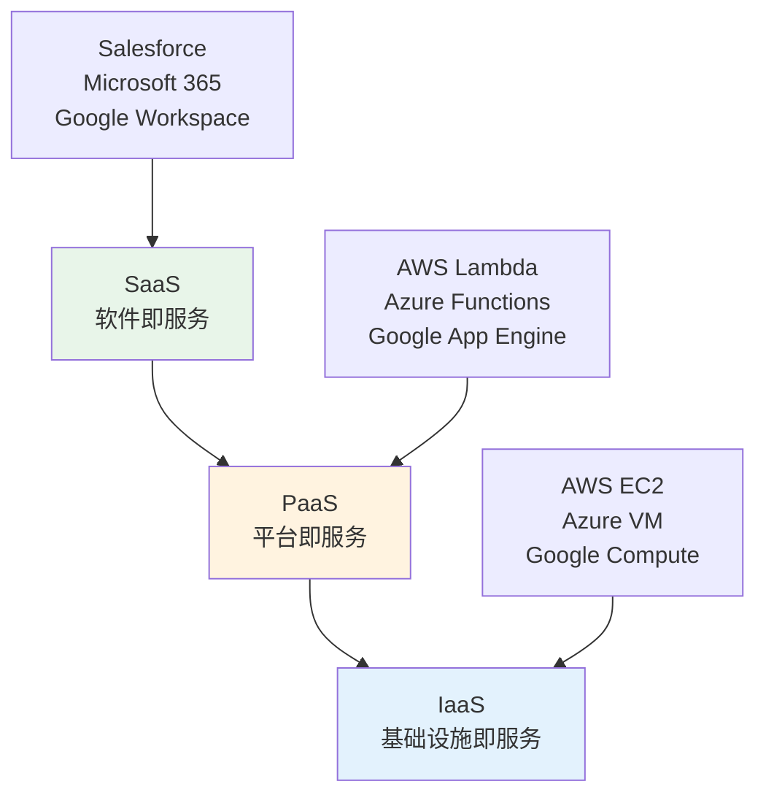

# 云计算行业分析

## 概述

云计算已成为现代IT基础设施的核心，从初创公司到大型企业，从消费应用到企业服务，云计算无处不在。随着AI、大数据、物联网等技术的发展，云计算市场持续高速增长。本文深入分析云计算行业的市场格局、商业模式、技术趋势和投资机会。

**学习目标**：
1. 理解云计算的三层架构（IaaS/PaaS/SaaS）
2. 掌握主要云服务商的竞争格局
3. 分析云计算的商业模式和盈利能力
4. 识别云计算行业的投资机会
5. 评估行业发展趋势和风险

## 云计算架构

### 三层服务模型

### IaaS（基础设施即服务）
**定义**：提供虚拟化计算资源

**核心服务**：
- 计算：虚拟机、容器
- 存储：对象存储、块存储
- 网络：VPC、负载均衡
- 数据库：托管数据库服务

**主要厂商**：
- AWS：32%市场份额
- Azure：23%市场份额
- Google Cloud：10%市场份额
- 阿里云：4%市场份额（中国第一）

**商业模式**：
- 按使用量计费
- 预留实例折扣
- 长期合同优惠

**盈利能力**：
- 毛利率：50-60%
- 营业利润率：20-30%
- 规模效应显著

### PaaS（平台即服务）
**定义**：提供应用开发和部署平台

**核心服务**：
- 无服务器计算
- 容器编排（Kubernetes）
- 数据库服务
- AI/ML平台
- 开发工具

**主要厂商**：
- AWS（Lambda、ECS）
- Azure（Functions、AKS）
- Google Cloud（Cloud Run、GKE）
- Heroku、Vercel

**商业模式**：
- 按调用次数计费
- 按资源使用计费
- 订阅+使用混合

**盈利能力**：
- 毛利率：60-70%
- 增长最快的细分市场
- 开发者生态关键

### SaaS（软件即服务）
**定义**：提供基于云的应用软件

**核心类别**：
- CRM：Salesforce、HubSpot
- 协作：Microsoft 365、Google Workspace、Slack
- ERP：Oracle、SAP、Workday
- 营销：Adobe、HubSpot
- 开发：GitHub、GitLab、Atlassian

**商业模式**：
- 订阅收费（月度/年度）
- 按用户数计费
- 分层定价

**盈利能力**：
- 毛利率：70-85%
- 营业利润率：10-25%
- 高客户生命周期价值

## 市场规模与增长

### 全球云计算市场

| 年份 | 市场规模（亿美元） | 同比增长 |
|------|-------------------|----------|
| 2020 | 3,120 | 29% |
| 2021 | 4,080 | 31% |
| 2022 | 5,000 | 23% |
| 2023 | 5,970 | 19% |
| 2024E | 7,050 | 18% |
| 2025E | 8,320 | 18% |
| 2030E | 18,000 | 17% CAGR |

### 细分市场分析

#### IaaS市场（45%）
- 2024年规模：3,170亿美元
- 增长率：20%
- 驱动因素：AI工作负载、数据中心迁移

#### PaaS市场（20%）
- 2024年规模：1,410亿美元
- 增长率：25%
- 驱动因素：无服务器、容器化、AI平台

#### SaaS市场（35%）
- 2024年规模：2,470亿美元
- 增长率：15%
- 驱动因素：数字化转型、远程办公

## 竞争格局分析

### 全球云服务商排名（2024）

| 排名 | 公司 | 市场份额 | 营收（亿美元） | 增长率 |
|------|------|----------|---------------|--------|
| 1 | AWS | 32% | 1,010 | 13% |
| 2 | Azure | 23% | 725 | 29% |
| 3 | Google Cloud | 10% | 315 | 26% |
| 4 | 阿里云 | 4% | 126 | 3% |
| 5 | IBM Cloud | 3% | 95 | -2% |
| 6 | Salesforce | 3% | 95 | 11% |
| 7 | Oracle Cloud | 2% | 63 | 25% |
| 8 | 腾讯云 | 2% | 63 | 5% |

### 三巨头对比

#### AWS（Amazon Web Services）
**优势**：
- 先发优势（2006年推出）
- 服务最全面（200+服务）
- 生态系统最成熟
- 技术创新领先

**劣势**：
- 增速放缓
- 价格压力
- 竞争加剧

**财务表现**：
- 营收：1,010亿美元（2024）
- 营业利润：350亿美元
- 营业利润率：35%
- 增长率：13%

**投资价值**：
- 现金牛业务
- 高利润率
- 稳定增长
- 估值合理

#### Microsoft Azure
**优势**：
- 企业客户基础
- Office 365整合
- 混合云优势
- AI能力（OpenAI合作）

**劣势**：
- 技术追赶
- 服务不如AWS全面
- 定价复杂

**财务表现**：
- 营收：725亿美元（2024）
- 增长率：29%
- 营业利润率：40%+

**投资价值**：
- 增长最快
- AI整合优势
- 企业市场强
- 长期看好

#### Google Cloud
**优势**：
- AI/ML技术领先
- 数据分析强
- Kubernetes原创
- 开发者友好

**劣势**：
- 市场份额小
- 企业销售弱
- 亏损状态

**财务表现**：
- 营收：315亿美元（2024）
- 增长率：26%
- 营业利润率：5%（刚转正）

**投资价值**：
- 高增长潜力
- AI优势明显
- 盈利能力改善
- 估值弹性大

## 商业模式分析

### 云服务商盈利模式

#### 1. 规模经济
**成本结构**：
- 固定成本：数据中心、服务器
- 变动成本：电力、带宽、维护

**规模效应**：
- 客户越多，单位成本越低
- AWS单位成本每年下降10-15%
- 价格下降吸引更多客户
- 形成正向循环

#### 2. 客户锁定
**锁定机制**：
- 数据迁移成本高
- 应用重构成本高
- 学习曲线陡峭
- 生态系统依赖

**客户留存**：
- AWS客户留存率：98%
- Azure客户留存率：97%
- 扩展收入（Expansion Revenue）高

#### 3. 交叉销售
**策略**：
- 从计算扩展到存储
- 从基础设施到AI服务
- 从云到边缘
- 从技术到咨询

**效果**：
- 客户ARPU持续增长
- 钱包份额扩大
- 竞争壁垒加深

### SaaS公司盈利模式

#### 关键指标

**ARR（年度经常性收入）**：
- 衡量订阅收入规模
- 增长率反映健康度
- 目标：40%+ Rule（增长率+利润率>40%）

**NRR（净收入留存率）**：
- 衡量客户价值增长
- 优秀公司：120%+
- 包含续约、扩展、流失

**CAC（客户获取成本）**：
- 获取一个客户的成本
- 包含销售、营销费用
- 目标：LTV/CAC > 3

**LTV（客户生命周期价值）**：
- 客户总贡献利润
- 计算：ARPU × 毛利率 × 客户生命周期
- 目标：回收期 < 12个月

#### 增长飞轮

## 技术趋势

### 1. AI与云计算融合
**趋势**：
- AI工作负载占比提升
- GPU实例需求爆发
- AI平台服务增长
- 边缘AI部署

**影响**：
- 云服务商收入增长
- 利润率提升
- 竞争格局变化

### 2. 多云与混合云
**趋势**：
- 企业采用多云策略
- 避免供应商锁定
- 优化成本和性能
- 合规和数据主权

**影响**：
- 云管理工具需求
- 跨云服务机会
- 价格竞争加剧

### 3. 无服务器计算
**趋势**：
- Serverless采用率提升
- 事件驱动架构流行
- 开发效率提升
- 成本优化

**影响**：
- PaaS市场增长
- 开发者体验改善
- 新商业模式

### 4. 边缘计算
**趋势**：
- 5G推动边缘部署
- IoT设备爆发
- 低延迟需求
- 数据本地化

**影响**：
- 云边协同
- 新市场机会
- CDN业务增长

## 投资机会分析

### 投资主线

#### 主线1：云基础设施
**投资标的**：
- Amazon（AWS）
- Microsoft（Azure）
- Google（Cloud）
- 阿里巴巴（阿里云）

**投资逻辑**：
- 市场持续增长
- 规模效应显著
- 盈利能力强
- 长期增长确定

**风险**：
- 竞争加剧
- 价格压力
- 监管风险

#### 主线2：垂直SaaS
**投资标的**：
- Salesforce（CRM）
- Workday（HCM）
- ServiceNow（ITSM）
- Veeva（医疗）

**投资逻辑**：
- 垂直领域深耕
- 客户粘性强
- 高利润率
- 护城河深

**风险**：
- 市场饱和
- 竞争加剧
- 增长放缓

#### 主线3：开发者工具
**投资标的**：
- GitHub（Microsoft）
- GitLab
- Atlassian
- Datadog

**投资逻辑**：
- 开发者生态
- 网络效应
- 高增长
- 估值弹性

**风险**：
- 竞争激烈
- 开源冲击
- 客户集中

#### 主线4：云安全
**投资标的**：
- CrowdStrike
- Palo Alto Networks
- Zscaler
- Okta

**投资逻辑**：
- 安全需求刚性
- 云迁移驱动
- 高增长
- 高利润率

**风险**：
- 技术迭代快
- 竞争激烈
- 估值偏高

## 投资建议

### 核心持仓（50-60%）
**Microsoft**：
- 理由：Azure增长强劲，AI整合优势
- 风险：估值偏高
- 配置：长期持有

**Amazon**：
- 理由：AWS现金牛，电商协同
- 风险：增速放缓
- 配置：稳健持有

### 卫星持仓（30-40%）
**Google**：
- 理由：AI优势，增长潜力
- 风险：盈利能力弱
- 配置：长期看好

**Salesforce**：
- 理由：CRM龙头，AI整合
- 风险：增长放缓
- 配置：适度配置

### 机会持仓（10-20%）
**云安全公司**：
- CrowdStrike、Zscaler
- 理由：高增长，刚需
- 配置：精选个股

**开发者工具**：
- GitLab、Datadog
- 理由：生态价值
- 配置：波段操作

## 风险因素

### 1. 竞争风险
- 价格战
- 市场份额争夺
- 利润率压力

### 2. 技术风险
- 技术迭代快
- 开源冲击
- 新技术颠覆

### 3. 监管风险
- 数据隐私
- 反垄断
- 数据本地化

### 4. 宏观风险
- 经济衰退
- IT支出下降
- 汇率波动

## 长期展望

### 2025-2030年趋势

#### 1. AI驱动增长
- AI工作负载占比提升至50%
- GPU实例需求持续增长
- AI平台服务爆发

#### 2. 边缘云普及
- 5G推动边缘部署
- IoT设备连接云端
- 云边协同成熟

#### 3. 行业云兴起
- 垂直行业定制
- 合规和安全增强
- 生态系统深化

#### 4. 可持续发展
- 绿色数据中心
- 可再生能源
- 碳中和目标

## 延伸阅读

### 必读书籍

1. **《云计算架构》** - Thomas Erl
2. **《SaaS创业路线图》** - Phil Fernandez
3. **《平台革命》** - Geoffrey Parker

### 推荐报告

- Gartner：云计算市场预测
- IDC：云服务市场分析
- Synergy Research：云市场份额

## 参考文献

1. Erl, T., et al. (2013). *Cloud Computing: Concepts, Technology & Architecture*. Prentice Hall.
2. Fernandez, P. (2021). *The SaaS Playbook*. Wiley.
3. Parker, G., et al. (2016). *Platform Revolution*. W. W. Norton.
4. Gartner. (2024). *Cloud Computing Market Forecast*.
5. IDC. (2024). *Worldwide Public Cloud Services Market*.
6. Synergy Research. (2024). *Cloud Market Share Report*.
7. Bessemer Venture Partners. (2024). *State of the Cloud Report*.
8. McKinsey. (2023). *Cloud's Trillion-Dollar Prize*.
9. Goldman Sachs. (2024). *Cloud Computing Industry Outlook*.
10. Morgan Stanley. (2024). *Cloud Infrastructure Analysis*.

---

**下一步行动**：
1. 深入研究AWS、Azure、Google Cloud
2. 跟踪云计算市场份额变化
3. 关注AI对云计算的影响
4. 建立云计算行业跟踪组合

**相关主题**：
- [AI行业分析](./ai-industry.html)
- [SaaS商业模式](../../../03-company-analysis/business-models/saas-models.html)
- [科技成长股投资](../../../04-investment-system/growth-investing/technology-growth.html)

## 深度分析

### 核心机制解析

理解本主题需要从多个维度进行系统性分析。以下从理论基础、实践应用和历史验证三个层面展开深度探讨。

**理论基础层面**：本主题的核心逻辑建立在经济学和金融学的基本原理之上。通过对基础理论的深入理解，投资者能够建立起稳固的分析框架，避免被市场短期噪音所干扰。

**实践应用层面**：理论必须与实践相结合才能产生价值。在实际投资决策中，需要将抽象的概念转化为具体的分析工具和决策标准。

**历史验证层面**：金融市场有着丰富的历史记录，通过研究历史案例，我们可以验证理论的有效性，并从中提炼出具有普遍意义的规律。

### 关键影响因素

影响本主题的关键因素可以从以下几个维度进行分析：

1. **宏观经济环境**：利率水平、通货膨胀率、经济增长速度等宏观变量对本主题有着深远影响。在不同的宏观经济周期中，相关指标的表现会呈现出显著差异。

2. **市场结构因素**：市场参与者的构成、信息传播机制、流动性状况等市场结构因素决定了价格发现的效率和准确性。

3. **政策监管环境**：政府政策、监管框架的变化会直接影响相关市场的运作规则和参与者行为。

4. **技术创新驱动**：技术进步不断改变着金融市场的运作方式，从算法交易到区块链技术，每一次技术革新都带来新的机遇和挑战。

5. **全球化与地缘政治**：在全球化背景下，各国市场之间的联动性日益增强，地缘政治风险的影响也越来越不可忽视。

### 量化分析框架

为了更精确地分析和评估，可以采用以下量化框架：

| 分析维度 | 关键指标 | 参考基准 | 分析方法 |
|---------|---------|---------|---------|
| 规模评估 | 绝对值与相对值 | 历史均值 | 趋势分析 |
| 质量评估 | 稳定性指标 | 行业对标 | 横向比较 |
| 风险评估 | 波动率指标 | 风险阈值 | 情景分析 |
| 价值评估 | 估值倍数 | 历史区间 | 回归分析 |

通过系统性地应用上述框架，投资者可以对目标进行全面、客观的评估，从而做出更加理性的投资决策。

