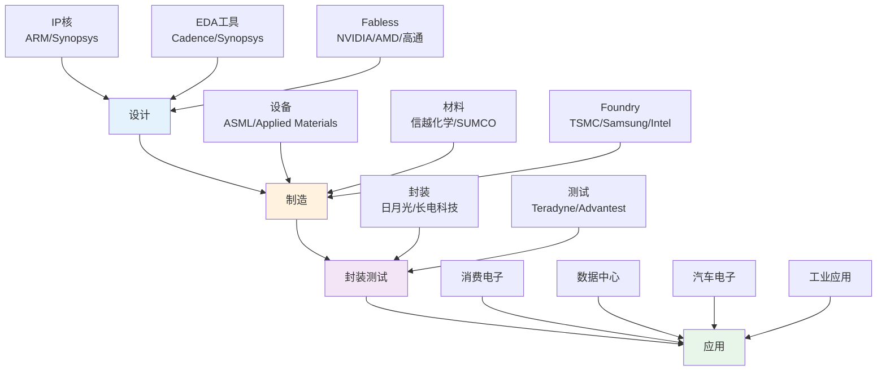
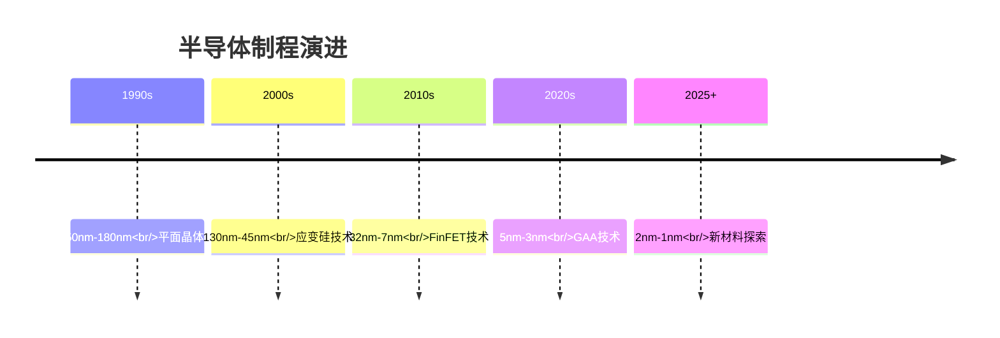

# 半导体行业分析

## 概述

半导体是现代电子工业的基石，从智能手机到数据中心，从汽车到工业设备，半导体无处不在。随着AI、5G、物联网等新技术的发展，半导体行业正迎来新一轮增长周期。对投资者而言，理解半导体产业链、技术演进和竞争格局，是把握这一核心科技行业投资机会的关键。

**学习目标**：
1. 理解半导体产业链结构和价值分布
2. 掌握半导体技术演进和制程节点
3. 分析全球半导体竞争格局
4. 识别半导体行业投资机会和风险
5. 评估地缘政治对行业的影响

## 半导体产业链

### 完整产业链图谱

### 产业链各环节分析

#### 1. 设计环节（Fabless）
**商业模式**：专注芯片设计，外包制造

**关键企业**：
- GPU：NVIDIA（90%市场份额）、AMD
- 手机芯片：高通、联发科、苹果
- AI芯片：NVIDIA、Google TPU、AMD

**盈利能力**：
- 毛利率：50-70%
- 净利率：20-40%
- ROE：30-50%

**关键成功因素**：
- 技术创新能力
- 生态系统控制
- 客户关系
- 知识产权

**投资价值**：
- 轻资产模式
- 高利润率
- 成长性强
- 估值弹性大

#### 2. 制造环节（Foundry）
**商业模式**：代工制造，不设计芯片

**关键企业**：
- TSMC：60%市场份额，先进制程领导者
- Samsung：18%市场份额，垂直整合
- Intel：重返代工市场
- 中芯国际：中国龙头

**盈利能力**：
- 毛利率：40-55%
- 净利率：30-40%
- ROE：25-35%

**关键成功因素**：
- 制程技术领先
- 产能规模
- 良率控制
- 客户信任

**投资价值**：
- 资本密集
- 技术壁垒高
- 客户粘性强
- 长期增长稳定

#### 3. 设备与材料
**设备关键企业**：
- 光刻机：ASML（EUV垄断）
- 刻蚀：Lam Research、Tokyo Electron
- 薄膜沉积：Applied Materials
- 检测：KLA

**材料关键企业**：
- 硅片：信越化学、SUMCO
- 光刻胶：JSR、东京应化
- 特种气体：Air Products、林德

**盈利能力**：
- 毛利率：45-60%
- 净利率：20-30%
- ROE：20-30%

**投资价值**：
- 寡头垄断
- 技术壁垒极高
- 定价权强
- 周期性明显

#### 4. 封装测试
**关键企业**：
- 日月光（台湾）
- 长电科技（中国）
- Amkor（美国）

**盈利能力**：
- 毛利率：15-25%
- 净利率：5-10%
- ROE：10-15%

**投资价值**：
- 劳动密集
- 利润率低
- 竞争激烈
- 投资价值有限

## 技术演进与制程节点

### 摩尔定律与制程演进

### 先进制程竞争

#### 当前格局（2024）

| 制程节点 | TSMC | Samsung | Intel |
|---------|------|---------|-------|
| 3nm | 量产 | 量产 | 研发中 |
| 2nm | 试产 | 研发中 | 规划中 |
| 1.4nm | 规划中 | 规划中 | - |

**TSMC优势**：
- 技术领先1-2代
- 良率最高
- 客户信任度高
- 产能最大

**Samsung挑战**：
- 良率问题
- 客户流失
- 投资激进

**Intel困境**：
- 技术落后
- 制程延迟
- 市场份额流失

### 技术趋势

#### 1. 3D堆叠技术
- 芯片垂直堆叠
- 提升性能密度
- 降低功耗
- 代表：AMD 3D V-Cache

#### 2. 先进封装
- Chiplet设计
- 2.5D/3D封装
- 异构集成
- 降低成本

#### 3. 新材料探索
- 碳纳米管
- 二维材料
- 量子点
- 突破硅极限

## 市场规模与增长

### 全球半导体市场

| 年份 | 市场规模（亿美元） | 同比增长 |
|------|-------------------|----------|
| 2020 | 4,400 | 6.8% |
| 2021 | 5,560 | 26.2% |
| 2022 | 5,740 | 3.2% |
| 2023 | 5,270 | -8.2% |
| 2024E | 5,880 | 11.6% |
| 2025E | 6,500 | 10.5% |
| 2030E | 10,000 | 9% CAGR |

### 细分市场分析

#### 1. 逻辑芯片（40%）
- CPU、GPU、FPGA
- 2024年规模：2,350亿美元
- 增长驱动：AI、数据中心

#### 2. 存储芯片（25%）
- DRAM、NAND Flash
- 2024年规模：1,470亿美元
- 周期性最强

#### 3. 模拟芯片（15%）
- 电源管理、信号处理
- 2024年规模：880亿美元
- 增长稳定

#### 4. 分立器件（10%）
- 功率半导体、传感器
- 2024年规模：590亿美元
- 汽车电子驱动

## 竞争格局分析

### 全球半导体企业排名（2024）

| 排名 | 公司 | 营收（亿美元） | 市场份额 | 主营业务 |
|------|------|---------------|----------|----------|
| 1 | Intel | 540 | 9.2% | CPU、数据中心 |
| 2 | Samsung | 520 | 8.8% | 存储、代工 |
| 3 | TSMC | 690 | 11.7% | 代工 |
| 4 | NVIDIA | 600 | 10.2% | GPU、AI芯片 |
| 5 | Broadcom | 350 | 6.0% | 通信芯片 |
| 6 | 高通 | 350 | 6.0% | 手机芯片 |
| 7 | AMD | 230 | 3.9% | CPU、GPU |
| 8 | 德州仪器 | 180 | 3.1% | 模拟芯片 |
| 9 | 英飞凌 | 160 | 2.7% | 功率半导体 |
| 10 | SK海力士 | 360 | 6.1% | 存储 |

### 区域竞争格局

#### 美国（50%市场份额）
**优势**：
- 设计能力最强
- 生态系统完善
- 创新能力领先

**代表企业**：
- NVIDIA、Intel、AMD、高通、Broadcom

**挑战**：
- 制造能力弱化
- 依赖亚洲代工
- 供应链风险

#### 亚洲（45%市场份额）
**台湾**：
- TSMC：代工龙头
- 联发科：手机芯片
- 日月光：封测龙头

**韩国**：
- Samsung：存储+代工
- SK海力士：存储

**中国**：
- 中芯国际：代工
- 长江存储：存储
- 海思：设计（受限）

**日本**：
- 设备材料强
- 芯片设计弱

#### 欧洲（5%市场份额）
**代表企业**：
- ASML：光刻机垄断
- 英飞凌：功率半导体
- 意法半导体：汽车芯片

**特点**：
- 设备材料强
- 芯片设计弱
- 汽车芯片有优势

## 投资机会分析

### 投资主线

#### 主线1：AI算力芯片
**投资标的**：
- NVIDIA：GPU龙头，AI算力核心
- AMD：GPU挑战者，性价比优势
- Broadcom：AI芯片，网络设备

**投资逻辑**：
- AI需求爆发
- 算力稀缺
- 定价权强
- 长期增长确定

**风险**：
- 估值过高
- 竞争加剧
- 技术迭代

#### 主线2：先进制程代工
**投资标的**：
- TSMC：技术领先，客户优质
- Samsung：垂直整合，追赶TSMC

**投资逻辑**：
- 技术壁垒高
- 客户粘性强
- 产能稀缺
- 长期增长稳定

**风险**：
- 资本支出巨大
- 地缘政治风险
- 技术迭代风险

#### 主线3：设备材料
**投资标的**：
- ASML：EUV光刻机垄断
- Applied Materials：设备龙头
- Lam Research：刻蚀设备
- KLA：检测设备

**投资逻辑**：
- 寡头垄断
- 技术壁垒极高
- 定价权强
- 受益产能扩张

**风险**：
- 周期性强
- 客户集中
- 地缘政治

#### 主线4：汽车芯片
**投资标的**：
- 英飞凌：功率半导体
- 意法半导体：汽车MCU
- 恩智浦：汽车芯片

**投资逻辑**：
- 汽车电动化
- 智能化需求
- 长期增长确定
- 估值合理

**风险**：
- 汽车周期
- 竞争加剧
- 技术迭代

### 投资时机判断

#### 周期位置（2024）：复苏期
**特征**：
- 库存去化完成
- 需求开始回升
- AI需求强劲
- 估值修复

**策略**：
- 逢低布局
- 关注龙头
- 分批建仓
- 长期持有

#### 未来3-5年：成长期
**预期**：
- AI驱动增长
- 汽车电子爆发
- 5G/IoT普及
- 行业整合

**策略**：
- 持有龙头
- 关注新技术
- 评估护城河
- 长期投资

## 风险因素分析

### 周期性风险
**特征**：
- 3-4年周期
- 库存波动大
- 价格波动剧烈

**应对**：
- 关注库存周期
- 逢低布局
- 分散投资

### 技术风险
**摩尔定律放缓**：
- 制程进步变慢
- 成本上升
- 新技术不确定

**应对**：
- 关注新技术
- 评估技术路线
- 分散风险

### 地缘政治风险
**中美科技脱钩**：
- 出口管制
- 供应链重构
- 市场分割

**应对**：
- 关注政策变化
- 评估供应链风险
- 分散区域配置

### 竞争风险
**竞争加剧**：
- 新进入者
- 价格战
- 客户流失

**应对**：
- 关注护城河
- 评估竞争优势
- 选择龙头

## 投资建议

### 核心持仓（50-60%）
**NVIDIA**：
- 理由：AI算力核心，技术领先
- 风险：估值偏高
- 配置：长期持有

**TSMC**：
- 理由：先进制程龙头，客户优质
- 风险：地缘政治
- 配置：稳健持有

**ASML**：
- 理由：EUV垄断，不可替代
- 风险：客户集中
- 配置：长期持有

### 卫星持仓（30-40%）
**AMD**：
- 理由：GPU挑战者，CPU竞争力
- 风险：技术差距
- 配置：波段操作

**Applied Materials**：
- 理由：设备龙头，受益扩产
- 风险：周期性
- 配置：逢低布局

**Broadcom**：
- 理由：AI芯片，网络设备
- 风险：业务多元
- 配置：适度配置

### 机会持仓（10-20%）
**汽车芯片**：
- 英飞凌、意法半导体
- 理由：汽车电动化
- 配置：长期看好

**存储芯片**：
- 美光、SK海力士
- 理由：周期底部
- 配置：波段操作

## 长期展望

### 2025-2030年趋势

#### 1. AI驱动增长
- AI芯片需求爆发
- 数据中心升级
- 边缘AI普及

#### 2. 汽车电子爆发
- 电动化加速
- 智能化深化
- 芯片含量提升

#### 3. 先进制程演进
- 2nm量产
- 1nm研发
- 新材料应用

#### 4. 供应链重构
- 区域化生产
- 多元化供应
- 自主可控

### 投资机会演变

#### 短期（1-2年）：AI算力
- NVIDIA、AMD
- TSMC、ASML
- 确定性最高

#### 中期（3-5年）：汽车电子
- 英飞凌、意法
- 恩智浦、瑞萨
- 增长空间大

#### 长期（5-10年）：新技术
- 量子计算
- 光子芯片
- 新材料芯片

## 延伸阅读

### 必读书籍

1. **《芯片战争》** - Chris Miller
   - 半导体地缘政治
   - 产业发展史

2. **《半导体制造技术》** - Michael Quirk
   - 制造工艺详解
   - 技术原理

3. **《摩尔定律》** - Arnold Thackray
   - 摩尔定律历史
   - 产业演进

### 推荐报告

- Gartner：半导体市场预测
- IC Insights：行业数据报告
- SEMI：设备材料报告
- 各大券商行业研究

## 参考文献

1. Miller, C. (2022). *Chip War*. Scribner.
2. Quirk, M., & Serda, J. (2001). *Semiconductor Manufacturing Technology*. Prentice Hall.
3. Thackray, A., et al. (2015). *Moore's Law*. Basic Books.
4. Mack, C. A. (2011). *Fifty Years of Moore's Law*. IEEE Transactions.
5. Gartner. (2024). *Semiconductor Market Forecast*.
6. IC Insights. (2024). *Global Semiconductor Market Analysis*.
7. SEMI. (2024). *Semiconductor Equipment Market Report*.
8. McKinsey. (2023). *The Semiconductor Decade*.
9. BCG. (2023). *Strengthening the Global Semiconductor Supply Chain*.
10. Goldman Sachs. (2024). *Semiconductor Industry Outlook*.

---

**下一步行动**：
1. 深入研究NVIDIA、TSMC等核心标的
2. 跟踪半导体周期和库存数据
3. 关注AI芯片需求变化
4. 建立半导体行业跟踪组合
5. 定期更新行业认知

**相关主题**：
- [AI行业分析](./ai-industry.html)
- [云计算行业分析](./cloud-computing.html)
- [美国科技板块](../overview.html)
- [科技成长股投资](../../../04-investment-system/growth-investing/technology-growth.html)

## 深度分析

### 核心机制解析

理解本主题需要从多个维度进行系统性分析。以下从理论基础、实践应用和历史验证三个层面展开深度探讨。

**理论基础层面**：本主题的核心逻辑建立在经济学和金融学的基本原理之上。通过对基础理论的深入理解，投资者能够建立起稳固的分析框架，避免被市场短期噪音所干扰。

**实践应用层面**：理论必须与实践相结合才能产生价值。在实际投资决策中，需要将抽象的概念转化为具体的分析工具和决策标准。

**历史验证层面**：金融市场有着丰富的历史记录，通过研究历史案例，我们可以验证理论的有效性，并从中提炼出具有普遍意义的规律。

### 关键影响因素

影响本主题的关键因素可以从以下几个维度进行分析：

1. **宏观经济环境**：利率水平、通货膨胀率、经济增长速度等宏观变量对本主题有着深远影响。在不同的宏观经济周期中，相关指标的表现会呈现出显著差异。

2. **市场结构因素**：市场参与者的构成、信息传播机制、流动性状况等市场结构因素决定了价格发现的效率和准确性。

3. **政策监管环境**：政府政策、监管框架的变化会直接影响相关市场的运作规则和参与者行为。

4. **技术创新驱动**：技术进步不断改变着金融市场的运作方式，从算法交易到区块链技术，每一次技术革新都带来新的机遇和挑战。

5. **全球化与地缘政治**：在全球化背景下，各国市场之间的联动性日益增强，地缘政治风险的影响也越来越不可忽视。

### 量化分析框架

为了更精确地分析和评估，可以采用以下量化框架：

| 分析维度 | 关键指标 | 参考基准 | 分析方法 |
|---------|---------|---------|---------|
| 规模评估 | 绝对值与相对值 | 历史均值 | 趋势分析 |
| 质量评估 | 稳定性指标 | 行业对标 | 横向比较 |
| 风险评估 | 波动率指标 | 风险阈值 | 情景分析 |
| 价值评估 | 估值倍数 | 历史区间 | 回归分析 |

通过系统性地应用上述框架，投资者可以对目标进行全面、客观的评估，从而做出更加理性的投资决策。

## 高级分析与前沿研究

### 学术研究进展

近年来，学术界对本领域的研究取得了重要进展。以下是几个值得关注的研究方向：

**行为金融学视角**：传统金融理论假设市场参与者是完全理性的，但行为金融学的研究表明，认知偏差和情绪因素在投资决策中扮演着重要角色。诺贝尔经济学奖得主丹尼尔·卡尼曼（Daniel Kahneman）和理查德·塞勒（Richard Thaler）的研究为我们理解市场非理性行为提供了重要框架。

**因子投资研究**：尤金·法玛（Eugene Fama）和肯尼斯·弗伦奇（Kenneth French）的三因子模型，以及后续发展的五因子模型，为系统性地解释股票收益差异提供了理论基础。这些研究表明，市值、账面市值比、盈利能力和投资模式等因子能够解释大部分股票收益的横截面差异。

**市场微观结构研究**：对市场流动性、价格发现机制和交易成本的深入研究，帮助我们更好地理解市场的运作机制，并为优化交易策略提供指导。

### 实战案例深度解析

**案例一：长期价值创造的典范**

以沃伦·巴菲特（Warren Buffett）的伯克希尔·哈撒韦（Berkshire Hathaway）为例，其长达数十年的卓越投资业绩证明了价值投资理念的有效性。从1965年至今，伯克希尔的账面价值年均增长率约为19.8%，远超同期标普500指数的约10.2%年均回报。

巴菲特的成功秘诀在于：
- 专注于具有持久竞争优势的优质企业
- 以合理价格买入，而非追求最低价格
- 长期持有，让复利效应充分发挥
- 保持充足的安全边际，控制下行风险

**案例二：危机中的机遇识别**

2008年金融危机期间，大多数投资者恐慌性抛售，但少数具有前瞻性的投资者却在危机中发现了历史性的投资机会。约翰·保尔森（John Paulson）通过做空次级抵押贷款相关证券，在危机中获得了约150亿美元的利润，成为金融史上最成功的单笔交易之一。

这个案例告诉我们：
- 深入的基本面研究能够发现市场定价错误
- 逆向思维往往能够发现被市场忽视的机会
- 风险管理和仓位控制是成功的关键

### 跨市场比较分析

不同市场在结构、监管、投资者构成等方面存在显著差异，这些差异对投资策略的选择有重要影响：

**美国市场特征**：
- 机构投资者主导，市场效率较高
- 信息披露制度完善，分析师覆盖广泛
- 衍生品市场发达，对冲工具丰富
- 长期牛市历史，但也经历过多次重大调整

**中国市场特征**：
- 散户投资者比例较高，市场波动性较大
- 政策因素影响显著，需要密切关注监管动向
- 新兴行业发展迅速，成长投资机会丰富
- A股、港股、美股中概股形成多层次市场体系

**欧洲市场特征**：
- 价值股比例较高，估值相对保守
- 受地缘政治和欧元区政策影响较大
- 部分行业（如奢侈品、工业）具有全球竞争优势
- ESG投资理念推广较为领先

## 实用工具与操作指南

### 分析工具推荐

**数据获取工具**：
- **Bloomberg Terminal**：专业级金融数据平台，提供实时行情、历史数据、新闻资讯等全方位服务，是机构投资者的首选工具
- **Wind资讯（万得）**：中国最权威的金融数据平台，覆盖A股、债券、基金等全市场数据
- **FactSet**：提供全球股票、固定收益、另类投资等多资产类别的综合数据服务
- **免费替代方案**：Yahoo Finance、Google Finance、东方财富、同花顺等提供基础数据服务

**分析软件工具**：
- **Excel/Python**：用于财务模型构建、数据分析和可视化
- **Tableau/Power BI**：用于数据可视化和仪表板创建
- **R语言**：适合统计分析和量化研究

### 实操步骤指南

**第一步：信息收集**
1. 获取目标公司/资产的基本信息和历史数据
2. 收集行业报告和竞争对手数据
3. 整理宏观经济背景信息
4. 查阅相关学术研究和专业分析报告

**第二步：定量分析**
1. 建立财务模型，计算关键指标
2. 进行历史趋势分析
3. 与同行业公司进行横向比较
4. 构建估值模型，计算合理价值区间

**第三步：定性分析**
1. 评估竞争优势和护城河
2. 分析管理层质量和公司治理
3. 识别主要风险因素
4. 评估行业发展趋势

**第四步：综合判断**
1. 整合定量和定性分析结果
2. 进行情景分析（乐观/基准/悲观）
3. 确定投资论点和关键假设
4. 制定投资决策和风险管理方案

### 常见错误与规避方法

| 常见错误 | 产生原因 | 规避方法 |
|---------|---------|---------|
| 过度依赖历史数据 | 忽视结构性变化 | 结合前瞻性分析 |
| 锚定效应 | 过度依赖初始信息 | 定期重新评估假设 |
| 确认偏误 | 只寻找支持观点的证据 | 主动寻找反驳证据 |
| 过度自信 | 高估自身分析能力 | 保持谦逊，设置安全边际 |
| 忽视流动性风险 | 只关注收益不关注风险 | 全面评估风险因素 |

## 扩展参考资料

### 经典著作推荐

**基础理论类**：
1. 本杰明·格雷厄姆（Benjamin Graham）《聪明的投资者》（The Intelligent Investor, 1949）- 价值投资圣经，巴菲特称之为"有史以来最伟大的投资书籍"
2. 菲利普·费雪（Philip Fisher）《怎样选择成长股》（Common Stocks and Uncommon Profits, 1958）- 成长投资经典，强调定性分析的重要性
3. 彼得·林奇（Peter Lynch）《彼得·林奇的成功投资》（One Up on Wall Street, 1989）- 普通投资者如何发现十倍股
4. 霍华德·马克斯（Howard Marks）《投资最重要的事》（The Most Important Thing, 2011）- 橡树资本创始人的投资智慧

**宏观经济类**：
5. 瑞·达里奥（Ray Dalio）《原则》（Principles, 2017）- 桥水基金创始人的生活和工作原则
6. 约翰·梅纳德·凯恩斯（John Maynard Keynes）《就业、利息和货币通论》（The General Theory, 1936）- 现代宏观经济学奠基之作
7. 米尔顿·弗里德曼（Milton Friedman）《货币的祸害》（Money Mischief, 1992）- 货币主义经典著作

**量化投资类**：
8. 伊曼纽尔·德曼（Emanuel Derman）《宽客人生》（My Life as a Quant, 2004）- 量化金融先驱的回忆录
9. 马科维茨（Harry Markowitz）《组合选择》（Portfolio Selection, 1952）- 现代投资组合理论奠基论文

### 权威研究报告

- **美联储经济研究**：https://www.federalreserve.gov/econres.htm
- **国际货币基金组织（IMF）报告**：https://www.imf.org/en/Publications
- **世界银行研究**：https://www.worldbank.org/en/research
- **国际清算银行（BIS）季报**：https://www.bis.org/publ/qtrpdf/
- **中国人民银行货币政策报告**：http://www.pbc.gov.cn

### 在线学习资源

- **Coursera金融课程**：耶鲁大学Robert Shiller的《金融市场》课程
- **MIT OpenCourseWare**：麻省理工学院金融工程相关课程
- **CFA Institute**：特许金融分析师协会的专业学习资源
- **Investopedia**：金融术语和概念的权威解释网站
- **SSRN**：社会科学研究网络，提供大量金融学术论文

