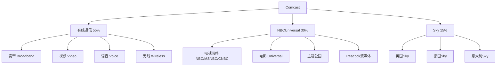

# Comcast - 有线帝国的数字化转型

## 公司概况

**基本信息**：
- 成立时间：1963年（宾夕法尼亚州图尔顿市）
- 创始人：Ralph Roberts
- 总部：宾夕法尼亚州费城
- 上市：NASDAQ: CMCSA
- 市值：约1,700-2,000亿美元
- 员工数：约18.6万人
- 年收入：约1,200亿美元

**主营业务**：
- 有线宽带和电视（Xfinity）
- NBCUniversal（电视网络、电影、主题公园）
- Sky（欧洲媒体和电信）
- Peacock（流媒体）

**行业地位**：
- 美国最大有线运营商
- 美国最大宽带提供商
- 全球最大媒体娱乐公司之一
- 标普500成分股

## 商业模式分析

### 业务结构

### 收入结构（2023年）

| 业务 | 收入（亿美元） | 占比 | EBITDA利润率 |
|------|--------------|------|-------------|
| 有线通信 | 660 | 55% | 42% |
| NBCUniversal | 360 | 30% | 18% |
| Sky | 190 | 15% | 15% |
| **总计** | **1,210** | **100%** | **32%** |

### 核心业务深度分析

**1. 有线通信（Xfinity）**

**宽带业务（最重要）**：
- 用户数：约3,200万
- 月费：约70-100美元
- ARPU：约65美元/月
- 增长：稳定，每年净增约100-200万

**宽带护城河**：
- 有线网络基础设施（同轴电缆）
- 覆盖约5,700万家庭
- 速度优势（DOCSIS 3.1：1Gbps+）
- 升级路径（DOCSIS 4.0：10Gbps）

**视频业务（萎缩）**：
- 用户数：约1,400万（持续下降）
- 峰值：约2,400万（2012年）
- 剪线潮影响
- 转向流媒体

**无线业务（增长）**：
- 品牌：Xfinity Mobile
- MVNO模式（使用Verizon网络）
- 用户数：约600万
- 捆绑销售优势

**2. NBCUniversal**

**电视网络**：
- NBC：全国广播网络
- MSNBC：新闻频道
- CNBC：财经频道
- USA Network、Bravo等有线频道
- 体育：NFL、奥运会、NASCAR

**电影（Universal Pictures）**：
- 好莱坞六大之一
- 代表作：Fast & Furious、Jurassic World、Minions
- 年票房：约20-30亿美元

**主题公园**：
- 环球影城（奥兰多、好莱坞）
- 环球影城日本（授权）
- 环球影城北京（2021年开业）
- 竞争对手：Disney

**Peacock（流媒体）**：
- 2020年推出
- 用户：约3,000万（2023年）
- 月费：$6-12
- 内容：NBC节目、体育、原创

**3. Sky（欧洲）**

**2018年收购**：
- 收购价：约390亿美元
- 覆盖：英国、德国、意大利、奥地利、爱尔兰
- 用户：约2,400万

**业务**：
- 付费电视
- 宽带
- 体育版权（英超等）
- 新闻（Sky News）

**挑战**：
- 欧洲市场竞争
- 流媒体冲击
- 汇率风险

## 竞争优势（护城河）

### 1. 宽带基础设施护城河

**有线网络优势**：
- 覆盖约5,700万家庭（美国）
- 建设成本：约1,000-1,500美元/通过
- 竞争对手难以复制
- 速度优势

**技术升级路径**：
- DOCSIS 3.1：1Gbps（已部署）
- DOCSIS 4.0：10Gbps（升级中）
- 无需重新铺设光纤
- 成本优势

**vs. 光纤竞争**：
- AT&T Fiber：覆盖扩张中
- Verizon Fios：有限覆盖
- 谷歌光纤：有限城市
- 威胁真实但有限

### 2. 捆绑销售优势

**三合一/四合一捆绑**：
- 宽带+视频+语音+无线
- 折扣吸引用户
- 提高转换成本
- 降低流失率

**Xfinity Mobile**：
- 利用Verizon网络（MVNO）
- 无需建设网络
- 捆绑宽带销售
- 低成本获客

### 3. 内容资产

**NBCUniversal内容库**：
- 电视节目库
- 电影库
- 体育版权（NFL、奥运会）
- 新闻品牌

**主题公园**：
- 环球影城
- 哈利波特世界
- 竞争Disney

### 4. 规模优势

**美国最大有线运营商**：
- 采购议价能力
- 技术研发摊薄
- 运营效率
- 品牌认知度

## 财务分析

### 历史财务表现

| 年份 | 收入（亿美元） | EBITDA（亿美元） | 净利润（亿美元） | 自由现金流（亿美元） |
|------|--------------|----------------|----------------|-------------------|
| 2019 | 1,087 | 340 | 130 | 130 |
| 2020 | 1,035 | 320 | 130 | 120 |
| 2021 | 1,162 | 370 | 140 | 140 |
| 2022 | 1,213 | 390 | 50* | 120 |
| 2023 | 1,210 | 390 | 150 | 140 |

*2022年含Sky减值

**收入趋势**：
- 稳定增长
- 宽带增长抵消视频萎缩
- NBCUniversal波动（疫情影响主题公园）
- Sky汇率影响

### 盈利能力

**利润率**：
- EBITDA利润率：约32%
- 营业利润率：约18%
- 净利率：约12%

**分业务利润率**：
- 有线通信：42%（最高）
- NBCUniversal：18%
- Sky：15%

### 现金流分析

**自由现金流**：
- 年均：约120-150亿美元
- 稳定可预期
- 支持股息和回购

**资本支出**：
- 年均：约120-130亿美元
- 主要：网络升级、内容
- 资本支出/收入：约10%

**资本配置**：
- 股息：约45亿美元/年
- 回购：约50-80亿美元/年
- 总股东回报：约100-120亿美元/年

### 资产负债表

**债务状况（2023年）**：
- 总债务：约1,000亿美元
- 净债务：约900亿美元
- 净债务/EBITDA：约2.3倍
- 信用评级：A-（标普）

**财务健康**：
- 债务水平合理
- 稳定现金流覆盖
- 投资级评级
- 财务灵活性好

### 股东回报

**股息**：
- 连续增长：15年+
- 股息率：约2.5-3%
- 派息比率：约30%
- 安全性高

**股票回购**：
- 年均：约50-80亿美元
- 积极回购
- 股份数持续减少

## 宽带业务深度分析

### 宽带市场地位

**市场份额**：
- 美国宽带市场：约30%
- 有线宽带：约50%
- 竞争对手：AT&T（光纤）、Charter、Verizon

**用户增长**：
- 2020年：约2,900万
- 2021年：约3,100万
- 2022年：约3,200万
- 2023年：约3,200万（趋于饱和）

**ARPU提升**：
- 2019年：约57美元/月
- 2023年：约65美元/月
- 年增长：约3-4%
- 提价能力强

### 宽带竞争威胁

**光纤竞争**：
- AT&T Fiber：覆盖扩张
- Verizon Fios：有限覆盖
- 谷歌光纤：有限城市
- 威胁：约20-30%覆盖区域

**固定无线接入（FWA）**：
- T-Mobile、Verizon
- 价格更低
- 速度相对低
- 威胁：价格敏感用户

**应对策略**：
- 速度升级（DOCSIS 4.0）
- 价格竞争
- 捆绑销售
- 服务质量提升

### 宽带长期展望

**增长驱动**：
- 数据消费持续增长
- 远程办公
- 流媒体
- 智能家居

**挑战**：
- 市场趋于饱和
- 竞争加剧
- 价格压力
- 监管（网络中立性）

## NBCUniversal战略

### 内容战略

**体育版权**：
- NFL：周日夜赛（最高收视）
- 奥运会：2021-2032年
- NASCAR、NHL
- 体育是付费电视最后壁垒

**新闻品牌**：
- NBC News：全国广播
- MSNBC：左倾新闻
- CNBC：财经新闻
- 品牌价值高

**娱乐内容**：
- 黄金时段剧集
- 真人秀
- 喜剧
- 竞争激烈

### Peacock战略

**定位**：
- 广告支持免费层（AVOD）
- 付费订阅层（SVOD）
- 差异化：体育+新闻+娱乐

**内容优势**：
- NBC节目库
- 奥运会直播
- NFL周日夜赛
- 原创内容

**挑战**：
- 用户规模小（3,000万 vs Netflix 2.6亿）
- 内容投入不足
- 品牌认知度低
- 盈利遥远

**战略选择**：
- 独立发展
- 与其他平台合并
- 出售
- 不确定性高

### 主题公园

**环球影城**：
- 奥兰多：Epic Universe（2025年开业）
- 好莱坞：持续扩建
- 北京：2021年开业
- 竞争Disney

**Epic Universe（奥兰多）**：
- 投资：约60亿美元
- 2025年开业
- 主题：哈利波特、任天堂、怪物宇宙
- 战略意义：与Disney世界竞争

**财务贡献**：
- 主题公园收入：约70亿美元/年
- 利润率：约25%
- 疫情后强劲复苏

## 竞争分析

### vs. Charter Communications

**Comcast优势**：
- 规模更大
- 内容资产（NBCUniversal）
- 国际业务（Sky）
- 品牌更强

**Charter优势**：
- 更专注（纯有线）
- 资本效率更高
- 无内容风险

### vs. Disney

**竞争领域**：
- 主题公园：直接竞争
- 流媒体：Peacock vs Disney+
- 内容：Universal vs Disney

**合作领域**：
- 内容授权
- 分发合作

### vs. AT&T/Verizon

**宽带竞争**：
- 光纤 vs 有线
- 价格竞争
- 覆盖扩张

**无线合作**：
- Comcast使用Verizon网络（MVNO）
- 互利关系

## 投资论点

### 看多理由

**1. 宽带护城河**
- 有线网络难以复制
- 速度优势
- 稳定现金流
- 提价能力

**2. 稳定现金流**
- 年均FCF约140亿美元
- 可预期
- 支持股息和回购

**3. 低估值**
- P/E约10倍
- EV/EBITDA约7倍
- 相对历史低位
- 内容资产未充分体现

**4. 股东回报**
- 股息+回购：约100亿美元/年
- 股息连续增长
- 积极回购

**5. Epic Universe催化剂**
- 2025年开业
- 主题公园收入增长
- 与Disney竞争

### 风险因素

**1. 宽带竞争加剧**
- 光纤扩张
- FWA威胁
- 价格压力

**2. 付费电视萎缩**
- 剪线潮不可逆
- 收入持续下降
- 内容成本压力

**3. Peacock盈利困难**
- 规模不足
- 内容投入大
- 竞争激烈

**4. Sky整合**
- 欧洲市场挑战
- 汇率风险
- 整合成本

**5. 监管风险**
- 网络中立性
- 反垄断
- 内容监管

## 估值分析

### 相对估值（2023年）

| 指标 | Comcast | Disney | Charter | 行业平均 |
|------|---------|--------|---------|----------|
| P/E | 10-11x | 25x | 12x | 15x |
| EV/EBITDA | 7-8x | 12x | 8x | 9x |
| P/FCF | 8-9x | 20x | 10x | 12x |
| 股息率 | 2.5-3% | 0.5% | 0% | 1.5% |

**估值评估**：
- 相对Disney大幅折价
- 相对Charter相近
- 绝对估值偏低
- 内容资产未充分体现

### 分部估值（Sum-of-Parts）

| 业务 | 估值方法 | 价值（亿美元） |
|------|---------|---------------|
| 有线通信 | EV/EBITDA 9x | 2,500 |
| NBCUniversal | EV/EBITDA 10x | 800 |
| Sky | EV/EBITDA 8x | 400 |
| **企业价值** | | **3,700** |
| 减：净债务 | | -900 |
| **股权价值** | | **2,800** |

**每股价值**：约45美元
**当前股价**（假设$40）：低估约10-15%

## 投资策略

### 适合投资者类型

**价值投资者**：
- 低估值
- 稳定现金流
- 内容资产价值

**收益型投资者**：
- 稳定股息
- 积极回购
- 防御性特征

**长期投资者**：
- 宽带护城河
- 内容资产
- 主题公园增长

### 监测指标

**季度关注**：
- 宽带净增用户
- 宽带ARPU
- Peacock用户增长
- 自由现金流

**年度关注**：
- 宽带竞争格局
- NBCUniversal内容表现
- Epic Universe进展
- 股东回报

## 关键学习点

**1. 有线宽带的护城河**
- 基础设施难以复制
- 速度优势持久
- 稳定现金流来源

**2. 内容+分发的协同**
- NBCUniversal内容
- Xfinity分发
- 捆绑销售优势

**3. 剪线潮的应对**
- 宽带替代视频
- 流媒体（Peacock）
- 无线（Xfinity Mobile）

**4. 主题公园的价值**
- 不可替代的体验
- 高利润率
- 长期增长

**5. 低估值的机会**
- 市场低估内容资产
- 宽带护城河稳固
- 长期价值被忽视

## 参考文献

1. Comcast Corporation. (2023). *Annual Report*.
2. PwC. (2023). "Global Entertainment & Media Outlook".
3. Goldman Sachs. (2023). "Comcast Analysis".
4. Morgan Stanley. (2023). "Cable Industry Review".
5. J.P. Morgan. (2023). "Comcast: Broadband Moat".
6. Bernstein Research. (2023). "Cable vs Fiber Competition".
7. Credit Suisse. (2023). "Comcast Deep Dive".
8. MoffettNathanson. (2023). "US Cable Industry".
