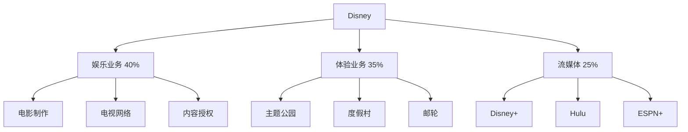
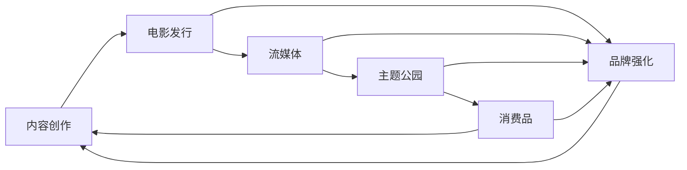

# The Walt Disney Company - 全球娱乐帝国

## 公司概况

**基本信息**：
- **股票代码**：DIS (NYSE)
- **成立时间**：1923 年（Walt Disney 和 Roy O. Disney 创立）
- **总部**：美国加利福尼亚州伯班克
- **CEO**：Bob Iger（2005-2020, 2022 至今）
- **市值**：约 1,800 亿美元（2024 年初）
- **员工数**：约 22 万人

**主营业务**：
- 娱乐内容制作与发行
- 流媒体服务（Disney+, Hulu, ESPN+）
- 主题公园和度假村
- 消费品授权和零售

**行业地位**：
- 全球最大的娱乐公司之一
- 拥有最强大的 IP 组合
- 主题公园行业领导者
- 流媒体市场主要玩家

## 商业模式分析

### 业务结构

### 收入来源（2023 财年）

| 业务线 | 收入（亿美元） | 占比 | 营业利润率 |
|--------|---------------|------|-----------|
| 娱乐 | 400 | 45% | 5% |
| 体验 | 320 | 36% | 22% |
| 流媒体 | 170 | 19% | -5% |
| **总计** | **890** | **100%** | **10%** |

### 核心竞争力

**1. 无与伦比的 IP 组合**

Disney 拥有全球最强大的 IP 资产：

**经典 Disney IP**：
- Mickey Mouse 和朋友们
- Disney 公主系列
- 经典动画电影

**Pixar**（2006 年收购）：
- Toy Story
- Finding Nemo
- The Incredibles
- Cars

**Marvel**（2009 年收购，40 亿美元）：
- 漫威电影宇宙（MCU）
- Spider-Man, Iron Man, Avengers
- 全球票房超过 290 亿美元

**Lucasfilm**（2012 年收购，40 亿美元）：
- Star Wars 系列
- Indiana Jones
- 文化现象级 IP

**21st Century Fox**（2019 年收购，713 亿美元）：
- Avatar
- X-Men
- The Simpsons
- National Geographic

**IP 价值体现**：
- 电影票房
- 流媒体内容
- 主题公园景点
- 消费品授权
- 跨媒体协同

**2. 飞轮效应商业模式**

**飞轮运作**：
1. 创作优质内容（电影、剧集）
2. 通过多渠道发行（影院、流媒体）
3. 转化为主题公园景点
4. 开发消费品和授权
5. 收入再投资于内容创作
6. 每个环节强化品牌价值

**3. 主题公园护城河**

- 全球 12 个主题公园和度假村
- 独特的沉浸式体验
- 高客户忠诚度
- 巨额资本投入壁垒
- 地理位置优势

**主题公园分布**：
- 美国：迪士尼乐园（加州）、迪士尼世界（佛罗里达）
- 国际：巴黎、东京、香港、上海
- 邮轮业务

## 财务分析

### 收入表现

**历史收入（亿美元）**：

| 财年 | 总收入 | 增长率 | 娱乐 | 体验 | 流媒体 |
|------|--------|--------|------|------|--------|
| 2019 | 695 | 17% | 330 | 265 | 100 |
| 2020 | 653 | -6% | 280 | 165 | 208 |
| 2021 | 674 | 3% | 285 | 170 | 219 |
| 2022 | 823 | 22% | 340 | 285 | 198 |
| 2023 | 890 | 8% | 400 | 320 | 170 |

**收入趋势分析**：
- 2020 年疫情重创主题公园业务
- 2021-2022 年强劲复苏
- 流媒体增长放缓
- 体验业务恢复至疫情前水平

### 盈利能力

**营业利润（亿美元）**：

| 财年 | 营业利润 | 利润率 | 娱乐 | 体验 | 流媒体 |
|------|---------|--------|------|------|--------|
| 2019 | 145 | 21% | 75 | 65 | 5 |
| 2020 | 28 | 4% | 50 | -5 | -17 |
| 2021 | 32 | 5% | 45 | 5 | -18 |
| 2022 | 125 | 15% | 55 | 75 | -5 |
| 2023 | 90 | 10% | 20 | 70 | 0 |

**盈利能力分析**：
- 体验业务利润率最高（20%+）
- 娱乐业务利润率波动（内容投资周期）
- 流媒体业务接近盈亏平衡
- 整体利润率受流媒体投资影响

### 现金流分析

**自由现金流（亿美元）**：

| 财年 | 经营现金流 | 资本支出 | 自由现金流 |
|------|-----------|---------|-----------|
| 2019 | 135 | 45 | 90 |
| 2020 | 35 | 40 | -5 |
| 2021 | 60 | 35 | 25 |
| 2022 | 110 | 50 | 60 |
| 2023 | 125 | 55 | 70 |

**现金流特点**：
- 疫情期间现金流承压
- 2022-2023 年显著改善
- 资本支出主要用于主题公园和内容
- FCF 转化率约 55-60%

### 资产负债表

**财务健康度（2023）**：

| 指标 | 金额 | 评价 |
|------|------|------|
| 总资产 | 2,050 亿美元 | 资产规模大 |
| 总负债 | 1,100 亿美元 | 债务水平中等 |
| 股东权益 | 950 亿美元 | 权益充足 |
| 净债务 | 380 亿美元 | 可控 |
| 净债务/EBITDA | 2.1x | 健康 |

**债务管理**：
- Fox 收购导致债务增加
- 疫情期间增加流动性
- 目前积极降低杠杆
- 信用评级：A-（稳定）

## 流媒体战略

### Disney+ 发展

**订阅用户增长（百万）**：

| 时间 | Disney+ | Hulu | ESPN+ | 总计 |
|------|---------|------|-------|------|
| 2020 Q1 | 28 | 31 | 8 | 67 |
| 2021 Q1 | 95 | 40 | 13 | 148 |
| 2022 Q1 | 130 | 45 | 22 | 197 |
| 2023 Q1 | 162 | 48 | 25 | 235 |
| 2023 Q4 | 150 | 50 | 26 | 226 |

**增长驱动因素**：
- 强大的 IP 内容
- 全球市场扩张
- 捆绑订阅策略
- 原创内容投资

**面临挑战**：
- 用户增长放缓
- 订阅疲劳
- 竞争加剧
- 内容成本高

### 流媒体经济学

**每用户平均收入（ARPU）**：
- Disney+：约 6 美元/月（全球平均）
- Hulu：约 12 美元/月
- ESPN+：约 5 美元/月

**内容投资**：
- 2023 年内容支出：约 270 亿美元
- Disney+ 原创内容：约 100 亿美元
- 传统内容：约 170 亿美元

**盈利路径**：
1. 用户规模增长
2. ARPU 提升（涨价、广告）
3. 内容效率提升
4. 成本控制

**广告支持层级**：
- 2022 年 12 月推出
- 价格更低，吸引价格敏感用户
- 广告收入补充
- 提升整体 ARPU

### 与 Netflix 对比

| 指标 | Disney+ | Netflix |
|------|---------|---------|
| 全球订阅用户 | 1.5 亿 | 2.6 亿 |
| ARPU | $6 | $11 |
| 内容投资 | $100 亿 | $170 亿 |
| 盈利状态 | 接近盈亏平衡 | 盈利 |
| 内容策略 | IP 驱动 | 多元化 |
| 优势 | 家庭友好、IP | 全球化、原创 |

## 主题公园业务

### 业务规模

**全球主题公园**：
- 迪士尼世界（佛罗里达）：4 个主题公园
- 迪士尼乐园（加州）：2 个主题公园
- 东京迪士尼：2 个主题公园（授权经营）
- 巴黎迪士尼：2 个主题公园
- 香港迪士尼：1 个主题公园
- 上海迪士尼：1 个主题公园

**游客数量（百万人次）**：

| 年份 | 总游客 | 美国 | 国际 |
|------|--------|------|------|
| 2019 | 157 | 120 | 37 |
| 2020 | 58 | 45 | 13 |
| 2021 | 85 | 65 | 20 |
| 2022 | 135 | 100 | 35 |
| 2023 | 150 | 110 | 40 |

### 财务表现

**体验业务收入（亿美元）**：

| 项目 | 2019 | 2023 | 增长 |
|------|------|------|------|
| 主题公园门票 | 180 | 200 | 11% |
| 度假村和邮轮 | 50 | 70 | 40% |
| 园内消费 | 35 | 50 | 43% |
| **总计** | **265** | **320** | **21%** |

**利润率提升**：
- 2019 年：25%
- 2023 年：22%（仍在恢复中）
- 目标：25%+

**提价策略**：
- 门票价格持续上涨
- 动态定价
- 高级体验（Genie+, Lightning Lane）
- 园内消费增长

### 投资与扩张

**资本支出计划**：
- 年度资本支出：约 50-60 亿美元
- 主题公园占比：60-70%
- 新景点和扩建
- 维护和升级

**新项目**：
- 迪士尼世界扩建（Star Wars, Avengers）
- 上海迪士尼第二期
- 邮轮船队扩张
- 新技术应用（AR/VR）

## 竞争分析

### 流媒体竞争

**主要竞争对手**：
1. **Netflix**：全球领导者，原创内容强
2. **Amazon Prime Video**：捆绑策略，资源雄厚
3. **Warner Bros. Discovery**：HBO Max，内容库深
4. **Paramount+**：传统媒体转型
5. **Apple TV+**：高质量内容，生态整合

**Disney 优势**：
- 最强 IP 组合
- 家庭友好内容
- 品牌信任度高
- 多平台协同

**Disney 劣势**：
- 起步较晚
- 内容多元化不足
- 国际化程度低于 Netflix
- 技术平台相对弱

### 主题公园竞争

**主要竞争对手**：
1. **Universal Studios**：强 IP（哈利波特），创新力强
2. **Six Flags**：区域性，价格更低
3. **SeaWorld**：海洋主题
4. **国际竞争对手**：各地区本土主题公园

**Disney 优势**：
- 品牌和 IP 无可匹敌
- 沉浸式体验最佳
- 全球布局
- 客户忠诚度高

**Disney 劣势**：
- 价格最高
- 拥挤问题
- 部分设施老化

## 投资分析

### 投资亮点

**1. 无与伦比的 IP 资产**
- 全球最强 IP 组合
- 跨代际吸引力
- 多渠道变现
- 长期价值

**2. 流媒体盈利拐点**
- 用户规模达到临界点
- 广告业务启动
- 内容效率提升
- 2024 年有望盈利

**3. 主题公园复苏**
- 游客数量恢复
- 提价能力强
- 利润率改善
- 新项目投资回报

**4. 管理层回归**
- Bob Iger 回归
- 战略清晰
- 成本控制
- 股东导向

**5. 估值吸引力**
- 相对历史估值偏低
- 流媒体亏损掩盖价值
- 主题公园价值未充分体现
- 长期增长潜力

### 投资风险

**1. 流媒体竞争**
- 市场竞争白热化
- 内容成本持续上升
- 用户增长放缓
- 盈利不确定性

**2. 经济周期敏感**
- 主题公园受经济影响
- 可选消费品
- 衰退期业绩承压

**3. 内容风险**
- 大片失败风险
- IP 老化
- 创意人才流失
- 内容争议

**4. 技术变革**
- 新媒体形式
- 消费习惯变化
- 平台竞争
- 技术投资需求

**5. 监管风险**
- 内容审查
- 版权保护
- 反垄断
- 各国监管差异

### 估值分析

**当前估值（2024 年初）**：

| 指标 | Disney | Netflix | Comcast | 行业平均 |
|------|--------|---------|---------|----------|
| P/E | 25x | 35x | 10x | 20x |
| EV/EBITDA | 12x | 18x | 8x | 12x |
| P/S | 2.0x | 6.5x | 1.2x | 2.5x |
| EV/订阅用户 | $800 | $700 | N/A | $750 |

**估值评估**：
- 相对估值合理
- 流媒体亏损压制估值
- 主题公园价值未充分反映
- 长期价值被低估

**分部估值（Sum-of-Parts）**：

| 业务 | 估值方法 | 价值（亿美元） |
|------|---------|---------------|
| 流媒体 | EV/订阅用户 | 1,800 |
| 主题公园 | EV/EBITDA 15x | 1,200 |
| 娱乐 | EV/EBITDA 10x | 600 |
| **总计** | | **3,600** |
| 减：净债务 | | -380 |
| **股权价值** | | **3,220** |

**每股价值**：约 175 美元
**当前股价**：约 95 美元（2024 年初）
**潜在上涨空间**：80%+

**DCF 估值**：

假设：
- 收入增长：5-7%（2024-2028）
- EBITDA 利润率：20-22%
- 资本支出：收入的 6-7%
- WACC：8%
- 永续增长率：3%

**估值区间**：每股 140-180 美元
**潜在上涨空间**：45-90%

### 投资建议

**适合投资者类型**：
- 长期价值投资者
- 成长与价值平衡
- 相信 IP 价值
- 能承受波动

**不适合投资者类型**：
- 短期交易者
- 高股息需求者（股息率低）
- 风险厌恶者

**配置建议**：
- 长期持有（3-5 年+）
- 逢低买入
- 组合占比：5-10%
- 关注流媒体盈利拐点

**买入时机**：
- 流媒体亏损扩大时（市场恐慌）
- 主题公园短期承压时
- 大片失败导致股价下跌
- 整体市场调整时

## 管理层与战略

### Bob Iger 的回归

**背景**：
- 2005-2020 年担任 CEO
- 2020 年退休，Bob Chapek 接任
- 2022 年 11 月回归

**Iger 时代成就**：
- 收购 Pixar, Marvel, Lucasfilm, Fox
- 推出 Disney+
- 股价上涨 400%+
- 建立现代 Disney 帝国

**回归后战略**：
1. **重组公司结构**
   - 简化组织架构
   - 提高决策效率
   - 加强创意主导

2. **流媒体盈利**
   - 削减内容成本
   - 提高内容质量
   - 推动广告业务
   - 2024 年实现盈利

3. **成本控制**
   - 裁员 7,000 人
   - 削减 55 亿美元成本
   - 提高运营效率

4. **资产优化**
   - 评估非核心资产
   - 可能出售 Hulu 股权
   - 聚焦核心业务

5. **内容战略**
   - 质量优于数量
   - 聚焦核心 IP
   - 减少原创内容投资
   - 提高投资回报率

### 继任计划

- Iger 承诺 2026 年退休
- 正在培养继任者
- 董事会积极参与
- 确保平稳过渡

## 关键学习点

### 投资启示

1. **IP 的长期价值**
   - 优质 IP 是永久资产
   - 跨代际吸引力
   - 多渠道变现
   - 复利效应

2. **飞轮商业模式**
   - 各业务相互强化
   - 协同效应显著
   - 品牌价值放大
   - 竞争壁垒

3. **转型期的投资机会**
   - 流媒体转型阵痛
   - 短期业绩承压
   - 长期价值被低估
   - 耐心等待拐点

4. **管理层的重要性**
   - 优秀 CEO 创造巨大价值
   - 战略清晰度
   - 执行力
   - 资本配置能力

### 行业洞察

1. **媒体行业转型**
   - 从线性到流媒体
   - 直接面向消费者
   - 内容成本上升
   - 盈利模式重构

2. **内容为王**
   - 优质内容稀缺
   - IP 价值凸显
   - 原创能力关键
   - 全球化分发

3. **体验经济**
   - 主题公园不可替代
   - 沉浸式体验需求
   - 提价能力强
   - 长期增长潜力

## 实战应用

### 投资决策框架

**买入信号**：
- 流媒体亏损扩大，市场恐慌
- P/E 低于 20x
- 主题公园业绩超预期
- 管理层战略清晰

**持有信号**：
- 流媒体接近盈利
- 主题公园稳定增长
- 内容表现良好
- 估值合理

**卖出信号**：
- 流媒体用户大幅流失
- 主题公园游客下降
- 管理层混乱
- 估值过高（P/E > 40x）

### 监控指标

**季度关注**：
- 流媒体订阅用户数
- ARPU 变化
- 主题公园游客数
- 内容表现（票房）

**年度关注**：
- 流媒体盈利进展
- 资本支出计划
- 内容投资回报
- 战略执行

## 延伸阅读

### 推荐书籍

1. **《The Ride of a Lifetime》** - Bob Iger
   - Iger 自传，Disney 转型历程

2. **《DisneyWar》** - James B. Stewart
   - Disney 内部权力斗争

3. **《The Disney Way》** - Bill Capodagli & Lynn Jackson
   - Disney 管理哲学

### 相关文章

- [通信服务板块总览](../overview.html)
- Netflix 分析
- 流媒体行业分析
- IP 价值评估

## 参考文献

1. The Walt Disney Company. "Annual Report" (2023)
2. The Walt Disney Company. "Investor Presentations" (2023-2024)
3. Bob Iger. "The Ride of a Lifetime" (2019)
4. Morgan Stanley. "Disney Deep Dive" (2024)
5. Goldman Sachs. "Media & Entertainment Sector" (2024)
6. J.P. Morgan. "Disney: Streaming Profitability Path" (2024)
7. Bank of America. "Theme Parks Industry Analysis" (2023)
8. Credit Suisse. "Disney Valuation Analysis" (2024)
9. Bernstein Research. "Disney+ vs Netflix" (2023)
10. McKinsey. "The Future of Entertainment" (2023)
