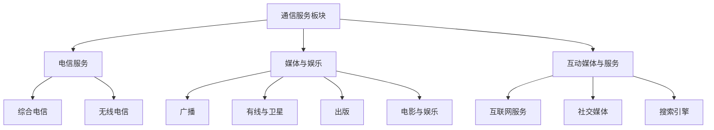

# 美国通信服务板块总览

## 概述

通信服务板块（Communication Services Sector）是美国股市的重要组成部分，涵盖了电信运营商、媒体娱乐、互动媒体和社交平台等多个细分领域。该板块在 2018 年 GICS（全球行业分类标准）重组后正式成立，从原有的电信服务板块扩展而来，纳入了部分原属于科技和消费板块的互联网和媒体公司。

**学习目标**：
- 理解通信服务板块的结构和演变历史
- 掌握各细分领域的商业模式和竞争格局
- 分析板块的投资特征和估值方法
- 识别长期投资机会和风险因素

## 板块结构与分类

### GICS 2018 重组

2018 年 9 月，MSCI 和 S&P 对 GICS 进行了重大调整，创建了通信服务板块：

### 三大细分领域

**1. 电信服务（Telecommunication Services）**
- 综合电信运营商
- 无线通信服务商
- 固定电话和宽带提供商
- 代表公司：Verizon, AT&T, T-Mobile

**2. 媒体与娱乐（Media & Entertainment）**
- 传统广播电视
- 有线电视运营商
- 电影制作与发行
- 音乐和出版
- 代表公司：Disney, Comcast, Warner Bros. Discovery

**3. 互动媒体与服务（Interactive Media & Services）**
- 社交媒体平台
- 搜索引擎
- 在线视频平台
- 数字广告
- 代表公司：Meta (Facebook), Alphabet (Google), Netflix

## 板块规模与市值分布

### 市值占比

截至 2024 年初，通信服务板块在 S&P 500 中的占比：

- **板块总市值**：约 3.5 万亿美元
- **S&P 500 占比**：约 8-9%
- **公司数量**：约 25 家
- **市值集中度**：前 5 大公司占板块市值的 70%+

### 头部公司

| 公司 | 市值（亿美元） | 细分领域 | 权重 |
|------|---------------|----------|------|
| Meta (META) | 8,000+ | 社交媒体 | 23% |
| Alphabet (GOOGL) | 部分权重 | 搜索/广告 | 20% |
| Netflix (NFLX) | 2,000+ | 流媒体 | 6% |
| Comcast (CMCSA) | 1,500+ | 有线/媒体 | 4% |
| Disney (DIS) | 1,800+ | 娱乐/流媒体 | 5% |
| Verizon (VZ) | 1,600+ | 电信 | 5% |
| AT&T (T) | 1,100+ | 电信 | 3% |

## 商业模式分析

### 电信运营商模式

**特征**：
- 资本密集型，需要大量基础设施投资
- 高固定成本，规模经济显著
- 稳定的现金流和股息
- 监管严格，竞争格局相对稳定

**收入来源**：
1. 无线服务订阅费（60-70%）
2. 固定宽带服务（15-20%）
3. 企业解决方案（10-15%）
4. 设备销售（5-10%）

**关键指标**：
- ARPU（每用户平均收入）
- 用户流失率（Churn Rate）
- 网络覆盖和质量
- 资本支出占收入比

### 媒体娱乐模式

**传统媒体转型**：
- 从线性电视向流媒体转型
- 内容制作与分发整合
- 直接面向消费者（DTC）策略
- 广告与订阅混合模式

**收入来源**：
1. 订阅收入（流媒体）
2. 广告收入
3. 内容授权
4. 主题公园和衍生品（Disney）

**关键指标**：
- 订阅用户数增长
- 每用户平均收入（ARPU）
- 内容投资回报率
- 用户参与度

### 互动媒体模式

**平台经济特征**：
- 网络效应强大
- 边际成本低
- 数据驱动的广告模式
- 高利润率

**收入来源**：
1. 数字广告（Meta, Google 主要收入）
2. 订阅服务（Netflix, YouTube Premium）
3. 云服务和其他（Google Cloud）
4. 电商和支付（部分平台）

**关键指标**：
- 日活/月活用户（DAU/MAU）
- 用户参与时长
- 广告加载率和 CPM
- 平台生态系统健康度

## 行业趋势与驱动因素

### 1. 5G 网络部署

**影响**：
- 电信运营商大规模资本支出
- 新应用场景：物联网、自动驾驶、工业互联网
- 网络速度和容量大幅提升
- 边缘计算和低延迟应用

**投资机会**：
- 5G 基础设施建设受益者
- 5G 应用开发商
- 网络设备供应商

### 2. 流媒体革命

**趋势**：
- 传统有线电视用户持续流失（Cord-cutting）
- 流媒体平台竞争加剧
- 内容成本上升
- 广告支持的流媒体（AVOD）兴起

**市场格局**：
- Netflix：全球领先，内容投资巨大
- Disney+：快速增长，IP 优势明显
- Amazon Prime Video：捆绑策略
- Apple TV+：高质量内容，生态整合
- HBO Max, Paramount+, Peacock：传统媒体转型

### 3. 数字广告增长

**驱动因素**：
- 广告预算从传统媒体向数字平台转移
- 精准定位和效果衡量优势
- 移动广告快速增长
- 视频广告需求旺盛

**挑战**：
- 隐私监管加强（GDPR, CCPA）
- Cookie 淘汰
- 广告拦截技术
- 平台竞争加剧

### 4. 内容为王

**趋势**：
- 原创内容投资持续增加
- IP 价值凸显
- 全球化内容分发
- 用户生成内容（UGC）崛起

**竞争要素**：
- 内容库的深度和广度
- 独家内容和 IP
- 内容制作能力
- 全球分发网络

## 财务特征与估值

### 板块财务特征

**电信运营商**：
- 收入增长：低个位数（1-3%）
- 利润率：EBITDA 30-40%，净利润 10-15%
- 资本支出：收入的 15-20%
- 股息率：4-6%
- 杠杆：债务/EBITDA 2-3x

**媒体娱乐**：
- 收入增长：中个位数（5-10%）
- 利润率：EBITDA 20-30%，净利润 5-15%
- 资本支出：收入的 10-15%
- 股息率：0-3%（转型期降低）
- 杠杆：债务/EBITDA 2-4x

**互动媒体**：
- 收入增长：双位数（10-30%）
- 利润率：EBITDA 30-50%，净利润 15-30%
- 资本支出：收入的 10-20%
- 股息率：0%（多数不分红）
- 杠杆：净现金或低杠杆

### 估值方法

**电信运营商**：
- EV/EBITDA：6-8x
- P/E：8-12x
- 股息折现模型（DDM）
- 自由现金流折现（DCF）

**媒体娱乐**：
- EV/EBITDA：8-12x
- P/E：15-25x
- EV/订阅用户
- DCF（考虑转型期）

**互动媒体**：
- P/E：20-40x
- EV/Sales：5-10x
- P/MAU（每月活跃用户）
- DCF（高增长假设）

## 投资机会与风险

### 投资机会

**1. 5G 基础设施建设周期**
- 电信运营商受益于网络升级
- 设备供应商订单增加
- 新应用场景带来增量收入

**2. 流媒体市场扩张**
- 全球订阅用户持续增长
- 广告支持模式提供新增长点
- 内容 IP 价值提升

**3. 数字广告长期增长**
- 广告预算持续向数字平台转移
- 新广告形式（短视频、直播）
- 电商广告快速增长

**4. 并购整合机会**
- 行业整合带来协同效应
- 内容库整合
- 技术和平台整合

### 主要风险

**1. 监管风险**
- 反垄断审查加强
- 隐私保护法规
- 内容审查和责任
- 网络中立性

**2. 技术变革风险**
- 新技术颠覆现有商业模式
- 平台竞争加剧
- 用户习惯快速变化

**3. 竞争风险**
- 流媒体市场竞争白热化
- 内容成本持续上升
- 价格战压力
- 新进入者威胁

**4. 宏观经济风险**
- 广告支出对经济周期敏感
- 消费者订阅疲劳
- 汇率波动（全球业务）

**5. 内容风险**
- 内容投资回报不确定
- IP 老化
- 创意人才流失
- 内容争议

## 投资策略建议

### 价值投资视角

**电信运营商**：
- 适合寻求稳定股息的投资者
- 关注自由现金流和股息可持续性
- 评估 5G 投资回报
- 注意债务水平

**媒体娱乐**：
- 关注流媒体转型进展
- 评估内容 IP 价值
- 分析订阅用户增长质量
- 注意转型期的现金流压力

**互动媒体**：
- 关注用户增长和参与度
- 评估广告业务健康度
- 分析监管风险
- 注意估值水平

### 成长投资视角

**关注领域**：
1. 流媒体平台的全球扩张
2. 5G 应用场景的创新者
3. 新兴社交媒体平台
4. 数字广告技术公司

**评估标准**：
- 用户增长速度和质量
- 市场份额提升
- 技术创新能力
- 管理团队执行力

### 组合配置建议

**防御性配置**：
- 电信运营商：30-40%
- 成熟媒体公司：30-40%
- 成长型平台：20-30%

**进取性配置**：
- 电信运营商：10-20%
- 成熟媒体公司：20-30%
- 成长型平台：50-70%

## 关键公司概览

### 电信运营商

**Verizon (VZ)**：
- 美国最大的无线运营商
- 网络质量领先
- 稳定的股息支付
- 5G 网络部署积极

**AT&T (T)**：
- 综合电信服务商
- 剥离媒体资产后聚焦核心业务
- 高股息率
- 债务水平较高

**T-Mobile (TMUS)**：
- 与 Sprint 合并后成为第二大运营商
- 增长最快的运营商
- 5G 网络覆盖广
- 创新的定价策略

### 媒体娱乐

**Disney (DIS)**：
- 全球娱乐巨头
- 强大的 IP 组合
- Disney+ 快速增长
- 主题公园业务恢复

**Comcast (CMCSA)**：
- 最大的有线电视运营商
- NBCUniversal 媒体资产
- Peacock 流媒体平台
- 主题公园业务

**Warner Bros. Discovery (WBD)**：
- WarnerMedia 与 Discovery 合并
- 丰富的内容库
- HBO Max 流媒体
- 整合协同效应

### 互动媒体

**Meta (META)**：
- Facebook, Instagram, WhatsApp
- 全球最大的社交媒体平台
- 数字广告双寡头之一
- 元宇宙战略投资

**Alphabet (GOOGL)**：
- Google 搜索和 YouTube
- 数字广告双寡头之一
- 云计算业务增长
- AI 技术领先

**Netflix (NFLX)**：
- 全球流媒体领导者
- 原创内容投资巨大
- 广告支持层级推出
- 国际市场扩张

## 行业对比分析

### 与科技板块的区别

**通信服务**：
- 更注重内容和媒体
- 监管更严格
- 资本密集度更高（电信）
- 增长速度相对较慢

**科技板块**：
- 更注重技术创新
- 软件和硬件为主
- 利润率通常更高
- 增长速度更快

### 与消费板块的区别

**通信服务**：
- 数字化和平台化
- 网络效应显著
- 全球化程度更高
- 技术驱动更强

**消费板块**：
- 实体产品为主
- 品牌和渠道重要
- 区域性更强
- 供应链管理关键

## 未来展望

### 短期趋势（1-2 年）

1. **5G 网络建设高峰**
   - 电信运营商资本支出维持高位
   - 5G 用户渗透率提升
   - 新应用场景逐步落地

2. **流媒体竞争加剧**
   - 用户增长放缓
   - 价格竞争和捆绑策略
   - 广告模式成为新增长点

3. **数字广告复苏**
   - 宏观经济改善带动广告支出
   - AI 驱动的广告优化
   - 隐私监管适应期

### 中期趋势（3-5 年）

1. **5G 应用成熟**
   - 物联网、自动驾驶等应用规模化
   - 边缘计算普及
   - 企业 5G 解决方案增长

2. **流媒体市场整合**
   - 并购和合作增加
   - 全球化扩张
   - 内容差异化竞争

3. **新媒体形式崛起**
   - 短视频持续增长
   - 直播电商
   - 虚拟现实内容

### 长期趋势（5-10 年）

1. **6G 技术研发**
   - 下一代通信技术
   - 更高速度和更低延迟
   - 新应用场景

2. **元宇宙发展**
   - 虚拟世界和数字资产
   - 沉浸式体验
   - 新的社交和娱乐形式

3. **AI 驱动的内容创作**
   - 个性化内容推荐
   - AI 生成内容
   - 内容制作效率提升

## 实战应用

### 投资决策框架

**第一步：确定投资目标**
- 收益目标：股息收入 vs 资本增值
- 风险承受能力
- 投资期限

**第二步：选择细分领域**
- 电信：稳定股息，低增长
- 媒体：转型期，中等风险
- 互动媒体：高增长，高波动

**第三步：公司筛选**
- 财务健康度
- 竞争地位
- 管理团队
- 估值水平

**第四步：持续监控**
- 用户增长指标
- 财务表现
- 行业动态
- 监管变化

### 常见误区

1. **忽视技术变革风险**
   - 通信服务行业技术变化快
   - 需要持续关注新技术和新竞争者

2. **过度关注股息率**
   - 高股息可能意味着增长乏力
   - 需要评估股息可持续性

3. **低估内容成本**
   - 流媒体竞争导致内容成本飙升
   - 影响利润率和现金流

4. **忽视监管风险**
   - 反垄断和隐私监管日益严格
   - 可能影响商业模式

## 延伸阅读

### 推荐书籍

1. **《The Innovator's Dilemma》** - Clayton Christensen
   - 理解媒体行业的颠覆性创新

2. **《Streaming, Sharing, Stealing》** - Michael D. Smith & Rahul Telang
   - 数字时代的媒体经济学

3. **《The Attention Merchants》** - Tim Wu
   - 注意力经济的历史和未来

4. **《Platform Revolution》** - Geoffrey Parker, Marshall Van Alstyne, Sangeet Paul Choudary
   - 平台商业模式分析

### 行业报告

- GSMA《The Mobile Economy》年度报告
- PwC《Global Entertainment & Media Outlook》
- eMarketer 数字广告市场报告
- Deloitte《Digital Media Trends》

### 相关文章

- 科技板块总览
- [消费板块总览](../consumer/overview.html)
- [行业分析框架](../../industry-analysis/overview.html)
- [平台型商业模式](../../../03-company-analysis/business-models/platform-business.html)

## 参考文献

1. S&P Dow Jones Indices. (2018). "GICS Reclassification"
2. Federal Communications Commission. "Broadband Deployment Report" (Annual)
3. Nielsen. "Total Audience Report" (Quarterly)
4. IAB. "Internet Advertising Revenue Report" (Annual)
5. Deloitte. "Digital Media Trends Survey" (Annual)
6. McKinsey & Company. "The Future of Media" (2023)
7. Boston Consulting Group. "Winning in the Streaming Wars" (2022)
8. Morgan Stanley Research. "Communication Services Sector Analysis" (2024)
9. Goldman Sachs. "The Future of Entertainment" (2023)
10. Bernstein Research. "Telecom Services Deep Dive" (2024)
