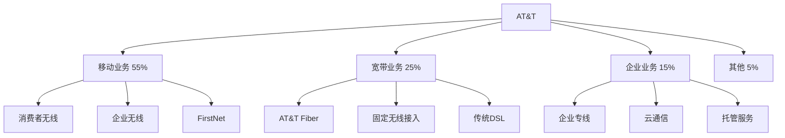

# AT&T - 战略重组后的电信巨头

## 公司概况

**基本信息**：
- 成立时间：1983年（AT&T拆分后的地区贝尔公司之一）
- 历史渊源：贝尔电话公司（1877年，亚历山大·格雷厄姆·贝尔创立）
- 总部：德克萨斯州达拉斯
- 上市：NYSE: T
- 市值：约1,100-1,300亿美元
- 员工数：约16万人
- 年收入：约1,200-1,300亿美元

**主营业务（2022年重组后）**：
- 无线通信服务（AT&T Wireless）
- 固定宽带（AT&T Fiber）
- 企业解决方案
- FirstNet（公共安全网络）

**行业地位**：
- 美国第二大无线运营商
- 美国最大固定宽带运营商之一
- 全球最大电信公司之一
- 标普500成分股

## 战略转型历程

### 多元化扩张时代（2015-2021）

**DirecTV收购（2015年，485亿美元）**：
- 进入付费电视市场
- 战略逻辑：内容+分发
- 结果：付费电视用户持续流失
- 教训：错误的多元化

**Time Warner收购（2018年，854亿美元）**：
- 进入媒体内容
- 获得HBO、CNN、华纳兄弟
- 战略逻辑：垂直整合
- 结果：债务激增，协同效应有限

**多元化失败原因**：
- 核心电信业务被忽视
- 债务水平失控
- 管理精力分散
- 媒体行业转型加速

### 战略重组（2021-2022）

**剥离WarnerMedia（2022年）**：
- 与Discovery合并成立Warner Bros. Discovery
- AT&T获得约430亿美元现金
- 大幅降低债务
- 聚焦核心电信业务

**剥离DirecTV（2021年）**：
- 出售30%股权给TPG
- 保留70%股权
- 计划进一步减持
- 付费电视业务独立运营

**重组意义**：
- 债务从1,800亿降至1,300亿
- 聚焦5G和光纤
- 股息削减（从$2.08降至$1.11）
- 重新出发

## 商业模式分析

### 业务结构（重组后）

### 核心业务分析

**1. 移动业务**

**用户规模**：
- 后付费用户：约7,100万
- 预付费用户：约1,800万
- 总无线用户：约2.3亿（含批发）

**ARPU**：
- 后付费ARPU：约55美元/月
- 行业中等水平
- 提升空间有限

**FirstNet优势**：
- 公共安全专用网络
- 政府合同保障
- 差异化竞争优势
- 用户：约500万（警察、消防、急救）

**2. AT&T Fiber（光纤宽带）**

**战略重点**：
- 2025年目标：覆盖3,000万用户
- 2023年底：覆盖约2,400万
- 用户数：约800万
- 增长最快的业务

**竞争优势**：
- 光纤速度优势（1Gbps+）
- 捆绑销售（无线+宽带）
- 低流失率
- ARPU高于铜线

**挑战**：
- 建设成本高
- 与有线运营商竞争
- 覆盖扩张需要时间

**3. 企业业务**

**传统企业服务**：
- 专线、MPLS
- 持续萎缩
- 向云迁移

**新兴企业服务**：
- 5G企业解决方案
- 云通信（UCaaS）
- 物联网
- 增长中

## 财务分析

### 历史财务表现

| 年份 | 收入（亿美元） | EBITDA（亿美元） | 净利润（亿美元） | 自由现金流（亿美元） |
|------|--------------|----------------|----------------|-------------------|
| 2019 | 1,812 | 580 | 140 | 290 |
| 2020 | 1,714 | 560 | 29 | 270 |
| 2021 | 1,683 | 540 | 200 | 260 |
| 2022 | 1,207* | 420 | 170 | 140 |
| 2023 | 1,220 | 430 | 140 | 165 |

*2022年剥离WarnerMedia后口径

**收入趋势**：
- 重组后收入大幅下降（剥离媒体）
- 核心电信收入稳定
- 光纤业务增长
- 传统业务萎缩

### 盈利能力

**利润率**：
- EBITDA利润率：约35%
- 营业利润率：约15%
- 净利率：约11%

**与同行对比**：
- EBITDA利润率高于Verizon（31%）
- 但增长低于T-Mobile
- 资本效率有待提升

### 现金流分析

**自由现金流**：
- 2023年：约165亿美元
- 目标：2024年约170亿美元
- 股息支出：约80亿美元
- FCF覆盖股息：约2倍

**资本支出**：
- 2023年：约240亿美元
- 主要用于：5G建设、光纤扩张
- 2024年目标：约210亿美元（下降）
- 资本支出高峰已过

### 资产负债表

**债务状况（2023年）**：
- 总债务：约1,400亿美元
- 净债务：约1,300亿美元
- 净债务/EBITDA：约3.0倍
- 目标：2025年降至2.5倍以下

**去杠杆进展**：
- 2022年：净债务1,700亿
- 2023年：净债务1,300亿
- 进展良好
- 但仍高于Verizon

### 股息政策

**股息历史**：
- 2022年前：$2.08/股/年（连续增长36年）
- 2022年削减：$1.11/股/年（降低47%）
- 当前股息率：约7-8%
- 削减原因：剥离WarnerMedia，重新出发

**股息可持续性**：
- FCF覆盖率：约2倍
- 派息比率：约50%
- 短期安全
- 未来可能恢复增长

## 竞争分析

### 三大运营商对比

| 指标 | AT&T | Verizon | T-Mobile |
|------|------|---------|----------|
| 无线用户（百万） | 108 | 115 | 104 |
| 市场份额 | 29% | 31% | 28% |
| 5G覆盖 | 广（低频） | 中（C-Band） | 最广 |
| 光纤用户（百万） | 8 | 0 | 0 |
| 净债务/EBITDA | 3.0x | 3.3x | 2.5x |
| 股息率 | 7-8% | 6-7% | 1.5% |

### 竞争优势

**FirstNet**：
- 公共安全专用网络
- 政府合同保障
- 差异化竞争
- 难以复制

**AT&T Fiber**：
- 光纤覆盖扩张
- 速度优势
- 捆绑销售
- 低流失率

**企业市场**：
- 长期企业关系
- 全球网络
- 综合解决方案

### 竞争劣势

**5G网络**：
- 相对Verizon和T-Mobile落后
- C-Band频谱较少
- 速度排名靠后

**品牌形象**：
- 多年战略失误
- 股息削减影响信任
- 需要重建

**增长动力**：
- 无线用户增长放缓
- 传统业务萎缩
- 光纤是主要增长点

## 5G战略

### 频谱组合

**低频段（850MHz、700MHz）**：
- 覆盖范围广
- 穿透力强
- 速度有限
- 全国覆盖基础

**中频段（C-Band，3.45GHz）**：
- 2021年拍卖：约230亿美元
- 覆盖和速度平衡
- 部署中

**高频段（毫米波）**：
- 有限部署
- 主要城市核心区
- 速度极快

### 5G部署进度

**覆盖**：
- 5G覆盖：约2.9亿人口（2023年底）
- 中频段覆盖：约1.75亿人口
- 目标：2024年中频段覆盖2亿+

**与竞争对手对比**：
- T-Mobile：5G覆盖最广（低频段优势）
- Verizon：C-Band速度领先
- AT&T：覆盖广但速度相对低

## 光纤战略

### AT&T Fiber扩张

**建设目标**：
- 2025年：覆盖3,000万用户
- 2023年底：覆盖约2,400万
- 年增加约300-400万覆盖

**投资规模**：
- 年度光纤资本支出：约60-70亿美元
- 每通过（Passings）成本：约1,000美元
- 每连接（Connection）成本：约500美元

**商业模式**：
- 月费：约55-80美元（1Gbps）
- 捆绑折扣：无线+光纤
- 目标渗透率：约35-40%

**竞争格局**：
- 主要竞争对手：Comcast、Charter
- 有线运营商速度升级
- 价格竞争
- 光纤优势：速度、对称上下行

## 投资论点

### 看多理由

**1. 战略聚焦**
- 剥离媒体，回归电信
- 管理精力集中
- 资本配置改善

**2. 光纤增长**
- AT&T Fiber快速增长
- 高ARPU、低流失率
- 长期增长引擎

**3. 高股息率**
- 约7-8%股息率
- FCF覆盖充足
- 适合收益型投资者

**4. 去杠杆进展**
- 债务持续下降
- 财务灵活性提升
- 信用评级稳定

**5. 低估值**
- P/E约7-8倍
- EV/EBITDA约6倍
- 相对历史低位

### 风险因素

**1. 债务负担**
- 净债务仍高（1,300亿）
- 利率上升影响
- 去杠杆需要时间

**2. 竞争压力**
- T-Mobile持续抢占份额
- 有线运营商进入无线
- 价格战风险

**3. 传统业务萎缩**
- 固话、传统企业服务
- 持续拖累收入
- 难以逆转

**4. 5G落后**
- 相对竞争对手网络质量
- 频谱投入不足
- 用户体验影响

**5. 执行风险**
- 光纤建设进度
- 成本控制
- 管理层稳定性

## 估值分析

### 相对估值（2023年）

| 指标 | AT&T | Verizon | T-Mobile |
|------|------|---------|----------|
| P/E | 7-8x | 8-9x | 20-22x |
| EV/EBITDA | 6-7x | 6.5-7x | 9-10x |
| P/FCF | 7-8x | 7-8x | 25-30x |
| 股息率 | 7-8% | 6-7% | 1.5% |

**估值评估**：
- 相对Verizon略有折价（战略失误历史）
- 相对T-Mobile大幅折价（增长差异）
- 绝对估值偏低，反映风险

### DCF估值

**假设**：
- 收入增长：1-2%（核心电信）
- EBITDA利润率：35-36%
- 资本支出：收入的17-18%
- WACC：7%
- 永续增长率：0.5%

**估值结果**：
- 每股内在价值：$18-22
- 当前股价（假设$16）：低估10-35%

## 投资策略

### 适合投资者类型

**收益型投资者**：
- 高股息率（7-8%）
- 稳定现金流
- 防御性特征

**价值投资者**：
- 低估值
- 战略重组后重估
- 耐心等待

**不适合**：
- 成长型投资者
- 短期交易者
- 低风险偏好者（债务风险）

### 监测指标

**季度关注**：
- 无线净增用户
- AT&T Fiber用户增长
- 自由现金流
- 净债务变化

**年度关注**：
- 光纤覆盖进度
- 去杠杆进展
- 5G部署
- 股息政策

## 关键学习点

**1. 多元化的陷阱**
- 电信公司进入媒体的失败
- 核心竞争力的重要性
- 债务风险

**2. 战略重组的价值**
- 剥离非核心业务
- 聚焦核心竞争力
- 重建财务健康

**3. 股息削减的影响**
- 短期股价冲击
- 长期可持续性更重要
- 投资者信任重建

**4. 光纤的战略价值**
- 差异化竞争
- 高质量用户
- 长期增长

**5. 去杠杆的重要性**
- 高债务限制灵活性
- 影响股东回报
- 需要时间和纪律

## 参考文献

1. AT&T Inc. (2023). *Annual Report*.
2. FCC. (2023). "Wireless Competition Report".
3. Goldman Sachs. (2023). "AT&T Analysis".
4. Morgan Stanley. (2023). "Telecom Sector Review".
5. J.P. Morgan. (2023). "AT&T: Post-Restructuring".
6. Bernstein Research. (2023). "AT&T Fiber Strategy".
7. Credit Suisse. (2023). "US Telecom Outlook".
8. Barclays. (2023). "AT&T Dividend Analysis".
