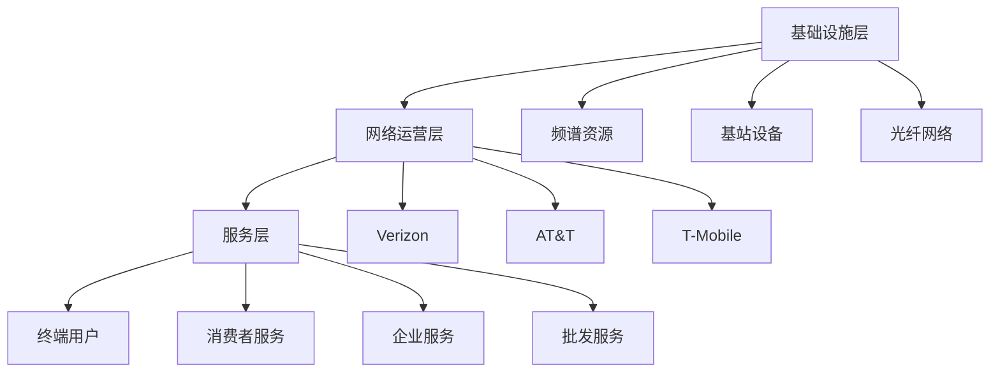

# 美国电信行业概览

## 行业定义与范围

### 电信服务分类

**无线通信（Wireless）**：
- 移动语音和数据服务
- 4G LTE、5G网络
- 消费者和企业市场
- 占行业收入约60%

**固定宽带（Fixed Broadband）**：
- 家庭和企业互联网
- 光纤、DSL、有线
- 固定无线接入（FWA）
- 占行业收入约20%

**企业服务（Enterprise）**：
- 专线、VPN
- 云通信
- 物联网（IoT）
- 托管服务
- 占行业收入约15%

**传统固话（Legacy Wireline）**：
- 固定电话（持续萎缩）
- 传统企业数据
- 占行业收入约5%

### 产业链结构

## 市场结构

### 三大运营商格局

**美国无线市场（2023年）**：

| 运营商 | 市场份额 | 用户数（百万） | 市值（亿美元） |
|--------|---------|---------------|--------------|
| Verizon | 31% | 115 | 1,600 |
| AT&T | 29% | 108 | 1,200 |
| T-Mobile | 28% | 104 | 1,800 |
| 其他（MVNO等） | 12% | 45 | - |

**市场集中度**：
- CR3（前三名）：88%
- 高度集中市场
- 监管关注并购

### 竞争演变历史

**2000年代**：
- AT&T、Verizon、Sprint、T-Mobile四强
- 价格竞争激烈
- 网络质量差异大

**2013-2018年**：
- T-Mobile"无运营商"战略
- 价格战加剧
- 行业整合压力

**2020年**：
- T-Mobile收购Sprint（265亿美元）
- 三强格局形成
- 竞争格局稳定

**2020年至今**：
- 5G建设竞赛
- 固定无线接入（FWA）新战场
- 企业市场争夺

## 5G革命

### 5G技术特征

**三大频段**：

**低频段（Sub-1GHz）**：
- 覆盖范围：广（数十公里）
- 速度：100-300 Mbps
- 穿透力：强
- 适用：农村、广域覆盖

**中频段（1-6GHz，C-Band）**：
- 覆盖范围：中（数公里）
- 速度：300-1,000 Mbps
- 平衡覆盖和速度
- 适用：城市、郊区

**高频段（毫米波，mmWave，>24GHz）**：
- 覆盖范围：小（数百米）
- 速度：1-10 Gbps
- 延迟：极低（<1ms）
- 适用：密集城区、特定场景

### 各运营商5G策略

**Verizon**：
- 早期押注毫米波（2018-2020）
- 后转向C-Band（2021年，450亿美元频谱）
- 2023年底C-Band覆盖2.3亿人口
- 企业5G应用领先

**AT&T**：
- 均衡策略：低频+中频
- FirstNet（公共安全网络）优势
- 企业市场聚焦
- 5G覆盖广但速度相对低

**T-Mobile**：
- 低频段（600MHz）广覆盖
- 中频段（2.5GHz，Sprint遗产）速度优势
- 5G覆盖最广
- 消费者市场增长最快

### 5G应用场景

**消费者应用**：
- 增强移动宽带（eMBB）
- 固定无线接入（FWA）替代有线宽带
- 云游戏、AR/VR
- 4K/8K视频流

**企业应用**：
- 工业物联网（IIoT）
- 私有5G网络
- 远程医疗
- 智能制造

**公共服务**：
- 智慧城市
- 公共安全通信
- 交通管理
- 应急响应

### 固定无线接入（FWA）

**新战场**：
- 用5G替代有线宽带
- 目标：有线宽带用户
- 竞争对手：Comcast、Charter

**T-Mobile FWA**：
- 2023年用户：约500万
- 增长最快
- 价格优势

**Verizon FWA**：
- 2023年用户：约300万
- 聚焦城市
- 高速度

**市场潜力**：
- 美国宽带用户：约1亿
- FWA可渗透：约20-30%
- 长期增长机会

## 财务特征

### 行业财务模型

**收入结构**：
- 服务收入：稳定，经常性
- 设备收入：波动，低利润
- 其他收入：增长，多元化

**成本结构**：
- 网络运营成本：约30%收入
- 销售和营销：约15%收入
- 一般管理费用：约10%收入
- 折旧摊销：约15%收入

**EBITDA利润率**：
- 行业平均：30-35%
- Verizon：约31%
- AT&T：约35%
- T-Mobile：约38%

### 资本密集度

**年度资本支出**：
- Verizon：约180-200亿美元
- AT&T：约200-220亿美元
- T-Mobile：约130-150亿美元

**资本支出/收入**：
- 行业平均：14-18%
- 5G建设高峰期更高
- 成熟期下降

**频谱成本**：
- 2021年C-Band拍卖：约810亿美元（三家合计）
- Verizon：约450亿美元
- AT&T：约230亿美元
- T-Mobile：约90亿美元

### 债务水平

**净债务（2023年）**：
- Verizon：约1,400亿美元
- AT&T：约1,300亿美元
- T-Mobile：约700亿美元

**净债务/EBITDA**：
- Verizon：约3.3倍
- AT&T：约3.0倍
- T-Mobile：约2.5倍

**去杠杆压力**：
- 频谱拍卖增加债务
- 管理层承诺降低杠杆
- 影响股东回报

## 竞争分析

### 竞争维度

**网络质量**：
- Verizon：传统领先，C-Band追赶
- AT&T：中等，FirstNet优势
- T-Mobile：5G覆盖最广，速度领先

**价格**：
- T-Mobile：最激进，价格战发起者
- AT&T：中等
- Verizon：最高，品质溢价

**企业市场**：
- Verizon：最强，98%财富500强
- AT&T：第二，FirstNet优势
- T-Mobile：追赶中

**用户增长**：
- T-Mobile：最快（从Sprint合并受益）
- AT&T：稳定
- Verizon：放缓

### 护城河分析

**行业护城河**：
- 频谱资源：稀缺，政府许可
- 网络基础设施：巨额投资壁垒
- 用户转换成本：合约、设备分期
- 品牌认知度：长期建立

**护城河宽度**：中等
- 技术变革可能削弱优势
- 价格竞争持续
- 新进入者（卫星通信）威胁

### 新威胁

**卫星通信**：
- SpaceX Starlink：低轨卫星宽带
- Amazon Kuiper：竞争对手
- 农村市场威胁
- 城市市场影响有限

**有线运营商**：
- Comcast、Charter进入无线
- MVNO模式
- 捆绑销售竞争

**科技公司**：
- Google Fi：MVNO
- Apple：潜在威胁
- 边缘计算竞争

## 监管环境

### 主要监管机构

**FCC（联邦通信委员会）**：
- 频谱管理和拍卖
- 网络中立性
- 并购审查
- 消费者保护

**DOJ（司法部）**：
- 反垄断审查
- 并购批准
- 竞争政策

**州级监管**：
- 各州公用事业委员会
- 地方许可
- 消费者保护

### 关键监管议题

**网络中立性**：
- 争议持续
- 影响商业模式
- 政治敏感

**频谱政策**：
- 中频段拍卖
- 共享频谱
- 国防频谱释放

**农村宽带**：
- 政府补贴（BEAD计划）
- 覆盖要求
- 竞争格局影响

**隐私保护**：
- 数据使用限制
- 位置数据
- 合规成本

## 投资分析框架

### 关键指标

**用户指标**：
- 净增用户（Net Adds）：最重要
- 用户流失率（Churn Rate）：<1%为佳
- 每用户平均收入（ARPU）：趋势
- 后付费用户占比：质量指标

**财务指标**：
- 服务收入增长：核心
- EBITDA利润率：效率
- 自由现金流：股东回报基础
- 净债务/EBITDA：财务健康

**运营指标**：
- 网络质量排名（RootMetrics、Ookla）
- 5G覆盖进度
- 资本支出效率

### 估值方法

**EV/EBITDA**：
- 行业最常用
- 行业平均：6-8倍
- 考虑增长差异

**DCF估值**：
- 稳定现金流，适合DCF
- 关键假设：收入增长、利润率
- WACC：6-8%

**股息折现模型**：
- 高股息率公司适用
- Verizon、AT&T
- 股息可持续性分析

### 投资策略

**收益型投资**：
- Verizon、AT&T
- 高股息率（6-7%）
- 防御性特征
- 适合退休账户

**成长型投资**：
- T-Mobile
- 用户增长最快
- 利润率提升空间
- 较低股息率

**价值投资**：
- AT&T（低估值）
- 去杠杆进展
- 业务聚焦后
- 潜在重估

## 行业趋势

### 短期趋势（1-3年）

**5G成熟**：
- 覆盖扩大
- 应用场景增加
- ARPU提升
- 资本支出下降

**FWA增长**：
- 宽带市场份额提升
- 新收入来源
- 竞争加剧

**企业市场**：
- 私有5G网络
- IoT增长
- 云通信

### 中长期趋势（3-10年）

**6G研发**：
- 2030年代商用
- 新一轮投资周期
- 技术路线不确定

**AI整合**：
- 网络智能化
- 客服自动化
- 运营效率提升

**边缘计算**：
- 与5G协同
- 新商业模式
- 企业市场机会

**卫星融合**：
- 地面+卫星
- 无缝覆盖
- 新竞争格局

## 关键学习点

1. 美国电信是三强寡头市场，竞争格局相对稳定
2. 5G是当前最重要的投资主题，各运营商策略不同
3. 高资本密集度和债务水平是行业特征，影响股东回报
4. 电信股适合收益型投资者，但增长有限
5. T-Mobile是行业增长最快的公司，但估值更高

## 参考文献

1. FCC. (2023). "Wireless Competition Report".
2. GSMA. (2023). "The Mobile Economy North America".
3. Ookla. (2023). "5G Speedtest Intelligence".
4. RootMetrics. (2023). "US Network Performance".
5. Goldman Sachs. (2023). "US Telecom Sector".
6. Morgan Stanley. (2023). "Telecom Industry Analysis".
7. J.P. Morgan. (2023). "Telecom Services Review".
