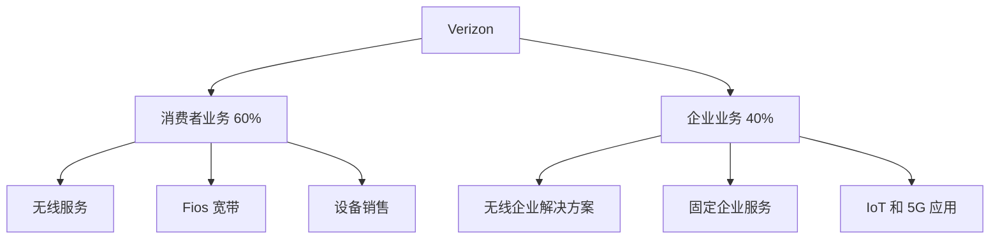

# Verizon Communications - 美国电信行业领导者

## 公司概况

**基本信息**：
- **股票代码**：VZ (NYSE)
- **成立时间**：2000 年（由 Bell Atlantic 和 GTE 合并）
- **总部**：美国纽约州纽约市
- **CEO**：Hans Vestberg（2018 年至今）
- **市值**：约 1,600 亿美元（2024 年初）
- **员工数**：约 11.7 万人

**主营业务**：
- 无线通信服务（Verizon Wireless）
- 固定宽带和电话服务（Verizon Fios）
- 企业解决方案和云服务
- 物联网（IoT）和 5G 企业应用

**行业地位**：
- 美国最大的无线运营商（按用户数）
- 网络质量和覆盖率行业领先
- 5G 网络部署的先行者
- 企业市场的主要供应商

## 商业模式分析

### 业务结构

### 收入来源（2023 年）

| 业务线 | 收入占比 | 增长率 | 利润率 |
|--------|---------|--------|--------|
| 无线服务 | 70% | 2-3% | 高 |
| 固定服务 | 20% | 持平 | 中 |
| 设备销售 | 10% | 波动 | 低 |

### 核心竞争力

**1. 网络质量优势**

Verizon 长期以来以网络质量著称：
- **覆盖率**：全美最广的 4G LTE 覆盖
- **速度**：下载和上传速度领先
- **可靠性**：网络稳定性和通话质量最佳
- **5G 部署**：C-Band 频谱投资巨大

**网络投资策略**：
- 年度资本支出：约 180-200 亿美元
- 资本支出占收入比：约 14-16%
- 重点投资 5G 和光纤网络
- C-Band 频谱拍卖投入 450 亿美元

**2. 品牌价值**

- 品牌认知度高："Can you hear me now?" 经典广告
- 企业客户信任度高
- 高端用户占比大
- 客户忠诚度行业领先

**3. 企业市场优势**

- 服务全球 98% 的财富 500 强企业
- 企业解决方案组合完整
- 5G 企业应用领先
- 物联网平台成熟

### 商业模式特点

**资本密集型**：
- 需要持续的网络投资
- 频谱拍卖需要大量资金
- 设备补贴和营销费用高

**规模经济**：
- 用户规模越大，单位成本越低
- 网络利用率提升带来利润率改善
- 采购和运营效率优势

**订阅模式**：
- 稳定的月度经常性收入
- 合约和分期付款锁定用户
- 追加销售和交叉销售机会

## 财务分析

### 收入表现

**历史收入（亿美元）**：

| 年份 | 总收入 | 增长率 | 无线服务收入 | 增长率 |
|------|--------|--------|--------------|--------|
| 2019 | 1,318 | -0.7% | 880 | 2.1% |
| 2020 | 1,283 | -2.7% | 870 | -1.1% |
| 2021 | 1,338 | 4.3% | 900 | 3.4% |
| 2022 | 1,364 | 1.9% | 920 | 2.2% |
| 2023 | 1,340 | -1.8% | 930 | 1.1% |

**收入趋势分析**：
- 无线服务收入稳定增长
- 固定服务收入持续下滑（传统电话）
- 设备收入波动较大
- 整体收入增长缓慢

### 盈利能力

**关键利润指标**：

| 指标 | 2021 | 2022 | 2023 | 行业平均 |
|------|------|------|------|----------|
| 毛利率 | 59% | 58% | 57% | 55% |
| EBITDA 利润率 | 33% | 32% | 31% | 30% |
| 营业利润率 | 21% | 20% | 19% | 18% |
| 净利润率 | 15% | 14% | 13% | 12% |

**盈利能力分析**：
- 利润率行业领先
- 近年来略有下降（5G 投资期）
- EBITDA 稳定在 400-430 亿美元
- 净利润约 180-220 亿美元

### 现金流分析

**自由现金流（亿美元）**：

| 年份 | 经营现金流 | 资本支出 | 自由现金流 | FCF 收益率 |
|------|-----------|---------|-----------|-----------|
| 2021 | 390 | 200 | 190 | 12% |
| 2022 | 380 | 230 | 150 | 9% |
| 2023 | 400 | 185 | 215 | 13% |

**现金流特点**：
- 经营现金流稳定强劲
- 资本支出周期性波动（5G 建设高峰）
- 自由现金流充足，支持股息和债务偿还
- FCF 转化率约 55-60%

### 资产负债表

**财务健康度**：

| 指标 | 2023 | 评价 |
|------|------|------|
| 总资产 | 3,800 亿美元 | 大型资产基础 |
| 总负债 | 3,200 亿美元 | 债务水平较高 |
| 股东权益 | 600 亿美元 | 权益占比低 |
| 净债务 | 1,400 亿美元 | 需要关注 |
| 净债务/EBITDA | 3.3x | 可接受范围 |
| 利息覆盖率 | 6.5x | 充足 |

**债务管理**：
- C-Band 频谱拍卖导致债务增加
- 管理层承诺降低杠杆
- 目标净债务/EBITDA 降至 2.5x 以下
- 债务期限结构合理

### 股东回报

**股息政策**：
- **股息率**：约 6-7%（2024 年初）
- **派息比率**：约 50-60%
- **连续派息**：17 年连续增长（至 2023 年）
- **年度股息**：每股约 2.60 美元

**股息可持续性分析**：
- 自由现金流充足覆盖股息
- 派息比率合理
- 管理层重视股东回报
- 短期内股息安全

**股票回购**：
- 2023 年暂停回购（降杠杆优先）
- 历史上有回购计划
- 未来可能恢复

## 竞争分析

### 行业格局

**美国无线市场份额（2023）**：

| 运营商 | 市场份额 | 用户数（百万） | 趋势 |
|--------|---------|---------------|------|
| Verizon | 31% | 115 | 稳定 |
| AT&T | 29% | 108 | 稳定 |
| T-Mobile | 28% | 104 | 增长 |
| 其他 | 12% | 45 | 下降 |

### 竞争对手比较

**vs. AT&T**：
- Verizon 网络质量更好
- AT&T 业务更多元化（媒体已剥离）
- Verizon 企业市场更强
- AT&T 债务水平更高

**vs. T-Mobile**：
- T-Mobile 增长更快
- T-Mobile 定价更激进
- Verizon 网络质量优势
- T-Mobile 5G 覆盖更广（低频段）

### 竞争优势（护城河）

**1. 网络质量护城河**
- 多年投资建立的网络优势
- 企业客户对质量要求高
- 高端用户愿意支付溢价
- 竞争对手难以短期赶超

**2. 规模优势**
- 用户规模带来成本优势
- 采购议价能力强
- 网络利用率高
- 营销费用摊薄

**3. 品牌护城河**
- 长期建立的品牌信任
- 企业市场认可度高
- 客户转换成本高
- 品牌溢价能力

**护城河宽度评估**：中等
- 网络质量优势正在缩小
- 价格竞争加剧
- 技术变革风险
- 但短期内优势仍然明显

## 5G 战略与执行

### 5G 网络部署

**频谱组合**：
1. **低频段（600-900 MHz）**：
   - 覆盖范围广
   - 穿透力强
   - 速度提升有限

2. **中频段 C-Band（3.7-3.98 GHz）**：
   - 平衡覆盖和速度
   - Verizon 投资重点
   - 450 亿美元频谱投资

3. **高频段毫米波（mmWave）**：
   - 速度极快
   - 覆盖范围小
   - 适合密集城区

**部署进度**：
- 2023 年底 C-Band 覆盖 2.3 亿人口
- 2024 年目标覆盖 2.5 亿人口
- 毫米波覆盖主要城市核心区
- 5G 用户渗透率超过 50%

### 5G 应用场景

**消费者应用**：
- 增强移动宽带
- 云游戏
- AR/VR 体验
- 4K/8K 视频流

**企业应用**：
- 智能制造
- 远程医疗
- 自动驾驶
- 智慧城市

**物联网（IoT）**：
- 工业物联网
- 智能农业
- 资产追踪
- 智能电网

### 5G 投资回报

**收入增长驱动**：
- 5G 套餐价格更高
- ARPU 提升
- 企业解决方案增长
- 新应用场景

**成本考虑**：
- 巨额资本支出
- 频谱成本摊销
- 运营成本增加
- 投资回报期较长

**预期回报**：
- 2025-2026 年开始显著贡献
- 企业市场是关键
- 需要新应用场景成熟
- 长期看好

## 投资分析

### 投资亮点

**1. 稳定的股息收入**
- 高股息率（6-7%）
- 股息增长历史
- 自由现金流支持
- 适合收益型投资者

**2. 防御性特征**
- 必需服务，需求稳定
- 经济周期影响小
- 现金流可预测
- 低贝塔值

**3. 5G 增长潜力**
- 网络投资高峰已过
- 5G 应用逐步成熟
- 企业市场机会大
- ARPU 提升空间

**4. 去杠杆进展**
- 管理层承诺降低债务
- 自由现金流改善
- 财务灵活性提升
- 信用评级稳定

### 投资风险

**1. 增长乏力**
- 无线市场接近饱和
- 用户增长放缓
- 价格竞争压力
- 收入增长低个位数

**2. 竞争加剧**
- T-Mobile 增长迅速
- 价格战风险
- 市场份额压力
- 利润率下降风险

**3. 技术变革**
- 6G 技术研发
- 新技术投资需求
- 现有网络折旧
- 技术路线不确定性

**4. 监管风险**
- 网络中立性
- 隐私保护
- 频谱政策
- 并购审查

**5. 债务负担**
- 净债务水平高
- 利率上升影响
- 财务灵活性受限
- 评级下调风险

### 估值分析

**当前估值（2024 年初）**：

| 指标 | Verizon | AT&T | T-Mobile | 行业平均 |
|------|---------|------|----------|----------|
| P/E | 8.5x | 7.5x | 22x | 12x |
| EV/EBITDA | 6.8x | 6.2x | 10x | 7.5x |
| P/B | 1.8x | 1.2x | 3.5x | 2.0x |
| 股息率 | 6.5% | 7.5% | 1.8% | 5.0% |

**估值评估**：
- 相对估值偏低
- 反映增长担忧和债务水平
- 股息率有吸引力
- 与 AT&T 估值相近

**DCF 估值**：

假设：
- 收入增长：1-2%
- EBITDA 利润率：31-32%
- 资本支出：收入的 14-15%
- WACC：7%
- 永续增长率：1%

**估值区间**：每股 40-48 美元
**当前股价**：约 38 美元（2024 年初）
**潜在上涨空间**：5-25%

### 投资建议

**适合投资者类型**：
- 收益型投资者（高股息）
- 保守型投资者（防御性）
- 退休账户配置
- 价值投资者（低估值）

**不适合投资者类型**：
- 成长型投资者
- 高风险偏好者
- 短期交易者

**配置建议**：
- 作为防御性持仓
- 股息再投资策略
- 长期持有（3-5 年+）
- 组合占比：5-10%（保守组合）

## 管理层与公司治理

### 管理团队

**CEO Hans Vestberg**：
- 2018 年上任
- 前爱立信 CEO
- 技术背景深厚
- 推动 5G 战略

**管理层评价**：
- 执行力强
- 战略清晰
- 资本配置合理
- 股东导向

### 公司治理

**董事会**：
- 独立董事占多数
- 行业经验丰富
- 多元化背景

**股东结构**：
- 机构投资者占 70%+
- Vanguard, BlackRock 等大型持仓
- 管理层持股适中
- 无控股股东

## 关键学习点

### 投资启示

1. **电信运营商的投资价值**
   - 稳定现金流和高股息
   - 防御性特征
   - 增长有限但可预测
   - 适合收益型投资组合

2. **网络质量的重要性**
   - 持续投资建立护城河
   - 企业客户愿意支付溢价
   - 品牌价值体现
   - 但优势可能缩小

3. **5G 投资的长期性**
   - 巨额前期投资
   - 回报周期长
   - 需要新应用场景
   - 企业市场是关键

4. **债务管理的重要性**
   - 资本密集型行业需要平衡
   - 过高杠杆限制灵活性
   - 去杠杆是当前重点
   - 影响股东回报

### 行业洞察

1. **无线市场成熟**
   - 用户增长放缓
   - 竞争焦点转向质量和服务
   - ARPU 提升是增长关键
   - 企业市场更重要

2. **技术周期**
   - 每代技术需要巨额投资
   - 投资高峰期利润率下降
   - 成熟期现金流改善
   - 需要把握周期

3. **监管环境**
   - 电信行业监管严格
   - 频谱政策影响大
   - 并购审查趋严
   - 需要关注政策变化

## 实战应用

### 投资决策框架

**买入信号**：
- 股息率超过 7%
- P/E 低于 8x
- 5G 资本支出高峰已过
- 债务水平下降

**持有信号**：
- 股息稳定增长
- 市场份额稳定
- 财务指标健康
- 估值合理

**卖出信号**：
- 股息削减
- 市场份额大幅下降
- 债务水平失控
- 竞争地位恶化

### 监控指标

**季度关注**：
- 无线用户净增数
- ARPU 变化
- 用户流失率
- 自由现金流

**年度关注**：
- 资本支出计划
- 债务水平变化
- 股息政策
- 5G 部署进度

## 延伸阅读

### 推荐资源

1. **公司资料**：
   - Verizon 年报和 10-K
   - 季度财报和投资者演示
   - 公司官网投资者关系页面

2. **行业报告**：
   - FCC 宽带部署报告
   - GSMA 移动经济报告
   - Gartner 电信行业分析

3. **分析报告**：
   - 主要投行研究报告
   - Morningstar 分析
   - Seeking Alpha 文章

### 相关文章

- [通信服务板块总览](../overview.html)
- AT&T 分析
- T-Mobile 分析
- 5G 技术与投资机会

## 参考文献

1. Verizon Communications. "Annual Report" (2023)
2. Verizon Communications. "Investor Presentations" (2023-2024)
3. FCC. "Wireless Competition Report" (2023)
4. GSMA. "The Mobile Economy North America" (2023)
5. Morgan Stanley. "Verizon Deep Dive" (2024)
6. Goldman Sachs. "US Telecom Sector Analysis" (2024)
7. Bernstein Research. "Verizon: 5G Investment Cycle" (2023)
8. Credit Suisse. "US Wireless Industry Outlook" (2024)
9. J.P. Morgan. "Telecom Services Sector Review" (2024)
10. Barclays. "Verizon: Dividend Sustainability Analysis" (2024)
