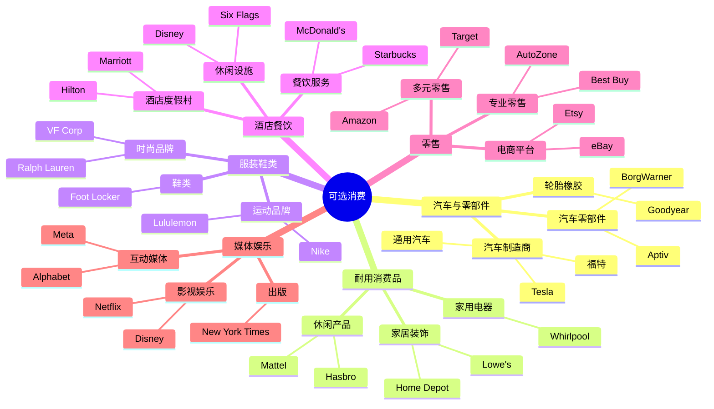
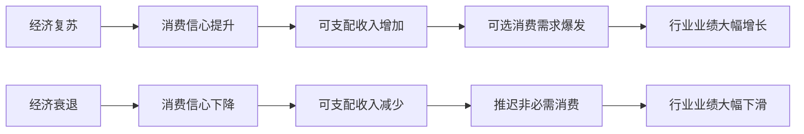

# 美国可选消费行业概览

## 概述

可选消费 (Consumer Discretionary) 是指非生活必需的、可选择性购买的商品和服务。这个行业高度依赖消费者的可支配收入和消费信心，具有明显的周期性特征。在经济繁荣时期，可选消费行业往往表现优异；而在经济衰退时期，则面临较大压力。

**学习目标**：
- 理解可选消费行业的定义和范围
- 掌握行业的周期性特征和驱动因素
- 识别主要子行业的投资机会
- 学会评估可选消费企业的竞争力
- 理解经济周期对行业的影响

**为什么重要**：
可选消费行业包含许多高成长、高回报的投资机会，如 Tesla、Amazon、Nike 等世界级企业。理解这个行业的运作规律和投资逻辑，对于把握经济周期、捕捉成长机会至关重要。

## 行业定义与分类

### GICS 行业分类

根据全球行业分类标准 (GICS)，可选消费行业包括以下子行业：



### 行业规模

**市值分布** (2024年)：
- 总市值：约 $5.5 万亿
- 占标普 500 指数：10-12%
- 公司数量：约 60-70 家

**子行业占比**：
1. 零售 (含电商)：40%
2. 汽车与零部件：25%
3. 酒店餐饮：15%
4. 媒体娱乐：10%
5. 服装鞋类：7%
6. 耐用消费品：3%

## 行业特征

### 1. 强周期性

**经济周期敏感度高**：



**历史表现数据**：
- 2008-2009 金融危机：可选消费指数下跌 45%
- 2009-2019 经济复苏：可选消费指数上涨 450%
- 2020 疫情冲击：可选消费指数下跌 35%
- 2020-2021 复苏：可选消费指数上涨 80%

**Beta 系数**：
- 行业平均 Beta：1.2-1.5
- 高于必需消费 (0.6-0.8)
- 高于整体市场 (1.0)

### 2. 消费者信心驱动

**关键指标**：

| 指标 | 说明 | 影响 |
|-----|------|------|
| 密歇根消费者信心指数 | 衡量消费者对经济的信心 | 领先指标 |
| 个人可支配收入 | 扣除税收后的收入 | 直接影响 |
| 失业率 | 就业市场健康度 | 反向指标 |
| 储蓄率 | 储蓄占收入比例 | 反向指标 |
| 消费信贷增长 | 信用卡、汽车贷款等 | 正向指标 |

**相关性分析**：
- 与消费者信心指数相关性：0.75
- 与 GDP 增长相关性：0.80
- 与失业率相关性：-0.70

### 3. 创新驱动

**技术创新**：
- 电动车革命 (Tesla)
- 电商平台 (Amazon)
- 流媒体服务 (Netflix)
- 移动支付 (Square)

**商业模式创新**：
- 订阅模式 (Netflix, Spotify)
- 共享经济 (Uber, Airbnb)
- 直接面向消费者 (DTC品牌)
- 全渠道零售 (Omnichannel)

**产品创新**：
- 智能家居
- 可穿戴设备
- 电动汽车
- 植物基食品

### 4. 品牌溢价

**品牌价值重要性**：
- 强品牌可以获得 20-50% 的溢价
- 品牌忠诚度降低营销成本
- 品牌资产提供定价权

**品牌建设投入**：
- 营销费用占收入比：5-15%
- 研发费用占收入比：2-8%
- 品牌维护是持续投入

**品牌价值案例**：
- Nike：品牌价值 $330 亿
- McDonald's：品牌价值 $450 亿
- Disney：品牌价值 $570 亿

## 主要子行业分析

### 1. 汽车与零部件

**行业特点**：
- 资本密集型
- 技术壁垒高
- 周期性极强
- 正在经历电动化革命

**投资主题**：
- **电动车转型**：Tesla 引领，传统车企跟进
- **自动驾驶**：技术突破带来估值重估
- **新能源基础设施**：充电桩、电池技术
- **供应链重构**：电动车零部件供应商

**关键指标**：
- 汽车销量 (SAAR)
- 库存天数
- 平均售价 (ASP)
- 电动车渗透率

**代表公司**：
- Tesla：电动车领导者
- 通用汽车：传统车企转型
- 福特：F-150 电动版
- Rivian：电动皮卡新势力

### 2. 零售 (含电商)

**行业特点**：
- 竞争激烈
- 利润率较低
- 规模效应明显
- 数字化转型加速

**投资主题**：
- **电商持续渗透**：线上占比持续提升
- **全渠道零售**：线上线下融合
- **供应链优化**：效率提升降低成本
- **会员制模式**：提高客户粘性

**细分领域**：

**电商平台**：
- Amazon：全品类电商巨头
- eBay：C2C 平台
- Etsy：手工艺品平台

**家居改善**：
- Home Depot：专业 DIY 零售
- Lowe's：家居改善连锁

**专业零售**：
- Best Buy：消费电子
- AutoZone：汽车零部件
- Ulta Beauty：美妆零售

**关键指标**：
- 同店销售增长 (Comp Sales)
- 电商渗透率
- 客单价
- 客流量
- 库存周转率

### 3. 酒店餐饮

**行业特点**：
- 劳动密集型
- 现金流稳定
- 特许经营模式普遍
- 受旅游和商务活动影响

**投资主题**：
- **旅游复苏**：疫情后报复性消费
- **高端化趋势**：消费升级
- **数字化运营**：提升效率
- **健康饮食**：菜单创新

**细分领域**：

**快餐连锁**：
- McDonald's：全球最大快餐连锁
- Yum! Brands：肯德基、必胜客母公司
- Chipotle：快休闲餐饮

**咖啡连锁**：
- Starbucks：全球咖啡连锁巨头
- Dunkin'：甜甜圈和咖啡

**酒店集团**：
- Marriott：全球最大酒店集团
- Hilton：高端酒店品牌
- Airbnb：共享住宿平台

**关键指标**：
- 同店销售增长
- 客单价
- 翻台率
- 新店开设速度
- 入住率 (酒店)
- RevPAR (每间可售房收入)

### 4. 服装鞋类

**行业特点**：
- 品牌驱动
- 时尚周期短
- 库存管理关键
- DTC 模式兴起

**投资主题**：
- **运动休闲化**：Athleisure 趋势
- **可持续时尚**：环保材料
- **DTC 模式**：直接面向消费者
- **数字化营销**：社交媒体、网红

**代表公司**：
- Nike：全球运动品牌龙头
- Lululemon：瑜伽服饰领导者
- Ralph Lauren：经典美式品牌
- VF Corp：多品牌集团 (North Face, Vans)

**关键指标**：
- 品牌热度
- 库存周转天数
- 毛利率
- DTC 占比
- 国际市场占比

### 5. 媒体娱乐

**行业特点**：
- 内容为王
- 网络效应
- 订阅模式
- 技术驱动

**投资主题**：
- **流媒体战争**：Netflix vs Disney+ vs HBO Max
- **内容投资**：原创内容竞争
- **广告模式创新**：程序化广告
- **元宇宙**：虚拟娱乐体验

**代表公司**：
- Disney：内容帝国
- Netflix：流媒体先驱
- Warner Bros Discovery：传统媒体转型
- Spotify：音频流媒体

**关键指标**：
- 订阅用户数
- ARPU (每用户平均收入)
- 用户留存率
- 内容投资回报率
- 广告收入增长

## 经济周期与投资策略

### 美林时钟应用

```mermaid
quadrantChart
    title 可选消费在美林时钟中的表现
    x-axis 低增长 --> 高增长
    y-axis 低通胀 --> 高通胀
    quadrant-1 滞胀期: 表现较差
    quadrant-2 过热期: 表现一般
    quadrant-3 衰退期: 表现最差
    quadrant-4 复苏期: 表现最佳
    
    可选消费: [0.75, 0.35]
```

### 不同周期的配置策略

**1. 经济复苏期** (最佳配置期)：
- **配置比例**：超配 (30-40%)
- **推荐子行业**：
  - 汽车：需求复苏，大额消费回归
  - 家居改善：房地产市场回暖
  - 休闲娱乐：旅游和娱乐需求释放
- **代表公司**：Tesla, Home Depot, Disney

**2. 经济繁荣期** (标配)：
- **配置比例**：标配 (20-25%)
- **推荐子行业**：
  - 高端零售：消费升级
  - 奢侈品：财富效应
  - 高档餐饮：商务活动频繁
- **代表公司**：LVMH, Starbucks, Marriott

**3. 经济过热期** (减配)：
- **配置比例**：低配 (10-15%)
- **推荐子行业**：
  - 必需品零售：防御性
  - 折扣零售：价格敏感
- **代表公司**：Walmart, Costco, Dollar General

**4. 经济衰退期** (最差配置期)：
- **配置比例**：极低配 (0-10%)
- **推荐子行业**：
  - 避免周期性强的子行业
  - 如必须持有，选择龙头企业
- **代表公司**：Amazon (电商防御性较强)

## 投资分析框架

### 1. 行业景气度判断

**领先指标**：
- 消费者信心指数
- 新屋开工数 (家居改善)
- 汽车销量 (SAAR)
- 零售销售数据

**同步指标**：
- GDP 增长率
- 就业数据
- 个人收入增长

**滞后指标**：
- 失业率
- 消费信贷违约率

### 2. 公司分析要点

**商业模式评估**：
- [ ] 商业模式清晰易懂
- [ ] 具有规模效应或网络效应
- [ ] 资本回报率高 (ROIC > 15%)
- [ ] 现金流稳定充沛

**竞争优势评估**：
- [ ] 品牌护城河
- [ ] 规模优势
- [ ] 渠道优势
- [ ] 技术领先

**财务健康度**：
- [ ] 毛利率 > 30%
- [ ] 净利率 > 5%
- [ ] ROE > 15%
- [ ] 负债率 < 60%
- [ ] 自由现金流为正

**成长性评估**：
- [ ] 收入增长 > 10%
- [ ] 同店销售增长 > 3%
- [ ] 市场份额提升
- [ ] 新市场拓展潜力

### 3. 估值方法

**相对估值**：
- **P/E 倍数**：15-25倍 (行业平均)
- **PEG 比率**：< 2.0 合理
- **P/S 倍数**：1-3倍 (零售)，3-8倍 (品牌)
- **EV/EBITDA**：10-15倍

**绝对估值**：
- **DCF 模型**：
  - 收入增长率：5-15%
  - EBITDA 利润率：10-20%
  - 折现率 (WACC)：8-12%
  - 永续增长率：2-3%

**特殊指标**：
- **零售**：单店模型、同店增长
- **餐饮**：单店经济性、翻台率
- **汽车**：单车利润、市场份额
- **电商**：GMV、Take Rate

## 投资机会与风险

### 投资机会

**1. 结构性成长机会**：
- **电动车革命**：Tesla 及供应链
- **电商渗透**：线上零售持续增长
- **消费升级**：高端品牌、体验式消费
- **健康趋势**：运动服饰、健康餐饮

**2. 周期性机会**：
- **经济复苏**：汽车、家居、旅游
- **报复性消费**：疫情后需求释放
- **库存周期**：去库存后的补库存

**3. 并购整合机会**：
- 行业整合带来的效率提升
- 私募股权收购
- 战略并购

### 主要风险

**1. 宏观经济风险**：
- 经济衰退导致需求大幅下降
- 失业率上升影响消费能力
- 利率上升增加融资成本

**2. 竞争风险**：
- 电商冲击传统零售
- 新品牌挑战老品牌
- 价格战压缩利润

**3. 技术颠覆风险**：
- 商业模式被颠覆
- 消费习惯改变
- 新技术替代

**4. 供应链风险**：
- 原材料价格波动
- 物流成本上升
- 地缘政治影响

**5. 监管风险**：
- 反垄断审查
- 环保法规
- 劳工法规

## 实战应用

### 可选消费股筛选清单

**宏观环境检查**：
- [ ] 经济处于复苏或繁荣期
- [ ] 消费者信心指数上升
- [ ] 失业率下降
- [ ] 利率环境友好

**行业选择**：
- [ ] 行业处于成长期
- [ ] 受益于长期趋势
- [ ] 竞争格局改善
- [ ] 监管环境稳定

**公司筛选**：
- [ ] 行业龙头或快速成长者
- [ ] 品牌力强或商业模式创新
- [ ] 财务健康，现金流充沛
- [ ] 管理层优秀，执行力强
- [ ] 估值合理，安全边际充足

### 组合构建建议

**进攻型组合** (经济复苏期)：
- 汽车：30% (Tesla, 通用)
- 家居改善：25% (Home Depot)
- 休闲娱乐：20% (Disney)
- 电商：15% (Amazon)
- 餐饮：10% (McDonald's)

**平衡型组合** (经济繁荣期)：
- 电商：30% (Amazon)
- 品牌消费：25% (Nike, Starbucks)
- 零售：20% (Home Depot, Costco)
- 餐饮：15% (McDonald's, Chipotle)
- 汽车：10% (Tesla)

**防御型组合** (经济衰退期)：
- 避免可选消费
- 或仅持有龙头企业 (Amazon, Walmart)

## 常见误区

### 误区1：可选消费都是高风险

**错误认知**：可选消费都是高 Beta 高风险

**正确理解**：
- 龙头企业具有一定防御性
- Amazon、Costco 在衰退期表现相对较好
- 需要区分子行业和公司质量

### 误区2：经济好就买可选消费

**错误认知**：经济增长就配置可选消费

**正确理解**：
- 需要判断经济周期阶段
- 复苏期最佳，过热期需谨慎
- 估值同样重要

### 误区3：品牌就是一切

**错误认知**：有品牌就能成功

**正确理解**：
- 品牌需要持续投入维护
- 消费者偏好会改变
- 新品牌可以通过新渠道崛起

### 误区4：忽视线上冲击

**错误认知**：传统零售永远有价值

**正确理解**：
- 电商持续侵蚀线下份额
- 全渠道能力成为必备
- 纯线下零售面临巨大挑战

## 延伸阅读

### 推荐书籍

1. **《彼得·林奇的成功投资》** - 彼得·林奇
   - 如何在日常生活中发现可选消费投资机会

2. **《零售的哲学》** - 铃木敏文
   - 7-Eleven 创始人的零售智慧

3. **《创新者的窘境》** - 克莱顿·克里斯坦森
   - 理解技术颠覆对传统企业的影响

4. **《长尾理论》** - 克里斯·安德森
   - 互联网如何改变零售业

### 研究报告

- 麦肯锡：《美国零售业趋势报告》
- 贝恩：《全球奢侈品市场研究》
- 德勤：《零售业数字化转型》
- 高盛：《电动车行业深度报告》

### 数据来源

- **美国人口普查局**：零售销售数据
- **密歇根大学**：消费者信心指数
- **美联储**：消费信贷数据
- **Ward's Automotive**：汽车销量数据

## 参考文献

1. Lynch, P. (2000). *One Up On Wall Street*. Simon & Schuster.

2. U.S. Census Bureau. (2024). *Monthly Retail Trade Report*.

3. Conference Board. (2024). *Consumer Confidence Index*.

4. McKinsey & Company. (2023). *The State of Fashion Report*.

5. Deloitte. (2023). *Global Powers of Retailing*.

6. Goldman Sachs. (2023). *Electric Vehicle Industry Report*.

7. Bain & Company. (2023). *Luxury Goods Worldwide Market Study*.

8. University of Michigan. (2024). *Consumer Sentiment Index*.

9. Federal Reserve. (2024). *Consumer Credit Report*.

10. MSCI. (2024). *GICS Sector Classification*.

---

**下一步学习**：
- 深入研究 [Tesla 电动车革命](./tesla.html)
- 了解 [Home Depot 家居改善零售](./home-depot.html)
- 学习 [McDonald's 快餐帝国](./mcdonalds.html)
- 对比 [必需消费行业特点](../staples/overview.html)
