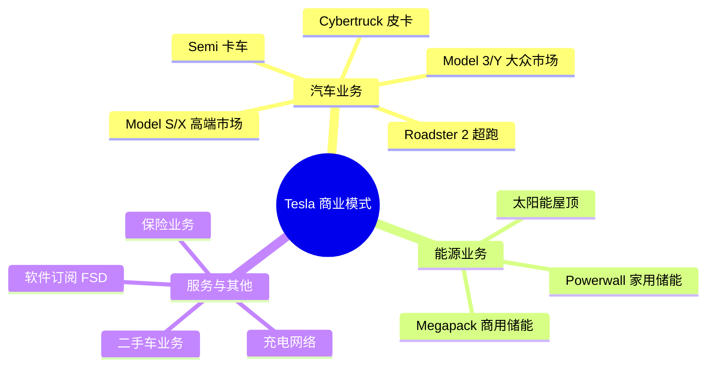

# Tesla 深度研究：电动车革命的领导者

## 概述

Tesla, Inc. 是全球电动车行业的开创者和领导者，由埃隆·马斯克 (Elon Musk) 领导。公司不仅生产电动汽车，还涉足能源存储、太阳能发电和自动驾驶技术。Tesla 以其创新的产品、垂直整合的商业模式和强大的品牌影响力，重新定义了汽车行业。

**公司基本信息**：
- **成立时间**：2003年
- **总部**：美国德克萨斯州奥斯汀
- **创始人**：马丁·艾伯哈德、马克·塔彭宁（马斯克2004年加入并成为主导者）
- **CEO**：埃隆·马斯克 (Elon Musk)
- **上市时间**：2010年6月（纳斯达克：TSLA）
- **市值**：约 $800-900 亿美元（2024年，波动较大）
- **员工数**：约 14万人

**学习目标**：
- 理解 Tesla 如何引领电动车革命
- 掌握 Tesla 的商业模式和竞争优势
- 分析 Tesla 的技术创新和产品策略
- 评估 Tesla 的财务表现和估值
- 理解马斯克效应对公司的影响

**为什么重要**：
Tesla 是过去十年最成功的成长股之一，也是最具争议的投资标的。理解 Tesla 的成功逻辑和风险因素，对于把握科技创新、新能源转型和成长股投资至关重要。

## 公司发展历程

### 创业阶段 (2003-2008)

**2003-2004**：公司成立
- 马丁·艾伯哈德和马克·塔彭宁创立 Tesla Motors
- 2004年，埃隆·马斯克领投 A 轮融资，成为董事长
- 目标：证明电动车可以比燃油车更好

**2006-2008**：Roadster 时代
- 2006年发布 Roadster 原型车
- 2008年开始交付，售价 $109,000
- 基于 Lotus Elise 底盘，续航 244 英里
- 累计销售约 2,450 辆
- 证明了电动车的性能潜力

**关键里程碑**：
- 2008年，马斯克成为 CEO
- 2008年金融危机，公司濒临破产
- 戴姆勒和丰田的投资挽救了公司

### 成长阶段 (2009-2016)

**2009-2012**：Model S 开发
- 2009年获得美国能源部 $465M 贷款
- 2010年6月 IPO，融资 $226M
- 2012年6月开始交付 Model S
- Model S 成为首款主流豪华电动轿车

**2013-2016**：产品线扩张
- 2015年9月发布 Model X（SUV）
- 2016年3月发布 Model 3（大众市场）
- Model 3 预订量超过 50 万辆
- 建设 Gigafactory 1（内华达州）

**财务表现**：
- 2013年首次实现季度盈利
- 2013-2016年收入从 $20亿增长到 $70亿
- 但整体仍处于亏损状态

### 规模化阶段 (2017-2020)

**2017-2018**：生产地狱
- Model 3 生产爬坡困难，"生产地狱"
- 2018年Q3 达到周产 5,000 辆目标
- 2018年Q3-Q4 连续盈利
- 马斯克睡在工厂，亲自解决生产问题

**2019**：全球扩张
- 上海 Gigafactory 3 开工建设
- 2019年底开始交付中国产 Model 3
- 发布 Cybertruck（电动皮卡）
- 收购 Maxwell（电池技术）

**2020**：突破之年
- 全年交付 499,550 辆，增长 36%
- 全年首次实现盈利（$721M）
- 加入标普 500 指数
- 股价暴涨 743%
- 市值超过所有传统车企总和

### 成熟阶段 (2021-至今)

**2021-2022**：产能扩张
- 2021年交付 936,172 辆，增长 87%
- 德国柏林工厂和德州奥斯汀工厂投产
- 2022年交付 1,313,851 辆，增长 40%
- 全年净利润 $12.6B

**2023-2024**：价格战与竞争加剧
- 多次降价以刺激需求
- 面临中国电动车企业（比亚迪等）的激烈竞争
- 2023年交付 1,808,581 辆，增长 38%
- 利润率承压，但仍保持盈利

## 电动车革命

### 行业转型的催化剂

**Tesla 的革命性贡献**：

1. **改变认知**：
   - 证明电动车可以性能卓越
   - 证明电动车可以设计优美
   - 证明电动车可以商业化成功

2. **推动行业转型**：
   - 迫使传统车企加速电动化
   - 吸引大量资本进入电动车领域
   - 建立了完整的电动车生态系统

3. **技术突破**：
   - 电池技术进步
   - 电机和电控系统
   - 充电基础设施
   - 软件定义汽车

### 全球电动车市场格局

**市场规模增长**：
- 2015年：全球电动车销量 55万辆
- 2020年：全球电动车销量 324万辆
- 2023年：全球电动车销量 1,400万辆
- 2030年预测：全球电动车销量 4,000万辆

**渗透率提升**：
- 2020年：全球电动车渗透率 4.2%
- 2023年：全球电动车渗透率 16%
- 2030年预测：全球电动车渗透率 50%+

**主要市场**：
1. **中国**：全球最大电动车市场（60%份额）
2. **欧洲**：政策推动，快速增长（25%份额）
3. **美国**：Tesla 主导，增长加速（10%份额）

**竞争格局**：
- **中国**：比亚迪、蔚来、小鹏、理想
- **欧洲**：大众、宝马、奔驰
- **美国**：Tesla、通用、福特、Rivian
- **新势力**：Lucid、Fisker、Polestar

### Tesla 的市场地位

**全球市场份额**：
- 2020年：全球电动车市场份额 16%
- 2023年：全球电动车市场份额 12%（因竞争加剧）
- 美国市场份额：约 55-60%
- 欧洲市场份额：约 12-15%
- 中国市场份额：约 8-10%

**品牌价值**：
- 2024年品牌价值：约 $660亿
- 全球最有价值汽车品牌
- 品牌认知度和美誉度极高

## 商业模式分析

### 核心业务结构

### 1. 汽车业务（核心）

**产品矩阵**：

| 车型 | 定位 | 起售价 | 续航 | 年销量 |
|------|------|--------|------|--------|
| Model 3 | 中型轿车 | $40,000 | 272-358 miles | ~60万辆 |
| Model Y | 紧凑SUV | $47,000 | 260-330 miles | ~120万辆 |
| Model S | 大型轿车 | $75,000 | 405 miles | ~5万辆 |
| Model X | 大型SUV | $80,000 | 348 miles | ~5万辆 |
| Cybertruck | 电动皮卡 | $60,000 | 250-500 miles | 待放量 |

**收入占比**：约 85-90%

**关键特点**：
- 直销模式，无经销商
- 在线订购，工厂直达
- 持续 OTA 升级
- 高度垂直整合

### 2. 能源业务（增长潜力）

**产品线**：
- **Solar Roof**：太阳能屋顶瓦片
- **Solar Panels**：传统太阳能板
- **Powerwall**：家用储能系统（13.5 kWh）
- **Megapack**：商用/电网级储能（3 MWh）

**收入占比**：约 5-6%

**增长驱动**：
- 可再生能源需求增长
- 电网储能需求爆发
- 与汽车业务协同

### 3. 服务与其他业务

**Supercharger 充电网络**：
- 全球超过 50,000 个充电桩
- 北美最大、最可靠的快充网络
- 开始向其他品牌开放（收费）

**Full Self-Driving (FSD)**：
- 软件订阅：$199/月 或 $12,000 买断
- 2023年约 40万用户订阅
- 未来潜在的高利润率业务

**Tesla Insurance**：
- 基于驾驶行为的保险
- 利用车辆数据定价
- 目前仅在部分州推出

**收入占比**：约 5-9%

## 自动驾驶技术

### FSD 技术路线

**Tesla 的独特路径**：
- **纯视觉方案**：不依赖激光雷达
- **神经网络**：端到端学习
- **数据优势**：数百万辆车的实际驾驶数据
- **影子模式**：在后台持续学习

**技术架构**：
1. **感知层**：8个摄像头，360度覆盖
2. **决策层**：神经网络处理
3. **执行层**：车辆控制系统
4. **云端**：数据收集和模型训练

### FSD 发展阶段

**当前能力** (2024年)：
- 高速公路自动驾驶
- 城市街道导航
- 自动泊车
- 召唤功能
- 但仍需驾驶员监督（L2+级别）

**未来目标**：
- 完全自动驾驶（L4/L5级别）
- Robotaxi 无人出租车服务
- 马斯克预测 2024-2025年实现

### 竞争对手对比

| 公司 | 技术路线 | 进展 | 商业化 |
|------|---------|------|--------|
| Tesla | 纯视觉 | L2+ | 大规模部署 |
| Waymo | 激光雷达 | L4 | 小规模运营 |
| Cruise | 激光雷达 | L4 | 暂停运营 |
| 百度Apollo | 激光雷达 | L4 | 试点运营 |
| 小鹏 | 激光雷达+视觉 | L2+ | 大规模部署 |

**Tesla 的优势**：
- 成本低（无激光雷达）
- 数据量大（百万级车队）
- 可规模化部署

**Tesla 的挑战**：
- 纯视觉方案技术难度高
- 监管审批不确定性
- 安全性证明压力

## 能源业务

### Solar & Storage 战略

**愿景**：
- 可持续能源生态系统
- 太阳能发电 + 储能 + 电动车
- 实现能源自给自足

**Powerwall 家用储能**：
- 容量：13.5 kWh
- 价格：约 $11,000（含安装）
- 应用场景：
  - 削峰填谷，降低电费
  - 停电备用电源
  - 配合太阳能使用

**Megapack 商用储能**：
- 容量：3.9 MWh
- 目标客户：电力公司、大型企业
- 应用场景：
  - 电网调峰
  - 可再生能源并网
  - 提高电网稳定性

**市场机会**：
- 全球储能市场 2030年预计达 $500B
- Tesla 储能业务增长率 > 50%
- 毛利率高于汽车业务

## 财务分析

### 收入结构与增长

**历史收入** (单位：十亿美元)：
- 2018年：$21.5B
- 2019年：$24.6B
- 2020年：$31.5B
- 2021年：$53.8B
- 2022年：$81.5B
- 2023年：$96.8B

**收入增长率**：
- 2019-2023 CAGR：40.8%
- 2023年增长：19%（增速放缓）

**收入构成** (2023年)：
- 汽车销售：85%
- 汽车租赁：2%
- 能源发电与储能：6%
- 服务与其他：7%

### 盈利能力分析

**毛利率趋势**：
- 2020年：21.0%
- 2021年：25.3%
- 2022年：25.6%
- 2023年：18.2%（价格战影响）

**净利率**：
- 2020年：2.3%
- 2021年：10.3%
- 2022年：15.5%
- 2023年：13.1%

**营业利润率**：
- 2023年：9.2%
- 低于传统豪华车企（宝马 10-12%）
- 但高于大众市场车企（通用 5-7%）

**ROE (净资产收益率)**：
- 2023年：25.7%
- 优秀水平，显示资本效率高

**ROIC (投资资本回报率)**：
- 2023年：18.3%
- 高于汽车行业平均（10-12%）

### 现金流分析

**经营现金流** (2023年)：
- $13.3B
- 占收入比：13.7%
- 强劲的造血能力

**自由现金流** (2023年)：
- $4.4B
- 资本支出：$8.9B（建设新工厂）
- FCF 利润率：4.5%

**现金储备** (2023年底)：
- 现金及等价物：$29.1B
- 无长期债务压力
- 财务状况健康

## 竞争优势（护城河）

### 1. 品牌护城河

**品牌力量**：
- 电动车的代名词
- 科技和创新的象征
- 环保和未来的代表
- 马斯克个人品牌加持

**品牌价值体现**：
- 零广告营销费用
- 客户自发传播
- 高品牌溢价能力
- 强大的品牌忠诚度

**NPS (净推荐值)**：
- Tesla NPS：约 96
- 行业最高水平
- 远超传统车企（30-50）

### 2. 技术护城河

**电池技术**：
- 4680 电池：更高能量密度
- 电池成本：行业领先
- 电池管理系统：独家技术
- 垂直整合：自主生产能力

**软件能力**：
- OTA 升级：持续改进
- FSD 自动驾驶：数据优势
- 车机系统：用户体验最佳
- 软件定义汽车：行业领先

**制造创新**：
- 一体化压铸：降低成本
- 生产效率：持续提升
- 自动化程度：行业领先

### 3. 规模护城河

**生产规模**：
- 2023年产能：约 200万辆
- 2024年目标：220-240万辆
- 规模效应显著

**全球工厂布局**：
- 美国：加州 Fremont、德州 Austin
- 中国：上海 Gigafactory
- 德国：柏林 Gigafactory
- 计划：墨西哥新工厂

**成本优势**：
- 单车制造成本：约 $36,000
- 持续下降趋势
- 低于传统车企同级别车型

### 4. 网络效应

**Supercharger 网络**：
- 专属充电网络
- 提升用户体验
- 增加转换成本
- 开放后成为收入来源

**数据飞轮**：
- 更多车辆 → 更多数据
- 更多数据 → 更好算法
- 更好算法 → 更好产品
- 更好产品 → 更多车辆

### 5. 垂直整合

**自主掌控关键环节**：
- 电池生产
- 芯片设计（FSD 芯片）
- 软件开发
- 销售渠道
- 充电网络

**优势**：
- 成本控制
- 质量保证
- 快速迭代
- 利润率提升

## 马斯克效应

### 正面影响

**1. 愿景领导力**：
- 清晰的使命：加速世界向可持续能源转变
- 激励员工和投资者
- 吸引顶尖人才

**2. 产品创新**：
- 亲自参与产品设计
- 推动技术突破
- 快速决策和执行

**3. 营销价值**：
- 个人影响力巨大
- 社交媒体营销
- 零广告费用

**4. 融资能力**：
- 个人信用背书
- 吸引投资者
- 股价支撑

### 负面影响

**1. 关键人风险**：
- 过度依赖个人
- 继任计划不明确
- 健康和安全风险

**2. 争议言论**：
- 社交媒体争议
- SEC 监管问题
- 品牌形象风险

**3. 精力分散**：
- 同时管理多家公司（SpaceX, X, Neuralink）
- 可能影响 Tesla 关注度

**4. 管理风格**：
- 高压管理
- 员工流失率高
- 劳资关系紧张

## 投资分析

### 估值方法

**1. 传统汽车公司估值**：
- P/E 倍数：5-10倍
- 如果按传统车企估值，Tesla 严重高估

**2. 科技公司估值**：
- P/E 倍数：20-40倍
- Tesla 更像科技公司而非车企

**3. 分部估值法**：

| 业务 | 估值 | 依据 |
|------|------|------|
| 汽车业务 | $400-500B | 10-15x P/E |
| FSD/Robotaxi | $200-500B | 未来潜力 |
| 能源业务 | $50-100B | 高增长 |
| 其他业务 | $50B | 保险、服务等 |
| **总计** | **$700-1,150B** | 取决于假设 |

**4. DCF 估值**：

**关键假设**：
- 2030年销量：500-800万辆
- 平均售价：$40,000
- 净利率：10-15%
- WACC：10%
- 永续增长率：3%

**估值区间**：$600-1,200B

### 当前估值水平 (2024年)

**市值**：约 $800B

**估值倍数**：
- P/E (TTM)：约 60x
- P/S (TTM)：约 8x
- EV/EBITDA：约 45x
- PEG：约 2.5

**对比分析**：
- 远高于传统车企（P/E 5-10x）
- 高于大多数科技公司（P/E 20-30x）
- 隐含高增长预期

### 投资论点

**看多理由**：

1. **电动车渗透率提升**：
   - 全球电动车渗透率从 16% 提升到 50%+
   - Tesla 作为领导者受益

2. **技术领先**：
   - FSD 自动驾驶潜力巨大
   - Robotaxi 可能重新定义出行
   - 软件订阅高利润率

3. **规模效应**：
   - 产能持续扩张
   - 成本持续下降
   - 利润率提升空间

4. **能源业务**：
   - 储能市场爆发
   - 高增长、高利润率
   - 与汽车业务协同

5. **品牌价值**：
   - 强大的品牌护城河
   - 客户忠诚度高
   - 定价权优势

**看空理由**：

1. **竞争加剧**：
   - 中国电动车企业崛起（比亚迪）
   - 传统车企电动化加速
   - 市场份额可能下降

2. **估值过高**：
   - P/E 60x 远高于行业
   - 隐含过高增长预期
   - 下行风险大

3. **增长放缓**：
   - 2023年增长率降至 19%
   - 价格战压缩利润率
   - 需求疲软迹象

4. **执行风险**：
   - FSD 进展不及预期
   - Robotaxi 监管不确定
   - 新产品延期风险

5. **关键人风险**：
   - 过度依赖马斯克
   - 继任计划不明确

## 风险因素

### 1. 竞争风险

**中国竞争对手**：
- 比亚迪：2023年销量超过 Tesla
- 蔚来、小鹏、理想：高端市场竞争
- 价格优势和本土化优势

**传统车企**：
- 大众、通用、福特：大举投资电动化
- 品牌认知度和渠道优势
- 资金实力雄厚

### 2. 监管风险

**自动驾驶监管**：
- FSD 安全性审查
- Robotaxi 运营许可
- 各国监管标准不一

**环保政策变化**：
- 补贴政策退坡
- 碳信用收入减少

### 3. 供应链风险

**原材料价格**：
- 锂、钴、镍价格波动
- 影响电池成本

**芯片短缺**：
- 半导体供应紧张
- 影响生产计划

### 4. 宏观经济风险

**经济衰退**：
- 消费者推迟大额消费
- 汽车需求下降

**利率上升**：
- 融资成本增加
- 估值压力

## 投资建议

### 适合投资者类型

**适合**：
- 成长股投资者
- 长期投资者（5年+）
- 高风险承受能力
- 相信电动车和自动驾驶未来

**不适合**：
- 价值投资者
- 短期投资者
- 低风险承受能力
- 需要稳定分红

### 配置建议

**核心持仓**：
- 不建议作为核心持仓
- 波动性太大

**卫星持仓**：
- 可作为成长型卫星持仓
- 建议配置比例：5-10%
- 分批建仓，控制风险

### 买入时机

**估值合理区间**：
- P/E < 50x
- P/S < 6x
- 对应市值约 $600-700B

**催化剂**：
- FSD 重大突破
- Robotaxi 获批运营
- 新产品成功推出
- 利润率显著改善

## 关键学习点

1. **颠覆式创新**：Tesla 证明了新进入者可以颠覆百年汽车行业

2. **愿景的力量**：清晰的使命和愿景可以吸引人才、资本和客户

3. **垂直整合**：掌控关键环节可以提升竞争力和利润率

4. **软件定义汽车**：汽车正在从机械产品变成软件产品

5. **品牌建设**：强大的品牌可以实现零广告营销

6. **估值的艺术**：成长股估值需要对未来做出大胆假设

7. **关键人风险**：过度依赖创始人是双刃剑

8. **执行力**：从濒临破产到市值万亿，执行力至关重要

## 延伸阅读

### 推荐书籍

1. **《埃隆·马斯克传》** - 阿什利·万斯
   - 了解马斯克和 Tesla 的创业历程

2. **《钢铁侠：埃隆·马斯克的冒险人生》** - 阿什利·万斯
   - 深入了解马斯克的思维方式

3. **《特斯拉传》** - 哈米什·麦肯齐
   - Tesla 内部视角

4. **《创新者的窘境》** - 克莱顿·克里斯坦森
   - 理解颠覆式创新

### 研究报告

- ARK Invest：《Tesla 深度研究报告》
- 高盛：《电动车行业展望》
- 摩根士丹利：《Tesla 估值分析》
- 瑞银：《电动车拆解报告》

### 数据来源

- **Tesla 官网**：财报、产品信息
- **SEC 文件**：10-K、10-Q 年报季报
- **InsideEVs**：电动车销量数据
- **CleanTechnica**：电动车行业新闻

## 参考文献

1. Tesla, Inc. (2024). *Annual Report 2023 (Form 10-K)*. SEC Filings.

2. Vance, A. (2015). *Elon Musk: Tesla, SpaceX, and the Quest for a Fantastic Future*. Ecco.

3. ARK Invest. (2023). *Big Ideas 2024: Tesla Analysis*.

4. Bloomberg NEF. (2024). *Electric Vehicle Outlook 2024*.

5. McKinsey & Company. (2023). *The Future of Mobility Report*.

6. Goldman Sachs. (2023). *Electric Vehicle Industry Deep Dive*.

7. Morgan Stanley. (2024). *Tesla Valuation Framework*.

8. UBS. (2023). *Electric Vehicle Teardown Analysis*.

9. InsideEVs. (2024). *Global EV Sales Data*.

10. CleanTechnica. (2024). *Tesla News and Analysis*.

---

**下一步学习**：
- 对比 [比亚迪的竞争策略](../../../china-market/new-energy/ev-makers/byd.html)
- 了解 [电动车行业分析](../../../industry-analysis/emerging/electric-vehicles.html)
- 学习 [成长股投资方法](../../../../04-investment-system/growth-investing/technology-growth.html)
- 研究 [Home Depot 传统零售](./home-depot.html)

## 深度分析

### 核心机制解析

理解本主题需要从多个维度进行系统性分析。以下从理论基础、实践应用和历史验证三个层面展开深度探讨。

**理论基础层面**：本主题的核心逻辑建立在经济学和金融学的基本原理之上。通过对基础理论的深入理解，投资者能够建立起稳固的分析框架，避免被市场短期噪音所干扰。

**实践应用层面**：理论必须与实践相结合才能产生价值。在实际投资决策中，需要将抽象的概念转化为具体的分析工具和决策标准。

**历史验证层面**：金融市场有着丰富的历史记录，通过研究历史案例，我们可以验证理论的有效性，并从中提炼出具有普遍意义的规律。

### 关键影响因素

影响本主题的关键因素可以从以下几个维度进行分析：

1. **宏观经济环境**：利率水平、通货膨胀率、经济增长速度等宏观变量对本主题有着深远影响。在不同的宏观经济周期中，相关指标的表现会呈现出显著差异。

2. **市场结构因素**：市场参与者的构成、信息传播机制、流动性状况等市场结构因素决定了价格发现的效率和准确性。

3. **政策监管环境**：政府政策、监管框架的变化会直接影响相关市场的运作规则和参与者行为。

4. **技术创新驱动**：技术进步不断改变着金融市场的运作方式，从算法交易到区块链技术，每一次技术革新都带来新的机遇和挑战。

5. **全球化与地缘政治**：在全球化背景下，各国市场之间的联动性日益增强，地缘政治风险的影响也越来越不可忽视。

### 量化分析框架

为了更精确地分析和评估，可以采用以下量化框架：

| 分析维度 | 关键指标 | 参考基准 | 分析方法 |
|---------|---------|---------|---------|
| 规模评估 | 绝对值与相对值 | 历史均值 | 趋势分析 |
| 质量评估 | 稳定性指标 | 行业对标 | 横向比较 |
| 风险评估 | 波动率指标 | 风险阈值 | 情景分析 |
| 价值评估 | 估值倍数 | 历史区间 | 回归分析 |

通过系统性地应用上述框架，投资者可以对目标进行全面、客观的评估，从而做出更加理性的投资决策。

