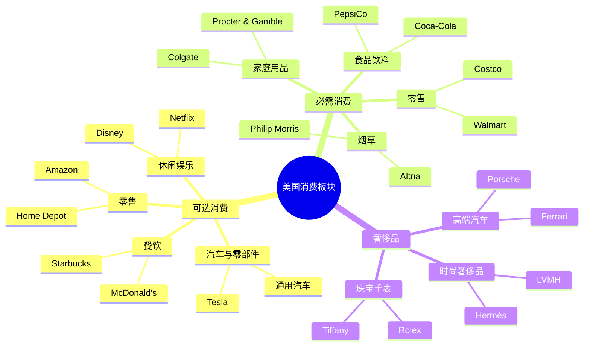
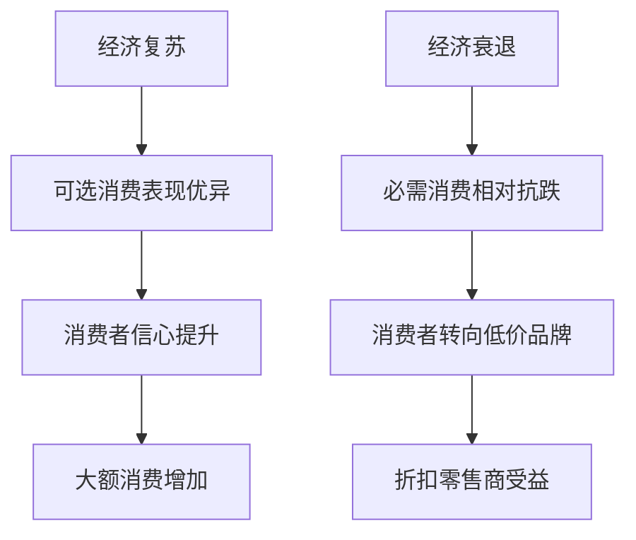

# 美国消费板块总览

## 概述

美国消费板块是全球最大、最成熟的消费市场，占美国 GDP 的约 70%，是美国经济增长的主要驱动力。该板块包含从日常必需品到高端奢侈品的完整产业链，拥有众多世界级品牌和创新商业模式。

**学习目标**：
- 理解美国消费板块的结构和特点
- 掌握消费行业的投资分析框架
- 识别不同消费细分领域的投资机会
- 理解消费趋势对投资的影响
- 学会评估消费类公司的竞争优势

**为什么重要**：
消费板块是长期投资者的重要配置领域，许多消费龙头企业具有强大的品牌护城河和稳定的现金流，是构建长期投资组合的核心资产。理解消费行业的运作规律和投资逻辑，对于把握经济周期、识别优质企业至关重要。

## 板块结构与分类

### 三大核心细分领域

### 1. 可选消费 (Consumer Discretionary)

**定义**：非必需的、可选择性购买的商品和服务

**主要子行业**：
- **汽车与零部件**：传统车企、电动车、零部件供应商
- **零售**：百货商店、专业零售、电商平台
- **餐饮服务**：快餐连锁、休闲餐饮、咖啡连锁
- **休闲娱乐**：主题公园、影视娱乐、体育用品
- **服装鞋类**：运动品牌、时尚品牌、快时尚

**特点**：
- 周期性强，与经济景气度高度相关
- 消费者信心指数敏感
- 创新驱动，品牌溢价明显
- 电商渗透率持续提升

**市值占比**：约占标普 500 指数的 10-12%

### 2. 必需消费 (Consumer Staples)

**定义**：日常生活必需的商品和服务

**主要子行业**：
- **食品饮料**：软饮料、包装食品、酒类
- **家庭和个人护理**：洗涤用品、个人护理、纸制品
- **零售**：超市、便利店、折扣店
- **烟草**：卷烟、无烟烟草产品

**特点**：
- 防御性强，需求稳定
- 现金流充沛，分红率高
- 品牌忠诚度高
- 定价权强，抗通胀能力好

**市值占比**：约占标普 500 指数的 6-7%

### 3. 奢侈品 (Luxury Goods)

**定义**：高端、高价位的非必需消费品

**主要子行业**：
- **时尚奢侈品**：服装、皮具、配饰
- **珠宝手表**：高端珠宝、奢侈腕表
- **高端汽车**：超豪华汽车品牌
- **高端酒店**：五星级酒店、度假村

**特点**：
- 品牌溢价极高
- 目标客户为高净值人群
- 受全球财富增长驱动
- 中国市场重要性日益提升

**市值占比**：相对较小，但增长迅速

## 板块规模与市值分布

### 市值结构

| 细分领域 | 市值规模 | 代表公司 | 占比 |
|---------|---------|---------|------|
| 可选消费 | ~$5.5万亿 | Amazon, Tesla, Home Depot | 55% |
| 必需消费 | ~$3.8万亿 | Walmart, P&G, Coca-Cola | 38% |
| 奢侈品 | ~$0.7万亿 | LVMH, Hermès, Ferrari | 7% |

### 龙头企业市值 (2024年)

**可选消费 TOP 5**：
1. Amazon - $1.7万亿
2. Tesla - $0.8万亿
3. Home Depot - $0.35万亿
4. McDonald's - $0.21万亿
5. Nike - $0.16万亿

**必需消费 TOP 5**：
1. Walmart - $0.48万亿
2. Procter & Gamble - $0.38万亿
3. Costco - $0.32万亿
4. Coca-Cola - $0.26万亿
5. PepsiCo - $0.24万亿

**奢侈品 TOP 3**：
1. LVMH - $0.42万亿
2. Hermès - $0.22万亿
3. Ferrari - $0.07万亿

## 行业发展趋势

### 1. 数字化转型加速

**电商渗透率提升**：
- 2023年美国电商渗透率达到 15.6%
- 疫情加速了线上购物习惯的养成
- 全渠道零售成为标配

**数字营销革命**：
- 社交媒体营销占比持续提升
- 网红经济、直播带货兴起
- 精准营销和个性化推荐

**供应链数字化**：
- 实时库存管理
- 需求预测优化
- 物流效率提升

### 2. 消费者偏好变化

**健康意识增强**：
- 有机食品、健康饮料需求增长
- 运动健身消费增加
- 功能性食品市场扩大

**可持续消费**：
- 环保产品受青睐
- 循环经济模式兴起
- ESG 成为品牌竞争力

**体验式消费**：
- 从产品消费转向体验消费
- 个性化、定制化需求增长
- 社交属性重要性提升

### 3. 人口结构影响

**千禧一代和 Z 世代崛起**：
- 数字原住民，线上消费为主
- 注重品牌价值观和社会责任
- 追求个性化和独特性

**老龄化趋势**：
- 医疗保健消费增长
- 便利性需求提升
- 高端养老服务市场扩大

### 4. 技术创新驱动

**人工智能应用**：
- 智能推荐系统
- 聊天机器人客服
- 需求预测和库存优化

**新零售模式**：
- 无人零售
- 即时配送
- 社区团购

**产品创新**：
- 植物基食品
- 智能家居产品
- 可穿戴设备

## 投资分析框架

### 1. 行业生命周期分析

**不同阶段特征**：
- **导入期**：高风险高回报，如植物肉、元宇宙零售
- **成长期**：快速增长，如电动车、健康食品
- **成熟期**：稳定增长，如传统零售、快餐连锁
- **衰退期**：需求下降，如传统百货、烟草

### 2. 竞争格局分析

**波特五力模型应用**：

1. **行业内竞争**：
   - 品牌集中度
   - 市场份额分布
   - 价格竞争激烈程度

2. **新进入者威胁**：
   - 品牌壁垒
   - 渠道壁垒
   - 资本要求

3. **替代品威胁**：
   - 产品差异化程度
   - 消费者转换成本
   - 新技术冲击

4. **供应商议价能力**：
   - 供应商集中度
   - 原材料可替代性
   - 垂直整合程度

5. **买方议价能力**：
   - 客户集中度
   - 品牌忠诚度
   - 价格敏感度

### 3. 商业模式评估

**关键要素**：
- **价值主张**：满足什么需求？
- **目标客户**：服务哪些人群？
- **收入模式**：如何赚钱？
- **成本结构**：主要成本是什么？
- **核心资源**：关键竞争优势？
- **渠道策略**：如何触达客户？

### 4. 财务指标分析

**盈利能力指标**：
- **毛利率**：品牌溢价和定价权
- **净利率**：运营效率
- **ROE**：资本回报率
- **ROIC**：投资资本回报率

**增长指标**：
- **同店销售增长**：有机增长能力
- **新店扩张速度**：规模扩张能力
- **市场份额变化**：竞争地位

**效率指标**：
- **存货周转率**：库存管理效率
- **应收账款周转率**：现金回收能力
- **资产周转率**：资产使用效率

**现金流指标**：
- **经营现金流**：造血能力
- **自由现金流**：分红和回购能力
- **现金转换周期**：营运资本效率

## 经济周期与消费板块

### 周期性特征

### 不同阶段的投资策略

**1. 经济复苏期**：
- **配置重点**：可选消费
- **推荐子行业**：汽车、家居改善、休闲娱乐
- **投资逻辑**：消费者信心恢复，大额消费需求释放

**2. 经济繁荣期**：
- **配置重点**：奢侈品、高端消费
- **推荐子行业**：奢侈品牌、高端零售、高档餐饮
- **投资逻辑**：财富效应显著，高端消费需求旺盛

**3. 经济衰退期**：
- **配置重点**：必需消费
- **推荐子行业**：折扣零售、日用品、基础食品
- **投资逻辑**：防御性强，需求稳定，现金流充沛

**4. 经济萧条期**：
- **配置重点**：高股息必需消费股
- **推荐子行业**：烟草、日用品龙头、折扣零售
- **投资逻辑**：稳定分红，抗跌性强

## 投资机会与风险

### 投资机会

**1. 品牌护城河企业**：
- 强大的品牌资产
- 高客户忠诚度
- 定价权优势
- 案例：Coca-Cola, Nike, LVMH

**2. 渠道创新者**：
- 全渠道零售领先者
- 电商平台
- 新零售模式
- 案例：Amazon, Costco, Walmart

**3. 消费升级受益者**：
- 高端化趋势
- 健康消费
- 体验式消费
- 案例：Starbucks, Lululemon, Chipotle

**4. 技术驱动创新者**：
- 电动车革命
- 智能家居
- 数字化转型
- 案例：Tesla, Apple (消费电子)

### 主要风险

**1. 宏观经济风险**：
- 经济衰退导致消费需求下降
- 失业率上升影响购买力
- 通胀压力侵蚀利润率

**2. 竞争风险**：
- 行业竞争加剧
- 新进入者冲击
- 价格战压力

**3. 技术颠覆风险**：
- 电商冲击传统零售
- 新商业模式替代
- 消费习惯改变

**4. 监管风险**：
- 反垄断审查
- 环保法规
- 劳工法规

**5. 供应链风险**：
- 原材料价格波动
- 物流成本上升
- 地缘政治影响

## 估值方法

### 1. 相对估值法

**市盈率 (P/E)**：
- 可选消费：15-25倍
- 必需消费：20-30倍
- 奢侈品：30-50倍

**市销率 (P/S)**：
- 零售企业：0.5-2倍
- 品牌企业：2-5倍
- 奢侈品：5-10倍

**EV/EBITDA**：
- 传统零售：8-12倍
- 品牌消费品：12-18倍
- 高增长企业：18-25倍

### 2. 绝对估值法

**DCF 模型关键假设**：
- **收入增长率**：
  - 成熟企业：3-5%
  - 成长企业：10-20%
  - 高增长企业：20%+

- **利润率**：
  - 零售：2-5%
  - 品牌消费品：10-20%
  - 奢侈品：20-30%

- **折现率 (WACC)**：
  - 低风险：7-9%
  - 中等风险：9-11%
  - 高风险：11-13%

### 3. 特殊估值指标

**零售企业**：
- 单店销售额
- 同店销售增长率
- 单位面积销售额
- 新店投资回报率

**餐饮企业**：
- 单店模型经济性
- 翻台率
- 客单价
- 门店扩张潜力

**品牌企业**：
- 品牌价值
- 市场份额
- 品牌溢价率
- 客户终身价值

## 投资大师的消费股投资

### 巴菲特的消费股投资哲学

**核心原则**：
- 寻找具有强大品牌护城河的企业
- 偏好简单易懂的商业模式
- 重视管理层的资本配置能力
- 长期持有优质资产

**经典案例**：
- **Coca-Cola**：1988年开始买入，持有至今
- **See's Candies**：1972年收购，现金奶牛
- **Dairy Queen**：1998年收购，特许经营模式

**投资启示**：
- 品牌是最强大的护城河
- 消费习惯具有惊人的稳定性
- 定价权是核心竞争力

### 彼得·林奇的消费股策略

**"在商场里寻找十倍股"**：
- 关注日常生活中的优秀产品
- 实地调研，观察消费者行为
- 寻找高增长的小型消费股

**成功案例**：
- **Dunkin' Donuts**：早期投资，获得丰厚回报
- **The Limited**：零售连锁，多倍回报
- **Taco Bell**：快餐连锁，被百事收购

**投资启示**：
- 消费者洞察是重要的投资优势
- 小型成长股机会更大
- 实地调研不可替代

## 实战应用

### 消费股筛选清单

**第一步：行业筛选**
- [ ] 行业处于成长期或成熟期
- [ ] 行业集中度适中或提升
- [ ] 行业受益于长期趋势

**第二步：公司筛选**
- [ ] 市场份额领先或快速提升
- [ ] 品牌力强，客户忠诚度高
- [ ] 商业模式清晰，易于理解
- [ ] 管理层优秀，执行力强

**第三步：财务筛选**
- [ ] ROE > 15%
- [ ] 毛利率 > 行业平均
- [ ] 收入增长 > GDP 增长
- [ ] 自由现金流充沛
- [ ] 负债率合理

**第四步：估值筛选**
- [ ] P/E < 行业平均或历史平均
- [ ] PEG < 1.5
- [ ] 股息率 > 2% (必需消费)
- [ ] 安全边际充足

### 组合构建建议

**核心-卫星策略**：

**核心持仓 (60-70%)**：
- 大型必需消费龙头
- 稳定分红，防御性强
- 案例：Walmart, P&G, Coca-Cola

**卫星持仓 (30-40%)**：
- 高成长可选消费股
- 创新驱动，高弹性
- 案例：Tesla, Lululemon, Chipotle

**配置比例建议**：
- 可选消费：40-50%
- 必需消费：40-50%
- 奢侈品：0-10%

## 常见误区

### 误区1：消费股都是防御性的

**错误认知**：所有消费股都能抗跌

**正确理解**：
- 必需消费具有防御性
- 可选消费周期性强
- 奢侈品受财富效应影响大

### 误区2：品牌就是护城河

**错误认知**：有品牌就有护城河

**正确理解**：
- 品牌需要持续投入维护
- 品牌价值会随时间衰减
- 需要评估品牌的真实溢价能力

### 误区3：高增长必然高估值

**错误认知**：成长股应该给高估值

**正确理解**：
- 增长的质量比速度更重要
- 需要评估增长的可持续性
- 高估值需要超预期增长支撑

### 误区4：忽视渠道变革

**错误认知**：传统品牌永远强大

**正确理解**：
- 电商改变了竞争格局
- 新品牌通过新渠道崛起
- 全渠道能力成为必备

## 延伸阅读

### 推荐书籍

1. **《巴菲特致股东的信》** - 沃伦·巴菲特
   - 消费股投资的经典案例

2. **《彼得·林奇的成功投资》** - 彼得·林奇
   - 如何在日常生活中发现投资机会

3. **《品牌的起源》** - 艾·里斯、劳拉·里斯
   - 理解品牌价值的本质

4. **《零售的哲学》** - 铃木敏文
   - 7-Eleven 创始人的零售智慧

5. **《奢侈品战略》** - 让-诺埃尔·卡普费雷
   - 奢侈品行业的独特逻辑

### 研究报告

- 麦肯锡：《美国消费者趋势报告》
- 贝恩：《全球奢侈品市场研究》
- 尼尔森：《消费者信心指数报告》
- 德勤：《零售业数字化转型》

### 数据来源

- **美国人口普查局**：零售销售数据
- **密歇根大学**：消费者信心指数
- **美联储**：消费信贷数据
- **行业协会**：各细分行业数据

## 参考文献

1. Buffett, W. (2023). *Berkshire Hathaway Annual Letters*. Berkshire Hathaway Inc.

2. Lynch, P. (2000). *One Up On Wall Street*. Simon & Schuster.

3. Damodaran, A. (2022). *Valuation: Measuring and Managing the Value of Companies*. McKinsey & Company.

4. Porter, M. E. (2008). *The Five Competitive Forces That Shape Strategy*. Harvard Business Review.

5. U.S. Census Bureau. (2024). *Monthly Retail Trade Report*. 

6. Conference Board. (2024). *Consumer Confidence Index*.

7. McKinsey & Company. (2023). *The State of Fashion Report*.

8. Bain & Company. (2023). *Luxury Goods Worldwide Market Study*.

9. Deloitte. (2023). *Global Powers of Retailing*.

10. Nielsen. (2024). *Consumer Trends and Insights*.

---

**下一步学习**：
- 深入学习 [可选消费细分领域](./discretionary/overview.html)
- 了解 [必需消费投资策略](./staples/overview.html)
- 研究 [奢侈品行业特点](overview.html)
- 分析 [Tesla 电动车革命](./discretionary/tesla.html)
- 学习 [Walmart 零售帝国](./staples/walmart.html)
