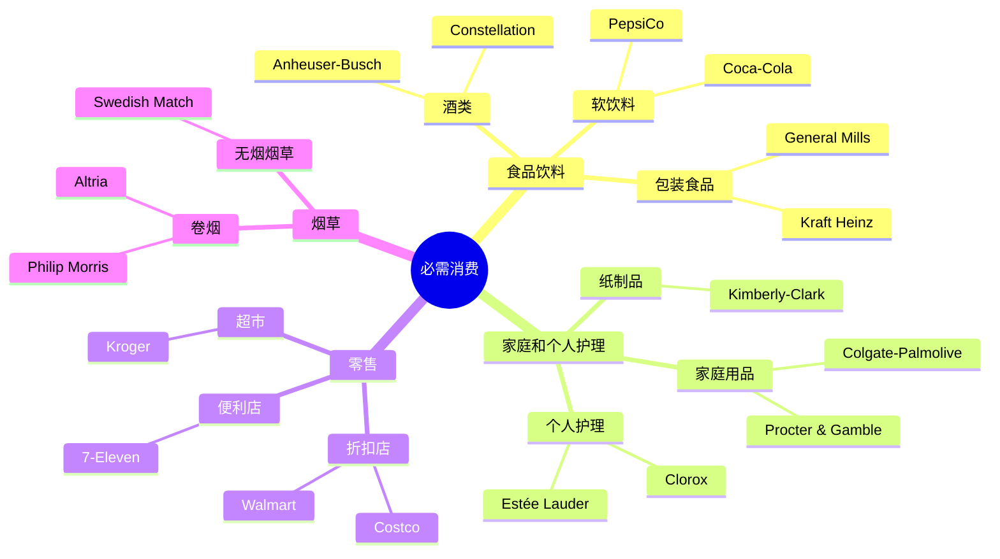

# 美国必需消费行业概览

## 概述

必需消费 (Consumer Staples) 是指日常生活必需的商品和服务，无论经济环境如何，消费者都需要购买。这个行业以其防御性特征、稳定的现金流和持续的分红而受到价值投资者和收入投资者的青睐。

**学习目标**：
- 理解必需消费行业的定义和特点
- 掌握行业的防御性特征和投资价值
- 识别主要子行业和龙头企业
- 学会评估必需消费企业的竞争力
- 理解经济周期对行业的影响

**为什么重要**：
必需消费行业是构建防御性投资组合的核心，许多必需消费龙头企业具有强大的品牌护城河、稳定的现金流和持续的分红能力，是长期投资者的理想选择。

## 行业定义与分类

### GICS 行业分类



### 行业规模

**市值分布** (2024年)：
- 总市值：约 $3.8 万亿
- 占标普 500 指数：6-7%
- 公司数量：约 30-35 家

**子行业占比**：
1. 食品饮料：40%
2. 家庭和个人护理：30%
3. 零售：25%
4. 烟草：5%

## 行业特征

### 1. 防御性强

**需求稳定**：
- 无论经济好坏，人们都需要食品、日用品
- 收入弹性低（Income Elasticity < 1）
- 经济衰退期需求下降幅度小

**历史表现**：
- 2008-2009 金融危机：必需消费指数下跌 15%（vs 可选消费 -45%）
- 2020 疫情：必需消费指数下跌 10%（vs 可选消费 -35%）
- 经济衰退期相对抗跌

**Beta 系数**：
- 行业平均 Beta：0.6-0.8
- 低于整体市场 (1.0)
- 低于可选消费 (1.2-1.5)

### 2. 现金流充沛

**高现金流生成能力**：
- 经营现金流占收入比：15-20%
- 自由现金流充沛
- 支撑高分红和股票回购

**资本支出低**：
- 资本支出占收入比：3-5%
- 轻资产运营
- 高自由现金流转换率

### 3. 高分红率

**股息特征**：
- 平均股息率：2.5-3.5%
- 高于市场平均（1.5-2.0%）
- 许多公司是股息贵族（连续 25年+提高分红）

**分红比例**：
- 平均分红比例：50-70%
- 稳定且可持续
- 吸引收入投资者

### 4. 品牌护城河

**品牌价值**：
- 强大的品牌资产
- 高客户忠诚度
- 定价权优势

**品牌建设**：
- 长期营销投入
- 情感连接
- 代际传承

## 主要子行业分析

### 1. 食品饮料

**行业特点**：
- 品牌驱动
- 规模效应
- 分销网络重要
- 创新相对缓慢

**投资主题**：
- **健康化趋势**：低糖、有机、植物基
- **高端化**：消费升级
- **便利化**：即食、即饮产品
- **全球化**：新兴市场增长

**关键指标**：
- 市场份额
- 品牌力
- 分销覆盖率
- 产品创新能力

**代表公司**：
- Coca-Cola：全球软饮料巨头
- PepsiCo：多元化食品饮料集团
- Kraft Heinz：包装食品领导者
- Mondelez：零食巨头

### 2. 家庭和个人护理

**行业特点**：
- 品牌溢价高
- 产品差异化
- 研发投入重要
- 营销费用高

**投资主题**：
- **高端化**：消费升级
- **天然有机**：健康趋势
- **男性护理**：新兴市场
- **新兴市场**：中产阶级崛起

**关键指标**：
- 品牌组合
- 创新能力
- 毛利率
- 国际化程度

**代表公司**：
- Procter & Gamble：全球最大日用品公司
- Colgate-Palmolive：口腔护理领导者
- Kimberly-Clark：纸制品巨头
- Estée Lauder：高端化妆品集团

### 3. 零售

**行业特点**：
- 规模效应显著
- 运营效率关键
- 价格竞争激烈
- 电商冲击

**投资主题**：
- **会员制模式**：Costco 模式
- **折扣零售**：价格敏感消费者
- **全渠道零售**：线上线下融合
- **私有品牌**：提高利润率

**关键指标**：
- 同店销售增长
- 运营利润率
- 库存周转率
- 会员续费率

**代表公司**：
- Walmart：全球最大零售商
- Costco：会员制仓储零售
- Kroger：美国最大超市连锁
- Target：折扣百货

### 4. 烟草

**行业特点**：
- 高利润率
- 强定价权
- 需求下降
- 监管严格

**投资主题**：
- **新型烟草**：电子烟、加热不燃烧
- **国际市场**：新兴市场增长
- **大麻合法化**：新机会
- **股东回报**：高分红、回购

**关键指标**：
- 销量趋势
- 定价能力
- 市场份额
- 监管环境

**代表公司**：
- Altria：美国烟草巨头
- Philip Morris：国际烟草领导者
- British American Tobacco：全球烟草公司

## 经济周期与投资策略

### 美林时钟应用

```mermaid
quadrantChart
    title 必需消费在美林时钟中的表现
    x-axis 低增长 --> 高增长
    y-axis 低通胀 --> 高通胀
    quadrant-1 滞胀期: 表现较好
    quadrant-2 过热期: 表现一般
    quadrant-3 衰退期: 表现最佳
    quadrant-4 复苏期: 表现较差
    
    必需消费: [0.25, 0.65]
```

### 不同周期的配置策略

**1. 经济衰退期** (最佳配置期)：
- **配置比例**：超配 (30-40%)
- **推荐子行业**：
  - 折扣零售：Walmart, Costco
  - 日用品：P&G, Colgate
  - 基础食品：Kraft Heinz
- **投资逻辑**：防御性强，需求稳定，高分红

**2. 经济复苏期** (减配)：
- **配置比例**：低配 (10-15%)
- **推荐子行业**：
  - 避免周期性弱的子行业
  - 如必须持有，选择高增长企业
- **投资逻辑**：资金流向可选消费和周期性行业

**3. 经济繁荣期** (标配)：
- **配置比例**：标配 (15-20%)
- **推荐子行业**：
  - 高端消费品：Estée Lauder
  - 酒类：Constellation Brands
- **投资逻辑**：消费升级受益

**4. 经济过热期** (增配)：
- **配置比例**：超配 (25-30%)
- **推荐子行业**：
  - 定价权强的企业：Coca-Cola, P&G
  - 抗通胀能力强
- **投资逻辑**：通胀对冲，防御性配置

## 投资分析框架

### 1. 品牌力评估

**品牌价值指标**：
- 品牌认知度
- 品牌忠诚度
- 品牌溢价能力
- 品牌延伸能力

**评估方法**：
- 市场份额趋势
- 定价权（价格弹性）
- 营销效率（ROI）
- 客户留存率

### 2. 财务健康度

**盈利能力**：
- 毛利率 > 40%
- 净利率 > 10%
- ROE > 20%
- ROIC > 15%

**现金流**：
- 经营现金流/收入 > 15%
- 自由现金流为正且增长
- 现金转换周期短

**财务稳健性**：
- 负债率 < 50%
- 利息覆盖率 > 5x
- 流动比率 > 1.5

### 3. 成长性评估

**有机增长**：
- 收入增长 > GDP 增长
- 市场份额提升
- 新产品贡献

**国际化**：
- 国际收入占比
- 新兴市场增长
- 全球化潜力

### 4. 估值方法

**相对估值**：
- **P/E 倍数**：20-30倍（行业平均）
- **P/S 倍数**：2-4倍
- **EV/EBITDA**：15-20倍
- **股息率**：2.5-3.5%

**绝对估值**：
- **DCF 模型**：
  - 收入增长率：3-6%
  - EBITDA 利润率：15-25%
  - 折现率 (WACC)：7-9%
  - 永续增长率：2-3%

## 投资机会与风险

### 投资机会

**1. 防御性配置**：
- 经济不确定性时期的避风港
- 稳定的现金流和分红
- 低波动性

**2. 收入投资**：
- 高股息率
- 股息贵族
- 稳定的分红增长

**3. 品牌价值**：
- 强大的品牌护城河
- 定价权
- 长期竞争优势

**4. 新兴市场增长**：
- 中产阶级崛起
- 品牌消费升级
- 国际化机会

### 主要风险

**1. 增长放缓**：
- 成熟市场饱和
- 人口增长放缓
- 市场份额稳定

**2. 消费者偏好变化**：
- 健康趋势
- 新品牌挑战
- 消费习惯改变

**3. 零售渠道变革**：
- 电商冲击
- 议价能力下降
- 直接面向消费者 (DTC) 品牌

**4. 原材料成本**：
- 大宗商品价格波动
- 包装成本上升
- 物流成本增加

**5. 监管风险**：
- 食品安全法规
- 环保要求
- 糖税、烟草税

## 实战应用

### 必需消费股筛选清单

**宏观环境检查**：
- [ ] 经济处于衰退或不确定期
- [ ] 市场波动性上升
- [ ] 寻求防御性配置

**行业选择**：
- [ ] 行业需求稳定
- [ ] 竞争格局良好
- [ ] 监管环境稳定

**公司筛选**：
- [ ] 行业龙头，市场份额领先
- [ ] 品牌力强，客户忠诚度高
- [ ] 财务健康，现金流充沛
- [ ] 持续分红，股息率 > 2.5%
- [ ] 估值合理，P/E < 25x

### 组合构建建议

**防御型组合** (经济衰退期)：
- 折扣零售：30% (Walmart, Costco)
- 日用品：30% (P&G, Colgate)
- 食品饮料：25% (Coca-Cola, PepsiCo)
- 烟草：15% (Altria, Philip Morris)

**收入型组合** (收入投资者)：
- 高股息率企业：50% (Altria, Kraft Heinz)
- 股息贵族：30% (P&G, Coca-Cola)
- 稳定增长：20% (Costco, Walmart)

**平衡型组合** (长期投资)：
- 龙头企业：40% (P&G, Walmart, Coca-Cola)
- 成长企业：30% (Costco, Estée Lauder)
- 高分红企业：30% (Altria, Kraft Heinz)

## 常见误区

### 误区1：必需消费都是低增长

**错误认知**：必需消费企业增长慢

**正确理解**：
- Costco 过去 10年年化回报 20%+
- Estée Lauder 高端化妆品高增长
- 需要区分企业质量

### 误区2：高股息就是好投资

**错误认知**：股息率越高越好

**正确理解**：
- 需要评估分红可持续性
- 高股息可能是股价下跌导致
- 关注分红增长而非绝对水平

### 误区3：品牌永远强大

**错误认知**：大品牌不会衰落

**正确理解**：
- 消费者偏好会改变
- 新品牌可以颠覆老品牌
- 需要持续创新和投入

### 误区4：忽视估值

**错误认知**：防御性股票可以不看估值

**正确理解**：
- 估值过高同样有风险
- 需要合理的买入价格
- 安全边际很重要

## 延伸阅读

### 推荐书籍

1. **《巴菲特致股东的信》** - 沃伦·巴菲特
   - 必需消费股投资的经典案例

2. **《聪明的投资者》** - 本杰明·格雷厄姆
   - 防御性投资策略

3. **《品牌的起源》** - 艾·里斯、劳拉·里斯
   - 理解品牌价值

### 研究报告

- 麦肯锡：《消费者趋势报告》
- 尼尔森：《全球零售趋势》
- 欧睿：《包装食品市场研究》

### 数据来源

- **美国人口普查局**：零售销售数据
- **美联储**：消费支出数据
- **行业协会**：各细分行业数据

## 参考文献

1. Buffett, W. (2023). *Berkshire Hathaway Annual Letters*. Berkshire Hathaway Inc.

2. Graham, B. (2006). *The Intelligent Investor*. Harper Business.

3. U.S. Census Bureau. (2024). *Monthly Retail Trade Report*.

4. Nielsen. (2024). *Global Retail Trends Report*.

5. McKinsey & Company. (2023). *Consumer Trends Report*.

6. Euromonitor. (2024). *Packaged Food Market Research*.

7. Federal Reserve. (2024). *Consumer Expenditure Data*.

8. MSCI. (2024). *GICS Sector Classification*.

---

**下一步学习**：
- 深入研究 [Procter & Gamble 日用品巨头](./procter-gamble.html)
- 了解 [Walmart 零售帝国](./walmart.html)
- 学习 [Costco 会员制模式](./costco.html)
- 对比 [可选消费行业特点](../discretionary/overview.html)


## 深度分析

### 核心机制解析

理解本主题需要从多个维度进行系统性分析。以下从理论基础、实践应用和历史验证三个层面展开深度探讨。

**理论基础层面**：本主题的核心逻辑建立在经济学和金融学的基本原理之上。通过对基础理论的深入理解，投资者能够建立起稳固的分析框架，避免被市场短期噪音所干扰。

**实践应用层面**：理论必须与实践相结合才能产生价值。在实际投资决策中，需要将抽象的概念转化为具体的分析工具和决策标准。

**历史验证层面**：金融市场有着丰富的历史记录，通过研究历史案例，我们可以验证理论的有效性，并从中提炼出具有普遍意义的规律。

### 关键影响因素

影响本主题的关键因素可以从以下几个维度进行分析：

1. **宏观经济环境**：利率水平、通货膨胀率、经济增长速度等宏观变量对本主题有着深远影响。在不同的宏观经济周期中，相关指标的表现会呈现出显著差异。

2. **市场结构因素**：市场参与者的构成、信息传播机制、流动性状况等市场结构因素决定了价格发现的效率和准确性。

3. **政策监管环境**：政府政策、监管框架的变化会直接影响相关市场的运作规则和参与者行为。

4. **技术创新驱动**：技术进步不断改变着金融市场的运作方式，从算法交易到区块链技术，每一次技术革新都带来新的机遇和挑战。

5. **全球化与地缘政治**：在全球化背景下，各国市场之间的联动性日益增强，地缘政治风险的影响也越来越不可忽视。

### 量化分析框架

为了更精确地分析和评估，可以采用以下量化框架：

| 分析维度 | 关键指标 | 参考基准 | 分析方法 |
|---------|---------|---------|---------|
| 规模评估 | 绝对值与相对值 | 历史均值 | 趋势分析 |
| 质量评估 | 稳定性指标 | 行业对标 | 横向比较 |
| 风险评估 | 波动率指标 | 风险阈值 | 情景分析 |
| 价值评估 | 估值倍数 | 历史区间 | 回归分析 |

通过系统性地应用上述框架，投资者可以对目标进行全面、客观的评估，从而做出更加理性的投资决策。

