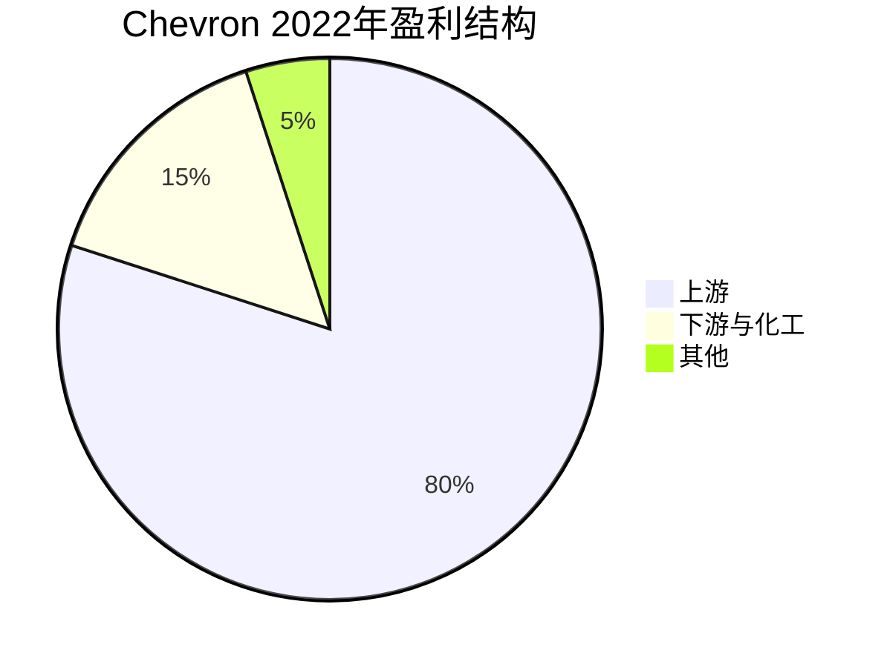

# Chevron - 资本纪律与股东回报的典范

## 公司概况

**基本信息**：
- 成立时间：1879年（太平洋沿岸石油公司，标准石油分支）
- 总部：加利福尼亚州圣拉蒙市
- 上市：NYSE: CVX
- 市值：约2,800-3,200亿美元
- 员工数：约4.3万人
- 年收入：约2,000-2,500亿美元

**主营业务**：
Chevron是美国第二大综合石油天然气公司，业务涵盖上游勘探生产、下游炼化销售和化工业务，以资本纪律和股东回报著称。

**行业地位**：
- 美国第二大石油公司（仅次于ExxonMobil）
- 全球超级石油公司之一
- 道琼斯工业平均指数成分股
- 标普500能源板块最大权重之一

## 商业模式分析

### 业务结构

**1. 上游（Upstream）**

**核心资产**：

**二叠纪盆地（Permian Basin）**：
- Chevron最大增长引擎
- 产量：约75万桶/天（2023年）
- 目标：2025年达到100万桶/天
- 全周期成本：<$30/桶
- 储量：约110亿桶油当量

**哈萨克斯坦（Kazakhstan）**：
- 田吉兹（Tengiz）油田：世界级资产
- 产量：约60万桶/天（Chevron份额约30万桶）
- 扩建项目（FGP-WPMP）：2024年完工
- 长期合同：2033年到期

**澳大利亚LNG**：
- 高更（Gorgon）LNG：年产能1,560万吨
- 惠斯通（Wheatstone）LNG：年产能890万吨
- 全球最大LNG项目之一
- 长期合同锁定收入

**墨西哥湾深水**：
- 多个深水项目
- 技术领先
- 高价值资产

**产量概况**：
- 总产量：约310万桶/天（油当量）
- 石油：约170万桶/天
- 天然气：约840亿立方英尺/天

**2. 下游（Downstream）**

**炼化业务**：
- 炼油能力：约100万桶/天
- 主要炼厂：加州、密西西比、犹他
- 产品：汽油、柴油、航空燃油

**零售网络**：
- 加油站：约8,000个（Chevron、Texaco品牌）
- 主要在美国西部
- 品牌溢价

**3. 化工（Chemical）**

- 与Phillips 66合资（CPChem）
- 乙烯、聚乙烯为主
- 全球化工领导者之一

### 与ExxonMobil的战略差异

**Chevron特点**：
- 更严格的资本纪律
- 更激进的股东回报
- 更精简的资产组合
- 更快速的决策

**ExxonMobil特点**：
- 规模更大
- 技术研发投入更高
- 更多元化的业务
- 更保守的财务

## 竞争优势（护城河）

### 1. 低成本资产组合

**二叠纪盆地优势**：
- 全周期成本：<$30/桶（行业最低之一）
- 大量未开发储量
- 规模效应
- 技术积累

**哈萨克斯坦资产**：
- 世界级油田
- 低成本生产
- 长期合同保障

**成本竞争力**：
- 盈亏平衡油价：约$50/桶（整体组合）
- 即使油价低位也能盈利
- 竞争对手难以匹敌

### 2. 资本纪律

**历史教训**：
- 2014-2016年油价暴跌
- 行业普遍过度投资
- Chevron相对保守

**资本纪律体现**：
- 资本支出上限：$140-160亿/年
- 不追求规模，追求回报
- 严格项目筛选（>10% ROCE）
- 快速响应油价变化

**自由现金流优先**：
- FCF > 资本支出 + 股息
- 剩余用于回购
- 不为增长牺牲回报

### 3. 强大的股东回报

**股息历史**：
- 连续36年增长（截至2023年）
- 股息贵族（Dividend Aristocrat）
- 年增长率：约5-8%
- 股息收益率：3-4%

**股票回购**：
- 2022年：约115亿美元
- 2023年：约150亿美元
- 回购承诺：$75亿/年（最低）
- 高油价时大幅增加

**总股东回报**：
- 2022年：约250亿美元（股息+回购）
- 占自由现金流：约80%
- 行业领先

### 4. 财务实力

**资产负债表**：
- 净债务：约100-150亿美元
- 净债务/EBITDA：<0.5倍（行业最低）
- 信用评级：AA（标普）
- 现金储备：约150亿美元

**财务灵活性**：
- 低杠杆提供缓冲
- 油价下跌时仍能维持股息
- 可以逆周期收购

## 财务分析

### 历史财务表现

**收入与盈利**（单位：十亿美元）：

| 年份 | 收入 | 净利润 | 自由现金流 | 资本支出 |
|------|------|--------|-----------|---------|
| 2019 | 139 | 3 | 10 | 14 |
| 2020 | 94 | -5 | 1 | 13 |
| 2021 | 155 | 16 | 21 | 12 |
| 2022 | 246 | 36 | 37 | 15 |
| 2023 | 200 | 21 | 26 | 16 |

**周期特征**：
- 高度油价敏感
- 2020年疫情亏损
- 2022年创历史盈利纪录
- 资本支出相对稳定（纪律体现）

### 盈利能力

**利润率**：
- 毛利率：25-35%（油价依赖）
- 营业利润率：10-18%
- 净利率：8-15%

**资本回报率**：
- ROCE：10-20%（周期波动）
- ROIC：8-15%
- 行业领先水平

### 现金流分析

**经营现金流**：
- 正常年份：250-350亿美元
- 高油价：350-450亿美元
- 低油价：150-250亿美元

**自由现金流**：
- 资本支出：140-160亿美元/年（严格控制）
- FCF：100-300亿美元/年（油价依赖）
- FCF收益率：4-10%

**资本配置优先级**：
1. 维持股息（约100亿美元/年）
2. 资本支出（140-160亿美元/年）
3. 股票回购（剩余现金）
4. 债务偿还（视情况）

## Hess收购案分析

### 交易概况

**2023年10月宣布**：
- 收购Hess Corporation
- 交易价值：约530亿美元（全股票）
- 溢价：约10%
- 预计2024年完成

**战略意义**：
- 获得圭亚那（Guyana）资产
- 圭亚那：世界级深水发现
- 储量：110亿桶油当量
- 产量：2030年目标120万桶/天

**圭亚那资产价值**：
- 低成本：盈亏平衡<$35/桶
- 高增长：产量快速增长
- 长期资产：30年+开发周期
- 与ExxonMobil合作（运营商）

**挑战**：
- ExxonMobil主张优先购买权
- 仲裁争议
- 监管审批
- 整合风险

### 战略逻辑

**为何需要Hess**：
- 二叠纪盆地增长有限
- 需要新的长期增长引擎
- 圭亚那是最优质资产之一
- 补充资产组合

**风险**：
- 全股票交易，稀释现有股东
- 整合成本
- 圭亚那法律风险
- 估值是否合理

## 能源转型策略

### Chevron的立场

**现实主义路线**：
- 化石能源仍需数十年
- 不大举投资可再生能源
- 聚焦低碳化石能源
- 技术路线：CCS、氢能、生物燃料

**低碳投资**：
- 2021-2028年：约100亿美元低碳投资
- CCS：工业碳捕获
- 氢能：蓝氢（天然气+CCS）
- 可再生燃料：生物柴油、可持续航空燃料

**与欧洲公司对比**：
- BP、Shell：激进转型，大举投资可再生能源
- Chevron：保守转型，聚焦核心业务
- 结果：Chevron股价表现更好（2020-2023）

### 碳减排目标

**承诺**：
- 2028年前将碳强度降低35%
- 甲烷排放强度降低50%
- 常规火炬燃烧降低90%

**路径**：
- 运营效率提升
- 甲烷泄漏控制
- CCS项目
- 可再生能源用于运营

## 投资论点

### 看多理由

**1. 低成本资产**
- 二叠纪盆地：全周期成本<$30/桶
- 哈萨克斯坦：世界级低成本资产
- 即使油价$50也能盈利

**2. 资本纪律**
- 严格控制资本支出
- 不追求规模
- 自由现金流优先

**3. 股东回报**
- 36年连续股息增长
- 大规模回购
- 总回报率行业领先

**4. 财务实力**
- 最低净债务/EBITDA
- AA信用评级
- 逆周期收购能力

**5. 圭亚那增长**
- Hess收购带来世界级资产
- 长期增长引擎
- 低成本高回报

### 风险因素

**1. 油价风险**
- 最大风险
- 2020年亏损教训
- 不可预测

**2. 能源转型**
- 长期需求不确定
- 搁浅资产风险
- ESG压力

**3. Hess收购风险**
- 圭亚那法律争议
- 整合风险
- 股票稀释

**4. 地缘政治**
- 哈萨克斯坦风险
- 中东不稳定
- 制裁风险

**5. 监管风险**
- 碳税
- 开采限制
- 环保法规

## 估值分析

### 相对估值

**可比公司**（2023年）：

| 指标 | Chevron | ExxonMobil | ConocoPhillips |
|------|---------|------------|----------------|
| P/E | 10-12x | 9-11x | 11-13x |
| EV/EBITDA | 5-6x | 4-5x | 5-7x |
| FCF收益率 | 6-9% | 7-10% | 7-9% |
| 股息率 | 3.5-4% | 3-3.5% | 2-2.5% |

**估值评估**：
- 相对ExxonMobil略有溢价（资本纪律）
- 相对ConocoPhillips相近
- 整体估值合理

### DCF估值

**假设**：
- 长期油价：$75/桶
- 产量增长：2-3%/年（2024-2028）
- FCF利润率：12-15%
- WACC：8-9%
- 永续增长率：0-1%

**估值结果**：
- 每股内在价值：$170-200
- 当前价格（假设$155）：低估10-30%

### 周期调整估值

**正常化假设**（$75油价）：
- 净利润：约200亿美元
- 自由现金流：约250亿美元
- P/E 12倍：每股$185
- FCF收益率8%：每股$190

## 投资策略

### 适合投资者类型

**价值投资者**：
- 低估值
- 高现金流
- 股息增长

**收入投资者**：
- 股息收益率：3-4%
- 36年连续增长
- 股息安全性高

**质量投资者**：
- 最强资产负债表
- 最严格资本纪律
- 行业最佳管理

### 持有策略

**长期持有**：
- 持有期：5-10年
- 股息再投资
- 周期平滑

**监测指标**：
- 油价趋势
- 二叠纪产量增长
- 圭亚那进展（Hess收购后）
- 自由现金流
- 股息增长

### 配置建议

**能源板块核心持仓**：
- 能源板块：30-40%
- 价值组合：10-15%
- 收入组合：10-15%

**与ExxonMobil搭配**：
- 两者互补
- Chevron：资本纪律、股东回报
- ExxonMobil：规模、技术
- 合计：能源板块核心配置

## 关键学习点

**1. 资本纪律的价值**
- 不追求规模，追求回报
- 严格项目筛选
- 自由现金流优先
- 长期股东价值

**2. 低成本资产的重要性**
- 全周期成本决定竞争力
- 低成本资产在低油价时仍盈利
- 二叠纪盆地是战略资产

**3. 股东回报的可持续性**
- 36年连续股息增长
- 需要稳定现金流支撑
- 资本纪律是基础

**4. 周期性行业的投资时机**
- 低油价时买入
- 高油价时减持
- 关注资产质量而非短期盈利

**5. 能源转型的平衡**
- 不激进转型
- 聚焦核心竞争力
- 渐进调整

## 延伸阅读

### 推荐资源

1. Chevron年报和10-K
2. 投资者日演示
3. EIA能源数据
4. IEA世界能源展望
5. Wood Mackenzie上游分析

## 参考文献

1. Chevron Corporation. (2023). *Annual Report*.
2. EIA. (2023). "Annual Energy Outlook".
3. IEA. (2023). "World Energy Outlook".
4. Goldman Sachs. (2023). "Chevron Analysis".
5. Morgan Stanley. (2023). "Energy Research".
6. Wood Mackenzie. (2023). "Permian Basin Analysis".
7. J.P. Morgan. (2023). "Oil & Gas Sector Review".
8. Bernstein Research. (2023). "Chevron vs ExxonMobil".
