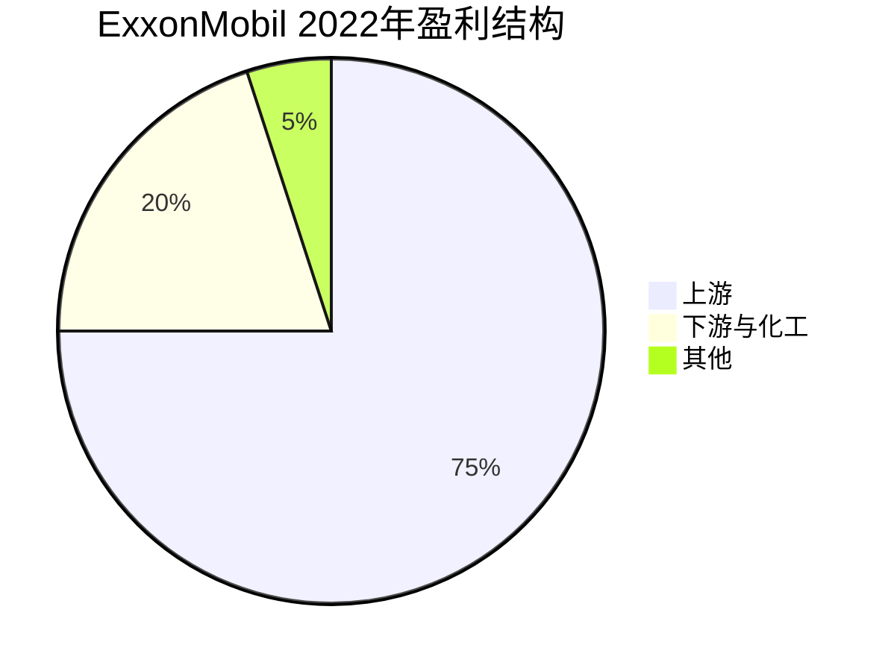
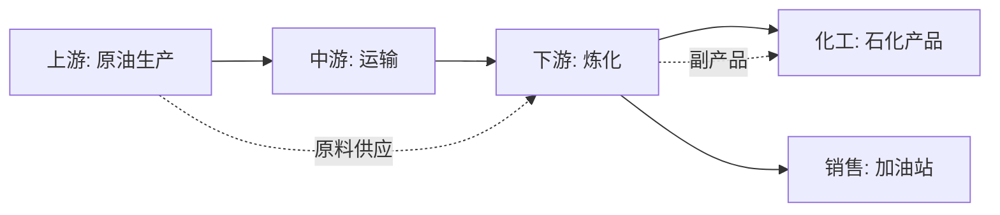
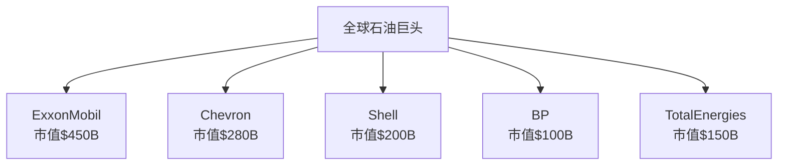

# ExxonMobil - 石油巨头的韧性与转型

## 公司概况

**基本信息**：
- 成立时间：1999年（Exxon与Mobil合并）
- 历史渊源：标准石油公司（1870年，洛克菲勒创立）
- 总部：德克萨斯州欧文市
- 上市时间：NYSE: XOM
- 市值：约4,000-5,000亿美元
- 员工数：约6.2万人
- 年收入：约3,500-4,000亿美元

**主营业务**：
ExxonMobil是全球最大的上市石油天然气公司之一，业务涵盖上游勘探生产、下游炼化销售和化工业务。

**行业地位**：
- 全球市值最大的石油公司
- 美国最大的炼油商
- 全球化工业务领导者
- 标普500成分股、道琼斯成分股

## 商业模式分析

### 业务结构

**1. 上游（Upstream）**

**勘探与生产**：
- 石油产量：约230万桶/天
- 天然气产量：约90亿立方英尺/天
- 油当量：约370万桶/天

**核心资产**：
- **二叠纪盆地（Permian Basin）**：
  - 美国最大页岩油产区
  - ExxonMobil最大增长引擎
  - 产量：约50万桶/天，目标100万桶/天
  - 成本优势：全周期成本<$35/桶

- **圭亚那（Guyana）**：
  - 世界级深水发现
  - 储量：110亿桶油当量
  - 产量：约40万桶/天，目标120万桶/天
  - 盈亏平衡：<$35/桶

- **LNG业务**：
  - 全球第二大LNG生产商
  - 巴布亚新几内亚、莫桑比克项目
  - 增长潜力：亚洲需求

**盈利贡献**：约75%（油价依赖）
**资本开支**：约60-70%总资本开支

**2. 下游（Downstream）**

**炼化业务**：
- 炼油能力：约480万桶/天
- 全球最大炼油商之一
- 炼厂分布：美国、欧洲、亚太
- 产品：汽油、柴油、航空燃油

**销售网络**：
- 加油站：约1.2万个（Exxon, Mobil品牌）
- 润滑油：Mobil 1等高端品牌
- 全球分销网络

**盈利驱动**：
- 炼化利差（Crack Spread）
- 产能利用率
- 产品需求

**盈利贡献**：约15-20%
**资本开支**：约15-20%

**3. 化工（Chemical）**

**产品线**：
- 基础化学品：乙烯、丙烯
- 聚合物：聚乙烯、聚丙烯
- 特种化学品：合成润滑油基础油

**竞争优势**：
- 原料一体化：炼厂副产品
- 规模优势：全球第三大化工公司
- 技术领先：专利技术

**盈利贡献**：约5-10%
**资本开支**：约10-15%

### 综合一体化优势

**垂直整合**：

**协同效应**：
- 原料保障：上游供应下游
- 成本优势：内部转移定价
- 风险对冲：上下游利润平衡
- 技术共享：研发协同

**周期平滑**：
- 油价高：上游盈利强
- 油价低：下游炼化利差扩大
- 整体：波动性降低

## 竞争分析

### 全球石油巨头格局

**超级石油公司（Supermajors）**：

**市场地位**：
- 市值：全球第一
- 产量：前五名
- 储量：前五名
- 盈利能力：行业领先

### ExxonMobil vs Chevron

**战略差异**：

**ExxonMobil**：
- 规模优先：全球最大
- 技术领先：研发投入高
- 长期主义：大型项目
- 保守财务：低杠杆

**Chevron**：
- 资本纪律：更严格
- 股东回报：更激进
- 资产优化：剥离非核心
- 灵活应对：快速调整

**财务对比**（2022年）：
- 收入：ExxonMobil $400B vs Chevron $246B
- 净利润：ExxonMobil $56B vs Chevron $36B
- 自由现金流：ExxonMobil $62B vs Chevron $35B
- 股息收益率：ExxonMobil 3.5% vs Chevron 3.8%

### 竞争优势（护城河）

**1. 规模优势**

**全球资产组合**：
- 运营：40+国家
- 储量：220亿桶油当量
- 产量：370万桶/天
- 炼油：480万桶/天

**规模效应**：
- 采购议价能力
- 技术研发摊薄
- 风险分散
- 融资成本低

**2. 技术领先**

**研发投入**：
- 年度研发：约10亿美元
- 研发/收入：约0.3%
- 专利组合：数千项

**核心技术**：
- 深水钻探：圭亚那项目
- 页岩开发：二叠纪盆地
- LNG技术：液化、运输
- 碳捕获：CCS技术

**3. 低成本生产**

**成本结构**：
- 二叠纪盆地：全周期成本<$35/桶
- 圭亚那：盈亏平衡<$35/桶
- 行业领先：成本控制能力

**效率提升**：
- 数字化：AI优化生产
- 自动化：降低人工成本
- 规模化：批量开发

**4. 财务实力**

**资产负债表**：
- 总资产：约3,700亿美元
- 净债务：约200-300亿美元
- 净债务/资本：<20%
- 信用评级：AA（标普）

**现金流**：
- 经营现金流：600-800亿美元/年
- 自由现金流：400-600亿美元/年
- 现金储备：约300亿美元

**5. 品牌价值**

**历史积淀**：
- 150+年历史（标准石油）
- 全球认知度
- 技术声誉

**客户信任**：
- B2B：长期合作
- B2C：品牌忠诚度
- 政府：可靠合作伙伴

## 财务分析

### 历史财务表现

**收入与盈利**（单位：十亿美元）：

**周期波动**：
- 2014年：$394B收入，$32B净利润（油价高）
- 2016年：$218B收入，$8B净利润（油价低谷）
- 2020年：$181B收入，-$22B净利润（疫情）
- 2022年：$413B收入，$56B净利润（油价反弹）
- 2023年：$345B收入，$36B净利润（正常化）

**周期性特征**：
- 高度油价敏感
- 盈利波动大
- 现金流相对稳定

### 盈利能力

**利润率**：
- 毛利率：20-30%（油价依赖）
- 营业利润率：8-15%
- 净利率：5-15%

**资本回报率**：
- ROE：10-20%（周期波动）
- ROIC：8-15%
- ROCE：10-18%

**盈利质量**：
- 现金流转化：优秀
- 经营现金流/净利润：150-200%
- 资本开支纪律：改善

### 现金流分析

**经营现金流**：
- 正常年份：600-800亿美元
- 高油价：800-1,000亿美元
- 低油价：400-600亿美元

**自由现金流**：
- 资本开支：200-250亿美元/年
- FCF：400-600亿美元/年（正常）
- FCF收益率：8-12%

**资本配置**：
- 股息：约150亿美元/年
- 回购：100-200亿美元/年（周期性）
- 债务偿还：视情况而定
- 增长投资：二叠纪、圭亚那

### 资本结构

**债务水平**：
- 总债务：约450-500亿美元
- 净债务：约200-300亿美元
- 净债务/EBITDA：<1倍

**信用评级**：
- 标普：AA
- 穆迪：Aa2
- 行业最高评级之一

**股东权益**：
- 账面价值：约1,800亿美元
- 市净率：2-3倍
- 股息历史：连续40年增长

## 能源转型策略

### 低碳业务布局

**1. 碳捕获与封存（CCS）**

**投资规模**：
- 2030年前：约150亿美元
- 目标：全球最大CCS运营商

**项目**：
- 休斯顿CCS Hub：年捕获1亿吨CO2
- 工业碳捕获：炼厂、化工厂
- 商业模式：向排放企业收费

**2. 氢能**

**蓝氢**：
- 天然气制氢+CCS
- 利用现有基础设施
- 成本优势

**应用**：
- 工业用氢
- 交通燃料
- 发电

**3. 生物燃料**

**可再生柴油**：
- 利用现有炼厂
- 原料：废弃油脂、植物油
- 产能：约4万桶/天

**4. 低碳化学品**

**循环经济**：
- 塑料回收技术
- 化学回收：塑料变原料
- 减少碳足迹

### 战略定位

**ExxonMobil立场**：
- 现实主义：化石能源仍需数十年
- 技术路线：CCS、氢能优先
- 渐进转型：而非激进转型
- 股东价值：不牺牲回报

**与欧洲石油公司对比**：
- BP、Shell：激进转型，大举投资可再生能源
- ExxonMobil：保守转型，聚焦核心业务+低碳技术
- 争议：转型速度是否足够

## 投资论点

### 看多理由

**1. 油价支撑**

**供需平衡**：
- 全球需求：仍在增长（新兴市场）
- 供应约束：投资不足
- 油价中枢：$70-90/桶（长期）

**地缘政治**：
- 中东不稳定
- 俄乌冲突
- 供应风险溢价

**2. 低成本资产**

**二叠纪盆地**：
- 全周期成本：<$35/桶
- 产量增长：翻倍潜力
- 现金流：高回报

**圭亚那**：
- 世界级发现
- 低成本：<$35/桶
- 增长潜力：巨大

**3. 资本纪律改善**

**页岩革命教训**：
- 过去：过度投资
- 现在：资本纪律
- 自由现金流优先

**股东回报**：
- 股息：连续增长
- 回购：大规模
- 总回报：年均8-10%

**4. 估值吸引力**

**相对估值**：
- P/E：8-12倍
- EV/EBITDA：4-6倍
- FCF收益率：8-12%

**绝对估值**：
- DCF：基于$70-80油价
- 上行空间：20-40%

**5. 通胀对冲**

**能源与通胀**：
- 正相关：能源价格上涨
- 实物资产：保值
- 股息增长：对冲通胀

### 风险因素

**1. 能源转型风险**

**需求峰值**：
- 电动车普及
- 可再生能源替代
- 石油需求下降

**搁浅资产**：
- 长期资产贬值
- 储量价值下降
- 投资回报不确定

**2. 政策风险**

**碳税**：
- 成本上升
- 竞争力下降

**监管**：
- 环保法规
- 开采限制
- 排放标准

**3. 油价波动**

**周期性**：
- 油价暴跌：盈利大幅下降
- 2020年：负油价
- 不可预测性

**4. ESG压力**

**投资者撤资**：
- 机构投资者
- 主权基金
- 养老金

**融资成本**：
- 绿色溢价
- 融资困难
- 估值折价

**5. 地缘政治**

**资产风险**：
- 国有化
- 制裁
- 战争

**运营风险**：
- 安全事故
- 环境污染
- 社区关系

## 估值分析

### 周期调整估值

**正常化假设**：
- 油价：$75/桶（长期）
- 产量：380万桶/天
- 炼化利差：正常水平

**盈利预测**：
- 净利润：350-400亿美元/年
- 自由现金流：450-550亿美元/年

**估值**：
- P/E 10倍：每股$120-140
- FCF收益率8%：每股$140-160
- 当前价格（假设$110）：低估10-30%

### DCF估值

**假设**：
- 收入增长：0-2%（长期）
- FCF利润率：12-14%
- WACC：8-9%
- 永续增长率：0-1%

**估值结果**：
- 每股内在价值：$130-160
- 上行空间：20-45%

### 相对估值

**可比公司**：
- Chevron：P/E 10-12倍，EV/EBITDA 5-6倍
- Shell：P/E 8-10倍
- BP：P/E 7-9倍

**ExxonMobil**：
- P/E：9-11倍
- EV/EBITDA：4-5倍
- 估值合理：略低于Chevron

## 投资策略

### 适合投资者类型

**价值投资者**：
- 低估值
- 高现金流
- 股息增长

**收入投资者**：
- 股息收益率：3-4%
- 股息增长：年均3-5%
- 股息安全性：高

**周期投资者**：
- 油价周期
- 经济复苏受益
- 通胀对冲

### 持有策略

**长期持有**：
- 持有期：5-10年
- 股息再投资
- 周期平滑

**监测指标**：
- 油价趋势
- 产量增长（二叠纪、圭亚那）
- 自由现金流
- 资本纪律
- 能源转型进展

### 配置建议

**核心持仓**：
- 能源板块：20-30%
- 价值组合：10-15%
- 收入组合：10-15%

**与其他能源股搭配**：
- Chevron：对冲
- 中游管道：稳定现金流
- 可再生能源：长期增长

## 关键学习点

**1. 综合一体化价值**
- 上下游协同
- 风险对冲
- 周期平滑

**2. 规模与技术优势**
- 低成本生产
- 技术领先
- 难以复制

**3. 资本纪律重要性**
- 自由现金流优先
- 股东回报
- 避免过度投资

**4. 周期性投资**
- 油价周期
- 逆向投资
- 长期持有

**5. 能源转型挑战**
- 长期需求不确定
- 转型速度争议
- 平衡短期与长期

## 延伸阅读

### 推荐书籍

1. **《The Prize》** - Daniel Yergin，石油史诗
2. **《Private Empire》** - Steve Coll，ExxonMobil深度调查
3. **《Titan》** - Ron Chernow，洛克菲勒传记
4. **《The Quest》** - Daniel Yergin，能源未来

### 研究资源

**公司资源**：
- ExxonMobil年报
- 季度财报
- 投资者日
- 能源展望报告

**行业数据**：
- EIA能源数据
- IEA世界能源展望
- OPEC月度报告
- Baker Hughes钻机数

**分析报告**：
- 投行能源研究
- 能源咨询公司
- 独立分析师

## 参考文献

1. ExxonMobil. (2023). *Annual Report*.
2. Yergin, D. (1991). *The Prize: The Epic Quest for Oil, Money & Power*. Free Press.
3. Coll, S. (2012). *Private Empire: ExxonMobil and American Power*. Penguin.
4. EIA. (2023). "Annual Energy Outlook".
5. IEA. (2023). "World Energy Outlook".
6. OPEC. (2023). "Monthly Oil Market Report".
7. Goldman Sachs. (2023). "Energy Research".
8. Morgan Stanley. (2023). "ExxonMobil Analysis".
9. Credit Suisse. (2023). "Oil & Gas Industry Report".
10. Wood Mackenzie. (2023). "Upstream Analysis".
