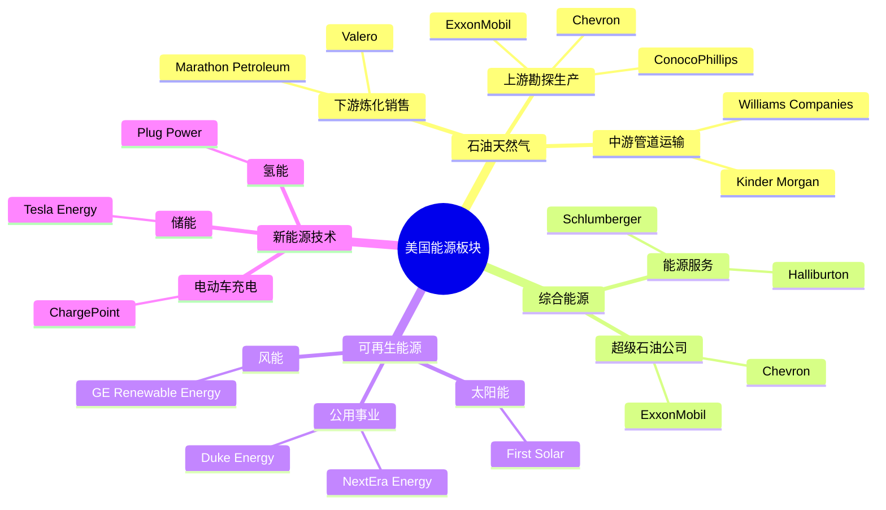
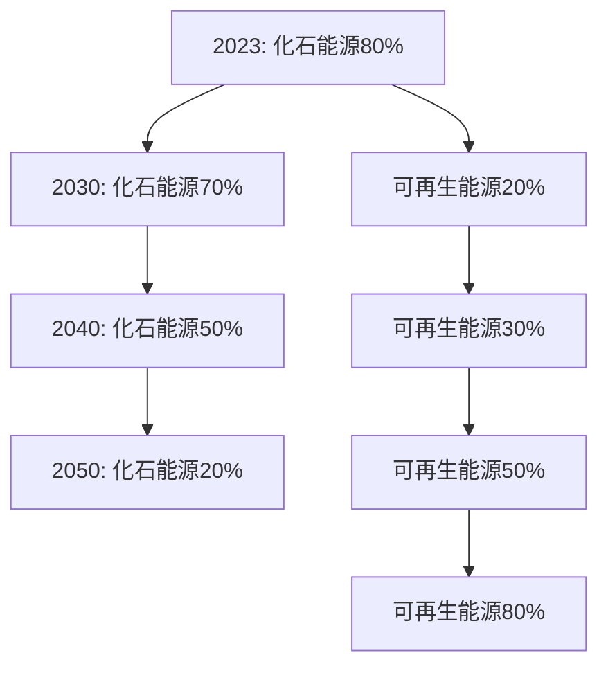

# 美国能源板块总览

## 概述

美国能源板块正经历历史性转型，从传统化石能源主导向清洁能源多元化发展。作为全球最大的能源生产国和消费国，美国能源行业的变革对全球能源格局具有深远影响。

**学习目标**：
- 理解美国能源板块的整体结构和演变
- 掌握传统能源与新能源的投资逻辑差异
- 分析能源转型对投资的影响
- 识别能源板块的周期性特征
- 了解能源政策对行业的影响

**为什么重要**：
能源是经济的血液，能源板块投资具有独特的周期性、政策敏感性和长期结构性变化。理解能源板块对于把握宏观经济、通胀趋势和长期投资机会至关重要。

## 板块结构与规模

### 市场规模

**能源板块在标普500中的地位**：
- 市值占比：约4-6%（历史上曾达15%+）
- 市值规模：约2-3万亿美元
- 企业数量：约20-25家
- 全球能源市值占比：约30-35%

**市值占比下降原因**：
- 能源转型预期
- ESG投资压力
- 页岩革命后价格低迷
- 科技股崛起

### 细分行业结构

### 主要细分领域

**1. 石油天然气（Oil & Gas）**

**上游（Upstream/E&P）**：
- 勘探与生产
- 市值占比：40-45%
- 代表企业：ExxonMobil, Chevron, ConocoPhillips
- 特点：高资本开支、周期性强、油价敏感

**中游（Midstream）**：
- 管道运输、储存
- 市值占比：15-20%
- 代表企业：Kinder Morgan, Williams Companies
- 特点：稳定现金流、类公用事业、高股息

**下游（Downstream）**：
- 炼化、销售
- 市值占比：15-20%
- 代表企业：Marathon Petroleum, Valero
- 特点：炼化利差驱动、相对稳定

**2. 可再生能源（Renewable Energy）**

**公用事业（Utilities）**：
- 电力生产与配送
- 市值占比：15-20%
- 代表企业：NextEra Energy, Duke Energy
- 特点：监管定价、稳定股息、能源转型受益

**太阳能（Solar）**：
- 光伏制造、项目开发
- 市值占比：<5%
- 代表企业：First Solar, Sunrun
- 特点：成本快速下降、政策敏感、增长潜力大

**风能（Wind）**：
- 风电设备、项目开发
- 市值占比：<5%
- 代表企业：GE Renewable Energy（GE旗下）
- 特点：海上风电增长、技术进步

**3. 能源服务（Energy Services）**

**油田服务**：
- 钻井、完井、测井
- 代表企业：Schlumberger, Halliburton
- 特点：资本开支周期、技术密集

## 板块特征与投资逻辑

### 核心特征

**1. 强周期性**

**周期驱动因素**：
- 全球经济增长
- 供需平衡
- OPEC+政策
- 地缘政治
- 技术进步（页岩革命）

**2. 大宗商品价格敏感**

**油价影响**：
- 上游：直接影响收入和利润
- 中游：间接影响（运输量）
- 下游：炼化利差影响

**天然气价格**：
- 美国页岩气革命
- 价格相对独立于油价
- 季节性波动

**3. 资本密集型**

**资本开支特征**：
- 上游：高资本开支（钻井、设备）
- 中游：管道建设
- 下游：炼厂升级
- 可再生能源：项目投资

**资本纪律**：
- 页岩革命后：强调资本纪律
- 自由现金流优先
- 股东回报提升

**4. 能源转型压力**

**ESG压力**：
- 机构投资者撤资
- 融资成本上升
- 估值折价

**政策推动**：
- 碳中和目标
- 可再生能源补贴
- 碳税与碳交易

**技术进步**：
- 可再生能源成本下降
- 电动车普及
- 储能技术突破

## 传统能源：石油天然气

### 行业结构

**全球石油市场**：
- 日需求：约1亿桶/天
- 美国产量：约1,300万桶/天（全球第一）
- 美国消费：约2,000万桶/天
- 页岩油占比：约70%美国产量

**天然气市场**：
- 美国产量：全球第一
- 页岩气革命：产量翻倍
- LNG出口：快速增长
- 价格：相对低廉

### 页岩革命影响

**技术突破**：
- 水平钻井
- 水力压裂
- 成本大幅下降

**影响**：
- 美国能源独立
- 全球油价中枢下移
- OPEC影响力下降
- 地缘政治格局变化

### 投资逻辑

**上游E&P公司**：

**价值驱动**：
- 油价：最关键因素
- 储量：资源基础
- 生产成本：竞争力
- 资本纪律：现金流

**估值方法**：
- EV/EBITDA：常用
- P/CF：现金流倍数
- NAV：净资产价值（储量估值）
- 股息收益率

**关键指标**：
- 储量替代率
- 全周期成本（Full-Cycle Cost）
- 盈亏平衡油价
- 自由现金流

**中游管道公司**：

**商业模式**：
- 收费制：按运输量收费
- 长期合同：10-20年
- 稳定现金流：类公用事业

**投资吸引力**：
- 高股息：6-8%
- 低波动性
- 防御性
- 通胀保护

**下游炼化公司**：

**盈利驱动**：
- 炼化利差（Crack Spread）
- 产能利用率
- 产品需求

**周期性**：
- 相对上游更稳定
- 与经济活动相关
- 季节性（夏季驾驶季）

## 可再生能源：未来趋势

### 行业增长

**全球趋势**：
- 可再生能源占比：约30%（2023年）
- 目标：2050年达到70-80%
- 年增长率：10-15%

**美国市场**：
- 可再生能源发电：约20%
- 太阳能+风能：约12%
- 快速增长：年均15-20%

### 技术进步

**成本下降**：
- 太阳能：过去10年下降90%
- 风能：下降70%
- 储能：下降85%

**平价上网**：
- 太阳能、风能：已低于化石能源
- 无需补贴：市场化竞争
- 经济性：持续改善

### 投资机会

**公用事业公司**：

**NextEra Energy模式**：
- 传统公用事业+可再生能源
- 全美最大可再生能源运营商
- 稳定增长：年均6-8%
- 高质量股息：持续增长

**投资逻辑**：
- 监管回报：稳定收益
- 能源转型受益
- 长期增长可见
- 防御性配置

**太阳能公司**：

**细分领域**：
- 组件制造：First Solar
- 住宅安装：Sunrun
- 项目开发：多家

**投资考虑**：
- 政策敏感：ITC税收抵免
- 竞争激烈：中国竞争
- 增长潜力：巨大
- 波动性：高

**新能源技术**：

**储能**：
- 电池技术：锂电池、固态电池
- 应用：电网储能、家庭储能
- 增长：爆发式

**氢能**：
- 绿氢：可再生能源制氢
- 应用：工业、交通
- 早期阶段：高风险高回报

**电动车充电**：
- 基础设施：充电桩网络
- 政策支持：联邦投资
- 竞争：Tesla、ChargePoint等

## 能源转型：挑战与机遇

### 转型路径

**转型驱动力**：
- 气候变化：减排压力
- 技术进步：成本下降
- 政策支持：补贴、碳税
- 社会压力：ESG投资

### 传统能源公司应对

**战略转型**：

**1. 多元化**：
- 投资可再生能源
- 发展低碳业务
- 碳捕获技术

**2. 资本纪律**：
- 控制资本开支
- 提高股东回报
- 优化资产组合

**3. 技术创新**：
- 降低生产成本
- 提高能源效率
- 减少碳排放

**案例**：
- ExxonMobil：投资碳捕获、氢能
- Chevron：可再生柴油、氢能
- BP：转型为综合能源公司

### 投资策略调整

**传统能源**：
- 短中期：仍有价值
- 现金流：高股息
- 估值：折价
- 风险：长期需求下降

**可再生能源**：
- 长期：结构性增长
- 估值：溢价
- 风险：政策变化、竞争

**平衡配置**：
- 传统能源：现金流、股息
- 可再生能源：增长、未来
- 动态调整：根据周期和政策

## 财务特征与估值

### 典型财务指标

**传统能源（上游）**：
- 毛利率：30-50%（油价依赖）
- 营业利润率：15-30%
- 净利率：10-20%
- ROE：10-20%
- ROIC：8-15%

**中游管道**：
- EBITDA利润率：50-60%
- 净利率：20-30%
- ROE：8-12%
- 股息收益率：6-8%

**可再生能源公用事业**：
- 营业利润率：20-30%
- 净利率：10-15%
- ROE：8-12%
- 股息收益率：2-4%

### 估值方法

**传统能源**：

**周期调整估值**：
- 使用正常化油价（$60-80/桶）
- 周期平均盈利
- 避免周期顶部高估

**NAV估值**：
- 储量估值：PV-10
- 未来现金流折现
- 适用于E&P公司

**现金流倍数**：
- EV/EBITDA：4-8倍
- P/CF：5-10倍
- FCF收益率：8-15%

**可再生能源**：

**增长估值**：
- P/E：20-30倍
- PEG：1-2倍
- 考虑增长率

**监管资产估值**：
- P/B：1.5-2.5倍
- 监管回报率：8-10%

## 投资策略与时机

### 周期性投资

**油价周期**：

**买入时机**：
- 油价低迷：$40-50/桶
- 悲观情绪：市场恐慌
- 估值低位：EV/EBITDA<5倍

**卖出时机**：
- 油价高企：$100+/桶
- 乐观情绪：过度乐观
- 估值高位：EV/EBITDA>10倍

**持有策略**：
- 关注供需平衡
- 监测OPEC+政策
- 评估地缘政治风险

### 长期配置

**传统能源**：
- 配置比例：5-10%
- 目的：股息收入、通胀对冲
- 选择：高质量、低成本生产商

**可再生能源**：
- 配置比例：5-15%
- 目的：长期增长、ESG
- 选择：龙头公用事业、技术领先者

**平衡组合**：
- 传统+可再生：10-20%
- 动态调整：根据周期和政策
- 风险分散：不同细分领域

## 风险因素

**宏观风险**：
- 经济衰退：需求下降
- 油价暴跌：盈利压力
- 利率上升：估值压力

**政策风险**：
- 碳税：成本上升
- 补贴取消：可再生能源影响
- 监管变化：运营限制

**技术风险**：
- 电动车普及：石油需求峰值
- 储能突破：电网灵活性
- 新技术：颠覆现有模式

**地缘政治**：
- 中东冲突：供应中断
- 制裁：市场扭曲
- 贸易摩擦：供应链影响

**ESG压力**：
- 投资者撤资
- 融资困难
- 估值折价

## 关键学习点

**1. 周期性投资**
- 在周期底部买入
- 关注供需平衡
- 避免周期顶部追高

**2. 能源转型**
- 长期结构性变化
- 传统能源仍有价值
- 可再生能源增长确定

**3. 现金流重要性**
- 资本密集型行业
- 自由现金流>账面利润
- 股息可持续性

**4. 政策影响**
- 能源政策敏感
- 关注政府态度
- 补贴与税收影响

**5. 多元化配置**
- 传统+可再生
- 不同细分领域
- 风险分散

## 延伸阅读

### 推荐书籍

1. **《The Prize》** - Daniel Yergin，石油史诗
2. **《The Quest》** - Daniel Yergin，能源未来
3. **《The New Map》** - Daniel Yergin，能源地缘政治
4. **《Drawdown》** - Paul Hawken，气候解决方案
5. **《Energy and Civilization》** - Vaclav Smil，能源与文明

### 研究资源

**行业数据**：
- EIA（美国能源信息署）
- IEA（国际能源署）
- OPEC月度报告
- Baker Hughes钻机数

**公司资源**：
- 各公司年报
- 季度财报
- 投资者日
- 储量报告

**分析报告**：
- 投行能源研究
- 咨询公司报告
- 能源智库

## 参考文献

1. Yergin, D. (2011). *The Quest: Energy, Security, and the Remaking of the Modern World*. Penguin.
2. EIA. (2023). "Annual Energy Outlook".
3. IEA. (2023). "World Energy Outlook".
4. OPEC. (2023). "Monthly Oil Market Report".
5. ExxonMobil. (2023). *Annual Report*.
6. Chevron. (2023). *Annual Report*.
7. NextEra Energy. (2023). *Annual Report*.
8. McKinsey & Company. (2023). "Global Energy Perspective".
9. Goldman Sachs. (2023). "Energy Research".
10. Morgan Stanley. (2023). "Energy Transition Report".
11. Wood Mackenzie. (2023). "Energy Market Analysis".
12. Bloomberg NEF. (2023). "New Energy Outlook".
13. IRENA. (2023). "Renewable Energy Statistics".
14. BP. (2023). "Statistical Review of World Energy".
15. S&P Global Platts. (2023). Various energy data.
