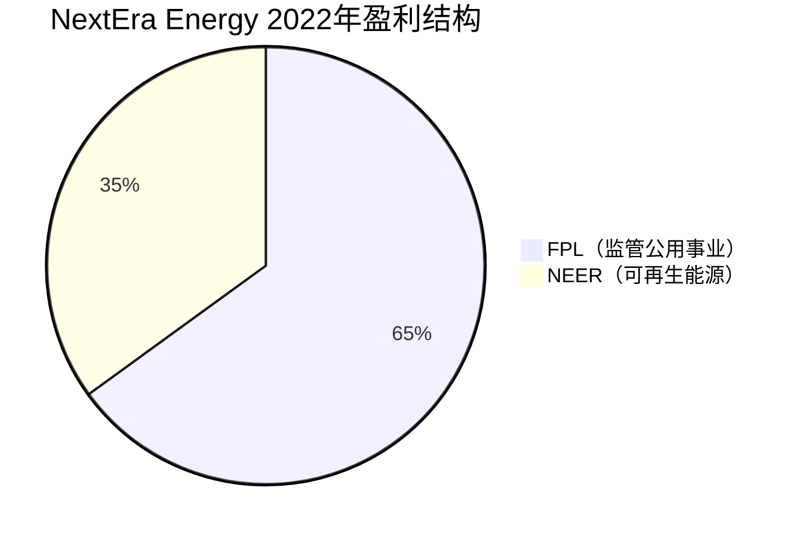
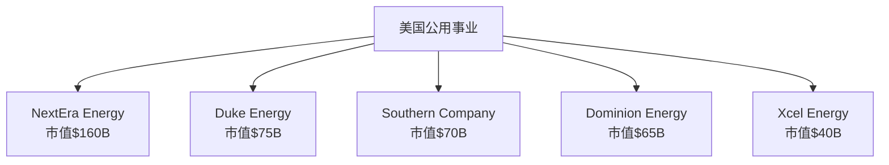

# NextEra Energy - 清洁能源转型的领导者

## 公司概况

**基本信息**：
- 成立时间：1925年（前身Florida Power & Light）
- 总部：佛罗里达州朱诺海滩
- 上市时间：NYSE: NEE
- 市值：约1,400-1,700亿美元
- 员工数：约1.5万人
- 年收入：约200-220亿美元

**主营业务**：
NextEra Energy是美国最大的电力公用事业公司和全球最大的可再生能源发电商，业务涵盖监管公用事业和可再生能源开发运营。

**行业地位**：
- 美国最大电力公用事业（按市值）
- 全球最大风能和太阳能发电商
- 清洁能源领导者
- 标普500成分股

## 商业模式分析

### 双重业务结构

**1. Florida Power & Light (FPL)**

**监管公用事业模式**：
- 服务区域：佛罗里达州
- 客户数：约570万
- 装机容量：约28GW
- 发电组合：天然气、核能、太阳能

**商业模式特点**：
- 监管定价：佛罗里达州公用事业委员会批准
- 稳定回报：监管资产回报率（ROE）约10-11%
- 长期投资：基础设施升级
- 可预测性：高度可见的现金流

**竞争优势**：
- 成本领先：全美最低电价之一
- 运营效率：行业标杆
- 客户满意度：持续领先
- 可靠性：飓风应对能力强

**盈利贡献**：约65%
**增长率**：6-8%/年

**2. NextEra Energy Resources (NEER)**

**可再生能源开发运营**：
- 风能：约25GW
- 太阳能：约7GW
- 储能：约3GW
- 总装机：约35GW（全球最大）

**商业模式**：
- 项目开发：自主开发可再生能源项目
- PPA合同：长期售电协议（10-25年）
- 资产运营：持有并运营
- 资产出售：部分项目出售给基础设施基金

**客户类型**：
- 公用事业：约50%
- 企业PPA：约30%（Google、Amazon等）
- 批发市场：约20%

**盈利贡献**：约35%
**增长率**：10-12%/年

### 协同效应

**双重引擎**：
- FPL：稳定现金流、低风险
- NEER：高增长、创新驱动
- 组合：平衡风险与增长

**技术共享**：
- FPL可再生能源：NEER技术应用
- 运营经验：相互借鉴
- 规模采购：成本优势

**财务协同**：
- 信用评级：A-级
- 融资成本：低
- 资本配置：灵活

## 竞争分析

### 公用事业领域

**美国主要公用事业公司**：

**NextEra优势**：
- 市值：远超同行
- 增长：最快
- 估值：溢价
- 可再生能源：领先

### 可再生能源领域

**全球可再生能源开发商**：
- NextEra Energy Resources：35GW
- Iberdrola（西班牙）：约40GW
- Enel Green Power（意大利）：约50GW
- Orsted（丹麦）：约13GW（海上风电）

**NextEra优势**：
- 美国市场：主场优势
- 规模：全球前三
- 技术：领先
- 执行：项目成功率高

### 竞争优势（护城河）

**1. 规模优势**

**采购议价能力**：
- 风机：批量采购，成本低10-15%
- 太阳能组件：长期合同
- 储能：规模化部署

**运营效率**：
- 标准化：流程优化
- 数字化：AI预测维护
- 经验曲线：成本持续下降

**2. 技术领先**

**数据分析**：
- 风资源评估：行业最准确
- 发电预测：AI算法
- 资产优化：最大化发电量

**创新能力**：
- 储能集成：领先布局
- 绿氢：试点项目
- 电网服务：辅助服务

**3. 项目管道**

**开发管道**：
- 在建项目：约15GW
- 待建项目：约20GW
- 潜在项目：约50GW+

**可见性**：
- 3-5年增长：高度可见
- 长期PPA：收入锁定
- 客户关系：长期合作

**4. 财务实力**

**信用评级**：
- 标普：A-
- 穆迪：Baa1
- 稳定展望

**融资能力**：
- 低成本融资
- 多元化融资渠道
- 项目融资经验

**5. 监管关系**

**FPL优势**：
- 监管友好：佛罗里达州
- 投资回报：合理
- 可再生能源：支持

**NEER优势**：
- 政策受益：IRA、ITC、PTC
- 州RPS：需求驱动
- 企业PPA：市场化

## 财务分析

### 历史财务表现

**收入增长**（单位：十亿美元）：
- 2018年：$16.7B
- 2019年：$19.2B
- 2020年：$18.0B（疫情影响）
- 2021年：$17.1B
- 2022年：$20.9B
- 2023年：$22.0B（预计）

**增长驱动**：
- FPL：客户增长、费率调整
- NEER：新项目投产
- 稳定增长：6-8%/年

### 盈利能力

**利润率**：
- 营业利润率：约30-35%
- 净利率：约15-20%
- 高于传统公用事业

**盈利质量**：
- 现金流转化：优秀
- 经营现金流/净利润：120-150%
- 资本密集：高资本开支

**ROE与ROIC**：
- ROE：10-12%
- ROIC：6-8%
- 监管回报：FPL约10-11%

### 现金流分析

**经营现金流**：
- 年度：约80-100亿美元
- 稳定性：高
- 增长性：持续

**资本开支**：
- 年度：约150-200亿美元
- FPL：约60-70亿美元
- NEER：约80-120亿美元
- 资本密集：高增长需要

**自由现金流**：
- 负自由现金流：高增长期
- 依赖外部融资
- 长期：转正预期

**股息**：
- 年度股息：约20-25亿美元
- 股息收益率：约2.0-2.5%
- 股息增长：年均10%+（连续25年+）

### 资本结构

**债务水平**：
- 总债务：约650-700亿美元
- 净债务：约600-650亿美元
- 净债务/EBITDA：约6-7倍（偏高）

**债务结构**：
- FPL：约400亿美元（监管资产）
- NEER：约250亿美元（项目融资）
- 期限：长期债务为主

**股东权益**：
- 账面价值：约400-450亿美元
- 市净率：3-4倍
- 估值溢价：反映增长和质量

## 增长战略

### FPL增长驱动

**1. 客户增长**

**人口流入**：
- 佛罗里达：美国增长最快州之一
- 年增长率：1-2%
- 客户增长：约7-8万/年

**2. 可再生能源投资**

**30x30计划**：
- 目标：2030年安装30GW太阳能
- 当前：约4GW
- 投资：约200亿美元

**效益**：
- 降低燃料成本
- 提高监管资产基础
- 增加回报

**3. 电网现代化**

**智能电网**：
- 智能电表：全覆盖
- 自动化：提高可靠性
- 储能：电网级部署

**投资回报**：
- 监管资产增加
- 运营效率提升
- 客户满意度提高

### NEER增长驱动

**1. 项目管道**

**在建项目**：
- 风能：约8GW
- 太阳能：约5GW
- 储能：约2GW

**待建项目**：
- 总计：约20GW
- 2025年前投产

**2. 储能爆发**

**战略重点**：
- 独立储能：快速增长
- 太阳能+储能：标配
- 目标：2025年10GW+

**经济性**：
- IRA支持：独立ITC
- 成本下降：持续
- 收益：容量市场、辅助服务

**3. 绿氢**

**试点项目**：
- 佛罗里达：绿氢生产
- 应用：发电、工业
- 长期：新增长点

**4. 海上风电**

**潜在机会**：
- 美国东海岸：巨大潜力
- 技术：陆上风电经验
- 观望：成本、政策

## 投资论点

### 看多理由

**1. 双重增长引擎**

**FPL稳定增长**：
- 客户增长：1-2%/年
- 可再生能源投资：监管资产增长
- 费率调整：通胀保护
- 增长率：6-8%/年

**NEER高速增长**：
- 项目管道：巨大
- 储能爆发：新增长点
- 政策支持：IRA
- 增长率：10-12%/年

**整体增长**：
- EPS增长：8-10%/年
- 股息增长：10%+/年
- 长期可持续

**2. 可再生能源领导地位**

**规模优势**：
- 全球最大：35GW
- 成本领先：规模采购
- 技术领先：数据分析

**先发优势**：
- 最佳资源：早期布局
- 客户关系：长期合作
- 品牌价值：清洁能源领导者

**3. 政策受益**

**IRA支持**：
- ITC延长：太阳能30%
- PTC延长：风能
- 储能ITC：独立激励
- 确定性：10年

**州政策**：
- RPS：需求驱动
- 佛罗里达：可再生能源支持

**4. ESG领导者**

**碳减排**：
- 目标：2045年净零排放
- 路径：清晰
- 执行：领先

**ESG评级**：
- MSCI：AA级
- 机构投资者：青睐
- 估值溢价：ESG溢价

**5. 管理层执行力**

**CEO Jim Robo（已退休）**：
- 任期：2012-2022
- 成就：市值增长5倍+
- 战略：清晰、执行力强

**新CEO John Ketchum**：
- 延续战略
- 执行能力：验证中

### 风险因素

**1. 估值风险**

**高估值**：
- P/E：25-30倍
- P/B：3-4倍
- 溢价：显著

**增长预期**：
- 已充分反映
- 失望风险：增长不及预期
- 估值压缩：利率上升

**2. 利率敏感性**

**类债券特征**：
- 高股息
- 稳定现金流
- 利率上升：估值压力

**债务负担**：
- 高杠杆：净债务/EBITDA 6-7倍
- 融资成本：利率敏感
- 再融资风险

**3. 政策风险**

**补贴依赖**：
- ITC、PTC：关键
- 政治变化：风险
- 2032年后：不确定性

**监管风险**：
- FPL费率：监管批准
- 回报率：可能下调
- 佛罗里达政治：变化

**4. 执行风险**

**项目延期**：
- 供应链：瓶颈
- 许可：延迟
- 成本超支：利润率压力

**技术风险**：
- 储能：新技术
- 绿氢：早期阶段
- 不确定性

**5. 竞争加剧**

**可再生能源**：
- 竞争：激烈
- 价格：下降
- 利润率：压力

**新进入者**：
- 科技公司：Google、Amazon自建
- 私募股权：基础设施基金
- 市场份额：竞争

## 估值分析

### 相对估值

**可比公司**：
- Duke Energy：P/E 18-20倍，P/B 1.5-2.0倍
- Southern Company：P/E 17-19倍
- Xcel Energy：P/E 20-22倍

**NextEra Energy**：
- P/E：25-30倍
- P/B：3-4倍
- 估值溢价：30-50%

**溢价理由**：
- 增长：最快
- 质量：最高
- 可再生能源：领导地位
- ESG：领先

### DCF估值

**假设**：
- EPS增长：8-10%/年（10年）
- 终值增长率：3-4%
- 要求回报率：8-9%
- 股息增长：10%/年

**估值结果**：
- 每股内在价值：$70-90
- 当前价格（假设$80）：合理估值
- 安全边际：有限

### 股息折现模型

**股息增长模型**：
- 当前股息：约$2/股
- 股息增长率：10%
- 要求回报率：8-9%

**估值**：
- 内在价值：$80-120/股
- 股息收益率：2.0-2.5%
- 增长：关键驱动

## 投资策略

### 适合投资者类型

**成长型投资者**：
- 公用事业中的成长股
- EPS增长：8-10%/年
- 长期增长：可持续

**收入型投资者**：
- 股息收益率：2.0-2.5%
- 股息增长：10%+/年
- 股息贵族：连续增长25年+

**ESG投资者**：
- 清洁能源领导者
- 碳减排：领先
- ESG评级：优秀

### 持有策略

**长期持有**：
- 持有期：10年+
- 股息再投资
- 复利增长

**监测指标**：
- EPS增长：是否达到8-10%
- 项目管道：新增项目
- 政策变化：IRA、州政策
- 估值：P/E是否合理

### 配置建议

**核心持仓**：
- 公用事业板块：30-50%
- 可再生能源主题：20-30%
- 防御性组合：10-15%

**与其他能源股搭配**：
- 传统公用事业：Duke、Southern
- 可再生能源：First Solar、Enphase
- 平衡：增长与稳定

## 关键学习点

**1. 双重业务模式**
- FPL：稳定现金流
- NEER：高增长
- 组合：平衡风险与回报

**2. 规模与技术优势**
- 全球最大：可再生能源
- 成本领先：规模效应
- 技术领先：数据分析

**3. 政策受益**
- IRA：10年确定性
- 州RPS：需求驱动
- 监管友好：佛罗里达

**4. 增长可持续性**
- 项目管道：巨大
- 储能：新增长点
- 长期：8-10%增长

**5. 估值与增长平衡**
- 高估值：反映增长
- 增长兑现：关键
- 长期持有：复利增长

## 延伸阅读

### 推荐书籍

1. **《The Grid》** - Gretchen Bakke，电网未来
2. **《Reinventing Fire》** - Amory Lovins，能源转型
3. **《Drawdown》** - Paul Hawken，气候解决方案

### 研究资源

**公司资源**：
- NextEra Energy年报
- 季度财报
- 投资者日演示
- 可持续发展报告

**行业数据**：
- EIA电力数据
- NREL可再生能源数据
- AWEA风能报告
- SEIA太阳能报告

**分析报告**：
- 投行公用事业研究
- 清洁能源分析师
- ESG评级机构

## 参考文献

1. NextEra Energy. (2023). *Annual Report*.
2. NextEra Energy. (2023). "Investor Presentation".
3. EIA. (2023). "Electric Power Monthly".
4. NREL. (2023). "Renewable Energy Data Book".
5. Lazard. (2023). "Levelized Cost of Energy Analysis".
6. Morgan Stanley. (2023). "NextEra Energy Analysis".
7. Goldman Sachs. (2023). "Utilities & Clean Energy Research".
8. Credit Suisse. (2023). "Power & Utilities Report".
9. MSCI. (2023). "ESG Ratings".
10. Bloomberg NEF. (2023). "U.S. Power Market Outlook".
