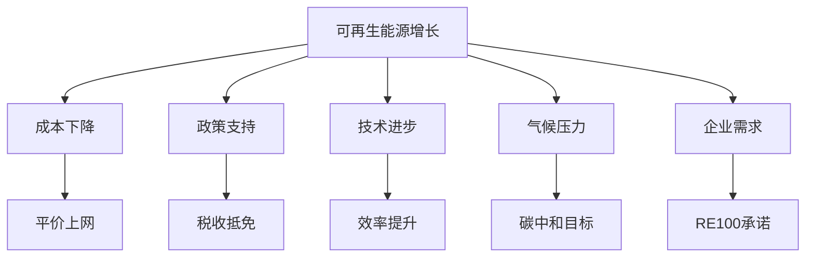
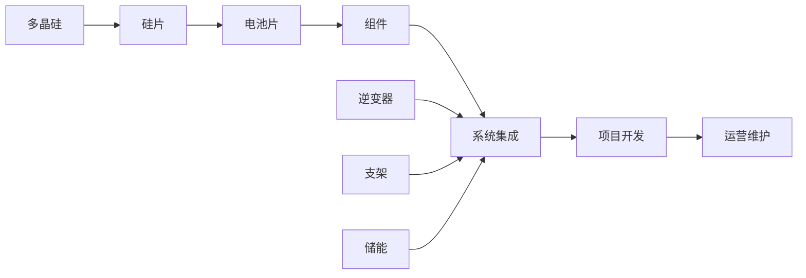

# 可再生能源行业概览

## 概述

可再生能源正在经历爆发式增长，从边缘能源转变为主流能源。技术进步、成本下降和政策支持推动了这一历史性转型，为投资者创造了巨大机会。

**学习目标**：
- 理解可再生能源行业的结构和增长驱动力
- 掌握主要技术类型及其经济性
- 分析投资机会与风险
- 了解政策对行业的影响
- 识别长期投资价值

**为什么重要**：
可再生能源是未来能源系统的核心，理解这一行业对于把握能源转型机遇、进行长期投资配置至关重要。

## 行业规模与增长

### 全球与美国市场

**全球可再生能源**：
- 发电占比：约30%（2023年）
- 年增长率：10-15%
- 投资规模：约5,000亿美元/年
- 2050年目标：70-80%发电占比

**美国市场**：
- 发电占比：约20%（2023年）
- 太阳能+风能：约12%
- 年增长率：15-20%
- 年投资：约1,000-1,500亿美元

### 增长驱动力

**1. 成本革命**

**成本下降**：
- 太阳能：过去10年下降90%
- 风能：下降70%
- 储能：下降85%

**平价上网（Grid Parity）**：
- 太阳能、风能：已低于化石能源
- 无需补贴：市场化竞争
- 经济性：持续改善

**2. 政策支持**

**联邦政策**：
- ITC（投资税收抵免）：太阳能30%
- PTC（生产税收抵免）：风能
- IRA（通胀削减法案）：3,690亿美元清洁能源投资

**州政策**：
- RPS（可再生能源配额）：30+州
- 净计量（Net Metering）
- 碳定价：部分州

**3. 技术进步**

**效率提升**：
- 太阳能电池：效率从15%提升至25%+
- 风机：单机容量从2MW提升至15MW+
- 储能：能量密度提升、成本下降

**新技术**：
- 钙钛矿太阳能电池
- 海上风电
- 绿氢
- 长时储能

**4. 企业需求**

**RE100**：
- 400+全球企业承诺100%可再生能源
- 科技巨头：Google、Apple、Amazon
- 企业PPA（购电协议）：主要需求来源

## 主要技术类型

### 太阳能（Solar）

**技术类型**：

**1. 光伏（PV）**：
- 晶硅：主流技术，效率20-25%
- 薄膜：成本低，效率15-20%
- 钙钛矿：新兴技术，效率潜力30%+

**2. 应用场景**：
- 公用事业规模：大型太阳能电站
- 分布式：屋顶光伏
- 社区太阳能：共享模式

**经济性**：
- LCOE（平准化度电成本）：$30-50/MWh
- 低于煤电：$60-80/MWh
- 低于天然气：$40-70/MWh

**增长前景**：
- 年增长率：20-25%
- 2030年目标：美国发电占比20%+
- 长期潜力：巨大

### 风能（Wind）

**技术类型**：

**1. 陆上风电**：
- 单机容量：3-5MW
- 成本：最低的可再生能源
- LCOE：$25-40/MWh

**2. 海上风电**：
- 单机容量：10-15MW
- 成本：高于陆上，但快速下降
- LCOE：$60-100/MWh
- 潜力：巨大（美国东海岸）

**经济性**：
- 陆上风电：已完全竞争力
- 海上风电：接近平价
- 容量因子：陆上30-40%，海上40-50%

**增长前景**：
- 陆上：稳定增长
- 海上：爆发式增长
- 2030年目标：美国发电占比15%+

### 储能（Energy Storage）

**技术类型**：

**1. 锂离子电池**：
- 主流技术：90%+市场份额
- 应用：电网储能、家庭储能
- 成本：$150-200/kWh（系统级）

**2. 其他技术**：
- 液流电池：长时储能
- 压缩空气：大规模储能
- 抽水蓄能：传统技术

**重要性**：
- 解决间歇性：太阳能、风能
- 电网稳定：调峰调频
- 经济性：快速改善

**增长前景**：
- 年增长率：30-40%
- 2030年装机：100GW+（美国）
- 关键技术：能源转型核心

### 其他可再生能源

**水电**：
- 成熟技术：美国最大可再生能源
- 增长有限：地理限制
- 作用：基荷电力

**地热**：
- 稳定输出：24/7发电
- 地理限制：火山带
- 增长潜力：中等

**生物质能**：
- 多种形式：发电、供热、燃料
- 碳中性：争议
- 增长：有限

## 产业链分析

### 太阳能产业链

**上游**：
- 多晶硅：中国主导
- 硅片：中国主导
- 竞争：激烈，利润率低

**中游**：
- 电池片：技术竞争
- 组件：规模竞争
- 美国企业：First Solar（薄膜）

**下游**：
- 系统集成：技术+服务
- 项目开发：资本密集
- 运营：稳定现金流

### 风能产业链

**上游**：
- 风机制造：GE, Vestas, Siemens Gamesa
- 叶片：专业制造商
- 塔筒：本地化生产

**中游**：
- 项目开发：开发商
- 工程建设：EPC承包商

**下游**：
- 运营维护：长期服务
- 资产管理：机构投资者

### 价值分布

**利润率**：
- 制造：5-10%（竞争激烈）
- 项目开发：10-15%
- 运营：15-20%（稳定）
- 技术服务：20-30%（高附加值）

**投资机会**：
- 制造：规模优势、技术领先
- 开发：项目管道、执行能力
- 运营：长期现金流、类公用事业

## 商业模式

### 公用事业模式

**特点**：
- 监管定价：稳定回报
- 长期资产：20-30年
- 稳定现金流：类债券
- 股息：持续增长

**代表企业**：
- NextEra Energy：全美最大
- Duke Energy：传统公用事业转型
- Xcel Energy：可再生能源领先

**投资逻辑**：
- 防御性：低波动
- 收入：稳定股息
- 增长：可再生能源扩张

### 独立发电商（IPP）

**特点**：
- 项目开发：自主开发
- PPA合同：长期售电
- 资产运营：持有或出售
- 杠杆：项目融资

**代表企业**：
- NextEra Energy Resources
- Clearway Energy
- Brookfield Renewable

**投资逻辑**：
- 增长：项目管道
- 现金流：PPA保障
- 风险：项目执行、融资

### 住宅太阳能

**特点**：
- 直接面向消费者
- 融资模式：租赁、贷款、PPA
- 安装服务：一站式
- 储能：配套销售

**代表企业**：
- Sunrun：最大住宅太阳能公司
- Sunnova：快速增长
- Tesla Energy：垂直整合

**投资逻辑**：
- 增长：住宅市场渗透
- 挑战：获客成本、融资
- 风险：政策变化

### 制造商

**特点**：
- 规模竞争：成本领先
- 技术创新：效率提升
- 全球化：供应链
- 周期性：价格波动

**代表企业**：
- First Solar：美国最大组件商
- Enphase：微型逆变器
- Array Technologies：跟踪支架

**投资逻辑**：
- 增长：市场扩张
- 挑战：中国竞争
- 风险：价格战、贸易政策

## 投资机会与策略

### 投资主题

**1. 公用事业转型**

**投资逻辑**：
- 稳定增长：可再生能源扩张
- 监管支持：清洁能源目标
- 股息增长：持续提升
- 防御性：低波动

**目标企业**：
- NextEra Energy：行业标杆
- Xcel Energy：激进转型
- Duke Energy：规模优势

**2. 技术领先者**

**投资逻辑**：
- 技术壁垒：专利、效率
- 定价权：差异化产品
- 增长：市场份额提升
- 利润率：高于行业

**目标企业**：
- First Solar：薄膜技术
- Enphase：微型逆变器
- SolarEdge：优化器

**3. 储能爆发**

**投资逻辑**：
- 必需品：可再生能源配套
- 成本下降：经济性改善
- 政策支持：IRA补贴
- 增长：30-40%年增长率

**目标企业**：
- Tesla Energy：垂直整合
- Fluence：专业储能
- Enphase：家庭储能

**4. 海上风电**

**投资逻辑**：
- 新兴市场：美国东海岸
- 政策推动：联邦支持
- 资源优势：风力强劲
- 增长：从零到数十GW

**目标企业**：
- Orsted：全球领先（丹麦）
- NextEra Energy：美国布局
- Avangrid：东海岸项目

### 估值方法

**公用事业**：
- P/B：1.5-2.5倍
- 股息收益率：2-4%
- EV/EBITDA：10-15倍
- 监管资产回报率：8-10%

**成长型企业**：
- P/E：20-40倍
- PEG：1-2倍
- EV/Sales：2-5倍
- 增长率：关键驱动

**项目开发商**：
- EV/MW：$1-2M/MW（运营资产）
- P/CF：10-15倍
- 股息收益率：4-6%

### 风险因素

**政策风险**：
- 补贴取消：ITC、PTC到期
- 政治变化：政府更迭
- 贸易政策：关税、反倾销

**技术风险**：
- 技术迭代：现有技术过时
- 竞争加剧：价格战
- 执行风险：项目延期

**融资风险**：
- 利率上升：项目回报率下降
- 融资困难：资本密集
- 通胀：成本上升

**电网风险**：
- 并网限制：输电瓶颈
- 间歇性：需要储能
- 电网升级：投资需求

## 政策环境

### 联邦政策

**IRA（通胀削减法案，2022年）**：
- 总投资：3,690亿美元
- ITC延长：太阳能30%至2032年
- PTC延长：风能至2032年
- 储能：独立ITC
- 制造：本土制造激励

**影响**：
- 确定性：10年政策稳定
- 投资激增：预计1万亿美元
- 就业：数十万岗位
- 减排：40%减排（2030年）

### 州政策

**RPS（可再生能源配额）**：
- 30+州：强制配额
- 目标：2030年50-100%
- 驱动：公用事业投资

**净计量**：
- 住宅太阳能：关键政策
- 争议：公用事业反对
- 趋势：逐步取消或修改

### 国际比较

**欧洲**：
- 最激进：2050年碳中和
- 海上风电：全球领先
- 碳价：高碳税

**中国**：
- 最大市场：装机容量
- 制造主导：全球供应链
- 政策支持：强力推动

**美国**：
- 中等激进：州差异大
- 技术创新：领先
- 市场化：企业驱动

## 未来趋势

### 技术趋势

**1. 效率提升**
- 太阳能：30%+效率
- 风机：20MW+单机
- 储能：固态电池

**2. 成本下降**
- 太阳能：继续下降20-30%
- 储能：下降50%+
- 海上风电：接近陆上

**3. 新技术**
- 钙钛矿：商业化
- 绿氢：规模化
- 长时储能：突破

### 市场趋势

**1. 规模化**
- 项目规模：GW级
- 企业整合：并购加速
- 全球化：跨国布局

**2. 数字化**
- AI优化：发电预测
- 区块链：能源交易
- 物联网：智能电网

**3. 分布式**
- 微电网：社区能源
- 虚拟电厂：聚合资源
- P2P交易：去中心化

### 投资机会

**短期（1-3年）**：
- IRA受益：制造、开发
- 储能爆发：快速增长
- 海上风电：项目启动

**中期（3-5年）**：
- 电网升级：输电投资
- 绿氢：商业化
- 电动车充电：基础设施

**长期（5-10年）**：
- 新技术：钙钛矿、固态电池
- 能源互联网：数字化
- 全球化：新兴市场

## 关键学习点

**1. 成本革命**
- 平价上网：经济性确立
- 持续下降：技术进步
- 市场化：无需补贴

**2. 政策重要性**
- IRA：10年确定性
- 州政策：差异化
- 关注变化：风险与机遇

**3. 技术多样性**
- 太阳能：最快增长
- 风能：最低成本
- 储能：关键配套

**4. 商业模式**
- 公用事业：稳定增长
- IPP：高增长
- 制造：竞争激烈

**5. 长期趋势**
- 结构性增长：确定性高
- 能源转型：不可逆
- 投资机会：持续涌现

## 延伸阅读

### 推荐书籍

1. **《Drawdown》** - Paul Hawken，气候解决方案
2. **《The Grid》** - Gretchen Bakke，电网未来
3. **《Reinventing Fire》** - Amory Lovins，能源转型
4. **《The New Map》** - Daniel Yergin，能源地缘政治

### 研究资源

**行业数据**：
- NREL（国家可再生能源实验室）
- EIA可再生能源数据
- IRENA（国际可再生能源署）
- Bloomberg NEF

**公司资源**：
- 各公司年报
- 季度财报
- 投资者日
- 项目公告

**分析报告**：
- 投行清洁能源研究
- 咨询公司报告
- 智库研究

## 参考文献

1. NREL. (2023). "Renewable Energy Data Book".
2. EIA. (2023). "Electric Power Monthly".
3. IRENA. (2023). "Renewable Power Generation Costs".
4. Bloomberg NEF. (2023). "New Energy Outlook".
5. IEA. (2023). "Renewables 2023".
6. NextEra Energy. (2023). *Annual Report*.
7. First Solar. (2023). *Annual Report*.
8. Lazard. (2023). "Levelized Cost of Energy Analysis".
9. Wood Mackenzie. (2023). "U.S. Solar Market Insight".
10. AWEA. (2023). "U.S. Wind Industry Report".

## 深度分析

### 核心机制解析

理解本主题需要从多个维度进行系统性分析。以下从理论基础、实践应用和历史验证三个层面展开深度探讨。

**理论基础层面**：本主题的核心逻辑建立在经济学和金融学的基本原理之上。通过对基础理论的深入理解，投资者能够建立起稳固的分析框架，避免被市场短期噪音所干扰。

**实践应用层面**：理论必须与实践相结合才能产生价值。在实际投资决策中，需要将抽象的概念转化为具体的分析工具和决策标准。

**历史验证层面**：金融市场有着丰富的历史记录，通过研究历史案例，我们可以验证理论的有效性，并从中提炼出具有普遍意义的规律。

### 关键影响因素

影响本主题的关键因素可以从以下几个维度进行分析：

1. **宏观经济环境**：利率水平、通货膨胀率、经济增长速度等宏观变量对本主题有着深远影响。在不同的宏观经济周期中，相关指标的表现会呈现出显著差异。

2. **市场结构因素**：市场参与者的构成、信息传播机制、流动性状况等市场结构因素决定了价格发现的效率和准确性。

3. **政策监管环境**：政府政策、监管框架的变化会直接影响相关市场的运作规则和参与者行为。

4. **技术创新驱动**：技术进步不断改变着金融市场的运作方式，从算法交易到区块链技术，每一次技术革新都带来新的机遇和挑战。

5. **全球化与地缘政治**：在全球化背景下，各国市场之间的联动性日益增强，地缘政治风险的影响也越来越不可忽视。

### 量化分析框架

为了更精确地分析和评估，可以采用以下量化框架：

| 分析维度 | 关键指标 | 参考基准 | 分析方法 |
|---------|---------|---------|---------|
| 规模评估 | 绝对值与相对值 | 历史均值 | 趋势分析 |
| 质量评估 | 稳定性指标 | 行业对标 | 横向比较 |
| 风险评估 | 波动率指标 | 风险阈值 | 情景分析 |
| 价值评估 | 估值倍数 | 历史区间 | 回归分析 |

通过系统性地应用上述框架，投资者可以对目标进行全面、客观的评估，从而做出更加理性的投资决策。

