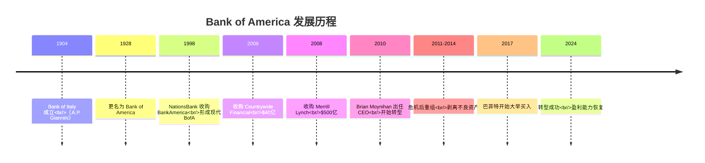
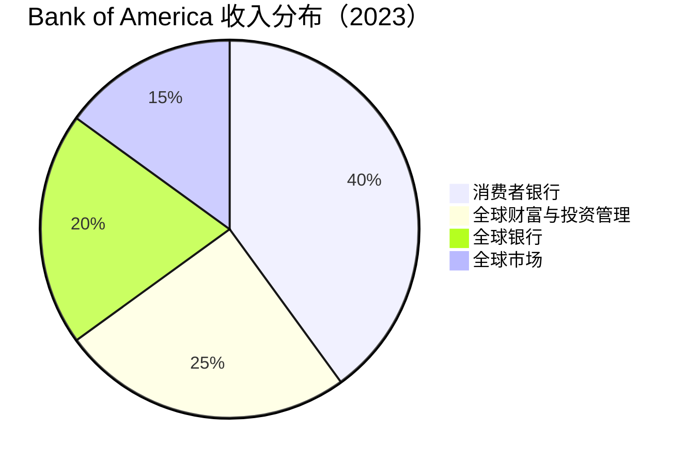
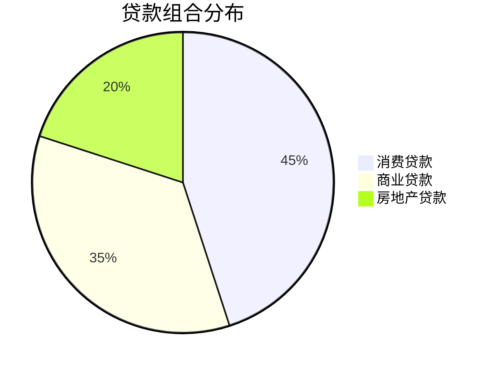

# Bank of America 深度分析

## 公司概况

**基本信息**（2024年初）：
- **成立时间**：1904年（Bank of Italy），1998年（现代合并）
- **总部**：北卡罗来纳州夏洛特
- **CEO**：Brian Moynihan（2010年至今）
- **员工数**：约 21万人
- **总资产**：$3.1万亿
- **市值**：$250亿+
- **标普500排名**：第15位

**股票信息**：
- **代码**：BAC（NYSE）
- **行业分类**：金融服务 - 多元化银行
- **指数成分**：道琼斯工业平均指数、标普500

## 概述

Bank of America 是美国第二大银行，拥有最广泛的零售银行网络和领先的财富管理业务。公司经历了 2008年金融危机的重创和随后十年的艰难转型，在 Brian Moynihan 的领导下逐步恢复元气，成为巴菲特重仓持有的银行股。BofA 的故事是一个关于危机、重组和复兴的经典案例。

**学习目标**：
- 理解 BofA 的危机与转型历程
- 分析公司的业务结构和竞争地位
- 评估财务表现和改善趋势
- 掌握投资价值评估方法
- 识别关键风险和机遇

## 历史沿革与危机

### 关键里程碑

### 2008年金融危机

**危机前的扩张**：
- 2008年1月：收购 Countrywide Financial（$40亿）
  - 美国最大次贷机构
  - 后来成为巨大负担
- 2008年9月：收购 Merrill Lynch（$500亿）
  - 雷曼破产当天宣布
  - 仓促决策
  - 整合困难

**危机中的困境**：
- 接受 TARP 资金：$450亿
- 股价暴跌：从 $50 跌至 $3
- 市值蒸发：90%+
- 诉讼缠身：数百亿美元和解

**危机后遗症**（2009-2014）：
- 抵押贷款相关损失：$500亿+
- 法律和解费用：$700亿+
- 监管处罚：持续不断
- 声誉受损：严重

### 转型与复兴（2010-2024）

**Brian Moynihan 的转型战略**：

**1. 简化业务（2010-2014）**
- 剥离非核心业务
- 退出国际市场
- 关闭分支机构
- 裁员 10万+

**2. 修复资产负债表（2011-2016）**
- 处置不良资产
- 增加资本
- 降低风险资产
- 改善资产质量

**3. 降低成本（2011-2018）**
- 效率比率：从 85% 降至 60%
- 年成本节省：$500亿+
- 自动化和数字化
- 优化网络

**4. 重建信任（2014-2024）**
- 解决遗留诉讼
- 改善合规
- 重塑品牌
- 恢复声誉

**转型成果**：
- ROE：从 3% 提升至 11%
- 效率比率：从 85% 降至 66%
- CET1：从 8% 提升至 11.8%
- 股价：从 $5 涨至 $35+

## 业务结构

### 四大业务板块

#### 1. 消费者银行（Consumer Banking）

**规模**：
- 收入：$360亿
- 利润：$120亿
- 客户：6,900万
- 分支机构：4,000+
- ATM：16,000+

**主要业务**：

**a. 零售银行**
- 存款：$1.0万亿
- 贷款：$3,000亿
- 分支网络：全美第二
- 数字用户：4,200万

**b. 信用卡**
- 发卡量：6,000万张
- 贷款余额：$1,100亿
- 市场份额：#3
- 合作伙伴：多元化

**c. 小企业银行**
- 客户：300万+
- 贷款：$400亿
- 市场份额：领先

**竞争地位**：
- 分支网络：#2（仅次于 Chase）
- 数字银行：领先
- 客户满意度：持续改善
- 成本效率：行业领先

#### 2. 全球财富与投资管理（GWIM）

**规模**：
- 收入：$220亿
- 利润：$40亿
- 客户资产：$4.5万亿
- 顾问：约 20,000人

**主要业务**：

**a. Merrill Lynch 财富管理**
- 客户资产：$3.5万亿
- 顾问：17,000+
- 高净值客户：领先

**b. 私人银行**
- 超高净值客户
- 客户资产：$600亿
- 综合服务

**c. 银行存款与借贷**
- 存款：$3,500亿
- 贷款：$2,000亿
- 证券化借贷

**竞争优势**：
- Merrill Lynch 品牌
- 顾问网络最大
- 产品综合性
- 银行协同

#### 3. 全球银行（Global Banking）

**规模**：
- 收入：$180亿
- 利润：$80亿
- 客户：企业、机构、政府

**主要业务**：

**a. 商业银行**
- 中型企业银行
- 贷款：$4,000亿
- 存款：$4,500亿

**b. 企业银行**
- 大型企业客户
- 贷款：$2,000亿
- 现金管理

**c. 投资银行**
- 股票承销：Top 5
- 债券承销：Top 3
- M&A 咨询：Top 5

**竞争地位**：
- 商业银行：领先
- 投资银行：追赶中
- 产品能力：持续提升

#### 4. 全球市场（Global Markets）

**规模**：
- 收入：$160亿
- 利润：$60亿
- 客户：机构投资者

**主要业务**：

**a. 固定收益交易**
- 利率产品
- 信用产品
- 外汇
- 大宗商品

**b. 股票交易**
- 现金股票
- 衍生品
- 主经纪商服务

**c. 证券服务**
- 托管
- 清算
- 融资

**竞争地位**：
- 固定收益：Top 5
- 股票：Top 10
- 市场份额：稳定

## 商业模式分析

### 零售银行主导

**收入结构特点**：
- 消费者银行：40%（最大）
- 财富管理：25%（增长快）
- 企业银行：20%（稳定）
- 交易业务：15%（波动大）

**与 JPMorgan 对比**：
- BofA：更依赖零售和财富管理
- JPM：投行和交易更强
- BofA：风险更低，波动更小
- JPM：回报更高，周期性更强

### 资金成本优势

**存款基础**：
- 总存款：$1.9万亿
- 零售存款占比：70%+
- 活期存款占比：40%+

**资金成本**：
- 存款成本：0.6%（行业领先）
- 批发融资：最小化
- 综合资金成本：最低之一

**净息差**：
- 2023年：2.3%
- 行业平均：2.3%
- 改善空间：利率上升受益

### 效率改善

**成本削减成果**：

| 年份 | 效率比率 | 员工数 | 分支数 |
|------|----------|--------|--------|
| 2010 | 85% | 280,000 | 5,900 |
| 2015 | 70% | 220,000 | 4,700 |
| 2020 | 68% | 210,000 | 4,300 |
| 2023 | 66% | 210,000 | 4,000 |

**持续改善**：
- 目标效率比率：<60%
- 数字化投资：年 $35亿
- 自动化率：持续提升
- 分支优化：继续

## 财务分析

### 盈利能力

**关键指标**（2023年）：

| 指标 | BofA | JPMorgan | 行业平均 |
|------|------|----------|----------|
| ROE | 11% | 17% | 11% |
| ROA | 0.9% | 1.3% | 1.0% |
| 净息差 | 2.3% | 2.5% | 2.3% |
| 效率比率 | 66% | 55% | 62% |

**盈利能力分析**：
- ROE 恢复至行业平均
- 仍低于 JPMorgan
- 改善趋势明显
- 潜力尚未完全释放

**ROE 提升路径**：
- 净息差扩大：利率上升
- 费用收入增长：财富管理
- 成本持续下降：效率提升
- 资本优化：股东回报

### 资产质量

**贷款组合**（$1.1万亿）：

**资产质量指标**：

| 指标 | 2023 | 2022 | 趋势 |
|------|------|------|------|
| 不良贷款率 | 0.5% | 0.4% | ↑ |
| 净冲销率 | 0.3% | 0.2% | ↑ |
| 准备金覆盖率 | 200% | 250% | ↓ |
| 准备金/贷款 | 1.0% | 1.0% | → |

**分析**：
- 资产质量优秀
- 危机遗留问题已解决
- 信用成本正常化
- 准备金充足

### 资本充足性

**资本指标**（2023年末）：

| 指标 | 实际 | 监管要求 | 缓冲 |
|------|------|----------|------|
| CET1 | 11.8% | 10.5% | 1.3% |
| Tier 1 | 13.3% | 12.0% | 1.3% |
| 总资本 | 15.5% | 14.0% | 1.5% |
| 杠杆率 | 7.0% | 5.0% | 2.0% |

**资本管理**：
- 资本充足但不过剩
- 支持业务增长
- 股东回报能力
- 压力测试通过

### 股东回报

**股息政策**：
- 股息率：2.5%
- 派息率：25-30%
- 连续增长：10年
- 季度股息：$0.24/股

**股票回购**：
- 2023年回购：$50亿
- 累计回购（2014-2023）：$400亿+
- 回购收益率：2%

**总股东回报**：
- 股息 + 回购：年回报 4-5%
- 股价增长：年回报 8-12%
- 总回报：年回报 12-17%

## 竞争地位分析

### 优势

**1. 零售银行网络**
- 分支数量：#2
- 地理覆盖：全国
- 客户基础：6,900万
- 品牌认知：强

**2. 财富管理领先**
- Merrill Lynch 品牌
- 顾问网络：最大
- 客户资产：$4.5万亿
- 增长潜力：大

**3. 资金成本低**
- 存款基础：$1.9万亿
- 零售存款占比：高
- 资金成本：行业最低之一

**4. 效率改善**
- 效率比率：66%（持续下降）
- 成本控制：严格
- 数字化：领先
- 自动化：提升

**5. 巴菲特背书**
- 持股：10%+
- 信任票：重要
- 长期投资者：稳定

### 劣势

**1. 盈利能力**
- ROE：11%（低于 JPMorgan 17%）
- ROA：0.9%（低于 JPMorgan 1.3%）
- 改善空间：大

**2. 投资银行**
- 市场份额：落后 JPMorgan
- 交易能力：弱于顶级投行
- 费用收入：增长慢

**3. 遗留问题**
- 诉讼风险：仍存在
- 声誉修复：进行中
- 监管关注：持续

**4. 国际业务**
- 国际收入：<20%
- 全球化程度：低于 JPMorgan/Citi
- 增长受限

## 估值分析

### 当前估值（2024年初）

**市场数据**：
- 股价：$35
- 市值：$250亿
- P/E：10x
- P/B：1.1x
- 股息率：2.5%

### 相对估值

**与 JPMorgan 对比**：

| 指标 | BofA | JPMorgan | 差距 |
|------|------|----------|------|
| P/E | 10x | 11x | -1x |
| P/B | 1.1x | 1.8x | -0.7x |
| ROE | 11% | 17% | -6% |
| 效率比率 | 66% | 55% | +11% |

**估值折价原因**：
- ROE 更低
- 效率更低
- 投行业务更弱
- 增长更慢

**折价是否合理**：
- 部分合理：质量差距
- 部分过度：改善趋势
- 投资机会：估值修复

### 绝对估值（DCF）

**假设**：
- 当前 EPS：$3.50
- EPS 增长率：6-8%（未来5年）
- 长期增长率：3%
- 要求回报率：10%

**估值区间**：
- 保守估值：$32
- 基准估值：$40
- 乐观估值：$48

**当前价格**：$35
**上涨空间**：15-35%

### 投资论点

**看多理由**：

1. **估值吸引**
   - P/B 1.1x（低于 JPMorgan 1.8x）
   - P/E 10x（合理）
   - 股息率 2.5%（稳定）
   - 估值修复空间大

2. **盈利能力改善**
   - ROE 从 3% 提升至 11%
   - 效率比率从 85% 降至 66%
   - 趋势持续
   - 目标 ROE 15%+

3. **巴菲特重仓**
   - 持股 10%+
   - 成本 $20-25
   - 长期看好
   - 信任背书

4. **利率环境有利**
   - 净息差扩大
   - 利息收入增长
   - 存款成本优势

5. **财富管理增长**
   - 高利润率业务
   - 市场份额领先
   - 增长潜力大
   - 协同效应强

6. **资本充足**
   - CET1 11.8%
   - 支持股东回报
   - 增长空间

**风险因素**：

1. **盈利能力仍弱**
   - ROE 11%（低于目标）
   - 效率比率 66%（高于目标）
   - 改善速度慢

2. **经济衰退风险**
   - 信用损失增加
   - 贷款需求下降
   - 交易活动减少

3. **竞争压力**
   - JPMorgan 领先扩大
   - 金融科技挑战
   - 利润率压力

4. **监管风险**
   - 资本要求提高
   - 合规成本上升
   - 业务限制

5. **遗留风险**
   - 诉讼可能
   - 声誉影响
   - 监管处罚

## 投资策略

### 适合投资者类型

**价值投资者**：
- 估值折价
- 改善趋势
- 巴菲特背书
- 长期价值

**收入投资者**：
- 稳定股息
- 持续增长
- 股息率适中
- 派息可持续

**转型投资者**：
- 转型故事
- 改善空间大
- 催化剂明确
- 估值修复潜力

### 买入时机

**理想买入点**：
- P/B <1.0x
- P/E <9x
- 股息率 >3%
- 市场恐慌时

**当前评估**：
- 估值合理偏低
- 可以建仓
- 分批买入
- 中长期持有

### 持有策略

**卫星持仓**：
- 占金融板块 20-30%
- 占总投资组合 3-5%
- 中长期持有（3-5年）

**再平衡**：
- 估值过高时减仓（P/B >1.5x）
- 估值低估时加仓（P/B <0.9x）
- 保持纪律

### 卖出信号

**基本面恶化**：
- ROE 停止改善
- 效率比率反弹
- 资产质量恶化
- 管理层变动

**估值过高**：
- P/B >1.8x
- P/E >13x
- 估值修复完成

**更好机会**：
- JPMorgan 更具吸引力
- 其他行业机会更好

## 与 JPMorgan 对比

### 相似之处

- 全国性大型银行
- 多元化业务模式
- 零售银行基础强
- 监管要求相似

### 差异之处

| 维度 | BofA | JPMorgan |
|------|------|----------|
| 规模 | $3.1T | $3.7T |
| ROE | 11% | 17% |
| 效率比率 | 66% | 55% |
| 投资银行 | 追赶 | 领先 |
| 财富管理 | 领先 | 强 |
| 国际业务 | 弱 | 强 |
| 估值 | P/B 1.1x | P/B 1.8x |
| 风险 | 低 | 中 |
| 回报 | 中 | 高 |

### 投资选择

**选择 BofA 的理由**：
- 估值更低
- 改善空间更大
- 风险更低
- 巴菲特背书

**选择 JPMorgan 的理由**：
- 质量更高
- 盈利能力更强
- 竞争地位更优
- 长期回报更高

**组合配置**：
- 核心持仓：JPMorgan
- 卫星持仓：BofA
- 比例：JPM 60% / BofA 40%

## 关键学习点

1. **危机与转型**
   - 危机可以是机会
   - 转型需要时间和决心
   - 管理层至关重要

2. **估值与质量**
   - 便宜有便宜的原因
   - 质量差距值得溢价
   - 改善趋势创造价值

3. **巴菲特的投资逻辑**
   - 买入转型中的优质资产
   - 估值折价提供安全边际
   - 长期持有等待价值实现

4. **银行业竞争**
   - 规模和效率至关重要
   - 领先者优势持续扩大
   - 追赶者需要差异化

5. **耐心的价值**
   - 转型需要时间
   - 估值修复需要催化剂
   - 长期投资者获得回报

## 常见误区

**误区1：BofA 已经完全恢复**
- ROE 仍低于历史水平
- 效率仍有改善空间
- 投行业务仍在追赶

**误区2：BofA 和 JPMorgan 差不多**
- 质量差距明显
- 盈利能力差距大
- 竞争地位不同

**误区3：估值便宜就该买**
- 需要评估改善趋势
- 需要考虑催化剂
- 需要耐心等待

**误区4：巴菲特买了就一定对**
- 需要理解投资逻辑
- 需要评估当前估值
- 需要独立判断

## 延伸阅读

### 必读资料

1. **Bank of America 年报**
2. **投资者日演示**
3. **季度财报电话会议**
4. **巴菲特致股东信**（关于 BofA 投资）

### 推荐书籍

1. **《大而不倒》** - Andrew Ross Sorkin
2. **《金融危机经济学》** - 多位作者

## 参考文献

1. Bank of America Corporation. (2023). "Annual Report"
2. Bank of America Corporation. (2024). "Q4 2023 Earnings Presentation"
3. Berkshire Hathaway. (2023). "Annual Report" (BofA 持仓分析)
4. Federal Reserve. (2024). "CCAR Results"
5. S&P Global Market Intelligence. (2024). "Bank of America Analysis"
6. Goldman Sachs. (2024). "Bank of America Equity Research"
7. Morgan Stanley. (2024). "US Banks Comparison"
8. McKinsey & Company. (2024). "Banking Transformation Report"
9. Moynihan, Brian. (2023). "Investor Day Presentation"
10. Bloomberg. (2024). "Bank of America Company Profile"

---

**下一步学习**：
- 对比 [JPMorgan Chase](jpmorgan-deep.html)
- 研究 [巴菲特投资哲学](../../../../04-investment-system/investor-profiles/warren-buffett.html)
- 了解 [银行业整体](overview.html)
