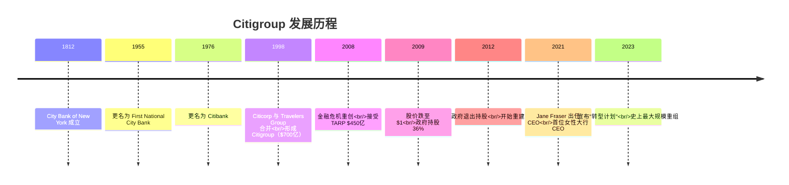
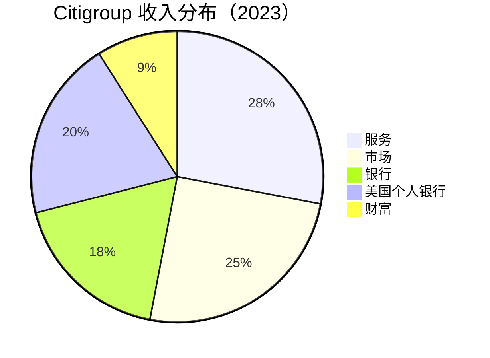
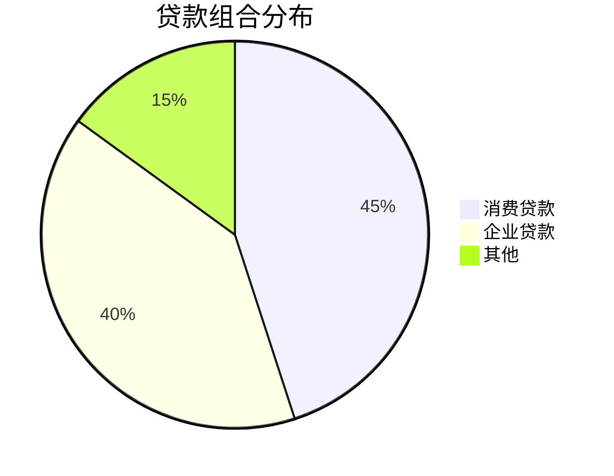

# Citigroup 深度分析

## 公司概况

**基本信息**（2024年初）：
- **成立时间**：1812年（City Bank of New York），1998年（现代合并）
- **总部**：纽约市
- **CEO**：Jane Fraser（2021年至今，首位女性大行 CEO）
- **员工数**：约 24万人
- **总资产**：$2.4万亿
- **市值**：$100亿+
- **标普500排名**：第40位

**股票信息**：
- **代码**：C（NYSE）
- **行业分类**：金融服务 - 多元化银行
- **指数成分**：道琼斯工业平均指数、标普500

## 概述

Citigroup 是全球最国际化的银行，在全球160+个国家和地区开展业务，是唯一真正意义上的"全球银行"。然而，这家曾经全球最大的银行，如今市值仅为 JPMorgan 的四分之一，以低于账面价值的 P/B 0.6x 交易。Jane Fraser 自2021年接任 CEO 以来，正推进史上最大规模的战略重组——"转型计划"，剥离非核心业务，聚焦五大核心业务。这是一个关于全球化银行的困境与重生的深度案例。

**学习目标**：
- 理解 Citigroup 独特的全球网络价值
- 分析"大而不优"的战略困境
- 评估 Jane Fraser 转型计划的逻辑与进展
- 掌握折价于账面价值的银行估值分析
- 识别转型成功的关键指标

## 历史沿革

### 关键里程碑

### 1998年超级合并

Citicorp 与 Travelers Group 的合并创造了当时全球最大的金融机构：

**合并逻辑**：
- 打造"金融超市"（Financial Supermarket）
- 银行 + 保险 + 投资银行 = 一站式服务
- 规模效应
- 全球覆盖

**合并结果**：
- 总资产：$7,000亿（当时全球最大）
- 业务覆盖：100+国家
- 员工：30万+
- 市值：$1,400亿

**"金融超市"的失败**：
- 业务过于复杂
- 协同效应有限
- 管理难度极大
- 2002年被迫剥离 Travelers

### 2008年金融危机

Citigroup 是金融危机中受创最重的大型银行之一：

**危机中的困境**：
- 次贷敞口：$500亿+
- 结构性投资工具（SIV）：$800亿
- 股价：从 $55 跌至 $1
- 市值蒸发：98%

**政府救助**：
- TARP 资金：$450亿
- 政府担保资产：$3,000亿
- 政府持股：36%
- 2010年政府退出（盈利 $120亿）

**危机教训**：
- 过度复杂的业务结构
- 风险管理严重失职
- 全球化带来的风险传导
- "大而不倒"的代价

### Jane Fraser 的转型计划（2021-至今）

**战略背景**：
- P/B 长期低于 1x
- ROE 持续低于资本成本
- 业务过于分散
- 运营效率低下

**转型核心**：剥离14个国际消费者银行业务，聚焦五大核心业务

**五大核心业务**：
1. 服务（Services）- 跨境支付、现金管理
2. 市场（Markets）- 固定收益、外汇、股票
3. 银行（Banking）- 投资银行、企业银行
4. 美国个人银行（USPB）- 美国零售银行
5. 财富（Wealth）- 财富管理

**剥离进展**（2021-2024）：
- 已完成：澳大利亚、巴林、印度、菲律宾等消费者业务
- 进行中：墨西哥（Banamex）分拆
- 目标：2024-2025年完成主要剥离

## 业务结构

### 五大核心业务

#### 1. 服务（Services）- 核心竞争力

**规模**：
- 收入：$200亿
- 利润：$80亿
- 这是 Citigroup 最独特的业务

**主要业务**：

**a. 财资与贸易解决方案（TTS）**
- 跨境支付处理：每日 $4万亿+
- 现金管理：全球企业
- 贸易融资：全球供应链
- 客户：全球500强中 90%+

**b. 证券服务**
- 托管资产：$25万亿
- 基金管理服务
- 清算结算
- 市场份额：全球 #2

**竞争优势**：
- 全球网络：160+国家
- 无可替代的跨境能力
- 客户粘性极高
- 转换成本极大

**这是 Citigroup 最宝贵的资产**：
- 跨国公司的"管道"
- 全球化趋势受益者
- 竞争对手难以复制
- 估值严重低估

#### 2. 市场（Markets）

**规模**：
- 收入：$180亿
- 利润：$50亿
- 全球前五的市场业务

**主要业务**：

**a. 固定收益**
- 利率产品：全球 #3
- 外汇：全球 #1（外汇交易量）
- 信用产品：Top 5
- 大宗商品：Top 5

**b. 股票**
- 现金股票：Top 10
- 衍生品：Top 5
- 主经纪商：Top 5

**竞争优势**：
- 外汇业务全球第一
- 新兴市场覆盖最广
- 全球客户基础

#### 3. 银行（Banking）

**规模**：
- 收入：$130亿
- 利润：$40亿

**主要业务**：

**a. 投资银行**
- 股票承销：Top 5
- 债券承销：Top 3
- M&A 咨询：Top 5
- 费用收入：$50亿

**b. 企业银行**
- 大型跨国企业
- 贷款：$3,000亿
- 现金管理协同

**竞争优势**：
- 跨境业务协同
- 全球客户关系
- 新兴市场优势

#### 4. 美国个人银行（USPB）

**规模**：
- 收入：$140亿
- 利润：$30亿
- 客户：3,000万

**主要业务**：

**a. 零售银行**
- 分支机构：700+（远少于竞争对手）
- 存款：$3,000亿
- 数字优先策略

**b. 信用卡**
- 发卡量：1.5亿张
- 贷款余额：$1,700亿
- 市场份额：#3
- 合作伙伴：American Airlines, Costco, Home Depot

**竞争地位**：
- 零售银行：规模小，数字化
- 信用卡：强项，全球品牌
- 分支网络：远少于竞争对手

#### 5. 财富（Wealth）

**规模**：
- 收入：$65亿
- 利润：$15亿
- 客户资产：$8,000亿

**主要业务**：
- 私人银行：超高净值客户
- 财富管理：高净值客户
- 投资产品：全球配置

**竞争优势**：
- 全球私人银行网络
- 新兴市场富裕客户
- 跨境财富管理

## 商业模式分析

### 全球网络的独特价值

Citigroup 的核心价值在于其无可替代的全球网络：

**"全球管道"价值**：
- 跨国公司需要在全球各地收付款
- 只有 Citigroup 能在160+国家提供一致服务
- 替代方案：需要与数十家本地银行合作
- 转换成本：极高

**量化价值**：
- 每日处理跨境支付：$4万亿+
- 全球企业客户：全球500强 90%+
- 托管资产：$25万亿
- 这些业务的价值被市场严重低估

### 战略聚焦的逻辑

**为什么要剥离国际消费者业务**：
- 消费者银行需要本地规模
- 在各国市场都是小玩家
- 资本回报率低
- 管理复杂度高

**聚焦后的优势**：
- 资本集中于高回报业务
- 管理复杂度降低
- ROE 提升路径清晰
- 估值重估潜力

### 运营效率问题

**历史问题**：
- 系统老旧：数十年积累的技术债务
- 流程复杂：全球化带来的碎片化
- 监管问题：2020年 OCC 罚款 $4亿（数据管理）
- 效率比率：78%（行业最高）

**改善计划**：
- 技术现代化：年投资 $120亿
- 流程简化：组织架构重组
- 人员优化：裁员 20,000+
- 目标效率比率：<60%

## 财务分析

### 盈利能力

**关键指标**（2023年）：

| 指标 | Citigroup | JPMorgan | BofA | Wells Fargo |
|------|-----------|----------|------|-------------|
| ROE | 7% | 17% | 11% | 12% |
| ROA | 0.6% | 1.3% | 0.9% | 1.1% |
| 净息差 | 2.4% | 2.5% | 2.3% | 2.8% |
| 效率比率 | 78% | 55% | 66% | 73% |

**盈利能力分析**：
- ROE 7%：低于资本成本（约10%）
- 这是 P/B <1x 的根本原因
- 改善路径：效率提升 + 业务聚焦
- 目标 ROE：11-12%（2025-2026年）

**ROE 提升路径**：
- 效率比率：78% → <60%（释放 $80亿+利润）
- 剥离低回报业务：资本重新配置
- 服务业务增长：高利润率
- 资本优化：股东回报

### 资产质量

**贷款组合**（$6,600亿）：

**资产质量指标**：

| 指标 | 2023 | 2022 | 趋势 |
|------|------|------|------|
| 不良贷款率 | 0.8% | 0.6% | ↑ |
| 净冲销率 | 0.6% | 0.4% | ↑ |
| 准备金覆盖率 | 150% | 180% | ↓ |
| 准备金/贷款 | 1.2% | 1.1% | ↑ |

**信用卡风险**：
- 信用卡贷款：$1,700亿
- 净冲销率：3.5%（高于行业）
- 低收入客户占比较高
- 经济下行时风险较大

### 资本充足性

**资本指标**（2023年末）：

| 指标 | 实际 | 监管要求 | 缓冲 |
|------|------|----------|------|
| CET1 | 13.3% | 12.3% | 1.0% |
| Tier 1 | 15.0% | 14.0% | 1.0% |
| 总资本 | 17.5% | 16.0% | 1.5% |
| 杠杆率 | 5.8% | 5.0% | 0.8% |

**资本管理**：
- 资本充足但缓冲较小
- 转型期间资本消耗
- 股东回报受限
- 剥离完成后资本释放

### 股东回报

**股息政策**：
- 股息率：3.8%（四大行最高）
- 派息率：35-40%
- 季度股息：$0.53/股
- 危机后曾大幅削减，现已恢复

**股票回购**：
- 2023年回购：$10亿（较少）
- 转型期间回购受限
- 剥离完成后可增加

**总股东回报**：
- 股息 + 回购：年回报 4-5%
- 股价增长：年回报 5-15%（取决于转型）
- 总回报：年回报 9-20%

## 竞争优势分析

### 1. 全球网络（最核心优势）

**无可替代的全球覆盖**：
- 160+国家和地区
- 唯一真正的全球银行
- 跨国企业的首选合作伙伴
- 竞争对手无法复制

**量化价值**：
- 跨境支付：每日 $4万亿
- 企业客户：全球500强 90%+
- 这个网络的重置成本：数千亿美元

### 2. 外汇业务全球第一

**外汇市场领导者**：
- 全球外汇交易量：#1
- 市场份额：约 5%
- 覆盖所有主要货币对
- 新兴市场货币优势

### 3. 信用卡品牌

**全球信用卡品牌**：
- 发卡量：1.5亿张
- 全球接受度高
- 旅行者首选
- 合作伙伴网络广

### 4. 新兴市场优势

**深耕新兴市场**：
- 拉丁美洲：领先地位
- 亚洲：广泛覆盖
- 中东非洲：独特优势
- 新兴市场增长受益

## 风险分析

### 1. 转型执行风险

**最大的不确定性**：
- 转型计划复杂度极高
- 执行时间长（2021-2026年）
- 剥离过程中的价值损失
- 组织变革的阻力

### 2. 监管风险

**持续的监管压力**：
- 2020年 OCC 罚款 $4亿（数据管理）
- 监管要求持续提高
- 合规成本高企
- 新的监管问题可能出现

### 3. 信用卡风险

**消费信贷质量**：
- 净冲销率高于同业
- 低收入客户占比较高
- 经济下行时损失增加
- 需要持续监控

### 4. 技术风险

**系统老旧问题**：
- 数十年积累的技术债务
- 现代化改造成本高
- 执行风险大
- 监管对数据管理要求严格

### 5. 全球化风险

**地缘政治风险**：
- 业务遍布全球
- 地缘政治紧张影响大
- 制裁合规复杂
- 新兴市场政治风险

## 估值分析

### 当前估值（2024年初）

**市场数据**：
- 股价：$55
- 市值：$100亿
- P/E：8x
- P/B：0.6x
- 股息率：3.8%

### 为什么 P/B <1x？

**根本原因**：
- ROE 7% < 资本成本 10%
- 效率比率 78%（行业最高）
- 转型不确定性
- 历史信任缺失

**P/B 修复条件**：
- ROE 提升至 10%+
- 效率比率降至 <65%
- 转型计划成功执行
- 监管问题解决

### 相对估值

**四大银行对比**：

| 银行 | P/E | P/B | ROE | 股息率 |
|------|-----|-----|-----|--------|
| JPMorgan | 11x | 1.8x | 17% | 2.8% |
| Bank of America | 10x | 1.1x | 11% | 2.5% |
| Wells Fargo | 10x | 1.2x | 12% | 2.6% |
| Citigroup | 8x | 0.6x | 7% | 3.8% |

**估值折价分析**：
- P/B 0.6x：反映 ROE 低于资本成本
- 折价幅度：相对账面价值折价 40%
- 隐含假设：ROE 永远低于资本成本
- 反驳：转型成功后 ROE 可达 11-12%

### 绝对估值（DCF）

**假设**：
- 当前 EPS：$7.00
- EPS 增长率（转型期）：5-8%
- EPS 增长率（转型后）：8-12%
- 长期增长率：3%
- 要求回报率：11%

**估值区间**：
- 保守估值（转型失败）：$45
- 基准估值（转型成功）：$75
- 乐观估值（超预期）：$95

**当前价格**：$55
**上涨空间**：36-73%（转型成功）

### 投资论点

**看多理由**：

1. **全球网络严重低估**
   - 服务业务价值未被市场认可
   - 跨境支付 $4万亿/日的"管道"
   - 全球500强 90%+ 的客户关系
   - 这个网络的重置成本远超当前市值

2. **转型成功的不对称回报**
   - 当前 P/B 0.6x（极度低估）
   - 转型成功后 P/B 可达 1.0-1.2x
   - 上涨空间：67-100%
   - 下行风险：有限（已充分折价）

3. **股息率最高**
   - 3.8%（四大行最高）
   - 等待转型期间获得补偿
   - 股息可持续

4. **Jane Fraser 的执行力**
   - 首位女性大行 CEO
   - 战略清晰，执行坚定
   - 已完成多项剥离
   - 市场信心逐步建立

5. **外汇业务护城河**
   - 全球外汇交易量 #1
   - 难以被颠覆
   - 全球化受益者

**风险因素**：

1. **转型执行失败**
   - 最大下行风险
   - 历史上多次转型未成功
   - 复杂度极高

2. **ROE 长期低于资本成本**
   - 如果效率改善不达预期
   - P/B 可能继续低于 1x
   - 价值陷阱风险

3. **监管新问题**
   - 历史问题尚未完全解决
   - 新的合规问题可能出现
   - 罚款影响盈利

4. **全球经济下行**
   - 新兴市场风险
   - 信用卡损失增加
   - 跨境业务减少

## 投资策略

### 适合投资者类型

**深度价值投资者**：
- P/B 0.6x 的极度折价
- 转型成功的不对称回报
- 需要高风险承受能力
- 需要长期耐心

**事件驱动投资者**：
- 转型里程碑是催化剂
- Banamex 分拆完成
- 效率比率改善
- ROE 提升至 10%+

**收入投资者**：
- 股息率 3.8%（最高）
- 等待转型期间的补偿
- 股息可持续

### 买入时机

**理想买入点**：
- P/B <0.5x
- P/E <7x
- 市场对转型过度悲观时

**当前评估**：
- 估值有吸引力
- 风险较高
- 小仓位建仓
- 等待转型里程碑

### 持有策略

**小仓位配置**：
- 占金融板块 10-15%
- 占总投资组合 1-3%
- 长期持有（3-5年）
- 转型成功后增仓

### 卖出信号

**基本面恶化**：
- 转型计划放弃或大幅延迟
- ROE 持续低于 7%
- 新的重大监管问题
- 管理层变动

**估值修复完成**：
- P/B >1.0x
- ROE 达到 11%+
- 转型成功充分定价

## 与同业对比

### 四大银行定位

| 维度 | Citigroup | JPMorgan | BofA | Wells Fargo |
|------|-----------|----------|------|-------------|
| 核心优势 | 全球网络 | 全面领先 | 财富管理 | 零售存款 |
| 全球化程度 | 最高 | 高 | 中 | 低 |
| ROE | 最低 | 最高 | 中 | 中 |
| 估值 | 最低 | 最高 | 中 | 中 |
| 改善空间 | 最大 | 小 | 中 | 大 |
| 风险 | 最高 | 低 | 中 | 中 |
| 催化剂 | 转型完成 | 持续增长 | 效率提升 | 资产上限解除 |

### 投资选择建议

**选择 Citigroup 的理由**：
- 估值最低（P/B 0.6x）
- 全球网络价值被低估
- 转型成功的不对称回报
- 股息率最高

**不选择 Citigroup 的理由**：
- 转型风险最高
- ROE 最低
- 历史执行力差
- 复杂度最高

## 关键学习点

1. **全球化的双刃剑**
   - 全球网络是独特竞争优势
   - 同时带来极高的管理复杂度
   - 全球化需要真正的全球能力
   - 规模不等于效率

2. **P/B <1x 的深层含义**
   - ROE < 资本成本时必然折价
   - 市场在定价"价值毁灭"
   - 修复需要 ROE 超越资本成本
   - 不是便宜，而是需要改变

3. **转型的艰难**
   - 大型银行转型极其困难
   - 需要5-10年时间
   - 执行力比战略更重要
   - 历史上多次失败

4. **全球网络的护城河**
   - 服务业务是真正的护城河
   - 跨境支付能力难以复制
   - 全球企业客户粘性极高
   - 这个价值被市场低估

5. **不对称投资机会**
   - 极度折价时的不对称回报
   - 下行有限（已充分折价）
   - 上行巨大（转型成功）
   - 需要耐心和风险承受能力

## 常见误区

**误区1：Citigroup 便宜所以值得买**
- P/B 0.6x 有其原因
- ROE 低于资本成本是根本问题
- 需要转型成功才能修复
- 不是简单的"便宜"

**误区2：全球化是优势**
- 全球化带来复杂度
- 在每个市场都是小玩家
- 管理成本极高
- 需要聚焦才能发挥优势

**误区3：转型很快就能完成**
- 大型银行转型需要5-10年
- 技术现代化尤其困难
- 文化变革最慢
- 需要极大耐心

**误区4：股息率高就安全**
- 高股息率反映低估值
- 转型失败可能削减股息
- 需要评估可持续性
- 不能只看股息率

## 延伸阅读

### 必读资料

1. **Citigroup 年报**
2. **Jane Fraser 投资者日演示**
3. **转型计划详细文件**
4. **OCC 监管文件**

### 推荐书籍

1. **《花旗帝国》** - 多位作者（Citigroup 历史）
2. **《大而不倒》** - Andrew Ross Sorkin（金融危机）
3. **《全球银行》** - 全球化银行业分析

## 参考文献

1. Citigroup Inc. (2023). "Annual Report"
2. Citigroup Inc. (2024). "Q4 2023 Earnings Presentation"
3. Citigroup Inc. (2023). "Investor Day - Transformation Plan"
4. OCC. (2020). "Citibank Consent Order"
5. Federal Reserve. (2024). "CCAR Results"
6. S&P Global Market Intelligence. (2024). "Citigroup Analysis"
7. Goldman Sachs. (2024). "Citigroup Equity Research"
8. Morgan Stanley. (2024). "US Banks Comparison"
9. Fraser, Jane. (2023). "Letter to Shareholders"
10. Bloomberg. (2024). "Citigroup Company Profile"

---

**下一步学习**：
- 对比 [JPMorgan Chase](jpmorgan-deep.html)
- 对比 [Bank of America](bank-of-america.html)
- 对比 [Wells Fargo](wells-fargo.html)
- 了解 [银行业整体](overview.html)
