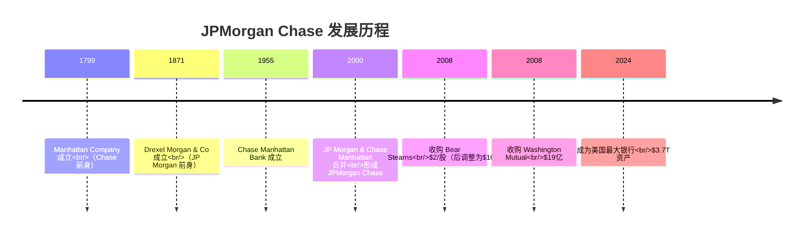
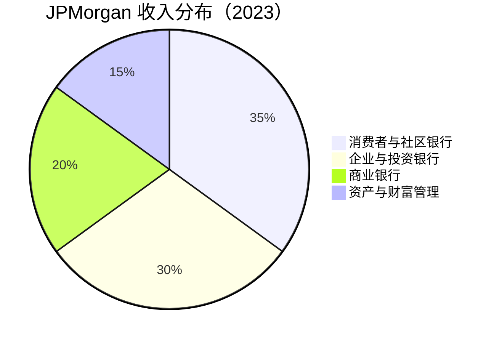
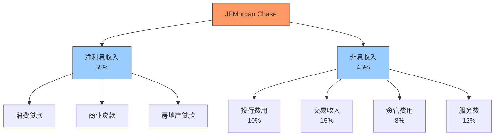
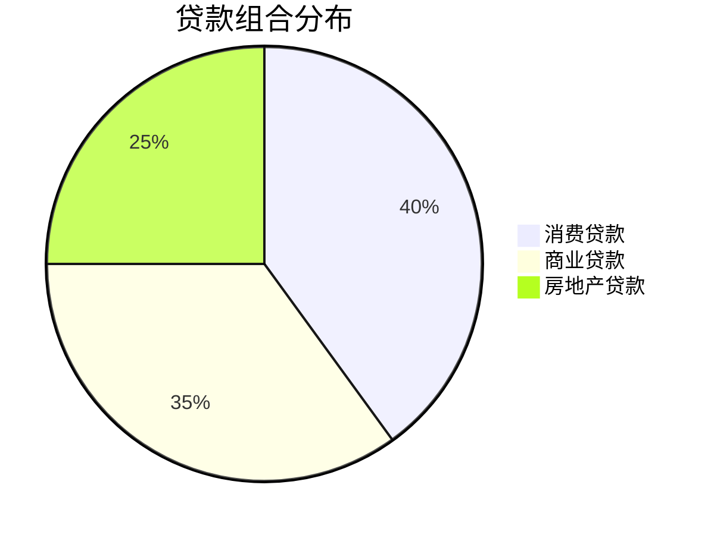

# JPMorgan Chase 深度分析

## 公司概况

**基本信息**（2024年初）：
- **成立时间**：1799年（前身），2000年（现代合并）
- **总部**：纽约市
- **CEO**：Jamie Dimon（2005年至今）
- **员工数**：约 30万人
- **总资产**：$3.7万亿
- **市值**：$450亿+
- **标普500排名**：第6位

**股票信息**：
- **代码**：JPM（NYSE）
- **行业分类**：金融服务 - 多元化银行
- **指数成分**：道琼斯工业平均指数、标普500


## 概述

JPMorgan Chase 是美国最大、全球最有价值的银行，也是唯一一家在所有主要业务线都保持领先地位的金融机构。公司通过 2008年金融危机的考验，不仅幸存下来，还通过收购 Bear Stearns 和 Washington Mutual 进一步巩固了市场地位。在 Jamie Dimon 的领导下，JPMorgan 建立了无可匹敌的竞争优势和强大的风险管理文化。

**学习目标**：
- 理解 JPMorgan 的多元化业务模式
- 分析公司的核心竞争优势和护城河
- 评估财务表现和盈利能力
- 掌握投资价值评估方法
- 识别关键风险和机遇

## 历史沿革

### 关键里程碑



### 2008年金融危机中的表现

**危机前准备**：
- 2006-2007年减少次贷敞口
- 提高资本缓冲
- 加强风险管理

**危机中行动**：
- 2008年3月：以$2/股收购 Bear Stearns（政府支持）
- 2008年9月：以$19亿收购 Washington Mutual 资产
- 接受 TARP 资金 $250亿（2009年6月全额偿还）

**危机后地位**：
- 市场份额大幅提升
- 竞争对手减少
- 监管地位提升
- 品牌信任增强

## 业务结构

### 四大业务板块



#### 1. 消费者与社区银行（Consumer & Community Banking, CCB）

**规模**：
- 收入：$600亿+
- 利润：$180亿+
- 客户：6,600万家庭
- 分支机构：4,800+
- ATM：16,000+

**主要业务**：

**a. 零售银行**
- 存款账户：$1.0万亿
- 贷款：$5,000亿
- 分支网络：全美最大
- 数字用户：5,000万+

**b. 信用卡**
- 发卡量：1.5亿张
- 贷款余额：$2,000亿
- 市场份额：#1（与 Chase Sapphire 等高端卡）
- 合作伙伴：Amazon, United Airlines, Marriott

**c. 汽车金融**
- 贷款余额：$800亿
- 市场份额：#1
- 经销商网络：16,000+

**d. 抵押贷款**
- 贷款余额：$3,000亿
- 市场份额：Top 3
- 服务贷款：$1.2万亿

**竞争优势**：
- 最大分支网络
- 强大品牌认知
- 数字化领先
- 交叉销售能力

#### 2. 企业与投资银行（Corporate & Investment Bank, CIB）

**规模**：
- 收入：$500亿+
- 利润：$200亿+
- 客户：全球大型企业、机构、政府

**主要业务**：

**a. 投资银行**
- 股票承销：全球 #1
- 债券承销：全球 #1
- M&A 咨询：全球 #1
- 费用收入：$80亿+

**b. 市场与证券服务**
- 固定收益交易：全球 #1
- 外汇交易：全球 #1
- 大宗商品交易：Top 3
- 交易收入：$200亿+

**c. 支付与现金管理**
- 企业支付处理
- 全球现金管理
- 贸易融资
- 收入：$100亿+

**竞争优势**：
- 全球网络最广
- 资产负债表最强
- 客户关系最深
- 产品线最全

#### 3. 商业银行（Commercial Banking, CB）

**规模**：
- 收入：$350亿+
- 利润：$140亿+
- 客户：中型企业、地方政府、非营利组织

**主要业务**：

**a. 中间市场银行**
- 贷款：$2,500亿
- 存款：$4,000亿
- 客户：30,000+

**b. 商业地产**
- 贷款：$1,000亿
- 市场份额：Top 3

**c. 商业银行服务**
- 现金管理
- 国际贸易
- 资金管理

**竞争优势**：
- 中间市场领导者
- 产品综合性
- 跨部门协同

#### 4. 资产与财富管理（Asset & Wealth Management, AWM）

**规模**：
- 收入：$250亿+
- 利润：$50亿+
- AUM：$3.5万亿
- 客户资产：$5.0万亿

**主要业务**：

**a. 资产管理**
- 共同基金
- ETF
- 另类投资
- AUM：$2.5万亿

**b. 私人银行**
- 超高净值客户
- 家族办公室
- 信托服务
- 客户资产：$1.5万亿

**c. 财富管理**
- 高净值客户
- 投资咨询
- 退休规划
- 客户资产：$1.0万亿

**竞争优势**：
- 品牌声誉
- 产品广度
- 全球平台
- 技术投资

## 商业模式分析

### 多元化优势

**收入来源多样化**：



**业务协同效应**：

1. **交叉销售**
   - 零售客户 → 财富管理
   - 商业银行 → 投资银行
   - 企业客户 → 资产管理

2. **资金协同**
   - 零售存款 → 低成本资金
   - 企业存款 → 支持投行业务
   - 综合资金成本最低

3. **风险分散**
   - 周期性业务平衡
   - 地域分散
   - 客户类型多样

### 规模优势

**成本优势**：
- 技术投资：年投资 $150亿
  - 单位成本最低
  - 创新能力最强
  - 数字化领先

- 合规成本：年支出 $50亿+
  - 规模分摊
  - 系统成熟
  - 效率最高

**收入优势**：
- 资金成本：行业最低
  - 存款成本：0.5%
  - 批发融资：优惠利率
  - 净息差优势：+20-30bp

- 定价能力：
  - 品牌溢价
  - 产品差异化
  - 客户粘性高

## 财务分析

### 收入结构（2023年）

**总收入**：$1,620亿

**分项收入**：
- 净利息收入：$890亿（55%）
- 投资银行费用：$80亿（5%）
- 资产管理费用：$180亿（11%）
- 交易收入：$240亿（15%）
- 服务费：$150亿（9%）
- 其他：$80亿（5%）

**收入增长驱动**：
- 净息差扩大：利率上升
- 交易量增长：市场份额提升
- 资产管理规模增长：市场上涨 + 净流入
- 费用收入增长：客户活跃度提高

### 盈利能力

**关键指标**（2023年）：

| 指标 | JPMorgan | 行业平均 | 排名 |
|------|----------|----------|------|
| ROE | 17% | 11% | #1 |
| ROA | 1.3% | 1.0% | #1 |
| ROIC | 12% | 8% | #1 |
| 净息差 | 2.5% | 2.3% | Top 3 |
| 效率比率 | 55% | 62% | #1 |

**盈利能力分析**：

**ROE 杜邦分析**：
```
ROE = 净利润率 × 资产周转率 × 权益乘数
17% = 30% × 4.5% × 12.5x
```

**优势来源**：
- 净利润率高：规模效应 + 业务组合
- 资产周转率适中：平衡增长与风险
- 权益乘数合理：充足资本 + 高效运营

### 资产质量

**贷款组合**（$1.3万亿）：



**资产质量指标**：

| 指标 | 2023 | 2022 | 趋势 |
|------|------|------|------|
| 不良贷款率 | 0.6% | 0.5% | ↑ |
| 净冲销率 | 0.4% | 0.3% | ↑ |
| 准备金覆盖率 | 180% | 200% | ↓ |
| 准备金/贷款 | 1.1% | 1.0% | ↑ |

**分析**：
- 资产质量优秀
- 准备金充足
- 信用成本可控
- 周期性正常化

### 资本充足性

**资本指标**（2023年末）：

| 指标 | 实际 | 监管要求 | 缓冲 |
|------|------|----------|------|
| CET1 | 15.0% | 12.5% | 2.5% |
| Tier 1 | 16.5% | 14.0% | 2.5% |
| 总资本 | 18.5% | 16.0% | 2.5% |
| 杠杆率 | 6.5% | 5.0% | 1.5% |

**资本管理**：
- 充足的资本缓冲
- 支持业务增长
- 股东回报能力强
- 应对压力测试

### 股东回报

**股息政策**：
- 股息率：2.5-3.0%
- 派息率：30-35%
- 连续增长：13年
- 季度股息：$1.05/股

**股票回购**：
- 2023年回购：$100亿
- 累计回购（2010-2023）：$800亿+
- 回购收益率：2-3%

**总股东回报**：
- 股息 + 回购：年回报 5-6%
- 股价增长：年回报 10-15%
- 总回报：年回报 15-20%

## 竞争优势分析

### 1. 规模与多元化

**无可匹敌的规模**：
- 总资产：$3.7万亿（美国 #1）
- 市值：$450亿+（全球银行 #1）
- 员工：30万人

**业务多元化**：
- 唯一在所有主要业务都是 #1 或 #2
- 收入来源平衡
- 风险分散
- 协同效应强

### 2. 品牌与信任

**品牌价值**：
- 全球最有价值银行品牌
- 品牌价值：$500亿+
- 危机中表现建立信任

**客户信任**：
- 零售客户：6,600万家庭
- 企业客户：全球 Fortune 500 中 95%
- 机构客户：全球主要机构

### 3. 技术领先

**技术投资**：
- 年投资：$150亿
- 技术人员：60,000+
- 专利：1,000+

**数字化成果**：
- 移动用户：5,000万+
- 数字销售占比：40%+
- 自动化率：持续提升

**创新领域**：
- 人工智能和机器学习
- 区块链技术
- 云计算
- 网络安全

### 4. 风险管理

**风险文化**：
- CEO Jamie Dimon 强调风险管理
- 三道防线模型
- 独立风险管理部门

**风险管理能力**：
- 2008年危机中表现优异
- 压力测试持续通过
- 信用损失可控
- 操作风险管理领先

### 5. 管理团队

**Jamie Dimon**：
- CEO（2005年至今）
- 业界最受尊敬的银行家
- 战略眼光卓越
- 执行力强

**管理团队**：
- 经验丰富
- 稳定性高
- 继任计划清晰

### 6. 监管关系

**系统重要性银行**：
- G-SIB 地位
- 监管关系良好
- 政策影响力大

**监管优势**：
- 合规体系成熟
- 监管成本可控
- 新规适应能力强

## 估值分析

### 当前估值（2024年初）

**市场数据**：
- 股价：$150
- 市值：$450亿
- P/E：11x
- P/B：1.8x
- 股息率：2.8%

### 相对估值

**同业对比**：

| 银行 | P/E | P/B | ROE | 股息率 |
|------|-----|-----|-----|--------|
| JPMorgan | 11x | 1.8x | 17% | 2.8% |
| Bank of America | 10x | 1.1x | 11% | 2.5% |
| Wells Fargo | 10x | 1.2x | 12% | 2.6% |
| Citigroup | 8x | 0.6x | 7% | 3.8% |

**估值合理性**：
- P/B 溢价合理：ROE 显著高于同业
- P/E 略高：反映质量溢价
- 综合估值：合理偏低

### 绝对估值（DCF）

**假设**：
- 当前 EPS：$13.50
- EPS 增长率：5-7%（未来5年）
- 长期增长率：3%
- 要求回报率：10%

**估值区间**：
- 保守估值：$140
- 基准估值：$165
- 乐观估值：$190

**当前价格**：$150
**上涨空间**：10-25%

### 投资论点

**看多理由**：

1. **行业领导地位**
   - 所有业务线都领先
   - 市场份额持续提升
   - 竞争优势扩大

2. **盈利能力卓越**
   - ROE 17%（行业最高）
   - 效率比率 55%（行业最低）
   - 持续改善趋势

3. **资本充足**
   - CET1 15%（充足缓冲）
   - 支持增长和股东回报
   - 应对不确定性

4. **估值合理**
   - P/B 1.8x（相对 ROE 合理）
   - P/E 11x（低于历史平均）
   - 股息率 2.8%（吸引力）

5. **管理团队优秀**
   - Jamie Dimon 领导
   - 战略清晰
   - 执行力强

6. **利率环境有利**
   - 利率上升周期
   - 净息差扩大
   - 利息收入增长

**风险因素**：

1. **经济衰退风险**
   - 信用损失增加
   - 交易活动下降
   - 贷款需求减少

2. **监管风险**
   - 资本要求提高
   - 业务限制增加
   - 合规成本上升

3. **竞争加剧**
   - 金融科技挑战
   - 传统银行竞争
   - 利润率压力

4. **利率风险**
   - 利率曲线倒挂
   - 净息差压缩
   - 资产负债错配

5. **操作风险**
   - 网络安全威胁
   - 技术故障
   - 合规失误

## 投资策略

### 适合投资者类型

**价值投资者**：
- 估值合理
- 盈利能力强
- 护城河宽广
- 长期持有价值

**收入投资者**：
- 稳定股息
- 持续增长
- 股息率适中
- 派息可持续

**成长投资者**：
- 市场份额增长
- 数字化转型
- 业务扩张
- EPS 增长稳定

### 买入时机

**理想买入点**：
- P/B <1.5x
- P/E <10x
- 股息率 >3%
- 市场恐慌时

**当前评估**：
- 估值合理
- 可以建仓
- 分批买入
- 长期持有

### 持有策略

**核心持仓**：
- 占金融板块 30-40%
- 占总投资组合 5-10%
- 长期持有（5-10年+）

**再平衡**：
- 估值过高时减仓（P/B >2.5x）
- 估值低估时加仓（P/B <1.2x）
- 保持纪律

### 卖出信号

**基本面恶化**：
- ROE 持续下降
- 资产质量恶化
- 资本充足率下降
- 管理层变动

**估值过高**：
- P/B >2.5x
- P/E >15x
- 隐含过高增长预期

**更好机会**：
- 其他银行更具吸引力
- 其他行业机会更好

## 关键学习点

1. **多元化的力量**
   - 业务多元化降低风险
   - 协同效应创造价值
   - 规模优势难以复制

2. **质量的价值**
   - 高 ROE 值得溢价
   - 风险管理创造价值
   - 品牌信任是护城河

3. **管理的重要性**
   - 优秀 CEO 创造巨大价值
   - 战略清晰执行有力
   - 风险文化至关重要

4. **危机中的机会**
   - 2008年危机中的收购
   - 强者更强
   - 长期视角的回报

5. **估值与质量的平衡**
   - 不要只追求便宜
   - 质量值得合理溢价
   - 长期持有优质资产

## 常见误区

**误区1：JPMorgan 太大了，增长空间有限**
- 市场份额仍有提升空间
- 数字化带来新增长
- 国际业务扩张
- 新业务线开拓

**误区2：银行都一样，买便宜的就行**
- 质量差异巨大
- JPMorgan 护城河最宽
- 长期回报差异显著

**误区3：估值太高了**
- 相对 ROE 估值合理
- 质量溢价应该存在
- 长期持有回报可观

**误区4：金融科技会颠覆传统银行**
- JPMorgan 技术投资领先
- 规模和品牌优势明显
- 监管护城河保护

## 延伸阅读

### 必读资料

1. **JPMorgan Chase 年报**
   - 最全面的信息来源
   - CEO 致股东信（Jamie Dimon）
   - 业务详细分析

2. **投资者日演示**
   - 战略规划
   - 财务目标
   - 管理层问答

3. **季度财报电话会议**
   - 最新业绩
   - 管理层展望
   - 分析师问答

### 推荐书籍

1. **《大而不倒》** - Andrew Ross Sorkin
   - 2008年危机全景
   - JPMorgan 的角色
   - Jamie Dimon 的决策

2. **《摩根财团》** - Ron Chernow
   - JP Morgan 历史
   - 美国金融史
   - 银行业演进

## 参考文献

1. JPMorgan Chase & Co. (2023). "Annual Report"
2. JPMorgan Chase & Co. (2024). "Q4 2023 Earnings Presentation"
3. Federal Reserve. (2024). "Comprehensive Capital Analysis and Review Results"
4. S&P Global Market Intelligence. (2024). "JPMorgan Chase Analysis"
5. Goldman Sachs. (2024). "JPMorgan Chase Equity Research"
6. Morgan Stanley. (2024). "US Banks Deep Dive"
7. McKinsey & Company. (2024). "Global Banking Annual Review"
8. Dimon, Jamie. (2023). "Letter to Shareholders"
9. Bloomberg. (2024). "JPMorgan Chase Company Profile"
10. Financial Times. (2024). "JPMorgan Analysis and News"

---

**下一步学习**：
- 对比 [Bank of America](bank-of-america.html)
- 研究 [Berkshire Hathaway 投资组合](../../../../03-company-analysis/case-studies/financial-institutions/berkshire-hathaway.html)
- 了解 [银行业整体](overview.html)


## 高级分析与前沿研究

### 学术研究进展

近年来，学术界对本领域的研究取得了重要进展。以下是几个值得关注的研究方向：

**行为金融学视角**：传统金融理论假设市场参与者是完全理性的，但行为金融学的研究表明，认知偏差和情绪因素在投资决策中扮演着重要角色。诺贝尔经济学奖得主丹尼尔·卡尼曼（Daniel Kahneman）和理查德·塞勒（Richard Thaler）的研究为我们理解市场非理性行为提供了重要框架。

**因子投资研究**：尤金·法玛（Eugene Fama）和肯尼斯·弗伦奇（Kenneth French）的三因子模型，以及后续发展的五因子模型，为系统性地解释股票收益差异提供了理论基础。这些研究表明，市值、账面市值比、盈利能力和投资模式等因子能够解释大部分股票收益的横截面差异。

**市场微观结构研究**：对市场流动性、价格发现机制和交易成本的深入研究，帮助我们更好地理解市场的运作机制，并为优化交易策略提供指导。

### 实战案例深度解析

**案例一：长期价值创造的典范**

以沃伦·巴菲特（Warren Buffett）的伯克希尔·哈撒韦（Berkshire Hathaway）为例，其长达数十年的卓越投资业绩证明了价值投资理念的有效性。从1965年至今，伯克希尔的账面价值年均增长率约为19.8%，远超同期标普500指数的约10.2%年均回报。

巴菲特的成功秘诀在于：
- 专注于具有持久竞争优势的优质企业
- 以合理价格买入，而非追求最低价格
- 长期持有，让复利效应充分发挥
- 保持充足的安全边际，控制下行风险

**案例二：危机中的机遇识别**

2008年金融危机期间，大多数投资者恐慌性抛售，但少数具有前瞻性的投资者却在危机中发现了历史性的投资机会。约翰·保尔森（John Paulson）通过做空次级抵押贷款相关证券，在危机中获得了约150亿美元的利润，成为金融史上最成功的单笔交易之一。

这个案例告诉我们：
- 深入的基本面研究能够发现市场定价错误
- 逆向思维往往能够发现被市场忽视的机会
- 风险管理和仓位控制是成功的关键

### 跨市场比较分析

不同市场在结构、监管、投资者构成等方面存在显著差异，这些差异对投资策略的选择有重要影响：

**美国市场特征**：
- 机构投资者主导，市场效率较高
- 信息披露制度完善，分析师覆盖广泛
- 衍生品市场发达，对冲工具丰富
- 长期牛市历史，但也经历过多次重大调整

**中国市场特征**：
- 散户投资者比例较高，市场波动性较大
- 政策因素影响显著，需要密切关注监管动向
- 新兴行业发展迅速，成长投资机会丰富
- A股、港股、美股中概股形成多层次市场体系

**欧洲市场特征**：
- 价值股比例较高，估值相对保守
- 受地缘政治和欧元区政策影响较大
- 部分行业（如奢侈品、工业）具有全球竞争优势
- ESG投资理念推广较为领先


## 实用工具与操作指南

### 分析工具推荐

**数据获取工具**：
- **Bloomberg Terminal**：专业级金融数据平台，提供实时行情、历史数据、新闻资讯等全方位服务，是机构投资者的首选工具
- **Wind资讯（万得）**：中国最权威的金融数据平台，覆盖A股、债券、基金等全市场数据
- **FactSet**：提供全球股票、固定收益、另类投资等多资产类别的综合数据服务
- **免费替代方案**：Yahoo Finance、Google Finance、东方财富、同花顺等提供基础数据服务

**分析软件工具**：
- **Excel/Python**：用于财务模型构建、数据分析和可视化
- **Tableau/Power BI**：用于数据可视化和仪表板创建
- **R语言**：适合统计分析和量化研究

### 实操步骤指南

**第一步：信息收集**
1. 获取目标公司/资产的基本信息和历史数据
2. 收集行业报告和竞争对手数据
3. 整理宏观经济背景信息
4. 查阅相关学术研究和专业分析报告

**第二步：定量分析**
1. 建立财务模型，计算关键指标
2. 进行历史趋势分析
3. 与同行业公司进行横向比较
4. 构建估值模型，计算合理价值区间

**第三步：定性分析**
1. 评估竞争优势和护城河
2. 分析管理层质量和公司治理
3. 识别主要风险因素
4. 评估行业发展趋势

**第四步：综合判断**
1. 整合定量和定性分析结果
2. 进行情景分析（乐观/基准/悲观）
3. 确定投资论点和关键假设
4. 制定投资决策和风险管理方案

### 常见错误与规避方法

| 常见错误 | 产生原因 | 规避方法 |
|---------|---------|---------|
| 过度依赖历史数据 | 忽视结构性变化 | 结合前瞻性分析 |
| 锚定效应 | 过度依赖初始信息 | 定期重新评估假设 |
| 确认偏误 | 只寻找支持观点的证据 | 主动寻找反驳证据 |
| 过度自信 | 高估自身分析能力 | 保持谦逊，设置安全边际 |
| 忽视流动性风险 | 只关注收益不关注风险 | 全面评估风险因素 |

