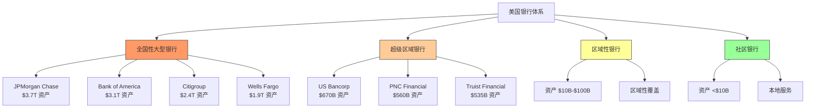
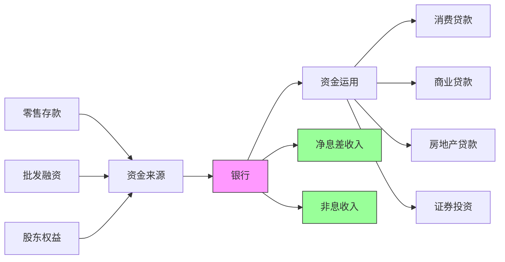
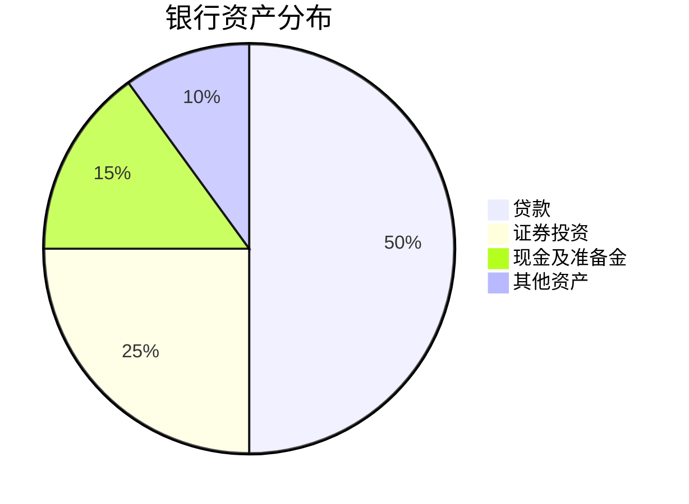
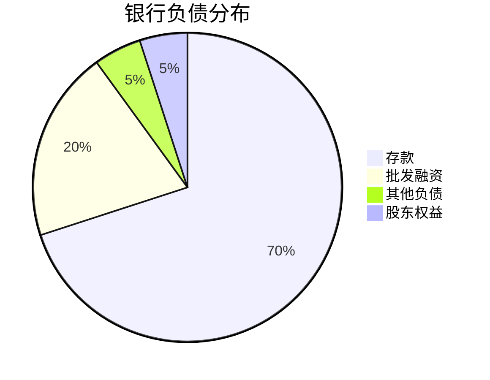

# 美国银行业深度分析

## 概述

美国银行业是全球最发达的银行体系，总资产超过 23 万亿美元，包括约 4,800 家商业银行和储蓄机构。该行业经历了 2008 年金融危机的洗礼，在更严格的监管下变得更加稳健，同时面临着金融科技的挑战和数字化转型的压力。

**学习目标**：
- 理解美国银行业的层级结构和监管框架
- 掌握银行的核心商业模式和盈利来源
- 分析银行业的竞争格局和护城河
- 评估银行投资的关键指标和风险因素
- 识别行业趋势和投资机会

## 行业结构

### 银行分类体系



### 市场集中度

**四大银行市场份额**（2024）：
- 总资产：占全行业 40%
- 存款：占全行业 38%
- 贷款：占全行业 35%
- 分支机构：占全行业 25%

**行业整合趋势**：
- 银行数量：从 1990 年的 12,000+ 家减少到 2024 年的 4,800 家
- 并购活跃：每年 150-250 起并购交易
- 规模效应：大型银行优势持续扩大

## 商业模式深度解析

### 核心业务模式



### 收入结构分析

#### 1. 净利息收入（Net Interest Income）

**占比**：总收入的 55-65%

**计算公式**：
```
净利息收入 = 利息收入 - 利息支出
净息差（NIM） = 净利息收入 / 平均生息资产
```

**影响因素**：
- **利率环境**：
  - 利率上升：短期有利（存款成本滞后）
  - 利率下降：短期不利（贷款收益率下降）
  - 收益率曲线形状：陡峭有利，倒挂不利
  
- **资产负债管理**：
  - 资产久期：长期贷款 vs 短期贷款
  - 负债久期：活期存款 vs 定期存款
  - 久期缺口管理

- **竞争环境**：
  - 存款竞争：影响资金成本
  - 贷款竞争：影响贷款定价
  - 市场份额争夺

**典型净息差水平**：
- 大型银行：2.5-3.0%
- 区域银行：3.0-3.5%
- 社区银行：3.5-4.0%

#### 2. 非利息收入（Non-Interest Income）

**占比**：总收入的 35-45%

**主要来源**：

**a. 服务费收入（15-20%）**
- 账户维护费
- 透支费
- ATM 费用
- 电汇费用
- 保管费

**b. 信用卡收入（10-15%）**
- 交换费收入
- 年费
- 滞纳金
- 外汇转换费

**c. 投资银行收入（5-10%）**
- 承销费用
- 并购咨询费
- 交易佣金

**d. 资产管理收入（5-10%）**
- 财富管理费
- 信托服务费
- 基金管理费

**e. 交易收入（5-10%）**
- 固定收益交易
- 外汇交易
- 大宗商品交易
- 衍生品交易

**f. 其他收入（5-10%）**
- 保险销售佣金
- 抵押贷款服务费
- 证券化收入

### 成本结构

**主要成本项**：

1. **利息支出（30-40%）**
   - 存款利息
   - 批发融资成本
   - 债券利息

2. **人力成本（25-35%）**
   - 工资和奖金
   - 福利
   - 培训

3. **运营成本（15-25%）**
   - 技术和设备
   - 房租和设施
   - 营销费用
   - 专业服务费

4. **信用损失准备（5-15%）**
   - 贷款损失准备金
   - 净冲销

5. **其他成本（5-10%）**
   - 监管和合规
   - 诉讼费用
   - 保险

**效率比率**：
```
效率比率 = 非利息支出 / (净利息收入 + 非利息收入)
```

**行业基准**：
- 优秀银行：<50%
- 行业平均：55-60%
- 低效银行：>65%

## 资产负债表分析

### 资产端构成

**典型大型银行资产结构**：



#### 1. 贷款组合（50-60%）

**消费贷款（25-30%）**：
- 信用卡：高收益（12-18%），高风险
- 汽车贷款：中等收益（4-8%），中等风险
- 个人贷款：中高收益（8-15%），中高风险
- 学生贷款：低收益（3-6%），政府担保

**商业贷款（30-35%）**：
- 商业与工业贷款（C&I）：中等收益（4-7%）
- 商业地产（CRE）：中高收益（5-8%），周期性强
- 设备融资：中等收益（5-7%）

**房地产贷款（25-30%）**：
- 住宅抵押贷款：低收益（3-5%），低风险
- 房屋净值贷款：中等收益（5-8%）
- 建筑贷款：高收益（6-10%），高风险

#### 2. 证券投资（20-30%）

**目的**：
- 流动性管理
- 收益增强
- 利率风险对冲

**组成**：
- 美国国债：20-30%
- 机构债券（GSE）：30-40%
- 市政债券：10-20%
- MBS（抵押贷款支持证券）：20-30%
- 公司债券：5-10%

#### 3. 现金及准备金（10-20%）

**包括**：
- 库存现金
- 美联储存款准备金
- 同业存款
- 联邦基金

**用途**：
- 满足监管要求
- 日常运营需要
- 流动性缓冲

### 负债端构成

**典型大型银行负债结构**：



#### 1. 存款（65-75%）

**零售存款（50-60%）**：
- **活期存款（30-40%）**：
  - 成本：接近零
  - 稳定性：高
  - 价值：最高
  
- **储蓄存款（20-30%）**：
  - 成本：0.5-2%
  - 稳定性：中高
  - 价值：高
  
- **定期存款（10-20%）**：
  - 成本：2-5%
  - 稳定性：中
  - 价值：中

**批发存款（10-15%）**：
- 大额存单（CD）
- 经纪存款
- 公共资金存款

#### 2. 批发融资（15-25%）

**短期融资**：
- 联邦基金借入
- 回购协议（Repo）
- 商业票据

**长期融资**：
- 高级债券
- 次级债券
- 优先股

#### 3. 股东权益（8-12%）

**组成**：
- 普通股
- 留存收益
- 累计其他综合收益（AOCI）

## 关键财务指标

### 盈利能力指标

#### 1. 股本回报率（ROE）

```
ROE = 净利润 / 平均股东权益
```

**行业基准**：
- 优秀银行：15-20%
- 行业平均：10-12%
- 低效银行：<8%

**杜邦分析**：
```
ROE = (净利润/收入) × (收入/资产) × (资产/权益)
    = 净利润率 × 资产周转率 × 权益乘数
```

#### 2. 资产回报率（ROA）

```
ROA = 净利润 / 平均总资产
```

**行业基准**：
- 优秀银行：1.2-1.5%
- 行业平均：0.9-1.1%
- 低效银行：<0.7%

#### 3. 投入资本回报率（ROIC）

```
ROIC = NOPAT / 投入资本
```

**优势**：
- 排除资本结构影响
- 更准确反映经营效率
- 便于跨行业比较

### 资产质量指标

#### 1. 不良贷款率（NPL Ratio）

```
NPL率 = 不良贷款 / 总贷款
```

**分类标准**：
- 正常（Current）
- 关注（Special Mention）
- 次级（Substandard）
- 可疑（Doubtful）
- 损失（Loss）

**行业基准**：
- 优秀银行：<0.5%
- 行业平均：0.7-1.0%
- 问题银行：>2%

#### 2. 贷款损失准备金覆盖率

```
覆盖率 = 贷款损失准备金 / 不良贷款
```

**行业基准**：
- 充足：>150%
- 适当：100-150%
- 不足：<100%

#### 3. 净冲销率（Net Charge-off Rate）

```
净冲销率 = 净冲销额 / 平均贷款余额
```

**各类贷款基准**：
- 信用卡：2-4%
- 消费贷款：1-2%
- 商业贷款：0.3-0.8%
- 房地产贷款：0.1-0.5%

#### 4. 逾期贷款率

```
逾期率 = 逾期30天以上贷款 / 总贷款
```

**预警信号**：
- 逾期率上升：信用质量恶化
- 逾期率下降：信用质量改善
- 领先于不良贷款率变化

### 资本充足性指标

#### 1. 核心一级资本比率（CET1）

```
CET1 = 核心一级资本 / 风险加权资产
```

**监管要求**：
- 最低：4.5%
- 资本保护缓冲：2.5%
- G-SIB 附加：1-3.5%
- 实际目标：10-12%

#### 2. 一级资本比率（Tier 1）

```
Tier 1 = (CET1 + 其他一级资本) / 风险加权资产
```

**监管要求**：
- 最低：6%
- 实际目标：11-13%

#### 3. 总资本比率

```
总资本比率 = (一级资本 + 二级资本) / 风险加权资产
```

**监管要求**：
- 最低：8%
- 实际目标：13-15%

#### 4. 杠杆率

```
杠杆率 = 一级资本 / 总资产（未加权）
```

**监管要求**：
- 最低：3%
- 大型银行：5-6%

#### 5. 有形普通股权益比率（TCE）

```
TCE = (普通股权益 - 无形资产) / 有形资产
```

**优势**：
- 更保守的资本衡量
- 排除商誉影响
- 投资者关注指标

### 流动性指标

#### 1. 贷存比（Loan-to-Deposit Ratio）

```
贷存比 = 总贷款 / 总存款
```

**行业基准**：
- 保守：<70%
- 适中：70-90%
- 激进：>90%

#### 2. 流动性覆盖率（LCR）

```
LCR = 高质量流动性资产 / 30天净现金流出
```

**监管要求**：≥100%

#### 3. 净稳定资金比率（NSFR）

```
NSFR = 可用稳定资金 / 所需稳定资金
```

**监管要求**：≥100%

## 竞争格局分析

### 四大银行对比

| 指标 | JPMorgan | BofA | Citigroup | Wells Fargo |
|------|----------|------|-----------|-------------|
| 总资产 | $3.7T | $3.1T | $2.4T | $1.9T |
| 市值 | $450B | $250B | $100B | $180B |
| ROE | 17% | 11% | 7% | 12% |
| CET1 | 15.0% | 11.8% | 13.5% | 11.3% |
| 效率比率 | 55% | 66% | 66% | 65% |
| P/B | 1.8x | 1.1x | 0.6x | 1.2x |

**竞争优势排序**：
1. **JPMorgan Chase**：全面领先
2. **Bank of America**：零售银行强
3. **Wells Fargo**：恢复中
4. **Citigroup**：国际业务强

### 护城河分析

#### 1. 规模优势

**成本优势**：
- 技术投资分摊
- 采购议价能力
- 营销效率
- 合规成本分摊

**收入优势**：
- 更低资金成本
- 更多交叉销售机会
- 更强定价能力

**数据**：
- JPMorgan 年技术投资：$150亿
- 中小银行难以匹配

#### 2. 客户粘性

**转换成本**：
- 账户迁移麻烦
- 自动支付设置
- 信用记录
- 关系积累

**数据**：
- 主银行关系平均持续：15-20年
- 年流失率：<5%

#### 3. 网络效应

**分支网络**：
- JPMorgan：4,800+ 分支
- Bank of America：4,000+ 分支
- 便利性优势

**ATM 网络**：
- 全国覆盖
- 免费使用
- 客户锁定

#### 4. 品牌信任

**重要性**：
- 金融服务需要信任
- 大品牌更可靠
- 危机时更稳定

**价值**：
- 更低获客成本
- 更高客户终身价值
- 更强定价能力

#### 5. 监管壁垒

**进入门槛**：
- 银行牌照
- 资本要求
- 合规成本
- 监管审查

**现有优势**：
- 已建立的监管关系
- 成熟的合规体系
- 规模分摊成本

## 投资分析

### 估值方法

#### 1. 市净率（P/B）估值

**公式**：
```
合理P/B = ROE × 派息率 / (要求回报率 - 增长率)
```

**简化版**：
```
合理P/B ≈ ROE / 要求回报率
```

**示例**：
- ROE = 15%
- 要求回报率 = 10%
- 合理P/B = 15% / 10% = 1.5x

**行业基准**：
- ROE 15%+：P/B 1.5-2.5x
- ROE 10-15%：P/B 1.0-1.5x
- ROE <10%：P/B 0.6-1.0x

#### 2. 市盈率（P/E）估值

**正常化P/E**：
- 优质银行：10-15x
- 普通银行：8-12x
- 问题银行：<8x

**注意事项**：
- 周期性调整
- 一次性项目剔除
- 信用周期位置

#### 3. 超额回报模型

**公式**：
```
价值 = 账面价值 + 未来超额回报现值
超额回报 = (ROE - 要求回报率) × 账面价值
```

**优势**：
- 考虑盈利能力
- 反映增长价值
- 理论基础扎实

### 投资决策框架

#### 看多信号

**基本面改善**：
- ROE 上升趋势
- 资产质量改善
- 效率比率下降
- 资本充足率提高

**估值吸引**：
- P/B <1.2x
- P/E <10x
- 股息收益率 >3%

**宏观环境**：
- 利率上升周期
- 经济复苏
- 信用周期改善

**催化剂**：
- 监管放松
- 并购整合
- 股东回报增加

#### 看空信号

**基本面恶化**：
- ROE 下降
- 不良贷款率上升
- 准备金不足
- 资本压力

**估值过高**：
- P/B >2.0x
- P/E >15x
- 隐含过高增长预期

**宏观风险**：
- 经济衰退
- 利率倒挂
- 信用周期恶化

**特定风险**：
- 监管处罚
- 诉讼风险
- 管理层问题

## 行业趋势

### 数字化转型

**投资规模**：
- 大型银行：年投资 $100-150亿
- 占收入比：8-12%

**重点领域**：
- 移动银行应用
- 数字支付
- 人工智能
- 云计算
- 网络安全

**影响**：
- 分支机构减少
- 运营效率提升
- 客户体验改善
- 成本结构优化

### 金融科技竞争

**威胁领域**：
- 支付：Venmo, Cash App
- 借贷：LendingClub, SoFi
- 财富管理：Robinhood, Betterment
- 新银行：Chime, Varo

**应对策略**：
- 自主创新
- 收购整合
- 合作共赢
- 生态构建

### 行业整合

**驱动因素**：
- 规模效应追求
- 技术投资压力
- 监管成本上升
- 竞争加剧

**趋势**：
- 大型银行更大
- 中小银行减少
- 市场集中度提高

## 实战应用

### 选股清单

**必备条件**：
- [ ] ROE >12%
- [ ] CET1 >11%
- [ ] 效率比率 <60%
- [ ] 不良贷款率 <1%
- [ ] P/B <1.5x

**加分项**：
- [ ] ROE 上升趋势
- [ ] 市场份额增长
- [ ] 数字化领先
- [ ] 管理层优秀
- [ ] 股息增长记录

### 风险检查清单

**资产质量**：
- [ ] 商业地产敞口
- [ ] 能源贷款敞口
- [ ] 消费信贷质量
- [ ] 准备金充足性

**资本充足性**：
- [ ] CET1 缓冲
- [ ] 压力测试结果
- [ ] 资本计划

**流动性**：
- [ ] 贷存比
- [ ] 批发融资依赖
- [ ] LCR/NSFR

**运营风险**：
- [ ] 监管合规
- [ ] 网络安全
- [ ] 诉讼风险

## 常见误区

**误区1：所有银行都一样**
- 商业模式差异大
- 资产质量不同
- 管理能力差异
- 需要深入分析

**误区2：只看P/B估值**
- 需要结合ROE
- 考虑资产质量
- 评估增长前景

**误区3：忽视利率风险**
- 利率变化影响巨大
- 收益率曲线重要
- 资产负债错配风险

**误区4：低估监管影响**
- 监管决定业务边界
- 资本要求影响回报
- 合规成本持续上升

## 延伸阅读

### 推荐书籍

1. **《银行管理》** - Timothy W. Koch
2. **《商业银行管理》** - Peter S. Rose
3. **《银行信用分析手册》** - Jonathan Golin
4. **《巴塞尔协议III详解》** - BIS

### 研究资源

- FDIC 季度银行业报告
- 美联储监管报告
- OCC 风险展望
- 各银行年报和投资者关系资料

## 参考文献

1. Federal Deposit Insurance Corporation. (2024). "Quarterly Banking Profile"
2. Federal Reserve. (2024). "Supervision and Regulation Report"
3. Office of the Comptroller of the Currency. (2024). "Semiannual Risk Perspective"
4. Bank for International Settlements. (2024). "Basel III Monitoring Report"
5. S&P Global Market Intelligence. (2024). "US Banking Industry Analysis"
6. McKinsey & Company. (2024). "North America Banking Report"
7. Deloitte. (2024). "Banking Industry Outlook"
8. JPMorgan Chase. (2023). "Annual Report"
9. Bank of America. (2023). "Annual Report"
10. Citigroup. (2023). "Annual Report"
11. Wells Fargo. (2023). "Annual Report"
12. Moody's Analytics. (2024). "US Banking Sector Credit Trends"
13. Fitch Ratings. (2024). "US Banks Outlook"
14. Goldman Sachs. (2024). "US Banks Sector Analysis"
15. Morgan Stanley. (2024). "US Financials Deep Dive"

---

**下一步学习**：
- 深入研究 [JPMorgan Chase](jpmorgan-deep.html)
- 分析 [Bank of America](bank-of-america.html)
- 对比 [支付行业](../payments/overview.html)
