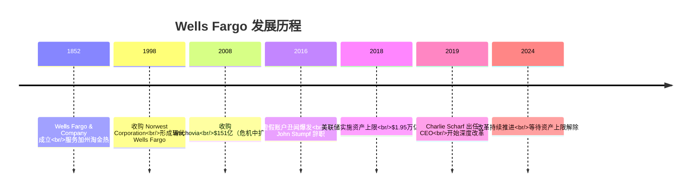
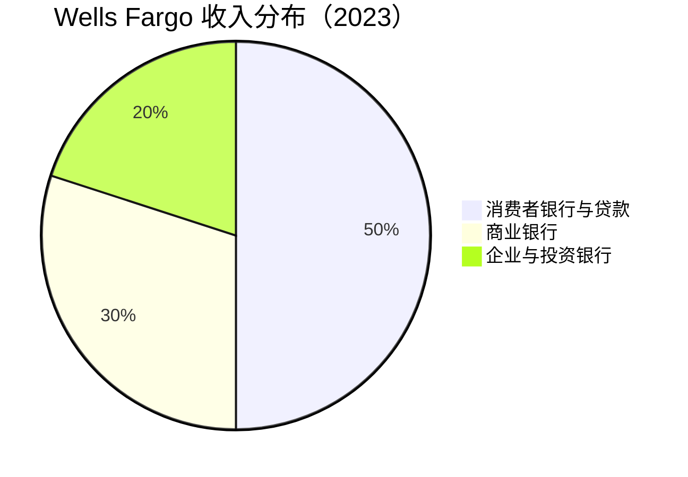
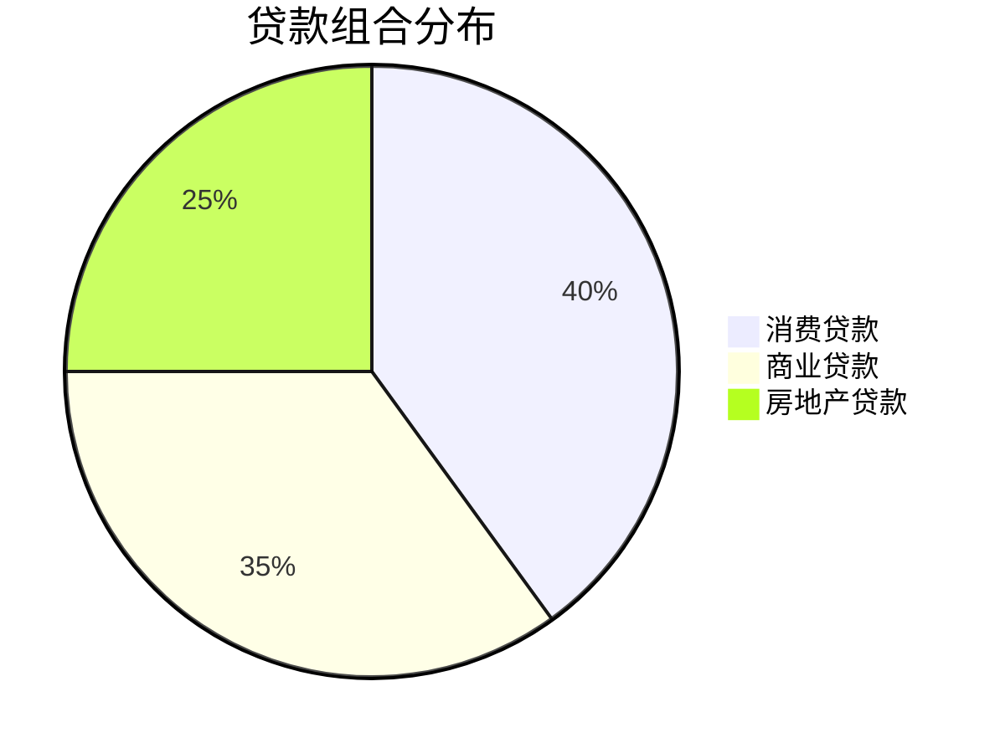

# Wells Fargo 深度分析

## 公司概况

**基本信息**（2024年初）：
- **成立时间**：1852年（加利福尼亚淘金热时期）
- **总部**：加利福尼亚州旧金山
- **CEO**：Charlie Scharf（2019年至今）
- **员工数**：约 23万人
- **总资产**：$1.9万亿
- **市值**：$180亿+
- **标普500排名**：第25位

**股票信息**：
- **代码**：WFC（NYSE）
- **行业分类**：金融服务 - 多元化银行
- **指数成分**：标普500

## 概述

Wells Fargo 是美国第三大银行，也是全球市值最高的银行之一。公司以零售银行业务见长，拥有全美最广泛的分支网络之一。然而，2016年爆发的"虚假账户丑闻"彻底改变了公司命运——美联储史无前例地对其实施资产上限（Asset Cap）限制，至今仍未解除。Charlie Scharf 自2019年接任 CEO 以来，正带领公司进行深度改革，这是一个关于企业文化失败与重建的经典案例。

**学习目标**：
- 理解 Wells Fargo 的零售银行主导模式
- 深入分析虚假账户丑闻的根源与影响
- 评估监管资产上限对业务的制约
- 掌握银行业危机管理与文化重建
- 识别当前投资价值与风险

## 历史沿革

### 关键里程碑

### 2008年金融危机中的表现

与 BofA 不同，Wells Fargo 在 2008年危机中表现相对稳健：

**危机中的机遇**：
- 2008年10月：以$151亿收购 Wachovia（击败花旗）
- 获得东海岸庞大分支网络
- 扩大存款基础
- 接受 TARP 资金 $250亿（2009年偿还）

**危机后地位**：
- 成为全美最大零售银行网络
- 市场份额大幅提升
- 抵押贷款业务全美第一
- 股价恢复领先同业

### 虚假账户丑闻（2016年）

这是美国银行业史上最严重的企业文化失败案例之一。

**丑闻内容**：
- 员工在客户不知情下开设约 350万个虚假账户
- 时间跨度：2002-2016年（超过14年）
- 涉及员工：5,300人被解雇
- 根本原因：激进的交叉销售文化和不合理的绩效考核

**"Eight is Great" 文化**：
- 公司目标：每位客户持有8个产品
- 员工压力：完不成指标面临解雇
- 管理层：对违规行为视而不见
- 结果：系统性欺诈

**监管处罚**：
- 消费者金融保护局（CFPB）：$1亿罚款
- 货币监理署（OCC）：$3,500万罚款
- 洛杉矶市：$5,000万和解
- 后续追加罚款：超过$30亿
- 美联储资产上限（2018年至今）：$1.95万亿

**管理层变动**：
- CEO John Stumpf：辞职，被追缴$4,100万薪酬
- COO Carrie Tolstedt：辞职，被追缴$6,700万薪酬
- 多位高管离职或被追责

### 资产上限的深远影响

美联储2018年实施的资产上限是美国银行业史上最严厉的监管行动之一：

**直接影响**：
- 总资产不得超过$1.95万亿
- 无法通过资产增长扩大业务
- 贷款增长受限
- 市场份额持续流失

**竞争劣势**：
- 竞争对手（JPM、BAC）资产持续增长
- Wells Fargo 被迫缩减部分业务
- 优质贷款机会被迫放弃
- 人才流失加剧

**解除条件**：
- 需向美联储证明风险管理和治理已根本改善
- 需通过独立审查
- 时间表不确定（已超过6年）

## 业务结构

### 三大业务板块

#### 1. 消费者银行与贷款（Consumer Banking & Lending）

**规模**：
- 收入：$280亿
- 利润：$90亿
- 客户：7,000万+
- 分支机构：4,500+
- ATM：12,000+

**主要业务**：

**a. 零售银行**
- 存款：$8,000亿
- 贷款：$3,000亿
- 分支网络：全美最广之一
- 数字用户：3,500万

**b. 抵押贷款**
- 历史上全美第一（现已下滑）
- 贷款余额：$9,000亿
- 市场份额：从 #1 降至 #3
- 受资产上限影响最大

**c. 汽车贷款**
- 贷款余额：$600亿
- 市场份额：Top 5
- 增长受限

**d. 信用卡**
- 发卡量：4,000万张
- 贷款余额：$500亿
- 市场份额：#4

**竞争地位**：
- 分支网络：全美前三
- 抵押贷款：从 #1 跌至 #3
- 数字化：落后竞争对手
- 客户满意度：改善中

#### 2. 商业银行（Commercial Banking）

**规模**：
- 收入：$170亿
- 利润：$70亿
- 客户：中型企业、小企业

**主要业务**：

**a. 中间市场银行**
- 贷款：$2,000亿
- 存款：$3,000亿
- 客户：20,000+

**b. 小企业银行**
- 贷款：$800亿
- 存款：$1,500亿
- 市场份额：领先

**c. 商业地产**
- 贷款：$1,500亿
- 市场份额：Top 5
- 风险敞口：需关注

**竞争优势**：
- 小企业银行：传统强项
- 地区覆盖：广泛
- 关系银行：深厚

#### 3. 企业与投资银行（Corporate & Investment Banking）

**规模**：
- 收入：$110亿
- 利润：$40亿
- 客户：大型企业、机构

**主要业务**：

**a. 投资银行**
- 股票承销：Top 10
- 债券承销：Top 5
- M&A 咨询：Top 10
- 费用收入：$30亿

**b. 市场业务**
- 固定收益：中等规模
- 外汇：区域性
- 大宗商品：有限

**c. 企业银行**
- 大型企业贷款
- 现金管理
- 贸易融资

**竞争地位**：
- 投资银行：中等，落后顶级
- 市场业务：规模较小
- 增长受资产上限制约

## 商业模式分析

### 零售银行主导

Wells Fargo 的核心竞争力历来是零售银行：

**传统优势**：
- 最广泛的分支网络
- 最深厚的社区关系
- 最强的交叉销售能力（丑闻前）
- 最低的资金成本

**丑闻后的变化**：
- 交叉销售文化被迫重建
- 产品销售目标取消
- 客户信任受损
- 市场份额流失

### 资金成本优势

尽管面临挑战，Wells Fargo 仍保持显著的资金成本优势：

**存款基础**：
- 总存款：$1.3万亿
- 零售存款占比：75%+
- 活期存款占比：45%+

**资金成本**：
- 存款成本：0.5%（行业最低之一）
- 综合资金成本：极低
- 净息差潜力：高

**净息差**：
- 2023年：2.8%（行业领先）
- 利率上升受益显著
- 存款重定价慢（优势）

### 效率改善计划

Charlie Scharf 的"效率计划"：

**目标**：
- 年节省成本：$100亿
- 效率比率：从 80% 降至 <60%
- 员工数：从 26万降至 23万
- 分支优化：持续

**进展**（2020-2023）：
- 已实现节省：$80亿
- 效率比率：从 80% 降至 73%
- 员工数：减少约 3万
- 仍有改善空间

## 财务分析

### 盈利能力

**关键指标**（2023年）：

| 指标 | Wells Fargo | JPMorgan | BofA | 行业平均 |
|------|-------------|----------|------|----------|
| ROE | 12% | 17% | 11% | 11% |
| ROA | 1.1% | 1.3% | 0.9% | 1.0% |
| 净息差 | 2.8% | 2.5% | 2.3% | 2.3% |
| 效率比率 | 73% | 55% | 66% | 62% |

**盈利能力分析**：
- 净息差领先：存款结构优势
- ROE 中等：效率拖累
- 改善空间大：效率计划推进
- 资产上限解除后潜力巨大

**ROE 提升路径**：
- 效率比率下降：成本削减
- 净息差维持：存款优势
- 资产上限解除：规模增长
- 资本优化：股东回报

### 资产质量

**贷款组合**（$9,500亿）：

**资产质量指标**：

| 指标 | 2023 | 2022 | 趋势 |
|------|------|------|------|
| 不良贷款率 | 0.7% | 0.5% | ↑ |
| 净冲销率 | 0.5% | 0.3% | ↑ |
| 准备金覆盖率 | 160% | 200% | ↓ |
| 准备金/贷款 | 1.1% | 1.0% | ↑ |

**商业地产风险**：
- 办公楼敞口：$350亿
- 不良率上升：需关注
- 准备金：已增加
- 影响：可控但需监控

### 资本充足性

**资本指标**（2023年末）：

| 指标 | 实际 | 监管要求 | 缓冲 |
|------|------|----------|------|
| CET1 | 11.4% | 10.0% | 1.4% |
| Tier 1 | 12.9% | 11.5% | 1.4% |
| 总资本 | 15.2% | 13.5% | 1.7% |
| 杠杆率 | 8.5% | 5.0% | 3.5% |

**资本管理**：
- 资本充足
- 杠杆率高（资产上限导致）
- 股东回报能力强
- 资产上限解除后可释放资本

### 股东回报

**股息政策**：
- 股息率：2.6%
- 派息率：30-35%
- 季度股息：$0.35/股
- 丑闻后曾大幅削减，现已恢复

**股票回购**：
- 2023年回购：$120亿（积极回购）
- 回购收益率：6%+（高于同业）
- 资产上限下的资本释放方式

**总股东回报**：
- 股息 + 回购：年回报 8-9%（高于同业）
- 股价增长：年回报 5-10%
- 总回报：年回报 13-19%

## 竞争优势分析

### 1. 存款特许经营权

**无可替代的存款基础**：
- 零售存款：$1万亿+
- 活期存款占比：最高之一
- 资金成本：行业最低之一
- 净息差：行业领先

**社区银行根基**：
- 深厚的社区关系
- 品牌认知度高
- 客户粘性强（尽管丑闻影响）

### 2. 分支网络

**全美最广泛网络之一**：
- 分支机构：4,500+
- 覆盖：全美48个州
- 战略位置：优越
- 难以复制

### 3. 净息差优势

**结构性优势**：
- 存款重定价慢
- 活期存款占比高
- 利率上升受益最大
- 净息差 2.8%（行业领先）

### 4. 资产上限解除的期权价值

**潜在催化剂**：
- 资产上限解除后可增长 $5,000亿+
- 贷款增长空间巨大
- 市场份额可恢复
- ROE 可提升至 15%+

### 5. 效率改善空间

**最大的改善潜力**：
- 效率比率 73%（行业最高之一）
- 目标 <60%
- 每降低1%效率比率 ≈ $5亿利润
- 改善空间：$60亿+

## 风险分析

### 1. 资产上限风险

**最大的不确定性**：
- 解除时间不确定
- 美联储要求严格
- 每延迟一年损失约 $20亿利润
- 竞争劣势持续扩大

### 2. 监管风险

**持续的监管压力**：
- 多项监管调查仍在进行
- 合规成本高企
- 声誉风险持续
- 新罚款可能性

### 3. 商业地产风险

**办公楼敞口**：
- 贷款余额：$350亿
- 远程办公趋势影响
- 不良率上升
- 需要持续监控

### 4. 竞争劣势

**市场份额流失**：
- 抵押贷款：从 #1 跌至 #3
- 数字化：落后竞争对手
- 人才流失：持续
- 追赶难度大

### 5. 文化风险

**改革尚未完成**：
- 企业文化重建需要时间
- 员工士气影响
- 客户信任恢复缓慢
- 监管信任重建

## 估值分析

### 当前估值（2024年初）

**市场数据**：
- 股价：$50
- 市值：$180亿
- P/E：10x
- P/B：1.2x
- 股息率：2.6%

### 相对估值

**四大银行对比**：

| 银行 | P/E | P/B | ROE | 净息差 | 效率比率 |
|------|-----|-----|-----|--------|----------|
| JPMorgan | 11x | 1.8x | 17% | 2.5% | 55% |
| Bank of America | 10x | 1.1x | 11% | 2.3% | 66% |
| Wells Fargo | 10x | 1.2x | 12% | 2.8% | 73% |
| Citigroup | 8x | 0.6x | 7% | 2.4% | 78% |

**估值分析**：
- P/B 1.2x：反映改善预期但折价于 JPM
- 净息差最高：存款优势体现
- 效率比率最高：改善空间最大
- 资产上限解除是最大催化剂

### 绝对估值（DCF）

**假设**：
- 当前 EPS：$5.00
- EPS 增长率（资产上限解除前）：5-7%
- EPS 增长率（解除后）：10-15%
- 长期增长率：3%
- 要求回报率：10%

**估值区间**：
- 保守估值（上限不解除）：$42
- 基准估值（2025年解除）：$58
- 乐观估值（2024年解除）：$70

**当前价格**：$50
**上涨空间**：16-40%

### 投资论点

**看多理由**：

1. **资产上限解除期权**
   - 最大催化剂
   - 解除后 ROE 可达 15%+
   - 市场份额可恢复
   - 估值重估空间大

2. **净息差领先**
   - 存款结构优势
   - 利率上升受益最大
   - 净息差 2.8%（行业最高）
   - 利息收入增长强劲

3. **积极股东回报**
   - 回购收益率 6%+（行业最高）
   - 资产上限下的资本释放
   - 股息稳定增长
   - 总回报吸引力强

4. **效率改善空间**
   - 效率比率 73% → 目标 <60%
   - 每年可释放 $50亿+利润
   - Charlie Scharf 执行力强
   - 改善趋势明确

5. **估值合理**
   - P/B 1.2x（相对改善潜力低估）
   - P/E 10x（合理）
   - 资产上限解除后大幅重估

**风险因素**：

1. **资产上限延续**
   - 最大下行风险
   - 每延迟一年损失 $20亿利润
   - 竞争劣势持续扩大

2. **商业地产损失**
   - 办公楼不良率上升
   - 可能需要大额拨备
   - 影响盈利

3. **监管新罚款**
   - 历史问题尚未完全解决
   - 新的合规问题可能出现
   - 声誉持续受损

4. **经济衰退**
   - 信用损失增加
   - 净息差压缩
   - 贷款需求下降

## 投资策略

### 适合投资者类型

**价值投资者**：
- 估值折价于潜在价值
- 改善趋势明确
- 催化剂清晰（资产上限解除）
- 安全边际充足

**事件驱动投资者**：
- 资产上限解除是明确催化剂
- 时间不确定但方向确定
- 潜在回报不对称

**收入投资者**：
- 股息 + 回购总回报高
- 回购收益率行业最高
- 现金流充裕

### 买入时机

**理想买入点**：
- P/B <1.0x
- P/E <9x
- 市场对资产上限过度悲观时

**当前评估**：
- 估值合理
- 可以建仓
- 分批买入
- 等待催化剂

### 持有策略

**卫星持仓**：
- 占金融板块 15-25%
- 占总投资组合 2-4%
- 中长期持有（3-5年）

### 卖出信号

**基本面恶化**：
- 资产上限解除遥遥无期
- 商业地产损失超预期
- 效率改善停滞
- 新的重大合规问题

**估值过高**：
- P/B >1.8x（资产上限解除后）
- P/E >14x
- 改善预期已充分定价

## 与同业对比

### 四大银行定位

| 维度 | Wells Fargo | JPMorgan | BofA | Citigroup |
|------|-------------|----------|------|-----------|
| 核心优势 | 零售存款 | 全面领先 | 财富管理 | 全球网络 |
| 净息差 | 最高 | 高 | 中 | 中 |
| 效率 | 最低 | 最高 | 中 | 低 |
| 改善空间 | 最大 | 小 | 中 | 大 |
| 催化剂 | 资产上限解除 | 持续增长 | 效率提升 | 转型完成 |
| 风险 | 监管 | 低 | 中 | 高 |

### 投资选择建议

**选择 Wells Fargo 的理由**：
- 净息差最高
- 改善空间最大
- 资产上限解除期权价值
- 回购收益率最高

**不选择 Wells Fargo 的理由**：
- 监管不确定性高
- 效率最低
- 竞争劣势持续
- 文化重建未完成

## 关键学习点

1. **企业文化的重要性**
   - 激进的销售文化导致系统性欺诈
   - 短期业绩压力扭曲行为
   - 文化问题比财务问题更难修复
   - 监管信任一旦失去极难恢复

2. **监管风险的长尾效应**
   - 资产上限已持续6年+
   - 监管处罚影响深远
   - 合规文化必须真正改变
   - 监管关系是银行的核心资产

3. **存款特许经营权的价值**
   - 低成本存款是银行最宝贵的资产
   - 净息差优势可持续多年
   - 利率上升环境中价值凸显
   - 难以被金融科技颠覆

4. **危机中的机遇与陷阱**
   - 2008年收购 Wachovia 是机遇
   - 激进扩张埋下文化隐患
   - 规模增长不能以文化为代价

5. **催化剂投资的逻辑**
   - 资产上限解除是明确但不确定的催化剂
   - 等待催化剂需要耐心
   - 不对称回报值得等待

## 常见误区

**误区1：Wells Fargo 已经彻底改变**
- 文化重建需要5-10年
- 监管信任尚未完全恢复
- 资产上限仍在
- 改革仍在进行中

**误区2：资产上限很快就会解除**
- 美联储要求极为严格
- 已超过6年仍未解除
- 时间表高度不确定
- 不应押注具体时间

**误区3：净息差高就代表盈利能力强**
- 效率比率 73% 抵消了净息差优势
- 综合盈利能力仍低于 JPMorgan
- 需要效率改善才能释放潜力

**误区4：回购多就是好事**
- 资产上限下被迫回购（无法增长）
- 回购是资本释放的唯一出路
- 解除后资本将用于业务增长

## 延伸阅读

### 必读资料

1. **Wells Fargo 年报**
2. **美联储资产上限相关文件**
3. **CFPB 调查报告**
4. **Charlie Scharf 投资者日演示**

### 推荐书籍

1. **《Stumpf 的遗产》** - 多位作者（虚假账户丑闻分析）
2. **《银行文化》** - 企业文化与金融风险

## 参考文献

1. Wells Fargo & Company. (2023). "Annual Report"
2. Wells Fargo & Company. (2024). "Q4 2023 Earnings Presentation"
3. Federal Reserve. (2018). "Consent Order - Wells Fargo"
4. CFPB. (2016). "Wells Fargo Enforcement Action"
5. S&P Global Market Intelligence. (2024). "Wells Fargo Analysis"
6. Goldman Sachs. (2024). "Wells Fargo Equity Research"
7. Morgan Stanley. (2024). "US Banks Comparison"
8. McKinsey & Company. (2024). "Banking Transformation Report"
9. Scharf, Charlie. (2023). "Investor Day Presentation"
10. Bloomberg. (2024). "Wells Fargo Company Profile"

---

**下一步学习**：
- 对比 [JPMorgan Chase](jpmorgan-deep.html)
- 对比 [Bank of America](bank-of-america.html)
- 研究 [花旗集团](citigroup.html)
- 了解 [银行业整体](overview.html)
