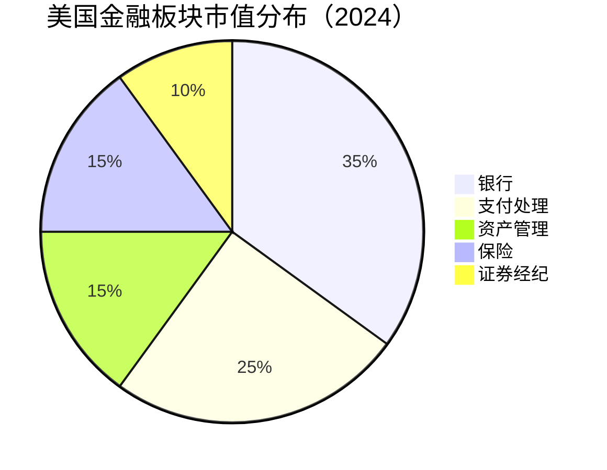
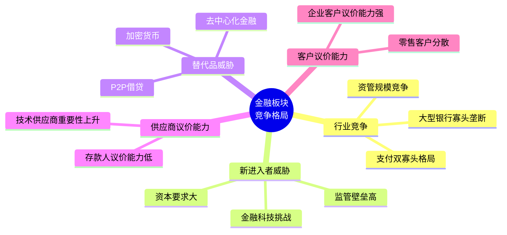
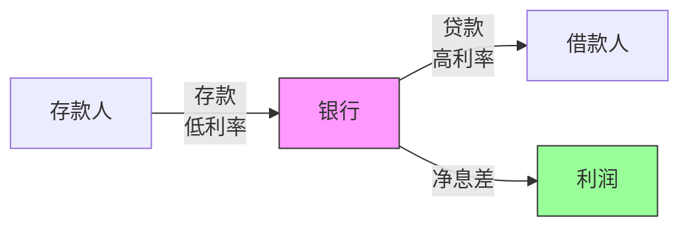
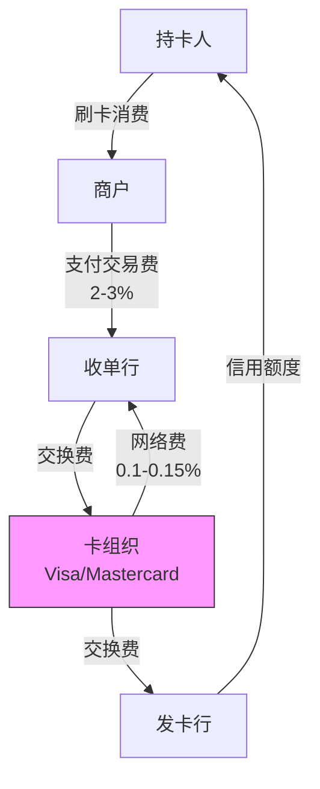
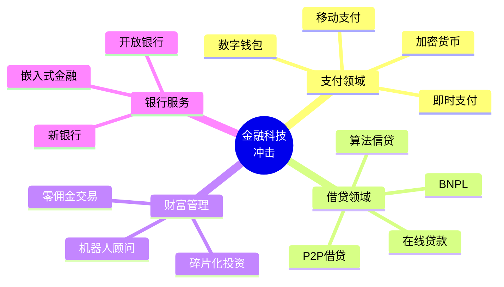

# 美国金融板块总览

## 概述

美国金融服务业是全球最发达、最具影响力的金融体系，占美国 GDP 约 8%，市值占标普 500 指数约 13%。该板块包括银行、保险、资产管理、支付处理、证券交易等多个细分领域，是美国经济的核心支柱和全球金融体系的中枢。

**学习目标**：
- 理解美国金融板块的整体结构和规模
- 掌握各细分领域的商业模式和竞争格局
- 分析金融板块的投资逻辑和估值方法
- 识别金融科技对传统金融的影响
- 评估监管环境对金融机构的影响

## 板块结构与规模

### 市场规模

**关键数据**（2024年初）：
- 板块总市值：约 5.5 万亿美元
- 标普 500 占比：13%
- 就业人数：约 650 万人
- 年收入规模：约 1.8 万亿美元

### 细分领域

#### 1. 商业银行 (Commercial Banking)

**核心业务**：
- 存款业务（零售、企业）
- 贷款业务（消费、商业、房地产）
- 资金管理和现金管理
- 信用卡发行

**主要参与者**：
- JPMorgan Chase（市值 $450B+）
- Bank of America（市值 $250B+）
- Wells Fargo（市值 $180B+）
- Citigroup（市值 $100B+）

**商业模式特点**：
- 净息差（NIM）驱动：贷款利率 - 存款成本
- 规模经济显著
- 监管资本要求严格
- 周期性强，受利率环境影响大

#### 2. 投资银行 (Investment Banking)

**核心业务**：
- 承销（股票、债券发行）
- 并购咨询（M&A Advisory）
- 交易业务（Trading）
- 资产管理

**主要参与者**：
- Goldman Sachs
- Morgan Stanley
- JPMorgan（投行部门）
- Bank of America（投行部门）

**收入特点**：
- 费用驱动型业务
- 波动性大，依赖市场活跃度
- 高杠杆运营
- 人才密集型

#### 3. 支付处理 (Payment Processing)

**核心业务**：
- 信用卡网络运营
- 交易处理和清算
- 跨境支付
- 数字支付解决方案

**主要参与者**：
- Visa（市值 $500B+）
- Mastercard（市值 $380B+）
- American Express（市值 $150B+）
- PayPal（市值 $60B+）

**商业模式特点**：
- 轻资产模式
- 网络效应强
- 高利润率（50%+ 营业利润率）
- 交易量驱动增长

#### 4. 资产管理 (Asset Management)

**核心业务**：
- 共同基金管理
- ETF 管理
- 另类投资（对冲基金、私募股权）
- 财富管理

**主要参与者**：
- BlackRock（AUM $10T+）
- Vanguard（AUM $8T+）
- Fidelity（AUM $4.5T+）
- State Street（AUM $4T+）

**收入模式**：
- 管理费（AUM 的百分比）
- 业绩提成（超额收益分成）
- 规模效应显著

#### 5. 保险 (Insurance)

**细分类型**：
- 财产险（P&C Insurance）
- 人寿险（Life Insurance）
- 健康险（Health Insurance）
- 再保险（Reinsurance）

**主要参与者**：
- Berkshire Hathaway（保险业务）
- Progressive
- Allstate
- MetLife

## 行业竞争格局

### 波特五力分析

### 竞争优势来源

**1. 规模优势**
- 分摊固定成本
- 更低的资金成本
- 更强的议价能力
- 品牌认知度

**2. 网络效应**
- 支付网络的双边市场
- 商户和消费者互相吸引
- 先发优势明显

**3. 监管护城河**
- 严格的牌照要求
- 资本充足率要求
- 合规成本高
- 限制新进入者

**4. 客户粘性**
- 转换成本高
- 关系型业务
- 交叉销售机会
- 数据积累优势

**5. 技术能力**
- 风险管理系统
- 反欺诈技术
- 数据分析能力
- 数字化平台

## 商业模式深度分析

### 银行业商业模式

**传统银行模式**：

**关键指标**：
- **净息差（NIM）**：(利息收入 - 利息支出) / 生息资产
  - 行业平均：2.5-3.5%
  - 优秀银行：3.5-4.5%
- **效率比率**：非利息支出 / 总收入
  - 行业平均：55-65%
  - 优秀银行：<50%
- **资产回报率（ROA）**：净利润 / 总资产
  - 行业平均：0.8-1.2%
  - 优秀银行：1.5%+
- **股本回报率（ROE）**：净利润 / 股东权益
  - 行业平均：8-12%
  - 优秀银行：15%+

**收入结构**：
- 净利息收入：55-65%
- 非利息收入：35-45%
  - 服务费：15-20%
  - 交易收入：10-15%
  - 资产管理费：5-10%
  - 其他：5-10%

### 支付处理商业模式

**双边市场模式**：

**收入来源**：
- **网络费用**：每笔交易固定费用 + 交易额百分比
  - Visa/Mastercard：约 0.1-0.15% 交易额
- **跨境费用**：国际交易额外费用
  - 通常 1% 交易额
- **增值服务**：
  - 数据分析服务
  - 反欺诈服务
  - 营销服务

**关键指标**：
- **交易量增长**：年增长 10-15%
- **营业利润率**：50-60%
- **资本回报率（ROIC）**：30-40%
- **自由现金流转换率**：>90%

### 资产管理商业模式

**费用驱动模式**：

收入 = AUM × 管理费率 + 业绩提成

**费用结构**：
- **被动指数基金**：0.03-0.20%
- **主动股票基金**：0.50-1.50%
- **对冲基金**：2% 管理费 + 20% 业绩提成
- **私募股权**：2% 管理费 + 20% 业绩提成

**关键成功因素**：
- 投资业绩
- 规模效应
- 产品创新
- 分销渠道
- 品牌声誉

## 监管环境

### 主要监管机构

**联邦层面**：
- **美联储（Federal Reserve）**：货币政策、银行监管
- **OCC（货币监理署）**：国民银行监管
- **FDIC（联邦存款保险公司）**：存款保险、银行清算
- **SEC（证券交易委员会）**：证券市场监管
- **CFPB（消费者金融保护局）**：消费者保护

**州层面**：
- 各州银行监管机构
- 保险监管机构

### 关键监管要求

#### 1. 资本充足率要求（Basel III）

**核心一级资本比率（CET1）**：
- 最低要求：4.5%
- 资本保护缓冲：2.5%
- 系统重要性银行附加：1-3.5%
- 实际要求：8-10%

**杠杆率**：
- 最低要求：3%
- 大型银行：5-6%

#### 2. 流动性要求

**流动性覆盖率（LCR）**：
- 高质量流动性资产 / 30天净现金流出 ≥ 100%

**净稳定资金比率（NSFR）**：
- 可用稳定资金 / 所需稳定资金 ≥ 100%

#### 3. 压力测试

**CCAR（综合资本分析与审查）**：
- 年度压力测试
- 评估极端情景下的资本充足性
- 决定股息和回购计划

#### 4. 沃尔克规则（Volcker Rule）

**限制**：
- 禁止自营交易
- 限制对冲基金和私募股权投资
- 保护存款机构

### 监管影响

**正面影响**：
- 提高系统稳定性
- 保护消费者权益
- 限制过度风险承担
- 创造监管护城河

**负面影响**：
- 增加合规成本
- 限制业务灵活性
- 降低杠杆和回报率
- 抑制创新

## 金融科技的影响

### 传统金融面临的挑战

### 主要金融科技趋势

#### 1. 数字支付革命

**新兴参与者**：
- Apple Pay、Google Pay
- Venmo、Cash App
- Square、Stripe
- 加密货币支付

**影响**：
- 降低交易成本
- 提高支付速度
- 改善用户体验
- 威胁传统支付网络

#### 2. 开放银行（Open Banking）

**核心概念**：
- API 开放
- 数据共享
- 第三方创新
- 客户授权

**影响**：
- 增加竞争
- 促进创新
- 降低转换成本
- 挑战客户关系

#### 3. 去中心化金融（DeFi）

**主要应用**：
- 去中心化交易所
- 借贷协议
- 稳定币
- 流动性挖矿

**潜在影响**：
- 降低中介成本
- 提高透明度
- 全球化访问
- 监管挑战

### 传统金融机构的应对

**战略选择**：

1. **自主创新**
   - 投资数字化转型
   - 开发移动应用
   - 升级核心系统

2. **收购整合**
   - 收购金融科技公司
   - 获取技术和人才
   - 快速进入新市场

3. **合作共赢**
   - 与金融科技公司合作
   - 提供基础设施
   - 共享客户资源

4. **生态系统构建**
   - 开放平台
   - API 经济
   - 合作伙伴网络

## 投资分析框架

### 估值方法

#### 1. 市净率（P/B）估值

**适用性**：银行、保险等资产密集型金融机构

**合理区间**：
- 优质银行：1.5-2.5x P/B
- 普通银行：0.8-1.5x P/B
- 困境银行：<0.8x P/B

**影响因素**：
- ROE 水平
- 资产质量
- 增长前景
- 监管环境

#### 2. 市盈率（P/E）估值

**适用性**：支付处理、资产管理等轻资产公司

**合理区间**：
- 支付处理商：25-35x P/E
- 资产管理公司：15-25x P/E
- 传统银行：8-12x P/E

#### 3. 价格/有形账面价值（P/TBV）

**计算**：
P/TBV = 市值 / (账面价值 - 无形资产 - 商誉)

**优势**：
- 排除商誉影响
- 更保守的估值
- 适合并购活跃的公司

### 关键投资指标

**盈利能力**：
- ROE（股本回报率）
- ROA（资产回报率）
- ROIC（投入资本回报率）
- 效率比率

**资产质量**：
- 不良贷款率（NPL Ratio）
- 贷款损失准备金覆盖率
- 净冲销率
- 逾期贷款率

**资本充足性**：
- CET1 比率
- 总资本比率
- 杠杆率
- 有形普通股权益比率

**流动性**：
- 贷存比
- 流动性覆盖率（LCR）
- 净稳定资金比率（NSFR）

**增长性**：
- 贷款增长率
- 存款增长率
- 交易量增长率
- AUM 增长率

### 投资逻辑

#### 看多金融板块的理由

**1. 利率上升周期**
- 净息差扩大
- 利息收入增加
- 银行盈利改善

**2. 经济复苏**
- 贷款需求增加
- 信用质量改善
- 交易活动活跃

**3. 估值吸引**
- 相对其他板块估值较低
- 股息收益率高
- 回购力度大

**4. 监管放松**
- 降低合规成本
- 提高业务灵活性
- 增加股东回报

#### 看空金融板块的风险

**1. 经济衰退**
- 贷款违约增加
- 信用损失上升
- 交易活动下降

**2. 利率风险**
- 利率曲线倒挂
- 净息差压缩
- 资产负债错配

**3. 监管收紧**
- 资本要求提高
- 限制股东回报
- 增加合规成本

**4. 金融科技竞争**
- 市场份额流失
- 利润率下降
- 转型成本高

**5. 系统性风险**
- 金融危机
- 流动性枯竭
- 信心崩溃

## 投资策略建议

### 周期性配置

**经济扩张期**：
- 超配商业银行
- 关注投资银行
- 增持消费金融

**经济衰退期**：
- 低配银行
- 持有支付处理商
- 防御性配置

**利率上升期**：
- 超配银行
- 关注保险公司
- 减持债券基金

**利率下降期**：
- 低配银行
- 增持资产管理
- 关注抵押贷款

### 质量优先策略

**选股标准**：
- ROE > 15%
- CET1 > 12%
- 效率比率 < 55%
- 不良贷款率 < 1%
- 股息收益率 > 2%

**推荐标的**：
- JPMorgan Chase（综合实力最强）
- Visa（支付网络龙头）
- Mastercard（支付网络双寡头）
- BlackRock（资管巨头）

### 价值投资策略

**寻找标准**：
- P/B < 1.2x
- P/E < 10x
- 股息收益率 > 3%
- 资产质量良好
- 暂时困境但基本面稳健

**潜在机会**：
- 区域性银行
- 被低估的大型银行
- 周期底部的投资银行

## 行业展望

### 短期趋势（1-2年）

**1. 利率环境影响**
- 美联储政策路径
- 净息差变化
- 贷款需求波动

**2. 信用周期**
- 商业地产风险
- 消费信贷质量
- 企业违约率

**3. 监管动态**
- 资本要求调整
- 压力测试结果
- 新规则实施

### 中期趋势（3-5年）

**1. 数字化转型**
- 分支机构减少
- 移动银行普及
- 自动化提升

**2. 金融科技整合**
- 传统与新兴融合
- 生态系统竞争
- 技术投资加速

**3. 行业整合**
- 并购活动增加
- 规模效应追求
- 市场集中度提高

### 长期趋势（5-10年）

**1. 商业模式演进**
- 平台化转型
- 嵌入式金融
- 开放银行成熟

**2. 技术革命**
- AI 和机器学习应用
- 区块链技术采用
- 量子计算影响

**3. 监管框架重塑**
- 数字货币监管
- 跨境监管协调
- 系统性风险管理

## 实战应用

### 投资组合构建

**核心持仓（60%）**：
- JPMorgan Chase：20%
- Visa：20%
- Mastercard：20%

**卫星持仓（30%）**：
- Bank of America：10%
- BlackRock：10%
- American Express：10%

**机会持仓（10%）**：
- 区域性银行
- 金融科技公司
- 特殊情况投资

### 风险管理

**分散化**：
- 跨细分领域配置
- 避免过度集中
- 平衡周期性和防御性

**对冲策略**：
- 利率风险对冲
- 信用风险对冲
- 系统性风险对冲

**止损纪律**：
- 设定止损位
- 定期重新评估
- 及时调整仓位

## 常见误区

**误区1：所有金融股都是周期股**
- 支付处理商具有成长股特征
- 资产管理公司相对稳定
- 需要区分不同细分领域

**误区2：高股息就是好投资**
- 需要评估股息可持续性
- 关注派息率和资本充足性
- 高股息可能是价值陷阱

**误区3：忽视监管风险**
- 监管变化影响巨大
- 合规成本持续上升
- 业务模式可能被限制

**误区4：低估金融科技威胁**
- 技术变革加速
- 客户行为改变
- 竞争格局重塑

**误区5：只看估值不看质量**
- 便宜有便宜的原因
- 资产质量至关重要
- 管理层能力决定长期价值

## 延伸阅读

### 必读书籍

1. **《大而不倒》** - Andrew Ross Sorkin
   - 2008 金融危机全景
   - 银行业运作机制
   - 监管与救助

2. **《说谎者的扑克牌》** - Michael Lewis
   - 投资银行文化
   - 交易业务内幕
   - 华尔街生态

3. **《摩根财团》** - Ron Chernow
   - 美国金融史
   - 银行业演进
   - 权力与金融

4. **《The Bank Credit Analysis Handbook》** - Jonathan Golin
   - 银行信用分析
   - 财务报表解读
   - 风险评估方法

5. **《Valuation: Measuring and Managing the Value of Companies》** - McKinsey
   - 金融机构估值
   - DCF 模型应用
   - 价值创造分析

### 研究报告

- 美联储金融稳定报告
- IMF 全球金融稳定报告
- BIS 银行业趋势报告
- 各大投行行业研究报告

### 数据资源

- FDIC 银行数据
- 美联储经济数据（FRED）
- SNL Financial
- Bloomberg Terminal

## 参考文献

1. Federal Reserve. (2024). "Financial Stability Report"
2. Bank for International Settlements. (2024). "Basel III Framework"
3. McKinsey & Company. (2024). "Global Banking Annual Review"
4. Deloitte. (2024). "Banking Industry Outlook"
5. PwC. (2024). "Financial Services Trends"
6. S&P Global Market Intelligence. (2024). "US Banking Sector Analysis"
7. Moody's Analytics. (2024). "Credit Trends in US Banking"
8. Goldman Sachs. (2024). "US Financials Sector Report"
9. JPMorgan Chase. (2023). "Annual Report"
10. Visa Inc. (2023). "Annual Report"
11. Mastercard Inc. (2023). "Annual Report"
12. BlackRock. (2023). "Annual Report"
13. Federal Deposit Insurance Corporation. (2024). "Quarterly Banking Profile"
14. Office of the Comptroller of the Currency. (2024). "Semiannual Risk Perspective"
15. Financial Stability Board. (2024). "Global Systemically Important Banks"

---

**下一步学习**：
- 深入研究 [银行业细分](banks/overview.html)
- 了解 [支付行业](payments/overview.html)
- 分析 [JPMorgan Chase 案例](banks/jpmorgan-deep.html)
- 研究 [Visa 商业模式](payments/visa-deep.html)
