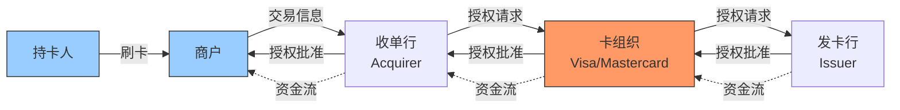
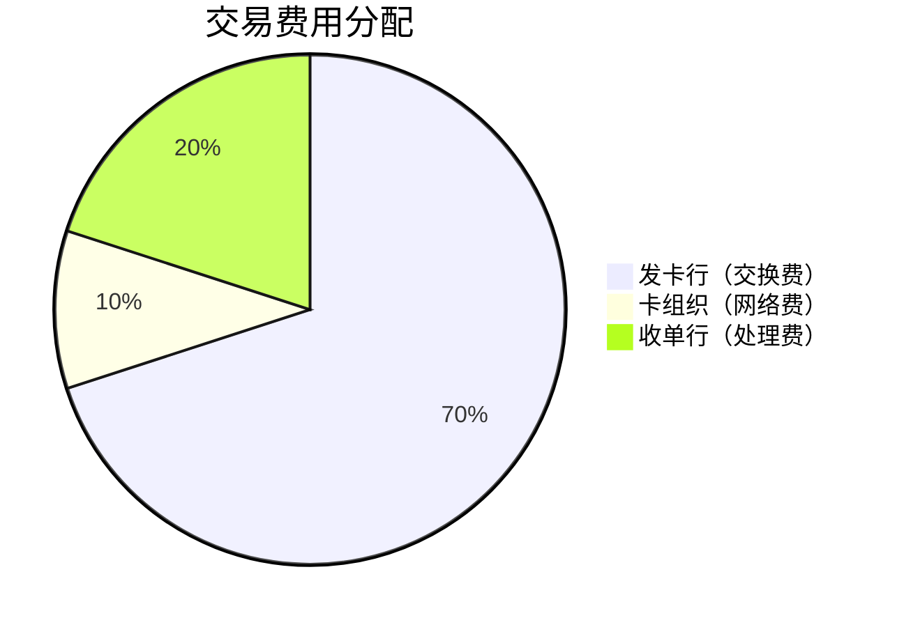

# 美国支付行业深度分析

## 概述

美国支付处理行业是全球最发达、最具创新力的支付生态系统，年交易规模超过 10万亿美元。该行业由 Visa 和 Mastercard 主导的卡组织双寡头格局，以及 PayPal、Square 等新兴数字支付公司共同构成。支付行业具有强大的网络效应、高利润率和稳定增长的特点，是投资者长期关注的优质赛道。

**学习目标**：
- 理解支付行业的生态系统和价值链
- 掌握支付处理的商业模式和盈利来源
- 分析行业竞争格局和护城河
- 评估支付公司的投资价值
- 识别行业趋势和投资机会

## 支付生态系统

### 支付价值链

### 参与方角色

#### 1. 持卡人（Cardholder）
- 消费者或企业
- 使用信用卡/借记卡支付
- 享受便利和奖励

#### 2. 商户（Merchant）
- 接受卡支付
- 支付交易费用（2-3%）
- 获得销售收入

#### 3. 收单行（Acquirer）
- 为商户提供支付服务
- 处理交易
- 承担部分风险
- 主要参与者：Chase Paymentech, Fiserv, FIS

#### 4. 卡组织（Card Network）
- 运营支付网络
- 制定规则和标准
- 处理授权和清算
- 主要参与者：Visa, Mastercard, American Express, Discover

#### 5. 发卡行（Issuer）
- 发行信用卡/借记卡
- 提供信用额度
- 承担信用风险
- 主要参与者：JPMorgan, Bank of America, Citi, Capital One

### 费用分配

**典型交易费用分配**（商户支付 2.5%）：

**费用明细**：
- 发卡行：1.75%（承担信用风险）
- 卡组织：0.25%（网络运营）
- 收单行：0.50%（商户服务）

## 商业模式分析

### 卡组织模式（Visa/Mastercard）

**核心特点**：
- 轻资产模式
- 不承担信用风险
- 不发卡、不收单
- 纯网络运营商

**收入来源**：
1. **服务费**：每笔交易固定费用
2. **数据处理费**：交易额百分比
3. **跨境费用**：国际交易额外费用
4. **增值服务**：数据分析、反欺诈等

**关键指标**：
- 交易量增长：10-15%
- 营业利润率：50-60%
- 自由现金流转换率：>90%
- ROIC：30-40%

### 闭环模式（American Express）

**核心特点**：
- 发卡 + 收单 + 网络
- 承担信用风险
- 控制整个价值链
- 高端客户定位

**优势**：
- 更高利润率
- 更好客户体验
- 更多数据洞察
- 更强品牌控制

**劣势**：
- 承担信用风险
- 资本要求高
- 商户接受度低
- 增长受限

### 数字支付模式（PayPal）

**核心特点**：
- 在线支付平台
- 双边市场
- 账户体系
- 多种支付方式

**收入来源**：
- 交易费用：2.9% + $0.30
- 跨境费用：额外费用
- 增值服务：信贷、理财等

**竞争优势**：
- 用户基础大
- 品牌认知强
- 网络效应
- 技术领先

## 行业竞争格局

### 市场份额

**美国信用卡交易量**（2023）：

| 卡组织 | 市场份额 | 增长率 |
|--------|----------|--------|
| Visa | 60% | 12% |
| Mastercard | 25% | 14% |
| American Express | 10% | 8% |
| Discover | 5% | 6% |

**全球支付网络**：
- Visa：全球 #1
- Mastercard：全球 #2
- 中国银联：中国 #1
- JCB：日本主导

### 竞争优势分析

#### 1. 网络效应

**双边市场**：
- 更多商户 → 吸引更多持卡人
- 更多持卡人 → 吸引更多商户
- 正反馈循环
- 先发优势明显

**规模优势**：
- Visa：40亿张卡，8,000万商户
- Mastercard：30亿张卡，6,000万商户
- 新进入者难以复制

#### 2. 品牌价值

**信任和认知**：
- 全球品牌认知
- 安全可靠形象
- 商户和消费者信任
- 品牌价值数百亿美元

#### 3. 技术领先

**处理能力**：
- Visa：每秒 65,000 笔交易
- 99.999% 可用性
- 全球网络覆盖
- 实时授权

**创新能力**：
- 非接触支付
- 移动支付
- 生物识别
- 区块链探索

#### 4. 监管壁垒

**合规要求**：
- PCI DSS 标准
- 反洗钱（AML）
- 反欺诈系统
- 数据保护

**进入门槛**：
- 技术投资巨大
- 合规成本高
- 网络建设难
- 品牌建立慢

## 行业趋势

### 1. 数字化转型

**移动支付增长**：
- Apple Pay、Google Pay
- 非接触支付普及
- 二维码支付
- 生物识别支付

**影响**：
- 交易便利性提升
- 交易频率增加
- 新的竞争者
- 费率压力

### 2. 跨境支付

**增长驱动**：
- 电商全球化
- 跨境旅游
- 国际汇款
- B2B 支付

**机会**：
- 更高费率
- 增长更快
- 利润率更高

### 3. 实时支付

**技术进步**：
- 即时转账
- 24/7 可用
- 更低成本
- 更好体验

**挑战**：
- 传统模式受冲击
- 费率压力
- 技术投资需求

### 4. 加密货币

**潜在影响**：
- 去中心化支付
- 降低中介成本
- 跨境支付便利
- 监管不确定性

**应对策略**：
- 支持加密货币支付
- 区块链技术应用
- 稳定币探索
- 监管合作

### 5. 监管变化

**开放银行**：
- API 开放
- 数据共享
- 第三方创新
- 竞争加剧

**反垄断关注**：
- 费率监管
- 市场准入
- 竞争政策
- 全球协调

## 投资分析

### 估值方法

**市盈率（P/E）**：
- Visa/Mastercard：25-35x
- PayPal：15-25x
- 传统银行：8-12x

**市销率（P/S）**：
- 卡组织：15-20x
- 数字支付：5-10x

**EV/EBITDA**：
- 卡组织：20-30x
- 数字支付：15-25x

### 关键投资指标

**增长指标**：
- 交易量增长率
- 交易额增长率
- 跨境业务增长
- 新产品渗透率

**盈利指标**：
- 营业利润率
- 自由现金流利润率
- ROIC
- 资本回报率

**运营指标**：
- 每笔交易收入
- 客户获取成本
- 客户终身价值
- 流失率

### 投资逻辑

**看多理由**：

1. **结构性增长**
   - 现金向电子支付转移
   - 电商持续增长
   - 跨境支付增长
   - 新兴市场渗透

2. **商业模式优越**
   - 轻资产
   - 高利润率
   - 强现金流
   - 低资本支出

3. **网络效应**
   - 护城河宽广
   - 竞争优势持续
   - 定价权强
   - 增长可持续

4. **技术领先**
   - 持续创新
   - 数字化转型
   - 新产品开发
   - 生态系统构建

**风险因素**：

1. **监管风险**
   - 费率监管
   - 反垄断调查
   - 数据隐私
   - 跨境监管

2. **竞争加剧**
   - 金融科技挑战
   - 实时支付系统
   - 加密货币
   - 大科技公司进入

3. **技术风险**
   - 网络安全威胁
   - 系统故障
   - 技术过时
   - 创新失败

4. **宏观风险**
   - 经济衰退
   - 消费下降
   - 汇率波动
   - 地缘政治

## 投资策略

### 核心持仓

**Visa + Mastercard**：
- 占支付板块 60-70%
- 长期持有
- 质量最优
- 增长稳定

### 卫星持仓

**PayPal/Square**：
- 占支付板块 20-30%
- 增长更快
- 风险更高
- 估值波动大

### 买入时机

**理想买入点**：
- P/E <25x（Visa/Mastercard）
- P/E <20x（PayPal）
- 市场恐慌时
- 行业调整时

## 关键学习点

1. **网络效应的力量**
   - 双边市场优势
   - 规模经济显著
   - 护城河宽广
   - 长期价值巨大

2. **商业模式的重要性**
   - 轻资产优于重资产
   - 高利润率可持续
   - 现金流质量高
   - 资本效率高

3. **技术创新的价值**
   - 持续创新保持领先
   - 数字化转型必要
   - 生态系统构建重要
   - 用户体验关键

4. **监管的影响**
   - 监管塑造行业格局
   - 合规创造壁垒
   - 政策风险需关注
   - 全球化需协调

## 常见误区

**误区1：支付行业增长见顶**
- 现金仍占比高
- 新兴市场潜力大
- 新场景不断涌现
- 跨境支付增长快

**误区2：金融科技会颠覆传统支付**
- 网络效应难以打破
- 品牌信任重要
- 监管壁垒高
- 合作多于竞争

**误区3：估值太高了**
- 质量值得溢价
- 增长可持续
- 现金流强劲
- 长期回报可观

**误区4：所有支付公司都一样**
- 商业模式差异大
- 风险收益不同
- 需要区分对待

## 延伸阅读

### 推荐书籍

1. **《支付战争》** - Eric Jackson
2. **《The PayPal Wars》** - Eric Jackson
3. **《数字支付革命》** - 多位作者

### 研究资源

- Visa/Mastercard 年报
- 行业研究报告
- 监管机构报告
- 技术趋势分析

## 参考文献

1. Visa Inc. (2023). "Annual Report"
2. Mastercard Inc. (2023). "Annual Report"
3. PayPal Holdings. (2023). "Annual Report"
4. McKinsey & Company. (2024). "Global Payments Report"
5. BCG. (2024). "Digital Payments Landscape"
6. Federal Reserve. (2024). "Payments Study"
7. BIS. (2024). "Payment Systems Report"
8. Goldman Sachs. (2024). "Payments Industry Analysis"
9. Morgan Stanley. (2024). "Fintech and Payments"
10. Nilson Report. (2024). "Card Industry Statistics"

---

**下一步学习**：
- 深入研究 [Visa](visa-deep.html)
- 分析 [Mastercard](mastercard.html)
- 了解 [PayPal](paypal.html)
- 对比 [银行业](../banks/overview.html)

## 高级分析与前沿研究

### 学术研究进展

近年来，学术界对本领域的研究取得了重要进展。以下是几个值得关注的研究方向：

**行为金融学视角**：传统金融理论假设市场参与者是完全理性的，但行为金融学的研究表明，认知偏差和情绪因素在投资决策中扮演着重要角色。诺贝尔经济学奖得主丹尼尔·卡尼曼（Daniel Kahneman）和理查德·塞勒（Richard Thaler）的研究为我们理解市场非理性行为提供了重要框架。

**因子投资研究**：尤金·法玛（Eugene Fama）和肯尼斯·弗伦奇（Kenneth French）的三因子模型，以及后续发展的五因子模型，为系统性地解释股票收益差异提供了理论基础。这些研究表明，市值、账面市值比、盈利能力和投资模式等因子能够解释大部分股票收益的横截面差异。

**市场微观结构研究**：对市场流动性、价格发现机制和交易成本的深入研究，帮助我们更好地理解市场的运作机制，并为优化交易策略提供指导。

### 实战案例深度解析

**案例一：长期价值创造的典范**

以沃伦·巴菲特（Warren Buffett）的伯克希尔·哈撒韦（Berkshire Hathaway）为例，其长达数十年的卓越投资业绩证明了价值投资理念的有效性。从1965年至今，伯克希尔的账面价值年均增长率约为19.8%，远超同期标普500指数的约10.2%年均回报。

巴菲特的成功秘诀在于：
- 专注于具有持久竞争优势的优质企业
- 以合理价格买入，而非追求最低价格
- 长期持有，让复利效应充分发挥
- 保持充足的安全边际，控制下行风险

**案例二：危机中的机遇识别**

2008年金融危机期间，大多数投资者恐慌性抛售，但少数具有前瞻性的投资者却在危机中发现了历史性的投资机会。约翰·保尔森（John Paulson）通过做空次级抵押贷款相关证券，在危机中获得了约150亿美元的利润，成为金融史上最成功的单笔交易之一。

这个案例告诉我们：
- 深入的基本面研究能够发现市场定价错误
- 逆向思维往往能够发现被市场忽视的机会
- 风险管理和仓位控制是成功的关键

### 跨市场比较分析

不同市场在结构、监管、投资者构成等方面存在显著差异，这些差异对投资策略的选择有重要影响：

**美国市场特征**：
- 机构投资者主导，市场效率较高
- 信息披露制度完善，分析师覆盖广泛
- 衍生品市场发达，对冲工具丰富
- 长期牛市历史，但也经历过多次重大调整

**中国市场特征**：
- 散户投资者比例较高，市场波动性较大
- 政策因素影响显著，需要密切关注监管动向
- 新兴行业发展迅速，成长投资机会丰富
- A股、港股、美股中概股形成多层次市场体系

**欧洲市场特征**：
- 价值股比例较高，估值相对保守
- 受地缘政治和欧元区政策影响较大
- 部分行业（如奢侈品、工业）具有全球竞争优势
- ESG投资理念推广较为领先

