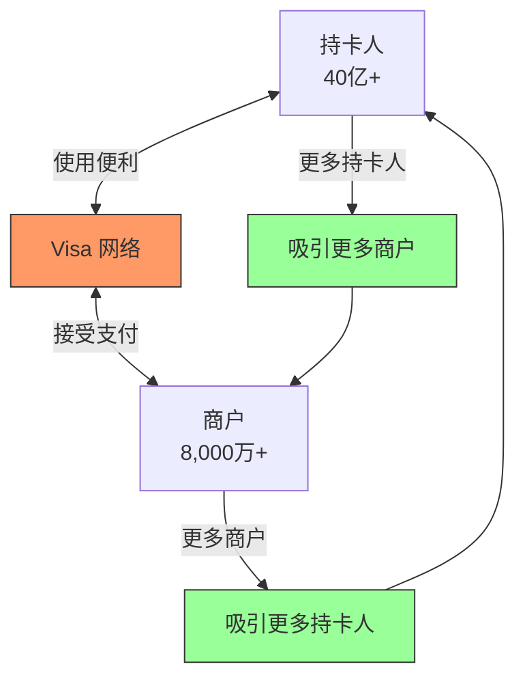

# Visa 深度分析

## 公司概况

**基本信息**（2024年初）：
- **成立时间**：1958年（BankAmericard），2007年（IPO）
- **总部**：加利福尼亚州旧金山
- **CEO**：Ryan McInerney（2023年至今）
- **员工数**：约 26,000人
- **市值**：$500亿+
- **标普500排名**：第10位

**股票信息**：
- **代码**：V（NYSE）
- **行业分类**：金融科技 - 支付处理
- **指数成分**：道琼斯工业平均指数、标普500

## 概述

Visa 是全球最大的支付网络，连接超过 40亿张卡和 8,000万商户，年处理交易额超过 14万亿美元。公司拥有无可匹敌的网络效应、极高的利润率和稳定的增长，是巴菲特和众多价值投资者长期持有的优质资产。Visa 的商业模式被誉为"印钞机"，是研究平台经济和网络效应的经典案例。

**学习目标**：
- 理解 Visa 的轻资产商业模式
- 分析网络效应如何创造护城河
- 评估财务表现和盈利能力
- 掌握投资价值评估方法
- 识别关键风险和机遇

## 商业模式

### 核心定位

**四不原则**：
1. **不发卡**：不承担信用风险
2. **不收单**：不直接服务商户
3. **不放贷**：不提供信贷
4. **不持有资金**：不承担资金风险

**纯网络运营商**：
- 提供支付网络基础设施
- 制定网络规则和标准
- 处理授权和清算
- 提供增值服务

### 收入模式

**四大收入来源**：

1. **服务费（Service Revenues）** - 40%
   - 每笔交易固定费用
   - 与交易量相关
   - 稳定可预测

2. **数据处理费（Data Processing Revenues）** - 35%
   - 交易额的百分比
   - 授权、清算、结算服务
   - 随交易额增长

3. **国际交易费（International Transaction Revenues）** - 20%
   - 跨境交易额外费用
   - 通常 1% 交易额
   - 高利润率

4. **其他收入（Other Revenues）** - 5%
   - 增值服务
   - 许可费
   - 咨询服务

### 成本结构

**极低的成本**：
- 人力成本：30%
- 技术和运营：25%
- 营销和推广：15%
- 管理费用：10%
- 其他：20%

**营业利润率**：65%+（行业最高）

## 网络效应分析

### 双边市场



### 网络效应强度

**规模优势**：
- 全球覆盖：200+ 国家和地区
- 卡片数量：40亿张
- 商户数量：8,000万
- 年交易量：2,500亿笔
- 年交易额：$14万亿

**先发优势**：
- 品牌认知：全球第一
- 网络建立：50+ 年
- 客户粘性：极高
- 转换成本：巨大

**正反馈循环**：
- 更多用户  更多商户  更多用户
- 规模越大  价值越高  规模更大
- 难以打破的循环

## 财务分析

### 收入增长

**历史增长**（2014-2023）：
- 收入 CAGR：11%
- 交易量 CAGR：12%
- 交易额 CAGR：10%
- EPS CAGR：17%

**增长驱动**：
- 现金向电子支付转移
- 电商增长
- 跨境支付增长
- 新兴市场渗透

### 盈利能力

**关键指标**（2023）：

| 指标 | Visa | Mastercard | 行业平均 |
|------|------|------------|----------|
| 营业利润率 | 67% | 58% | 30% |
| 净利润率 | 51% | 46% | 20% |
| ROE | 45% | 150%+ | 15% |
| ROIC | 35% | 40% | 10% |
| FCF 转换率 | 95% | 90% | 70% |

**盈利能力分析**：
- 行业最高利润率
- 轻资产模式
- 规模效应显著
- 定价权强

### 现金流

**自由现金流**：
- 2023年：$180亿
- FCF 利润率：70%+
- 资本支出：<5% 收入
- 现金转换周期：负数

**现金使用**：
- 股息：25%
- 回购：60%
- 并购：10%
- 留存：5%

### 资产负债表

**轻资产特征**：
- 总资产：$870亿
- 无形资产：$280亿（品牌、技术）
- 有形资产：极少
- 负债：适中

**资本结构**：
- 债务：$200亿
- 权益：$450亿
- 债务/权益：0.4x
- 利息覆盖率：30x+

## 竞争优势

### 1. 无可匹敌的网络

**全球第一**：
- 市场份额：60%（美国）
- 品牌价值：$500亿+
- 网络覆盖：最广
- 处理能力：最强

**技术领先**：
- 每秒处理：65,000笔
- 可用性：99.999%
- 延迟：毫秒级
- 安全性：行业标杆

### 2. 品牌价值

**全球认知**：
- 品牌认知度：95%+
- 信任度：最高
- 首选品牌：第一
- 品牌联想：安全、可靠、全球通用

**品牌投资**：
- 年营销支出：$30亿+
- 奥运会赞助
- 世界杯赞助
- 全球活动

### 3. 规模经济

**成本优势**：
- 单笔交易成本：$0.01
- 边际成本：接近零
- 固定成本分摊：最优
- 技术投资：年 $30亿

**定价权**：
- 费率稳定
- 抗通胀能力强
- 议价能力强

### 4. 监管壁垒

**合规优势**：
- PCI DSS 标准制定者
- 反欺诈系统领先
- 数据保护合规
- 全球监管关系

**进入门槛**：
- 技术投资：数十亿美元
- 网络建设：数十年
- 品牌建立：巨额投资
- 监管合规：复杂昂贵

## 增长战略

### 1. 现金替代

**机会**：
- 全球现金占比：40%+
- 美国现金占比：20%
- 新兴市场：60%+
- 渗透空间巨大

**策略**：
- 非接触支付推广
- 移动支付支持
- 小额支付优化
- 商户激励

### 2. 电商增长

**趋势**：
- 电商占零售：15-20%
- 年增长：15%+
- 疫情加速
- 全球化

**优势**：
- 在线支付首选
- 安全性强
- 全球覆盖
- 一键支付

### 3. 跨境支付

**增长**：
- 年增长：20%+
- 费率更高：1%+
- 利润率更高
- 战略重点

**驱动**：
- 跨境电商
- 国际旅游
- 全球化
- 汇款需求

### 4. 新产品

**创新领域**：
- B2B 支付
- 政府支付
- 公共交通
- 加密货币支持

**增值服务**：
- 数据分析
- 反欺诈
- 忠诚度计划
- 咨询服务

### 5. 新兴市场

**潜力**：
- 人口：50亿+
- 电子支付渗透率：<30%
- 增长速度：20%+
- 长期机会

**策略**：
- 本地化产品
- 合作伙伴关系
- 基础设施投资
- 监管合作

## 估值分析

### 当前估值（2024年初）

**市场数据**：
- 股价：$250
- 市值：$500亿
- P/E：30x
- P/S：18x
- EV/EBITDA：25x
- 股息率：0.7%

### 相对估值

**与 Mastercard 对比**：

| 指标 | Visa | Mastercard |
|------|------|------------|
| P/E | 30x | 32x |
| P/S | 18x | 20x |
| 营业利润率 | 67% | 58% |
| 增长率 | 11% | 13% |
| ROE | 45% | 150%+ |

**估值合理性**：
- 略低于 Mastercard
- 反映规模更大、增长稍慢
- 质量溢价合理
- 长期价值显著

### 绝对估值（DCF）

**假设**：
- 当前 EPS：$8.50
- EPS 增长率：10-12%（未来5年）
- 长期增长率：6%
- 要求回报率：9%

**估值区间**：
- 保守估值：$230
- 基准估值：$270
- 乐观估值：$310

**当前价格**：$250
**上涨空间**：8-24%

### 投资论点

**看多理由**：

1. **结构性增长**
   - 现金替代趋势
   - 电商持续增长
   - 跨境支付增长
   - 新兴市场渗透

2. **商业模式卓越**
   - 轻资产
   - 高利润率
   - 强现金流
   - 低资本支出

3. **网络效应**
   - 护城河最宽
   - 竞争优势持续
   - 定价权强
   - 增长可持续

4. **财务表现**
   - 营业利润率 67%
   - ROE 45%
   - FCF 转换率 95%
   - 资本回报率高

5. **管理团队**
   - 战略清晰
   - 执行力强
   - 创新能力
   - 股东友好

**风险因素**：

1. **监管风险**
   - 费率监管
   - 反垄断调查
   - 数据隐私
   - 全球监管协调

2. **竞争风险**
   - 实时支付系统
   - 金融科技挑战
   - 加密货币
   - 大科技公司

3. **技术风险**
   - 网络安全威胁
   - 系统故障
   - 技术过时
   - 创新失败

4. **宏观风险**
   - 经济衰退
   - 消费下降
   - 汇率波动
   - 地缘政治

5. **估值风险**
   - P/E 30x（历史高位）
   - 增长预期高
   - 利率敏感
   - 回调风险

## 投资策略

### 适合投资者类型

**成长投资者**：
- 稳定增长
- 高质量
- 长期持有
- 复利效应

**质量投资者**：
- 最优商业模式
- 最宽护城河
- 最强盈利能力
- 最佳管理团队

**收入投资者**：
- 股息增长稳定
- 派息可持续
- 回购力度大
- 总回报高

### 买入时机

**理想买入点**：
- P/E <25x
- P/S <15x
- 市场恐慌时
- 行业调整时

**当前评估**：
- 估值合理偏高
- 质量值得溢价
- 可以小仓位建仓
- 等待更好时机加仓

### 持有策略

**核心持仓**：
- 占支付板块 40-50%
- 占总投资组合 5-10%
- 长期持有（10年+）
- 复利增长

**再平衡**：
- 估值过高时减仓（P/E >35x）
- 估值合理时加仓（P/E <25x）
- 保持纪律
- 长期视角

### 卖出信号

**基本面恶化**：
- 增长显著放缓
- 利润率下降
- 市场份额流失
- 管理层变动

**估值过高**：
- P/E >40x
- P/S >25x
- 隐含不合理增长

**更好机会**：
- 其他优质资产更便宜
- 风险收益比更优

## 关键学习点

1. **网络效应的威力**
   - 双边市场优势
   - 规模经济显著
   - 护城河难以复制
   - 长期价值巨大

2. **商业模式的重要性**
   - 轻资产优于重资产
   - 高利润率可持续
   - 现金流质量高
   - 资本效率极高

3. **质量的价值**
   - 优质资产值得溢价
   - 长期持有回报高
   - 复利效应强大
   - 时间是朋友

4. **增长的来源**
   - 结构性趋势
   - 市场份额提升
   - 新产品开发
   - 地域扩张

5. **风险管理**
   - 监管风险需关注
   - 技术变革需跟踪
   - 竞争格局需监控
   - 估值纪律需坚持

## 常见误区

**误区1：Visa 增长见顶**
- 现金替代空间大
- 新兴市场潜力大
- 新产品机会多
- 跨境支付增长快

**误区2：估值太高了**
- 质量值得溢价
- 增长可持续
- 现金流强劲
- 长期回报可观

**误区3：金融科技会颠覆 Visa**
- 网络效应难以打破
- 品牌信任重要
- 监管壁垒高
- 合作多于竞争

**误区4：Visa 和 Mastercard 一样**
- 规模差异
- 增长差异
- 战略差异
- 需要区分

**误区5：只看 P/E 估值**
- 需要看 FCF
- 需要看 ROIC
- 需要看增长质量
- 需要看护城河

## 延伸阅读

### 必读资料

1. **Visa 年报**
   - 最全面信息
   - CEO 致股东信
   - 战略规划

2. **投资者日演示**
   - 长期战略
   - 财务目标
   - 管理层问答

3. **季度财报**
   - 最新业绩
   - 趋势变化
   - 管理层展望

### 推荐书籍

1. **《平台革命》** - Geoffrey Parker
2. **《网络效应》** - Andrew Chen
3. **《支付战争》** - Eric Jackson

## 参考文献

1. Visa Inc. (2023). "Annual Report"
2. Visa Inc. (2024). "Q4 2023 Earnings Presentation"
3. McKinsey & Company. (2024). "Global Payments Report"
4. BCG. (2024). "Digital Payments Landscape"
5. Goldman Sachs. (2024). "Visa Equity Research"
6. Morgan Stanley. (2024). "Payments Industry Deep Dive"
7. Federal Reserve. (2024). "Payments Study"
8. BIS. (2024). "Payment Systems Report"
9. Nilson Report. (2024). "Card Industry Statistics"
10. Bloomberg. (2024). "Visa Company Profile"

---

**下一步学习**：
- 对比 [Mastercard](mastercard.html)
- 了解 [PayPal](paypal.html)
- 研究 [支付行业](overview.html)
- 学习 [网络效应](../../../../03-company-analysis/competitive-analysis/economic-moats.html)


## 高级分析与前沿研究

### 学术研究进展

近年来，学术界对本领域的研究取得了重要进展。以下是几个值得关注的研究方向：

**行为金融学视角**：传统金融理论假设市场参与者是完全理性的，但行为金融学的研究表明，认知偏差和情绪因素在投资决策中扮演着重要角色。诺贝尔经济学奖得主丹尼尔·卡尼曼（Daniel Kahneman）和理查德·塞勒（Richard Thaler）的研究为我们理解市场非理性行为提供了重要框架。

**因子投资研究**：尤金·法玛（Eugene Fama）和肯尼斯·弗伦奇（Kenneth French）的三因子模型，以及后续发展的五因子模型，为系统性地解释股票收益差异提供了理论基础。这些研究表明，市值、账面市值比、盈利能力和投资模式等因子能够解释大部分股票收益的横截面差异。

**市场微观结构研究**：对市场流动性、价格发现机制和交易成本的深入研究，帮助我们更好地理解市场的运作机制，并为优化交易策略提供指导。

### 实战案例深度解析

**案例一：长期价值创造的典范**

以沃伦·巴菲特（Warren Buffett）的伯克希尔·哈撒韦（Berkshire Hathaway）为例，其长达数十年的卓越投资业绩证明了价值投资理念的有效性。从1965年至今，伯克希尔的账面价值年均增长率约为19.8%，远超同期标普500指数的约10.2%年均回报。

巴菲特的成功秘诀在于：
- 专注于具有持久竞争优势的优质企业
- 以合理价格买入，而非追求最低价格
- 长期持有，让复利效应充分发挥
- 保持充足的安全边际，控制下行风险

**案例二：危机中的机遇识别**

2008年金融危机期间，大多数投资者恐慌性抛售，但少数具有前瞻性的投资者却在危机中发现了历史性的投资机会。约翰·保尔森（John Paulson）通过做空次级抵押贷款相关证券，在危机中获得了约150亿美元的利润，成为金融史上最成功的单笔交易之一。

这个案例告诉我们：
- 深入的基本面研究能够发现市场定价错误
- 逆向思维往往能够发现被市场忽视的机会
- 风险管理和仓位控制是成功的关键

### 跨市场比较分析

不同市场在结构、监管、投资者构成等方面存在显著差异，这些差异对投资策略的选择有重要影响：

**美国市场特征**：
- 机构投资者主导，市场效率较高
- 信息披露制度完善，分析师覆盖广泛
- 衍生品市场发达，对冲工具丰富
- 长期牛市历史，但也经历过多次重大调整

**中国市场特征**：
- 散户投资者比例较高，市场波动性较大
- 政策因素影响显著，需要密切关注监管动向
- 新兴行业发展迅速，成长投资机会丰富
- A股、港股、美股中概股形成多层次市场体系

**欧洲市场特征**：
- 价值股比例较高，估值相对保守
- 受地缘政治和欧元区政策影响较大
- 部分行业（如奢侈品、工业）具有全球竞争优势
- ESG投资理念推广较为领先


## 实用工具与操作指南

### 分析工具推荐

**数据获取工具**：
- **Bloomberg Terminal**：专业级金融数据平台，提供实时行情、历史数据、新闻资讯等全方位服务，是机构投资者的首选工具
- **Wind资讯（万得）**：中国最权威的金融数据平台，覆盖A股、债券、基金等全市场数据
- **FactSet**：提供全球股票、固定收益、另类投资等多资产类别的综合数据服务
- **免费替代方案**：Yahoo Finance、Google Finance、东方财富、同花顺等提供基础数据服务

**分析软件工具**：
- **Excel/Python**：用于财务模型构建、数据分析和可视化
- **Tableau/Power BI**：用于数据可视化和仪表板创建
- **R语言**：适合统计分析和量化研究

### 实操步骤指南

**第一步：信息收集**
1. 获取目标公司/资产的基本信息和历史数据
2. 收集行业报告和竞争对手数据
3. 整理宏观经济背景信息
4. 查阅相关学术研究和专业分析报告

**第二步：定量分析**
1. 建立财务模型，计算关键指标
2. 进行历史趋势分析
3. 与同行业公司进行横向比较
4. 构建估值模型，计算合理价值区间

**第三步：定性分析**
1. 评估竞争优势和护城河
2. 分析管理层质量和公司治理
3. 识别主要风险因素
4. 评估行业发展趋势

**第四步：综合判断**
1. 整合定量和定性分析结果
2. 进行情景分析（乐观/基准/悲观）
3. 确定投资论点和关键假设
4. 制定投资决策和风险管理方案

### 常见错误与规避方法

| 常见错误 | 产生原因 | 规避方法 |
|---------|---------|---------|
| 过度依赖历史数据 | 忽视结构性变化 | 结合前瞻性分析 |
| 锚定效应 | 过度依赖初始信息 | 定期重新评估假设 |
| 确认偏误 | 只寻找支持观点的证据 | 主动寻找反驳证据 |
| 过度自信 | 高估自身分析能力 | 保持谦逊，设置安全边际 |
| 忽视流动性风险 | 只关注收益不关注风险 | 全面评估风险因素 |


## 扩展参考资料

### 经典著作推荐

**基础理论类**：
1. 本杰明·格雷厄姆（Benjamin Graham）《聪明的投资者》（The Intelligent Investor, 1949）- 价值投资圣经，巴菲特称之为"有史以来最伟大的投资书籍"
2. 菲利普·费雪（Philip Fisher）《怎样选择成长股》（Common Stocks and Uncommon Profits, 1958）- 成长投资经典，强调定性分析的重要性
3. 彼得·林奇（Peter Lynch）《彼得·林奇的成功投资》（One Up on Wall Street, 1989）- 普通投资者如何发现十倍股
4. 霍华德·马克斯（Howard Marks）《投资最重要的事》（The Most Important Thing, 2011）- 橡树资本创始人的投资智慧

**宏观经济类**：
5. 瑞·达里奥（Ray Dalio）《原则》（Principles, 2017）- 桥水基金创始人的生活和工作原则
6. 约翰·梅纳德·凯恩斯（John Maynard Keynes）《就业、利息和货币通论》（The General Theory, 1936）- 现代宏观经济学奠基之作
7. 米尔顿·弗里德曼（Milton Friedman）《货币的祸害》（Money Mischief, 1992）- 货币主义经典著作

**量化投资类**：
8. 伊曼纽尔·德曼（Emanuel Derman）《宽客人生》（My Life as a Quant, 2004）- 量化金融先驱的回忆录
9. 马科维茨（Harry Markowitz）《组合选择》（Portfolio Selection, 1952）- 现代投资组合理论奠基论文

### 权威研究报告

- **美联储经济研究**：https://www.federalreserve.gov/econres.htm
- **国际货币基金组织（IMF）报告**：https://www.imf.org/en/Publications
- **世界银行研究**：https://www.worldbank.org/en/research
- **国际清算银行（BIS）季报**：https://www.bis.org/publ/qtrpdf/
- **中国人民银行货币政策报告**：http://www.pbc.gov.cn

### 在线学习资源

- **Coursera金融课程**：耶鲁大学Robert Shiller的《金融市场》课程
- **MIT OpenCourseWare**：麻省理工学院金融工程相关课程
- **CFA Institute**：特许金融分析师协会的专业学习资源
- **Investopedia**：金融术语和概念的权威解释网站
- **SSRN**：社会科学研究网络，提供大量金融学术论文


## 综合评估框架

### 多维度评估矩阵

在进行全面分析时，需要从多个维度构建系统性的评估框架。以下矩阵提供了一个结构化的分析方法：

**维度一：基本面分析**
- 财务健康状况：资产负债结构、现金流质量、盈利能力趋势
- 业务竞争力：市场份额、定价权、客户粘性
- 管理层质量：战略执行力、资本配置能力、诚信记录
- 行业地位：竞争格局、进入壁垒、替代威胁

**维度二：估值分析**
- 绝对估值：DCF模型、资产重置价值、清算价值
- 相对估值：P/E、P/B、EV/EBITDA与历史均值和同行比较
- 成长性调整：PEG比率、EV/Sales对高成长企业的适用性
- 股息收益率：对价值型投资者的吸引力

**维度三：风险评估**
- 系统性风险：宏观经济、利率、汇率、地缘政治
- 非系统性风险：行业监管、竞争加剧、技术颠覆
- 流动性风险：市场深度、持仓集中度
- 信用风险：债务水平、再融资能力

**维度四：催化剂分析**
- 短期催化剂：季报超预期、新产品发布、并购重组
- 中期催化剂：行业周期转折、政策红利释放
- 长期催化剂：技术革命、人口结构变化、全球化趋势

### 决策树框架

```
投资决策流程
├── 1. 初步筛选
│   ├── 行业吸引力评估
│   ├── 公司基本面初筛
│   └── 估值合理性初判
├── 2. 深度研究
│   ├── 财务报表深度分析
│   ├── 竞争优势评估
│   ├── 管理层访谈/调研
│   └── 行业专家咨询
├── 3. 估值建模
│   ├── 构建DCF模型
│   ├── 相对估值比较
│   └── 情景分析
├── 4. 风险评估
│   ├── 识别主要风险因素
│   ├── 量化风险影响
│   └── 制定风险应对方案
└── 5. 投资决策
    ├── 确定仓位大小
    ├── 设定买入价格区间
    └── 制定退出策略
```

### 投资组合构建原则

在将单个投资标的纳入组合时，需要考虑以下原则：

1. **分散化原则**：不同行业、地区、资产类别的合理分散，降低非系统性风险
2. **相关性管理**：选择低相关性资产，提高组合的风险调整后收益
3. **仓位管理**：根据确信度和风险水平动态调整仓位
4. **再平衡机制**：定期或在偏离目标配置时进行再平衡
5. **流动性管理**：保持适当的现金或高流动性资产比例

