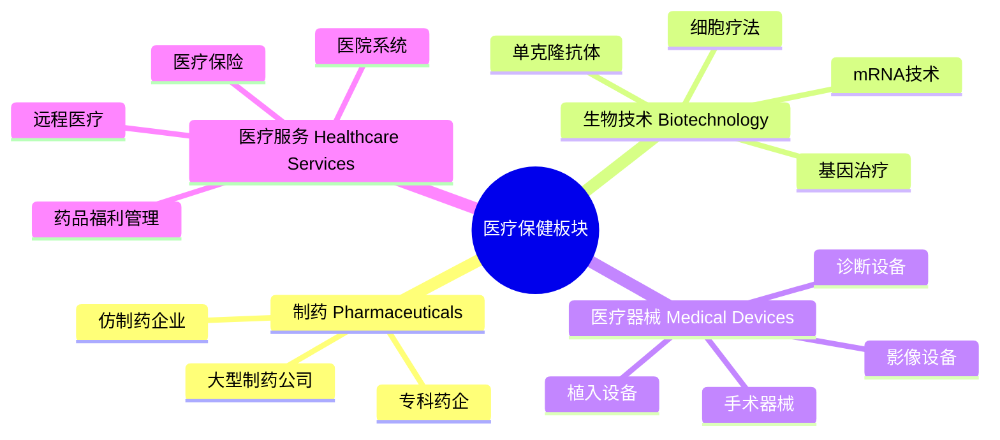
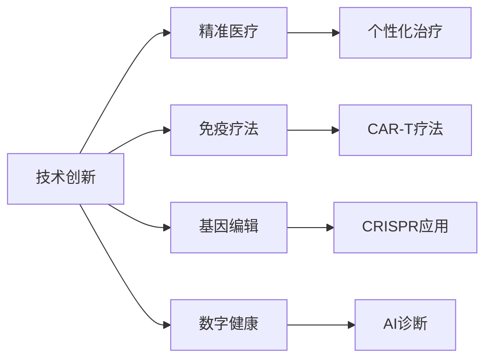

# 美国医疗保健板块总览

## 概述

美国医疗保健板块是全球最大、最创新的医疗健康市场，占美国 GDP 约 18%，市值超过 5 万亿美元。该板块涵盖制药、生物技术、医疗器械、医疗服务等多个细分领域，是长期投资者的重要配置方向。

**学习目标**：
- 理解美国医疗保健行业的整体结构和规模
- 掌握四大细分领域的特点和投资逻辑
- 分析医疗保健板块的增长驱动因素
- 识别行业面临的监管和政策风险
- 评估医疗保健股票的投资价值

**为什么重要**：
医疗保健是防御性成长板块，具有人口老龄化、技术创新、刚性需求等多重增长驱动力，同时受经济周期影响较小，是构建全天候投资组合的重要组成部分。

## 行业结构与规模

### 板块组成

美国医疗保健板块主要包括四大细分领域：

### 市场规模

**整体规模**（2023年数据）：
- 美国医疗支出：4.5 万亿美元
- 占 GDP 比重：18%
- 人均医疗支出：13,500 美元（全球最高）
- 板块总市值：5+ 万亿美元

**细分领域规模**：

| 细分领域 | 市场规模 | 年增长率 | 主要公司数量 |
|---------|---------|---------|------------|
| 制药 | 5,500亿美元 | 5-7% | 200+ |
| 生物技术 | 4,000亿美元 | 8-12% | 500+ |
| 医疗器械 | 4,500亿美元 | 5-6% | 300+ |
| 医疗服务 | 1.2万亿美元 | 6-8% | 100+ |

### 在标普500中的地位

- 权重占比：约 13-15%
- 公司数量：60+ 家
- 代表指数：S&P 500 Healthcare Sector Index
- 市值前三：UnitedHealth、Johnson & Johnson、Eli Lilly

## 四大细分领域分析

### 1. 制药行业 (Pharmaceuticals)

**核心特征**：
- 高研发投入（收入的 15-20%）
- 专利保护期（通常 10-15 年有效期）
- 监管严格（FDA 审批流程）
- 稳定现金流和高毛利率（70-80%）

**商业模式**：
1. **研发驱动**：新药开发周期 10-15 年
2. **专利保护**：独家销售期带来高利润
3. **专利悬崖**：专利到期后面临仿制药竞争
4. **并购整合**：通过收购补充产品线

**投资亮点**：
- 稳定的股息收益（股息率 2-4%）
- 防御性特征（需求刚性）
- 创新药物带来的增长潜力
- 全球化销售网络

**主要风险**：
- 药品定价压力
- 专利到期风险
- 研发失败风险
- 监管政策变化

**代表公司**：
- Pfizer（辉瑞）：全球最大制药公司之一
- Johnson & Johnson：多元化医疗健康巨头
- Merck（默克）：疫苗和肿瘤药物领导者
- Bristol Myers Squibb：肿瘤和免疫领域专家

### 2. 生物技术行业 (Biotechnology)

**核心特征**：
- 前沿科技应用（基因编辑、细胞疗法、mRNA）
- 高风险高回报
- 临床试验成功率低（约 10%）
- 估值波动大

**技术前沿**：
1. **mRNA 技术**：COVID-19 疫苗验证了平台价值
2. **基因编辑**：CRISPR 技术革命性突破
3. **CAR-T 疗法**：癌症治疗新方向
4. **单克隆抗体**：精准靶向治疗

**商业模式**：
- 早期：烧钱研发，无收入
- 中期：临床试验，寻求合作
- 成熟期：产品上市，快速增长或被收购

**投资特点**：
- 成长性强：成功产品带来爆发式增长
- 波动性大：临床数据驱动股价剧烈波动
- 催化剂明确：FDA 审批、临床数据发布
- 并购活跃：大药企频繁收购创新生物技术公司

**代表公司**：
- Moderna：mRNA 技术平台领导者
- Illumina：基因测序设备龙头
- Vertex Pharmaceuticals：囊性纤维化治疗专家
- Regeneron：单克隆抗体技术领先者

### 3. 医疗器械行业 (Medical Devices)

**核心特征**：
- 产品周期长（设备使用寿命 5-10 年）
- 技术迭代稳定
- 监管相对宽松（相比药品）
- 利润率中等（毛利率 50-70%）

**产品分类**：
1. **诊断设备**：血糖仪、检测仪器
2. **手术器械**：微创手术工具、机器人手术系统
3. **植入设备**：心脏起搏器、人工关节
4. **影像设备**：CT、MRI、超声设备

**商业模式**：
- 设备销售 + 耗材收入（剃刀-刀片模式）
- 长期服务合同
- 技术升级换代

**投资亮点**：
- 稳定增长：人口老龄化带来持续需求
- 技术创新：微创化、智能化趋势
- 全球扩张：新兴市场增长潜力
- 现金流稳定：适合长期持有

**代表公司**：
- Medtronic：心血管和神经设备领导者
- Abbott Laboratories：诊断和医疗设备多元化巨头
- Intuitive Surgical：达芬奇手术机器人制造商
- Stryker：骨科和手术设备专家

### 4. 医疗服务行业 (Healthcare Services)

**核心特征**：
- 规模经济显著
- 监管复杂（医保政策影响大）
- 整合趋势明显
- 现金流强劲

**业务类型**：
1. **医疗保险**：管理式医疗、Medicare Advantage
2. **医院系统**：综合医院、专科医院
3. **药品福利管理 (PBM)**：处方药管理和谈判
4. **远程医疗**：在线问诊、健康管理

**商业模式**：
- 保险业务：保费收入 - 医疗支出 = 承保利润
- PBM 业务：药品采购差价 + 管理费
- 医院业务：医疗服务收费

**投资亮点**：
- 防御性强：需求稳定
- 规模优势：大型企业议价能力强
- 政策受益：Medicare Advantage 快速增长
- 数字化转型：远程医疗渗透率提升

**主要风险**：
- 政策风险：医保改革、药价控制
- 医疗成本上升：压缩利润空间
- 竞争加剧：行业整合带来竞争

**代表公司**：
- UnitedHealth Group：美国最大医疗保险公司
- CVS Health：药店 + 保险 + PBM 综合体
- HCA Healthcare：最大营利性医院系统
- Teladoc Health：远程医疗领导者

## 增长驱动因素

### 1. 人口老龄化

**趋势数据**：
- 65 岁以上人口占比：2020 年 16% → 2030 年预计 21%
- 婴儿潮一代（1946-1964）进入老年
- 老年人医疗支出是年轻人的 3-5 倍

**影响**：
- 慢性病管理需求增加
- 医疗器械需求上升（关节置换、心脏设备）
- 长期护理服务需求增长
- Medicare 支出持续增加

### 2. 技术创新

**突破性技术**：

**创新领域**：
1. **精准医疗**：基于基因组学的个性化治疗
2. **免疫疗法**：PD-1/PD-L1 抑制剂、CAR-T
3. **基因编辑**：CRISPR 治疗遗传病
4. **数字健康**：AI 辅助诊断、可穿戴设备
5. **再生医学**：干细胞治疗、组织工程

**投资机会**：
- 创新药物带来的高增长
- 新技术平台的长期价值
- 早期投资高风险高回报

### 3. 慢性病增长

**主要慢性病**：
- 糖尿病：美国患者 3,700 万（11% 人口）
- 心血管疾病：第一大死因
- 癌症：第二大死因
- 阿尔茨海默病：老年人群高发

**市场机会**：
- 长期用药需求（糖尿病、高血压）
- 医疗器械需求（血糖监测、心脏设备）
- 慢病管理服务
- 创新疗法（肿瘤免疫、阿尔茨海默新药）

### 4. 医疗支出增长

**支出趋势**：
- 年均增长率：5-6%（高于 GDP 增速）
- 2030 年预计达到 6.2 万亿美元
- 人均支出持续上升

**驱动因素**：
- 人口老龄化
- 新技术应用（成本高）
- 慢性病患病率上升
- 医疗服务价格上涨

## 监管与政策环境

### FDA 监管体系

**药品审批流程**：
1. **临床前研究**：动物实验（1-3 年）
2. **临床 I 期**：安全性测试（1-2 年）
3. **临床 II 期**：有效性初步验证（2-3 年）
4. **临床 III 期**：大规模验证（2-4 年）
5. **NDA 申请**：新药申请审批（1-2 年）
6. **上市后监测**：IV 期临床

**审批时间**：
- 标准审批：10-12 个月
- 优先审批：6 个月
- 突破性疗法：加速通道
- 孤儿药：特殊激励政策

### 医保政策

**Medicare & Medicaid**：
- Medicare：65 岁以上老年人（6,400 万人）
- Medicaid：低收入人群（8,000 万人）
- 政府医保支出：1.4 万亿美元/年

**政策影响**：
- 药品定价谈判：IRA 法案允许 Medicare 谈判药价
- 报销政策：影响新药和新设备的市场准入
- Medicare Advantage：私营保险公司参与机会

### 药品定价压力

**定价争议**：
- 美国药价全球最高
- 政治压力：两党都支持降低药价
- 透明度要求：药企需披露定价信息

**应对策略**：
- 药企：强调研发成本和创新价值
- 折扣和返利：实际价格低于标价
- 患者援助计划：降低自付费用

## 投资分析框架

### 估值方法

**制药公司估值**：
1. **DCF 模型**：
   - 预测产品线现金流
   - 考虑专利到期影响
   - 研发管线价值评估

2. **相对估值**：
   - P/E：10-20x（成熟药企）
   - EV/EBITDA：8-15x
   - P/S：3-6x

**生物技术公司估值**：
1. **rNPV 模型**：
   - 风险调整净现值
   - 考虑临床成功概率
   - 峰值销售预测

2. **市值/峰值销售**：
   - 早期：5-10x
   - 后期：2-5x

**医疗器械估值**：
- P/E：20-30x
- EV/EBITDA：15-25x
- 增长溢价：创新产品享受高估值

**医疗服务估值**：
- P/E：15-25x
- P/B：2-4x（保险公司）
- 关注医疗成本率（MCR）

### 关键指标

**制药公司**：
- 研发管线：在研药物数量和阶段
- 专利到期：未来 5 年专利悬崖
- 销售增长：有机增长 vs 并购增长
- 毛利率：70-80% 为健康水平

**生物技术公司**：
- 现金跑道：现金可支撑时间
- 临床进展：试验结果和时间表
- 合作协议：大药企合作验证价值
- 烧钱率：季度现金消耗

**医疗器械公司**：
- 产品组合：创新产品占比
- 地域分布：新兴市场增长
- 研发效率：R&D/收入比例
- 运营利润率：20-30% 为优秀

**医疗服务公司**：
- 会员增长：保险会员数量
- 医疗成本率：医疗支出/保费收入
- 运营利润率：5-8%
- 现金流：自由现金流/净利润

## 投资策略

### 防御性配置

**适合投资者**：
- 风险厌恶型
- 退休人群
- 寻求稳定股息

**选股标准**：
- 大型制药公司（强生、辉瑞）
- 医疗器械龙头（美敦力、雅培）
- 医疗保险巨头（联合健康）

**特点**：
- 股息率 2-4%
- 贝塔系数 < 1
- 经济衰退中表现相对稳定

### 成长性配置

**适合投资者**：
- 风险承受能力强
- 长期投资视角
- 追求高回报

**选股标准**：
- 创新生物技术公司
- 突破性疗法开发商
- 数字健康领军者

**特点**：
- 高增长潜力（年化 20%+）
- 高波动性
- 催化剂驱动（临床数据、FDA 审批）

### 主题投资

**热门主题**：
1. **肿瘤免疫疗法**：PD-1/PD-L1、CAR-T
2. **阿尔茨海默病**：新药突破（Leqembi）
3. **GLP-1 减肥药**：Ozempic、Wegovy
4. **基因编辑**：CRISPR 临床应用
5. **数字健康**：远程医疗、AI 诊断

### 风险管理

**分散化策略**：
- 跨细分领域配置（制药、生物技术、器械、服务）
- 大盘股 + 中小盘股组合
- 成熟产品 + 创新管线平衡

**风险监控**：
- 政策风险：关注医改动态
- 专利风险：跟踪专利到期时间表
- 临床风险：监测关键试验进展
- 估值风险：避免追高

## 板块表现与周期性

### 历史表现

**长期回报**（1990-2023）：
- 年化回报率：11-12%
- 跑赢标普 500：约 1-2%
- 波动率：低于科技板块，高于公用事业

**经济周期表现**：
- 衰退期：防御性强，相对抗跌
- 复苏期：表现中等
- 繁荣期：落后于周期性板块
- 滞胀期：受益于定价权

### 与市场相关性

**贝塔系数**：
- 大型制药：0.6-0.8
- 生物技术：1.0-1.3
- 医疗器械：0.8-1.0
- 医疗服务：0.7-0.9

**相关性分析**：
- 与标普 500 相关性：0.7-0.8
- 与债券相关性：低
- 与黄金相关性：低
- 适合作为投资组合分散化工具

## 未来展望

### 2024-2030 趋势

**技术趋势**：
1. **AI 在药物研发的应用**：缩短研发周期
2. **mRNA 平台扩展**：癌症疫苗、罕见病治疗
3. **基因编辑临床化**：更多 CRISPR 疗法获批
4. **数字疗法**：软件作为医疗器械（SaMD）
5. **精准医疗普及**：基因检测成本下降

**市场趋势**：
1. **并购整合**：大药企收购创新生物技术公司
2. **垂直整合**：保险公司收购医疗服务提供商
3. **全球化**：新兴市场增长加速
4. **专科化**：专注特定疾病领域的公司崛起

**政策趋势**：
1. **药价改革**：持续的定价压力
2. **医保扩张**：Medicare Advantage 增长
3. **监管创新**：加速审批创新疗法
4. **数据隐私**：健康数据保护法规

### 投资机会

**短期机会**（1-2 年）：
- GLP-1 减肥药市场爆发
- 阿尔茨海默新药放量
- COVID-19 后医疗服务需求反弹

**中期机会**（3-5 年）：
- 肿瘤免疫疗法组合应用
- 基因编辑首批产品商业化
- 数字健康渗透率提升

**长期机会**（5-10 年）：
- 衰老相关疾病治疗突破
- 再生医学临床应用
- AI 驱动的药物发现革命

## 实战应用

### 构建医疗保健投资组合

**核心-卫星策略**：

**核心持仓（60-70%）**：
- 大型制药：Johnson & Johnson、Pfizer
- 医疗器械：Medtronic、Abbott
- 医疗服务：UnitedHealth Group

**卫星持仓（30-40%）**：
- 创新生物技术：Moderna、Vertex
- 成长型器械：Intuitive Surgical
- 主题 ETF：ARK Genomic Revolution ETF

### 选股检查清单

**制药公司**：
- [ ] 研发管线：至少 5 个后期临床项目
- [ ] 专利保护：未来 5 年无重大专利到期
- [ ] 财务健康：净负债/EBITDA < 3x
- [ ] 股息：连续 10 年以上派息记录
- [ ] 估值：P/E < 行业平均

**生物技术公司**：
- [ ] 技术平台：差异化的技术优势
- [ ] 临床进展：关键试验达到主要终点
- [ ] 现金跑道：> 2 年运营资金
- [ ] 管理团队：成功开发药物的经验
- [ ] 市场潜力：峰值销售 > 10 亿美元

**医疗器械公司**：
- [ ] 产品创新：近 3 年推出新产品
- [ ] 市场地位：细分领域前三
- [ ] 国际化：海外收入 > 40%
- [ ] 利润率：运营利润率 > 20%
- [ ] 增长：有机增长 > 5%

**医疗服务公司**：
- [ ] 会员增长：年增长 > 5%
- [ ] 成本控制：MCR 改善趋势
- [ ] 规模优势：行业前五
- [ ] 数字化：投资远程医疗和 AI
- [ ] 现金流：强劲的自由现金流

### 常见错误

**错误 1：忽视政策风险**
- 问题：医疗保健受政策影响大
- 教训：关注选举年和医改动态
- 应对：分散投资，避免过度集中

**错误 2：追逐热点**
- 问题：生物技术股波动大，容易追高
- 教训：等待回调，分批建仓
- 应对：设定估值纪律，不追高

**错误 3：低估研发风险**
- 问题：临床试验失败率高
- 教训：单一生物技术股风险极大
- 应对：通过 ETF 或多只股票分散

**错误 4：忽视专利到期**
- 问题：专利悬崖导致收入大幅下降
- 教训：研究专利到期时间表
- 应对：评估新产品能否弥补损失

## 延伸阅读

### 推荐书籍

1. **《医药投资圣经》** - Brad Loncar
   - 生物技术投资入门指南
   - 临床试验解读方法

2. **《The Innovator's Prescription》** - Clayton Christensen
   - 医疗行业颠覆性创新
   - 商业模式变革

3. **《Pharma: Greed, Lies, and the Poisoning of America》** - Gerald Posner
   - 制药行业历史和争议
   - 批判性视角

4. **《The Patient Will See You Now》** - Eric Topol
   - 数字健康革命
   - 患者赋权趋势

### 研究资源

**行业报告**：
- IQVIA Institute Reports：医药行业权威数据
- EvaluatePharma：药品销售预测
- Bain Healthcare Reports：战略咨询视角

**监管信息**：
- FDA.gov：药品和器械审批信息
- ClinicalTrials.gov：临床试验数据库
- CMS.gov：Medicare 政策和数据

**投资研究**：
- Morningstar Healthcare Reports
- Leerink Partners Research
- SVB Securities Healthcare Analysis

**新闻媒体**：
- STAT News：生物技术新闻
- FiercePharma：制药行业动态
- MedTech Dive：医疗器械新闻

### 相关课程

1. **Coursera: Healthcare Innovation and Entrepreneurship**
   - 斯坦福大学
   - 医疗创新和商业化

2. **edX: Principles of Drug Development**
   - MIT
   - 药物开发流程

3. **Udemy: Biotech Investing Masterclass**
   - 生物技术投资实战

## 参考文献

1. Centers for Medicare & Medicaid Services. (2023). *National Health Expenditure Data*.
2. FDA. (2023). *Drug Approval Process*.
3. IQVIA Institute. (2023). *Global Medicine Spending and Usage Trends*.
4. S&P Dow Jones Indices. (2023). *S&P 500 Healthcare Sector Performance*.
5. Evaluate Pharma. (2023). *World Preview 2023, Outlook to 2028*.
6. McKinsey & Company. (2023). *The Future of Healthcare*.
7. Deloitte. (2023). *2024 Global Healthcare Outlook*.
8. PwC. (2023). *Medical Cost Trend: Behind the Numbers 2024*.
9. Boston Consulting Group. (2023). *Biopharma Innovation Trends*.
10. J.P. Morgan. (2023). *Healthcare Equity Research*.

---

**下一步学习**：
- 深入学习 [制药行业分析](./pharmaceuticals/overview.html)
- 探索 [生物技术投资](./biotech/overview.html)
- 研究 [医疗器械行业](overview.html)
- 了解 [医疗服务模式](overview.html)
