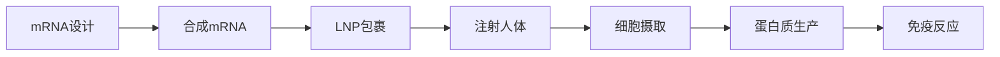

# Moderna案例研究

## 公司概况

**基本信息**：
- 成立时间：2010年
- 总部：马萨诸塞州剑桥，美国
- 创始人：Derrick Rossi, Robert Langer, Kenneth Chien
- CEO：Stéphane Bancel（2011年至今）
- 员工数：约3,900人（2023）
- 上市信息：NASDAQ: MRNA（2018年IPO）

**2023年财务数据**：
- 总收入：67亿美元
- 净利润：-46亿美元（亏损）
- 研发支出：48亿美元（占收入72%）
- 市值：约400亿美元（2024年1月）
- 现金储备：130亿美元

**核心技术**：
- mRNA平台技术
- 脂质纳米颗粒（LNP）递送系统
- 48个在研项目
- 6大治疗领域

## mRNA技术平台

### 技术原理

**mRNA工作机制**：

**核心优势**：
1. **快速开发**：设计到生产仅需数周
2. **灵活性**：可针对任何蛋白质
3. **安全性**：不整合基因组
4. **可扩展**：标准化生产流程

### 平台应用领域

**1. 疫苗（Prophylactic Vaccines）**：
- COVID-19：Spikevax（已上市）
- 流感：季节性和大流行流感
- RSV：呼吸道合胞病毒
- CMV：巨细胞病毒
- HIV：艾滋病疫苗

**2. 肿瘤疫苗（Cancer Vaccines）**：
- 个性化癌症疫苗（mRNA-4157）
- 与Merck合作开发
- 黑色素瘤III期临床
- 其他实体瘤

**3. 罕见病（Rare Diseases）**：
- 丙酸血症（PA）
- 甲基丙二酸血症（MMA）
- 苯丙酮尿症（PKU）
- 糖原贮积病

**4. 心血管疾病**：
- 心力衰竭
- 心肌梗死后修复
- VEGF治疗

**5. 自身免疫疾病**：
- 多发性硬化症
- 系统性红斑狼疮

**6. 传染病**：
- 寨卡病毒
- 尼帕病毒
- 其他新发传染病

## COVID-19疫苗成功

### Spikevax开发

**时间线**：
- 2020年1月：获得病毒序列
- 2020年2月：完成疫苗设计（42天）
- 2020年3月：临床I期启动
- 2020年11月：III期数据（94.1%有效率）
- 2020年12月：FDA紧急使用授权
- 2021年1月：WHO紧急使用清单

**商业成功**：
- 2021年收入：177亿美元
- 2022年收入：193亿美元
- 2023年收入：67亿美元
- 累计销售：437亿美元+
- 接种剂量：10亿剂+

**技术验证**：
- 证明mRNA平台可行性
- 建立生产能力
- 获得监管认可
- 积累临床数据

### 后COVID转型

**挑战**：
- 疫苗需求暴跌：2023年收入下降65%
- 竞争加剧：多家mRNA疫苗
- 定价压力：商业市场价格低
- 盈利能力：2023年亏损46亿美元

**转型策略**：
1. **多元化管线**：推进非COVID产品
2. **成本控制**：优化运营效率
3. **战略合作**：与大药企合作
4. **平台扩展**：新技术应用

## 研发管线

### 近期商业化产品

**1. RSV疫苗（mRNA-1345）**：
- 适应症：60岁以上成人RSV预防
- 状态：2024年FDA批准预期
- 市场潜力：20-30亿美元/年
- 竞争：Pfizer、GSK已上市

**2. 流感疫苗（mRNA-1010）**：
- 适应症：季节性流感
- 状态：III期临床
- 优势：更高效力，快速更新
- 市场潜力：30-50亿美元/年

**3. COVID+流感组合疫苗（mRNA-1083）**：
- 适应症：同时预防COVID和流感
- 状态：III期临床
- 优势：便利性，提高接种率
- 市场潜力：50亿美元+/年

### 中期管线

**肿瘤疫苗（mRNA-4157/V940）**：
- 与Merck合作
- 适应症：黑色素瘤辅助治疗
- 状态：III期临床（KEYNOTE-942）
- 机制：个性化新抗原疫苗
- 潜力：革命性癌症治疗

**CMV疫苗（mRNA-1647）**：
- 适应症：巨细胞病毒预防
- 状态：III期临床
- 市场：孕妇和免疫抑制患者
- 潜力：10-20亿美元/年

**罕见病项目**：
- PA（丙酸血症）：III期
- MMA（甲基丙二酸血症）：II期
- 市场：小但高价值

### 早期创新

**下一代技术**：
- 自我扩增RNA（saRNA）
- 环状RNA（circRNA）
- 新型LNP递送系统
- AI辅助设计

## 商业模式

### 收入模式

**产品销售**：
- COVID疫苗：主要收入来源
- 未来产品：RSV、流感等
- 定价策略：创新溢价

**合作收入**：
- Merck：肿瘤疫苗合作
- 其他合作：技术授权
- 里程碑付款：研发进展

**政府合同**：
- BARDA：生物防御
- 战略储备：大流行准备
- 研发资助：早期项目

### 成本结构

**研发投入**：
- 2023年：48亿美元（72%收入）
- 48个在研项目
- 平台技术投资
- 临床试验成本

**生产成本**：
- 自有产能：马萨诸塞州、瑞士
- 合同生产：外包部分产能
- 规模经济：产量提升降成本

**销售管理**：
- 商业团队建设
- 市场准入投资
- 品牌建设

## 竞争分析

### 主要竞争对手

**mRNA疫苗**：
- **Pfizer/BioNTech**：
  - 优势：先发优势，全球网络
  - 劣势：依赖BioNTech技术
  
- **CureVac**：
  - 优势：欧洲基地
  - 劣势：COVID疫苗失败

**传统疫苗**：
- GSK、Sanofi：流感疫苗巨头
- Merck：HPV、肺炎疫苗
- 挑战：需证明mRNA优势

**肿瘤疫苗**：
- BioNTech：个性化疫苗
- Gritstone：新抗原疫苗
- 竞争：技术和速度

### 竞争优势

**1. 技术领先**：
- 最早的mRNA公司
- 最多的临床数据
- 最广的管线

**2. 生产能力**：
- 自有生产设施
- 快速扩产能力
- 质量控制

**3. 监管经验**：
- FDA批准经验
- 全球监管网络
- 快速审批通道

**4. 财务实力**：
- 130亿美元现金
- 无债务
- 自主研发能力

## 财务分析

### 收入分析

**历史收入**：
- 2020年：8亿美元
- 2021年：177亿美元（+2,113%）
- 2022年：193亿美元（+9%）
- 2023年：67亿美元（-65%）

**收入构成**：
- COVID疫苗：95%+
- 合作收入：<5%
- 高度集中风险

**未来展望**：
- 2024年预期：40-50亿美元
- 2025年：新产品上市
- 2026-2027年：多元化收入

### 盈利能力

**利润率变化**：
- 2021年毛利率：93%
- 2022年毛利率：74%
- 2023年毛利率：负（库存减值）
- 运营利润率：2023年-69%

**亏损原因**：
- 收入暴跌
- 固定成本高
- 库存减值：50亿美元
- 研发投入大

**盈利前景**：
- 2024年：预计继续亏损
- 2025年：新产品贡献
- 2026年：有望盈利

### 现金流

**现金流状况**：
- 2021年：经营现金流120亿
- 2022年：经营现金流90亿
- 2023年：经营现金流-20亿
- 现金储备：130亿美元

**现金使用**：
- 研发投资：48亿/年
- 资本支出：10亿/年
- 运营成本：20亿/年
- 现金跑道：2-3年

## 投资分析

### 估值分析

**当前估值**（2024年1月）：
- 股价：约100美元
- 市值：400亿美元
- P/S（2023）：6x
- P/S（2024E）：8-10x
- EV/Sales：8x
- 现金/市值：33%

**估值驱动因素**：
- 管线进展：RSV、流感获批
- 肿瘤疫苗：革命性潜力
- 平台价值：长期应用
- 盈利能力：何时盈利

### 投资亮点

**1. 平台技术价值**：
- mRNA已验证可行
- 多领域应用潜力
- 快速响应能力
- 长期价值巨大

**2. 强劲管线**：
- 48个在研项目
- 多个后期项目
- 近期商业化产品
- 长期增长潜力

**3. 财务实力**：
- 130亿现金
- 无债务
- 自主研发能力
- 2-3年现金跑道

**4. 战略合作**：
- Merck：肿瘤疫苗
- 政府：生物防御
- 验证技术价值

### 投资风险

**1. 收入集中**：
- 过度依赖COVID疫苗
- 2023年收入暴跌65%
- 多元化需要时间

**2. 盈利能力**：
- 2023年亏损46亿
- 何时盈利不确定
- 成本控制挑战

**3. 管线执行风险**：
- 临床试验失败风险
- 监管批准不确定
- 商业化挑战

**4. 竞争加剧**：
- Pfizer/BioNTech
- 传统疫苗巨头
- 其他mRNA公司

**5. 估值风险**：
- 当前估值已反映乐观预期
- 需要管线兑现
- 股价波动大

### 投资建议

**适合投资者**：
- 成长型投资者
- 生物技术专业投资者
- 高风险承受能力
- 长期投资视角

**投资策略**：
- 等待催化剂：RSV、流感数据
- 分批建仓：降低波动风险
- 长期持有：平台价值需时间
- 风险管理：不超过组合5%

**催化剂**：
- RSV疫苗获批（2024）
- 流感疫苗III期数据
- 肿瘤疫苗III期数据
- 新合作协议

## 关键学习点

### 技术创新启示

1. **平台技术价值**：
   - 单一技术多领域应用
   - 快速响应能力
   - 长期竞争优势

2. **验证的重要性**：
   - COVID疫苗证明技术
   - 建立信任和认可
   - 开启商业化道路

3. **从0到1的挑战**：
   - 技术突破需要时间
   - 监管路径不确定
   - 商业化能力建设

### 投资策略启示

1. **高风险高回报**：
   - 生物技术投资波动大
   - 需要专业判断
   - 分散投资降低风险

2. **催化剂驱动**：
   - 临床数据发布
   - FDA审批决定
   - 合作协议签署

3. **长期视角**：
   - 平台价值需时间
   - 短期波动正常
   - 耐心等待价值实现

## 延伸阅读

### 推荐资源

**公司资料**：
- Moderna年报和10-K
- 季度财报和投资者演示
- 研发日材料
- 管线更新

**技术资料**：
- mRNA技术综述
- Nature/Science论文
- 专利文献

**行业分析**：
- Evaluate Pharma
- SVB Securities
- Leerink Partners

## 参考文献

1. Moderna Inc. (2023). *Annual Report 2023*.
2. Moderna Inc. (2023). *Q4 2023 Earnings Presentation*.
3. Nature. (2021). *mRNA vaccines — a new era in vaccinology*.
4. FDA. (2023). *Spikevax Approval Documents*.
5. Evaluate Pharma. (2023). *Moderna Company Profile*.
6. SVB Securities. (2023). *Moderna: Beyond COVID Analysis*.
7. Leerink Partners. (2023). *mRNA Platform Technology Report*.
8. McKinsey & Company. (2023). *The Future of mRNA Technology*.
9. Boston Consulting Group. (2023). *Biotech Innovation Trends*.
10. J.P. Morgan. (2023). *Moderna Equity Research*.

---

**下一步学习**：
- 对比 [Pfizer案例](./pfizer.html)
- 深入 [生物技术行业](../biotech/overview.html)
- 了解 mRNA技术
- 研究 [疫苗市场](overview.html)

## 深度分析

### 核心机制解析

理解本主题需要从多个维度进行系统性分析。以下从理论基础、实践应用和历史验证三个层面展开深度探讨。

**理论基础层面**：本主题的核心逻辑建立在经济学和金融学的基本原理之上。通过对基础理论的深入理解，投资者能够建立起稳固的分析框架，避免被市场短期噪音所干扰。

**实践应用层面**：理论必须与实践相结合才能产生价值。在实际投资决策中，需要将抽象的概念转化为具体的分析工具和决策标准。

**历史验证层面**：金融市场有着丰富的历史记录，通过研究历史案例，我们可以验证理论的有效性，并从中提炼出具有普遍意义的规律。

### 关键影响因素

影响本主题的关键因素可以从以下几个维度进行分析：

1. **宏观经济环境**：利率水平、通货膨胀率、经济增长速度等宏观变量对本主题有着深远影响。在不同的宏观经济周期中，相关指标的表现会呈现出显著差异。

2. **市场结构因素**：市场参与者的构成、信息传播机制、流动性状况等市场结构因素决定了价格发现的效率和准确性。

3. **政策监管环境**：政府政策、监管框架的变化会直接影响相关市场的运作规则和参与者行为。

4. **技术创新驱动**：技术进步不断改变着金融市场的运作方式，从算法交易到区块链技术，每一次技术革新都带来新的机遇和挑战。

5. **全球化与地缘政治**：在全球化背景下，各国市场之间的联动性日益增强，地缘政治风险的影响也越来越不可忽视。

### 量化分析框架

为了更精确地分析和评估，可以采用以下量化框架：

| 分析维度 | 关键指标 | 参考基准 | 分析方法 |
|---------|---------|---------|---------|
| 规模评估 | 绝对值与相对值 | 历史均值 | 趋势分析 |
| 质量评估 | 稳定性指标 | 行业对标 | 横向比较 |
| 风险评估 | 波动率指标 | 风险阈值 | 情景分析 |
| 价值评估 | 估值倍数 | 历史区间 | 回归分析 |

通过系统性地应用上述框架，投资者可以对目标进行全面、客观的评估，从而做出更加理性的投资决策。

