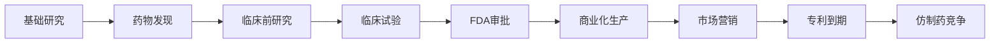

# 美国制药行业分析

## 概述

美国制药行业是全球最大的药品市场，2023年市场规模达5,500亿美元，占全球药品市场的40%以上。该行业以高研发投入、严格监管、专利保护为特征，是医疗保健板块中最稳定的细分领域之一。

**学习目标**：
- 理解制药行业的商业模式和价值链
- 掌握新药研发流程和成功率
- 分析专利保护和专利悬崖的影响
- 评估制药公司的投资价值
- 识别行业面临的挑战和机遇

## 行业商业模式

### 价值链分析

### 核心商业模式

**1. 研发驱动模式**：
- 研发投入：收入的15-20%
- 研发周期：10-15年
- 成功率：约10%（从临床I期到上市）
- 单个新药成本：10-26亿美元

**2. 专利保护期**：
- 专利期限：20年（从申请日起）
- 有效独占期：10-15年（扣除研发时间）
- 独占期利润：毛利率70-80%
- 专利到期后：收入下降70-90%

**3. 产品组合管理**：
- 重磅炸弹药物（Blockbuster）：年销售额>10亿美元
- 产品线平衡：成熟产品+新药+研发管线
- 并购补充：收购创新药物和管线

### 收入模式

**销售渠道**：
- 批发商：占60-70%
- 医院和诊所：占20-25%
- 零售药店：占10-15%
- 直接销售：少量

**定价策略**：
- 创新药：高价策略（反映研发成本）
- 专科药：超高价（罕见病、肿瘤）
- 仿制药：低价竞争
- 国际市场：差异化定价

## 新药研发流程

### 研发阶段详解

**阶段1：药物发现（2-5年）**：
- 靶点识别：找到疾病相关的生物靶点
- 化合物筛选：测试数千个候选化合物
- 先导化合物优化：改善药效和安全性
- 成功率：约1/5000化合物进入临床

**阶段2：临床前研究（1-3年）**：
- 体外实验：细胞水平测试
- 动物实验：评估安全性和药效
- 药代动力学：研究药物在体内的行为
- IND申请：向FDA提交临床试验申请

**阶段3：临床I期（1-2年）**：
- 目标：评估安全性和耐受性
- 受试者：20-100名健康志愿者
- 成功率：约70%进入II期
- 关键指标：最大耐受剂量（MTD）

**阶段4：临床II期（2-3年）**：
- 目标：初步评估有效性
- 受试者：100-500名患者
- 成功率：约33%进入III期
- 关键指标：疗效信号、剂量范围

**阶段5：临床III期（2-4年）**：
- 目标：确证疗效和安全性
- 受试者：1000-5000名患者
- 成功率：约25-30%获批
- 关键指标：主要终点达标

**阶段6：FDA审批（6-12个月）**：
- NDA提交：新药申请
- FDA审查：标准审批或优先审批
- 咨询委员会：专家评审
- 批准上市：获得销售许可

**阶段7：IV期临床（上市后）**：
- 长期安全性监测
- 真实世界数据收集
- 适应症扩展研究

### 研发成本与风险

**成本构成**：
- 临床前：2-3亿美元
- 临床试验：5-10亿美元
- 失败成本：5-10亿美元
- 总成本：10-26亿美元/新药

**风险因素**：
- 科学风险：药物无效或不安全
- 监管风险：FDA不批准
- 商业风险：市场接受度低
- 竞争风险：竞品抢先上市

## 专利保护与专利悬崖

### 专利保护机制

**专利类型**：
- 化合物专利：保护药物分子结构
- 制剂专利：保护配方和剂型
- 用途专利：保护新适应症
- 工艺专利：保护生产方法

**专利期延长**：
- 儿科独占期：额外6个月
- 孤儿药独占期：7年
- 专利期补偿：补偿审批时间（最多5年）

### 专利悬崖影响

**收入影响**：
- 第1年：下降50-70%
- 第2年：下降70-90%
- 稳定期：保留10-20%市场份额

**应对策略**：
1. **产品线补充**：推出新药弥补损失
2. **适应症扩展**：延长产品生命周期
3. **授权仿制药**：自己推出仿制版本
4. **品牌维护**：强调原研药质量

**案例分析**：
- Lipitor（立普妥）：2011年专利到期，年销售额从130亿降至20亿
- Plavix（波立维）：2012年专利到期，收入下降80%
- Humira（修美乐）：2023年美国专利到期，面临生物类似药竞争

## 行业竞争格局

### 市场集中度

**全球前10大制药公司**（2023年）：

| 排名 | 公司 | 总部 | 2023收入 | 主要产品 |
|-----|------|------|---------|---------|
| 1 | Pfizer | 美国 | 580亿美元 | Comirnaty, Paxlovid |
| 2 | Johnson & Johnson | 美国 | 520亿美元 | Stelara, Darzalex |
| 3 | AbbVie | 美国 | 540亿美元 | Humira, Skyrizi |
| 4 | Roche | 瑞士 | 480亿美元 | Ocrevus, Hemlibra |
| 5 | Merck | 美国 | 600亿美元 | Keytruda, Gardasil |
| 6 | Novartis | 瑞士 | 460亿美元 | Entresto, Cosentyx |
| 7 | Bristol Myers Squibb | 美国 | 460亿美元 | Eliquis, Opdivo |
| 8 | Eli Lilly | 美国 | 340亿美元 | Trulicity, Mounjaro |
| 9 | AstraZeneca | 英国 | 450亿美元 | Tagrisso, Farxiga |
| 10 | Sanofi | 法国 | 430亿美元 | Dupixent, Lantus |

**市场份额**：
- 前10大公司：占全球市场40%
- 前20大公司：占全球市场60%
- 其余公司：占40%（高度分散）

### 竞争维度

**1. 研发能力**：
- 研发投入规模
- 研发管线质量
- 科学家团队实力
- 技术平台优势

**2. 治疗领域专长**：
- 肿瘤学：Roche, Merck, BMS
- 免疫学：AbbVie, J&J
- 心血管：Novartis, Pfizer
- 糖尿病：Eli Lilly, Novo Nordisk

**3. 商业化能力**：
- 销售团队规模
- 市场准入能力
- 医生关系网络
- 品牌影响力

**4. 并购整合**：
- 财务实力
- 整合经验
- 交易执行能力

## 主要治疗领域

### 肿瘤学（Oncology）

**市场规模**：2,000亿美元（2023）
**增长率**：10-12%年增长

**主要药物类型**：
- 免疫检查点抑制剂：Keytruda, Opdivo
- 靶向治疗：Tagrisso, Ibrance
- ADC药物：Enhertu, Trodelvy
- CAR-T疗法：Kymriah, Yescarta

**投资亮点**：
- 高未满足需求
- 高定价能力
- 组合疗法潜力
- 持续创新

### 免疫学（Immunology）

**市场规模**：1,500亿美元
**增长率**：7-9%

**主要适应症**：
- 类风湿关节炎
- 银屑病
- 炎症性肠病
- 系统性红斑狼疮

**重磅药物**：
- Humira（修美乐）：曾是全球最畅销药物
- Stelara：强生的多适应症药物
- Dupixent：赛诺菲的明星产品

### 糖尿病（Diabetes）

**市场规模**：800亿美元
**增长率**：5-7%

**药物类型**：
- GLP-1激动剂：Ozempic, Mounjaro
- 胰岛素：Lantus, Tresiba
- SGLT-2抑制剂：Jardiance, Farxiga

**新趋势**：
- GLP-1用于减肥：Wegovy, Zepbound
- 口服GLP-1：Rybelsus
- 每周一次注射

### 心血管（Cardiovascular）

**市场规模**：600亿美元
**增长率**：3-5%

**主要药物**：
- 抗凝药：Eliquis, Xarelto
- 降脂药：Repatha, Praluent
- 心衰药：Entresto

### 疫苗（Vaccines）

**市场规模**：700亿美元
**增长率**：8-10%

**主要产品**：
- COVID-19疫苗：Comirnaty, Spikevax
- HPV疫苗：Gardasil
- 流感疫苗：多家公司
- RSV疫苗：新兴市场

## 投资分析

### 估值方法

**DCF模型要点**：
1. **产品线预测**：
   - 现有产品：考虑专利到期
   - 新产品：峰值销售预测
   - 研发管线：rNPV估值

2. **折现率选择**：
   - WACC：7-9%
   - 风险调整：按临床阶段

3. **终值计算**：
   - 永续增长率：2-3%
   - 考虑行业成熟度

**相对估值指标**：
- P/E：10-20x（行业平均15x）
- EV/EBITDA：10-15x
- P/S：3-6x
- PEG：1.0-2.0

### 关键财务指标

**盈利能力**：
- 毛利率：70-80%（创新药）
- 运营利润率：25-35%
- 净利润率：15-25%
- ROE：15-25%

**研发效率**：
- R&D/收入：15-20%
- 研发管线价值/市值：评估创新能力
- 新药上市数量：年度指标

**现金流**：
- 自由现金流/净利润：80-100%
- 现金流稳定性：高
- 资本支出需求：低（5-7%收入）

### 选股标准

**优质制药公司特征**：
1. **强大研发管线**：
   - 10+个后期临床项目
   - 多个潜在重磅药物
   - 分散的治疗领域

2. **专利保护**：
   - 未来5年无重大专利悬崖
   - 或有新药弥补损失

3. **财务稳健**：
   - 净负债/EBITDA < 3x
   - 利息覆盖率 > 5x
   - 稳定现金流

4. **股息政策**：
   - 连续10年以上派息
   - 股息率2-4%
   - 派息率40-60%

5. **估值合理**：
   - P/E < 行业平均或历史平均
   - PEG < 2.0
   - 股息收益率有吸引力

## 行业挑战与风险

### 药品定价压力

**政策压力**：
- IRA法案：Medicare药价谈判
- 透明度要求：披露定价信息
- 进口药品：允许从加拿大进口
- 州级立法：各州药价控制法案

**影响**：
- 利润率压缩：预计下降2-5%
- 定价策略调整：更谨慎的定价
- 创新激励：可能影响研发投入

**应对策略**：
- 强调创新价值
- 患者援助计划
- 价值定价模式
- 多元化收入来源

### 仿制药竞争

**仿制药渗透率**：
- 处方量：90%
- 收入占比：20%（价格低）

**生物类似药**：
- 增长更快：复杂生物药专利到期
- 价格折扣：30-50%（vs化学仿制药80-90%）
- 市场接受度：逐步提升

### 研发生产力下降

**挑战**：
- 研发成本上升：从10亿到26亿美元
- 成功率下降：尤其是神经系统药物
- 低垂果实已摘：容易的靶点已开发

**应对**：
- AI辅助药物发现
- 外部创新：收购和合作
- 精准医疗：提高成功率
- 平台技术：mRNA、ADC

### 监管风险

**FDA审批不确定性**：
- 审批延迟
- 要求额外试验
- 拒绝批准

**上市后安全性**：
- 黑框警告
- 市场撤回
- 适应症限制

## 未来趋势

### 技术创新方向

**1. 精准医疗**：
- 伴随诊断：基因检测指导用药
- 个性化治疗：根据基因型选药
- 生物标志物：预测疗效

**2. 新型药物平台**：
- mRNA技术：疫苗和治疗
- ADC药物：抗体偶联药物
- 双特异性抗体：同时靶向两个靶点
- 蛋白降解剂：PROTAC技术

**3. AI在药物研发**：
- 靶点发现：AI预测疾病靶点
- 分子设计：生成式AI设计化合物
- 临床试验优化：患者招募和监测
- 预测模型：预测药物成功率

### 并购整合趋势

**大型并购**：
- 补充产品线：填补专利悬崖
- 获取技术平台：mRNA、基因编辑
- 地域扩张：新兴市场

**近期案例**：
- Pfizer收购Seagen（430亿美元）：ADC技术
- Merck收购Prometheus（109亿美元）：免疫学
- AbbVie收购Allergan（630亿美元）：多元化

### 新兴市场增长

**增长驱动**：
- 中产阶级扩大
- 医保覆盖提升
- 慢性病增加
- 创新药准入改善

**重点市场**：
- 中国：全球第二大市场
- 印度：仿制药大国
- 巴西：拉美最大市场
- 东南亚：快速增长

## 实战应用

### 投资组合构建

**防御型组合**：
- 大型制药：J&J, Pfizer, Merck
- 特点：稳定股息，低波动
- 适合：退休账户，保守投资者

**平衡型组合**：
- 大型制药60% + 中型专科药企40%
- 兼顾稳定性和成长性
- 适合：大多数投资者

**成长型组合**：
- 专科药企 + 创新生物技术
- 高增长潜力，高波动
- 适合：风险承受能力强的投资者

### 催化剂识别

**关键催化剂**：
1. **FDA审批决定**：
   - PDUFA日期：FDA决定日
   - 咨询委员会：专家投票
   - 优先审批：6个月vs标准10个月

2. **临床数据发布**：
   - 关键试验结果
   - 学术会议：ASCO, ASH, ADA
   - 顶刊发表：NEJM, Lancet

3. **商业里程碑**：
   - 季度销售数据
   - 市场份额变化
   - 新适应症获批

4. **并购传闻**：
   - 收购目标
   - 合作协议
   - 资产剥离

### 风险管理

**分散化**：
- 持有5-10只制药股
- 跨治疗领域配置
- 大中小盘平衡

**止损策略**：
- 临床失败：立即评估，考虑止损
- 专利诉讼失败：快速反应
- FDA拒批：分析原因，决定去留

**定期审查**：
- 季度财报分析
- 研发管线更新
- 专利到期时间表
- 竞争格局变化

## 延伸阅读

### 推荐书籍

1. **《制药业的真相》** - Marcia Angell
   - 制药行业批判性分析
   - 定价和营销策略

2. **《新药的故事》** - 梁贵柏
   - 药物发现历史
   - 研发过程详解

3. **《Pharma》** - Gerald Posner
   - 制药行业历史
   - 争议和丑闻

### 研究资源

**数据来源**：
- FDA.gov：审批信息
- ClinicalTrials.gov：临床试验
- EvaluatePharma：销售预测
- IQVIA：市场数据

**行业报告**：
- Evaluate Pharma World Preview
- IQVIA Institute Reports
- Deloitte Pharma Outlook

**投资研究**：
- Leerink Partners
- SVB Securities
- Jefferies Healthcare

## 参考文献

1. IQVIA Institute. (2023). *Global Medicine Spending and Usage Trends*.
2. Evaluate Pharma. (2023). *World Preview 2023, Outlook to 2028*.
3. FDA. (2023). *Drug Approval Statistics*.
4. Deloitte. (2023). *2024 Global Life Sciences Outlook*.
5. McKinsey & Company. (2023). *The Future of Pharma R&D*.
6. Boston Consulting Group. (2023). *Biopharma Innovation Trends*.
7. PwC. (2023). *Pharma 2030*.
8. Congressional Budget Office. (2023). *Research and Development in the Pharmaceutical Industry*.
9. Kaiser Family Foundation. (2023). *Prescription Drug Pricing*.
10. J.P. Morgan. (2023). *Pharmaceuticals Equity Research*.

---

**下一步学习**：
- 研究 [Pfizer案例](./pfizer.html)
- 研究 [Moderna案例](./moderna.html)
- 探索 [生物技术行业](../biotech/overview.html)
- 了解 [医疗器械行业](overview.html)
