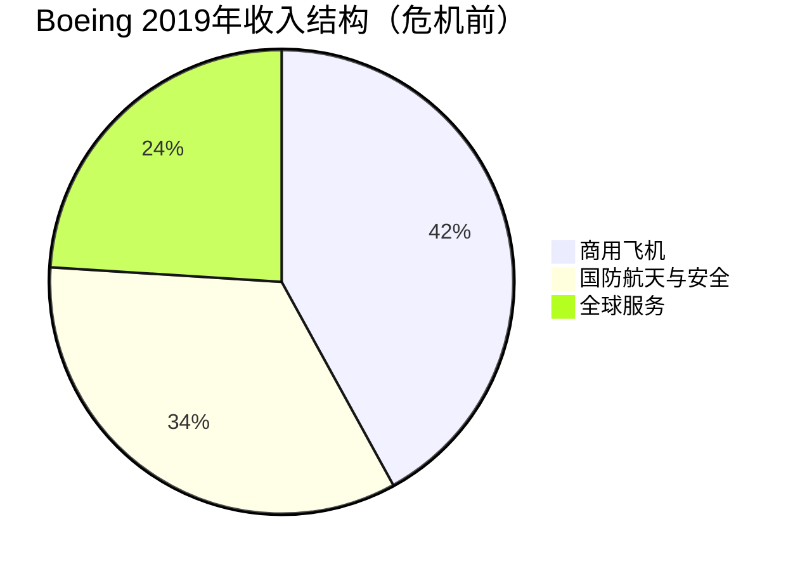
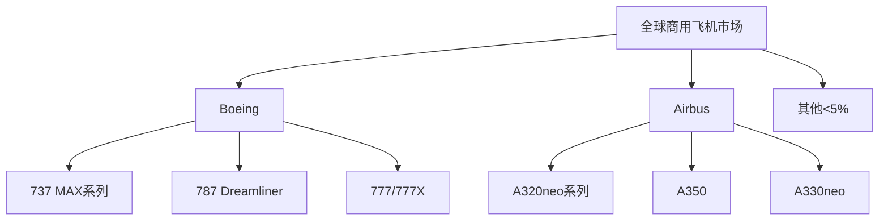

# Boeing - 商用航空巨头的挑战与机遇

## 公司概况

**基本信息**：
- 成立时间：1916年
- 总部：芝加哥，伊利诺伊州
- 创始人：William Boeing
- 上市时间：1934年（NYSE: BA）
- 市值：约1500-2000亿美元（波动较大）
- 员工数：约17万人

**主营业务**：
Boeing是全球最大的航空航天制造商之一，业务涵盖商用飞机、国防航天和全球服务三大板块。

**行业地位**：
- 商用飞机：全球双寡头之一（与Airbus）
- 国防航天：美国第二大国防承包商
- 全球影响力：产品遍布150多个国家

## 商业模式分析

### 业务结构

**1. 商用飞机（Commercial Airplanes - BCA）**

**产品线**：
- **窄体机**：737系列（737 MAX）
  - 单通道，150-230座
  - 短中程航线主力
  - 与Airbus A320系列竞争

- **宽体机**：
  - 787 Dreamliner：中型宽体，200-330座
  - 777系列：大型宽体，300-400座
  - 777X：新一代超大型宽体

- **货机**：
  - 747-8F、777F、767F
  - 全球货运市场领导者

**商业模式特点**：
- 长周期：从订单到交付通常5-7年
- 巨额订单积压：通常相当于5-8年产量
- 预付款：客户支付30-40%预付款
- 售后服务：零部件、维修、升级

**2. 国防、航天与安全（Defense, Space & Security - BDS）**

**主要产品**：
- 军用飞机：F/A-18、F-15、KC-46加油机
- 直升机：AH-64 Apache、CH-47 Chinook
- 导弹防御系统
- 卫星与航天器
- 网络安全解决方案

**商业模式**：
- 政府合同：长期、稳定
- 成本加成定价：风险较低
- 技术密集：高研发投入
- 维护服务：持续收入来源

**3. 全球服务（Boeing Global Services - BGS）**

**服务内容**：
- 零部件供应
- 维修与改装
- 飞行员培训
- 数字化解决方案
- 物流支持

**商业模式优势**：
- 高利润率：20-25%营业利润率
- 稳定现金流：非周期性
- 客户粘性：原厂服务优势
- 增长潜力：全球机队扩大

### 收入与盈利模式

**收入确认**：
- 商用飞机：交付时确认收入
- 国防合同：按完工百分比法
- 服务业务：提供服务时确认

**盈利驱动因素**：
1. 交付量：飞机交付数量
2. 产品组合：宽体机利润率更高
3. 学习曲线：产量提升降低单位成本
4. 售后服务：高利润率业务增长
5. 国防合同：稳定利润贡献

## 竞争分析

### 商用飞机市场：双寡头格局

**Boeing vs Airbus**：

**市场份额（按订单量）**：
- 历史平均：Boeing 45-50%, Airbus 50-55%
- 737 MAX危机后：Airbus领先优势扩大
- 2023年恢复：Boeing重新获得订单

**竞争维度**：

**1. 产品性能**
- 燃油效率
- 航程
- 载客量
- 运营成本

**2. 价格**
- 目录价格：通常有40-50%折扣
- 融资条件
- 贸易条件（Trade-in）

**3. 交付时间**
- 生产槽位（Slot）
- 交付可靠性
- 产能灵活性

**4. 售后服务**
- 零部件供应
- 技术支持
- 培训服务

**5. 政治因素**
- 政府支持
- 贸易政策
- 本地化生产

### 竞争优势（护城河）

**1. 双寡头市场结构**

**进入壁垒极高**：
- 资本需求：数百亿美元投资
- 技术壁垒：百年技术积累
- 认证要求：严格的安全认证
- 规模经济：需要大规模生产摊薄成本
- 供应链：复杂的全球供应链网络

**结果**：
- 新进入者几乎不可能（中国C919、俄罗斯MC-21仍在起步）
- 定价权：双寡头可以维持合理利润率
- 客户锁定：航空公司机队标准化

**2. 技术领先性**

**核心技术**：
- 复合材料：787机身50%复合材料
- 航空电子：先进飞行控制系统
- 发动机集成：与GE、Rolls-Royce合作
- 空气动力学：持续优化设计

**研发投入**：
- 年研发支出：30-40亿美元
- 研发/收入比：3-5%
- 专利组合：数万项专利

**3. 品牌与声誉**

**历史积淀**：
- 百年品牌
- 安全记录（737 MAX前）
- 创新形象（707、747、787）

**客户信任**：
- 航空公司长期合作
- 飞行员偏好
- 监管机构认可

**4. 全球服务网络**

**服务能力**：
- 全球零部件中心
- 24/7技术支持
- 培训设施
- 数字化服务平台

**客户粘性**：
- 原厂服务优势
- 机队标准化
- 长期服务合同

**5. 国防业务稳定性**

**政府关系**：
- 长期国防合同
- 关键供应商地位
- 政治支持

**现金流稳定**：
- 对冲商用飞机周期性
- 持续研发投入来源

## 737 MAX危机深度分析

### 危机时间线

**2018年10月**：
- 印尼狮航610航班坠毁，189人遇难
- 初步调查指向MCAS系统

**2019年3月**：
- 埃塞俄比亚航空302航班坠毁，157人遇难
- 全球停飞737 MAX

**2019-2020年**：
- 生产暂停
- 巨额赔偿与罚款
- 管理层更换
- 软件修复与重新认证

**2020年11月**：
- FAA批准737 MAX复飞
- 逐步恢复交付

**2021-2023年**：
- 产能爬坡
- 订单恢复
- 信心重建

### 根本原因

**技术问题**：

**MCAS系统缺陷**：
- 单传感器依赖：仅依赖一个迎角传感器
- 过度干预：可以反复推低机头
- 飞行员培训不足：未充分告知MCAS功能
- 设计哲学：过度依赖自动化

**工程文化问题**：
- 成本压力：与A320neo竞争
- 进度压力：快速推出市场
- 监管俘获：FAA过度依赖Boeing自我认证
- 沟通失败：工程师担忧未被重视

**管理问题**：

**财务导向**：
- 股东回报优先：大量回购股票
- 成本削减：工程资源不足
- 短期主义：季度业绩压力

**文化变迁**：
- 从工程师文化到MBA文化
- 并购McDonnell Douglas后的文化冲突
- 总部搬离西雅图（远离工程中心）

### 危机影响

**财务影响**：

**直接成本**：
- 赔偿金：约200亿美元
- 罚款：25亿美元（司法部）
- 停产损失：数百亿美元
- 库存积压：约400架飞机

**间接成本**：
- 订单取消：数百架
- 市场份额损失
- 品牌价值受损
- 融资成本上升

**运营影响**：
- 生产中断：18个月
- 供应链混乱
- 员工士气
- 客户关系

**战略影响**：
- 竞争地位削弱：Airbus扩大领先
- 新项目延迟：777X、NMA中型飞机
- 财务杠杆上升：大量举债
- 信用评级下调

### 恢复路径

**短期措施**：
- 软件修复：MCAS系统重新设计
- 飞行员培训：强制模拟器培训
- 监管合规：加强与FAA沟通
- 质量控制：强化安全文化

**中期措施**：
- 产能恢复：逐步提升至每月50架
- 交付积压：消化库存飞机
- 订单恢复：重建客户信心
- 现金流改善：恢复正向自由现金流

**长期措施**：
- 文化重塑：重建工程师文化
- 新产品开发：777X、未来中型飞机
- 数字化转型：智能制造、数字服务
- 可持续发展：电动飞机、可持续航空燃料

## 财务分析

### 历史财务表现

**收入趋势**（单位：十亿美元）：
- 2017年：$94B
- 2018年：$101B（峰值）
- 2019年：$76B（737 MAX停产）
- 2020年：$58B（疫情+737 MAX）
- 2021年：$62B（恢复初期）
- 2022年：$66B（持续恢复）
- 2023年：$77B（接近正常）

**盈利能力**：

**危机前（2018年）**：
- 营业利润率：10.8%
- 净利润：$10.5B
- 自由现金流：$13.6B
- ROE：>100%（高杠杆）

**危机期（2019-2020年）**：
- 巨额亏损：2019年-$0.6B, 2020年-$12B
- 负自由现金流：-$18B（2020年）
- 债务激增：净债务从$10B增至$60B+

**恢复期（2021-2023年）**：
- 盈利改善：逐步减亏
- 现金流转正：2022年开始
- 债务削减：开始降低杠杆

### 关键财务指标

**订单与积压**：

**订单积压（Backlog）**：
- 2018年：约5,900架（峰值）
- 2020年：约4,200架（取消后）
- 2023年：约5,500架（恢复增长）
- 价值：约4,000-5,000亿美元

**年度订单**：
- 2018年：893架净订单
- 2019年：-87架（净取消）
- 2020年：-456架（净取消）
- 2021年：535架（转正）
- 2022年：1,000+架（强劲恢复）

**交付量**：
- 2018年：806架
- 2019年：380架（737 MAX停产）
- 2020年：157架（疫情）
- 2021年：340架（恢复）
- 2022年：480架
- 2023年：528架（目标）

**现金流分析**：

**经营现金流驱动因素**：
- 交付量：主要收入来源
- 预付款：新订单带来现金流入
- 营运资本：库存、应收账款管理

**资本开支**：
- 正常水平：30-40亿美元/年
- 主要用途：产能扩张、新产品开发

**自由现金流目标**：
- 2025年：100亿美元+
- 长期：150-200亿美元/年

### 资本结构

**债务水平**：
- 总债务：约600-700亿美元
- 净债务：约450-550亿美元
- 净债务/EBITDA：5-7倍（偏高）

**信用评级**：
- 标普：BBB-（投资级边缘）
- 穆迪：Baa2
- 展望：稳定

**股东权益**：
- 账面价值：负值（累计亏损）
- 市值：1,500-2,000亿美元
- 股价波动：高度波动

## 投资论点

### 看多理由

**1. 行业复苏**

**航空旅行需求恢复**：
- 疫情后报复性反弹
- 长期增长：年均4-5%
- 新兴市场：中国、印度、东南亚

**机队更新需求**：
- 老旧飞机退役
- 燃油效率提升需求
- 环保法规推动

**2. 双寡头定价权**

**市场结构优势**：
- 无新进入者威胁
- 定价权逐步恢复
- 利润率改善空间

**3. 737 MAX恢复**

**产能爬坡**：
- 月产量目标：50架（2025年）
- 积压订单消化：5-7年
- 现金流大幅改善

**信心恢复**：
- 安全记录重建
- 客户接受度提高
- 新订单增长

**4. 国防业务稳定**

**政府支持**：
- 美国国防预算增长
- 地缘政治紧张
- 长期合同保障

**5. 服务业务增长**

**高利润率**：
- 营业利润率：20-25%
- 全球机队扩大
- 数字化服务机会

**6. 估值吸引力**

**相对估值**：
- P/E：低于历史平均
- EV/EBITDA：考虑恢复后盈利
- P/B：账面价值为负，不适用

**绝对估值**：
- DCF：基于正常化现金流
- 恢复到危机前水平的潜力

### 看空理由与风险

**1. 执行风险**

**生产爬坡挑战**：
- 供应链瓶颈
- 质量控制压力
- 劳动力短缺

**新产品延迟**：
- 777X认证延迟
- 中型飞机项目不确定

**2. 财务脆弱性**

**高债务负担**：
- 利息支出：30-40亿美元/年
- 再融资风险
- 信用评级下调风险

**现金流压力**：
- 需要持续交付增长
- 资本开支需求
- 债务偿还

**3. 竞争压力**

**Airbus优势扩大**：
- 市场份额领先
- 产能优势
- 客户关系

**中国C919威胁**：
- 长期潜在竞争
- 中国市场份额
- 政治因素

**4. 监管风险**

**FAA监管加强**：
- 认证流程更严格
- 成本增加
- 时间延长

**安全事故风险**：
- 任何新事故将严重打击信心
- 品牌价值进一步受损

**5. 宏观风险**

**经济衰退**：
- 航空旅行需求下降
- 航空公司推迟订单
- 融资环境恶化

**地缘政治**：
- 贸易摩擦
- 制裁影响
- 供应链中断

**6. 技术变革**

**可持续航空**：
- 电动飞机发展
- 氢能源飞机
- 技术路线不确定

## 估值分析

### 正常化盈利估值

**假设**：
- 年交付量：750-800架（正常水平）
- 营业利润率：8-10%
- 自由现金流：150-200亿美元/年

**DCF估值**：
- 正常化FCF：$17.5B（中值）
- 增长率：2-3%（长期）
- WACC：8-9%
- 终值倍数：EV/FCF 12-15倍

**估值区间**：
- 保守：$150-180/股
- 基准：$200-250/股
- 乐观：$280-320/股

**当前价格**（假设$200）**：
- 隐含回报：0-60%
- 风险/回报：不对称（上行空间大）

### 相对估值

**可比公司**：
- Airbus：P/E 20-25倍，EV/EBITDA 12-15倍
- Lockheed Martin：P/E 18-20倍
- Raytheon：P/E 20-22倍

**Boeing估值折价**：
- 反映执行风险
- 财务杠杆
- 不确定性

**合理估值**：
- P/E：15-18倍（正常化盈利）
- EV/EBITDA：10-12倍

## 投资策略

### 适合投资者类型

**价值投资者**：
- 困境反转机会
- 估值吸引力
- 长期护城河

**周期投资者**：
- 航空周期底部
- 产能利用率提升
- 盈利弹性大

**风险偏好**：
- 中高风险承受能力
- 长期投资视角（3-5年）
- 能承受波动

### 买入时机

**理想买入点**：
- 市场恐慌时：负面新闻过度反应
- 行业低谷：航空需求疲软
- 估值低位：P/E<12倍，FCF收益率>8%

**催化剂**：
- 737 MAX交付加速
- 新订单超预期
- 现金流转正
- 债务削减进展

### 持有策略

**监测指标**：
- 月度交付量
- 季度订单净增
- 自由现金流
- 债务水平
- 安全记录

**持有期**：
- 最少3-5年
- 等待完全恢复
- 估值修复

### 卖出信号

**基本面恶化**：
- 新的安全事故
- 订单大量取消
- 现金流持续为负
- 债务危机

**估值过高**：
- P/E>25倍
- EV/EBITDA>18倍
- 股价超过内在价值30%+

**更好机会**：
- 其他投资机会风险/回报更优

## 关键学习点

**1. 双寡头市场的价值**
- 极高进入壁垒创造长期价值
- 定价权是核心竞争优势
- 市场结构比短期业绩更重要

**2. 安全与质量的重要性**
- 航空业安全是第一要务
- 质量问题可能摧毁百年品牌
- 工程师文化vs财务文化

**3. 周期性行业投资**
- 在周期底部买入
- 关注长期趋势而非短期波动
- 耐心等待恢复

**4. 财务杠杆的双刃剑**
- 高杠杆放大回报，也放大风险
- 危机时财务灵活性至关重要
- 现金流比账面利润更重要

**5. 管理层文化的影响**
- 企业文化决定长期成败
- 短期主义的危害
- 工程导向vs财务导向

## 延伸阅读

### 推荐书籍

1. **《Flying Blind》** - Peter Robison，737 MAX危机深度调查
2. **《Boeing Versus Airbus》** - John Newhouse，双寡头竞争史
3. **《The Sporty Game》** - John Newhouse，航空工业经典
4. **《Hard Landing》** - Thomas Petzinger，航空业历史
5. **《Turbulence》** - Mark Gerchick，航空业监管

### 研究资源

**公司资源**：
- Boeing年报和10-K
- 季度财报和电话会议
- 投资者日演示
- 订单与交付月报

**行业数据**：
- IATA（国际航空运输协会）
- FAA（美国联邦航空局）
- Cirium（航空数据）
- Ascend by Cirium（机队数据）

**分析报告**：
- 投行研究报告
- 咨询公司行业报告
- 航空分析师博客

## 参考文献

1. Robison, P. (2021). *Flying Blind: The 737 MAX Tragedy*. Doubleday.
2. Newhouse, J. (2007). *Boeing Versus Airbus*. Vintage.
3. Boeing Company. (2023). *Annual Report*.
4. Boeing Company. (2023). *Orders and Deliveries*.
5. FAA. (2020). "737 MAX Return to Service Report".
6. IATA. (2023). "Air Passenger Market Analysis".
7. McKinsey & Company. (2023). "Aerospace & Defense Outlook".
8. Teal Group. (2023). "World Civil Aircraft Forecast".
9. Vertical Research Partners. (2023). "Aerospace & Defense Research".
10. Credit Suisse. (2023). "Boeing: Path to Recovery".
11. Morgan Stanley. (2023). "Aerospace & Defense Industry Report".
12. Congressional Research Service. (2020). "The Boeing 737 MAX: Lessons Learned".
13. NTSB. (2019). "Lion Air Flight 610 Investigation Report".
14. NTSB. (2019). "Ethiopian Airlines Flight 302 Investigation Report".
15. The Wall Street Journal. (2019-2023). "Boeing 737 MAX Coverage".
