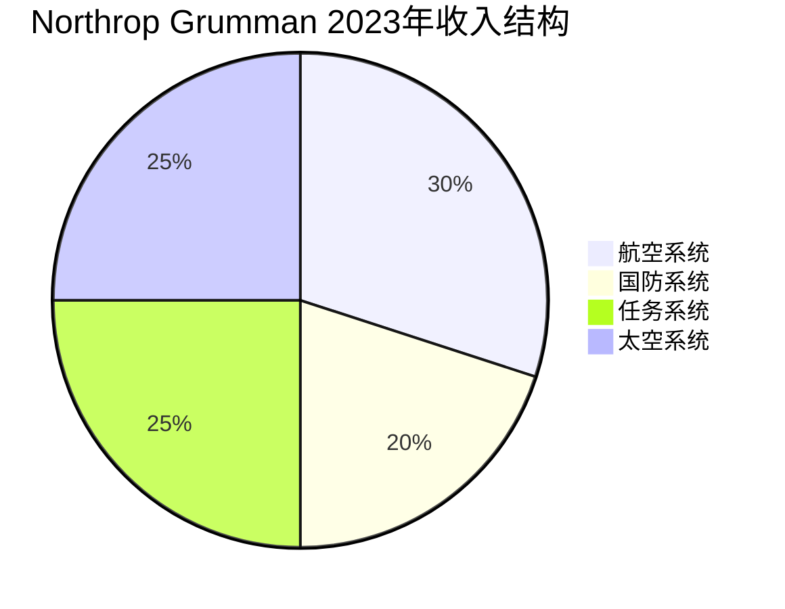

# Northrop Grumman - 隐身轰炸机与太空的未来

## 公司概况

**基本信息**：
- 成立时间：1994年（Northrop与Grumman合并）
- 总部：弗吉尼亚州，弗尔斯彻奇
- 上市时间：NYSE: NOC
- 市值：约700-800亿美元
- 员工数：约9.5万人
- 年收入：约360-380亿美元

**战略定位**：
Northrop Grumman专注于高端国防技术，是美国最重要的战略武器系统供应商，以B-21 Raider隐身轰炸机、核武器现代化和太空系统为核心，在国防技术金字塔顶端占据独特地位。

**行业地位**：
- 美国第四大国防承包商
- 全球唯一B-21隐身轰炸机制造商
- 美国核武器现代化核心供应商
- 全球领先的太空系统供应商

## 核心业务解析

### 业务结构

**1. 航空系统（Aeronautics Systems）**

**核心产品**：

**B-21 Raider（核心增长引擎）**：
- 定位：下一代隐身战略轰炸机
- 取代：B-1B Lancer和B-52（部分）
- 计划采购：至少100架（可能更多）
- 单价：约6.9亿美元（目标价）
- 首飞：2023年11月
- 服役：预计2025-2026年

**B-2 Spirit（现役）**：
- 全球唯一隐身战略轰炸机（B-21服役前）
- 数量：20架
- 维护与升级：持续收入

**E-2D Advanced Hawkeye**：
- 海军舰载预警机
- 持续生产与升级

**无人系统**：
- MQ-4C Triton：海上巡逻无人机
- X-47B：舰载无人战斗机验证机
- 未来无人系统研发

**收入占比**：约30%
**营业利润率**：约10-11%

**2. 国防系统（Defense Systems）**

**核武器现代化**：
- 陆基战略威慑（GBSD/Sentinel）：
  - 取代Minuteman III洲际弹道导弹
  - 合同价值：约1,400亿美元（全生命周期）
  - 独家供应商
  - 生产：2030年代开始

**战术系统**：
- 弹药与武器系统
- 地面战斗系统
- 训练系统

**收入占比**：约20%
**营业利润率**：约11-12%

**3. 任务系统（Mission Systems）**

**传感器与处理**：
- 雷达系统：AN/APG-83 SABR（F-16升级）
- 电子战系统
- 通信系统
- 情报、监视与侦察（ISR）

**海军系统**：
- 水下战系统
- 反潜战
- 水面舰艇系统

**收入占比**：约25%
**营业利润率**：约15-16%（最高）

**4. 太空系统（Space Systems）**

**卫星系统**：
- 侦察卫星：国家侦察局（NRO）项目
- 通信卫星：军用通信
- 气象卫星：JPSS系列

**导弹防御**：
- 弹道导弹预警系统
- 太空监视网络

**商业航天**：
- Cygnus货运飞船：国际空间站补给
- 未来商业卫星

**收入占比**：约25%
**营业利润率**：约10-11%

## B-21 Raider：战略增长引擎

### 项目背景

**战略需求**：
- 美国核三位一体：陆基（ICBM）、海基（SLBM）、空基（轰炸机）
- B-52服役：1955年（70年！）
- B-1B退役计划：2036年
- 需要新一代隐身轰炸机

**B-21 vs B-2对比**：

| 特性 | B-2 Spirit | B-21 Raider |
|------|-----------|------------|
| 服役时间 | 1997年 | 2025-2026年 |
| 数量 | 20架 | 100架+ |
| 单价 | ~$21亿 | ~$6.9亿（目标） |
| 隐身性能 | 第一代 | 更先进 |
| 维护成本 | 极高 | 大幅降低 |
| 数字化 | 有限 | 全数字化 |

### B-21的商业价值

**合同结构**：
- 开发合同：固定价格（风险较高）
- 生产合同：成本加成（风险较低）
- 维护合同：长期稳定

**收入潜力**：
- 100架 × $6.9亿 = $690亿（生产）
- 维护与升级：数十年
- 总生命周期价值：数千亿美元

**当前状态**：
- 首飞成功：2023年11月
- 低速初始生产（LRIP）：已启动
- 全速生产：2026年+

**风险**：
- 固定价格开发合同：成本超支风险
- 技术挑战：隐身维护成本
- 预算压力：单价可能上升

## 核武器现代化：GBSD/Sentinel

### 项目规模

**背景**：
- Minuteman III：1970年代部署
- 需要全面更换：导弹、发射井、指挥控制
- 合同价值：约960亿美元（开发+生产）
- 全生命周期：约1,400亿美元

**Northrop的角色**：
- 主承包商：独家
- 导弹系统：设计与制造
- 发射设施：现代化
- 指挥控制：升级

**时间线**：
- 开发：2020-2029年
- 生产：2029-2036年
- 部署：2030年代

**商业价值**：
- 稳定的长期收入
- 成本加成合同：风险低
- 独家地位：无竞争

## 太空系统：增长新引擎

### 商业航天机遇

**Cygnus货运飞船**：
- NASA商业补给服务（CRS）
- 国际空间站补给
- 持续合同

**卫星制造**：
- 军用卫星：高价值、高保密
- 商业卫星：增长市场
- 星座卫星：新兴机会

### 太空安全

**太空军（Space Force）**：
- 2019年成立
- 预算快速增长
- Northrop核心供应商

**太空态势感知**：
- 卫星追踪
- 碎片监测
- 反卫星防御

## 财务分析

### 历史财务表现

**收入增长**（单位：十亿美元）：
- 2018年：$30.1B
- 2019年：$33.8B（+12%）
- 2020年：$36.8B（+9%）
- 2021年：$35.7B（-3%，剥离IT业务）
- 2022年：$36.6B（+3%）
- 2023年：$39.3B（+7%）

**盈利能力**：
- 营业利润率：约11-12%
- 净利率：约8-9%
- ROIC：约12-15%

### 现金流分析

**经营现金流**：
- 年度：约35-40亿美元
- 稳定性：高
- 增长性：稳定

**自由现金流**：
- 年度：约25-30亿美元
- 资本开支：约10-12亿美元/年
- FCF/收入：约7-8%

**资本配置**：
- 股息：约10亿美元/年（收益率约1.5%）
- 股票回购：约20-25亿美元/年
- 股息增长：连续20年+

### 资本结构

**债务水平**：
- 总债务：约140-160亿美元
- 净债务：约100-120亿美元
- 净债务/EBITDA：约2.0-2.5倍

**信用评级**：
- 标普：BBB+
- 穆迪：Baa2
- 稳定展望

## 投资论点

### 看多理由

**1. B-21量产启动**

**催化剂**：
- 首飞成功：技术验证
- LRIP启动：收入开始
- 全速生产：2026年+

**收入影响**：
- 年产量：约10-15架（初期）
- 逐步提升：至20-30架/年
- 维护收入：长期稳定

**2. 核武器现代化独家地位**

**GBSD/Sentinel**：
- 独家合同：无竞争
- 长期稳定：20年+
- 成本加成：风险低

**收入贡献**：
- 年均：约50-80亿美元（高峰期）
- 持续性：极高

**3. 太空预算增长**

**Space Force**：
- 预算：快速增长
- Northrop：核心供应商
- 新项目：持续获得

**商业航天**：
- 卫星制造：增长市场
- 发射服务：间接受益

**4. 高端技术壁垒**

**差异化定位**：
- 专注最高端技术
- 竞争对手少
- 利润率更高

**技术积累**：
- B-2隐身技术传承
- 太空系统经验
- 核武器专业知识

**5. 稳定现金流与股东回报**

**现金流**：
- 年FCF：25-30亿美元
- 可预测性：高
- 增长性：稳定

**股东回报**：
- 股息+回购：约30-35亿美元/年
- 股息增长：连续20年+

### 风险因素

**1. B-21固定价格合同风险**

**历史教训**：
- Boeing KC-46：固定价格合同亏损数十亿
- Northrop B-21：同样结构

**风险**：
- 成本超支：自担
- 技术挑战：隐身材料
- 进度延迟：罚款

**2. 规模相对较小**

**与同行比较**：
- 收入：$360亿 vs Lockheed $670亿
- 多元化：相对集中
- 单一项目依赖：B-21、GBSD

**3. 预算削减风险**

**战略武器优先级**：
- 核武器现代化：两党支持
- 但预算总量有限
- 优先级可能变化

**4. 技术执行风险**

**B-21挑战**：
- 隐身维护：成本控制
- 数字化系统：复杂性
- 生产爬坡：效率提升

## 估值分析

### DCF估值

**假设**：
- 收入增长：4-6%（B-21驱动）
- FCF利润率：8-9%
- WACC：7.5%
- 永续增长率：2%

**估值区间**：
- 保守：$420-460/股
- 基准：$480-540/股
- 乐观：$580-640/股

### 相对估值

**可比公司**：

| 公司 | P/E | EV/EBITDA | FCF收益率 |
|------|-----|-----------|---------|
| Northrop Grumman | 16-18x | 12-14x | 4-5% |
| Lockheed Martin | 15-18x | 12-14x | 5-6% |
| General Dynamics | 17-19x | 12-13x | 5-6% |

**估值分析**：
- 相对同行：合理
- B-21期权价值：未充分定价
- 核武器现代化：长期价值

## 投资策略

### 适合投资者类型

**长期价值投资者**：
- B-21长期增长
- 核武器现代化稳定性
- 技术壁垒护城河

**防御型投资者**：
- 政府合同稳定性
- 非周期性
- 稳定股息增长

### 持有策略

**监测指标**：
- B-21生产进度
- GBSD/Sentinel里程碑
- 太空预算趋势
- 自由现金流
- 订单积压

**买入逻辑**：
- B-21量产确认
- 估值合理
- 国防预算增长

## 关键学习点

**1. 高端技术的定价权**
- 专注最高端：竞争少，利润高
- 技术壁垒：难以复制
- 战略地位：政府必须采购

**2. 长期项目的价值**
- B-21：数十年收入
- GBSD：20年+稳定
- 可见性：极高

**3. 固定价格合同的风险**
- 开发阶段：风险最高
- 生产阶段：风险降低
- 需要严格成本控制

**4. 太空：下一个增长前沿**
- Space Force：新预算来源
- 商业航天：新机遇
- 技术积累：先发优势

## 参考文献

1. Northrop Grumman. (2023). *Annual Report*.
2. U.S. Air Force. (2023). "B-21 Raider Program Update".
3. GAO. (2023). "B-21 Raider Program Assessment".
4. Congressional Research Service. (2023). "Ground Based Strategic Deterrent".
5. U.S. Space Force. (2023). "Budget Request".
6. Aviation Week. (2023). "B-21 First Flight Coverage".
7. Jane's Defence Weekly. (2023). Various articles.
8. Teal Group. (2023). "World Military Aircraft Forecast".
9. Morgan Stanley. (2023). "Northrop Grumman Analysis".
10. Vertical Research Partners. (2023). "Aerospace & Defense Research".
11. Defense News. (2023). "Northrop Grumman Coverage".
12. Breaking Defense. (2023). "B-21 Production Update".
