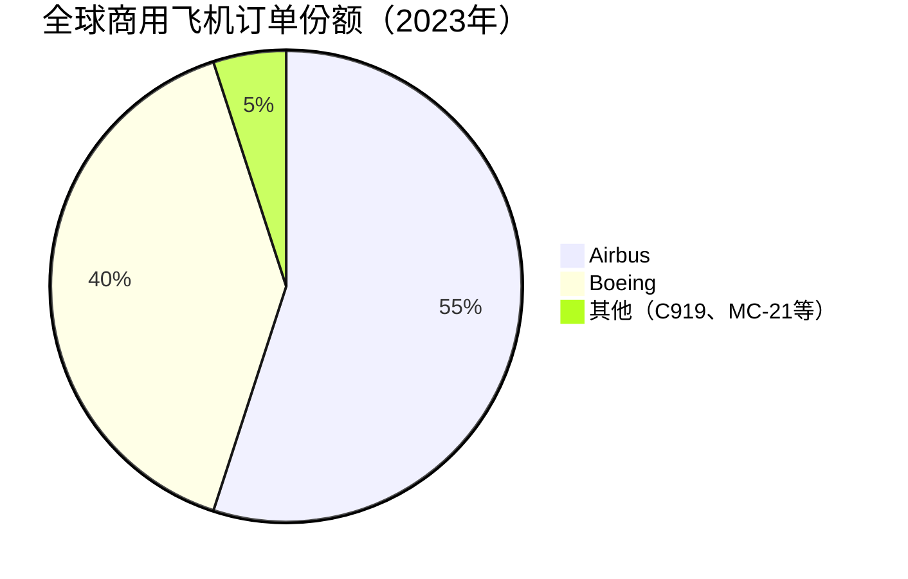
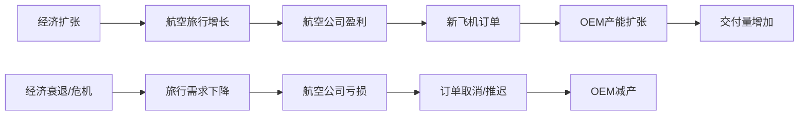

# 航空航天行业概览 - 高壁垒双寡头市场

## 行业定义与范围

航空航天行业涵盖商用飞机制造、军用航空、航天系统、发动机及零部件供应链等细分领域。作为资本密集、技术密集的战略性行业，其进入壁垒极高，全球形成了高度集中的寡头格局。

**行业细分**：
- 商用飞机：干线、支线、公务机
- 军用航空：战斗机、运输机、直升机、无人机
- 航天系统：卫星、运载火箭、载人航天
- 发动机：航空发动机（GE、Pratt & Whitney、Rolls-Royce）
- 零部件与MRO：维修、大修、翻新

## 行业规模与增长

**全球市场规模**：
- 商用航空：约4,000亿美元/年
- 军用航空：约2,500亿美元/年
- 航天系统：约4,000亿美元/年（含卫星服务）
- MRO市场：约800亿美元/年

**长期增长驱动**：
- 全球航空旅行：年均4-5%增长（IATA预测）
- 新兴市场崛起：亚太、中东、非洲
- 机队更新需求：老旧飞机退役
- 国防预算增长：大国竞争时代
- 商业航天：SpaceX引领新浪潮

## 市场结构：双寡头格局

### 商用飞机：Boeing vs Airbus

**双寡头形成原因**：
1. 极高资本壁垒：开发新机型需500亿美元+
2. 技术积累：百年工程经验
3. 安全认证：FAA/EASA认证极为严格
4. 供应链：全球数千家供应商网络
5. 客户锁定：航空公司机队标准化

**新进入者现状**：
- 中国C919：仅限国内市场，技术差距明显
- 俄罗斯MC-21：制裁影响，前景不明
- 巴西Embraer：专注支线，不与干线竞争

### 军用航空：美国主导

**美国五大国防承包商**：

| 公司 | 年收入 | 核心产品 |
|------|--------|---------|
| Lockheed Martin | ~$670亿 | F-35、F-16、C-130 |
| Raytheon Technologies | ~$670亿 | 导弹、发动机、传感器 |
| Boeing Defense | ~$260亿 | F/A-18、KC-46、Apache |
| Northrop Grumman | ~$360亿 | B-21、F-35机身、卫星 |
| General Dynamics | ~$390亿 | 战舰、装甲车、IT系统 |

## 产业链分析

### 上游：原材料与零部件

**关键材料**：
- 铝合金：机身结构
- 钛合金：发动机、结构件
- 碳纤维复合材料：787机身50%、A350机身53%
- 特种钢：起落架、发动机

**关键零部件供应商**：
- 发动机：GE Aviation、Pratt & Whitney（RTX子公司）、Rolls-Royce、Safran
- 航电：Honeywell、Collins Aerospace（RTX子公司）、Thales
- 机身结构：Spirit AeroSystems、Triumph Group
- 起落架：Safran Landing Systems、Collins Aerospace

### 中游：整机制造商（OEM）

**商用飞机**：Boeing、Airbus、Embraer、Bombardier（公务机）
**军用飞机**：Lockheed Martin、Boeing、Northrop Grumman、General Dynamics

**OEM的核心价值**：
- 系统集成能力
- 品牌与认证
- 客户关系
- 供应链管理

### 下游：运营与服务

**航空公司**：
- 美国三大：American、Delta、United
- 低成本：Southwest、Spirit、Frontier
- 全球：Lufthansa、Emirates、Singapore Airlines

**MRO服务**：
- 独立MRO：ST Engineering、Lufthansa Technik
- OEM服务：Boeing Global Services、Airbus Services
- 航空公司自营：Delta TechOps

**飞机租赁**：
- AerCap（全球最大）
- Air Lease Corporation
- SMBC Aviation Capital

## 行业周期性分析

### 商用航空周期

**历史重大周期**：
- 9/11事件（2001）：需求骤降，订单取消
- 金融危机（2008-2009）：交付量下降20%
- 737 MAX危机（2019）：Boeing特有冲击
- 新冠疫情（2020-2021）：史上最严重危机，交付量下降50%+
- 疫情后复苏（2022-2025）：强劲反弹，积压订单创历史新高

**周期特征**：
- 订单领先交付3-7年
- 积压订单提供缓冲
- 宽体机周期性更强
- 窄体机需求更稳定

### 军用航空：反周期特性

**与商用航空的差异**：
- 需求来源：政府预算，非市场需求
- 周期性：低，与经济周期相关性弱
- 驱动因素：地缘政治、国防战略
- 合同特征：长期、稳定、可预测

**当前驱动因素**：
- 俄乌冲突：欧洲国防开支大幅提升
- 中美竞争：美国国防预算持续增长
- 北约2% GDP目标：盟国补充军备
- 高超音速武器竞赛：新一轮军备竞赛

## 技术趋势

### 可持续航空

**挑战**：
- 航空业占全球碳排放约2.5%
- 2050年净零排放目标（IATA承诺）

**技术路径**：
1. 可持续航空燃料（SAF）：近期主要手段，成本高
2. 混合电动：短途支线，2030年代商业化
3. 氢能源飞机：Airbus ZEROe项目，2035年目标
4. 全电动：仅适用于小型飞机

**投资影响**：
- 新机型研发加速
- 发动机技术革新
- 燃料基础设施投资

### 数字化与智能制造

**制造端**：
- 数字孪生：虚拟测试减少实物原型
- 增材制造（3D打印）：复杂零件、快速原型
- 机器人自动化：提升生产效率
- AI质量检测：减少人工检查

**运营端**：
- 预测性维护：传感器+AI
- 数字化飞行手册
- 飞行数据分析
- 无人机检查

### 无人系统（UAV/UAS）

**军用无人机**：
- 侦察：RQ-4 Global Hawk（Northrop）
- 攻击：MQ-9 Reaper（General Atomics）
- 忠诚僚机：Boeing MQ-28、Kratos XQ-58

**商用无人机**：
- 物流配送：Amazon Prime Air、Wing（Google）
- 城市空中交通（UAM）：Joby Aviation、Archer
- 农业、测绘、检查

**投资机会**：
- 传统OEM转型
- 纯无人机公司
- 软件与控制系统

## 投资框架

### 商用航空投资逻辑

**核心命题**：全球航空旅行长期增长 + 双寡头定价权 = 长期价值创造

**关键指标**：
- 全球RPK（旅客公里数）增长
- 机队规模与更新需求
- OEM订单积压
- 交付量与产能利用率
- 自由现金流

**投资时机**：
- 危机后底部：疫情、事故、经济衰退
- 产能爬坡期：交付量加速，现金流改善
- 估值低位：P/E < 历史均值

### 国防航空投资逻辑

**核心命题**：政府合同稳定性 + 技术壁垒 = 可预测现金流

**关键指标**：
- 国防预算趋势
- 订单积压（Backlog）
- 合同类型（成本加成 vs 固定价格）
- 自由现金流转化率
- 股息增长历史

**投资时机**：
- 地缘政治紧张：国防预算增加
- 新项目启动：长期合同锁定
- 估值合理：FCF收益率 > 5%

### 风险因素

**商用航空风险**：
- 安全事故：品牌与监管风险
- 经济衰退：需求骤降
- 油价上涨：航空公司削减订单
- 技术颠覆：电动飞机长期威胁

**国防航空风险**：
- 预算削减：财政压力
- 项目取消：成本超支
- 地缘政治缓和：需求下降
- 固定价格合同亏损

## 主要公司速览

### Boeing（BA）
- 定位：商用+国防双轮驱动
- 核心：737 MAX、787、F/A-18
- 当前状态：危机后恢复期
- 投资主题：困境反转

### Airbus（AIR.PA）
- 定位：商用飞机全球领导者
- 核心：A320neo、A350、A330neo
- 当前状态：产能爬坡，订单强劲
- 投资主题：稳定增长

### Lockheed Martin（LMT）
- 定位：全球最大国防承包商
- 核心：F-35、THAAD、Sikorsky
- 当前状态：稳定增长，高现金流
- 投资主题：防御性收益

### Raytheon Technologies（RTX）
- 定位：国防+商用航空双轮
- 核心：导弹、发动机、航电
- 当前状态：整合后增长
- 投资主题：多元化国防

### Northrop Grumman（NOC）
- 定位：高端国防技术
- 核心：B-21轰炸机、卫星、网络
- 当前状态：B-21量产启动
- 投资主题：高技术国防

## 关键学习点

**1. 双寡头市场的稀缺性**
- 商用飞机市场是全球最典型的双寡头
- 进入壁垒决定了长期定价权
- 市场结构比短期业绩更重要

**2. 周期与反周期的组合**
- 商用航空：强周期性，需择时
- 军用航空：弱周期性，适合长持
- 组合配置：平衡风险

**3. 技术壁垒的持久性**
- 航空认证体系保护现有玩家
- 研发投入形成累积优势
- 新技术（电动、氢能）是长期变量

**4. 现金流质量**
- 国防合同：现金流可预测
- 商用飞机：预付款+交付款模式
- 服务业务：高利润率稳定现金流

## 参考文献

1. IATA. (2023). "Air Passenger Market Analysis".
2. Boeing. (2023). "Commercial Market Outlook 2023-2042".
3. Airbus. (2023). "Global Market Forecast 2023-2042".
4. Teal Group. (2023). "World Civil Aircraft Forecast".
5. SIPRI. (2023). "Military Expenditure Database".
6. McKinsey & Company. (2023). "Aerospace & Defense Outlook".
7. Oliver Wyman. (2023). "MRO Survey".
8. Aviation Week. (2023). "State of the Aerospace & Defense Industry".
9. Deloitte. (2023). "2024 Aerospace & Defense Industry Outlook".
10. Morgan Stanley. (2023). "Aerospace & Defense Industry Report".
