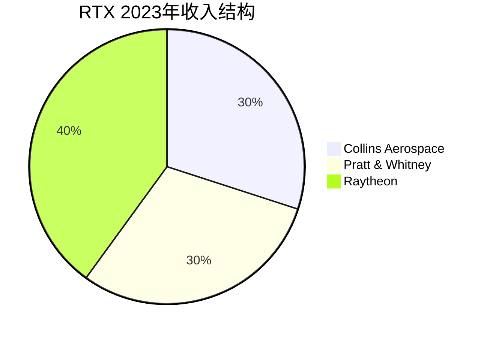

# Raytheon Technologies - 导弹与发动机的双引擎

## 公司概况

**基本信息**：
- 公司名称：RTX Corporation（原Raytheon Technologies）
- 成立时间：2020年（Raytheon与United Technologies合并）
- 总部：阿灵顿，弗吉尼亚州
- 上市时间：NYSE: RTX
- 市值：约1,300-1,500亿美元
- 员工数：约18.5万人
- 年收入：约670亿美元

**战略定位**：
RTX是全球最大的航空航天与国防公司之一，独特之处在于同时拥有顶级商用航空发动机（Pratt & Whitney）、航空电子系统（Collins Aerospace）和导弹防御系统（Raytheon）三大核心业务，形成商用+军用的双轮驱动格局。

**行业地位**：
- 全球第二大国防承包商（与Lockheed Martin并列）
- 全球第二大航空发动机制造商（Pratt & Whitney）
- 全球最大导弹制造商
- 全球最大航空电子系统供应商之一

## 业务结构深度解析

### 四大业务板块

**1. Collins Aerospace（航空电子与系统）**

**业务范围**：
- 航空电子：飞行控制、导航、通信
- 机舱系统：座椅、照明、娱乐
- 机械系统：起落架、制动、燃油
- 任务系统：军用传感器、电子战

**主要客户**：
- 商用：Boeing、Airbus、所有主要航空公司
- 军用：美国国防部、盟国空军

**竞争优势**：
- 全球最大航空系统供应商之一
- 与OEM深度绑定
- 售后服务高利润率

**收入占比**：约30%（~$200亿）
**营业利润率**：约14-16%

**2. Pratt & Whitney（航空发动机）**

**产品线**：

**商用发动机**：
- GTF（齿轮传动涡扇）：A320neo、A220、E-Jets E2
  - 燃油效率：比上一代提升16-20%
  - 噪音：降低75%
  - 排放：NOx降低50%
- PW4000：宽体机发动机（777、747）
- PW2000：C-17军用运输机

**军用发动机**：
- F135：F-35战斗机专用发动机（独家）
- F100：F-15、F-16发动机
- F117：C-17运输机

**发动机商业模式**：
- 发动机销售：通常低利润甚至亏损（"剃须刀"模式）
- 售后服务（MRO）：高利润率，长期稳定
- 备件销售：高利润率
- 服务合同（ESP）：按飞行小时收费

**收入占比**：约30%（~$200亿）
**营业利润率**：约8-10%（GTF问题影响）

**GTF发动机问题（重要风险）**：
- 粉末金属缺陷：2023年发现
- 影响：约1,200架飞机需检查
- 成本：预计30-70亿美元
- 时间：2024-2026年修复

**3. Raytheon（导弹与防御系统）**

**核心产品**：

**导弹系统**：
- 爱国者（Patriot/PAC-3）：防空导弹系统
  - 全球部署：17个国家
  - 乌克兰战争：需求激增
- 标准导弹（SM-2/SM-3/SM-6）：海军防空
- AIM-120 AMRAAM：空对空导弹
- AIM-9X Sidewinder：近距空对空
- Tomahawk：巡航导弹
- StormBreaker：精确制导炸弹

**防御系统**：
- AN/TPY-2雷达：THAAD配套雷达
- 爱国者雷达：AN/MPQ-65
- 海基X波段雷达（SBX）

**网络与空间**：
- 网络安全
- 情报系统
- 太空监视

**收入占比**：约40%（~$270亿）
**营业利润率**：约12-14%

## 核心竞争优势

### 优势一：导弹市场垄断地位

**市场份额**：
- 美国导弹市场：约40-50%份额
- 全球导弹市场：领导地位

**产品广度**：
- 覆盖所有导弹类型：防空、反舰、空对空、巡航
- 从短程到洲际：全谱系
- 从陆基到海基到空基：全平台

**需求驱动**：
- 乌克兰战争：消耗大量爱国者、AMRAAM
- 台海紧张：亚太防空需求
- 中东局势：持续需求

**生产瓶颈**：
- 当前：产能严重不足
- 扩产计划：2024-2026年大幅扩产
- 积压订单：创历史新高

### 优势二：F-35发动机垄断

**F135发动机**：
- F-35唯一发动机供应商
- 全球3,000+架F-35的发动机
- 生命周期：至2070年代

**收入潜力**：
- 发动机销售：每台约1,500-2,000万美元
- 维护合同：每台每年数百万美元
- 升级项目：AETP（增强型发动机）

**竞争威胁**：
- GE/Safran联合体：AETP竞争
- 结果：可能双供应商（长期风险）

### 优势三：商用航空双重受益

**商用航空复苏受益**：
- Pratt & Whitney：发动机交付增加
- Collins Aerospace：航电系统需求
- MRO服务：飞行小时增加

**GTF发动机市场地位**：
- A320neo系列：与CFM LEAP竞争
- 市场份额：约50%（A320neo）
- 燃油效率优势：长期竞争力

### 优势四：系统集成能力

**一体化解决方案**：
- 从传感器到射手（Sensor-to-Shooter）
- 从平台到网络
- 从硬件到软件

**协同效应**：
- Collins + Raytheon：综合防御系统
- Pratt & Whitney + Collins：发动机+航电
- 跨业务协同：提升竞争力

## 财务分析

### 历史财务表现

**收入增长**（单位：十亿美元）：
- 2020年（合并首年）：$56.6B
- 2021年：$64.4B（+14%）
- 2022年：$67.1B（+4%）
- 2023年：$68.9B（+3%）
- 2024E：$78-80B（+13%，GTF修复+国防增长）

**盈利能力**：
- 营业利润率：约10-12%（GTF问题前）
- 净利率：约7-9%
- ROIC：约10-12%

**GTF问题影响**：
- 2023年：额外成本约30亿美元
- 2024-2026年：持续影响
- 长期：修复后利润率恢复

### 现金流分析

**经营现金流**：
- 正常年份：约70-80亿美元
- GTF影响年份：约50-60亿美元
- 恢复后：80-90亿美元

**自由现金流**：
- 正常年份：约50-60亿美元
- 资本开支：约20-25亿美元/年
- GTF修复后：FCF大幅改善

**资本配置**：
- 股息：约25亿美元/年（收益率约2%）
- 股票回购：约30-40亿美元/年
- 并购：选择性

### 资本结构

**债务水平**：
- 总债务：约350-400亿美元（合并带来）
- 净债务：约300-350亿美元
- 净债务/EBITDA：约3.0-3.5倍（偏高）

**去杠杆计划**：
- 目标：净债务/EBITDA < 2.5倍
- 时间：2025-2026年
- 路径：FCF偿债

**信用评级**：
- 标普：BBB+
- 穆迪：Baa1
- 稳定展望

## 投资论点

### 看多理由

**1. 导弹需求爆发**

**乌克兰战争影响**：
- 爱国者系统：多国订购
- AMRAAM：大量消耗，需补充
- 全球库存重建：数年需求

**亚太紧张**：
- 台湾：防空系统需求
- 日本：导弹防御扩充
- 韩国：持续采购

**积压订单**：
- 2023年底：约1,900亿美元
- 相当于约2.8年收入
- 历史最高水平

**2. GTF问题是短期干扰**

**问题本质**：
- 制造缺陷，非设计问题
- 可修复，有明确路径
- 成本已大部分计提

**修复后受益**：
- 停飞飞机复飞：MRO收入激增
- 积压维护需求：高利润率
- 客户关系修复：长期合同

**3. 商用航空复苏**

**双重受益**：
- Pratt & Whitney：GTF交付增加
- Collins Aerospace：航电需求
- MRO：飞行小时增加

**长期趋势**：
- 全球机队扩张
- 新兴市场增长
- 机队更新需求

**4. 合并协同效应**

**成本协同**：
- 采购整合：节省数亿美元
- 管理层精简
- 设施优化

**收入协同**：
- 跨业务销售
- 综合解决方案
- 客户关系共享

**5. 估值吸引力（GTF折价）**

**当前折价**：
- GTF问题导致估值压缩
- 相对同行：10-15%折价
- 修复后：估值修复空间

**FCF收益率**：
- 正常化FCF：约60-70亿美元
- FCF收益率：约4-5%
- 修复后：提升至5-6%

### 风险因素

**1. GTF问题持续超预期**

**风险**：
- 修复成本超出预期
- 时间延长
- 客户索赔

**影响**：
- 现金流压力
- 声誉损失
- 市场份额流失

**2. F135竞争**

**AETP项目**：
- GE/Safran联合体竞争
- 可能引入双供应商
- 长期市场份额风险

**影响**：
- F-35发动机垄断终结
- 收入减少
- 利润率压缩

**3. 高债务负担**

**风险**：
- 净债务/EBITDA：3.0-3.5倍
- 利率上升：利息成本增加
- 信用评级下调风险

**4. 商用航空周期性**

**风险**：
- 经济衰退：航空旅行下降
- 航空公司破产：订单取消
- 油价冲击

**5. 出口管制**

**风险**：
- 导弹出口限制
- 地缘政治影响
- 盟国关系变化

## 估值分析

### 正常化估值

**GTF修复后假设**：
- 收入：约750-800亿美元
- 营业利润率：11-12%
- FCF：约65-75亿美元

**DCF估值**：
- 正常化FCF：$70亿
- 增长率：3-4%
- WACC：8%
- 估值：$95-115/股

### 相对估值

**可比公司**：

| 公司 | P/E | EV/EBITDA |
|------|-----|-----------|
| RTX（当前） | 20-22x | 13-15x |
| Lockheed Martin | 15-18x | 12-14x |
| Northrop Grumman | 16-18x | 12-14x |
| Honeywell | 22-25x | 15-17x |

**估值分析**：
- GTF折价：相对Honeywell有折价
- 修复后：估值修复空间
- 国防业务：支撑估值底部

## 投资策略

### 适合投资者类型

**成长+价值混合型**：
- 短期：GTF修复催化剂
- 中期：导弹需求爆发
- 长期：商用航空复苏

**事件驱动型**：
- GTF修复进展
- 导弹订单公告
- 季度业绩超预期

### 持有策略

**监测指标**：
- GTF修复进度（停飞飞机数量）
- 导弹订单积压
- Pratt & Whitney交付量
- 自由现金流
- 债务削减进度

**买入逻辑**：
- GTF问题已充分定价
- 导弹需求长期增长
- 商用航空复苏受益
- 估值相对合理

## 关键学习点

**1. 合并整合的复杂性**
- 大型合并带来协同效应
- 也带来整合风险
- 需要时间验证

**2. 制造质量的重要性**
- GTF问题：制造缺陷的代价
- 质量控制：航空业的生命线
- 声誉修复：需要时间

**3. 多元化的价值**
- 商用+军用：平衡周期性
- 发动机+系统：多元收入
- 危机时互相对冲

**4. 导弹需求的结构性增长**
- 地缘政治：长期驱动
- 库存重建：多年需求
- 技术升级：持续投入

## 参考文献

1. RTX Corporation. (2023). *Annual Report*.
2. GAO. (2023). "F-35 Propulsion System Status".
3. U.S. Department of Defense. (2023). "Budget Request".
4. Aviation Week. (2023). "GTF Engine Issue Update".
5. Jane's Defence Weekly. (2023). "Raytheon Missile Systems".
6. SIPRI. (2023). "Arms Transfers Database".
7. Morgan Stanley. (2023). "RTX Analysis".
8. Bernstein Research. (2023). "Aerospace & Defense Outlook".
9. Congressional Research Service. (2023). "Patriot Air Defense System".
10. Defense News. (2023). "Raytheon Production Expansion".
11. Wall Street Journal. (2023). "RTX GTF Coverage".
12. Teal Group. (2023). "World Missile Forecast".
