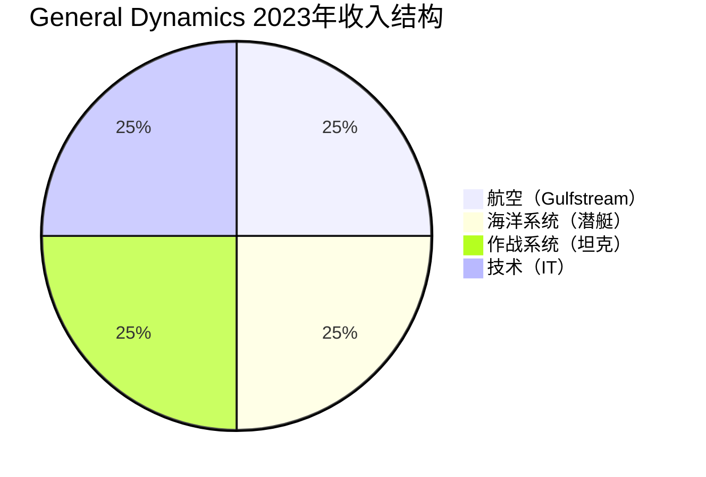

# General Dynamics - 潜艇、坦克与企业IT的多元帝国

## 公司概况

**基本信息**：
- 成立时间：1952年（多次合并演变）
- 总部：雷斯顿，弗吉尼亚州
- 上市时间：NYSE: GD
- 市值：约700-800亿美元
- 员工数：约10.6万人
- 年收入：约390-420亿美元

**战略定位**：
General Dynamics是美国最多元化的国防承包商之一，独特之处在于同时拥有核潜艇（海军）、装甲车辆（陆军）、企业IT系统（政府IT）和公务机（Gulfstream）四大完全不同的业务，形成了真正的多元化国防+商用组合。

**行业地位**：
- 美国第三大国防承包商
- 美国核潜艇唯一主承包商（与HII共同）
- 全球最大公务机制造商（Gulfstream）
- 美国政府IT服务主要供应商

## 业务结构深度解析

### 四大业务板块

**1. 航空（Aerospace - Gulfstream）**

**Gulfstream公务机**：
- 定位：全球顶级公务机品牌
- 产品线：G280、G500、G600、G700、G800
- G700：最大型号，航程13,890公里
- G800：超远程，航程14,816公里（全球最远）

**市场地位**：
- 全球公务机市场份额：约30-35%（大型公务机）
- 竞争对手：Bombardier（Challenger/Global）、Dassault（Falcon）
- 品牌溢价：顶级定位

**商业模式**：
- 飞机销售：高单价（$3,000-7,500万美元）
- 售后服务：高利润率
- 定制化：个性化内饰

**收入占比**：约25%（~$100亿）
**营业利润率**：约15-17%（最高）

**周期性**：
- 与经济周期相关：高净值人群财富
- 企业支出：商务旅行需求
- 疫情后：强劲复苏

**2. 海洋系统（Marine Systems）**

**核心业务：核潜艇**

**弗吉尼亚级攻击核潜艇（SSN）**：
- 与HII（亨廷顿英格尔斯）共同建造
- GD负责：约60%工作量
- 年产量：目标2艘/年（当前约1.5艘）
- 单价：约35亿美元
- 计划：持续建造至2040年代

**哥伦比亚级弹道导弹核潜艇（SSBN）**：
- 取代俄亥俄级
- 计划：12艘
- 单价：约130亿美元
- GD主承包商
- 建造：2024-2042年

**其他海军舰艇**：
- DDG-51阿利·伯克级驱逐舰：部分建造
- 海军辅助舰艇

**商业价值**：
- 哥伦比亚级：约1,560亿美元总合同
- 弗吉尼亚级：持续建造，稳定收入
- 维护与大修：长期合同

**收入占比**：约25%（~$100亿）
**营业利润率**：约8-9%（成本加成，稳定）

**3. 作战系统（Combat Systems）**

**M1 Abrams主战坦克**：
- 美国陆军主战坦克
- 服役：1980年至今
- 持续升级：M1A2 SEPv3、M1A2 SEPv4
- 出口：沙特、科威特、澳大利亚、波兰等

**斯特赖克装甲车**：
- 轮式装甲车族
- 多种变型：步兵战车、指挥车、医疗车
- 美国陆军核心装备

**其他装甲车辆**：
- 皮兰哈（Piranha）：瑞士设计，全球出口
- 拳击手（Boxer）：欧洲多国
- LAV系列：加拿大、沙特

**弹药**：
- 坦克炮弹
- 小口径弹药
- 引信系统

**收入占比**：约25%（~$100亿）
**营业利润率**：约14-15%

**4. 技术（Technologies - GDIT）**

**General Dynamics IT（GDIT）**：
- 定位：美国政府IT服务
- 客户：国防部、情报机构、联邦政府
- 服务：云计算、网络安全、数据分析、IT基础设施

**主要合同**：
- 国防部IT现代化
- 情报机构系统
- 联邦政府云迁移

**市场地位**：
- 美国政府IT服务前五名
- 安全许可：最高级别
- 长期合同：稳定收入

**收入占比**：约25%（~$100亿）
**营业利润率**：约9-10%

## 核潜艇：战略性垄断

### 美国核潜艇工业

**双寡头格局**：
- General Dynamics（Electric Boat）：主要建造商
- HII（亨廷顿英格尔斯）：共同建造商
- 两家公司：美国唯一核潜艇建造商

**进入壁垒**：
- 核技术：极高安全要求
- 建造设施：数十亿美元投资
- 技术积累：数十年经验
- 安全许可：政府认证

### 哥伦比亚级：世纪大合同

**项目规模**：
- 总数量：12艘
- 总合同价值：约1,560亿美元
- 单艘价值：约130亿美元
- 建造周期：2024-2042年

**战略重要性**：
- 美国核威慑核心
- 两党支持：不可削减
- 国家安全：最高优先级

**GD的角色**：
- 主承包商：Electric Boat
- 设计：主导
- 建造：约60-70%工作量

**收入影响**：
- 年均贡献：约80-100亿美元（高峰期）
- 持续性：至2042年
- 可见性：极高

### AUKUS协议的机遇

**背景**：
- 2021年：美英澳三国协议
- 澳大利亚：获得核潜艇技术
- 美国：帮助建造

**GD机遇**：
- 澳大利亚采购：3-5艘弗吉尼亚级
- 技术转让：额外收入
- 产能扩张：需求增加

**挑战**：
- 当前产能：已满负荷
- 扩产需要：时间和投资
- 劳动力：技术工人短缺

## Gulfstream：商用业务的明珠

### 公务机市场

**市场规模**：
- 全球公务机市场：约250亿美元/年
- 大型公务机：约100亿美元/年
- 增长率：约5-7%/年

**需求驱动**：
- 高净值人群增长：全球财富增加
- 企业效率：高管时间价值
- 疫情后：私人飞行偏好增加
- 新兴市场：中东、亚洲需求

### Gulfstream的竞争优势

**技术领先**：
- G700/G800：最先进大型公务机
- 航程：全球最远
- 客舱：最宽敞、最安静
- 技术：主动噪音消除、先进航电

**品牌溢价**：
- 顶级定位：与劳斯莱斯类比
- 客户忠诚度：高
- 二手价值：保值性好

**服务网络**：
- 全球维修中心
- 24/7支持
- 培训设施

### 订单积压

**当前状态**：
- 积压订单：约$20亿美元+
- 交付周期：2-3年等待
- 需求强劲：G700/G800热销

## 财务分析

### 历史财务表现

**收入增长**（单位：十亿美元）：
- 2018年：$36.2B
- 2019年：$39.4B（+9%）
- 2020年：$37.9B（-4%，疫情）
- 2021年：$38.5B（+2%）
- 2022年：$39.4B（+2%）
- 2023年：$42.3B（+7%）

**增长驱动**：
- Gulfstream：G700/G800交付
- 海洋系统：哥伦比亚级启动
- 作战系统：M1坦克出口

### 盈利能力

**利润率**：
- 营业利润率：约11-12%
- 净利率：约8-9%
- ROIC：约15-18%

**各业务利润率**：
- Gulfstream：15-17%（最高）
- 作战系统：14-15%
- 技术：9-10%
- 海洋系统：8-9%（成本加成）

### 现金流分析

**经营现金流**：
- 年度：约40-45亿美元
- 稳定性：高
- 增长性：稳定

**自由现金流**：
- 年度：约30-35亿美元
- 资本开支：约10-12亿美元/年
- FCF/收入：约7-8%

**资本配置**：
- 股息：约15亿美元/年（收益率约2%）
- 股票回购：约20-25亿美元/年
- 股息增长：连续25年+

### 资本结构

**债务水平**：
- 总债务：约130-150亿美元
- 净债务：约80-100亿美元
- 净债务/EBITDA：约1.5-2.0倍

**信用评级**：
- 标普：A-
- 穆迪：A3
- 稳定展望

## 投资论点

### 看多理由

**1. 哥伦比亚级：20年稳定收入**

**规模**：
- 总合同：约1,560亿美元
- 年均：约80-100亿美元（高峰）
- 持续性：至2042年

**可见性**：
- 极高：合同已签
- 两党支持：不可削减
- 国家安全：最高优先级

**2. Gulfstream G700/G800增长**

**新产品周期**：
- G700：2022年开始交付
- G800：2023年开始交付
- 积压订单：强劲

**市场扩大**：
- 高净值人群增长
- 新兴市场需求
- 疫情后私人飞行偏好

**3. M1坦克出口激增**

**乌克兰战争影响**：
- 欧洲重新武装
- 波兰：250辆M1A2
- 德国：考虑采购
- 其他欧洲国家：评估中

**中东持续需求**：
- 沙特、科威特：升级
- 台湾：M1A2T

**4. 多元化降低风险**

**业务组合**：
- 国防：稳定、非周期
- 商用（Gulfstream）：增长、周期性
- IT：稳定增长

**互补性**：
- 国防低谷时：Gulfstream可能强劲
- 经济衰退时：国防稳定

**5. 稳定股东回报**

**股息历史**：
- 连续增长：25年+
- 股息贵族
- 增长率：约8-10%/年

**回购**：
- 持续大规模回购
- 股份数量持续减少

### 风险因素

**1. 核潜艇产能瓶颈**

**问题**：
- 当前产能：约1.5艘/年（目标2艘）
- 劳动力短缺：技术工人
- 供应链：关键零部件

**影响**：
- 交付延迟
- 成本超支
- 客户不满

**2. Gulfstream周期性**

**风险**：
- 经济衰退：高净值人群财富缩水
- 企业削减：商务旅行预算
- 历史：2008-2009年大幅下滑

**3. 固定价格合同风险**

**哥伦比亚级**：
- 部分固定价格
- 成本超支：自担
- 技术挑战：新型核潜艇

**4. 政府IT竞争**

**GDIT竞争**：
- 大型IT公司：AWS、Microsoft、Leidos
- 价格竞争：利润率压力
- 合同续签：不确定

## 估值分析

### 分部估值

**各业务估值**：

| 业务 | 收入 | 利润率 | EBIT | EV/EBIT | 价值 |
|------|------|--------|------|---------|------|
| Gulfstream | $100亿 | 16% | $16亿 | 18x | $288亿 |
| 海洋系统 | $100亿 | 9% | $9亿 | 15x | $135亿 |
| 作战系统 | $100亿 | 15% | $15亿 | 15x | $225亿 |
| 技术 | $100亿 | 10% | $10亿 | 12x | $120亿 |
| **合计** | **$400亿** | | **$50亿** | | **$768亿** |

**加上净债务调整**：
- 企业价值：约$768亿
- 减净债务：约$90亿
- 股权价值：约$678亿
- 每股：约$250-270

### 相对估值

**可比公司**：

| 公司 | P/E | EV/EBITDA |
|------|-----|-----------|
| General Dynamics | 17-19x | 12-13x |
| Lockheed Martin | 15-18x | 12-14x |
| Northrop Grumman | 16-18x | 12-14x |
| Textron | 15-17x | 10-12x |

**估值分析**：
- 相对同行：合理
- Gulfstream溢价：部分体现
- 哥伦比亚级价值：未充分定价

## 投资策略

### 适合投资者类型

**稳定增长型**：
- 多元化降低风险
- 稳定股息增长
- 可预测现金流

**收入型投资者**：
- 股息收益率：约2%
- 股息增长：年均8-10%
- 股息贵族：25年+

**价值投资者**：
- 合理估值
- 护城河明确
- 长期价值创造

### 持有策略

**监测指标**：
- 哥伦比亚级建造进度
- Gulfstream交付量与积压
- M1坦克出口订单
- 自由现金流
- 股息增长

**买入时机**：
- 市场整体下跌
- Gulfstream周期低谷
- FCF收益率 > 5%

## 关键学习点

**1. 多元化的真正价值**
- 不同周期性业务互补
- 降低单一业务风险
- 稳定整体现金流

**2. 核潜艇的战略价值**
- 国家安全核心
- 不可替代
- 20年可见性

**3. 奢侈品与国防的结合**
- Gulfstream：奢侈品逻辑
- 国防：政府合同逻辑
- 两者互补

**4. 股息贵族的复利**
- 25年+连续增长
- 股息再投资
- 长期复利效应

## 参考文献

1. General Dynamics. (2023). *Annual Report*.
2. U.S. Navy. (2023). "Columbia-Class Submarine Program".
3. GAO. (2023). "Columbia-Class Submarine Assessment".
4. Congressional Research Service. (2023). "Navy Columbia-Class Submarine".
5. SIPRI. (2023). "Arms Transfers Database".
6. Aviation International News. (2023). "Gulfstream G700/G800 Update".
7. Jane's Defence Weekly. (2023). "General Dynamics Coverage".
8. Defense News. (2023). "M1 Abrams Export Orders".
9. Morgan Stanley. (2023). "General Dynamics Analysis".
10. Bernstein Research. (2023). "Defense Sector Outlook".
11. Breaking Defense. (2023). "Submarine Production Challenges".
12. AUKUS. (2023). "Submarine Pathway Update".
