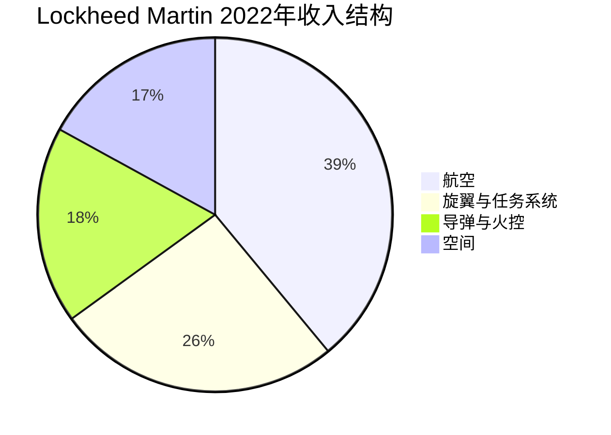
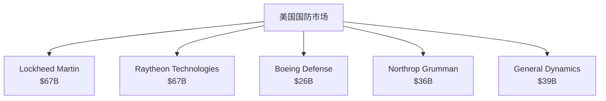

# Lockheed Martin - 国防工业的稳定巨头

## 公司概况

**基本信息**：
- 成立时间：1995年（Lockheed与Martin Marietta合并）
- 总部：贝塞斯达，马里兰州
- 上市时间：1995年（NYSE: LMT）
- 市值：约1,100-1,300亿美元
- 员工数：约11.6万人
- 年收入：约650-700亿美元

**主营业务**：
Lockheed Martin是全球最大的国防承包商，专注于航空航天、导弹防御、旋翼机和空间系统。

**行业地位**：
- 美国第一大国防承包商
- 全球国防收入最高的公司
- F-35战斗机独家制造商
- 关键国防系统供应商

## 商业模式分析

### 业务结构

**1. 航空（Aeronautics）**

**核心产品**：
- **F-35 Lightning II**：第五代隐身战斗机
  - 三个型号：F-35A（空军）、F-35B（海军陆战队）、F-35C（海军）
  - 全球最大武器项目：总价值超1.7万亿美元
  - 国际客户：9个国家参与开发，多国采购
  - 产量：年产150-180架，目标3,000+架

- **F-16 Fighting Falcon**：第四代战斗机
  - 全球最成功战斗机：4,600+架生产
  - 持续升级与出口
  - 印度、巴林等新订单

- **C-130 Hercules**：战术运输机
  - 服役70年，持续生产
  - 全球70+国家使用
  - C-130J超级大力神最新型号

**收入占比**：约39%
**营业利润率**：10-11%

**2. 旋翼与任务系统（Rotary and Mission Systems - RMS）**

**主要产品**：
- **Sikorsky直升机**：
  - Black Hawk（UH-60）：多用途直升机
  - CH-53K King Stallion：重型运输直升机
  - VH-92：总统直升机

- **任务系统**：
  - 雷达系统
  - 传感器
  - 电子战系统
  - 网络与通信

- **海军系统**：
  - Aegis作战系统
  - 反潜战系统
  - 水面舰艇系统

**收入占比**：约26%
**营业利润率**：11-12%

**3. 导弹与火控（Missiles and Fire Control - MFC）**

**核心产品**：
- **导弹系统**：
  - THAAD（萨德）：末段高空区域防御系统
  - PAC-3：爱国者导弹
  - JASSM：联合空对地防区外导弹
  - Javelin：反坦克导弹（与Raytheon合资）
  - HIMARS：高机动火箭炮系统

- **火控系统**：
  - Sniper ATP：先进瞄准吊舱
  - 激光系统
  - 传感器与瞄准系统

**收入占比**：约18%
**营业利润率**：15-16%（最高）

**4. 空间（Space）**

**主要业务**：
- **卫星系统**：
  - GPS卫星
  - 通信卫星
  - 气象卫星
  - 侦察卫星

- **导弹防御**：
  - 弹道导弹预警系统
  - 空间监视系统

- **空间探索**：
  - Orion飞船（NASA载人航天）
  - 火星探测器

**收入占比**：约17%
**营业利润率**：9-10%

### 商业模式特点

**1. 政府合同主导**

**客户结构**：
- 美国政府：约70%收入
  - 国防部：约60%
  - NASA、能源部等：约10%
- 国际客户：约30%收入
  - 盟国政府采购
  - 对外军售（FMS）

**合同类型**：

**成本加成合同（Cost-Plus）**：
- 约30-40%合同
- 成本+固定费用或激励费用
- 风险低，利润率稳定
- 适用于研发项目

**固定价格合同（Fixed-Price）**：
- 约60-70%合同
- 固定总价
- 风险较高，但利润率潜力大
- 适用于成熟产品

**2. 长期合同与可见性**

**合同周期**：
- 开发阶段：5-10年
- 生产阶段：10-20年
- 维护阶段：20-40年
- 总周期：可达50年+

**订单积压（Backlog）**：
- 总额：约1,400-1,500亿美元
- 相当于2-2.5年收入
- 提供高度可见性

**3. 稳定现金流**

**现金流特征**：
- 预付款：政府合同通常有预付款
- 进度款：按完工百分比收款
- 稳定性：非周期性
- 转化率：经营现金流/净利润>100%

**资本开支**：
- 相对较低：约10-15亿美元/年
- 资本开支/收入：约2%
- 自由现金流：50-60亿美元/年

## 竞争分析

### 国防工业格局

**美国五大国防承包商**：

**市场份额**：
- Lockheed Martin：约10-12%
- 前五大：约40-45%
- 高度集中但各有专长

### 竞争优势（护城河）

**1. 技术领先性**

**F-35项目**：
- 全球唯一第五代隐身战斗机量产商（除F-22外）
- 技术壁垒极高：隐身、传感器融合、网络中心战
- 10年+研发投入
- 无可替代性

**先进武器系统**：
- THAAD：全球最先进反导系统之一
- Aegis：海军作战系统标准
- 高超音速武器：前沿技术

**2. 政府关系与信任**

**关键供应商地位**：
- 国家安全关键系统
- 长期合作历史
- 安全许可与保密
- 政治支持

**国际合作**：
- F-35国际合作伙伴
- 北约标准系统
- 盟国信任

**3. 规模与经验**

**项目管理能力**：
- 大型复杂项目经验
- 系统集成能力
- 供应链管理
- 风险控制

**人才优势**：
- 高技能工程师团队
- 安全许可人员
- 项目管理专家

**4. 订单积压与可见性**

**长期合同**：
- 1,400亿美元积压
- 多年可见性
- 收入稳定性

**F-35生命周期**：
- 生产：至2040年+
- 维护：至2070年+
- 升级：持续数十年

**5. 高转换成本**

**客户锁定**：
- 武器系统标准化
- 培训与维护体系
- 零部件供应
- 系统升级路径

**网络效应**：
- F-35全球网络
- 互操作性要求
- 联合作战体系

## 财务分析

### 历史财务表现

**收入增长**（单位：十亿美元）：
- 2018年：$53.8B
- 2019年：$59.8B
- 2020年：$65.4B
- 2021年：$67.0B
- 2022年：$66.0B
- 2023年：$67.6B（预计）

**增长驱动**：
- F-35产量提升
- 国际销售增长
- 导弹防御需求
- 空间业务扩张

### 盈利能力

**利润率**：
- 毛利率：约15-16%
- 营业利润率：约11-12%
- 净利率：约9-10%

**盈利质量**：
- 稳定性：波动小
- 可预测性：高
- 现金转化：优秀

**ROE与ROIC**：
- ROE：40-60%（高杠杆）
- ROIC：15-18%
- ROIC > WACC：创造价值

### 现金流分析

**经营现金流**：
- 年度：约70-80亿美元
- 经营现金流/净利润：110-120%
- 稳定性：非常高

**自由现金流**：
- 年度：约55-65亿美元
- FCF/收入：约9-10%
- FCF/净利润：约100-110%

**资本配置**：
- 股息：约30亿美元/年
- 回购：约50-60亿美元/年
- 股东回报率：约6-7%
- 并购：选择性

### 资本结构

**债务水平**：
- 总债务：约150-170亿美元
- 净债务：约120-140亿美元
- 净债务/EBITDA：约1.5-2.0倍

**信用评级**：
- 标普：A-
- 穆迪：Baa1
- 稳定展望

**股东权益**：
- 账面价值：负值（大量回购）
- 市值：1,100-1,300亿美元
- 市净率：不适用

## 投资论点

### 看多理由

**1. 稳定的政府需求**

**国防预算增长**：
- 美国国防预算：约8,000亿美元
- 年增长：2-3%（实际）
- 地缘政治紧张：俄乌冲突、中美竞争
- 两党支持：国防开支共识

**长期趋势**：
- 大国竞争时代
- 技术军备竞赛
- 盟国国防开支增加（北约2% GDP目标）

**2. F-35增长潜力**

**产量提升**：
- 当前：约150架/年
- 目标：180架/年（2025年）
- 总需求：3,000+架
- 生产周期：至2040年+

**国际市场**：
- 现有客户：美国+8个合作伙伴
- 潜在客户：多国评估中
- 升级需求：持续数十年

**3. 导弹防御需求**

**地缘政治驱动**：
- 朝鲜、伊朗威胁
- 中国高超音速武器
- 俄罗斯导弹威胁

**产品需求**：
- THAAD：中东、亚太需求
- PAC-3：全球部署
- 高超音速防御：新兴需求

**4. 稳定高质量现金流**

**现金流特征**：
- 年度FCF：55-65亿美元
- 可预测性：高
- 增长性：稳定增长

**股东回报**：
- 股息收益率：2.5-3.0%
- 股息增长：年均8-10%
- 回购：持续大规模回购

**5. 估值合理**

**相对估值**：
- P/E：约15-18倍
- EV/EBITDA：约12-14倍
- FCF收益率：约5-6%

**与国债比较**：
- 股息收益率>10年期国债
- 股息增长提供通胀保护
- 风险溢价合理

### 风险因素

**1. 政府预算风险**

**预算削减**：
- 财政赤字压力
- 政治变化
- 优先级调整

**项目取消**：
- 成本超支
- 性能问题
- 政策变化

**2. 项目执行风险**

**成本超支**：
- 固定价格合同风险
- 技术挑战
- 供应链问题

**进度延迟**：
- 开发困难
- 认证延迟
- 客户变更

**3. 竞争加剧**

**新进入者**：
- SpaceX（空间业务）
- 科技公司（网络、AI）
- 国际竞争对手

**技术变革**：
- 无人系统
- 网络战
- 太空军事化

**4. 国际销售风险**

**地缘政治**：
- 出口管制
- 制裁
- 外交关系

**竞争**：
- 欧洲（Airbus、Dassault）
- 俄罗斯
- 中国

**5. 估值风险**

**增长有限**：
- 低个位数增长
- 市场饱和
- 估值倍数压缩

## 估值分析

### DCF估值

**假设**：
- 收入增长：2-3%（长期）
- FCF利润率：9-10%
- WACC：7-8%
- 永续增长率：2%

**估值结果**：
- 每股内在价值：$450-550
- 当前价格（假设$450）：合理估值
- 安全边际：有限

### 相对估值

**可比公司**：
- Raytheon：P/E 18-20倍
- Northrop Grumman：P/E 16-18倍
- General Dynamics：P/E 17-19倍

**Lockheed Martin**：
- P/E：15-18倍
- 略低于同行：反映增长有限
- 合理区间

### 股息折现模型

**股息增长模型**：
- 当前股息：约$12/股
- 股息增长率：8-10%
- 要求回报率：9-10%

**估值**：
- 内在价值：$400-600/股
- 股息收益率：吸引力

## 投资策略

### 适合投资者类型

**保守型投资者**：
- 稳定现金流
- 持续股息增长
- 低波动性

**收入型投资者**：
- 股息收益率：2.5-3.0%
- 股息增长：年均8-10%
- 股息安全性：高

**防御型投资者**：
- 非周期性
- 政府支持
- 经济衰退抵抗力

### 持有策略

**长期持有**：
- 持有期：5-10年+
- 复利增长：股息再投资
- 稳定回报：年化8-12%

**监测指标**：
- 国防预算趋势
- F-35交付量
- 订单积压变化
- 自由现金流
- 股息增长

### 配置建议

**核心持仓**：
- 防御性组合：10-15%
- 收入组合：15-20%
- 平衡组合：5-10%

**与其他国防股搭配**：
- 分散项目风险
- 覆盖不同细分领域
- 降低单一公司风险

## 关键学习点

**1. 政府合同的稳定性**
- 长期合同提供可见性
- 政府信用背书
- 非周期性现金流

**2. 技术壁垒的价值**
- 高技术壁垒创造护城河
- 研发投入形成竞争优势
- 先发优势难以复制

**3. 现金流质量**
- 现金流>账面利润
- 稳定现金流支持股东回报
- 资本配置纪律

**4. 防御性投资**
- 经济周期抵抗力
- 地缘政治受益
- 组合防御性配置

**5. 估值与增长平衡**
- 稳定但增长有限
- 合理估值更重要
- 股息增长提供回报

## 延伸阅读

### 推荐书籍

1. **《The Pentagon's Brain》** - Annie Jacobsen，国防研发历史
2. **《Skunk Works》** - Ben Rich，Lockheed传奇项目
3. **《Boyd》** - Robert Coram，战斗机设计哲学
4. **《The Invisible Government》** - 国防工业与政府关系

### 研究资源

**公司资源**：
- Lockheed Martin年报
- 季度财报
- 投资者日演示
- 项目更新

**行业数据**：
- 美国国防部预算
- SIPRI军费数据库
- Jane's防务数据
- Aviation Week

**分析报告**：
- 投行研究
- 国防分析师
- 智库报告

## 参考文献

1. Lockheed Martin. (2023). *Annual Report*.
2. U.S. Department of Defense. (2023). *Budget Request*.
3. SIPRI. (2023). "Military Expenditure Database".
4. GAO. (2023). "F-35 Program Status".
5. Congressional Research Service. (2023). "Defense Primer: U.S. Defense Industry".
6. Teal Group. (2023). "World Military Aircraft Forecast".
7. Vertical Research Partners. (2023). "Aerospace & Defense Research".
8. Credit Suisse. (2023). "Defense Industry Outlook".
9. Morgan Stanley. (2023). "Lockheed Martin Analysis".
10. Jane's Defence Weekly. (2023). Various articles.

## 深度分析

### 核心机制解析

理解本主题需要从多个维度进行系统性分析。以下从理论基础、实践应用和历史验证三个层面展开深度探讨。

**理论基础层面**：本主题的核心逻辑建立在经济学和金融学的基本原理之上。通过对基础理论的深入理解，投资者能够建立起稳固的分析框架，避免被市场短期噪音所干扰。

**实践应用层面**：理论必须与实践相结合才能产生价值。在实际投资决策中，需要将抽象的概念转化为具体的分析工具和决策标准。

**历史验证层面**：金融市场有着丰富的历史记录，通过研究历史案例，我们可以验证理论的有效性，并从中提炼出具有普遍意义的规律。

### 关键影响因素

影响本主题的关键因素可以从以下几个维度进行分析：

1. **宏观经济环境**：利率水平、通货膨胀率、经济增长速度等宏观变量对本主题有着深远影响。在不同的宏观经济周期中，相关指标的表现会呈现出显著差异。

2. **市场结构因素**：市场参与者的构成、信息传播机制、流动性状况等市场结构因素决定了价格发现的效率和准确性。

3. **政策监管环境**：政府政策、监管框架的变化会直接影响相关市场的运作规则和参与者行为。

4. **技术创新驱动**：技术进步不断改变着金融市场的运作方式，从算法交易到区块链技术，每一次技术革新都带来新的机遇和挑战。

5. **全球化与地缘政治**：在全球化背景下，各国市场之间的联动性日益增强，地缘政治风险的影响也越来越不可忽视。

### 量化分析框架

为了更精确地分析和评估，可以采用以下量化框架：

| 分析维度 | 关键指标 | 参考基准 | 分析方法 |
|---------|---------|---------|---------|
| 规模评估 | 绝对值与相对值 | 历史均值 | 趋势分析 |
| 质量评估 | 稳定性指标 | 行业对标 | 横向比较 |
| 风险评估 | 波动率指标 | 风险阈值 | 情景分析 |
| 价值评估 | 估值倍数 | 历史区间 | 回归分析 |

通过系统性地应用上述框架，投资者可以对目标进行全面、客观的评估，从而做出更加理性的投资决策。

