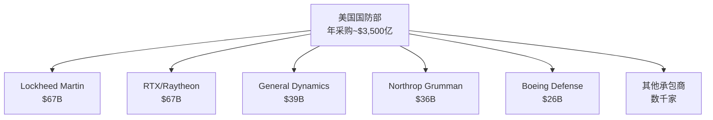

# 国防工业概览 - 政府合同与战略壁垒

## 行业定义与特征

国防工业是为政府军事需求提供武器系统、平台、技术和服务的特殊行业。其核心特征是以政府为唯一或主要客户，受国家安全战略驱动，具有极高的进入壁垒和独特的商业模式。

**行业特殊性**：
- 客户：政府（非市场竞争）
- 定价：谈判/成本加成（非市场定价）
- 需求：战略需求（非消费需求）
- 监管：极严格（出口管制、安全许可）
- 周期性：弱（与经济周期相关性低）

## 行业规模

**全球国防支出**（2023年）：
- 全球总量：约2.2万亿美元
- 美国：约8,580亿美元（占全球39%）
- 中国：约2,240亿美元（第二）
- 俄罗斯：约1,090亿美元（第三）
- 印度：约836亿美元（第四）
- 沙特阿拉伯：约756亿美元（第五）

**美国国防采购**：
- 总采购预算：约3,000-3,500亿美元/年
- 研发预算：约1,000亿美元/年
- 运营维护：约2,500亿美元/年

## 美国国防工业格局

### 五大主承包商

**市场集中度**：
- 前五大：约占国防采购30-35%
- 前十大：约占45-50%
- 高度集中但各有专长

### 各公司专长领域

| 公司 | 核心专长 | 标志性产品 |
|------|---------|-----------|
| Lockheed Martin | 战斗机、导弹防御 | F-35、THAAD |
| RTX | 导弹、发动机、航电 | 爱国者、F135 |
| General Dynamics | 战舰、装甲车、IT | 弗吉尼亚级潜艇、M1坦克 |
| Northrop Grumman | 轰炸机、太空、核武器 | B-21、GBSD |
| Boeing Defense | 军用飞机、直升机 | F/A-18、Apache |

## 商业模式深度解析

### 合同类型

**1. 成本加成合同（Cost-Plus）**

**结构**：
- 政府支付：实际成本 + 固定费用或激励费用
- 承包商风险：低
- 政府风险：高（成本超支）

**适用场景**：
- 研发阶段：技术不确定性高
- 复杂系统：难以预估成本
- 国家安全优先：不能因成本问题停止

**变体**：
- CPFF（成本加固定费用）：最常见
- CPIF（成本加激励费用）：有成本节约激励
- CPAF（成本加奖励费用）：绩效评估

**2. 固定价格合同（Fixed-Price）**

**结构**：
- 政府支付：固定总价
- 承包商风险：高（成本超支自担）
- 政府风险：低

**适用场景**：
- 成熟产品：技术风险低
- 大批量生产：成本可预测
- 政府控制成本：预算压力

**变体**：
- FFP（固定总价）：最严格
- FPI（固定价格激励）：有成本节约分享
- FPAF（固定价格奖励费用）：绩效激励

**3. 时间与材料合同（T&M）**

**结构**：
- 按实际工时和材料计费
- 适用：维护、修理、小型服务

### 采购流程

**1. 需求确定**
- 军方提出需求
- 国防部审批
- 国会授权与拨款

**2. 竞争采购**
- 发布招标书（RFP）
- 承包商提交方案
- 评估与选择

**3. 合同执行**
- 开发阶段：里程碑管理
- 生产阶段：交付管理
- 维护阶段：服务合同

**4. 监督与审计**
- 国防合同审计局（DCAA）
- 国会监督
- GAO审计

### 收入确认

**完工百分比法**：
- 按项目完成进度确认收入
- 里程碑达成
- 成本投入比例

**交付法**：
- 产品交付时确认
- 适用于标准化产品

## 行业驱动因素

### 宏观驱动

**1. 地缘政治紧张**

**当前热点**：
- 俄乌冲突：欧洲国防开支激增
- 中美竞争：印太军事部署
- 中东局势：持续不稳定
- 朝鲜威胁：东北亚紧张

**影响**：
- 美国国防预算：持续增长
- 盟国采购：大幅增加
- 武器出口：创历史新高

**2. 技术军备竞赛**

**新兴技术领域**：
- 高超音速武器：中俄领先，美国追赶
- 人工智能：自主武器系统
- 网络战：新型作战域
- 太空军事化：反卫星武器

**投资影响**：
- 研发预算增加
- 新项目启动
- 现有系统升级

**3. 核武器现代化**

**美国核三位一体更新**：
- 陆基：GBSD/Sentinel（Northrop）
- 海基：哥伦比亚级潜艇（General Dynamics）
- 空基：B-21（Northrop）+ 新型核弹

**规模**：
- 总投资：约1.7万亿美元（30年）
- 年均：约500-600亿美元

### 微观驱动

**1. 老旧装备替换**

**需求**：
- B-52：1955年服役，需要B-21替换
- M1坦克：1980年代，需要升级
- 弗吉尼亚级：持续建造

**2. 盟国采购**

**北约2% GDP目标**：
- 多数成员国未达标
- 俄乌冲突后：加速增加
- 美国武器：首选

**主要采购国**：
- 德国：F-35、潜艇、坦克
- 波兰：F-35、HIMARS、M1坦克
- 日本：F-35、爱国者、HIMARS

**3. 战争消耗补充**

**乌克兰战争影响**：
- 爱国者导弹：大量消耗
- HIMARS火箭弹：持续补充
- 155mm炮弹：产能不足
- 全球库存重建：多年需求

## 投资框架

### 国防股的独特特征

**优势**：
- 稳定现金流：政府合同保障
- 可预测性：积压订单提供可见性
- 非周期性：与经济周期相关性低
- 股息增长：稳定的股东回报
- 通胀保护：合同通常有价格调整

**劣势**：
- 增长有限：政府预算约束
- 政治风险：预算削减
- 监管复杂：出口管制
- 估值倍数：相对科技股低

### 关键投资指标

**1. 订单积压（Backlog）**
- 绝对值：总积压金额
- 相对值：积压/年收入比
- 质量：合同类型、客户集中度

**2. 合同赢率（Win Rate）**
- 竞争性合同赢率
- 独家合同比例
- 新项目获取

**3. 自由现金流**
- FCF/净利润：转化率
- FCF增长趋势
- 资本配置效率

**4. 利润率趋势**
- 营业利润率
- 合同组合变化
- 成本控制能力

**5. 国防预算趋势**
- 美国国防预算增长率
- 采购预算占比
- 优先项目变化

### 估值方法

**P/E估值**：
- 历史区间：15-20倍
- 当前：15-20倍
- 相对科技股：折价

**EV/EBITDA**：
- 历史区间：10-15倍
- 当前：12-15倍

**FCF收益率**：
- 目标：>5%（相对国债有溢价）
- 当前：4-6%

**股息折现模型**：
- 适用：稳定股息增长公司
- 股息增长率：6-10%
- 要求回报率：8-10%

## 风险分析

### 系统性风险

**1. 预算削减**
- 财政赤字：长期压力
- 政治变化：优先级调整
- 自动减支：历史案例

**2. 项目取消**
- 成本超支：固定价格合同
- 技术失败：研发风险
- 战略调整：需求变化

**3. 监管风险**
- 出口管制：ITAR限制
- 反垄断：并购审查
- 审计风险：DCAA

### 公司特定风险

**固定价格合同风险**：
- Boeing KC-46：亏损数十亿
- Northrop B-21：开发阶段风险
- 教训：低价中标，高价执行

**技术风险**：
- 研发失败
- 性能不达标
- 进度延迟

**集中度风险**：
- 单一大项目依赖
- 客户集中（美国政府）
- 地理集中

## 主要公司对比

### 综合评分

| 公司 | 增长性 | 稳定性 | 估值 | 股息 | 综合 |
|------|--------|--------|------|------|------|
| Lockheed Martin | ★★★ | ★★★★★ | ★★★ | ★★★★ | ★★★★ |
| RTX | ★★★★ | ★★★★ | ★★★★ | ★★★ | ★★★★ |
| Northrop Grumman | ★★★★ | ★★★★ | ★★★ | ★★★ | ★★★★ |
| General Dynamics | ★★★ | ★★★★ | ★★★ | ★★★★ | ★★★★ |
| Boeing Defense | ★★ | ★★★ | ★★★ | ★★ | ★★★ |

### 投资组合建议

**核心持仓（稳定性优先）**：
- Lockheed Martin：F-35稳定现金流
- General Dynamics：潜艇+装甲车

**增长持仓（增长性优先）**：
- RTX：导弹需求爆发+商用航空
- Northrop Grumman：B-21量产

**机会性持仓**：
- Boeing：困境反转，高风险高回报

## 关键学习点

**1. 政府合同的独特性**
- 非市场定价：成本加成保障利润
- 长期可见性：积压订单
- 政治风险：预算依赖

**2. 技术壁垒的价值**
- 安全许可：制度性壁垒
- 技术积累：难以复制
- 独家地位：定价权

**3. 周期性管理**
- 国防：反周期配置
- 商用航空：顺周期
- 组合：平衡风险

**4. 现金流质量**
- 政府合同：高质量现金流
- 预付款：改善营运资本
- 稳定性：优于大多数行业

## 参考文献

1. SIPRI. (2023). "Military Expenditure Database".
2. U.S. Department of Defense. (2023). "Budget Request FY2024".
3. Congressional Research Service. (2023). "Defense Primer: U.S. Defense Industry".
4. GAO. (2023). "Defense Acquisitions Annual Assessment".
5. Deloitte. (2023). "2024 Aerospace & Defense Industry Outlook".
6. PwC. (2023). "Aerospace & Defense Deals Insights".
7. McKinsey & Company. (2023). "Aerospace & Defense Outlook".
8. Teal Group. (2023). "World Defense Markets Forecast".
9. Jane's Defence Weekly. (2023). Various articles.
10. Defense News. (2023). "Top 100 Defense Companies".
