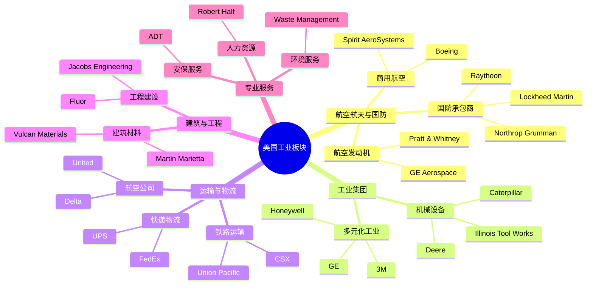
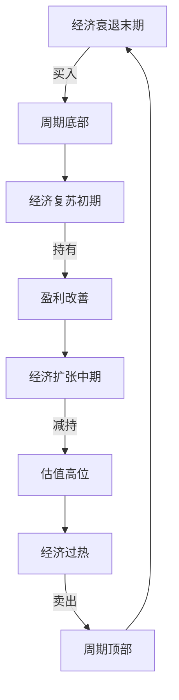

# 美国工业板块总览

## 概述

美国工业板块是全球最发达、最具竞争力的工业体系之一，涵盖航空航天、国防、机械制造、运输物流、建筑工程等多个关键领域。该板块不仅是美国经济的重要支柱，也是全球产业链的核心环节。

**学习目标**：
- 理解美国工业板块的整体结构和特点
- 掌握主要细分行业的投资逻辑
- 分析工业板块的周期性特征
- 识别优质工业企业的关键指标
- 了解技术创新对工业板块的影响

**为什么重要**：
工业板块是经济周期的晴雨表，其表现往往领先或同步于整体经济。理解工业板块对于把握经济周期、进行资产配置至关重要。同时，工业板块中的龙头企业往往具有强大的护城河和定价权，是长期投资的优质标的。

## 板块结构与规模

### 市场规模

美国工业板块在标普500指数中占据重要地位：

**市值占比**：
- 工业板块市值：约3-4万亿美元
- 占标普500比重：8-10%
- 全球工业市值占比：约40-45%

**企业数量**：
- 标普500工业板块：约70-75家公司
- 涵盖多个细分领域
- 从大型跨国集团到专业化企业

### 细分行业结构

### 主要细分领域

**1. 航空航天与国防（Aerospace & Defense）**
- 市值占比：工业板块的30-35%
- 代表企业：Boeing, Lockheed Martin, Raytheon
- 特点：高技术壁垒、长期合同、政府采购

**2. 工业集团（Industrial Conglomerates）**
- 市值占比：20-25%
- 代表企业：Honeywell, 3M, GE
- 特点：多元化业务、全球布局、技术创新

**3. 运输与物流（Transportation & Logistics）**
- 市值占比：20-25%
- 代表企业：UPS, FedEx, Union Pacific
- 特点：网络效应、资本密集、周期性强

**4. 机械设备（Machinery）**
- 市值占比：15-20%
- 代表企业：Caterpillar, Deere, Cummins
- 特点：周期性明显、全球需求、技术升级

**5. 建筑与工程（Construction & Engineering）**
- 市值占比：5-10%
- 代表企业：Fluor, Jacobs Engineering
- 特点：项目制、资金密集、政策敏感

## 板块特征与投资逻辑

### 核心特征

**1. 经济周期敏感性**

工业板块是典型的周期性板块：

**周期性表现**：
- 经济扩张期：工业板块通常跑赢大盘
- 经济衰退期：工业板块通常跑输大盘
- 领先指标：PMI、工业订单、资本开支

**2. 资本密集型特征**

- 高固定资产投资
- 长期研发投入
- 规模效应显著
- 进入壁垒较高

**3. 全球化程度高**

- 国际收入占比：50-70%
- 全球供应链布局
- 汇率影响显著
- 地缘政治敏感

**4. 技术创新驱动**

- 自动化与智能制造
- 新材料应用
- 数字化转型
- 可持续发展技术

### 投资逻辑

**价值驱动因素**：

1. **经济增长预期**
   - GDP增长率
   - 制造业PMI
   - 资本开支趋势

2. **订单与积压**
   - 订单增长率
   - 订单积压（Backlog）
   - 订单/销售比

3. **定价权**
   - 市场份额
   - 品牌价值
   - 技术领先性

4. **运营效率**
   - 产能利用率
   - 运营杠杆
   - 成本控制能力

5. **资本配置**
   - ROIC水平
   - 自由现金流
   - 股东回报政策

## 主要细分行业深度分析

### 航空航天与国防

**行业特点**：

**商用航空**：
- 双寡头格局：Boeing vs Airbus
- 长周期行业：飞机使用寿命20-30年
- 订单积压巨大：通常5-7年交付周期
- 供应链复杂：数千家供应商

**国防工业**：
- 政府采购主导：美国国防预算约8000亿美元
- 长期合同：项目周期10-20年
- 高技术壁垒：先进武器系统
- 稳定现金流：政府信用背书

**投资要点**：
- 关注国防预算趋势
- 监测商用航空需求（客运量、飞机交付）
- 评估技术创新能力（隐身、高超音速）
- 分析合同获取能力

**关键指标**：
- 订单积压/年收入比：通常5-8倍
- 研发投入/收入比：8-12%
- 自由现金流转化率：>80%
- 国防收入占比：稳定性指标

### 工业集团

**商业模式**：

多元化工业集团通过跨行业布局分散风险：

**Honeywell模式**：
- 航空航天：40%收入
- 楼宇科技：30%
- 性能材料：20%
- 安全与生产力：10%

**优势**：
- 风险分散
- 交叉销售机会
- 技术协同
- 全球布局

**挑战**：
- 管理复杂度高
- 估值折价（Conglomerate Discount）
- 资本配置难度大

**投资要点**：
- 评估各业务单元质量
- 关注资本配置能力
- 分析协同效应
- 监测剥离重组动作

### 运输与物流

**快递物流**：

**网络效应**：
- 规模越大，单位成本越低
- 密度经济：同一区域包裹越多，效率越高
- 双边网络：寄件人和收件人网络

**UPS vs FedEx**：
- UPS：地面网络优势，B2C强
- FedEx：航空网络优势，B2B强
- 竞争格局：双寡头+Amazon威胁

**投资要点**：
- 电商增长驱动
- 自动化投资回报
- 定价权（Peak Surcharge）
- Amazon自建物流影响

**铁路运输**：

**特许经营特征**：
- 铁路网络不可复制
- 区域垄断优势
- 监管定价
- 长期资产

**运营指标**：
- Operating Ratio（运营比率）：越低越好，目标<60%
- 货运量增长
- 定价能力
- 资本开支效率

### 机械设备

**Caterpillar（卡特彼勒）**：

**业务结构**：
- 建筑工程：50%
- 资源工业（矿业）：30%
- 能源与运输：20%

**周期性特征**：
- 与全球基建投资高度相关
- 大宗商品价格影响矿业设备需求
- 中国市场重要性：20-25%收入

**竞争优势**：
- 全球经销商网络：最强护城河
- 零部件与服务：高利润率业务（30-40%毛利）
- 品牌价值：工程机械第一品牌
- 融资服务：Cat Financial提供设备融资

**Deere（约翰迪尔）**：

**农业机械龙头**：
- 农业设备：70%收入
- 建筑设备：20%
- 金融服务：10%

**投资逻辑**：
- 农产品价格周期
- 农民收入与购买力
- 精准农业技术（GPS、自动驾驶）
- 设备更新周期

## 财务特征与估值

### 典型财务指标

**盈利能力**：
- 毛利率：20-40%（因细分行业而异）
- 营业利润率：8-15%
- 净利率：5-10%
- ROE：15-25%
- ROIC：10-20%

**资本结构**：
- 资产负债率：40-60%
- 利息覆盖倍数：5-10倍
- 净债务/EBITDA：1-3倍

**现金流特征**：
- 经营现金流/净利润：100-150%
- 自由现金流转化率：60-80%
- 资本开支/收入：3-6%

### 估值方法

**相对估值**：

**市盈率（P/E）**：
- 周期调整PE（CAPE）更合适
- 正常化盈利估值
- 历史PE区间：12-18倍

**EV/EBITDA**：
- 考虑资本结构差异
- 适合比较不同公司
- 合理区间：8-14倍

**市净率（P/B）**：
- 资产密集型行业适用
- 关注ROE水平
- 合理区间：2-4倍

**绝对估值**：

**DCF模型要点**：
- 周期性调整：使用正常化现金流
- 增长率：GDP+1-2%（长期）
- WACC：7-9%
- 终值倍数：EV/EBITDA 8-10倍

**估值驱动因素**：
1. 经济周期位置
2. 订单积压质量
3. 定价权强弱
4. 技术创新能力
5. 资本配置效率

## 投资策略与时机

### 周期性投资策略

**经济周期不同阶段的配置**：

**买入时机**：
- PMI从50以下回升
- 工业订单同比转正
- 估值处于历史低位
- 悲观预期充分反映

**卖出时机**：
- PMI持续高于55
- 产能利用率接近峰值
- 估值处于历史高位
- 成本压力显著上升

### 选股标准

**优质工业企业特征**：

**1. 竞争优势**
- 技术领先性
- 品牌价值
- 网络效应
- 规模优势

**2. 财务健康**
- ROIC > WACC
- 稳定现金流
- 合理负债水平
- 良好资本配置

**3. 管理质量**
- 长期战略清晰
- 运营效率提升
- 股东友好政策
- 透明沟通

**4. 增长潜力**
- 市场份额提升空间
- 新产品/新市场
- 并购整合能力
- 技术创新投入

### 风险因素

**宏观风险**：
- 经济衰退：需求大幅下降
- 贸易摩擦：关税、供应链中断
- 汇率波动：国际收入占比高
- 利率上升：资本开支放缓

**行业风险**：
- 技术替代：新技术颠覆传统业务
- 产能过剩：价格战、利润率下降
- 原材料成本：钢铁、铝、铜价格波动
- 监管变化：环保、安全标准提高

**公司风险**：
- 执行风险：大型项目延期、超支
- 并购整合：协同效应未实现
- 产品质量：召回、安全事故
- 劳资关系：罢工、工会谈判

## 技术创新与未来趋势

### 数字化转型

**工业4.0**：
- 物联网（IoT）：设备互联
- 大数据分析：预测性维护
- 人工智能：优化生产流程
- 数字孪生：虚拟仿真

**影响**：
- 提高运营效率
- 降低维护成本
- 创造新收入来源（软件、服务）
- 改变商业模式

### 可持续发展

**绿色转型**：
- 电动化：电动飞机、电动工程机械
- 氢能源：氢燃料电池应用
- 碳捕获：减排技术
- 循环经济：材料回收利用

**投资机会**：
- 清洁能源设备
- 节能技术
- 环保服务
- ESG评级提升

### 自动化与机器人

**应用领域**：
- 制造自动化
- 仓储物流机器人
- 自动驾驶（卡车、工程机械）
- 无人机（检测、配送）

**影响**：
- 劳动力成本下降
- 生产效率提升
- 安全性改善
- 新业务模式

## 投资案例分析

### 成功案例：Honeywell

**投资亮点**：
- 多元化降低风险
- 高质量业务组合
- 持续技术创新
- 优秀资本配置

**长期表现**：
- 20年年化回报：12-15%
- 持续跑赢标普500
- 股息持续增长
- 估值溢价合理

**关键成功因素**：
- 聚焦高利润率业务
- 剥离低回报业务
- 并购整合能力强
- 管理层执行力

### 教训案例：GE的衰落

**问题根源**：
- 过度多元化
- 金融业务风险
- 并购失败（Alstom）
- 会计问题

**投资教训**：
- 警惕复杂商业模式
- 关注现金流质量
- 评估管理层诚信
- 避免过高估值

## 实战应用

### 分析框架

**工业企业分析清单**：

**1. 行业分析**
- [ ] 行业增长驱动因素
- [ ] 竞争格局与市场份额
- [ ] 进入壁垒与退出壁垒
- [ ] 技术变革影响
- [ ] 监管环境

**2. 公司分析**
- [ ] 竞争优势（护城河）
- [ ] 产品组合与定价权
- [ ] 订单积压与可见性
- [ ] 运营效率指标
- [ ] 资本配置历史

**3. 财务分析**
- [ ] 盈利能力趋势
- [ ] 现金流质量
- [ ] 资本结构健康度
- [ ] ROIC vs WACC
- [ ] 周期调整后估值

**4. 管理层评估**
- [ ] 战略清晰度
- [ ] 执行能力
- [ ] 资本配置记录
- [ ] 股东沟通
- [ ] 激励机制

### 监测指标

**宏观指标**：
- ISM制造业PMI
- 工业生产指数
- 耐用品订单
- 资本开支趋势
- 全球贸易量

**行业指标**：
- 航空客运量（RPK）
- 货运量（FTK）
- 建筑开工数
- 矿业资本开支
- 国防预算

**公司指标**：
- 订单增长率
- 订单积压变化
- 产能利用率
- 定价实现率
- 自由现金流

## 常见误区

**误区1：忽视周期性**
- 错误：在周期顶部高价买入
- 正确：在周期底部逆向投资

**误区2：过度关注短期业绩**
- 错误：因单季度业绩波动频繁交易
- 正确：关注长期趋势和竞争地位

**误区3：忽视资本开支**
- 错误：只看净利润，忽视资本开支需求
- 正确：关注自由现金流和ROIC

**误区4：低估技术变革**
- 错误：认为工业企业不需要创新
- 正确：重视数字化转型和技术投入

**误区5：忽视地缘政治风险**
- 错误：不考虑贸易摩擦、制裁影响
- 正确：评估供应链风险和市场准入

## 延伸阅读

### 推荐书籍

1. **《工业企业分析》** - 行业分析框架
2. **《周期》** - Howard Marks，理解周期性投资
3. **《竞争战略》** - Michael Porter，行业竞争分析
4. **《The Outsiders》** - 优秀CEO的资本配置
5. **《工业4.0》** - 数字化转型趋势

### 研究资源

**行业报告**：
- 各公司年报和投资者日资料
- 行业协会报告（AIA, ATA等）
- 投行研究报告
- 咨询公司行业研究

**数据来源**：
- 美国人口普查局（工业数据）
- ISM（PMI数据）
- FAA（航空数据）
- 各公司IR网站

**分析工具**：
- Bloomberg/FactSet（财务数据）
- Capital IQ（可比公司分析）
- 行业数据库

## 参考文献

1. Porter, M. (1980). *Competitive Strategy*. Free Press.
2. Marks, H. (2018). *Mastering the Market Cycle*. Houghton Mifflin Harcourt.
3. Thorndike, W. (2012). *The Outsiders: Eight Unconventional CEOs*. Harvard Business Review Press.
4. Damodaran, A. (2012). *Investment Valuation*. Wiley.
5. McKinsey & Company. (2020). "The Future of Industrial Manufacturing".
6. Boeing. (2023). *Annual Report*.
7. Honeywell. (2023). *Annual Report*.
8. Caterpillar. (2023). *Annual Report*.
9. UPS. (2023). *Annual Report*.
10. Deloitte. (2023). "Industrial Manufacturing Trends".
11. PwC. (2023). "Aerospace & Defense Industry Outlook".
12. ISM. (2023). "Manufacturing PMI Reports".
13. Federal Reserve. (2023). "Industrial Production and Capacity Utilization".
14. World Bank. (2023). "Global Economic Prospects".
15. IMF. (2023). "World Economic Outlook".
