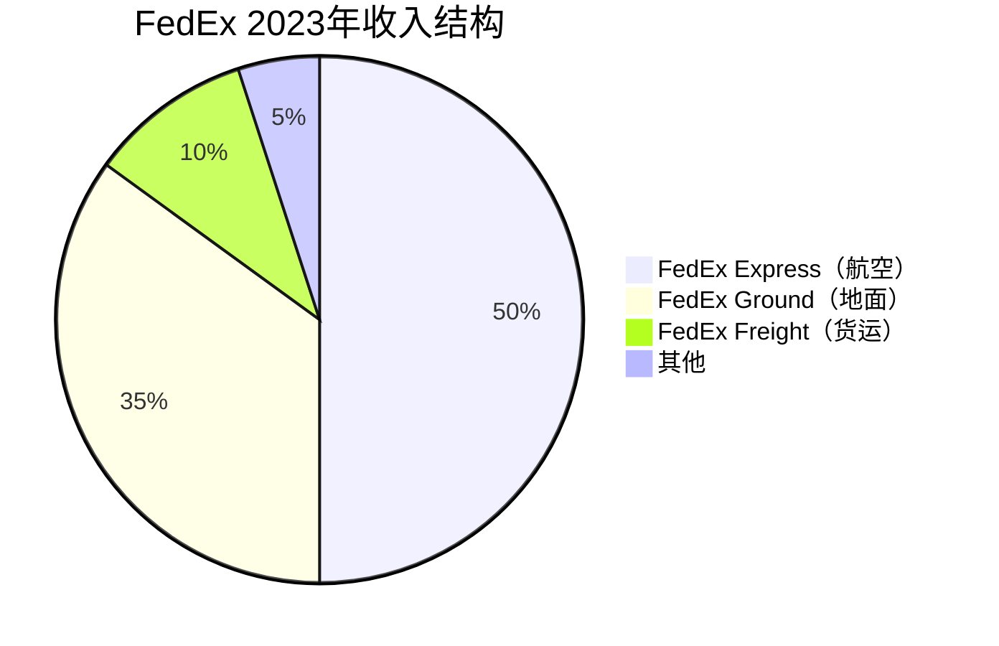

# FedEx - 航空快递帝国的转型之路

## 公司概况

**基本信息**：
- 全称：FedEx Corporation
- 成立时间：1971年（Fred Smith创立）
- 总部：孟菲斯，田纳西州
- 上市时间：1978年（NYSE: FDX）
- 市值：约600-800亿美元
- 员工数：约55万人
- 年收入：约900亿美元

**主营业务**：
FedEx是全球最大的航空快递公司，以"隔夜达"起家，逐步扩展为覆盖航空、地面、货运的综合物流巨头。2022年收购TNT后，国际业务大幅扩张。

**行业地位**：
- 全球最大航空货运网络
- 美国快递市场份额：约25%
- 国际快递：全球前三
- 品牌认知度：极高（"FedEx it"成为动词）

## 公司历史：创新驱动增长

### 创始故事

**Fred Smith的论文**：
- 1965年：耶鲁大学论文提出隔夜快递概念
- 教授评分：C（认为不可行）
- 1971年：创立Federal Express
- 1973年：首次运营，25架飞机，14个城市

**关键创新**：
- 轮辐式网络（Hub-and-Spoke）：孟菲斯为中心
- 隔夜达承诺：改变商业运作方式
- 包裹追踪：1994年推出在线追踪
- 电子商务：早期布局

### 重要里程碑

- 1978年：上市
- 1984年：更名FedEx
- 1989年：收购Flying Tigers（国际扩张）
- 1998年：收购Caliber System（地面网络）
- 2004年：收购Kinko's（后更名FedEx Office）
- 2016年：收购TNT（欧洲扩张，$48亿）
- 2022年：宣布整合计划（DRIVE计划）

## 业务结构深度解析

### 三大业务板块

**1. FedEx Express（航空快递）**

**核心服务**：
- **国内航空**：
  - First Overnight：最早送达
  - Priority Overnight：次日上午
  - Standard Overnight：次日下午
  - 2Day AM / 2Day：两日达

- **国际快递**：
  - International Priority：1-3天
  - International Economy：2-5天
  - International First：次日达（主要城市）

**航空网络**：
- 飞机：约700架（全球最大货运航空公司之一）
- 枢纽：孟菲斯（全球最大货运机场）、印第安纳波利斯、科隆（欧洲）
- 覆盖：220+国家和地区

**客户类型**：
- B2B：企业文件、高价值货物
- 医疗：药品、医疗设备（时间敏感）
- 科技：电子产品、半导体
- 电商：高价值包裹

**收入占比**：约50%
**营业利润率**：约5-7%（相对较低，成本高）

**2. FedEx Ground（地面快递）**

**服务类型**：
- Ground：1-5天，住宅和商业
- Home Delivery：专门住宅配送
- SmartPost：FedEx+USPS合作（低价）

**网络特点**：
- 独立承包商模式（IC）：司机非雇员
- 成本优势：相对UPS（工会）
- 覆盖：美国全境

**与UPS Ground对比**：
- FedEx Ground：独立承包商，成本低
- UPS Ground：直接雇员（Teamsters工会），成本高
- 但：UPS密度更高，效率更高

**收入占比**：约35%
**营业利润率**：约10-12%

**3. FedEx Freight（货运）**

**服务类型**：
- LTL（零担货运）：多货主拼车
- 优先级：Priority（快）、Economy（慢）

**市场地位**：
- 美国LTT市场前三
- 竞争对手：Old Dominion、XPO、Saia

**收入占比**：约10%
**营业利润率**：约12-14%

## DRIVE计划：转型的核心

### 背景：为什么需要转型

**问题诊断**：
- 三个独立网络：Express、Ground、Freight各自运营
- 重复成本：三套设施、车辆、IT系统
- 效率低下：包裹在不同网络间转运
- 利润率：低于UPS

**与UPS的差距**：

| 指标 | FedEx | UPS |
|------|-------|-----|
| 营业利润率 | 6-8% | 10-12% |
| 收入/包裹 | 较低 | 较高 |
| 资本开支/收入 | 较高 | 较低 |
| 自由现金流 | 较低 | 较高 |

### DRIVE计划内容

**目标**：
- 成本削减：40亿美元（2025年）
- 利润率：提升至10%+
- 网络整合：三网合一

**主要措施**：

**1. 网络整合（One FedEx）**
- 将Express、Ground、Freight整合
- 统一品牌：FedEx（去掉子品牌）
- 共享设施：减少重复
- 统一IT：一个系统

**2. 成本削减**
- 裁员：约1万人（管理层）
- 设施整合：关闭重复设施
- 航班优化：减少低效航班
- 车辆优化：提升利用率

**3. 定价优化**
- 聚焦高价值货物
- 减少低利润业务
- 提升收入质量

**进展**（截至2023年）**：
- 成本削减：已实现约20亿美元
- 利润率：从6%提升至8%+
- 整合：进行中

**目标时间线**：
- 2025年：完成主要整合
- 2025年：利润率达10%+
- 长期：与UPS利润率差距缩小

## 与UPS的深度对比

### 战略定位差异

**FedEx**：
- 航空优先：速度与可靠性
- B2B强：企业快递
- 国际：更强（TNT收购）
- 独立承包商：灵活但管理复杂

**UPS**：
- 地面优先：密度与效率
- B2C强：电商包裹
- 国内：更强
- 直接雇员：成本高但管理统一

### 财务对比

| 指标 | FedEx | UPS |
|------|-------|-----|
| 年收入 | ~$900亿 | ~$1,000亿 |
| 营业利润率 | 8-10% | 10-12% |
| 自由现金流 | ~$30-40亿 | ~$50-70亿 |
| 股息收益率 | ~2% | ~3-4% |
| P/E | 12-15倍 | 15-18倍 |

### 竞争优势比较

**FedEx优势**：
- 航空网络：更大、更快
- 国际业务：更强（TNT）
- 独立承包商：成本灵活性
- 转型潜力：利润率提升空间大

**UPS优势**：
- 地面密度：更高
- 利润率：更高
- 现金流：更稳定
- 股息：更高

## 财务分析

### 历史财务表现

**收入增长**（单位：十亿美元）：
- 2018年：$65.5B
- 2019年：$69.7B（+6%）
- 2020年：$69.2B（-1%，疫情初期）
- 2021年：$83.9B（+21%，电商爆发）
- 2022年：$93.5B（+11%）
- 2023年：$90.2B（-4%，需求正常化）

**盈利能力**：
- 营业利润率：6-10%（提升中）
- 净利率：4-7%
- ROIC：8-12%（低于UPS）

### 现金流分析

**经营现金流**：
- 年度：约60-70亿美元
- 稳定性：中等
- 增长性：DRIVE计划驱动

**自由现金流**：
- 年度：约30-40亿美元
- 资本开支：约30-35亿美元/年（高）
- FCF/收入：约3-4%（低于UPS）

**资本开支高的原因**：
- 航空网络：飞机、设施
- 网络整合：IT投资
- 自动化：分拣设施

**DRIVE计划后**：
- 资本开支：下降至$25-28亿
- FCF：提升至$50-60亿
- FCF收益率：大幅改善

### 资本结构

**债务水平**：
- 总债务：约200-220亿美元
- 净债务：约150-170亿美元
- 净债务/EBITDA：约2.0-2.5倍

**信用评级**：
- 标普：BBB
- 穆迪：Baa2
- 稳定展望

## 投资论点

### 看多理由

**1. DRIVE计划利润率提升**

**逻辑**：
- 当前利润率：8%（低于UPS的12%）
- 目标：10%+（2025年）
- 差距缩小：估值重估

**量化影响**：
- 收入$900亿 × 利润率提升2% = 额外$18亿利润
- P/E 15倍 × $18亿 = 市值提升$270亿
- 当前市值约$700亿：潜在提升40%

**2. 估值折价修复**

**当前折价**：
- FedEx P/E：12-15倍
- UPS P/E：15-18倍
- 折价：约20-25%

**修复逻辑**：
- DRIVE计划成功：利润率接近UPS
- 估值折价缩小
- 股价重估

**3. 国际业务增长**

**TNT整合完成**：
- 欧洲网络：整合完成
- 协同效应：逐步实现
- 国际利润率：提升

**跨境电商**：
- 全球电商增长
- 国际包裹需求
- FedEx国际优势

**4. 资本开支下降**

**DRIVE计划**：
- 资本开支：从$35亿降至$25亿
- FCF：大幅提升
- 股东回报：增加

**5. 医疗物流增长**

**FedEx Healthcare**：
- 温控物流：药品、疫苗
- 高增长：医疗支出增加
- 高利润率：专业服务

### 风险因素

**1. DRIVE计划执行风险**

**挑战**：
- 文化整合：三个独立文化
- IT整合：复杂系统
- 客户影响：服务中断风险

**历史教训**：
- TNT整合：比预期困难
- 成本超支：可能

**2. Amazon威胁**

**Amazon Logistics**：
- 快速增长：市场份额提升
- FedEx依赖：Amazon曾是大客户
- 2019年：FedEx主动终止Amazon合同

**影响**：
- 失去Amazon业务：约10%收入
- 需要替代：其他客户

**3. 独立承包商模式风险**

**法律风险**：
- 加州AB5：独立承包商认定
- 诉讼：司机分类争议
- 成本：可能转为雇员

**4. 经济周期性**

**B2B敏感**：
- 企业快递：经济衰退时下降
- 工业货物：周期性强
- 历史：2008-2009年大幅下滑

**5. 燃油成本**

**航空网络**：
- 燃油占成本：约15-20%
- 油价波动：影响利润率
- 对冲：部分对冲

## 估值分析

### DCF估值

**DRIVE计划完成后假设**：
- 收入：约$950亿（2025年）
- 营业利润率：10%
- FCF：约$55亿

**DCF估值**：
- 正常化FCF：$55亿
- 增长率：3-4%
- WACC：8%
- 估值：$220-260/股

### 相对估值

**当前折价**：
- FedEx P/E：12-15倍
- 目标P/E（DRIVE完成后）：15-17倍
- 估值提升：20-30%

**EV/EBITDA**：
- 当前：8-10倍
- 目标：10-12倍

### 催化剂

**短期**：
- 季度利润率超预期
- DRIVE计划里程碑
- 资本开支下降确认

**中期**：
- 2025年目标达成
- 估值重估
- 股息提升

## 投资策略

### 适合投资者类型

**价值投资者**：
- 相对UPS折价
- 转型潜力
- 合理估值

**事件驱动型**：
- DRIVE计划进展
- 季度业绩改善
- 估值重估

**中期投资者**：
- 持有期：2-3年
- 等待DRIVE计划完成
- 估值修复

### 持有策略

**监测指标**：
- 营业利润率（季度）
- 资本开支趋势
- 包裹量与定价
- DRIVE计划里程碑
- 自由现金流

**买入逻辑**：
- 利润率改善趋势确认
- 估值折价相对UPS
- FCF收益率 > 5%

**卖出信号**：
- DRIVE计划失败
- 利润率停滞
- 估值与UPS持平

## 关键学习点

**1. 转型投资的机会与风险**
- 折价：反映执行风险
- 成功转型：巨大回报
- 失败：持续折价

**2. 网络整合的复杂性**
- 三网合一：文化、IT、运营
- 时间：比预期长
- 成本：比预期高

**3. 独立承包商模式的利弊**
- 优势：成本灵活性
- 劣势：管理复杂、法律风险
- 趋势：监管收紧

**4. 与竞争对手的对比分析**
- 相对估值：发现折价机会
- 运营指标：找出差距
- 转型路径：评估可行性

## 参考文献

1. FedEx Corporation. (2023). *Annual Report*.
2. FedEx Corporation. (2023). "DRIVE Transformation Update".
3. Pitney Bowes. (2023). "Parcel Shipping Index".
4. Morgan Stanley. (2023). "FedEx Analysis".
5. Bernstein Research. (2023). "FedEx vs UPS Comparison".
6. Wolfe Research. (2023). "Transportation Industry Report".
7. McKinsey & Company. (2023). "Future of Logistics".
8. Wall Street Journal. (2023). "FedEx DRIVE Coverage".
9. Supply Chain Dive. (2023). Various articles.
10. Aviation Week. (2023). "FedEx Air Network".
11. Deloitte. (2023). "Transportation & Logistics Trends".
12. Fred Smith. (2023). Various interviews and presentations.
